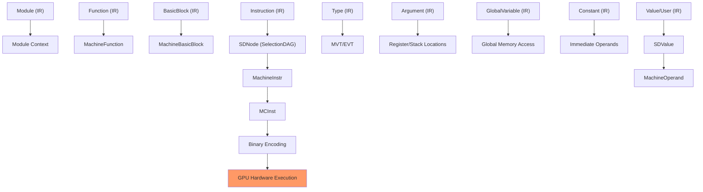

# AMDGPU后端Pass中使用的对象类型

除了您提到的 `Module`、`Function`、`BasicBlock`、`Instruction`、`Argument`、`GlobalVariable` 之外，AMDGPU后端pass中还使用了大量其他的LLVM IR对象类型。我将按照类型层次结构进行分类说明：

## 1. **基础类型层次结构**

### Value、User、Use
<a name="ref-block_2"></a>- **`Value`** - 所有LLVM值的基类，表示程序中计算出的任何值 llvm-project:62-75[<sup>↗</sup>](#block_2) 

<a name="ref-block_3"></a>- **`User`** - 继承自Value，表示使用其他值的对象（如指令、常量表达式） llvm-project:44-44[<sup>↗</sup>](#block_3) 

<a name="ref-block_0"></a>- **`Use`** - 表示User和Value之间的使用关系边 llvm-project:20-20[<sup>↗</sup>](#block_0) 

<a name="ref-block_5"></a>在AMDGPU代码中可以看到这些类型的使用： llvm-project:42-48[<sup>↗</sup>](#block_5) 

## 2. **常量类型（Constant及其子类）**

### Constant基类
<a name="ref-block_7"></a>- **`Constant`** - 所有常量值的基类，表示编译时已知的不可变值 llvm-project:27-43[<sup>↗</sup>](#block_7) 

### 具体常量类型
- **`ConstantInt`** - 整数常量
- **`ConstantFP`** - 浮点数常量  
<a name="ref-block_8"></a>- **`ConstantData`** - 无操作数的常量基类 llvm-project:48-81[<sup>↗</sup>](#block_8) llvm-project:84-100 

<a name="ref-block_4"></a>AMDGPU代码中使用Constant和ConstantInt的示例： llvm-project:29-31[<sup>↗</sup>](#block_4) llvm-project:70-73 

## 3. **具体指令类型（Instruction的子类）**

### 内存操作指令
<a name="ref-block_10"></a>- **`AllocaInst`** - 栈内存分配指令 llvm-project:61-65[<sup>↗</sup>](#block_10) 

<a name="ref-block_11"></a>- **`LoadInst`** - 内存加载指令 llvm-project:176-181[<sup>↗</sup>](#block_11) 

<a name="ref-block_12"></a>- **`StoreInst`** - 内存存储指令 llvm-project:293-297[<sup>↗</sup>](#block_12) 

- **`GetElementPtrInst`** - 地址计算指令

### 控制流指令
- **`BranchInst`** - 分支指令
- **`SwitchInst`** - 多路分支指令
- **`ReturnInst`** - 函数返回指令
- **`CallInst`** - 函数调用指令
- **`InvokeInst`** - 带异常处理的函数调用指令

### 其他重要指令
- **`PHINode`** - PHI节点，用于合并不同控制流路径的值
- **`SelectInst`** - 条件选择指令
- **`CmpInst`** - 比较指令
- **`BinaryOperator`** - 二元运算指令
- **`UnaryOperator`** - 一元运算指令
- **`CastInst`** - 类型转换指令

### 指令基类
<a name="ref-block_13"></a>- **`UnaryInstruction`** - 单操作数指令的基类 llvm-project:55-88[<sup>↗</sup>](#block_13) 

## 4. **内置函数相关**

<a name="ref-block_14"></a>- **`IntrinsicInst`** - 内置函数调用的包装类，所有内置函数调用都是CallInst的实例 llvm-project:46-59[<sup>↗</sup>](#block_14) 

<a name="ref-block_16"></a>在AMDGPU代码中可以看到IntrinsicInst的引用： llvm-project:38-40[<sup>↗</sup>](#block_16) 

## 5. **类型系统（Type及其子类）**

<a name="ref-block_18"></a>- **`Type`** - 类型系统的基类 llvm-project:37-79[<sup>↗</sup>](#block_18) 

具体类型包括：
- **`IntegerType`** - 整数类型
- **`PointerType`** - 指针类型
- **`FunctionType`** - 函数类型
- **`StructType`** - 结构体类型
- **`ArrayType`** - 数组类型
- **`VectorType`** (包括FixedVectorType和ScalableVectorType) - 向量类型

## 6. **全局对象**

- **`GlobalValue`** - 全局值的基类
- **`GlobalObject`** - 全局对象的基类
- **`GlobalAlias`** - 全局别名
<a name="ref-block_1"></a>- **`GlobalIFunc`** - 间接函数 llvm-project:32-44[<sup>↗</sup>](#block_1) 

<a name="ref-block_19"></a>在AMDGPU代码中，GlobalVariable的使用示例： llvm-project:20-21[<sup>↗</sup>](#block_19) 

## 7. **辅助工具类**

<a name="ref-block_15"></a>- **`IRBuilder`** - 用于方便地创建和插入IR指令的构建器类 llvm-project:37-37[<sup>↗</sup>](#block_15) 

- **`LLVMContext`** - LLVM上下文，管理类型和常量的唯一性
- **`DataLayout`** - 描述目标平台的数据布局信息

## 8. **元数据相关**

- **`Metadata`** - 元数据基类
- **`MDNode`** - 元数据节点
<a name="ref-block_17"></a>- **`MDBuilder`** - 元数据构建器 llvm-project:41-41[<sup>↗</sup>](#block_17) 

## 9. **Pass管理相关**

在AMDGPU的pass注册中，可以看到不同层次的pass类型：
- **MODULE_PASS** - 模块级pass
- **FUNCTION_PASS** - 函数级pass  
- **MACHINE_FUNCTION_PASS** - 机器函数级pass（后端特有）
<a name="ref-block_20"></a>- **FUNCTION_ANALYSIS** - 函数级分析pass llvm-project:16-140[<sup>↗</sup>](#block_20) 

## Notes

这些对象类型在LLVM IR的类型层次结构中形成了清晰的继承关系。在AMDGPU后端pass的实现中，这些类型被广泛使用来遍历、分析和转换IR。特别需要注意的是：

1. **Value是最基础的类**，几乎所有IR对象都继承自它
2. **User表示"使用者"**，即那些包含操作数的对象
3. **Instruction的各种子类**提供了具体的指令操作
4. **Type系统**描述了所有值的类型信息
5. **Constant子类**表示编译时已知的常量值

在编写AMDGPU后端pass时，通常需要使用`dyn_cast<>`、`isa<>`等LLVM的类型转换工具来安全地在这些类型之间进行转换和判断。


### Citations


<a name="block_0"></a>**File:** llvm/include/llvm/IR/Value.h (L20-20) [<sup>↩</sup>](#ref-block_0) [<sup>↩</sup>](#ref-block_0)

```text
#include "llvm/IR/Use.h"
```

<a name="block_1"></a>**File:** llvm/include/llvm/IR/Value.h (L32-44) [<sup>↩</sup>](#ref-block_1)

```text
class Argument;
class BasicBlock;
class Constant;
class ConstantData;
class ConstantAggregate;
class DataLayout;
class Function;
class GlobalAlias;
class GlobalIFunc;
class GlobalObject;
class GlobalValue;
class GlobalVariable;
class InlineAsm;
```

<a name="block_2"></a>**File:** llvm/include/llvm/IR/Value.h (L62-75) [<sup>↩</sup>](#ref-block_2) [<sup>↩</sup>](#ref-block_2)

```text
/// LLVM Value Representation
///
/// This is a very important LLVM class. It is the base class of all values
/// computed by a program that may be used as operands to other values. Value is
/// the super class of other important classes such as Instruction and Function.
/// All Values have a Type. Type is not a subclass of Value. Some values can
/// have a name and they belong to some Module.  Setting the name on the Value
/// automatically updates the module's symbol table.
///
/// Every value has a "use list" that keeps track of which other Values are
/// using this Value.  A Value can also have an arbitrary number of ValueHandle
/// objects that watch it and listen to RAUW and Destroy events.  See
/// llvm/IR/ValueHandle.h for details.
class Value {
```

<a name="block_3"></a>**File:** llvm/include/llvm/IR/User.h (L44-44) [<sup>↩</sup>](#ref-block_3) [<sup>↩</sup>](#ref-block_3)

```text
class User : public Value {
```

<a name="block_4"></a>**File:** llvm/lib/Target/AMDGPU/AMDGPUExpandFeaturePredicates.cpp (L29-31) [<sup>↩</sup>](#ref-block_4)

```cpp
#include "llvm/Analysis/ConstantFolding.h"
#include "llvm/IR/Constants.h"
#include "llvm/IR/Function.h"
```

<a name="block_5"></a>**File:** llvm/lib/Target/AMDGPU/AMDGPUExpandFeaturePredicates.cpp (L42-48) [<sup>↩</sup>](#ref-block_5)

```cpp
template <typename C> void collectUsers(Value *V, C &Container) {
  assert(V && "Must pass an existing Value!");

  for (auto &&U : V->users())
    if (auto *I = dyn_cast<Instruction>(U))
      Container.insert(Container.end(), I);
}
```

<a name="block_6"></a>**File:** llvm/lib/Target/AMDGPU/AMDGPUExpandFeaturePredicates.cpp (L70-73)

```cpp
  if (IsFeature)
    P->setInitializer(ConstantInt::getBool(PTy, ST.checkFeatures(PV)));
  else
    P->setInitializer(ConstantInt::getBool(PTy, PV == ST.getCPU()));
```

<a name="block_7"></a>**File:** llvm/include/llvm/IR/Constant.h (L27-43) [<sup>↩</sup>](#ref-block_7)

```text
/// of all constant values in an LLVM program. A constant is a value that is
/// immutable at runtime. Functions are constants because their address is
/// immutable. Same with global variables.
///
/// All constants share the capabilities provided in this class. All constants
/// can have a null value. They can have an operand list. Constants can be
/// simple (integer and floating point values), complex (arrays and structures),
/// or expression based (computations yielding a constant value composed of
/// only certain operators and other constant values).
///
/// Note that Constants are immutable (once created they never change)
/// and are fully shared by structural equivalence.  This means that two
/// structurally equivalent constants will always have the same address.
/// Constants are created on demand as needed and never deleted: thus clients
/// don't have to worry about the lifetime of the objects.
/// LLVM Constant Representation
class Constant : public User {
```

<a name="block_8"></a>**File:** llvm/include/llvm/IR/Constants.h (L48-81) [<sup>↩</sup>](#ref-block_8)

```text
/// Base class for constants with no operands.
///
/// These constants have no operands; they represent their data directly.
/// Since they can be in use by unrelated modules (and are never based on
/// GlobalValues), it never makes sense to RAUW them.
///
/// These do not have use lists. It is illegal to inspect the uses. These behave
/// as if they have no uses (i.e. use_empty() is always true).
class ConstantData : public Constant {
  constexpr static IntrusiveOperandsAllocMarker AllocMarker{0};

  friend class Constant;

  Value *handleOperandChangeImpl(Value *From, Value *To) {
    llvm_unreachable("Constant data does not have operands!");
  }

protected:
  explicit ConstantData(Type *Ty, ValueTy VT) : Constant(Ty, VT, AllocMarker) {}

  void *operator new(size_t S) { return User::operator new(S, AllocMarker); }

public:
  void operator delete(void *Ptr) { User::operator delete(Ptr); }

  ConstantData(const ConstantData &) = delete;

  /// Methods to support type inquiry through isa, cast, and dyn_cast.
  static bool classof(const Value *V) {
    static_assert(Value::ConstantDataFirstVal == 0,
                  "V->getValueID() >= Value::ConstantDataFirstVal");
    return V->getValueID() <= ConstantDataLastVal;
  }
};
```

<a name="block_9"></a>**File:** llvm/include/llvm/IR/Constants.h (L84-100)

```text
/// This is the shared class of boolean and integer constants. This class
/// represents both boolean and integral constants.
/// Class for constant integers.
class ConstantInt final : public ConstantData {
  friend class Constant;
  friend class ConstantVector;

  APInt Val;

  ConstantInt(Type *Ty, const APInt &V);

  void destroyConstantImpl();

  /// Return a ConstantInt with the specified value and an implied Type. The
  /// type is the vector type whose integer element type corresponds to the bit
  /// width of the value.
  static ConstantInt *get(LLVMContext &Context, ElementCount EC,
```

<a name="block_10"></a>**File:** llvm/include/llvm/IR/Instructions.h (L61-65) [<sup>↩</sup>](#ref-block_10)

```text
//                                AllocaInst Class
//===----------------------------------------------------------------------===//

/// an instruction to allocate memory on the stack
class AllocaInst : public UnaryInstruction {
```

<a name="block_11"></a>**File:** llvm/include/llvm/IR/Instructions.h (L176-181) [<sup>↩</sup>](#ref-block_11)

```text
//                                LoadInst Class
//===----------------------------------------------------------------------===//

/// An instruction for reading from memory. This uses the SubclassData field in
/// Value to store whether or not the load is volatile.
class LoadInst : public UnaryInstruction {
```

<a name="block_12"></a>**File:** llvm/include/llvm/IR/Instructions.h (L293-297) [<sup>↩</sup>](#ref-block_12)

```text
//                                StoreInst Class
//===----------------------------------------------------------------------===//

/// An instruction for storing to memory.
class StoreInst : public Instruction {
```

<a name="block_13"></a>**File:** llvm/include/llvm/IR/InstrTypes.h (L55-88) [<sup>↩</sup>](#ref-block_13)

```text
//                          UnaryInstruction Class
//===----------------------------------------------------------------------===//

class UnaryInstruction : public Instruction {
  constexpr static IntrusiveOperandsAllocMarker AllocMarker{1};

protected:
  UnaryInstruction(Type *Ty, unsigned iType, Value *V,
                   InsertPosition InsertBefore = nullptr)
      : Instruction(Ty, iType, AllocMarker, InsertBefore) {
    Op<0>() = V;
  }

public:
  // allocate space for exactly one operand
  void *operator new(size_t S) { return User::operator new(S, AllocMarker); }
  void operator delete(void *Ptr) { User::operator delete(Ptr); }

  /// Transparently provide more efficient getOperand methods.
  DECLARE_TRANSPARENT_OPERAND_ACCESSORS(Value);

  // Methods for support type inquiry through isa, cast, and dyn_cast:
  static bool classof(const Instruction *I) {
    return I->isUnaryOp() || I->getOpcode() == Instruction::Alloca ||
           I->getOpcode() == Instruction::Load ||
           I->getOpcode() == Instruction::VAArg ||
           I->getOpcode() == Instruction::ExtractValue ||
           I->getOpcode() == Instruction::Freeze ||
           (I->getOpcode() >= CastOpsBegin && I->getOpcode() < CastOpsEnd);
  }
  static bool classof(const Value *V) {
    return isa<Instruction>(V) && classof(cast<Instruction>(V));
  }
};
```

<a name="block_14"></a>**File:** llvm/include/llvm/IR/IntrinsicInst.h (L46-59) [<sup>↩</sup>](#ref-block_14)

```text
/// A wrapper class for inspecting calls to intrinsic functions.
/// This allows the standard isa/dyncast/cast functionality to work with calls
/// to intrinsic functions.
class IntrinsicInst : public CallInst {
public:
  IntrinsicInst() = delete;
  IntrinsicInst(const IntrinsicInst &) = delete;
  IntrinsicInst &operator=(const IntrinsicInst &) = delete;

  /// Return the intrinsic ID of this intrinsic.
  Intrinsic::ID getIntrinsicID() const {
    return cast<Function>(getCalledOperand())->getIntrinsicID();
  }

```

<a name="block_15"></a>**File:** llvm/lib/Target/AMDGPU/SIISelLowering.cpp (L37-37) [<sup>↩</sup>](#ref-block_15)

```cpp
#include "llvm/IR/IRBuilder.h"
```

<a name="block_16"></a>**File:** llvm/lib/Target/AMDGPU/SIISelLowering.cpp (L38-40) [<sup>↩</sup>](#ref-block_16)

```cpp
#include "llvm/IR/IntrinsicInst.h"
#include "llvm/IR/IntrinsicsAMDGPU.h"
#include "llvm/IR/IntrinsicsR600.h"
```

<a name="block_17"></a>**File:** llvm/lib/Target/AMDGPU/SIISelLowering.cpp (L41-41) [<sup>↩</sup>](#ref-block_17)

```cpp
#include "llvm/IR/MDBuilder.h"
```

<a name="block_18"></a>**File:** llvm/include/llvm/IR/Type.h (L37-79) [<sup>↩</sup>](#ref-block_18)

```text
/// The instances of the Type class are immutable: once they are created,
/// they are never changed.  Also note that only one instance of a particular
/// type is ever created.  Thus seeing if two types are equal is a matter of
/// doing a trivial pointer comparison. To enforce that no two equal instances
/// are created, Type instances can only be created via static factory methods
/// in class Type and in derived classes.  Once allocated, Types are never
/// free'd.
///
class Type {
public:
  //===--------------------------------------------------------------------===//
  /// Definitions of all of the base types for the Type system.  Based on this
  /// value, you can cast to a class defined in DerivedTypes.h.
  /// Note: If you add an element to this, you need to add an element to the
  /// Type::getPrimitiveType function, or else things will break!
  /// Also update LLVMTypeKind and LLVMGetTypeKind () in the C binding.
  ///
  enum TypeID {
    // PrimitiveTypes
    HalfTyID = 0,  ///< 16-bit floating point type
    BFloatTyID,    ///< 16-bit floating point type (7-bit significand)
    FloatTyID,     ///< 32-bit floating point type
    DoubleTyID,    ///< 64-bit floating point type
    X86_FP80TyID,  ///< 80-bit floating point type (X87)
    FP128TyID,     ///< 128-bit floating point type (112-bit significand)
    PPC_FP128TyID, ///< 128-bit floating point type (two 64-bits, PowerPC)
    VoidTyID,      ///< type with no size
    LabelTyID,     ///< Labels
    MetadataTyID,  ///< Metadata
    X86_AMXTyID,   ///< AMX vectors (8192 bits, X86 specific)
    TokenTyID,     ///< Tokens

    // Derived types... see DerivedTypes.h file.
    IntegerTyID,        ///< Arbitrary bit width integers
    FunctionTyID,       ///< Functions
    PointerTyID,        ///< Pointers
    StructTyID,         ///< Structures
    ArrayTyID,          ///< Arrays
    FixedVectorTyID,    ///< Fixed width SIMD vector type
    ScalableVectorTyID, ///< Scalable SIMD vector type
    TypedPointerTyID,   ///< Typed pointer used by some GPU targets
    TargetExtTyID,      ///< Target extension type
  };
```

<a name="block_19"></a>**File:** llvm/lib/Target/AMDGPU/Utils/AMDGPUBaseInfo.cpp (L20-21) [<sup>↩</sup>](#ref-block_19)

```cpp
#include "llvm/IR/GlobalValue.h"
#include "llvm/IR/IntrinsicsAMDGPU.h"
```

<a name="block_20"></a>**File:** llvm/lib/Target/AMDGPU/AMDGPUPassRegistry.def (L16-140) [<sup>↩</sup>](#ref-block_20)

```text
#ifndef MODULE_PASS
#define MODULE_PASS(NAME, CREATE_PASS)
#endif
MODULE_PASS("amdgpu-expand-feature-predicates",
            AMDGPUExpandFeaturePredicatesPass(*this))
MODULE_PASS("amdgpu-always-inline", AMDGPUAlwaysInlinePass())
MODULE_PASS("amdgpu-export-kernel-runtime-handles", AMDGPUExportKernelRuntimeHandlesPass())
MODULE_PASS("amdgpu-lower-buffer-fat-pointers",
            AMDGPULowerBufferFatPointersPass(*this))
MODULE_PASS("amdgpu-lower-ctor-dtor", AMDGPUCtorDtorLoweringPass())
MODULE_PASS("amdgpu-lower-module-lds", AMDGPULowerModuleLDSPass(*this))
MODULE_PASS("amdgpu-perf-hint",
            AMDGPUPerfHintAnalysisPass(
              *static_cast<const GCNTargetMachine *>(this)))
MODULE_PASS("amdgpu-preload-kernel-arguments", AMDGPUPreloadKernelArgumentsPass(*this))
MODULE_PASS("amdgpu-printf-runtime-binding", AMDGPUPrintfRuntimeBindingPass())
MODULE_PASS("amdgpu-remove-incompatible-functions", AMDGPURemoveIncompatibleFunctionsPass(*this))
MODULE_PASS("amdgpu-sw-lower-lds", AMDGPUSwLowerLDSPass(*this))
MODULE_PASS("amdgpu-unify-metadata", AMDGPUUnifyMetadataPass())
MODULE_PASS("amdgpu-expand-feature-predicates",
            AMDGPUExpandFeaturePredicatesPass(*this))
#undef MODULE_PASS

#ifndef MODULE_PASS_WITH_PARAMS
#define MODULE_PASS_WITH_PARAMS(NAME, CLASS, CREATE_PASS, PARSER, PARAMS)
#endif
MODULE_PASS_WITH_PARAMS(
    "amdgpu-attributor", "AMDGPUAttributorPass",
    [=](AMDGPUAttributorOptions Options) {
      return AMDGPUAttributorPass(*this, Options);
    },
    parseAMDGPUAttributorPassOptions, "closed-world")
#undef MODULE_PASS_WITH_PARAMS

#ifndef FUNCTION_PASS
#define FUNCTION_PASS(NAME, CREATE_PASS)
#endif
FUNCTION_PASS("amdgpu-annotate-uniform", AMDGPUAnnotateUniformValuesPass())
FUNCTION_PASS("amdgpu-codegenprepare", AMDGPUCodeGenPreparePass(*this))
FUNCTION_PASS("amdgpu-image-intrinsic-opt",
              AMDGPUImageIntrinsicOptimizerPass(*this))
FUNCTION_PASS("amdgpu-late-codegenprepare",
              AMDGPULateCodeGenPreparePass(
                *static_cast<const GCNTargetMachine *>(this)))
FUNCTION_PASS("amdgpu-lower-kernel-arguments",
              AMDGPULowerKernelArgumentsPass(*this))
FUNCTION_PASS("amdgpu-lower-kernel-attributes",
              AMDGPULowerKernelAttributesPass())
FUNCTION_PASS("amdgpu-promote-alloca", AMDGPUPromoteAllocaPass(*this))
FUNCTION_PASS("amdgpu-promote-alloca-to-vector",
              AMDGPUPromoteAllocaToVectorPass(*this))
FUNCTION_PASS("amdgpu-promote-kernel-arguments",
              AMDGPUPromoteKernelArgumentsPass())
FUNCTION_PASS("amdgpu-rewrite-undef-for-phi", AMDGPURewriteUndefForPHIPass())
FUNCTION_PASS("amdgpu-simplifylib", AMDGPUSimplifyLibCallsPass())
FUNCTION_PASS("amdgpu-unify-divergent-exit-nodes",
              AMDGPUUnifyDivergentExitNodesPass())
FUNCTION_PASS("amdgpu-usenative", AMDGPUUseNativeCallsPass())
FUNCTION_PASS("si-annotate-control-flow", SIAnnotateControlFlowPass(*static_cast<const GCNTargetMachine *>(this)))
#undef FUNCTION_PASS

#ifndef FUNCTION_ANALYSIS
#define FUNCTION_ANALYSIS(NAME, CREATE_PASS)
#endif

#ifndef FUNCTION_ALIAS_ANALYSIS
#define FUNCTION_ALIAS_ANALYSIS(NAME, CREATE_PASS)                             \
  FUNCTION_ANALYSIS(NAME, CREATE_PASS)
#endif
FUNCTION_ALIAS_ANALYSIS("amdgpu-aa", AMDGPUAA())
#undef FUNCTION_ALIAS_ANALYSIS
#undef FUNCTION_ANALYSIS

#ifndef FUNCTION_PASS_WITH_PARAMS
#define FUNCTION_PASS_WITH_PARAMS(NAME, CLASS, CREATE_PASS, PARSER, PARAMS)
#endif
FUNCTION_PASS_WITH_PARAMS(
    "amdgpu-atomic-optimizer",
    "AMDGPUAtomicOptimizerPass",
    [=](ScanOptions Strategy) {
      return AMDGPUAtomicOptimizerPass(*this, Strategy);
    },
    parseAMDGPUAtomicOptimizerStrategy, "strategy=dpp|iterative|none")
#undef FUNCTION_PASS_WITH_PARAMS

#ifndef MACHINE_FUNCTION_PASS
#define MACHINE_FUNCTION_PASS(NAME, CREATE_PASS)
#endif
MACHINE_FUNCTION_PASS("amdgpu-insert-delay-alu", AMDGPUInsertDelayAluPass())
MACHINE_FUNCTION_PASS("amdgpu-isel", AMDGPUISelDAGToDAGPass(*this))
MACHINE_FUNCTION_PASS("amdgpu-mark-last-scratch-load", AMDGPUMarkLastScratchLoadPass())
MACHINE_FUNCTION_PASS("amdgpu-pre-ra-long-branch-reg", GCNPreRALongBranchRegPass())
MACHINE_FUNCTION_PASS("amdgpu-reserve-wwm-regs", AMDGPUReserveWWMRegsPass())
MACHINE_FUNCTION_PASS("amdgpu-rewrite-agpr-copy-mfma", AMDGPURewriteAGPRCopyMFMAPass())
MACHINE_FUNCTION_PASS("amdgpu-rewrite-partial-reg-uses", GCNRewritePartialRegUsesPass())
MACHINE_FUNCTION_PASS("amdgpu-set-wave-priority", AMDGPUSetWavePriorityPass())
MACHINE_FUNCTION_PASS("amdgpu-pre-ra-optimizations", GCNPreRAOptimizationsPass())
MACHINE_FUNCTION_PASS("amdgpu-preload-kern-arg-prolog", AMDGPUPreloadKernArgPrologPass())
MACHINE_FUNCTION_PASS("amdgpu-nsa-reassign", GCNNSAReassignPass())
MACHINE_FUNCTION_PASS("gcn-create-vopd", GCNCreateVOPDPass())
MACHINE_FUNCTION_PASS("gcn-dpp-combine", GCNDPPCombinePass())
MACHINE_FUNCTION_PASS("si-fix-sgpr-copies", SIFixSGPRCopiesPass())
MACHINE_FUNCTION_PASS("si-fix-vgpr-copies", SIFixVGPRCopiesPass())
MACHINE_FUNCTION_PASS("si-fold-operands", SIFoldOperandsPass());
MACHINE_FUNCTION_PASS("si-form-memory-clauses", SIFormMemoryClausesPass())
MACHINE_FUNCTION_PASS("si-i1-copies", SILowerI1CopiesPass())
MACHINE_FUNCTION_PASS("si-insert-hard-clauses", SIInsertHardClausesPass())
MACHINE_FUNCTION_PASS("si-insert-waitcnts", SIInsertWaitcntsPass())
MACHINE_FUNCTION_PASS("si-late-branch-lowering", SILateBranchLoweringPass())
MACHINE_FUNCTION_PASS("si-load-store-opt", SILoadStoreOptimizerPass())
MACHINE_FUNCTION_PASS("si-lower-control-flow", SILowerControlFlowPass())
MACHINE_FUNCTION_PASS("si-lower-sgpr-spills", SILowerSGPRSpillsPass())
MACHINE_FUNCTION_PASS("si-lower-wwm-copies", SILowerWWMCopiesPass())
MACHINE_FUNCTION_PASS("si-memory-legalizer", SIMemoryLegalizerPass())
MACHINE_FUNCTION_PASS("si-mode-register", SIModeRegisterPass())
MACHINE_FUNCTION_PASS("si-opt-vgpr-liverange", SIOptimizeVGPRLiveRangePass())
MACHINE_FUNCTION_PASS("si-optimize-exec-masking", SIOptimizeExecMaskingPass())
MACHINE_FUNCTION_PASS("si-optimize-exec-masking-pre-ra", SIOptimizeExecMaskingPreRAPass())
MACHINE_FUNCTION_PASS("si-peephole-sdwa", SIPeepholeSDWAPass())
MACHINE_FUNCTION_PASS("si-post-ra-bundler", SIPostRABundlerPass())
MACHINE_FUNCTION_PASS("si-pre-allocate-wwm-regs", SIPreAllocateWWMRegsPass())
MACHINE_FUNCTION_PASS("si-pre-emit-peephole", SIPreEmitPeepholePass())
MACHINE_FUNCTION_PASS("si-shrink-instructions", SIShrinkInstructionsPass())
MACHINE_FUNCTION_PASS("si-wqm", SIWholeQuadModePass())
#undef MACHINE_FUNCTION_PASS
```

# LLVM IR 对象中类型的关系及架构

## Core Value Hierarchy

<a name="ref-block_2"></a>LLVM IR 的核心类层次结构以 **Value** 作为所有可用作操作数的值的基础类。 llvm-project:62-75[<sup>↗</sup>](#block_2) 

<a name="ref-block_3"></a>**User** 继承自 **Value**，表示具有操作数的值。 llvm-project:44-44[<sup>↗</sup>](#block_3)  这同时包括 **Instructions** 和 **Constants**。 llvm-project:361-363 

<a name="ref-block_29"></a>**Instruction** 继承自 **User** 及 `ilist_node_with_parent` 以便高效管理容器。 llvm-project:66-69[<sup>↗</sup>](#block_29) 

层次结构如下:
```
Value (base)
  └─ User (values with operands)
      ├─ Instruction (operations in basic blocks)
      └─ Constant (immutable values)
```

## Container Hierarchy: Module → Function → BasicBlock → Instruction

LLVM IR 组织为一个四级嵌套结构:

- **Module** 是顶层容器，包含函数和全局变量
- **Function** 包含基本块和函数参数  
- **BasicBlock** 包含指令
<a name="ref-block_30"></a>- **Instruction** 表示单个操作 llvm-project:174-193[<sup>↗</sup>](#block_30) 

指令可以通过  `getFunction()` 和 `getModule()` 方法向上导航。

## Constant Hierarchy

**Constant** 是一个重要的基类，继承自 **User**。所有常量都是不可变值，可以具有操作数，包括：

- **ConstantInt**, **ConstantFP** - 简单标量常量
<a name="ref-block_25"></a>- **ConstantData** - 常量数据的基类 llvm-project:992-1000[<sup>↗</sup>](#block_25) 
- **ConstantAggregate** - 数组和结构体

<a name="ref-block_26"></a>常量可以是其他常量的使用者（例如数组和结构体）。 llvm-project:13-15[<sup>↗</sup>](#block_26) 

## GlobalValue Hierarchy

**GlobalValue** 继承自 **Constant** ，表示可以全局定义的对象。其子类包括：

- **Function** - 可执行代码
- **GlobalVariable** - 全局数据
- **GlobalAlias** - 全局别名
- **GlobalIFunc** - 间接函数

<a name="ref-block_35"></a>**GlobalObject** 是该层次结构中的中间类，表示具有物理存储的对象。 llvm-project:9-13[<sup>↗</sup>](#block_35) 

## Specific Instruction Types

所有指令子类都继承自 **Instruction**:

- **AllocaInst** - 栈分配
- **LoadInst**, **StoreInst** - 内存访问
- **GetElementPtrInst** - 指针计算
- **BranchInst**, **SwitchInst**, **ReturnInst** - 跳转指令
- **CallInst**, **InvokeInst** - 函数调用
- **PHINode** - phi 节点，用于SSA形式
- **SelectInst** - 条件选择
- **CmpInst** - 比较操作
- **BinaryOperator** - 双目运算符
- **UnaryOperator** - 单目运算符
- **CastInst** - 类型转换
- **IntrinsicInst** - 内置函数调用

<a name="ref-block_32"></a>T这些可以通过 **Instruction** 类中定义的 opcode 范围进行分类。 llvm-project:331-399[<sup>↗</sup>](#block_32) 

## Type System Hierarchy

<a name="ref-block_23"></a>**Type** 是 LLVM IR 中所有类型的基类。 llvm-project:256-256[<sup>↗</sup>](#block_23)  其派生类包括:

- **IntegerType** - 整型(i1, i8, i32, i64, etc.)
- **PointerType** - 指针类型
- **FunctionType** - 带有返回类型和参数类型的函数签名
- **StructType** - 包含命名或匿名成员的聚合类型
- **ArrayType** - 定长数组
- **VectorType** - SIMD向量类型 (包括 FixedVectorType 和 ScalableVectorType)

<a name="ref-block_22"></a>Type与所有Value通过 `VTy` 字段关联。 llvm-project:119-119[<sup>↗</sup>](#block_22) 

## IRBuilder for IR Construction

<a name="ref-block_37"></a>**IRBuilder** 是一个便利类，用于以一致的接口创建 LLVM IR 指令。 llvm-project:8-11[<sup>↗</sup>](#block_37)  其提供以下方法：

- `CreateAlloca` - 栈分配
- `CreateLoad`/`CreateStore` - 内存操作  
- `CreateGEP`/`CreateInBoundsGEP` - 指针计算
- 各种算术和逻辑操作创建器

<a name="ref-block_38"></a>The IRBuilder 维护插入点并自动处理元数据传播。 llvm-project:146-150[<sup>↗</sup>](#block_38) 

## LLVMContext, DataLayout, and Metadata

<a name="ref-block_24"></a>**LLVMContext** 保存 LLVM IR 构造的全局状态，并拥有类型唯一表。所有值都通过其类型访问上下文。 llvm-project:258-259[<sup>↗</sup>](#block_24) 

<a name="ref-block_31"></a>**DataLayout** 提供关于数据大小和对齐的目标特定信息。 llvm-project:195-198[<sup>↗</sup>](#block_31) 

<a name="ref-block_33"></a>**Metadata** 表示附加到 IR 的非语义信息。 **MDNode** 是元数据节点的基类， **MDBuilder** 帮助构建常见的元数据模式。指令可以附加元数据。 llvm-project:405-456[<sup>↗</sup>](#block_33) 

## Pass Infrastructure in AMDGPU Backend

AMDGPU 后端在 pass 注册表中定义了三个主要粒度的 pass：

<a name="ref-block_39"></a>**MODULE_PASS** 作用于整个模块 (e.g., `amdgpu-lower-module-lds`, `amdgpu-always-inline`). llvm-project:16-37[<sup>↗</sup>](#block_39) 

<a name="ref-block_40"></a>**FUNCTION_PASS** 用于单个函数 (e.g., `amdgpu-codegenprepare`, `amdgpu-promote-alloca`). llvm-project:50-75[<sup>↗</sup>](#block_40) 

<a name="ref-block_41"></a>**FUNCTION_ANALYSIS** 提供转换 pass 使用的分析结果 (e.g., `amdgpu-aa` for alias analysis). llvm-project:77-86[<sup>↗</sup>](#block_41) 

<a name="ref-block_42"></a>**MACHINE_FUNCTION_PASS** 在指令选择后作用于 MachineFunction/MachineBasicBlock/MachineInstr (e.g., `si-insert-waitcnts`, `amdgpu-insert-delay-alu`). llvm-project:101-140[<sup>↗</sup>](#block_42) 

## Practical Usage in AMDGPU Passes

AMDGPU passes 展示了这些关系的典型模式：

<a name="ref-block_44"></a>- 函数 pass 继承自 `InstVisitor` 以遍历和转换指令 llvm-project:96-97[<sup>↗</sup>](#block_44) 
<a name="ref-block_43"></a>- Passes 使用 IRBuilder 构造新指令 llvm-project:27-27[<sup>↗</sup>](#block_43) 
<a name="ref-block_45"></a>- 通过 TargetMachine、SubTarget 和 DataLayout 访问目标特定信息 llvm-project:99-121[<sup>↗</sup>](#block_45) 

## Notes

层次结构组织允许 pass 在不同粒度级别操作——模块级用于整个程序转换，函数级用于局部优化，指令级用于细粒度修改。Value/User/Instruction 层次结构支持高效的使用-定义链和操作数跟踪。IR（Module/Function/BasicBlock/Instruction）与机器级（MachineFunction/MachineBasicBlock/MachineInstr）之间的分离使 LLVM 能够在目标无关优化和目标特定代码生成之间保持清晰的分离。


### Citations


<a name="block_21"></a>**File:** llvm/include/llvm/IR/Value.h (L62-75)

```text
/// LLVM Value Representation
///
/// This is a very important LLVM class. It is the base class of all values
/// computed by a program that may be used as operands to other values. Value is
/// the super class of other important classes such as Instruction and Function.
/// All Values have a Type. Type is not a subclass of Value. Some values can
/// have a name and they belong to some Module.  Setting the name on the Value
/// automatically updates the module's symbol table.
///
/// Every value has a "use list" that keeps track of which other Values are
/// using this Value.  A Value can also have an arbitrary number of ValueHandle
/// objects that watch it and listen to RAUW and Destroy events.  See
/// llvm/IR/ValueHandle.h for details.
class Value {
```

<a name="block_22"></a>**File:** llvm/include/llvm/IR/Value.h (L119-119) [<sup>↩</sup>](#ref-block_22)

```text
  Type *VTy;
```

<a name="block_23"></a>**File:** llvm/include/llvm/IR/Value.h (L256-256) [<sup>↩</sup>](#ref-block_23)

```text
  Type *getType() const { return VTy; }
```

<a name="block_24"></a>**File:** llvm/include/llvm/IR/Value.h (L258-259) [<sup>↩</sup>](#ref-block_24)

```text
  /// All values hold a context through their type.
  LLVM_ABI LLVMContext &getContext() const;
```

<a name="block_25"></a>**File:** llvm/include/llvm/IR/Value.h (L992-1000) [<sup>↩</sup>](#ref-block_25)

```text
template <> struct isa_impl<Constant, Value> {
  static inline bool doit(const Value &Val) {
    static_assert(Value::ConstantFirstVal == 0,
                  "Val.getValueID() >= Value::ConstantFirstVal");
    return Val.getValueID() <= Value::ConstantLastVal;
  }
};

template <> struct isa_impl<ConstantData, Value> {
```

<a name="block_26"></a>**File:** llvm/include/llvm/IR/User.h (L13-15) [<sup>↩</sup>](#ref-block_26)

```text
//  * Instructions are the largest class of Users.
//  * Constants may be users of other constants (think arrays and stuff)
//
```

<a name="block_27"></a>**File:** llvm/include/llvm/IR/User.h (L44-44)

```text
class User : public Value {
```

<a name="block_28"></a>**File:** llvm/include/llvm/IR/User.h (L361-363)

```text
  static bool classof(const Value *V) {
    return isa<Instruction>(V) || isa<Constant>(V);
  }
```

<a name="block_29"></a>**File:** llvm/include/llvm/IR/Instruction.h (L66-69) [<sup>↩</sup>](#ref-block_29)

```text
class Instruction : public User,
                    public ilist_node_with_parent<Instruction, BasicBlock,
                                                  ilist_iterator_bits<true>,
                                                  ilist_parent<BasicBlock>> {
```

<a name="block_30"></a>**File:** llvm/include/llvm/IR/Instruction.h (L174-193) [<sup>↩</sup>](#ref-block_30)

```text
  /// Return the module owning the function this instruction belongs to
  /// or nullptr it the function does not have a module.
  ///
  /// Note: this is undefined behavior if the instruction does not have a
  /// parent, or the parent basic block does not have a parent function.
  LLVM_ABI const Module *getModule() const;
  Module *getModule() {
    return const_cast<Module *>(
                           static_cast<const Instruction *>(this)->getModule());
  }

  /// Return the function this instruction belongs to.
  ///
  /// Note: it is undefined behavior to call this on an instruction not
  /// currently inserted into a function.
  LLVM_ABI const Function *getFunction() const;
  Function *getFunction() {
    return const_cast<Function *>(
                         static_cast<const Instruction *>(this)->getFunction());
  }
```

<a name="block_31"></a>**File:** llvm/include/llvm/IR/Instruction.h (L195-198) [<sup>↩</sup>](#ref-block_31)

```text
  /// Get the data layout of the module this instruction belongs to.
  ///
  /// Requires the instruction to have a parent module.
  LLVM_ABI const DataLayout &getDataLayout() const;
```

<a name="block_32"></a>**File:** llvm/include/llvm/IR/Instruction.h (L331-399) [<sup>↩</sup>](#ref-block_32)

```text
  static inline bool isTerminator(unsigned Opcode) {
    return Opcode >= TermOpsBegin && Opcode < TermOpsEnd;
  }

  static inline bool isUnaryOp(unsigned Opcode) {
    return Opcode >= UnaryOpsBegin && Opcode < UnaryOpsEnd;
  }
  static inline bool isBinaryOp(unsigned Opcode) {
    return Opcode >= BinaryOpsBegin && Opcode < BinaryOpsEnd;
  }

  static inline bool isIntDivRem(unsigned Opcode) {
    return Opcode == UDiv || Opcode == SDiv || Opcode == URem || Opcode == SRem;
  }

  static inline bool isFPDivRem(unsigned Opcode) {
    return Opcode == FDiv || Opcode == FRem;
  }

  /// Determine if the Opcode is one of the shift instructions.
  static inline bool isShift(unsigned Opcode) {
    return Opcode >= Shl && Opcode <= AShr;
  }

  /// Return true if this is a logical shift left or a logical shift right.
  inline bool isLogicalShift() const {
    return getOpcode() == Shl || getOpcode() == LShr;
  }

  /// Return true if this is an arithmetic shift right.
  inline bool isArithmeticShift() const {
    return getOpcode() == AShr;
  }

  /// Determine if the Opcode is and/or/xor.
  static inline bool isBitwiseLogicOp(unsigned Opcode) {
    return Opcode == And || Opcode == Or || Opcode == Xor;
  }

  /// Return true if this is and/or/xor.
  inline bool isBitwiseLogicOp() const {
    return isBitwiseLogicOp(getOpcode());
  }

  /// Determine if the Opcode is one of the CastInst instructions.
  static inline bool isCast(unsigned Opcode) {
    return Opcode >= CastOpsBegin && Opcode < CastOpsEnd;
  }

  /// Determine if the Opcode is one of the FuncletPadInst instructions.
  static inline bool isFuncletPad(unsigned Opcode) {
    return Opcode >= FuncletPadOpsBegin && Opcode < FuncletPadOpsEnd;
  }

  /// Returns true if the Opcode is a "special" terminator that does more than
  /// branch to a successor (e.g. have a side effect or return a value).
  static inline bool isSpecialTerminator(unsigned Opcode) {
    switch (Opcode) {
    case Instruction::CatchSwitch:
    case Instruction::CatchRet:
    case Instruction::CleanupRet:
    case Instruction::Invoke:
    case Instruction::Resume:
    case Instruction::CallBr:
      return true;
    default:
      return false;
    }
  }
```

<a name="block_33"></a>**File:** llvm/include/llvm/IR/Instruction.h (L405-456) [<sup>↩</sup>](#ref-block_33)

```text
  /// Return true if this instruction has any metadata attached to it.
  bool hasMetadata() const { return DbgLoc || Value::hasMetadata(); }

  // Return true if this instruction contains loop metadata other than
  // a debug location
  LLVM_ABI bool hasNonDebugLocLoopMetadata() const;

  /// Return true if this instruction has metadata attached to it other than a
  /// debug location.
  bool hasMetadataOtherThanDebugLoc() const { return Value::hasMetadata(); }

  /// Return true if this instruction has the given type of metadata attached.
  bool hasMetadata(unsigned KindID) const {
    return getMetadata(KindID) != nullptr;
  }

  /// Return true if this instruction has the given type of metadata attached.
  bool hasMetadata(StringRef Kind) const {
    return getMetadata(Kind) != nullptr;
  }

  /// Get the metadata of given kind attached to this Instruction.
  /// If the metadata is not found then return null.
  MDNode *getMetadata(unsigned KindID) const {
    // Handle 'dbg' as a special case since it is not stored in the hash table.
    if (KindID == LLVMContext::MD_dbg)
      return DbgLoc.getAsMDNode();
    return Value::getMetadata(KindID);
  }

  /// Get the metadata of given kind attached to this Instruction.
  /// If the metadata is not found then return null.
  MDNode *getMetadata(StringRef Kind) const {
    if (!hasMetadata()) return nullptr;
    return getMetadataImpl(Kind);
  }

  /// Get all metadata attached to this Instruction. The first element of each
  /// pair returned is the KindID, the second element is the metadata value.
  /// This list is returned sorted by the KindID.
  void
  getAllMetadata(SmallVectorImpl<std::pair<unsigned, MDNode *>> &MDs) const {
    if (hasMetadata())
      getAllMetadataImpl(MDs);
  }

  /// This does the same thing as getAllMetadata, except that it filters out the
  /// debug location.
  void getAllMetadataOtherThanDebugLoc(
      SmallVectorImpl<std::pair<unsigned, MDNode *>> &MDs) const {
    Value::getAllMetadata(MDs);
  }
```

<a name="block_34"></a>**File:** llvm/include/llvm/IR/Constant.h (L43-46)

```text
class Constant : public User {
protected:
  Constant(Type *ty, ValueTy vty, AllocInfo AllocInfo)
      : User(ty, vty, AllocInfo) {}
```

<a name="block_35"></a>**File:** llvm/include/llvm/IR/GlobalValue.h (L9-13) [<sup>↩</sup>](#ref-block_35)

```text
// This file is a common base class of all globally definable objects.  As such,
// it is subclassed by GlobalVariable, GlobalAlias and by Function.  This is
// used because you can do certain things with these global objects that you
// can't do to anything else.  For example, use the address of one as a
// constant.
```

<a name="block_36"></a>**File:** llvm/include/llvm/IR/GlobalValue.h (L49-49)

```text
class GlobalValue : public Constant {
```

<a name="block_37"></a>**File:** llvm/include/llvm/IR/IRBuilder.h (L8-11) [<sup>↩</sup>](#ref-block_37)

```text
//
// This file defines the IRBuilder class, which is used as a convenient way
// to create LLVM instructions with a consistent and simplified interface.
//
```

<a name="block_38"></a>**File:** llvm/include/llvm/IR/IRBuilder.h (L146-150) [<sup>↩</sup>](#ref-block_38)

```text
  BasicBlock *BB;
  BasicBlock::iterator InsertPt;
  LLVMContext &Context;
  const IRBuilderFolder &Folder;
  const IRBuilderDefaultInserter &Inserter;
```

<a name="block_39"></a>**File:** llvm/lib/Target/AMDGPU/AMDGPUPassRegistry.def (L16-37) [<sup>↩</sup>](#ref-block_39)

```text
#ifndef MODULE_PASS
#define MODULE_PASS(NAME, CREATE_PASS)
#endif
MODULE_PASS("amdgpu-expand-feature-predicates",
            AMDGPUExpandFeaturePredicatesPass(*this))
MODULE_PASS("amdgpu-always-inline", AMDGPUAlwaysInlinePass())
MODULE_PASS("amdgpu-export-kernel-runtime-handles", AMDGPUExportKernelRuntimeHandlesPass())
MODULE_PASS("amdgpu-lower-buffer-fat-pointers",
            AMDGPULowerBufferFatPointersPass(*this))
MODULE_PASS("amdgpu-lower-ctor-dtor", AMDGPUCtorDtorLoweringPass())
MODULE_PASS("amdgpu-lower-module-lds", AMDGPULowerModuleLDSPass(*this))
MODULE_PASS("amdgpu-perf-hint",
            AMDGPUPerfHintAnalysisPass(
              *static_cast<const GCNTargetMachine *>(this)))
MODULE_PASS("amdgpu-preload-kernel-arguments", AMDGPUPreloadKernelArgumentsPass(*this))
MODULE_PASS("amdgpu-printf-runtime-binding", AMDGPUPrintfRuntimeBindingPass())
MODULE_PASS("amdgpu-remove-incompatible-functions", AMDGPURemoveIncompatibleFunctionsPass(*this))
MODULE_PASS("amdgpu-sw-lower-lds", AMDGPUSwLowerLDSPass(*this))
MODULE_PASS("amdgpu-unify-metadata", AMDGPUUnifyMetadataPass())
MODULE_PASS("amdgpu-expand-feature-predicates",
            AMDGPUExpandFeaturePredicatesPass(*this))
#undef MODULE_PASS
```

<a name="block_40"></a>**File:** llvm/lib/Target/AMDGPU/AMDGPUPassRegistry.def (L50-75) [<sup>↩</sup>](#ref-block_40)

```text
#ifndef FUNCTION_PASS
#define FUNCTION_PASS(NAME, CREATE_PASS)
#endif
FUNCTION_PASS("amdgpu-annotate-uniform", AMDGPUAnnotateUniformValuesPass())
FUNCTION_PASS("amdgpu-codegenprepare", AMDGPUCodeGenPreparePass(*this))
FUNCTION_PASS("amdgpu-image-intrinsic-opt",
              AMDGPUImageIntrinsicOptimizerPass(*this))
FUNCTION_PASS("amdgpu-late-codegenprepare",
              AMDGPULateCodeGenPreparePass(
                *static_cast<const GCNTargetMachine *>(this)))
FUNCTION_PASS("amdgpu-lower-kernel-arguments",
              AMDGPULowerKernelArgumentsPass(*this))
FUNCTION_PASS("amdgpu-lower-kernel-attributes",
              AMDGPULowerKernelAttributesPass())
FUNCTION_PASS("amdgpu-promote-alloca", AMDGPUPromoteAllocaPass(*this))
FUNCTION_PASS("amdgpu-promote-alloca-to-vector",
              AMDGPUPromoteAllocaToVectorPass(*this))
FUNCTION_PASS("amdgpu-promote-kernel-arguments",
              AMDGPUPromoteKernelArgumentsPass())
FUNCTION_PASS("amdgpu-rewrite-undef-for-phi", AMDGPURewriteUndefForPHIPass())
FUNCTION_PASS("amdgpu-simplifylib", AMDGPUSimplifyLibCallsPass())
FUNCTION_PASS("amdgpu-unify-divergent-exit-nodes",
              AMDGPUUnifyDivergentExitNodesPass())
FUNCTION_PASS("amdgpu-usenative", AMDGPUUseNativeCallsPass())
FUNCTION_PASS("si-annotate-control-flow", SIAnnotateControlFlowPass(*static_cast<const GCNTargetMachine *>(this)))
#undef FUNCTION_PASS
```

<a name="block_41"></a>**File:** llvm/lib/Target/AMDGPU/AMDGPUPassRegistry.def (L77-86) [<sup>↩</sup>](#ref-block_41)

```text
#ifndef FUNCTION_ANALYSIS
#define FUNCTION_ANALYSIS(NAME, CREATE_PASS)
#endif

#ifndef FUNCTION_ALIAS_ANALYSIS
#define FUNCTION_ALIAS_ANALYSIS(NAME, CREATE_PASS)                             \
  FUNCTION_ANALYSIS(NAME, CREATE_PASS)
#endif
FUNCTION_ALIAS_ANALYSIS("amdgpu-aa", AMDGPUAA())
#undef FUNCTION_ALIAS_ANALYSIS
```

<a name="block_42"></a>**File:** llvm/lib/Target/AMDGPU/AMDGPUPassRegistry.def (L101-140) [<sup>↩</sup>](#ref-block_42)

```text
#ifndef MACHINE_FUNCTION_PASS
#define MACHINE_FUNCTION_PASS(NAME, CREATE_PASS)
#endif
MACHINE_FUNCTION_PASS("amdgpu-insert-delay-alu", AMDGPUInsertDelayAluPass())
MACHINE_FUNCTION_PASS("amdgpu-isel", AMDGPUISelDAGToDAGPass(*this))
MACHINE_FUNCTION_PASS("amdgpu-mark-last-scratch-load", AMDGPUMarkLastScratchLoadPass())
MACHINE_FUNCTION_PASS("amdgpu-pre-ra-long-branch-reg", GCNPreRALongBranchRegPass())
MACHINE_FUNCTION_PASS("amdgpu-reserve-wwm-regs", AMDGPUReserveWWMRegsPass())
MACHINE_FUNCTION_PASS("amdgpu-rewrite-agpr-copy-mfma", AMDGPURewriteAGPRCopyMFMAPass())
MACHINE_FUNCTION_PASS("amdgpu-rewrite-partial-reg-uses", GCNRewritePartialRegUsesPass())
MACHINE_FUNCTION_PASS("amdgpu-set-wave-priority", AMDGPUSetWavePriorityPass())
MACHINE_FUNCTION_PASS("amdgpu-pre-ra-optimizations", GCNPreRAOptimizationsPass())
MACHINE_FUNCTION_PASS("amdgpu-preload-kern-arg-prolog", AMDGPUPreloadKernArgPrologPass())
MACHINE_FUNCTION_PASS("amdgpu-nsa-reassign", GCNNSAReassignPass())
MACHINE_FUNCTION_PASS("gcn-create-vopd", GCNCreateVOPDPass())
MACHINE_FUNCTION_PASS("gcn-dpp-combine", GCNDPPCombinePass())
MACHINE_FUNCTION_PASS("si-fix-sgpr-copies", SIFixSGPRCopiesPass())
MACHINE_FUNCTION_PASS("si-fix-vgpr-copies", SIFixVGPRCopiesPass())
MACHINE_FUNCTION_PASS("si-fold-operands", SIFoldOperandsPass());
MACHINE_FUNCTION_PASS("si-form-memory-clauses", SIFormMemoryClausesPass())
MACHINE_FUNCTION_PASS("si-i1-copies", SILowerI1CopiesPass())
MACHINE_FUNCTION_PASS("si-insert-hard-clauses", SIInsertHardClausesPass())
MACHINE_FUNCTION_PASS("si-insert-waitcnts", SIInsertWaitcntsPass())
MACHINE_FUNCTION_PASS("si-late-branch-lowering", SILateBranchLoweringPass())
MACHINE_FUNCTION_PASS("si-load-store-opt", SILoadStoreOptimizerPass())
MACHINE_FUNCTION_PASS("si-lower-control-flow", SILowerControlFlowPass())
MACHINE_FUNCTION_PASS("si-lower-sgpr-spills", SILowerSGPRSpillsPass())
MACHINE_FUNCTION_PASS("si-lower-wwm-copies", SILowerWWMCopiesPass())
MACHINE_FUNCTION_PASS("si-memory-legalizer", SIMemoryLegalizerPass())
MACHINE_FUNCTION_PASS("si-mode-register", SIModeRegisterPass())
MACHINE_FUNCTION_PASS("si-opt-vgpr-liverange", SIOptimizeVGPRLiveRangePass())
MACHINE_FUNCTION_PASS("si-optimize-exec-masking", SIOptimizeExecMaskingPass())
MACHINE_FUNCTION_PASS("si-optimize-exec-masking-pre-ra", SIOptimizeExecMaskingPreRAPass())
MACHINE_FUNCTION_PASS("si-peephole-sdwa", SIPeepholeSDWAPass())
MACHINE_FUNCTION_PASS("si-post-ra-bundler", SIPostRABundlerPass())
MACHINE_FUNCTION_PASS("si-pre-allocate-wwm-regs", SIPreAllocateWWMRegsPass())
MACHINE_FUNCTION_PASS("si-pre-emit-peephole", SIPreEmitPeepholePass())
MACHINE_FUNCTION_PASS("si-shrink-instructions", SIShrinkInstructionsPass())
MACHINE_FUNCTION_PASS("si-wqm", SIWholeQuadModePass())
#undef MACHINE_FUNCTION_PASS
```

<a name="block_43"></a>**File:** llvm/lib/Target/AMDGPU/AMDGPUCodeGenPrepare.cpp (L27-27) [<sup>↩</sup>](#ref-block_43)

```cpp
#include "llvm/IR/IRBuilder.h"
```

<a name="block_44"></a>**File:** llvm/lib/Target/AMDGPU/AMDGPUCodeGenPrepare.cpp (L96-97) [<sup>↩</sup>](#ref-block_44)

```cpp
class AMDGPUCodeGenPrepareImpl
    : public InstVisitor<AMDGPUCodeGenPrepareImpl, bool> {
```

<a name="block_45"></a>**File:** llvm/lib/Target/AMDGPU/AMDGPUCodeGenPrepare.cpp (L99-121) [<sup>↩</sup>](#ref-block_45)

```cpp
  Function &F;
  const GCNSubtarget &ST;
  const AMDGPUTargetMachine &TM;
  const TargetLibraryInfo *TLI;
  AssumptionCache *AC;
  const DominatorTree *DT;
  const UniformityInfo &UA;
  const DataLayout &DL;
  const bool HasFP32DenormalFlush;
  bool FlowChanged = false;
  mutable Function *SqrtF32 = nullptr;
  mutable Function *LdexpF32 = nullptr;
  mutable SmallVector<WeakVH> DeadVals;

  DenseMap<const PHINode *, bool> BreakPhiNodesCache;

  AMDGPUCodeGenPrepareImpl(Function &F, const AMDGPUTargetMachine &TM,
                           const TargetLibraryInfo *TLI, AssumptionCache *AC,
                           const DominatorTree *DT, const UniformityInfo &UA)
      : F(F), ST(TM.getSubtarget<GCNSubtarget>(F)), TM(TM), TLI(TLI), AC(AC),
        DT(DT), UA(UA), DL(F.getDataLayout()),
        HasFP32DenormalFlush(SIModeRegisterDefaults(F, ST).FP32Denormals ==
                             DenormalMode::getPreserveSign()) {}
```


# LLVM IR 对象在 AMDGPU 后端中的变换流程

LLVM IR 对象在 AMDGPU 后端中经历一系列变换，从 IR 层到机器代码，最终到 GPU 硬件执行。以下是主要 IR 对象在后续编译阶段中的映射关系：

## Function → MachineFunction

<a name="ref-block_46"></a>**IR Function** 会被转换为 **MachineFunction** 对象，作为后端阶段中函数的容器。 llvm-project:369-372[<sup>↗</sup>](#block_46) 

`SelectionDAGISel` 将收到一个 `MachineFunction` 对象，对应于编译后的 IR `Function` 。`MachineFunction` 贯穿整个后端流程，包括指令选择、寄存器分配和代码生成。

## BasicBlock → MachineBasicBlock

<a name="ref-block_48"></a>**IR BasicBlocks** 在指令选择过程中被转换为 **MachineBasicBlocks** 。SelectionDAG builder 处理每一个 BasicBlock 并创建对应的设备基本块 llvm-project:59-60[<sup>↗</sup>](#block_48) 

<a name="ref-block_49"></a>AMDGPU backend中的多个pass会处理 `MachineBasicBlock` 对象，例如 SI 指令信息处理 llvm-project:1-1[<sup>↗</sup>](#block_49) 

## Instruction → SDNode → MachineInstr → MCInst → Binary

一个主要的变换链：

### 1. IR Instruction → SDNode (SelectionDAG)

<a name="ref-block_47"></a>IR 指令首先被转换为 **SDNode** 对象并构成 SelectionDAG 表示. `SelectionDAGBuilder` 利用ISD opcode将IR指令转换为 SelectionDAG 节点： llvm-project:1-11[<sup>↗</sup>](#block_47) 

<a name="ref-block_51"></a>**SDValue** 对象引用这些节点，并将它们在DAG中连接： llvm-project:47-49[<sup>↗</sup>](#block_51) 

### 2. SDNode → MachineInstr (指令选择)

<a name="ref-block_47"></a>SelectionDAG 指令选择器将 SDNodes 转换为 **MachineInstr** 对象。对于 AMDGPU，通过 SelectionDAG 或 GlobalISel 路径完成此过程： llvm-project:1-11[<sup>↗</sup>](#block_47) 

<a name="ref-block_52"></a>AMDGPU 专用的 lowering 处理 GPU 专门指令: llvm-project:1-12[<sup>↗</sup>](#block_52) 

### 3. MachineInstr → MCInst (代码发射)

代码发射阶段，`MachineInstr` 被转换为 **MCInst**，这是目标无关的机器指令表示。

### 4. MCInst → Binary 编码

<a name="ref-block_54"></a>`AMDGPUMCCodeEmitter` 将 `MCInst` 编码为可在 GPU 上执行的机器码： llvm-project:1-46[<sup>↗</sup>](#block_54) 

## Type → MVT/EVT

<a name="ref-block_53"></a>**IR Type** 对象在指令选择阶段被转换为 **MVT**（Machine Value Type） 或 **EVT**（Extended Value Type）。AMDGPU 后端将不同的 MVT 类型映射到特定的寄存器类别。 llvm-project:92-150[<sup>↗</sup>](#block_53) 

代码展示了诸如 `MVT::i32`, `MVT::f32`, `MVT::v4f32` 等类型关联到了不同的寄存器类别 (SGPR_32, VGPR_32, SGPR_128, etc.)。

## Argument → Register/Stack Locations

<a name="ref-block_52"></a>**IR Argument** 对象通过 `LowerFormalArguments` 方法被转换为寄存器或栈位置。这是函数参数被映射到物理或虚拟寄存器的地方： llvm-project:1-12[<sup>↗</sup>](#block_52) 

## GlobalVariable → Global Memory Accesses

**GlobalVariable** 被转换为全局内存访问指令。 在AMGPU后端中，这些包括:

1. 地址空间分类，以确定该全局变量是否位于全局地址空间
2. 使用伪指令进行 PC 相对寻址，这些伪指令随后会被展开
<a name="ref-block_49"></a>3. 实际的 `GLOBAL_LOAD` 与 `GLOBAL_STORE` 指令，用于访问全局内存 llvm-project:1-1[<sup>↗</sup>](#block_49) 

## Value/User → Operands and Uses

<a name="ref-block_49"></a>在 IR 中，**Value** 和 **User** 对象表示 def-use 链。在 SelectionDAG 中，它们变成 **SDValue** 引用。在机器码中，它们则成为 `MachineInstr` 内的 **MachineOperand** 对象：llvm-project:1-1[<sup>↗</sup>](#block_49) 

## Constant → Immediate Operands

<a name="ref-block_55"></a>**Constant** 值在机器指令中变为立即数操作数。AMDGPU 的代码发射器负责对这些字面常量进行编码： llvm-project:89-92[<sup>↗</sup>](#block_55) 

## Register Allocation: Virtual → Physical Registers

指令选择完成后，`MachineInstr` 对象使用 **virtual registers** 。在寄存器分配阶段，这些虚拟寄存器被映射到 **physical registers**（AMDGPU 中的 VGPR、SGPR 或 AGPR）：
寄存器分配过程会遵守 AMDGPU 特有的约束，例如 VGPR/SGPR 寄存器组以及基于寄存器压力的占用率限制。

## Hardware Execution: Wavefront Model

At hardware execution time, the compiled code runs on AMDGPU's wavefront execution model:

- **VGPRs** (Vector General Purpose Registers) hold per-lane (per-workitem) data
- **SGPRs** (Scalar General Purpose Registers) hold uniform data across the wavefront
<a name="ref-block_49"></a>- **Wavefront size** (32 or 64) determines how many workitems execute together llvm-project:1-1[<sup>↗</sup>](#block_49) 

<a name="ref-block_49"></a>Kernel metadata encodes resource requirements: llvm-project:1-1[<sup>↗</sup>](#block_49) 

## Summary Transformation Pipeline



## Notes

- The compilation pipeline maintains strict separation between phases: IR → SelectionDAG → Machine IR → MC layer → Binary
- Each phase has its own representation optimized for that stage's transformations
- The AMDGPU backend has unique requirements due to GPU-specific features like wavefront execution, dual register banks (VGPR/SGPR), and divergent control flow
- Register allocation is particularly complex in AMDGPU due to the need to track register pressure to maintain high GPU occupancy
- The final binary encoding includes both instruction opcodes and kernel metadata describing resource requirements for runtime scheduling


### Citations


<a name="block_46"></a>**File:** llvm/lib/CodeGen/SelectionDAG/SelectionDAGISel.cpp (L369-372) [<sup>↩</sup>](#ref-block_46)

```cpp
  Selector->MF = &MF;
  OptLevelChanger OLC(*Selector, NewOptLevel);
  Selector->initializeAnalysisResults(*this);
  return Selector->runOnMachineFunction(MF);
```

<a name="block_47"></a>**File:** llvm/lib/CodeGen/SelectionDAG/SelectionDAGBuilder.cpp (L1-11) [<sup>↩</sup>](#ref-block_47) [<sup>↩</sup>](#ref-block_47)

```cpp
//===- SelectionDAGBuilder.cpp - Selection-DAG building -------------------===//
//
// Part of the LLVM Project, under the Apache License v2.0 with LLVM Exceptions.
// See https://llvm.org/LICENSE.txt for license information.
// SPDX-License-Identifier: Apache-2.0 WITH LLVM-exception
//
//===----------------------------------------------------------------------===//
//
// This implements routines for translating from LLVM IR into SelectionDAG IR.
//
//===----------------------------------------------------------------------===//
```

<a name="block_48"></a>**File:** llvm/lib/CodeGen/SelectionDAG/SelectionDAGBuilder.cpp (L59-60) [<sup>↩</sup>](#ref-block_48)

```cpp
#include "llvm/IR/BasicBlock.h"
#include "llvm/IR/CFG.h"
```

<a name="block_49"></a>**File:** llvm/lib/Target/AMDGPU/SIInstrInfo.cpp (L1-1) [<sup>↩</sup>](#ref-block_49) [<sup>↩</sup>](#ref-block_49) [<sup>↩</sup>](#ref-block_49) [<sup>↩</sup>](#ref-block_49) [<sup>↩</sup>](#ref-block_49)

```cpp
//===- SIInstrInfo.cpp - SI Instruction Information  ----------------------===//
```

<a name="block_50"></a>**File:** llvm/lib/Target/AMDGPU/AMDGPUISelDAGToDAG.cpp (L1-11)

```cpp
//===-- AMDGPUISelDAGToDAG.cpp - A dag to dag inst selector for AMDGPU ----===//
//
// Part of the LLVM Project, under the Apache License v2.0 with LLVM Exceptions.
// See https://llvm.org/LICENSE.txt for license information.
// SPDX-License-Identifier: Apache-2.0 WITH LLVM-exception
//
//==-----------------------------------------------------------------------===//
//
/// \file
/// Defines an instruction selector for the AMDGPU target.
//
```

<a name="block_51"></a>**File:** llvm/lib/Target/AMDGPU/AMDGPUISelDAGToDAG.cpp (L47-49) [<sup>↩</sup>](#ref-block_51)

```cpp
static SDValue stripBitcast(SDValue Val) {
  return Val.getOpcode() == ISD::BITCAST ? Val.getOperand(0) : Val;
}
```

<a name="block_52"></a>**File:** llvm/lib/Target/AMDGPU/SIISelLowering.cpp (L1-12) [<sup>↩</sup>](#ref-block_52) [<sup>↩</sup>](#ref-block_52)

```cpp
//===-- SIISelLowering.cpp - SI DAG Lowering Implementation ---------------===//
//
// Part of the LLVM Project, under the Apache License v2.0 with LLVM Exceptions.
// See https://llvm.org/LICENSE.txt for license information.
// SPDX-License-Identifier: Apache-2.0 WITH LLVM-exception
//
//===----------------------------------------------------------------------===//
//
/// \file
/// Custom DAG lowering for SI
//
//===----------------------------------------------------------------------===//
```

<a name="block_53"></a>**File:** llvm/lib/Target/AMDGPU/SIISelLowering.cpp (L92-150) [<sup>↩</sup>](#ref-block_53)

```cpp
SITargetLowering::SITargetLowering(const TargetMachine &TM,
                                   const GCNSubtarget &STI)
    : AMDGPUTargetLowering(TM, STI), Subtarget(&STI) {
  addRegisterClass(MVT::i1, &AMDGPU::VReg_1RegClass);
  addRegisterClass(MVT::i64, &AMDGPU::SReg_64RegClass);

  addRegisterClass(MVT::i32, &AMDGPU::SReg_32RegClass);
  addRegisterClass(MVT::f32, &AMDGPU::VGPR_32RegClass);

  addRegisterClass(MVT::v2i32, &AMDGPU::SReg_64RegClass);

  const SIRegisterInfo *TRI = STI.getRegisterInfo();
  const TargetRegisterClass *V64RegClass = TRI->getVGPR64Class();

  addRegisterClass(MVT::f64, V64RegClass);
  addRegisterClass(MVT::v2f32, V64RegClass);
  addRegisterClass(MVT::Untyped, V64RegClass);

  addRegisterClass(MVT::v3i32, &AMDGPU::SGPR_96RegClass);
  addRegisterClass(MVT::v3f32, TRI->getVGPRClassForBitWidth(96));

  addRegisterClass(MVT::v2i64, &AMDGPU::SGPR_128RegClass);
  addRegisterClass(MVT::v2f64, &AMDGPU::SGPR_128RegClass);

  addRegisterClass(MVT::v4i32, &AMDGPU::SGPR_128RegClass);
  addRegisterClass(MVT::v4f32, TRI->getVGPRClassForBitWidth(128));

  addRegisterClass(MVT::v5i32, &AMDGPU::SGPR_160RegClass);
  addRegisterClass(MVT::v5f32, TRI->getVGPRClassForBitWidth(160));

  addRegisterClass(MVT::v6i32, &AMDGPU::SGPR_192RegClass);
  addRegisterClass(MVT::v6f32, TRI->getVGPRClassForBitWidth(192));

  addRegisterClass(MVT::v3i64, &AMDGPU::SGPR_192RegClass);
  addRegisterClass(MVT::v3f64, TRI->getVGPRClassForBitWidth(192));

  addRegisterClass(MVT::v7i32, &AMDGPU::SGPR_224RegClass);
  addRegisterClass(MVT::v7f32, TRI->getVGPRClassForBitWidth(224));

  addRegisterClass(MVT::v8i32, &AMDGPU::SGPR_256RegClass);
  addRegisterClass(MVT::v8f32, TRI->getVGPRClassForBitWidth(256));

  addRegisterClass(MVT::v4i64, &AMDGPU::SGPR_256RegClass);
  addRegisterClass(MVT::v4f64, TRI->getVGPRClassForBitWidth(256));

  addRegisterClass(MVT::v9i32, &AMDGPU::SGPR_288RegClass);
  addRegisterClass(MVT::v9f32, TRI->getVGPRClassForBitWidth(288));

  addRegisterClass(MVT::v10i32, &AMDGPU::SGPR_320RegClass);
  addRegisterClass(MVT::v10f32, TRI->getVGPRClassForBitWidth(320));

  addRegisterClass(MVT::v11i32, &AMDGPU::SGPR_352RegClass);
  addRegisterClass(MVT::v11f32, TRI->getVGPRClassForBitWidth(352));

  addRegisterClass(MVT::v12i32, &AMDGPU::SGPR_384RegClass);
  addRegisterClass(MVT::v12f32, TRI->getVGPRClassForBitWidth(384));

  addRegisterClass(MVT::v16i32, &AMDGPU::SGPR_512RegClass);
  addRegisterClass(MVT::v16f32, TRI->getVGPRClassForBitWidth(512));
```

<a name="block_54"></a>**File:** llvm/lib/Target/AMDGPU/MCTargetDesc/AMDGPUMCCodeEmitter.cpp (L1-46) [<sup>↩</sup>](#ref-block_54)

```cpp
//===-- AMDGPUMCCodeEmitter.cpp - AMDGPU Code Emitter ---------------------===//
//
// Part of the LLVM Project, under the Apache License v2.0 with LLVM Exceptions.
// See https://llvm.org/LICENSE.txt for license information.
// SPDX-License-Identifier: Apache-2.0 WITH LLVM-exception
//
//===----------------------------------------------------------------------===//
//
/// \file
/// The AMDGPU code emitter produces machine code that can be executed
/// directly on the GPU device.
//
//===----------------------------------------------------------------------===//

#include "MCTargetDesc/AMDGPUFixupKinds.h"
#include "MCTargetDesc/AMDGPUMCExpr.h"
#include "MCTargetDesc/AMDGPUMCTargetDesc.h"
#include "SIDefines.h"
#include "Utils/AMDGPUBaseInfo.h"
#include "llvm/ADT/APInt.h"
#include "llvm/MC/MCCodeEmitter.h"
#include "llvm/MC/MCContext.h"
#include "llvm/MC/MCExpr.h"
#include "llvm/MC/MCInstrInfo.h"
#include "llvm/MC/MCRegisterInfo.h"
#include "llvm/MC/MCSubtargetInfo.h"
#include "llvm/Support/Casting.h"
#include "llvm/Support/EndianStream.h"
#include <optional>

using namespace llvm;

namespace {

class AMDGPUMCCodeEmitter : public MCCodeEmitter {
  const MCRegisterInfo &MRI;
  const MCInstrInfo &MCII;

public:
  AMDGPUMCCodeEmitter(const MCInstrInfo &MCII, const MCRegisterInfo &MRI)
      : MRI(MRI), MCII(MCII) {}

  /// Encode the instruction and write it to the OS.
  void encodeInstruction(const MCInst &MI, SmallVectorImpl<char> &CB,
                         SmallVectorImpl<MCFixup> &Fixups,
                         const MCSubtargetInfo &STI) const override;
```

<a name="block_55"></a>**File:** llvm/lib/Target/AMDGPU/MCTargetDesc/AMDGPUMCCodeEmitter.cpp (L89-92) [<sup>↩</sup>](#ref-block_55)

```cpp
  /// Encode an fp or int literal.
  std::optional<uint32_t> getLitEncoding(const MCOperand &MO,
                                         const MCOperandInfo &OpInfo,
                                         const MCSubtargetInfo &STI) const;
```

<a name="block_56"></a>**File:** llvm/lib/CodeGen/SelectionDAG/InstrEmitter.cpp (L1-1)

```cpp
//==--- InstrEmitter.cpp - Emit MachineInstrs for the SelectionDAG class ---==//
```

<a name="block_57"></a>**File:** llvm/lib/Target/AMDGPU/SIRegisterInfo.cpp (L1-1)

```cpp
//===-- SIRegisterInfo.cpp - SI Register Information ---------------------===//
```

<a name="block_58"></a>**File:** llvm/lib/Target/AMDGPU/Utils/AMDGPUBaseInfo.h (L1-1)

```text
//===- AMDGPUBaseInfo.h - Top level definitions for AMDGPU ------*- C++ -*-===//
```

<a name="block_59"></a>**File:** llvm/lib/Target/AMDGPU/SIDefines.h (L1-1)

```text
//===-- SIDefines.h - SI Helper Macros ----------------------*- C++ -*-===//
```

