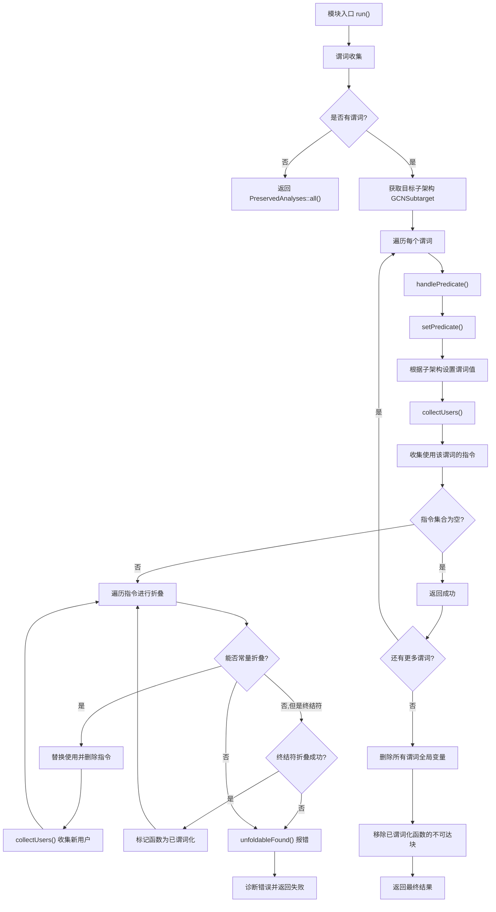

# AMDGPUExpandFeaturePredicates.cpp 代码功能详解

## 1. Pass 的主要功能概括

<a name="ref-block_0"></a>这个pass的主要功能是**展开AMDGCN通用特性谓词（Feature Predicate）为目标特定的值**。 llvm-project:8-19[<sup>↗</sup>](#block_0) 

**作用与效果：**
- 处理由前端（FE）在使用 `__builtin_cpu_is` 或 `__builtin_amdgcn_is_invocable` 内建函数时插入的占位符全局变量
- 一旦具体目标已知，通过常量折叠将这些谓词的值一直折叠到终结符（terminator）或无活跃使用的场景
- 如果折叠失败，会硬失败以避免后端（BE）产生晦涩的错误或不透明的运行时错误
- 应该尽早运行（在Clang CodeGen之后立即运行），以便优化管线和后端使用具体的目标数据进行操作

## 2. 主要功能的步骤和子功能

该pass包含以下核心子功能：

1. **谓词收集** (`run` 函数的第一部分)
2. **谓词值设置** (`setPredicate` 函数)
3. **谓词处理与常量折叠** (`handlePredicate` 函数)
4. **用户指令收集** (`collectUsers` 函数)
5. **错误诊断** (`unfoldableFound` 函数)
6. **清理工作** (`run` 函数的最后部分)

## 3. 各步骤/子功能的具体描述与分析

### 3.1 谓词收集（Predicate Collection）

<a name="ref-block_5"></a>在主入口函数 `run` 中，首先遍历模块中的所有全局变量，查找名称以 `llvm.amdgcn.` 开头的特性谓词全局变量。 llvm-project:135-144[<sup>↗</sup>](#block_5) 

**功能细节：**
- 跳过已定义的全局变量（非声明）
- 跳过没有名称的全局变量
- 只收集AMDGCN特定的谓词变量

### 3.2 谓词值设置（Predicate Value Setting）

<a name="ref-block_2"></a>`setPredicate` 函数负责根据目标子架构（Subtarget）设置谓词的实际布尔值。 llvm-project:50-74[<sup>↗</sup>](#block_2) 

**功能细节：**
- 区分两种类型的谓词：
  - `llvm.amdgcn.has` 开头的特性谓词（Feature Predicate）
  - `llvm.amdgcn.is` 开头的CPU谓词
- 对于特性谓词，提取特性名称并格式化（在逗号后添加'+'前缀）
- 对于CPU谓词，直接比较CPU名称
- 将全局变量的链接类型设置为私有（Private）
- 设置为非外部初始化
- 根据子架构的特性检查结果设置初始化器的布尔值

### 3.3 用户指令收集（User Instruction Collection）

<a name="ref-block_1"></a>`collectUsers` 是一个模板辅助函数，用于收集使用某个值的所有指令。 llvm-project:42-48[<sup>↗</sup>](#block_1) 

**功能细节：**
- 遍历值的所有用户（users）
- 筛选出指令类型的用户
- 将这些指令添加到提供的容器中

### 3.4 谓词处理与常量折叠（Predicate Handling and Constant Folding）

<a name="ref-block_4"></a>`handlePredicate` 函数是核心处理逻辑，负责设置谓词值并执行常量折叠。 llvm-project:91-127[<sup>↗</sup>](#block_4) 

**功能细节：**
- 首先调用 `setPredicate` 设置谓词值
- 收集所有使用该谓词的指令
- 迭代处理每条指令：
  - 丢弃可丢弃的用途（dropDroppableUses）
  - 获取支配树分析（DominatorTreeAnalysis）并创建支配树更新器（DomTreeUpdater）
  - 尝试常量折叠指令：
    - 如果成功，收集该指令的用户，替换所有使用，并删除指令
    - 如果是终结符且终结符折叠成功，标记该函数为已谓词化（predicated）
    - 如果折叠失败，调用错误处理函数

### 3.5 错误诊断（Error Diagnostics）

<a name="ref-block_3"></a>`unfoldableFound` 函数处理无法常量折叠的情况。 llvm-project:77-88[<sup>↗</sup>](#block_3) 

**功能细节：**
- 构造诊断消息，说明哪个谓词被哪条指令使用但无法折叠
- 使用LLVM诊断系统报告错误
- 设置错误严重性为 `DS_Error`
- 包含调试位置信息以便定位问题

### 3.6 清理工作（Cleanup）

<a name="ref-block_6"></a>在处理完所有谓词后，执行清理操作。 llvm-project:161-164[<sup>↗</sup>](#block_6) 

**功能细节：**
- 删除所有谓词全局变量（因为它们已经被折叠）
- 对于所有被谓词化的函数，移除不可达的基本块

## 4. 步骤/子功能之间的关系

这些子功能按照以下流程协同工作，形成完整的谓词展开管线：



**关系总结：**

1. **顺序依赖关系：** 谓词收集 → 谓词处理 → 清理工作
2. **嵌套调用关系：** `run` 调用 `handlePredicate`，后者调用 `setPredicate` 和 `collectUsers`
3. **迭代关系：** `handlePredicate` 中的常量折叠是迭代进行的，每次折叠成功后会收集新的用户继续折叠
4. **错误处理关系：** 如果常量折叠失败，会触发 `unfoldableFound` 进行错误诊断
5. **数据流关系：** 谓词值 → 使用指令 → 常量折叠 → 替换使用 → 新的使用指令

## Notes

这个pass是AMDGPU后端特有的，专门处理抽象目标（AMDGCNSPIRV）到具体目标的转换。它的关键作用是确保所有特性检查在编译时都能被解析为常量，从而允许后续的优化和代码生成正确进行。如果无法折叠，说明代码中存在动态依赖，这在AMDGPU的编译模型中是不允许的，因此会产生编译错误。

该pass必须在优化管线早期运行，以确保后续的pass能够看到具体的目标特性信息而不是抽象的谓词变量。


### Citations


<a name="block_0"></a>**File:** llvm/lib/Target/AMDGPU/AMDGPUExpandFeaturePredicates.cpp (L8-19) [<sup>↩</sup>](#ref-block_0)

```cpp
// This file implements a pass that deals with expanding AMDGCN generic feature
// predicates into target specific quantities / sequences. In this context, a
// generic feature predicate is an implementation detail global variable that
// is inserted by the FE as a consequence of using either the __builtin_cpu_is
// or the __builtin_amdgcn_is_invocable special builtins on an abstract target
// (AMDGCNSPIRV). These placeholder globals are used to guide target specific
// lowering, once the concrete target is known, by way of constant folding their
// value all the way into a terminator (i.e. a controlled block) or into a no
// live use scenario. We hard fail if the folding fails, to avoid obtuse BE
// errors or opaque run time errors. This pass should run as early as possible /
// immediately after Clang CodeGen, so that the optimisation pipeline and the BE
// operate with concrete target data.
```

<a name="block_1"></a>**File:** llvm/lib/Target/AMDGPU/AMDGPUExpandFeaturePredicates.cpp (L42-48) [<sup>↩</sup>](#ref-block_1)

```cpp
template <typename C> void collectUsers(Value *V, C &Container) {
  assert(V && "Must pass an existing Value!");

  for (auto &&U : V->users())
    if (auto *I = dyn_cast<Instruction>(U))
      Container.insert(Container.end(), I);
}
```

<a name="block_2"></a>**File:** llvm/lib/Target/AMDGPU/AMDGPUExpandFeaturePredicates.cpp (L50-74) [<sup>↩</sup>](#ref-block_2)

```cpp
inline void setPredicate(const GCNSubtarget &ST, GlobalVariable *P) {
  const bool IsFeature = P->getName().starts_with("llvm.amdgcn.has");
  const size_t Offset =
      IsFeature ? sizeof("llvm.amdgcn.has") : sizeof("llvm.amdgcn.is");

  std::string PV = P->getName().substr(Offset).str();
  if (IsFeature) {
    size_t Dx = PV.find(',');
    while (Dx != std::string::npos) {
      PV.insert(++Dx, {'+'});

      Dx = PV.find(',', Dx);
    }
    PV.insert(PV.cbegin(), '+');
  }

  Type *PTy = P->getValueType();
  P->setLinkage(GlobalValue::PrivateLinkage);
  P->setExternallyInitialized(false);

  if (IsFeature)
    P->setInitializer(ConstantInt::getBool(PTy, ST.checkFeatures(PV)));
  else
    P->setInitializer(ConstantInt::getBool(PTy, PV == ST.getCPU()));
}
```

<a name="block_3"></a>**File:** llvm/lib/Target/AMDGPU/AMDGPUExpandFeaturePredicates.cpp (L77-88) [<sup>↩</sup>](#ref-block_3)

```cpp
unfoldableFound(Function *Caller, GlobalVariable *P, Instruction *NoFold) {
  std::string W;
  raw_string_ostream OS(W);

  OS << "Impossible to constant fold feature predicate: " << *P << " used by "
     << *NoFold << ", please simplify.\n";

  Caller->getContext().diagnose(
      DiagnosticInfoUnsupported(*Caller, W, NoFold->getDebugLoc(), DS_Error));

  return {PreservedAnalyses::none(), false};
}
```

<a name="block_4"></a>**File:** llvm/lib/Target/AMDGPU/AMDGPUExpandFeaturePredicates.cpp (L91-127) [<sup>↩</sup>](#ref-block_4)

```cpp
handlePredicate(const GCNSubtarget &ST, FunctionAnalysisManager &FAM,
                SmallPtrSet<Function *, 32> &Predicated, GlobalVariable *P) {
  setPredicate(ST, P);

  SmallPtrSet<Instruction *, 32> ToFold;
  collectUsers(P, ToFold);

  if (ToFold.empty())
    return {PreservedAnalyses::all(), true};

  do {
    Instruction *I = *ToFold.begin();
    ToFold.erase(I);

    I->dropDroppableUses();

    Function *F = I->getParent()->getParent();
    auto &DT = FAM.getResult<DominatorTreeAnalysis>(*F);
    DomTreeUpdater DTU(DT, DomTreeUpdater::UpdateStrategy::Lazy);

    if (auto *C = ConstantFoldInstruction(I, P->getDataLayout())) {
      collectUsers(I, ToFold);
      I->replaceAllUsesWith(C);
      I->eraseFromParent();
      continue;
    } else if (I->isTerminator() &&
               ConstantFoldTerminator(I->getParent(), true, nullptr, &DTU)) {
        Predicated.insert(F);

        continue;
    }

    return unfoldableFound(I->getParent()->getParent(), P, I);
  } while (!ToFold.empty());

  return {PreservedAnalyses::none(), true};
}
```

<a name="block_5"></a>**File:** llvm/lib/Target/AMDGPU/AMDGPUExpandFeaturePredicates.cpp (L135-144) [<sup>↩</sup>](#ref-block_5)

```cpp
  SmallVector<GlobalVariable *> Predicates;
  for (auto &&G : M.globals()) {
    if (!G.isDeclaration() || !G.hasName())
      continue;
    if (G.getName().starts_with("llvm.amdgcn."))
      Predicates.push_back(&G);
  }

  if (Predicates.empty())
    return PreservedAnalyses::all();
```

<a name="block_6"></a>**File:** llvm/lib/Target/AMDGPU/AMDGPUExpandFeaturePredicates.cpp (L161-164) [<sup>↩</sup>](#ref-block_6)

```cpp
  for (auto &&P : Predicates)
    P->eraseFromParent();
  for (auto &&F : Predicated)
    removeUnreachableBlocks(*F);
```

