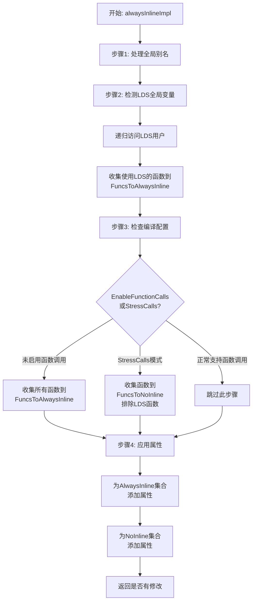

# AMDGPUAlwaysInlinePass.cpp 代码功能分析

## 1. Pass的主要功能概述

<a name="ref-block_0"></a>该Pass的主要功能是**强制内联特定的函数**，以满足AMDGPU架构的特殊要求。 llvm-project:10-11[<sup>↗</sup>](#block_0) 

**作用与效果：**
- 确保使用局部数据共享（LDS）的函数被强制内联，避免跨kernel的LDS管理问题
- 在函数调用功能未启用时，强制所有非声明函数内联
- 支持压力测试模式，可强制所有函数为noinline以测试函数调用机制

## 2. 主要功能步骤和子功能

核心实现函数`alwaysInlineImpl`包含以下主要步骤：

<a name="ref-block_2"></a>### 步骤1：处理全局别名（Global Aliases） llvm-project:90-114[<sup>↗</sup>](#block_2) 

<a name="ref-block_1"></a>### 步骤2：递归访问LDS全局变量的使用者 llvm-project:56-87[<sup>↗</sup>](#block_1) 

<a name="ref-block_5"></a>### 步骤3：根据配置收集需要处理的函数 llvm-project:135-149[<sup>↗</sup>](#block_5) 

<a name="ref-block_6"></a>### 步骤4：应用内联属性 llvm-project:151-157[<sup>↗</sup>](#block_6) 

## 3. 各步骤的详细描述分析

### 步骤1：全局别名处理
**功能：** 遍历模块中所有的全局别名，将指向函数的别名替换为实际函数引用。

**具体操作：**
- 检查每个GlobalAlias是否指向一个Function
- 对于AMDGCN目标，跳过非内部链接的别名
- 用实际函数替换所有别名使用
- 在GlobalOpt模式下删除这些别名

**关键逻辑：** 这样做可以简化后续的内联处理，避免通过别名间接调用函数的复杂性。

### 步骤2：递归访问LDS用户
**功能：** `recursivelyVisitUsers`函数递归地找出所有使用LDS（Local Data Share）全局变量的非入口函数。

**具体操作：**
- 使用工作栈遍历全局变量的所有用户
- 当发现指令使用了LDS变量时，获取其所属函数
- 如果该函数不是入口函数（非kernel），则标记为需要内联
- 移除函数的NoInline属性（这是为了规避clang在-O0时添加noinline的问题）
- 继续递归访问该函数的调用者

<a name="ref-block_4"></a>**触发条件：** 全局变量的地址空间为`REGION_ADDRESS`或`LOCAL_ADDRESS`（且未启用LowerModuleLDS）。 llvm-project:126-133[<sup>↗</sup>](#block_4) 

<a name="ref-block_3"></a>**设计原因：** LDS是由kernel分配的，如果允许使用LDS的函数被多个kernel调用而不内联，会导致LDS管理困难。 llvm-project:116-124[<sup>↗</sup>](#block_3) 

### 步骤3：基于配置的函数收集
**功能：** 根据编译器配置和命令行选项决定哪些函数需要强制内联或禁止内联。

**两种模式：**

**a) 压力测试模式（StressCalls=true）：**
- 强制所有函数为NoInline（除了必须内联的LDS相关函数）
- 用于测试函数调用功能的正确性

**b) 正常模式（EnableFunctionCalls=false）：**
- 将所有非声明且有使用的函数标记为需要内联
- 这是因为旧版AMDGPU不支持函数调用

**处理逻辑：** 检查函数是否已有相反的属性（AlwaysInline vs NoInline），避免属性冲突。

### 步骤4：应用内联属性
**功能：** 将前面步骤收集的函数集合应用相应的LLVM函数属性。

**操作：**
- 遍历`FuncsToAlwaysInline`集合，为每个函数添加`AlwaysInline`属性
- 遍历`FuncsToNoInline`集合，为每个函数添加`NoInline`属性
- 返回是否有修改发生

**效果：** 这些属性会指导后续的内联优化Pass进行实际的函数内联操作。

## 4. 步骤之间的关系



**关系说明：**

1. **顺序依赖：** 步骤1（别名处理）必须在其他步骤之前，以简化IR结构

2. **并行收集：** 步骤2（LDS用户收集）和步骤3（配置驱动收集）是独立的，都向`FuncsToAlwaysInline`集合添加函数，但基于不同的判断标准

3. **优先级关系：** LDS相关函数具有最高优先级，即使在StressCalls模式下也必须内联 llvm-project:142-144 

4. **互斥性：** `FuncsToAlwaysInline`和`FuncsToNoInline`是互斥的集合，同一个函数不会同时出现在两个集合中

5. **最终统一：** 步骤4统一处理所有收集到的函数，确保属性被正确应用

## Notes

- 该Pass是AMDGPU后端特有的优化Pass，主要解决LDS内存管理和函数调用支持的架构限制
- 代码中存在一个workaround：强制移除NoInline属性以应对clang在-O0时的行为 llvm-project:70-75 
<a name="ref-block_7"></a>- 该Pass既有传统的ModulePass实现，也有新的Pass Manager实现 llvm-project:168-172[<sup>↗</sup>](#block_7) 
- GlobalOpt参数控制是否真正删除别名，提供了灵活性


### Citations


<a name="block_0"></a>**File:** llvm/lib/Target/AMDGPU/AMDGPUAlwaysInlinePass.cpp (L10-11) [<sup>↩</sup>](#ref-block_0)

```cpp
/// This pass marks all internal functions as always_inline and creates
/// duplicates of all other functions and marks the duplicates as always_inline.
```

<a name="block_1"></a>**File:** llvm/lib/Target/AMDGPU/AMDGPUAlwaysInlinePass.cpp (L56-87) [<sup>↩</sup>](#ref-block_1)

```cpp
recursivelyVisitUsers(GlobalValue &GV,
                      SmallPtrSetImpl<Function *> &FuncsToAlwaysInline) {
  SmallVector<User *, 16> Stack(GV.users());

  SmallPtrSet<const Value *, 8> Visited;

  while (!Stack.empty()) {
    User *U = Stack.pop_back_val();
    if (!Visited.insert(U).second)
      continue;

    if (Instruction *I = dyn_cast<Instruction>(U)) {
      Function *F = I->getParent()->getParent();
      if (!AMDGPU::isEntryFunctionCC(F->getCallingConv())) {
        // FIXME: This is a horrible hack. We should always respect noinline,
        // and just let us hit the error when we can't handle this.
        //
        // Unfortunately, clang adds noinline to all functions at -O0. We have
        // to override this here until that's fixed.
        F->removeFnAttr(Attribute::NoInline);

        FuncsToAlwaysInline.insert(F);
        Stack.push_back(F);
      }

      // No need to look at further users, but we do need to inline any callers.
      continue;
    }

    append_range(Stack, U->users());
  }
}
```

<a name="block_2"></a>**File:** llvm/lib/Target/AMDGPU/AMDGPUAlwaysInlinePass.cpp (L90-114) [<sup>↩</sup>](#ref-block_2)

```cpp
  std::vector<GlobalAlias*> AliasesToRemove;

  bool Changed = false;
  SmallPtrSet<Function *, 8> FuncsToAlwaysInline;
  SmallPtrSet<Function *, 8> FuncsToNoInline;
  Triple TT(M.getTargetTriple());

  for (GlobalAlias &A : M.aliases()) {
    if (Function* F = dyn_cast<Function>(A.getAliasee())) {
      if (TT.isAMDGCN() && A.getLinkage() != GlobalValue::InternalLinkage)
        continue;
      Changed = true;
      A.replaceAllUsesWith(F);
      AliasesToRemove.push_back(&A);
    }

    // FIXME: If the aliasee isn't a function, it's some kind of constant expr
    // cast that won't be inlined through.
  }

  if (GlobalOpt) {
    for (GlobalAlias* A : AliasesToRemove) {
      A->eraseFromParent();
    }
  }
```

<a name="block_3"></a>**File:** llvm/lib/Target/AMDGPU/AMDGPUAlwaysInlinePass.cpp (L116-124) [<sup>↩</sup>](#ref-block_3)

```cpp
  // Always force inlining of any function that uses an LDS global address. This
  // is something of a workaround because we don't have a way of supporting LDS
  // objects defined in functions. LDS is always allocated by a kernel, and it
  // is difficult to manage LDS usage if a function may be used by multiple
  // kernels.
  //
  // OpenCL doesn't allow declaring LDS in non-kernels, so in practice this
  // should only appear when IPO passes manages to move LDs defined in a kernel
  // into a single user function.
```

<a name="block_4"></a>**File:** llvm/lib/Target/AMDGPU/AMDGPUAlwaysInlinePass.cpp (L126-133) [<sup>↩</sup>](#ref-block_4)

```cpp
  for (GlobalVariable &GV : M.globals()) {
    // TODO: Region address
    unsigned AS = GV.getAddressSpace();
    if ((AS == AMDGPUAS::REGION_ADDRESS) ||
        (AS == AMDGPUAS::LOCAL_ADDRESS &&
         (!AMDGPUTargetMachine::EnableLowerModuleLDS)))
      recursivelyVisitUsers(GV, FuncsToAlwaysInline);
  }
```

<a name="block_5"></a>**File:** llvm/lib/Target/AMDGPU/AMDGPUAlwaysInlinePass.cpp (L135-149) [<sup>↩</sup>](#ref-block_5)

```cpp
  if (!AMDGPUTargetMachine::EnableFunctionCalls || StressCalls) {
    auto IncompatAttr
      = StressCalls ? Attribute::AlwaysInline : Attribute::NoInline;

    for (Function &F : M) {
      if (!F.isDeclaration() && !F.use_empty() &&
          !F.hasFnAttribute(IncompatAttr)) {
        if (StressCalls) {
          if (!FuncsToAlwaysInline.count(&F))
            FuncsToNoInline.insert(&F);
        } else
          FuncsToAlwaysInline.insert(&F);
      }
    }
  }
```

<a name="block_6"></a>**File:** llvm/lib/Target/AMDGPU/AMDGPUAlwaysInlinePass.cpp (L151-157) [<sup>↩</sup>](#ref-block_6)

```cpp
  for (Function *F : FuncsToAlwaysInline)
    F->addFnAttr(Attribute::AlwaysInline);

  for (Function *F : FuncsToNoInline)
    F->addFnAttr(Attribute::NoInline);

  return Changed || !FuncsToAlwaysInline.empty() || !FuncsToNoInline.empty();
```

<a name="block_7"></a>**File:** llvm/lib/Target/AMDGPU/AMDGPUAlwaysInlinePass.cpp (L168-172) [<sup>↩</sup>](#ref-block_7)

```cpp
PreservedAnalyses AMDGPUAlwaysInlinePass::run(Module &M,
                                              ModuleAnalysisManager &AM) {
  const bool Changed = alwaysInlineImpl(M, GlobalOpt);
  return Changed ? PreservedAnalyses::none() : PreservedAnalyses::all();
}
```

