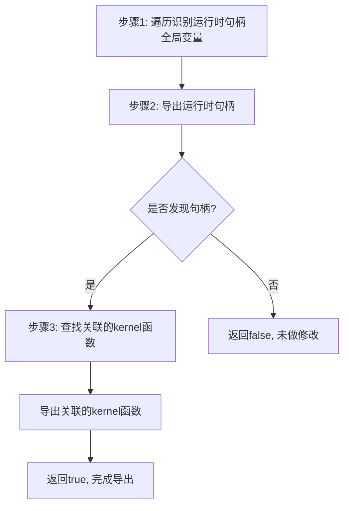

# AMDGPUExportKernelRuntimeHandles.cpp 代码功能分析

## 1. Pass主要功能概括

该Pass的主要功能是**将OpenCL块入队（block enqueue）运行时句柄导出为外部符号**。 llvm-project:11-14 

**作用**：使原本内部链接的全局变量和相关kernel函数变为外部可访问，以便运行时系统能够访问这些运行时句柄。

<a name="ref-block_0"></a>**效果**：这些全局变量在IR链接时的行为类似于内部函数（可以被重命名和优化），但在最终目标文件中会产生外部符号供运行时访问。 llvm-project:11-20[<sup>↗</sup>](#block_0) 

## 2. 主要功能步骤提取

核心实现函数`exportKernelRuntimeHandles`包含以下主要步骤：

1. **遍历和识别运行时句柄全局变量**
2. **导出运行时句柄全局变量**
3. **查找和导出关联的kernel函数**

## 3. 各步骤详细分析

### 步骤1：遍历和识别运行时句柄全局变量

该步骤遍历模块中的所有全局变量，查找section名为`.amdgpu.kernel.runtime.handle`的变量。 llvm-project:63-66 

**实现细节**：
- 定义特定的section名称常量`".amdgpu.kernel.runtime.handle"`
- 使用`M.globals()`迭代所有全局变量
- 通过`GV.getSection()`检查是否匹配目标section

### 步骤2：导出运行时句柄全局变量

对于识别出的运行时句柄全局变量，将其链接类型修改为外部链接。 llvm-project:66-70 

**实现细节**：
- 调用`GV.setLinkage(GlobalValue::ExternalLinkage)`设置为外部链接
- 调用`GV.setDSOLocal(false)`设置为非DSO本地符号
- 设置`Changed`标志为true，表示模块已被修改

### 步骤3：查找和导出关联的kernel函数

在发现运行时句柄后，遍历所有AMDGPU kernel函数，查找通过metadata关联到这些句柄的kernel，并将它们也导出。 llvm-project:76-92 

**实现细节**：
- 遍历模块中的所有函数
- 检查函数的调用约定是否为`CallingConv::AMDGPU_KERNEL`
- 获取函数的`MD_associated` metadata
- 从metadata中提取关联的全局对象（Handle）
- 验证Handle的section是否为运行时句柄section
- 如果匹配，将kernel函数设置为外部链接和受保护可见性

**特别说明**：代码中有注释指出，理论上不需要导出kernel地址，可以用kernel描述符初始化运行时句柄，这是一个待优化的点。 llvm-project:76-77 

## 4. 步骤间关系描述

这些步骤之间存在**依赖和因果关系**：



**关系说明**：

1. **步骤1→步骤2**：识别是修改的前提条件。只有先识别出运行时句柄全局变量，才能对其进行导出操作。

2. **步骤2→步骤3**：存在条件依赖。只有当步骤2发现并修改了至少一个运行时句柄时（`Changed`为true），才会继续执行步骤3。 llvm-project:73-74 

3. **步骤3的必要性**：由于kernel函数通过metadata与运行时句柄关联，运行时需要访问句柄，也需要访问对应的kernel函数地址，因此必须同时导出两者以保持一致性。

4. **整体流程**：这是一个**两阶段导出过程**：第一阶段导出句柄数据，第二阶段导出关联的代码（kernel函数），确保运行时能够完整访问OpenCL块入队所需的所有符号。

## Notes

<a name="ref-block_2"></a>- 该Pass提供了Legacy和新式两种实现方式，分别为`AMDGPUExportKernelRuntimeHandlesLegacy`（ModulePass）和`AMDGPUExportKernelRuntimeHandlesPass`（新PM）。 llvm-project:101-110[<sup>↗</sup>](#block_2) 

<a name="ref-block_1"></a>- 核心逻辑在`exportKernelRuntimeHandles`函数中实现，两种Pass实现都调用这个共同的函数。 llvm-project:60-95[<sup>↗</sup>](#block_1) 

- 代码中提到这个实现方案是临时的，未来可能通过新的链接类型或全局对象metadata来替代。 llvm-project:16-20


### Citations


<a name="block_0"></a>**File:** llvm/lib/Target/AMDGPU/AMDGPUExportKernelRuntimeHandles.cpp (L11-20) [<sup>↩</sup>](#ref-block_0)

```cpp
// Give any globals used for OpenCL block enqueue runtime handles external
// linkage so the runtime may access them. These should behave like internal
// functions for purposes of linking, but need to have an external symbol in the
// final object for the runtime to access them.
//
// TODO: This could be replaced with a new linkage type or global object
// metadata that produces an external symbol in the final object, but allows
// rename on IR linking. Alternatively if we can rely on
// GlobalValue::getGlobalIdentifier we can just make these external symbols to
// begin with.
```

<a name="block_1"></a>**File:** llvm/lib/Target/AMDGPU/AMDGPUExportKernelRuntimeHandles.cpp (L60-95) [<sup>↩</sup>](#ref-block_1)

```cpp
static bool exportKernelRuntimeHandles(Module &M) {
  bool Changed = false;

  const StringLiteral HandleSectionName(".amdgpu.kernel.runtime.handle");

  for (GlobalVariable &GV : M.globals()) {
    if (GV.getSection() == HandleSectionName) {
      GV.setLinkage(GlobalValue::ExternalLinkage);
      GV.setDSOLocal(false);
      Changed = true;
    }
  }

  if (!Changed)
    return false;

  // FIXME: We shouldn't really need to export the kernel address. We can
  // initialize the runtime handle with the kernel descriptor.
  for (Function &F : M) {
    if (F.getCallingConv() != CallingConv::AMDGPU_KERNEL)
      continue;

    const MDNode *Associated = F.getMetadata(LLVMContext::MD_associated);
    if (!Associated)
      continue;

    auto *VM = cast<ValueAsMetadata>(Associated->getOperand(0));
    auto *Handle = dyn_cast<GlobalObject>(VM->getValue());
    if (Handle && Handle->getSection() == HandleSectionName) {
      F.setLinkage(GlobalValue::ExternalLinkage);
      F.setVisibility(GlobalValue::ProtectedVisibility);
    }
  }

  return Changed;
}
```

<a name="block_2"></a>**File:** llvm/lib/Target/AMDGPU/AMDGPUExportKernelRuntimeHandles.cpp (L101-110) [<sup>↩</sup>](#ref-block_2)

```cpp
PreservedAnalyses
AMDGPUExportKernelRuntimeHandlesPass::run(Module &M,
                                          ModuleAnalysisManager &MAM) {
  if (!exportKernelRuntimeHandles(M))
    return PreservedAnalyses::all();

  PreservedAnalyses PA;
  PA.preserveSet<AllAnalysesOn<Function>>();
  return PA;
}
```

