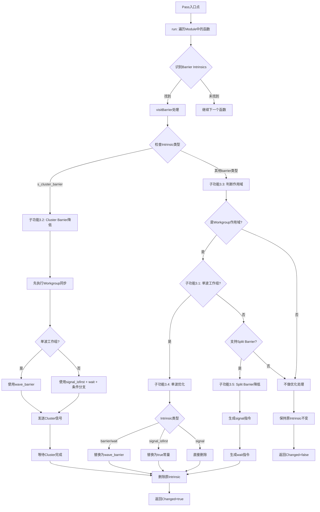

# AMDGPULowerIntrinsics.cpp 代码功能分析

## 1. Pass的主要功能概括

<a name="ref-block_0"></a>`AMDGPULowerIntrinsics` 是一个LLVM Module Pass，其主要功能是**降低（lower）AMDGPU特定的内置函数（intrinsics），以避免在SelectionDAG和GlobalISel两个代码生成路径中分别处理这些内置函数**。 llvm-project:8-11[<sup>↗</sup>](#block_0) 

该Pass主要针对**barrier同步相关的内置函数**，包括：
- `amdgcn_s_barrier`
- `amdgcn_s_barrier_signal`
- `amdgcn_s_barrier_signal_isfirst`
- `amdgcn_s_barrier_wait`
- `amdgcn_s_cluster_barrier` llvm-project:72-78 

**主要效果**：
1. 将高级barrier intrinsics转换为更底层的指令序列
2. 针对单波工作组进行优化，将workgroup级别的barrier降级为wave级别的barrier
3. 在支持的硬件上将传统barrier拆分为signal和wait两个独立操作

## 2. 实现主要功能的步骤和子功能

### 步骤1：模块级别的入口点
<a name="ref-block_9"></a>- **Legacy Pass框架入口**：`AMDGPULowerIntrinsicsLegacy::runOnModule()` llvm-project:194-200[<sup>↗</sup>](#block_9) 
<a name="ref-block_8"></a>- **新Pass管理器入口**：`AMDGPULowerIntrinsicsPass::run()` llvm-project:186-192[<sup>↗</sup>](#block_8) 

### 步骤2：遍历识别目标Intrinsics
<a name="ref-block_2"></a>`AMDGPULowerIntrinsicsImpl::run()` 方法遍历模块中的所有函数，通过switch语句识别需要处理的barrier intrinsics llvm-project:65-83[<sup>↗</sup>](#block_2) 

<a name="ref-block_1"></a>使用辅助模板函数 `forEachCall()` 遍历每个intrinsic的所有调用点 llvm-project:56-61[<sup>↗</sup>](#block_1) 

### 步骤3：Barrier优化和降低处理
`visitBarrier()` 方法是核心处理逻辑，包含以下子功能：

#### 子功能3.1：单波工作组检测
<a name="ref-block_3"></a>在优化级别大于None时，检测工作组是否只包含单个wave llvm-project:97-100[<sup>↗</sup>](#block_3) 

#### 子功能3.2：Cluster Barrier降低
将 `s_cluster_barrier` 降低为多个低级操作的序列：
- 首先执行workgroup级别的barrier同步
- 然后从单个wave发出cluster barrier信号
<a name="ref-block_4"></a>- 最后所有wave等待cluster barrier llvm-project:106-138[<sup>↗</sup>](#block_4) 

#### 子功能3.3：工作组范围判断
<a name="ref-block_5"></a>判断barrier是否属于workgroup作用域，检查barrier ID是否为TRAP、WORKGROUP或命名barrier范围内的值 llvm-project:140-154[<sup>↗</sup>](#block_5) 

#### 子功能3.4：单波工作组优化
当检测到workgroup只有单个wave时，执行优化：
- 将 `s_barrier` 和 `s_barrier_wait` 降级为轻量级的 `wave_barrier`
- 将 `s_barrier_signal_isfirst` 直接替换为常量 `true`（因为单波必然是第一个）
<a name="ref-block_6"></a>- 移除 `s_barrier_signal` 调用（无需信号） llvm-project:156-168[<sup>↗</sup>](#block_6) 

#### 子功能3.5：Split Barrier降低
<a name="ref-block_7"></a>在支持split barrier的硬件上（GFX12+），将传统的 `s_barrier` 拆分为 `s_barrier_signal` + `s_barrier_wait` 序列 llvm-project:170-181[<sup>↗</sup>](#block_7) 

## 3. 各步骤的具体描述分析

### **步骤1分析：Pass入口点**
提供了两种Pass框架的支持：
- Legacy Pass Manager：通过继承 `ModulePass` 类实现
- 新Pass Manager：通过实现 `run()` 方法并返回 `PreservedAnalyses`

两者都将实际工作委托给 `AMDGPULowerIntrinsicsImpl` 类，这是一个典型的实现类模式，用于在不同Pass框架间共享核心逻辑。

### **子功能3.1分析：单波工作组检测**
通过比较工作组的最大尺寸与wavefront尺寸来判断。如果 `WGMaxSize <= WavefrontSize`，说明整个工作组只有一个wave，这种情况下可以进行更激进的优化。这个检测只在优化级别大于None时执行，避免在调试构建中改变程序行为。

### **子功能3.2分析：Cluster Barrier降低**
Cluster barrier是一个高级同步原语，需要多步降低：

1. **Workgroup同步**：先确保同一workgroup内的所有wave同步
   - 单波情况：使用简单的 `wave_barrier`
   - 多波情况：使用完整的 `s_barrier_signal_isfirst` + `s_barrier_wait` 序列，并通过条件分支确保只有第一个wave执行后续的cluster信号

2. **Cluster信号**：使用 `s_barrier_signal` 发送cluster级别的信号

3. **Cluster等待**：所有wave执行 `s_barrier_wait` 等待cluster barrier完成

这种分层设计确保了先在workgroup内同步，再在cluster级别同步。

### **子功能3.3分析：工作组范围判断**
通过检查barrier ID来判断作用域：
- `TRAP` (-2) 和 `WORKGROUP` (-1) 是预定义的workgroup级别barrier
- 命名barrier（如果存在NAMED_BARRIER_FIRST到NAMED_BARRIER_LAST范围）也属于workgroup作用域
<a name="ref-block_10"></a>- 其他ID值（如CLUSTER）则不属于workgroup作用域 llvm-project:1056-1056[<sup>↗</sup>](#block_10) 

### **子功能3.4分析：单波工作组优化**
这是一个重要的性能优化。当整个workgroup只有一个wave时：
- **Barrier等待优化**：无需真正的跨wave同步，只需要wave内的barrier（`wave_barrier`），这比完整的workgroup barrier开销小得多
- **信号优化**：单波必然是第一个wave，所以 `isfirst` 查询可以直接返回true常量
- **信号删除**：不需要向自己发送信号，直接删除signal调用

### **子功能3.5分析：Split Barrier降低**
在GFX12及更新的GPU架构上，硬件支持将barrier操作拆分为独立的signal和wait指令。这种拆分提供了更大的灵活性，允许在signal和wait之间插入其他操作，从而提高指令级并行度。传统的 `s_barrier` 会被转换为：
```
s_barrier_signal(WORKGROUP)
s_barrier_wait(WORKGROUP)
```

## 4. 步骤/子功能之间的关系

以下是这些步骤和子功能之间的关系流程图：



**关键关系说明**：

1. **层次化处理**：Pass采用自顶向下的处理流程，从Module → Function → Intrinsic Call逐层深入

2. **优先级顺序**：
   - 首先处理 `s_cluster_barrier`（最复杂的情况）
   - 然后检查是否为workgroup作用域
   - 最后根据硬件能力和工作组特性选择优化策略

3. **互斥关系**：单波工作组优化（子功能3.4）与split barrier降低（子功能3.5）是互斥的，因为单波优化会将barrier降级为wave_barrier，不再需要split barrier

4. **依赖关系**：
   - 子功能3.2（Cluster Barrier）**依赖**子功能3.1（单波检测）来决定如何实现workgroup同步
   - 子功能3.4（单波优化）**依赖**子功能3.3（作用域判断）来确定是否可以应用优化
   - 子功能3.5（Split Barrier）**依赖**硬件特性检测（`hasSplitBarriers()`）

5. **组合关系**：子功能3.2（Cluster Barrier降低）是一个复合操作，内部会递归地应用其他优化策略（单波检测和条件分支）

## Notes

- 该Pass是IR级别的转换，发生在代码生成的早期阶段，为后续的指令选择阶段做准备
- Barrier ID的定义位于 `SIDefines.h` 中，包括TRAP、WORKGROUP等预定义值
- Split barrier特性是GFX12+架构引入的硬件能力，通过 `hasSplitBarriers()` 方法检测
- 单波工作组优化是一个重要的性能优化点，能显著减少同步开销
- 该Pass的设计目标是统一代码生成路径，避免在SelectionDAG和GlobalISel中重复实现相同的降低逻辑


### Citations


<a name="block_0"></a>**File:** llvm/lib/Target/AMDGPU/AMDGPULowerIntrinsics.cpp (L8-11) [<sup>↩</sup>](#ref-block_0)

```cpp
//
// Lower intrinsics that would otherwise require separate handling in both
// SelectionDAG and GlobalISel.
//
```

<a name="block_1"></a>**File:** llvm/lib/Target/AMDGPU/AMDGPULowerIntrinsics.cpp (L56-61) [<sup>↩</sup>](#ref-block_1)

```cpp
template <class T> static void forEachCall(Function &Intrin, T Callback) {
  for (User *U : make_early_inc_range(Intrin.users())) {
    if (auto *CI = dyn_cast<IntrinsicInst>(U))
      Callback(CI);
  }
}
```

<a name="block_2"></a>**File:** llvm/lib/Target/AMDGPU/AMDGPULowerIntrinsics.cpp (L65-83) [<sup>↩</sup>](#ref-block_2)

```cpp
bool AMDGPULowerIntrinsicsImpl::run() {
  bool Changed = false;

  for (Function &F : M) {
    switch (F.getIntrinsicID()) {
    default:
      continue;
    case Intrinsic::amdgcn_s_barrier:
    case Intrinsic::amdgcn_s_barrier_signal:
    case Intrinsic::amdgcn_s_barrier_signal_isfirst:
    case Intrinsic::amdgcn_s_barrier_wait:
    case Intrinsic::amdgcn_s_cluster_barrier:
      forEachCall(F, [&](IntrinsicInst *II) { Changed |= visitBarrier(*II); });
      break;
    }
  }

  return Changed;
}
```

<a name="block_3"></a>**File:** llvm/lib/Target/AMDGPU/AMDGPULowerIntrinsics.cpp (L97-100) [<sup>↩</sup>](#ref-block_3)

```cpp
  if (TM.getOptLevel() > CodeGenOptLevel::None) {
    unsigned WGMaxSize = ST.getFlatWorkGroupSizes(*I.getFunction()).second;
    IsSingleWaveWG = WGMaxSize <= ST.getWavefrontSize();
  }
```

<a name="block_4"></a>**File:** llvm/lib/Target/AMDGPU/AMDGPULowerIntrinsics.cpp (L106-138) [<sup>↩</sup>](#ref-block_4)

```cpp
  if (I.getIntrinsicID() == Intrinsic::amdgcn_s_cluster_barrier) {
    // The default cluster barrier expects one signal per workgroup. So we need
    // a workgroup barrier first.
    if (IsSingleWaveWG) {
      B.CreateIntrinsic(B.getVoidTy(), Intrinsic::amdgcn_wave_barrier, {});
    } else {
      Value *BarrierID_32 = B.getInt32(AMDGPU::Barrier::WORKGROUP);
      Value *BarrierID_16 = B.getInt16(AMDGPU::Barrier::WORKGROUP);
      Value *IsFirst = B.CreateIntrinsic(
          B.getInt1Ty(), Intrinsic::amdgcn_s_barrier_signal_isfirst,
          {BarrierID_32});
      B.CreateIntrinsic(B.getVoidTy(), Intrinsic::amdgcn_s_barrier_wait,
                        {BarrierID_16});

      Instruction *ThenTerm =
          SplitBlockAndInsertIfThen(IsFirst, I.getIterator(), false);
      B.SetInsertPoint(ThenTerm);
    }

    // Now we can signal the cluster barrier from a single wave and wait for the
    // barrier in all waves.
    Value *BarrierID_32 = B.getInt32(AMDGPU::Barrier::CLUSTER);
    Value *BarrierID_16 = B.getInt16(AMDGPU::Barrier::CLUSTER);
    B.CreateIntrinsic(B.getVoidTy(), Intrinsic::amdgcn_s_barrier_signal,
                      {BarrierID_32});

    B.SetInsertPoint(&I);
    B.CreateIntrinsic(B.getVoidTy(), Intrinsic::amdgcn_s_barrier_wait,
                      {BarrierID_16});

    I.eraseFromParent();
    return true;
  }
```

<a name="block_5"></a>**File:** llvm/lib/Target/AMDGPU/AMDGPULowerIntrinsics.cpp (L140-154) [<sup>↩</sup>](#ref-block_5)

```cpp
  bool IsWorkgroupScope = false;

  if (I.getIntrinsicID() == Intrinsic::amdgcn_s_barrier_wait ||
      I.getIntrinsicID() == Intrinsic::amdgcn_s_barrier_signal ||
      I.getIntrinsicID() == Intrinsic::amdgcn_s_barrier_signal_isfirst) {
    int BarrierID = cast<ConstantInt>(I.getArgOperand(0))->getSExtValue();
    if (BarrierID == AMDGPU::Barrier::TRAP ||
        BarrierID == AMDGPU::Barrier::WORKGROUP ||
        (BarrierID >= AMDGPU::Barrier::NAMED_BARRIER_FIRST &&
         BarrierID <= AMDGPU::Barrier::NAMED_BARRIER_LAST))
      IsWorkgroupScope = true;
  } else {
    assert(I.getIntrinsicID() == Intrinsic::amdgcn_s_barrier);
    IsWorkgroupScope = true;
  }
```

<a name="block_6"></a>**File:** llvm/lib/Target/AMDGPU/AMDGPULowerIntrinsics.cpp (L156-168) [<sup>↩</sup>](#ref-block_6)

```cpp
  if (IsWorkgroupScope && IsSingleWaveWG) {
    // Down-grade waits, remove split signals.
    if (I.getIntrinsicID() == Intrinsic::amdgcn_s_barrier ||
        I.getIntrinsicID() == Intrinsic::amdgcn_s_barrier_wait) {
      B.CreateIntrinsic(B.getVoidTy(), Intrinsic::amdgcn_wave_barrier, {});
    } else if (I.getIntrinsicID() ==
               Intrinsic::amdgcn_s_barrier_signal_isfirst) {
      // If we're the only wave of the workgroup, we're always first.
      I.replaceAllUsesWith(B.getInt1(true));
    }
    I.eraseFromParent();
    return true;
  }
```

<a name="block_7"></a>**File:** llvm/lib/Target/AMDGPU/AMDGPULowerIntrinsics.cpp (L170-181) [<sup>↩</sup>](#ref-block_7)

```cpp
  if (I.getIntrinsicID() == Intrinsic::amdgcn_s_barrier &&
      ST.hasSplitBarriers()) {
    // Lower to split barriers.
    Value *BarrierID_32 = B.getInt32(AMDGPU::Barrier::WORKGROUP);
    Value *BarrierID_16 = B.getInt16(AMDGPU::Barrier::WORKGROUP);
    B.CreateIntrinsic(B.getVoidTy(), Intrinsic::amdgcn_s_barrier_signal,
                      {BarrierID_32});
    B.CreateIntrinsic(B.getVoidTy(), Intrinsic::amdgcn_s_barrier_wait,
                      {BarrierID_16});
    I.eraseFromParent();
    return true;
  }
```

<a name="block_8"></a>**File:** llvm/lib/Target/AMDGPU/AMDGPULowerIntrinsics.cpp (L186-192) [<sup>↩</sup>](#ref-block_8)

```cpp
PreservedAnalyses AMDGPULowerIntrinsicsPass::run(Module &M,
                                                 ModuleAnalysisManager &MAM) {
  AMDGPULowerIntrinsicsImpl Impl(M, TM);
  if (!Impl.run())
    return PreservedAnalyses::all();
  return PreservedAnalyses::none();
}
```

<a name="block_9"></a>**File:** llvm/lib/Target/AMDGPU/AMDGPULowerIntrinsics.cpp (L194-200) [<sup>↩</sup>](#ref-block_9)

```cpp
bool AMDGPULowerIntrinsicsLegacy::runOnModule(Module &M) {
  auto &TPC = getAnalysis<TargetPassConfig>();
  const AMDGPUTargetMachine &TM = TPC.getTM<AMDGPUTargetMachine>();

  AMDGPULowerIntrinsicsImpl Impl(M, TM);
  return Impl.run();
}
```

<a name="block_10"></a>**File:** llvm/lib/Target/AMDGPU/SIDefines.h (L1056-1056) [<sup>↩</sup>](#ref-block_10)

```text
enum Type { TRAP = -2, WORKGROUP = -1 };
```

