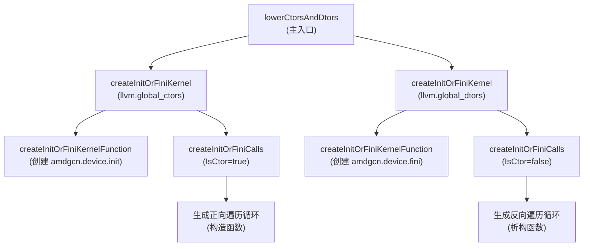

# AMDGPUCtorDtorLowering.cpp 代码功能分析

## 1. Pass 的主要功能概括

<a name="ref-block_0"></a>这个 pass 的主要功能是**为 AMDGPU 目标平台降低（lower）全局构造函数（constructors）和析构函数（destructors）**。 llvm-project:9-11[<sup>↗</sup>](#block_0) 

**作用**：将 LLVM IR 中的 `llvm.global_ctors` 和 `llvm.global_dtors` 全局变量转换为可在 AMDGPU 设备上执行的特殊 kernel 函数。

**效果**：生成名为 `amdgcn.device.init` 和 `amdgcn.device.fini` 的设备初始化和清理 kernel，这些 kernel 会按优先级顺序调用所有注册的全局构造/析构函数。

## 2. 主要功能的步骤和子功能提取

该代码文件包含以下主要子功能：

1. **`createInitOrFiniKernelFunction`** - 创建初始化或清理 kernel 函数
2. **`createInitOrFiniCalls`** - 生成调用构造/析构函数数组的 IR 代码
3. **`createInitOrFiniKernel`** - 协调 kernel 创建过程
4. **`lowerCtorsAndDtors`** - 主入口函数，处理构造和析构函数

## 3. 各子功能的详细描述分析

### 子功能 1: `createInitOrFiniKernelFunction`

<a name="ref-block_1"></a>**功能描述**：创建一个 AMDGPU kernel 函数作为设备初始化或清理的入口点。 llvm-project:30-47[<sup>↗</sup>](#block_1) 

**具体实现**：
- 根据 `IsCtor` 参数确定 kernel 名称（`amdgcn.device.init` 或 `amdgcn.device.fini`）
- 创建一个无参数、无返回值的函数，链接类型为 `WeakODRLinkage`
- 设置调用约定为 `AMDGPU_KERNEL`
- 添加函数属性：
  - `amdgpu-flat-work-group-size` 设置为 "1,1"（单线程执行）
  - 根据类型添加 `device-init` 或 `device-fini` 属性

### 子功能 2: `createInitOrFiniCalls`

<a name="ref-block_3"></a>**功能描述**：生成遍历并调用构造/析构函数数组的 IR 代码，这是整个 pass 中最复杂的部分。 llvm-project:72-145[<sup>↗</sup>](#block_3) 

**具体实现**：

- **创建基本块结构**：entry、while.entry（循环体）、while.end（退出块）

- **声明外部符号**：引用链接器提供的 `__init_array_start/end` 或 `__fini_array_start/end` 符号，这些符号标记构造/析构函数数组的边界

- **处理构造函数**（`IsCtor = true`）：
  - 从数组开始位置向后遍历
  - 使用正向迭代（`Start` 到 `End`）

- **处理析构函数**（`IsCtor = false`）：
  - 必须按**逆序**调用析构函数 llvm-project:109-126 
  - 计算数组大小，从最后一个元素开始向前遍历
  - 使用反向迭代（从 `End-1` 到 `Start`）

- **生成循环代码**：
  - 使用 PHI 节点跟踪当前指针位置
  - 加载函数指针并调用
  - 更新指针（构造函数 +1，析构函数 -1）
  - 检查是否到达终止条件

### 子功能 3: `createInitOrFiniKernel`

<a name="ref-block_4"></a>**功能描述**：检查全局变量并协调 kernel 的创建过程。 llvm-project:147-164[<sup>↗</sup>](#block_4) 

**具体实现**：
- 查找 `GlobalName` 对应的全局变量（`llvm.global_ctors` 或 `llvm.global_dtors`）
- 验证全局变量存在、有初始化器，且初始化器是非空的 `ConstantArray`
- 调用 `createInitOrFiniKernelFunction` 创建 kernel 函数
- 调用 `createInitOrFiniCalls` 生成调用逻辑
- 将 kernel 添加到 `llvm.used` 中，防止被优化删除

### 子功能 4: `lowerCtorsAndDtors`

<a name="ref-block_5"></a>**功能描述**：主入口函数，负责处理整个模块的构造和析构函数降低过程。 llvm-project:166-171[<sup>↗</sup>](#block_5) 

**具体实现**：
- 调用 `createInitOrFiniKernel` 处理全局构造函数（`llvm.global_ctors`）
- 调用 `createInitOrFiniKernel` 处理全局析构函数（`llvm.global_dtors`）
- 返回是否对模块进行了修改

## 4. 步骤/子功能之间的关系

各子功能之间的调用关系和协作流程如下：



**关系说明**：

1. **顺序关系**：`lowerCtorsAndDtors` → `createInitOrFiniKernel` → `createInitOrFiniKernelFunction` + `createInitOrFiniCalls`

2. **并行关系**：构造函数和析构函数的处理是**并行独立**的，分别处理各自的全局变量

3. **依赖关系**：
   - `createInitOrFiniKernel` 依赖于 `createInitOrFiniKernelFunction` 提供 kernel 函数框架
   - `createInitOrFiniCalls` 依赖于已创建的 kernel 函数，在其中填充调用逻辑

4. **条件分支**：`createInitOrFiniCalls` 根据 `IsCtor` 参数采用不同的遍历策略（正向 vs 反向）

## Notes

- 这个 pass 是 AMDGPU 后端特有的，用于解决 GPU 设备上不能直接使用传统的全局构造/析构机制的问题
<a name="ref-block_2"></a>- 生成的代码等效于 C++ 中遍历 `__init_array` 和 `__fini_array` 的实现 llvm-project:49-71[<sup>↗</sup>](#block_2) 
- 析构函数必须**逆序**调用是 C++ 语义的要求，确保依赖关系正确
- 生成的 kernel 使用单线程执行（work-group-size 1,1），保证顺序执行语义
<a name="ref-block_6"></a>- Pass 同时提供了新式 Pass Manager 接口（`AMDGPUCtorDtorLoweringPass`）和遗留 Pass Manager 接口（`AMDGPUCtorDtorLoweringLegacy`） llvm-project:182-196[<sup>↗</sup>](#block_6)


### Citations


<a name="block_0"></a>**File:** llvm/lib/Target/AMDGPU/AMDGPUCtorDtorLowering.cpp (L9-11) [<sup>↩</sup>](#ref-block_0)

```cpp
/// \file
/// This pass creates a unified init and fini kernel with the required metadata
//===----------------------------------------------------------------------===//
```

<a name="block_1"></a>**File:** llvm/lib/Target/AMDGPU/AMDGPUCtorDtorLowering.cpp (L30-47) [<sup>↩</sup>](#ref-block_1)

```cpp
static Function *createInitOrFiniKernelFunction(Module &M, bool IsCtor) {
  StringRef InitOrFiniKernelName = "amdgcn.device.init";
  if (!IsCtor)
    InitOrFiniKernelName = "amdgcn.device.fini";
  if (M.getFunction(InitOrFiniKernelName))
    return nullptr;

  Function *InitOrFiniKernel = Function::createWithDefaultAttr(
      FunctionType::get(Type::getVoidTy(M.getContext()), false),
      GlobalValue::WeakODRLinkage, 0, InitOrFiniKernelName, &M);
  InitOrFiniKernel->setCallingConv(CallingConv::AMDGPU_KERNEL);
  InitOrFiniKernel->addFnAttr("amdgpu-flat-work-group-size", "1,1");
  if (IsCtor)
    InitOrFiniKernel->addFnAttr("device-init");
  else
    InitOrFiniKernel->addFnAttr("device-fini");
  return InitOrFiniKernel;
}
```

<a name="block_2"></a>**File:** llvm/lib/Target/AMDGPU/AMDGPUCtorDtorLowering.cpp (L49-71) [<sup>↩</sup>](#ref-block_2)

```cpp
// The linker will provide the associated symbols to allow us to traverse the
// global constructors / destructors in priority order. We create the IR
// required to call each callback in this section. This is equivalent to the
// following code.
//
// extern "C" void * __init_array_start[];
// extern "C" void * __init_array_end[];
// extern "C" void * __fini_array_start[];
// extern "C" void * __fini_array_end[];
//
// using InitCallback = void();
// using FiniCallback = void(void);
//
// void call_init_array_callbacks() {
//   for (auto start = __init_array_start; start != __init_array_end; ++start)
//     reinterpret_cast<InitCallback *>(*start)();
// }
//
// void call_fini_array_callbacks() {
//  size_t fini_array_size = __fini_array_end - __fini_array_start;
//  for (size_t i = fini_array_size; i > 0; --i)
//    reinterpret_cast<FiniCallback *>(__fini_array_start[i - 1])();
// }
```

<a name="block_3"></a>**File:** llvm/lib/Target/AMDGPU/AMDGPUCtorDtorLowering.cpp (L72-145) [<sup>↩</sup>](#ref-block_3)

```cpp
static void createInitOrFiniCalls(Function &F, bool IsCtor) {
  Module &M = *F.getParent();
  LLVMContext &C = M.getContext();

  IRBuilder<> IRB(BasicBlock::Create(C, "entry", &F));
  auto *LoopBB = BasicBlock::Create(C, "while.entry", &F);
  auto *ExitBB = BasicBlock::Create(C, "while.end", &F);
  Type *PtrTy = IRB.getPtrTy(AMDGPUAS::GLOBAL_ADDRESS);
  ArrayType *PtrArrayTy = ArrayType::get(PtrTy, 0);

  auto *Begin = M.getOrInsertGlobal(
      IsCtor ? "__init_array_start" : "__fini_array_start", PtrArrayTy, [&]() {
        return new GlobalVariable(
            M, PtrArrayTy,
            /*isConstant=*/true, GlobalValue::ExternalLinkage,
            /*Initializer=*/nullptr,
            IsCtor ? "__init_array_start" : "__fini_array_start",
            /*InsertBefore=*/nullptr, GlobalVariable::NotThreadLocal,
            /*AddressSpace=*/AMDGPUAS::GLOBAL_ADDRESS);
      });
  auto *End = M.getOrInsertGlobal(
      IsCtor ? "__init_array_end" : "__fini_array_end", PtrArrayTy, [&]() {
        return new GlobalVariable(
            M, PtrArrayTy,
            /*isConstant=*/true, GlobalValue::ExternalLinkage,
            /*Initializer=*/nullptr,
            IsCtor ? "__init_array_end" : "__fini_array_end",
            /*InsertBefore=*/nullptr, GlobalVariable::NotThreadLocal,
            /*AddressSpace=*/AMDGPUAS::GLOBAL_ADDRESS);
      });

  // The constructor type is suppoed to allow using the argument vectors, but
  // for now we just call them with no arguments.
  auto *CallBackTy = FunctionType::get(IRB.getVoidTy(), {});

  Value *Start = Begin;
  Value *Stop = End;
  // The destructor array must be called in reverse order. Get a constant
  // expression to the end of the array and iterate backwards instead.
  if (!IsCtor) {
    Type *Int64Ty = IntegerType::getInt64Ty(C);
    auto *EndPtr = IRB.CreatePtrToInt(End, Int64Ty);
    auto *BeginPtr = IRB.CreatePtrToInt(Begin, Int64Ty);
    auto *ByteSize = IRB.CreateSub(EndPtr, BeginPtr, "", /*HasNUW=*/true,
                                   /*HasNSW=*/true);
    auto *Size = IRB.CreateAShr(ByteSize, ConstantInt::get(Int64Ty, 3), "",
                                /*isExact=*/true);
    auto *Offset =
        IRB.CreateSub(Size, ConstantInt::get(Int64Ty, 1), "", /*HasNUW=*/true,
                      /*HasNSW=*/true);
    Start = IRB.CreateInBoundsGEP(
        PtrArrayTy, Begin,
        ArrayRef<Value *>({ConstantInt::get(Int64Ty, 0), Offset}));
    Stop = Begin;
  }

  IRB.CreateCondBr(
      IRB.CreateCmp(IsCtor ? ICmpInst::ICMP_NE : ICmpInst::ICMP_UGE, Start,
                    Stop),
      LoopBB, ExitBB);
  IRB.SetInsertPoint(LoopBB);
  auto *CallBackPHI = IRB.CreatePHI(PtrTy, 2, "ptr");
  auto *CallBack = IRB.CreateLoad(F.getType(), CallBackPHI, "callback");
  IRB.CreateCall(CallBackTy, CallBack);
  auto *NewCallBack =
      IRB.CreateConstGEP1_64(PtrTy, CallBackPHI, IsCtor ? 1 : -1, "next");
  auto *EndCmp = IRB.CreateCmp(IsCtor ? ICmpInst::ICMP_EQ : ICmpInst::ICMP_ULT,
                               NewCallBack, Stop, "end");
  CallBackPHI->addIncoming(Start, &F.getEntryBlock());
  CallBackPHI->addIncoming(NewCallBack, LoopBB);
  IRB.CreateCondBr(EndCmp, ExitBB, LoopBB);
  IRB.SetInsertPoint(ExitBB);
  IRB.CreateRetVoid();
}
```

<a name="block_4"></a>**File:** llvm/lib/Target/AMDGPU/AMDGPUCtorDtorLowering.cpp (L147-164) [<sup>↩</sup>](#ref-block_4)

```cpp
static bool createInitOrFiniKernel(Module &M, StringRef GlobalName,
                                   bool IsCtor) {
  GlobalVariable *GV = M.getGlobalVariable(GlobalName);
  if (!GV || !GV->hasInitializer())
    return false;
  ConstantArray *GA = dyn_cast<ConstantArray>(GV->getInitializer());
  if (!GA || GA->getNumOperands() == 0)
    return false;

  Function *InitOrFiniKernel = createInitOrFiniKernelFunction(M, IsCtor);
  if (!InitOrFiniKernel)
    return false;

  createInitOrFiniCalls(*InitOrFiniKernel, IsCtor);

  appendToUsed(M, {InitOrFiniKernel});
  return true;
}
```

<a name="block_5"></a>**File:** llvm/lib/Target/AMDGPU/AMDGPUCtorDtorLowering.cpp (L166-171) [<sup>↩</sup>](#ref-block_5)

```cpp
static bool lowerCtorsAndDtors(Module &M) {
  bool Modified = false;
  Modified |= createInitOrFiniKernel(M, "llvm.global_ctors", /*IsCtor =*/true);
  Modified |= createInitOrFiniKernel(M, "llvm.global_dtors", /*IsCtor =*/false);
  return Modified;
}
```

<a name="block_6"></a>**File:** llvm/lib/Target/AMDGPU/AMDGPUCtorDtorLowering.cpp (L182-196) [<sup>↩</sup>](#ref-block_6)

```cpp
PreservedAnalyses AMDGPUCtorDtorLoweringPass::run(Module &M,
                                                  ModuleAnalysisManager &AM) {
  return lowerCtorsAndDtors(M) ? PreservedAnalyses::none()
                               : PreservedAnalyses::all();
}

char AMDGPUCtorDtorLoweringLegacy::ID = 0;
char &llvm::AMDGPUCtorDtorLoweringLegacyPassID =
    AMDGPUCtorDtorLoweringLegacy::ID;
INITIALIZE_PASS(AMDGPUCtorDtorLoweringLegacy, DEBUG_TYPE,
                "Lower ctors and dtors for AMDGPU", false, false)

ModulePass *llvm::createAMDGPUCtorDtorLoweringLegacyPass() {
  return new AMDGPUCtorDtorLoweringLegacy();
}
```

