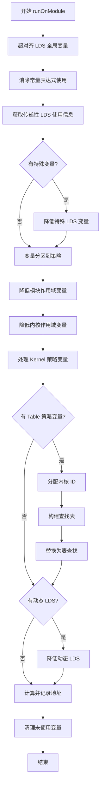

# AMDGPULowerModuleLDSPass.cpp 代码功能详解

## 1. 主要功能概括

<a name="ref-block_0"></a>该 Pass 的核心目标是**消除非内核函数中对 LDS（Local Data Store，本地数据存储）的使用**。 llvm-project:9-10[<sup>↗</sup>](#block_0) 

LDS 是 AMD GPU 中每个内核执行时分配的连续内存空间。 llvm-project:10-10 

**主要作用与效果：**
- 避免不必要的 LDS 分配，因为这会影响 GPU 占用率并可能导致编译失败
- 确保不同内核之间不会相互施加开销
- 通过四种策略（Module、Table、Kernel、Hybrid）精确控制 LDS 分配
<a name="ref-block_1"></a>- 实现零运行时成本或精确分配的平衡 llvm-project:41-44[<sup>↗</sup>](#block_1) 

## 2. 主要实现步骤/子功能

<a name="ref-block_15"></a>该 Pass 的 `runOnModule` 函数包含以下核心步骤： llvm-project:1047-1241[<sup>↗</sup>](#block_15) 

### 步骤列表：

1. **超对齐 LDS 全局变量** (`superAlignLDSGlobals`)
2. **消除常量表达式使用** (`eliminateConstantExprUsesOfLDSFromAllInstructions`)
3. **获取传递性 LDS 使用信息** (`getTransitiveUsesOfLDS`)
4. **降低特殊 LDS 变量** (`lowerSpecialLDSVariables`)
5. **变量分区到不同策略** (`partitionVariablesIntoIndirectStrategies`)
6. **降低模块作用域结构变量** (`lowerModuleScopeStructVariables`)
7. **降低内核作用域结构变量** (`lowerKernelScopeStructVariables`)
8. **为内核分配 ID** (`assignLDSKernelIDToEachKernel`)
9. **构建查找表** (`buildLookupTable`)
10. **降低动态 LDS 变量** (`lowerDynamicLDSVariables`)
11. **记录绝对地址** (地址计算和记录)
12. **清理未使用的变量**

## 3. 各步骤/子功能的具体描述分析

### 3.1 超对齐 LDS 全局变量
**功能：** 增加 LDS 全局变量的对齐以最大化使用对齐的 LDS 指令访问它们的机会。 llvm-project:1244-1246 

**实现细节：**
- 根据变量大小设置合适的对齐（16、8、4、2 字节）
- 仅处理具有初始化器的 LDS 变量
- 跳过已分配绝对地址的变量 llvm-project:1246-1291 

### 3.2 消除常量表达式使用
**功能：** 将所有引用 LDS 全局变量的常量表达式转换为指令。 llvm-project:1051-1051 

<a name="ref-block_17"></a>**原因：** 常量在 LLVM 中是唯一的，一个引用 LDS 全局的 ConstantExpr 可能被多个不同函数使用，但这个 Pass 需要针对分配 LDS 的内核来特化变量。 llvm-project:97-101[<sup>↗</sup>](#block_17) 

### 3.3 获取传递性 LDS 使用信息
**功能：** 分析每个内核通过直接访问或函数调用间接访问了哪些 LDS 变量。 llvm-project:1055-1057 

**返回的数据结构：** `LDSUsesInfoTy` 包含：
- `direct_access`: 函数直接访问的 LDS 变量映射
- `indirect_access`: 通过调用其他函数间接访问的 LDS 变量映射
<a name="ref-block_18"></a>- `HasSpecialGVs`: 是否包含特殊全局变量（如命名屏障） llvm-project:44-48[<sup>↗</sup>](#block_18) 

### 3.4 降低特殊 LDS 变量
**功能：** 对特殊的 LDS 变量（如命名屏障）进行特殊地址分配。 llvm-project:1069-1073 

**实现策略：**
- **第一轮：** 对被多个内核间接访问的命名屏障给予模块级绝对地址分配
<a name="ref-block_14"></a>- **第二轮：** 对仅被单个内核间接访问或被多个内核直接访问的命名屏障给予内核相对地址分配 llvm-project:958-1045[<sup>↗</sup>](#block_14) 

### 3.5 变量分区到不同策略
**功能：** 根据配置的降低策略，将需要间接访问的 LDS 变量分配到四种策略之一。 llvm-project:1080-1083 

**四种策略：**

| 策略 | 精确分配 | 零运行时成本 | 通用性 |
|------|---------|-------------|--------|
| Module | 否 | 是 | 是 |
| Table | 是 | 否 | 是 |
| Kernel | 是 | 是 | 否 |
<a name="ref-block_2"></a>| Hybrid | 是 | 部分 | 是 | llvm-project:60-66[<sup>↗</sup>](#block_2) 

**具体实现：**
- **Module 策略：** 将变量放入模块作用域结构，所有内核分配
- **Table 策略：** 通过查找表动态获取变量地址
- **Kernel 策略：** 仅适用于只被一个内核访问的变量
<a name="ref-block_10"></a>- **Hybrid 策略：** 智能混合使用上述策略以优化性能 llvm-project:593-667[<sup>↗</sup>](#block_10) 

### 3.6 降低模块作用域结构变量
**功能：** 为模块作用域的 LDS 变量创建一个统一的结构体，替换对这些变量的使用。 llvm-project:669-681 

**实现步骤：**
1. 创建包含所有模块作用域变量的结构体 `llvm.amdgcn.module.lds`
2. 将结构体地址记录为绝对地址 0
3. 替换非内核函数中对原变量的所有使用
<a name="ref-block_11"></a>4. 对需要分配此结构的内核，替换其中的使用并标记 llvm-project:669-735[<sup>↗</sup>](#block_11) 

### 3.7 降低内核作用域结构变量
**功能：** 为每个内核创建独立的 LDS 结构体，包含该内核使用的非模块作用域变量。 llvm-project:737-744 

**实现细节：**
- 每个内核的结构体命名为 `llvm.amdgcn.kernel.<kernel_name>.lds`
- 包含内核直接和间接访问的所有非动态 LDS 变量
- 排除已在模块作用域结构中的变量
<a name="ref-block_12"></a>- 通过名称关联内核函数与其 LDS 结构 llvm-project:737-818[<sup>↗</sup>](#block_12) 

### 3.8 为内核分配 ID
**功能：** 为需要通过表查找访问 LDS 或分配动态 LDS 的内核分配唯一的整数标识符。 llvm-project:545-552 

**实现方式：**
- 以可重现的顺序（按名称排序）为内核分配 ID
- 将 ID 作为元数据 `llvm.amdgcn.lds.kernel.id` 附加到内核
<a name="ref-block_9"></a>- 后端将此降低为特定的 SGPR，可通过 `amdgcn_lds_kernel_id` 内置函数读取 llvm-project:545-591[<sup>↗</sup>](#block_9) 

### 3.9 构建查找表
**功能：** 为表查找策略的变量创建一个常量全局数组，存储每个内核中每个变量的地址。 llvm-project:340-346 

**表结构：**
- 外层数组：每个元素对应一个内核（按内核 ID 排序）
- 内层数组：每个元素对应一个变量的地址（如果内核未分配该变量则为 poison）
<a name="ref-block_6"></a>- 表名称：`llvm.amdgcn.lds.offset.table` llvm-project:340-376[<sup>↗</sup>](#block_6) 

<a name="ref-block_7"></a>**访问方式：** 非内核函数通过内核 ID 和变量索引进行二维查找。 llvm-project:378-412[<sup>↗</sup>](#block_7) 

### 3.10 降低动态 LDS 变量
<a name="ref-block_4"></a>**功能：** 处理动态分配的 LDS 变量（大小为 0 的外部 LDS 变量）。 llvm-project:115-124[<sup>↗</sup>](#block_4) 

**实现策略：**
1. 为每个需要动态 LDS 的内核创建代表性的动态 LDS 变量（具有最大对齐）
2. 所有动态 LDS 变量在同一内核中都位于相同地址（别名）
3. 创建查找表 `llvm.amdgcn.dynlds.offset.table` 存储每个内核的动态 LDS 地址
<a name="ref-block_13"></a>4. 替换非内核函数中的使用为表查找 llvm-project:866-925[<sup>↗</sup>](#block_13) 

### 3.11 记录绝对地址
**功能：** 为所有分配的 LDS 结构计算并记录其在 LDS 内存中的绝对偏移地址。 llvm-project:1156-1230 

**内存布局顺序：**
```
{
  module.lds (偏移 0)
  对齐填充
  kernel.<name>.lds
  对齐填充
  动态 LDS 变量
}
``` llvm-project:1167-1174 

<a name="ref-block_8"></a>**地址记录方式：** 通过 `MD_absolute_symbol` 元数据记录半开区间 [Address, Address+1)。 llvm-project:516-527[<sup>↗</sup>](#block_8) 

### 3.12 清理未使用的变量
**功能：** 删除所有已降低且不再使用的原始 LDS 全局变量。 llvm-project:1232-1238 

## 4. 步骤/子功能之间的关系

### 执行流程图：



### 关键依赖关系：

1. **预处理阶段（步骤 1-3）：**
   - 超对齐和常量表达式消除为后续转换准备干净的 IR
   - 传递性使用信息是所有后续决策的基础

2. **策略分配阶段（步骤 4-5）：**
   - 特殊变量处理优先于普通变量
   - 分区决定了哪些变量使用哪种降低策略

3. **结构创建阶段（步骤 6-7）：**
   - 模块作用域结构必须先创建（偏移 0）
   - 内核作用域结构依赖于模块作用域结构已确定

4. **表查找支持（步骤 8-9）：**
   - 内核 ID 分配是构建查找表的前提
   - 查找表构建依赖于内核作用域结构已创建
   - 表查找替换依赖于查找表已构建

5. **动态 LDS 处理（步骤 10）：**
   - 依赖内核 ID 分配
   - 与静态 LDS 分配并行但独立

6. **最终确定阶段（步骤 11-12）：**
   - 地址记录需要所有结构都已创建
   - 清理必须在所有替换完成后进行

### 策略间的协同：

- **Module + Kernel 策略：** 模块作用域变量对所有内核可见，内核作用域变量仅对特定内核可见，互不冲突
- **Table 策略：** 作为 Module 和 Kernel 策略无法覆盖情况的补充（被多个内核访问但不适合 Module）
<a name="ref-block_3"></a>- **Hybrid 策略：** 智能组合三种策略，选择被最多内核使用的变量用 Module，单内核变量用 Kernel，其余用 Table llvm-project:96-111[<sup>↗</sup>](#block_3) 

## Notes

<a name="ref-block_5"></a>该 Pass 是 AMDGPU 后端中处理 LDS 内存管理的核心组件，通过多种策略平衡了编译时优化、运行时性能和内存使用。其设计确保了不同内核之间的 LDS 使用互不干扰，同时最大化了 LDS 访问效率。后端的 `AMDGPUMachineFunction` 负责实际分配这些标记的 LDS 变量，并验证元数据的正确性。 llvm-project:135-142[<sup>↗</sup>](#block_5)


### Citations


<a name="block_0"></a>**File:** llvm/lib/Target/AMDGPU/AMDGPULowerModuleLDSPass.cpp (L9-10) [<sup>↩</sup>](#ref-block_0)

```cpp
// This pass eliminates local data store, LDS, uses from non-kernel functions.
// LDS is contiguous memory allocated per kernel execution.
```

<a name="block_1"></a>**File:** llvm/lib/Target/AMDGPU/AMDGPULowerModuleLDSPass.cpp (L41-44) [<sup>↩</sup>](#ref-block_1)

```cpp
// to avoid allocating any LDS where it is not necessary, as that impacts
// occupancy and may fail the compilation, while not imposing overhead on a
// feature whose primary advantage over global memory is performance. The basic
// design goal is to avoid one kernel imposing overhead on another.
```

<a name="block_2"></a>**File:** llvm/lib/Target/AMDGPU/AMDGPULowerModuleLDSPass.cpp (L60-66) [<sup>↩</sup>](#ref-block_2)

```cpp
// Strategy | Precise allocation | Zero runtime cost | General purpose |
//  --------+--------------------+-------------------+-----------------+
//   Module |                 No |               Yes |             Yes |
//    Table |                Yes |                No |             Yes |
//   Kernel |                Yes |               Yes |              No |
//   Hybrid |                Yes |           Partial |             Yes |
//
```

<a name="block_3"></a>**File:** llvm/lib/Target/AMDGPU/AMDGPULowerModuleLDSPass.cpp (L96-111) [<sup>↩</sup>](#ref-block_3)

```cpp
// Hybrid lowering is a mixture of the above. It uses the zero cost kernel
// lowering where it can. It lowers the variable accessed by the greatest
// number of kernels using the module strategy as that is free for the first
// variable. Any futher variables that can be lowered with the module strategy
// without incurring LDS memory overhead are. The remaining ones are lowered
// via table.
//
// Consequences
// - No heuristics or user controlled magic numbers, hybrid is the right choice
// - Kernels that don't use functions (or have had them all inlined) are not
//   affected by any lowering for kernels that do.
// - Kernels that don't make indirect function calls are not affected by those
//   that do.
// - Variables which are used by lots of kernels, e.g. those injected by a
//   language runtime in most kernels, are expected to have no overhead
// - Implementations that instantiate templates per-kernel where those templates
```

<a name="block_4"></a>**File:** llvm/lib/Target/AMDGPU/AMDGPULowerModuleLDSPass.cpp (L115-124) [<sup>↩</sup>](#ref-block_4)

```cpp
// Dynamic LDS implementation
// Dynamic LDS is lowered similarly to the "table" strategy above and uses the
// same intrinsic to identify which kernel is at the root of the dynamic call
// graph. This relies on the specified behaviour that all dynamic LDS variables
// alias one another, i.e. are at the same address, with respect to a given
// kernel. Therefore this pass creates new dynamic LDS variables for each kernel
// that allocates any dynamic LDS and builds a table of addresses out of those.
// The AMDGPUPromoteAlloca pass skips kernels that use dynamic LDS.
// The corresponding optimisation for "kernel" lowering where the table lookup
// is elided is not implemented.
```

<a name="block_5"></a>**File:** llvm/lib/Target/AMDGPU/AMDGPULowerModuleLDSPass.cpp (L135-142) [<sup>↩</sup>](#ref-block_5)

```cpp
// where given variables should be allocated and marks them with metadata,
// MD_absolute_symbol. The backend places the variables in coincidentally the
// same location and raises a fatal error if something has gone awry. This works
// in practice because the only pass between this one and the backend that
// changes LDS is PromoteAlloca and the changes it makes do not conflict.
//
// Addresses are written to constant global arrays based on the same metadata.
//
```

<a name="block_6"></a>**File:** llvm/lib/Target/AMDGPU/AMDGPULowerModuleLDSPass.cpp (L340-376) [<sup>↩</sup>](#ref-block_6)

```cpp
  static GlobalVariable *buildLookupTable(
      Module &M, ArrayRef<GlobalVariable *> Variables,
      ArrayRef<Function *> kernels,
      DenseMap<Function *, LDSVariableReplacement> &KernelToReplacement) {
    if (Variables.empty()) {
      return nullptr;
    }
    LLVMContext &Ctx = M.getContext();

    const size_t NumberVariables = Variables.size();
    const size_t NumberKernels = kernels.size();

    ArrayType *KernelOffsetsType =
        ArrayType::get(Type::getInt32Ty(Ctx), NumberVariables);

    ArrayType *AllKernelsOffsetsType =
        ArrayType::get(KernelOffsetsType, NumberKernels);

    Constant *Missing = PoisonValue::get(KernelOffsetsType);
    std::vector<Constant *> overallConstantExprElts(NumberKernels);
    for (size_t i = 0; i < NumberKernels; i++) {
      auto Replacement = KernelToReplacement.find(kernels[i]);
      overallConstantExprElts[i] =
          (Replacement == KernelToReplacement.end())
              ? Missing
              : getAddressesOfVariablesInKernel(
                    Ctx, Variables, Replacement->second.LDSVarsToConstantGEP);
    }

    Constant *init =
        ConstantArray::get(AllKernelsOffsetsType, overallConstantExprElts);

    return new GlobalVariable(
        M, AllKernelsOffsetsType, true, GlobalValue::InternalLinkage, init,
        "llvm.amdgcn.lds.offset.table", nullptr, GlobalValue::NotThreadLocal,
        AMDGPUAS::CONSTANT_ADDRESS);
  }
```

<a name="block_7"></a>**File:** llvm/lib/Target/AMDGPU/AMDGPULowerModuleLDSPass.cpp (L378-412) [<sup>↩</sup>](#ref-block_7)

```cpp
  void replaceUseWithTableLookup(Module &M, IRBuilder<> &Builder,
                                 GlobalVariable *LookupTable,
                                 GlobalVariable *GV, Use &U,
                                 Value *OptionalIndex) {
    // Table is a constant array of the same length as OrderedKernels
    LLVMContext &Ctx = M.getContext();
    Type *I32 = Type::getInt32Ty(Ctx);
    auto *I = cast<Instruction>(U.getUser());

    Value *tableKernelIndex = getTableLookupKernelIndex(M, I->getFunction());

    if (auto *Phi = dyn_cast<PHINode>(I)) {
      BasicBlock *BB = Phi->getIncomingBlock(U);
      Builder.SetInsertPoint(&(*(BB->getFirstInsertionPt())));
    } else {
      Builder.SetInsertPoint(I);
    }

    SmallVector<Value *, 3> GEPIdx = {
        ConstantInt::get(I32, 0),
        tableKernelIndex,
    };
    if (OptionalIndex)
      GEPIdx.push_back(OptionalIndex);

    Value *Address = Builder.CreateInBoundsGEP(
        LookupTable->getValueType(), LookupTable, GEPIdx, GV->getName());

    Value *loaded = Builder.CreateLoad(I32, Address);

    Value *replacement =
        Builder.CreateIntToPtr(loaded, GV->getType(), GV->getName());

    U.set(replacement);
  }
```

<a name="block_8"></a>**File:** llvm/lib/Target/AMDGPU/AMDGPULowerModuleLDSPass.cpp (L516-527) [<sup>↩</sup>](#ref-block_8)

```cpp
  static void recordLDSAbsoluteAddress(Module *M, GlobalVariable *GV,
                                       uint32_t Address) {
    // Write the specified address into metadata where it can be retrieved by
    // the assembler. Format is a half open range, [Address Address+1)
    LLVMContext &Ctx = M->getContext();
    auto *IntTy =
        M->getDataLayout().getIntPtrType(Ctx, AMDGPUAS::LOCAL_ADDRESS);
    auto *MinC = ConstantAsMetadata::get(ConstantInt::get(IntTy, Address));
    auto *MaxC = ConstantAsMetadata::get(ConstantInt::get(IntTy, Address + 1));
    GV->setMetadata(LLVMContext::MD_absolute_symbol,
                    MDNode::get(Ctx, {MinC, MaxC}));
  }
```

<a name="block_9"></a>**File:** llvm/lib/Target/AMDGPU/AMDGPULowerModuleLDSPass.cpp (L545-591) [<sup>↩</sup>](#ref-block_9)

```cpp
  static std::vector<Function *> assignLDSKernelIDToEachKernel(
      Module *M, DenseSet<Function *> const &KernelsThatAllocateTableLDS,
      DenseSet<Function *> const &KernelsThatIndirectlyAllocateDynamicLDS) {
    // Associate kernels in the set with an arbitrary but reproducible order and
    // annotate them with that order in metadata. This metadata is recognised by
    // the backend and lowered to a SGPR which can be read from using
    // amdgcn_lds_kernel_id.

    std::vector<Function *> OrderedKernels;
    if (!KernelsThatAllocateTableLDS.empty() ||
        !KernelsThatIndirectlyAllocateDynamicLDS.empty()) {

      for (Function &Func : M->functions()) {
        if (Func.isDeclaration())
          continue;
        if (!isKernelLDS(&Func))
          continue;

        if (KernelsThatAllocateTableLDS.contains(&Func) ||
            KernelsThatIndirectlyAllocateDynamicLDS.contains(&Func)) {
          assert(Func.hasName()); // else fatal error earlier
          OrderedKernels.push_back(&Func);
        }
      }

      // Put them in an arbitrary but reproducible order
      OrderedKernels = sortByName(std::move(OrderedKernels));

      // Annotate the kernels with their order in this vector
      LLVMContext &Ctx = M->getContext();
      IRBuilder<> Builder(Ctx);

      if (OrderedKernels.size() > UINT32_MAX) {
        // 32 bit keeps it in one SGPR. > 2**32 kernels won't fit on the GPU
        reportFatalUsageError("unimplemented LDS lowering for > 2**32 kernels");
      }

      for (size_t i = 0; i < OrderedKernels.size(); i++) {
        Metadata *AttrMDArgs[1] = {
            ConstantAsMetadata::get(Builder.getInt32(i)),
        };
        OrderedKernels[i]->setMetadata("llvm.amdgcn.lds.kernel.id",
                                       MDNode::get(Ctx, AttrMDArgs));
      }
    }
    return OrderedKernels;
  }
```

<a name="block_10"></a>**File:** llvm/lib/Target/AMDGPU/AMDGPULowerModuleLDSPass.cpp (L593-667) [<sup>↩</sup>](#ref-block_10)

```cpp
  static void partitionVariablesIntoIndirectStrategies(
      Module &M, LDSUsesInfoTy const &LDSUsesInfo,
      VariableFunctionMap &LDSToKernelsThatNeedToAccessItIndirectly,
      DenseSet<GlobalVariable *> &ModuleScopeVariables,
      DenseSet<GlobalVariable *> &TableLookupVariables,
      DenseSet<GlobalVariable *> &KernelAccessVariables,
      DenseSet<GlobalVariable *> &DynamicVariables) {

    GlobalVariable *HybridModuleRoot =
        LoweringKindLoc != LoweringKind::hybrid
            ? nullptr
            : chooseBestVariableForModuleStrategy(
                  M.getDataLayout(), LDSToKernelsThatNeedToAccessItIndirectly);

    DenseSet<Function *> const EmptySet;
    DenseSet<Function *> const &HybridModuleRootKernels =
        HybridModuleRoot
            ? LDSToKernelsThatNeedToAccessItIndirectly[HybridModuleRoot]
            : EmptySet;

    for (auto &K : LDSToKernelsThatNeedToAccessItIndirectly) {
      // Each iteration of this loop assigns exactly one global variable to
      // exactly one of the implementation strategies.

      GlobalVariable *GV = K.first;
      assert(AMDGPU::isLDSVariableToLower(*GV));
      assert(K.second.size() != 0);

      if (AMDGPU::isDynamicLDS(*GV)) {
        DynamicVariables.insert(GV);
        continue;
      }

      switch (LoweringKindLoc) {
      case LoweringKind::module:
        ModuleScopeVariables.insert(GV);
        break;

      case LoweringKind::table:
        TableLookupVariables.insert(GV);
        break;

      case LoweringKind::kernel:
        if (K.second.size() == 1) {
          KernelAccessVariables.insert(GV);
        } else {
          // FIXME: This should use DiagnosticInfo
          reportFatalUsageError(
              "cannot lower LDS '" + GV->getName() +
              "' to kernel access as it is reachable from multiple kernels");
        }
        break;

      case LoweringKind::hybrid: {
        if (GV == HybridModuleRoot) {
          assert(K.second.size() != 1);
          ModuleScopeVariables.insert(GV);
        } else if (K.second.size() == 1) {
          KernelAccessVariables.insert(GV);
        } else if (K.second == HybridModuleRootKernels) {
          ModuleScopeVariables.insert(GV);
        } else {
          TableLookupVariables.insert(GV);
        }
        break;
      }
      }
    }

    // All LDS variables accessed indirectly have now been partitioned into
    // the distinct lowering strategies.
    assert(ModuleScopeVariables.size() + TableLookupVariables.size() +
               KernelAccessVariables.size() + DynamicVariables.size() ==
           LDSToKernelsThatNeedToAccessItIndirectly.size());
  }
```

<a name="block_11"></a>**File:** llvm/lib/Target/AMDGPU/AMDGPULowerModuleLDSPass.cpp (L669-735) [<sup>↩</sup>](#ref-block_11)

```cpp
  static GlobalVariable *lowerModuleScopeStructVariables(
      Module &M, DenseSet<GlobalVariable *> const &ModuleScopeVariables,
      DenseSet<Function *> const &KernelsThatAllocateModuleLDS) {
    // Create a struct to hold the ModuleScopeVariables
    // Replace all uses of those variables from non-kernel functions with the
    // new struct instance Replace only the uses from kernel functions that will
    // allocate this instance. That is a space optimisation - kernels that use a
    // subset of the module scope struct and do not need to allocate it for
    // indirect calls will only allocate the subset they use (they do so as part
    // of the per-kernel lowering).
    if (ModuleScopeVariables.empty()) {
      return nullptr;
    }

    LLVMContext &Ctx = M.getContext();

    LDSVariableReplacement ModuleScopeReplacement =
        createLDSVariableReplacement(M, "llvm.amdgcn.module.lds",
                                     ModuleScopeVariables);

    appendToCompilerUsed(M, {static_cast<GlobalValue *>(
                                ConstantExpr::getPointerBitCastOrAddrSpaceCast(
                                    cast<Constant>(ModuleScopeReplacement.SGV),
                                    PointerType::getUnqual(Ctx)))});

    // module.lds will be allocated at zero in any kernel that allocates it
    recordLDSAbsoluteAddress(&M, ModuleScopeReplacement.SGV, 0);

    // historic
    removeLocalVarsFromUsedLists(M, ModuleScopeVariables);

    // Replace all uses of module scope variable from non-kernel functions
    replaceLDSVariablesWithStruct(
        M, ModuleScopeVariables, ModuleScopeReplacement, [&](Use &U) {
          Instruction *I = dyn_cast<Instruction>(U.getUser());
          if (!I) {
            return false;
          }
          Function *F = I->getFunction();
          return !isKernelLDS(F);
        });

    // Replace uses of module scope variable from kernel functions that
    // allocate the module scope variable, otherwise leave them unchanged
    // Record on each kernel whether the module scope global is used by it

    for (Function &Func : M.functions()) {
      if (Func.isDeclaration() || !isKernelLDS(&Func))
        continue;

      if (KernelsThatAllocateModuleLDS.contains(&Func)) {
        replaceLDSVariablesWithStruct(
            M, ModuleScopeVariables, ModuleScopeReplacement, [&](Use &U) {
              Instruction *I = dyn_cast<Instruction>(U.getUser());
              if (!I) {
                return false;
              }
              Function *F = I->getFunction();
              return F == &Func;
            });

        markUsedByKernel(&Func, ModuleScopeReplacement.SGV);
      }
    }

    return ModuleScopeReplacement.SGV;
  }
```

<a name="block_12"></a>**File:** llvm/lib/Target/AMDGPU/AMDGPULowerModuleLDSPass.cpp (L737-818) [<sup>↩</sup>](#ref-block_12)

```cpp
  static DenseMap<Function *, LDSVariableReplacement>
  lowerKernelScopeStructVariables(
      Module &M, LDSUsesInfoTy &LDSUsesInfo,
      DenseSet<GlobalVariable *> const &ModuleScopeVariables,
      DenseSet<Function *> const &KernelsThatAllocateModuleLDS,
      GlobalVariable *MaybeModuleScopeStruct) {

    // Create a struct for each kernel for the non-module-scope variables.

    DenseMap<Function *, LDSVariableReplacement> KernelToReplacement;
    for (Function &Func : M.functions()) {
      if (Func.isDeclaration() || !isKernelLDS(&Func))
        continue;

      DenseSet<GlobalVariable *> KernelUsedVariables;
      // Allocating variables that are used directly in this struct to get
      // alignment aware allocation and predictable frame size.
      for (auto &v : LDSUsesInfo.direct_access[&Func]) {
        if (!AMDGPU::isDynamicLDS(*v)) {
          KernelUsedVariables.insert(v);
        }
      }

      // Allocating variables that are accessed indirectly so that a lookup of
      // this struct instance can find them from nested functions.
      for (auto &v : LDSUsesInfo.indirect_access[&Func]) {
        if (!AMDGPU::isDynamicLDS(*v)) {
          KernelUsedVariables.insert(v);
        }
      }

      // Variables allocated in module lds must all resolve to that struct,
      // not to the per-kernel instance.
      if (KernelsThatAllocateModuleLDS.contains(&Func)) {
        for (GlobalVariable *v : ModuleScopeVariables) {
          KernelUsedVariables.erase(v);
        }
      }

      if (KernelUsedVariables.empty()) {
        // Either used no LDS, or the LDS it used was all in the module struct
        // or dynamically sized
        continue;
      }

      // The association between kernel function and LDS struct is done by
      // symbol name, which only works if the function in question has a
      // name This is not expected to be a problem in practice as kernels
      // are called by name making anonymous ones (which are named by the
      // backend) difficult to use. This does mean that llvm test cases need
      // to name the kernels.
      if (!Func.hasName()) {
        reportFatalUsageError("anonymous kernels cannot use LDS variables");
      }

      std::string VarName =
          (Twine("llvm.amdgcn.kernel.") + Func.getName() + ".lds").str();

      auto Replacement =
          createLDSVariableReplacement(M, VarName, KernelUsedVariables, &Func);

      // If any indirect uses, create a direct use to ensure allocation
      // TODO: Simpler to unconditionally mark used but that regresses
      // codegen in test/CodeGen/AMDGPU/noclobber-barrier.ll
      auto Accesses = LDSUsesInfo.indirect_access.find(&Func);
      if ((Accesses != LDSUsesInfo.indirect_access.end()) &&
          !Accesses->second.empty())
        markUsedByKernel(&Func, Replacement.SGV);

      // remove preserves existing codegen
      removeLocalVarsFromUsedLists(M, KernelUsedVariables);
      KernelToReplacement[&Func] = Replacement;

      // Rewrite uses within kernel to the new struct
      replaceLDSVariablesWithStruct(
          M, KernelUsedVariables, Replacement, [&Func](Use &U) {
            Instruction *I = dyn_cast<Instruction>(U.getUser());
            return I && I->getFunction() == &Func;
          });
    }
    return KernelToReplacement;
  }
```

<a name="block_13"></a>**File:** llvm/lib/Target/AMDGPU/AMDGPULowerModuleLDSPass.cpp (L866-925) [<sup>↩</sup>](#ref-block_13)

```cpp
  DenseMap<Function *, GlobalVariable *> lowerDynamicLDSVariables(
      Module &M, LDSUsesInfoTy &LDSUsesInfo,
      DenseSet<Function *> const &KernelsThatIndirectlyAllocateDynamicLDS,
      DenseSet<GlobalVariable *> const &DynamicVariables,
      std::vector<Function *> const &OrderedKernels) {
    DenseMap<Function *, GlobalVariable *> KernelToCreatedDynamicLDS;
    if (!KernelsThatIndirectlyAllocateDynamicLDS.empty()) {
      LLVMContext &Ctx = M.getContext();
      IRBuilder<> Builder(Ctx);
      Type *I32 = Type::getInt32Ty(Ctx);

      std::vector<Constant *> newDynamicLDS;

      // Table is built in the same order as OrderedKernels
      for (auto &func : OrderedKernels) {

        if (KernelsThatIndirectlyAllocateDynamicLDS.contains(func)) {
          assert(isKernelLDS(func));
          if (!func->hasName()) {
            reportFatalUsageError("anonymous kernels cannot use LDS variables");
          }

          GlobalVariable *N =
              buildRepresentativeDynamicLDSInstance(M, LDSUsesInfo, func);

          KernelToCreatedDynamicLDS[func] = N;

          markUsedByKernel(func, N);

          auto *emptyCharArray = ArrayType::get(Type::getInt8Ty(Ctx), 0);
          auto *GEP = ConstantExpr::getGetElementPtr(
              emptyCharArray, N, ConstantInt::get(I32, 0), true);
          newDynamicLDS.push_back(ConstantExpr::getPtrToInt(GEP, I32));
        } else {
          newDynamicLDS.push_back(PoisonValue::get(I32));
        }
      }
      assert(OrderedKernels.size() == newDynamicLDS.size());

      ArrayType *t = ArrayType::get(I32, newDynamicLDS.size());
      Constant *init = ConstantArray::get(t, newDynamicLDS);
      GlobalVariable *table = new GlobalVariable(
          M, t, true, GlobalValue::InternalLinkage, init,
          "llvm.amdgcn.dynlds.offset.table", nullptr,
          GlobalValue::NotThreadLocal, AMDGPUAS::CONSTANT_ADDRESS);

      for (GlobalVariable *GV : DynamicVariables) {
        for (Use &U : make_early_inc_range(GV->uses())) {
          auto *I = dyn_cast<Instruction>(U.getUser());
          if (!I)
            continue;
          if (isKernelLDS(I->getFunction()))
            continue;

          replaceUseWithTableLookup(M, Builder, table, GV, U, nullptr);
        }
      }
    }
    return KernelToCreatedDynamicLDS;
  }
```

<a name="block_14"></a>**File:** llvm/lib/Target/AMDGPU/AMDGPULowerModuleLDSPass.cpp (L958-1045) [<sup>↩</sup>](#ref-block_14)

```cpp
  bool lowerSpecialLDSVariables(
      Module &M, LDSUsesInfoTy &LDSUsesInfo,
      VariableFunctionMap &LDSToKernelsThatNeedToAccessItIndirectly) {
    bool Changed = false;
    const DataLayout &DL = M.getDataLayout();
    // The 1st round: give module-absolute assignments
    int NumAbsolutes = 0;
    std::vector<GlobalVariable *> OrderedGVs;
    for (auto &K : LDSToKernelsThatNeedToAccessItIndirectly) {
      GlobalVariable *GV = K.first;
      if (!isNamedBarrier(*GV))
        continue;
      // give a module-absolute assignment if it is indirectly accessed by
      // multiple kernels. This is not precise, but we don't want to duplicate
      // a function when it is called by multiple kernels.
      if (LDSToKernelsThatNeedToAccessItIndirectly[GV].size() > 1) {
        OrderedGVs.push_back(GV);
      } else {
        // leave it to the 2nd round, which will give a kernel-relative
        // assignment if it is only indirectly accessed by one kernel
        LDSUsesInfo.direct_access[*K.second.begin()].insert(GV);
      }
      LDSToKernelsThatNeedToAccessItIndirectly.erase(GV);
    }
    OrderedGVs = sortByName(std::move(OrderedGVs));
    for (GlobalVariable *GV : OrderedGVs) {
      unsigned BarrierScope = llvm::AMDGPU::Barrier::BARRIER_SCOPE_WORKGROUP;
      unsigned BarId = NumAbsolutes + 1;
      unsigned BarCnt = DL.getTypeAllocSize(GV->getValueType()) / 16;
      NumAbsolutes += BarCnt;

      // 4 bits for alignment, 5 bits for the barrier num,
      // 3 bits for the barrier scope
      unsigned Offset = 0x802000u | BarrierScope << 9 | BarId << 4;
      recordLDSAbsoluteAddress(&M, GV, Offset);
    }
    OrderedGVs.clear();

    // The 2nd round: give a kernel-relative assignment for GV that
    // either only indirectly accessed by single kernel or only directly
    // accessed by multiple kernels.
    std::vector<Function *> OrderedKernels;
    for (auto &K : LDSUsesInfo.direct_access) {
      Function *F = K.first;
      assert(isKernelLDS(F));
      OrderedKernels.push_back(F);
    }
    OrderedKernels = sortByName(std::move(OrderedKernels));

    llvm::DenseMap<Function *, uint32_t> Kernel2BarId;
    for (Function *F : OrderedKernels) {
      for (GlobalVariable *GV : LDSUsesInfo.direct_access[F]) {
        if (!isNamedBarrier(*GV))
          continue;

        LDSUsesInfo.direct_access[F].erase(GV);
        if (GV->isAbsoluteSymbolRef()) {
          // already assigned
          continue;
        }
        OrderedGVs.push_back(GV);
      }
      OrderedGVs = sortByName(std::move(OrderedGVs));
      for (GlobalVariable *GV : OrderedGVs) {
        // GV could also be used directly by other kernels. If so, we need to
        // create a new GV used only by this kernel and its function.
        auto NewGV = uniquifyGVPerKernel(M, GV, F);
        Changed |= (NewGV != GV);
        unsigned BarrierScope = llvm::AMDGPU::Barrier::BARRIER_SCOPE_WORKGROUP;
        unsigned BarId = Kernel2BarId[F];
        BarId += NumAbsolutes + 1;
        unsigned BarCnt = DL.getTypeAllocSize(GV->getValueType()) / 16;
        Kernel2BarId[F] += BarCnt;
        unsigned Offset = 0x802000u | BarrierScope << 9 | BarId << 4;
        recordLDSAbsoluteAddress(&M, NewGV, Offset);
      }
      OrderedGVs.clear();
    }
    // Also erase those special LDS variables from indirect_access.
    for (auto &K : LDSUsesInfo.indirect_access) {
      assert(isKernelLDS(K.first));
      for (GlobalVariable *GV : K.second) {
        if (isNamedBarrier(*GV))
          K.second.erase(GV);
      }
    }
    return Changed;
  }
```

<a name="block_15"></a>**File:** llvm/lib/Target/AMDGPU/AMDGPULowerModuleLDSPass.cpp (L1047-1241) [<sup>↩</sup>](#ref-block_15)

```cpp
  bool runOnModule(Module &M) {
    CallGraph CG = CallGraph(M);
    bool Changed = superAlignLDSGlobals(M);

    Changed |= eliminateConstantExprUsesOfLDSFromAllInstructions(M);

    Changed = true; // todo: narrow this down

    // For each kernel, what variables does it access directly or through
    // callees
    LDSUsesInfoTy LDSUsesInfo = getTransitiveUsesOfLDS(CG, M);

    // For each variable accessed through callees, which kernels access it
    VariableFunctionMap LDSToKernelsThatNeedToAccessItIndirectly;
    for (auto &K : LDSUsesInfo.indirect_access) {
      Function *F = K.first;
      assert(isKernelLDS(F));
      for (GlobalVariable *GV : K.second) {
        LDSToKernelsThatNeedToAccessItIndirectly[GV].insert(F);
      }
    }

    if (LDSUsesInfo.HasSpecialGVs) {
      // Special LDS variables need special address assignment
      Changed |= lowerSpecialLDSVariables(
          M, LDSUsesInfo, LDSToKernelsThatNeedToAccessItIndirectly);
    }

    // Partition variables accessed indirectly into the different strategies
    DenseSet<GlobalVariable *> ModuleScopeVariables;
    DenseSet<GlobalVariable *> TableLookupVariables;
    DenseSet<GlobalVariable *> KernelAccessVariables;
    DenseSet<GlobalVariable *> DynamicVariables;
    partitionVariablesIntoIndirectStrategies(
        M, LDSUsesInfo, LDSToKernelsThatNeedToAccessItIndirectly,
        ModuleScopeVariables, TableLookupVariables, KernelAccessVariables,
        DynamicVariables);

    // If the kernel accesses a variable that is going to be stored in the
    // module instance through a call then that kernel needs to allocate the
    // module instance
    const DenseSet<Function *> KernelsThatAllocateModuleLDS =
        kernelsThatIndirectlyAccessAnyOfPassedVariables(M, LDSUsesInfo,
                                                        ModuleScopeVariables);
    const DenseSet<Function *> KernelsThatAllocateTableLDS =
        kernelsThatIndirectlyAccessAnyOfPassedVariables(M, LDSUsesInfo,
                                                        TableLookupVariables);

    const DenseSet<Function *> KernelsThatIndirectlyAllocateDynamicLDS =
        kernelsThatIndirectlyAccessAnyOfPassedVariables(M, LDSUsesInfo,
                                                        DynamicVariables);

    GlobalVariable *MaybeModuleScopeStruct = lowerModuleScopeStructVariables(
        M, ModuleScopeVariables, KernelsThatAllocateModuleLDS);

    DenseMap<Function *, LDSVariableReplacement> KernelToReplacement =
        lowerKernelScopeStructVariables(M, LDSUsesInfo, ModuleScopeVariables,
                                        KernelsThatAllocateModuleLDS,
                                        MaybeModuleScopeStruct);

    // Lower zero cost accesses to the kernel instances just created
    for (auto &GV : KernelAccessVariables) {
      auto &funcs = LDSToKernelsThatNeedToAccessItIndirectly[GV];
      assert(funcs.size() == 1); // Only one kernel can access it
      LDSVariableReplacement Replacement =
          KernelToReplacement[*(funcs.begin())];

      DenseSet<GlobalVariable *> Vec;
      Vec.insert(GV);

      replaceLDSVariablesWithStruct(M, Vec, Replacement, [](Use &U) {
        return isa<Instruction>(U.getUser());
      });
    }

    // The ith element of this vector is kernel id i
    std::vector<Function *> OrderedKernels =
        assignLDSKernelIDToEachKernel(&M, KernelsThatAllocateTableLDS,
                                      KernelsThatIndirectlyAllocateDynamicLDS);

    if (!KernelsThatAllocateTableLDS.empty()) {
      LLVMContext &Ctx = M.getContext();
      IRBuilder<> Builder(Ctx);

      // The order must be consistent between lookup table and accesses to
      // lookup table
      auto TableLookupVariablesOrdered =
          sortByName(std::vector<GlobalVariable *>(TableLookupVariables.begin(),
                                                   TableLookupVariables.end()));

      GlobalVariable *LookupTable = buildLookupTable(
          M, TableLookupVariablesOrdered, OrderedKernels, KernelToReplacement);
      replaceUsesInInstructionsWithTableLookup(M, TableLookupVariablesOrdered,
                                               LookupTable);
    }

    DenseMap<Function *, GlobalVariable *> KernelToCreatedDynamicLDS =
        lowerDynamicLDSVariables(M, LDSUsesInfo,
                                 KernelsThatIndirectlyAllocateDynamicLDS,
                                 DynamicVariables, OrderedKernels);

    // Strip amdgpu-no-lds-kernel-id from all functions reachable from the
    // kernel. We may have inferred this wasn't used prior to the pass.
    // TODO: We could filter out subgraphs that do not access LDS globals.
    for (auto *KernelSet : {&KernelsThatIndirectlyAllocateDynamicLDS,
                            &KernelsThatAllocateTableLDS})
      for (Function *F : *KernelSet)
        removeFnAttrFromReachable(CG, F, {"amdgpu-no-lds-kernel-id"});

    // All kernel frames have been allocated. Calculate and record the
    // addresses.
    {
      const DataLayout &DL = M.getDataLayout();

      for (Function &Func : M.functions()) {
        if (Func.isDeclaration() || !isKernelLDS(&Func))
          continue;

        // All three of these are optional. The first variable is allocated at
        // zero. They are allocated by AMDGPUMachineFunction as one block.
        // Layout:
        //{
        //  module.lds
        //  alignment padding
        //  kernel instance
        //  alignment padding
        //  dynamic lds variables
        //}

        const bool AllocateModuleScopeStruct =
            MaybeModuleScopeStruct &&
            KernelsThatAllocateModuleLDS.contains(&Func);

        auto Replacement = KernelToReplacement.find(&Func);
        const bool AllocateKernelScopeStruct =
            Replacement != KernelToReplacement.end();

        const bool AllocateDynamicVariable =
            KernelToCreatedDynamicLDS.contains(&Func);

        uint32_t Offset = 0;

        if (AllocateModuleScopeStruct) {
          // Allocated at zero, recorded once on construction, not once per
          // kernel
          Offset += DL.getTypeAllocSize(MaybeModuleScopeStruct->getValueType());
        }

        if (AllocateKernelScopeStruct) {
          GlobalVariable *KernelStruct = Replacement->second.SGV;
          Offset = alignTo(Offset, AMDGPU::getAlign(DL, KernelStruct));
          recordLDSAbsoluteAddress(&M, KernelStruct, Offset);
          Offset += DL.getTypeAllocSize(KernelStruct->getValueType());
        }

        // If there is dynamic allocation, the alignment needed is included in
        // the static frame size. There may be no reference to the dynamic
        // variable in the kernel itself, so without including it here, that
        // alignment padding could be missed.
        if (AllocateDynamicVariable) {
          GlobalVariable *DynamicVariable = KernelToCreatedDynamicLDS[&Func];
          Offset = alignTo(Offset, AMDGPU::getAlign(DL, DynamicVariable));
          recordLDSAbsoluteAddress(&M, DynamicVariable, Offset);
        }

        if (Offset != 0) {
          (void)TM; // TODO: Account for target maximum LDS
          std::string Buffer;
          raw_string_ostream SS{Buffer};
          SS << format("%u", Offset);

          // Instead of explicitly marking kernels that access dynamic variables
          // using special case metadata, annotate with min-lds == max-lds, i.e.
          // that there is no more space available for allocating more static
          // LDS variables. That is the right condition to prevent allocating
          // more variables which would collide with the addresses assigned to
          // dynamic variables.
          if (AllocateDynamicVariable)
            SS << format(",%u", Offset);

          Func.addFnAttr("amdgpu-lds-size", Buffer);
        }
      }
    }

    for (auto &GV : make_early_inc_range(M.globals()))
      if (AMDGPU::isLDSVariableToLower(GV)) {
        // probably want to remove from used lists
        GV.removeDeadConstantUsers();
        if (GV.use_empty())
          GV.eraseFromParent();
      }

    return Changed;
  }
```

<a name="block_16"></a>**File:** llvm/lib/Target/AMDGPU/AMDGPULowerModuleLDSPass.cpp (L1244-1291)

```cpp
  // Increase the alignment of LDS globals if necessary to maximise the chance
  // that we can use aligned LDS instructions to access them.
  static bool superAlignLDSGlobals(Module &M) {
    const DataLayout &DL = M.getDataLayout();
    bool Changed = false;
    if (!SuperAlignLDSGlobals) {
      return Changed;
    }

    for (auto &GV : M.globals()) {
      if (GV.getType()->getPointerAddressSpace() != AMDGPUAS::LOCAL_ADDRESS) {
        // Only changing alignment of LDS variables
        continue;
      }
      if (!GV.hasInitializer()) {
        // cuda/hip extern __shared__ variable, leave alignment alone
        continue;
      }

      if (GV.isAbsoluteSymbolRef()) {
        // If the variable is already allocated, don't change the alignment
        continue;
      }

      Align Alignment = AMDGPU::getAlign(DL, &GV);
      TypeSize GVSize = DL.getTypeAllocSize(GV.getValueType());

      if (GVSize > 8) {
        // We might want to use a b96 or b128 load/store
        Alignment = std::max(Alignment, Align(16));
      } else if (GVSize > 4) {
        // We might want to use a b64 load/store
        Alignment = std::max(Alignment, Align(8));
      } else if (GVSize > 2) {
        // We might want to use a b32 load/store
        Alignment = std::max(Alignment, Align(4));
      } else if (GVSize > 1) {
        // We might want to use a b16 load/store
        Alignment = std::max(Alignment, Align(2));
      }

      if (Alignment != AMDGPU::getAlign(DL, &GV)) {
        Changed = true;
        GV.setAlignment(Alignment);
      }
    }
    return Changed;
  }
```

<a name="block_17"></a>**File:** llvm/lib/Target/AMDGPU/AMDGPUMemoryUtils.cpp (L97-101) [<sup>↩</sup>](#ref-block_17)

```cpp
bool eliminateConstantExprUsesOfLDSFromAllInstructions(Module &M) {
  // Constants are uniqued within LLVM. A ConstantExpr referring to a LDS
  // global may have uses from multiple different functions as a result.
  // This pass specialises LDS variables with respect to the kernel that
  // allocates them.
```

<a name="block_18"></a>**File:** llvm/lib/Target/AMDGPU/AMDGPUMemoryUtils.h (L44-48) [<sup>↩</sup>](#ref-block_18)

```text
struct LDSUsesInfoTy {
  FunctionVariableMap direct_access;
  FunctionVariableMap indirect_access;
  bool HasSpecialGVs = false;
};
```

