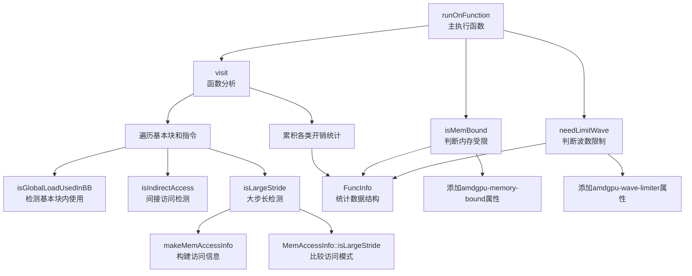

# AMDGPUPerfHintAnalysis.cpp 代码功能详解

## 1. 主要功能概述

<a name="ref-block_0"></a>该 Pass 的主要功能是**分析 AMDGPU 函数的内存访问模式，识别内存受限的函数，并为需要的内核添加性能优化提示**。 llvm-project:10-12[<sup>↗</sup>](#block_0) 

**作用与效果：**
- **识别内存受限函数**：为可能受内存带宽限制的函数添加 `amdgpu-memory-bound` 属性标记
- **建议波数限制**：为可能因缓存抖动而性能下降的内核添加 `amdgpu-wave-limiter` 属性，建议限制并发波数以提高缓存命中率
- **统计信息收集**：收集函数的内存指令开销、间接访问开销、大步长访问开销等信息 llvm-project:301-314 

## 2. 主要功能步骤和子功能

该 Pass 包含以下核心子功能：

### 2.1 **间接内存访问检测** (`isIndirectAccess`)
### 2.2 **大步长内存访问检测** (`isLargeStride`)
### 2.3 **基本块内全局加载使用检测** (`isGlobalLoadUsedInBB`)
### 2.4 **函数访问模式分析** (`visit`)
### 2.5 **内存受限判断** (`isMemBound`)
### 2.6 **波数限制需求判断** (`needLimitWave`)
### 2.7 **主执行函数** (`runOnFunction`)

## 3. 各子功能详细分析

### 3.1 间接内存访问检测 (`isIndirectAccess`)

<a name="ref-block_4"></a>**功能描述：** 检测指令是否进行了间接内存访问，即通过加载全局内存地址再访问该地址的模式（如 `a[b[i]]`）。 llvm-project:134-194[<sup>↗</sup>](#block_4) 

**实现机制：**
- 使用工作集（WorkSet）和已访问集（Visited）进行迭代分析
- 从内存指令的指针操作数开始追溯
- 检查是否存在从全局地址的 LoadInst，如果存在则判定为间接访问
- 递归处理 GEP、一元运算、二元运算、Select、ExtractElement 等指令

<a name="ref-block_1"></a>**权重影响：** 间接访问指令会被赋予 `IAWeight`（默认 1000）的权重，显著影响性能分析结果。 llvm-project:44-46[<sup>↗</sup>](#block_1) 

### 3.2 大步长内存访问检测 (`isLargeStride`)

<a name="ref-block_3"></a>**功能描述：** 识别大步长内存访问模式，例如 `a[i]`, `a[i+1000]`, `a[i+2000]` 这种访问模式。 llvm-project:104-111[<sup>↗</sup>](#block_3) 

**实现机制：**
- 构建当前访问的内存访问信息（MemAccessInfo），包含基地址和偏移量
- 与上一次访问（LastAccess）进行比较
<a name="ref-block_10"></a>- 如果两次访问的基地址相同，且偏移量差距超过阈值（默认 64 字节），则判定为大步长访问 llvm-project:347-356[<sup>↗</sup>](#block_10) llvm-project:373-386 

<a name="ref-block_2"></a>**权重影响：** 大步长访问指令会被赋予 `LSWeight`（默认 1000）的权重。 llvm-project:48-50[<sup>↗</sup>](#block_2) 

### 3.3 基本块内全局加载使用检测 (`isGlobalLoadUsedInBB`)

<a name="ref-block_5"></a>**功能描述：** 检测全局内存加载指令是否在同一基本块内被使用，用于识别密集的全局内存访问模式。 llvm-project:196-212[<sup>↗</sup>](#block_5) 

**实现机制：**
- 验证指令是否为 LoadInst 且加载自全局地址
- 遍历该 Load 指令的所有使用者（users）
- 如果使用者在同一基本块内，返回 true

### 3.4 函数访问模式分析 (`visit`)

<a name="ref-block_6"></a>**功能描述：** 这是核心分析函数，遍历函数的所有基本块和指令，收集各类开销统计信息。 llvm-project:214-281[<sup>↗</sup>](#block_6) 

**分析内容：**

1. **内存指令分析**：
   - 计算内存指令的大小（以 32 位为单位）
   - 检测并累加间接访问开销（IAMInstCost）
   - 检测并累加大步长访问开销（LSMInstCost）
   - 累加总内存指令开销（MemInstCost）和总指令开销（InstCost）

2. **函数调用分析**：
   - 对于可解析的函数调用，累加被调用函数的各项开销
   - 处理递归情况（跳过直接递归）

3. **GEP 指令分析**：
   - 检查 GetElementPtr 指令的寻址模式是否合法
   - 如果合法（偏移量可能被折叠），则不计入指令开销

4. **密集全局内存访问检测**：
   - 如果基本块中全局加载指令占比超过 50%，设置 `HasDenseGlobalMemAcc` 标志 llvm-project:269-277 

### 3.5 内存受限判断 (`isMemBound`)

<a name="ref-block_8"></a>**功能描述：** 判断函数是否受内存限制。 llvm-project:318-325[<sup>↗</sup>](#block_8) 

**判断逻辑：**
- **条件1**：如果存在密集的全局内存访问模式（HasDenseGlobalMemAcc），直接判定为内存受限
- **条件2**：内存指令开销占总指令开销的百分比超过阈值（默认 50%）

### 3.6 波数限制需求判断 (`needLimitWave`)

<a name="ref-block_9"></a>**功能描述：** 判断内核是否需要限制波数以减少缓存抖动。 llvm-project:327-330[<sup>↗</sup>](#block_9) 

**计算公式：**
```
加权开销 = MemInstCost + IAMInstCost × IAWeight + LSMInstCost × LSWeight
如果 (加权开销 × 100 / InstCost) > LimitWaveThresh，则需要限制波数
```

默认阈值为 50%，间接访问和大步长访问权重均为 1000。

### 3.7 主执行函数 (`runOnFunction`)

<a name="ref-block_7"></a>**功能描述：** Pass 的主入口函数，协调所有子功能完成分析并添加函数属性。 llvm-project:283-316[<sup>↗</sup>](#block_7) 

**执行流程：**
1. 检查函数是否已有相关属性标记，如有则跳过
2. 调用 `visit()` 收集函数的访问模式信息
3. 根据 `isMemBound()` 判断结果，为内存受限函数添加 `amdgpu-memory-bound` 属性
4. 对于入口函数（内核），根据 `needLimitWave()` 判断结果添加 `amdgpu-wave-limiter` 属性

## 4. 子功能之间的关系

各子功能的协作关系如下图所示：



**依赖关系说明：**

1. **数据流向**：`runOnFunction` → `visit` → 各检测函数 → `FuncInfo` → 判断函数 → 属性标记

2. **核心数据结构**：`FuncInfo` 记录了四类关键统计信息：
   - `MemInstCost`：内存指令总开销
   - `IAMInstCost`：间接访问指令开销
   - `LSMInstCost`：大步长访问指令开销  
<a name="ref-block_12"></a>   - `InstCost`：总指令开销 llvm-project:33-43[<sup>↗</sup>](#block_12) 

3. **检测函数的独立性与协作**：
   - `isIndirectAccess` 和 `isLargeStride` 独立检测不同的访问模式
   - `isGlobalLoadUsedInBB` 辅助检测密集访问模式
   - 所有检测结果汇总到 `FuncInfo` 中供判断函数使用

4. **判断函数的依赖**：
   - `isMemBound` 和 `needLimitWave` 都依赖 `FuncInfo` 的统计数据
   - `needLimitWave` 使用加权公式，对间接访问和大步长访问赋予更高权重

5. **SCC 分析**：Pass 使用强连通分量（SCC）顺序处理函数调用图，确保被调用函数的信息在调用者分析前已经收集完成。 llvm-project:246-253 

## Notes

- 该 Pass 支持新旧两种 Pass Manager 框架，分别通过 `AMDGPUPerfHintAnalysisPass`（新 PM）和 `AMDGPUPerfHintAnalysisLegacy`（旧 PM）实现
- 所有阈值和权重都可通过命令行选项配置，便于针对不同工作负载进行调优
- Pass 设计为保留所有分析结果（`setPreservesAll`），不修改 IR 结构，仅添加函数属性作为后续优化的提示
- 间接访问和大步长访问的高权重（1000）反映了这两种模式对缓存性能的严重影响


### Citations


<a name="block_0"></a>**File:** llvm/lib/Target/AMDGPU/AMDGPUPerfHintAnalysis.cpp (L10-12) [<sup>↩</sup>](#ref-block_0)

```cpp
/// \brief Analyzes if a function potentially memory bound and if a kernel
/// kernel may benefit from limiting number of waves to reduce cache thrashing.
///
```

<a name="block_1"></a>**File:** llvm/lib/Target/AMDGPU/AMDGPUPerfHintAnalysis.cpp (L44-46) [<sup>↩</sup>](#ref-block_1)

```cpp
static cl::opt<unsigned>
    IAWeight("amdgpu-indirect-access-weight", cl::init(1000), cl::Hidden,
             cl::desc("Indirect access memory instruction weight"));
```

<a name="block_2"></a>**File:** llvm/lib/Target/AMDGPU/AMDGPUPerfHintAnalysis.cpp (L48-50) [<sup>↩</sup>](#ref-block_2)

```cpp
static cl::opt<unsigned>
    LSWeight("amdgpu-large-stride-weight", cl::init(1000), cl::Hidden,
             cl::desc("Large stride memory access weight"));
```

<a name="block_3"></a>**File:** llvm/lib/Target/AMDGPU/AMDGPUPerfHintAnalysis.cpp (L104-111) [<sup>↩</sup>](#ref-block_3)

```cpp
  /// Check if the instruction is large stride.
  /// The purpose is to identify memory access pattern like:
  /// x = a[i];
  /// y = a[i+1000];
  /// z = a[i+2000];
  /// In the above example, the second and third memory access will be marked
  /// large stride memory access.
  bool isLargeStride(const Instruction *Inst);
```

<a name="block_4"></a>**File:** llvm/lib/Target/AMDGPU/AMDGPUPerfHintAnalysis.cpp (L134-194) [<sup>↩</sup>](#ref-block_4)

```cpp
bool AMDGPUPerfHint::isIndirectAccess(const Instruction *Inst) const {
  LLVM_DEBUG(dbgs() << "[isIndirectAccess] " << *Inst << '\n');
  SmallPtrSet<const Value *, 32> WorkSet;
  SmallPtrSet<const Value *, 32> Visited;
  if (const Value *MO = getMemoryInstrPtrAndType(Inst).first) {
    if (isGlobalAddr(MO))
      WorkSet.insert(MO);
  }

  while (!WorkSet.empty()) {
    const Value *V = *WorkSet.begin();
    WorkSet.erase(*WorkSet.begin());
    if (!Visited.insert(V).second)
      continue;
    LLVM_DEBUG(dbgs() << "  check: " << *V << '\n');

    if (const auto *LD = dyn_cast<LoadInst>(V)) {
      const auto *M = LD->getPointerOperand();
      if (isGlobalAddr(M)) {
        LLVM_DEBUG(dbgs() << "    is IA\n");
        return true;
      }
      continue;
    }

    if (const auto *GEP = dyn_cast<GetElementPtrInst>(V)) {
      const auto *P = GEP->getPointerOperand();
      WorkSet.insert(P);
      for (unsigned I = 1, E = GEP->getNumIndices() + 1; I != E; ++I)
        WorkSet.insert(GEP->getOperand(I));
      continue;
    }

    if (const auto *U = dyn_cast<UnaryInstruction>(V)) {
      WorkSet.insert(U->getOperand(0));
      continue;
    }

    if (const auto *BO = dyn_cast<BinaryOperator>(V)) {
      WorkSet.insert(BO->getOperand(0));
      WorkSet.insert(BO->getOperand(1));
      continue;
    }

    if (const auto *S = dyn_cast<SelectInst>(V)) {
      WorkSet.insert(S->getFalseValue());
      WorkSet.insert(S->getTrueValue());
      continue;
    }

    if (const auto *E = dyn_cast<ExtractElementInst>(V)) {
      WorkSet.insert(E->getVectorOperand());
      continue;
    }

    LLVM_DEBUG(dbgs() << "    dropped\n");
  }

  LLVM_DEBUG(dbgs() << "  is not IA\n");
  return false;
}
```

<a name="block_5"></a>**File:** llvm/lib/Target/AMDGPU/AMDGPUPerfHintAnalysis.cpp (L196-212) [<sup>↩</sup>](#ref-block_5)

```cpp
// Returns true if the global load `I` is used in its own basic block.
bool AMDGPUPerfHint::isGlobalLoadUsedInBB(const Instruction &I) const {
  const auto *Ld = dyn_cast<LoadInst>(&I);
  if (!Ld)
    return false;
  if (!isGlobalAddr(Ld->getPointerOperand()))
    return false;

  for (const User *Usr : Ld->users()) {
    if (const Instruction *UsrInst = dyn_cast<Instruction>(Usr)) {
      if (UsrInst->getParent() == I.getParent())
        return true;
    }
  }

  return false;
}
```

<a name="block_6"></a>**File:** llvm/lib/Target/AMDGPU/AMDGPUPerfHintAnalysis.cpp (L214-281) [<sup>↩</sup>](#ref-block_6)

```cpp
AMDGPUPerfHintAnalysis::FuncInfo *AMDGPUPerfHint::visit(const Function &F) {
  AMDGPUPerfHintAnalysis::FuncInfo &FI = FIM[&F];

  LLVM_DEBUG(dbgs() << "[AMDGPUPerfHint] process " << F.getName() << '\n');

  for (auto &B : F) {
    LastAccess = MemAccessInfo();
    unsigned UsedGlobalLoadsInBB = 0;
    for (auto &I : B) {
      if (const Type *Ty = getMemoryInstrPtrAndType(&I).second) {
        unsigned Size = divideCeil(Ty->getPrimitiveSizeInBits(), 32);
        // TODO: Check if the global load and its user are close to each other
        // instead (Or do this analysis in GCNSchedStrategy?).
        if (isGlobalLoadUsedInBB(I))
          UsedGlobalLoadsInBB += Size;
        if (isIndirectAccess(&I))
          FI.IAMInstCost += Size;
        if (isLargeStride(&I))
          FI.LSMInstCost += Size;
        FI.MemInstCost += Size;
        FI.InstCost += Size;
        continue;
      }
      if (auto *CB = dyn_cast<CallBase>(&I)) {
        Function *Callee = CB->getCalledFunction();
        if (!Callee || Callee->isDeclaration()) {
          ++FI.InstCost;
          continue;
        }
        if (&F == Callee) // Handle immediate recursion
          continue;

        auto Loc = FIM.find(Callee);
        if (Loc == FIM.end())
          continue;

        FI.MemInstCost += Loc->second.MemInstCost;
        FI.InstCost += Loc->second.InstCost;
        FI.IAMInstCost += Loc->second.IAMInstCost;
        FI.LSMInstCost += Loc->second.LSMInstCost;
      } else if (auto *GEP = dyn_cast<GetElementPtrInst>(&I)) {
        TargetLoweringBase::AddrMode AM;
        auto *Ptr = GetPointerBaseWithConstantOffset(GEP, AM.BaseOffs, *DL);
        AM.BaseGV = dyn_cast_or_null<GlobalValue>(const_cast<Value *>(Ptr));
        AM.HasBaseReg = !AM.BaseGV;
        if (TLI->isLegalAddressingMode(*DL, AM, GEP->getResultElementType(),
                                       GEP->getPointerAddressSpace()))
          // Offset will likely be folded into load or store
          continue;
        ++FI.InstCost;
      } else {
        ++FI.InstCost;
      }
    }

    if (!FI.HasDenseGlobalMemAcc) {
      unsigned GlobalMemAccPercentage = UsedGlobalLoadsInBB * 100 / B.size();
      if (GlobalMemAccPercentage > 50) {
        LLVM_DEBUG(dbgs() << "[HasDenseGlobalMemAcc] Set to true since "
                          << B.getName() << " has " << GlobalMemAccPercentage
                          << "% global memory access\n");
        FI.HasDenseGlobalMemAcc = true;
      }
    }
  }

  return &FI;
}
```

<a name="block_7"></a>**File:** llvm/lib/Target/AMDGPU/AMDGPUPerfHintAnalysis.cpp (L283-316) [<sup>↩</sup>](#ref-block_7)

```cpp
bool AMDGPUPerfHint::runOnFunction(Function &F) {
  const Module &M = *F.getParent();
  DL = &M.getDataLayout();

  if (F.hasFnAttribute("amdgpu-wave-limiter") &&
      F.hasFnAttribute("amdgpu-memory-bound"))
    return false;

  const AMDGPUPerfHintAnalysis::FuncInfo *Info = visit(F);

  LLVM_DEBUG(dbgs() << F.getName() << " MemInst cost: " << Info->MemInstCost
                    << '\n'
                    << " IAMInst cost: " << Info->IAMInstCost << '\n'
                    << " LSMInst cost: " << Info->LSMInstCost << '\n'
                    << " TotalInst cost: " << Info->InstCost << '\n');

  bool Changed = false;

  if (isMemBound(*Info)) {
    LLVM_DEBUG(dbgs() << F.getName() << " is memory bound\n");
    NumMemBound++;
    F.addFnAttr("amdgpu-memory-bound", "true");
    Changed = true;
  }

  if (AMDGPU::isEntryFunctionCC(F.getCallingConv()) && needLimitWave(*Info)) {
    LLVM_DEBUG(dbgs() << F.getName() << " needs limit wave\n");
    NumLimitWave++;
    F.addFnAttr("amdgpu-wave-limiter", "true");
    Changed = true;
  }

  return Changed;
}
```

<a name="block_8"></a>**File:** llvm/lib/Target/AMDGPU/AMDGPUPerfHintAnalysis.cpp (L318-325) [<sup>↩</sup>](#ref-block_8)

```cpp
bool AMDGPUPerfHint::isMemBound(const AMDGPUPerfHintAnalysis::FuncInfo &FI) {
  // Reverting optimal scheduling in favour of occupancy with basic block(s)
  // having dense global memory access can potentially hurt performance.
  if (FI.HasDenseGlobalMemAcc)
    return true;

  return FI.MemInstCost * 100 / FI.InstCost > MemBoundThresh;
}
```

<a name="block_9"></a>**File:** llvm/lib/Target/AMDGPU/AMDGPUPerfHintAnalysis.cpp (L327-330) [<sup>↩</sup>](#ref-block_9)

```cpp
bool AMDGPUPerfHint::needLimitWave(const AMDGPUPerfHintAnalysis::FuncInfo &FI) {
  return ((FI.MemInstCost + FI.IAMInstCost * IAWeight +
           FI.LSMInstCost * LSWeight) * 100 / FI.InstCost) > LimitWaveThresh;
}
```

<a name="block_10"></a>**File:** llvm/lib/Target/AMDGPU/AMDGPUPerfHintAnalysis.cpp (L347-356) [<sup>↩</sup>](#ref-block_10)

```cpp
bool AMDGPUPerfHint::isLargeStride(const Instruction *Inst) {
  LLVM_DEBUG(dbgs() << "[isLargeStride] " << *Inst << '\n');

  MemAccessInfo MAI = makeMemAccessInfo(const_cast<Instruction *>(Inst));
  bool IsLargeStride = MAI.isLargeStride(LastAccess);
  if (MAI.Base)
    LastAccess = std::move(MAI);

  return IsLargeStride;
}
```

<a name="block_11"></a>**File:** llvm/lib/Target/AMDGPU/AMDGPUPerfHintAnalysis.cpp (L373-386)

```cpp
bool AMDGPUPerfHint::MemAccessInfo::isLargeStride(
    MemAccessInfo &Reference) const {

  if (!Base || !Reference.Base || Base != Reference.Base)
    return false;

  uint64_t Diff = Offset > Reference.Offset ? Offset - Reference.Offset
                                            : Reference.Offset - Offset;
  bool Result = Diff > LargeStrideThresh;
  LLVM_DEBUG(dbgs() << "[isLargeStride compare]\n"
               << print() << "<=>\n"
               << Reference.print() << "Result:" << Result << '\n');
  return Result;
}
```

<a name="block_12"></a>**File:** llvm/lib/Target/AMDGPU/AMDGPUPerfHintAnalysis.h (L33-43) [<sup>↩</sup>](#ref-block_12)

```text
  struct FuncInfo {
    unsigned MemInstCost;
    unsigned InstCost;
    unsigned IAMInstCost;      // Indirect access memory instruction count
    unsigned LSMInstCost;      // Large stride memory instruction count
    bool HasDenseGlobalMemAcc; // Set if at least 1 basic block has relatively
                               // high global memory access
    FuncInfo()
        : MemInstCost(0), InstCost(0), IAMInstCost(0), LSMInstCost(0),
          HasDenseGlobalMemAcc(false) {}
  };
```

