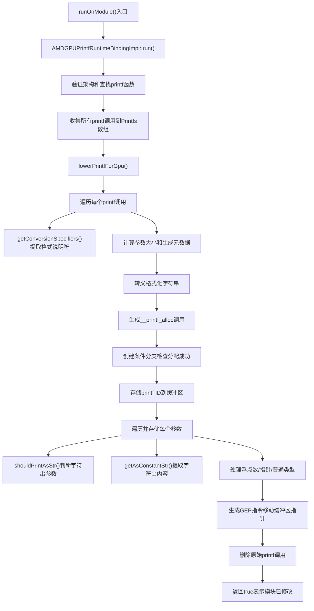

# AMDGPUPrintfRuntimeBinding.cpp 代码功能详解

## 1. Pass的主要功能概括

**AMDGPUPrintfRuntimeBinding** 是一个LLVM模块级优化Pass，专门用于处理AMDGPU（AMD GPU）上的OpenCL printf实现。

**主要作用**：
- 将内核代码中的`printf`函数调用绑定到一个内核参数指针，该指针稍后会由运行时绑定到缓冲区
- 遍历模块中的函数，将每个printf调用转换为一系列操作 llvm-project:10-18 

**主要效果**：
<a name="ref-block_7"></a>- **格式化字符串处理**：将格式化字符串作为模块元数据的唯一ID传递，避免污染LLVM的符号表 llvm-project:143-148[<sup>↗</sup>](#block_7) 

- **参数存储**：将printf参数的按位拷贝存储到printf缓冲区中 llvm-project:14-17 

- **后端集成**：后端passes会从元数据中提取格式化信息并插入到OpenCL二进制文件中 llvm-project:18-19 

## 2. 主要功能的实现步骤和子功能

通过分析代码，该Pass的核心实现包含以下主要步骤和子功能：

### 核心步骤：
1. **入口验证和收集阶段** (`run()`)
2. **Printf降级转换阶段** (`lowerPrintfForGpu()`)
3. **格式化说明符提取** (`getConversionSpecifiers()`)
4. **辅助功能函数**

## 3. 各步骤和子功能的详细分析

### 3.1 入口验证和收集阶段 (`run()`)

该函数是Pass的主入口点，负责初始化和验证工作：

<a name="ref-block_21"></a>- **架构验证**：检查目标架构是否为r600，如果是则直接返回，因为该Pass不支持r600架构 llvm-project:428-430[<sup>↗</sup>](#block_21) 

<a name="ref-block_22"></a>- **printf函数查找**：在模块中查找printf函数声明，如果不存在或存在OpenMP模块标志则返回 llvm-project:432-435[<sup>↗</sup>](#block_22) 

<a name="ref-block_23"></a>- **printf调用收集**：遍历printf函数的所有使用点，收集所有有效的CallInst（排除nobuiltin属性的调用） llvm-project:437-442[<sup>↗</sup>](#block_23) 

<a name="ref-block_24"></a>- **DataLayout获取**：保存模块的DataLayout供后续使用 llvm-project:447-449[<sup>↗</sup>](#block_24) 

### 3.2 Printf降级转换阶段 (`lowerPrintfForGpu()`)

这是Pass的核心转换逻辑，负责将printf调用转换为缓冲区操作：

**a) 元数据准备和格式化字符串处理**：
- 创建或获取名为`llvm.printf.fmts`的元数据节点 llvm-project:147-148 

<a name="ref-block_8"></a>- 对每个printf调用，提取格式化字符串，如果不是常量字符串则发出诊断信息 llvm-project:156-162[<sup>↗</sup>](#block_8) 

**b) 参数大小计算和元数据生成**：
<a name="ref-block_9"></a>- 调用`getConversionSpecifiers()`提取格式说明符 llvm-project:164-166[<sup>↗</sup>](#block_9) 

<a name="ref-block_10"></a>- 计算每个参数在缓冲区中所需的大小，确保对齐到DWORD_ALIGN（4字节） llvm-project:171-226[<sup>↗</sup>](#block_10) 

- 对于不满足4字节对齐的参数，进行扩展（零扩展或符号扩展） llvm-project:184-207 

- 处理特殊情况：浮点数优化（将double转float）和字符串大小计算 llvm-project:208-221 

**c) 格式化字符串转义处理**：
- 将格式化字符串中的特殊字符转换为转义序列（如`\n`, `\t`等）
<a name="ref-block_11"></a>- 特别处理冒号`:`，将其转换为八进制表示`\72`，因为冒号被定义为分隔符 llvm-project:229-260[<sup>↗</sup>](#block_11) 

**d) 缓冲区分配调用生成**：
<a name="ref-block_12"></a>- 创建`__printf_alloc`函数调用，传入所需的总缓冲区大小 llvm-project:262-288[<sup>↗</sup>](#block_12) 

- 生成唯一的printf ID并添加到元数据中 llvm-project:279-283 

**e) 控制流分割和条件执行**：
- 检查缓冲区分配是否成功（非空指针）
- 如果printf有返回值，创建返回值（成功返回0，失败返回-1）
<a name="ref-block_13"></a>- 使用`SplitBlock`和`SplitBlockAndInsertIfThen`创建条件分支，只有在分配成功时才执行存储操作 llvm-project:295-306[<sup>↗</sup>](#block_13) 

**f) 缓冲区数据存储**：
<a name="ref-block_14"></a>- 在缓冲区的前4字节存储唯一的printf ID llvm-project:310-320[<sup>↗</sup>](#block_14) 

<a name="ref-block_15"></a>- 从第5字节开始存储实际参数数据 llvm-project:322-326[<sup>↗</sup>](#block_15) 

- 对每个参数进行处理和存储：
<a name="ref-block_16"></a>  - **浮点数处理**：根据格式说明符，可能将double转换为float llvm-project:335-350[<sup>↗</sup>](#block_16) 
  
<a name="ref-block_17"></a>  - **字符串参数处理**：如果是`%s`格式且参数是指针，提取常量字符串内容，以4字节为单位分块存储 llvm-project:351-395[<sup>↗</sup>](#block_17) 
  
<a name="ref-block_18"></a>  - **其他类型参数**：直接存储 llvm-project:398-400[<sup>↗</sup>](#block_18) 

<a name="ref-block_19"></a>- 存储完每个参数后，更新缓冲区指针（GEP操作） llvm-project:401-416[<sup>↗</sup>](#block_19) 

**g) 清理工作**：
<a name="ref-block_20"></a>- 删除所有原始的printf调用指令 llvm-project:419-424[<sup>↗</sup>](#block_20) 

### 3.3 格式化说明符提取 (`getConversionSpecifiers()`)

该函数负责解析格式化字符串，提取有效的转换说明符：

<a name="ref-block_2"></a>- **支持的说明符**：`cdieEfFgGaAosuxXp` llvm-project:91-91[<sup>↗</sup>](#block_2) 

<a name="ref-block_3"></a>- **关键逻辑**：查找每个说明符，然后向前查找最近的`%`符号，检查它前面是否有偶数个连续的`%`（转义的百分号）。如果是奇数个`%`，说明这是一个真实的格式化参数 llvm-project:95-112[<sup>↗</sup>](#block_3) 

<a name="ref-block_1"></a>- **特殊关注**：特别关注`%p`（指针）和`%s`（字符串）说明符，用于判断是存储字面字符串还是指针 llvm-project:86-90[<sup>↗</sup>](#block_1) 

### 3.4 辅助功能函数

**a) `shouldPrintAsStr()`**：
<a name="ref-block_4"></a>判断是否应该将参数作为字符串打印，条件是格式说明符为`s`且参数类型为指针 llvm-project:115-117[<sup>↗</sup>](#block_4) 

**b) `getAsConstantStr()`**：
<a name="ref-block_5"></a>尝试从Value中提取常量字符串，如果无法提取则返回占位符"???" llvm-project:122-128[<sup>↗</sup>](#block_5) 

**c) `diagnoseInvalidFormatString()`**：
<a name="ref-block_6"></a>当格式化字符串不是可解析的常量字符串全局变量时，生成诊断信息 llvm-project:130-136[<sup>↗</sup>](#block_6) 

## 4. 步骤和子功能之间的关系

整个Pass的执行流程遵循以下调用关系：



**关键关系说明**：

1. **验证 → 收集 → 转换**：`run()`先验证环境和收集目标，然后调用`lowerPrintfForGpu()`执行实际转换

2. **格式分析驱动参数处理**：`getConversionSpecifiers()`的结果决定了后续如何处理每个参数（扩展方式、存储方式）

3. **元数据与缓冲区的分离**：格式化字符串存储在元数据中，实际参数数据存储在运行时缓冲区中，两者通过唯一ID关联

4. **条件执行保护**：通过基本块分割创建条件执行路径，确保只有在缓冲区分配成功时才执行存储操作，避免空指针访问

5. **辅助函数的协同**：`shouldPrintAsStr()`、`getAsConstantStr()`和`diagnoseInvalidFormatString()`共同支持字符串参数的特殊处理和错误诊断

## Notes

- 该Pass专门为AMDGPU架构设计，不支持r600架构
- Pass设计了DWORD对齐（4字节对齐）要求，确保GPU内存访问效率
- 字符串参数被直接内联到缓冲区中，而不是存储指针，这是为了避免GPU上的复杂内存管理
- 格式化字符串通过元数据机制传递，避免在GPU代码中创建全局字符串变量，这样可以减少符号表污染并便于后端处理
- Pass会在缓冲区分配失败时正确处理，返回-1表示失败（如果printf有返回值的话）


### Citations


<a name="block_0"></a>**File:** llvm/lib/Target/AMDGPU/AMDGPUPrintfRuntimeBinding.cpp (L10-19)

```cpp
// The pass bind printfs to a kernel arg pointer that will be bound to a buffer
// later by the runtime.
//
// This pass traverses the functions in the module and converts
// each call to printf to a sequence of operations that
// store the following into the printf buffer:
// - format string (passed as a module's metadata unique ID)
// - bitwise copies of printf arguments
// The backend passes will need to store metadata in the kernel
//===----------------------------------------------------------------------===//
```

<a name="block_1"></a>**File:** llvm/lib/Target/AMDGPU/AMDGPUPrintfRuntimeBinding.cpp (L86-90) [<sup>↩</sup>](#ref-block_1)

```cpp
  // not all format characters are collected.
  // At this time the format characters of interest
  // are %p and %s, which use to know if we
  // are either storing a literal string or a
  // pointer to the printf buffer.
```

<a name="block_2"></a>**File:** llvm/lib/Target/AMDGPU/AMDGPUPrintfRuntimeBinding.cpp (L91-91) [<sup>↩</sup>](#ref-block_2)

```cpp
  static const char ConvSpecifiers[] = "cdieEfFgGaAosuxXp";
```

<a name="block_3"></a>**File:** llvm/lib/Target/AMDGPU/AMDGPUPrintfRuntimeBinding.cpp (L95-112) [<sup>↩</sup>](#ref-block_3)

```cpp
  while ((CurFmtSpecifierIdx = Fmt.find_first_of(
              ConvSpecifiers, CurFmtSpecifierIdx)) != StringRef::npos) {
    bool ArgDump = false;
    StringRef CurFmt = Fmt.substr(PrevFmtSpecifierIdx,
                                  CurFmtSpecifierIdx - PrevFmtSpecifierIdx);
    size_t pTag = CurFmt.find_last_of('%');
    if (pTag != StringRef::npos) {
      ArgDump = true;
      while (pTag && CurFmt[--pTag] == '%') {
        ArgDump = !ArgDump;
      }
    }

    if (ArgDump)
      OpConvSpecifiers.push_back(Fmt[CurFmtSpecifierIdx]);

    PrevFmtSpecifierIdx = ++CurFmtSpecifierIdx;
  }
```

<a name="block_4"></a>**File:** llvm/lib/Target/AMDGPU/AMDGPUPrintfRuntimeBinding.cpp (L115-117) [<sup>↩</sup>](#ref-block_4)

```cpp
static bool shouldPrintAsStr(char Specifier, Type *OpType) {
  return Specifier == 's' && isa<PointerType>(OpType);
}
```

<a name="block_5"></a>**File:** llvm/lib/Target/AMDGPU/AMDGPUPrintfRuntimeBinding.cpp (L122-128) [<sup>↩</sup>](#ref-block_5)

```cpp
static StringRef getAsConstantStr(Value *V) {
  StringRef S;
  if (!getConstantStringInfo(V, S))
    S = NonLiteralStr;

  return S;
}
```

<a name="block_6"></a>**File:** llvm/lib/Target/AMDGPU/AMDGPUPrintfRuntimeBinding.cpp (L130-136) [<sup>↩</sup>](#ref-block_6)

```cpp
static void diagnoseInvalidFormatString(const CallBase *CI) {
  CI->getContext().diagnose(DiagnosticInfoUnsupported(
      *CI->getParent()->getParent(),
      "printf format string must be a trivially resolved constant string "
      "global variable",
      CI->getDebugLoc()));
}
```

<a name="block_7"></a>**File:** llvm/lib/Target/AMDGPU/AMDGPUPrintfRuntimeBinding.cpp (L143-148) [<sup>↩</sup>](#ref-block_7)

```cpp
  // Instead of creating global variables, the printf format strings are
  // extracted and passed as metadata. This avoids polluting llvm's symbol
  // tables in this module. Metadata is going to be extracted by the backend
  // passes and inserted into the OpenCL binary as appropriate.
  NamedMDNode *metaD = M.getOrInsertNamedMetadata("llvm.printf.fmts");
  unsigned UniqID = metaD->getNumOperands();
```

<a name="block_8"></a>**File:** llvm/lib/Target/AMDGPU/AMDGPUPrintfRuntimeBinding.cpp (L156-162) [<sup>↩</sup>](#ref-block_8)

```cpp
    StringRef FormatStr;
    if (!getConstantStringInfo(Op, FormatStr)) {
      Value *Stripped = Op->stripPointerCasts();
      if (!isa<UndefValue>(Stripped) && !isa<ConstantPointerNull>(Stripped))
        diagnoseInvalidFormatString(CI);
      continue;
    }
```

<a name="block_9"></a>**File:** llvm/lib/Target/AMDGPU/AMDGPUPrintfRuntimeBinding.cpp (L164-166) [<sup>↩</sup>](#ref-block_9)

```cpp
    // We need this call to ascertain that we are printing a string or a
    // pointer. It takes out the specifiers and fills up the first arg.
    getConversionSpecifiers(OpConvSpecifiers, FormatStr, NumOps - 1);
```

<a name="block_10"></a>**File:** llvm/lib/Target/AMDGPU/AMDGPUPrintfRuntimeBinding.cpp (L171-226) [<sup>↩</sup>](#ref-block_10)

```cpp
    int Sum = DWORD_ALIGN;
    Sizes << CI->arg_size() - 1;
    Sizes << ':';
    for (unsigned ArgCount = 1;
         ArgCount < CI->arg_size() && ArgCount <= OpConvSpecifiers.size();
         ArgCount++) {
      Value *Arg = CI->getArgOperand(ArgCount);
      Type *ArgType = Arg->getType();
      unsigned ArgSize = TD->getTypeAllocSize(ArgType);
      //
      // ArgSize by design should be a multiple of DWORD_ALIGN,
      // expand the arguments that do not follow this rule.
      //
      if (ArgSize % DWORD_ALIGN != 0) {
        Type *ResType = Type::getInt32Ty(Ctx);
        if (auto *VecType = dyn_cast<VectorType>(ArgType))
          ResType = VectorType::get(ResType, VecType->getElementCount());
        Builder.SetInsertPoint(CI);
        Builder.SetCurrentDebugLocation(CI->getDebugLoc());

        if (ArgType->isFloatingPointTy()) {
          Arg = Builder.CreateBitCast(
              Arg,
              IntegerType::getIntNTy(Ctx, ArgType->getPrimitiveSizeInBits()));
        }

        if (OpConvSpecifiers[ArgCount - 1] == 'x' ||
            OpConvSpecifiers[ArgCount - 1] == 'X' ||
            OpConvSpecifiers[ArgCount - 1] == 'u' ||
            OpConvSpecifiers[ArgCount - 1] == 'o')
          Arg = Builder.CreateZExt(Arg, ResType);
        else
          Arg = Builder.CreateSExt(Arg, ResType);
        ArgType = Arg->getType();
        ArgSize = TD->getTypeAllocSize(ArgType);
        CI->setOperand(ArgCount, Arg);
      }
      if (OpConvSpecifiers[ArgCount - 1] == 'f') {
        ConstantFP *FpCons = dyn_cast<ConstantFP>(Arg);
        if (FpCons)
          ArgSize = 4;
        else {
          FPExtInst *FpExt = dyn_cast<FPExtInst>(Arg);
          if (FpExt && FpExt->getType()->isDoubleTy() &&
              FpExt->getOperand(0)->getType()->isFloatTy())
            ArgSize = 4;
        }
      }
      if (shouldPrintAsStr(OpConvSpecifiers[ArgCount - 1], ArgType))
        ArgSize = alignTo(getAsConstantStr(Arg).size() + 1, 4);

      LLVM_DEBUG(dbgs() << "Printf ArgSize (in buffer) = " << ArgSize
                        << " for type: " << *ArgType << '\n');
      Sizes << ArgSize << ':';
      Sum += ArgSize;
    }
```

<a name="block_11"></a>**File:** llvm/lib/Target/AMDGPU/AMDGPUPrintfRuntimeBinding.cpp (L229-260) [<sup>↩</sup>](#ref-block_11)

```cpp
    for (char C : FormatStr) {
      // Rest of the C escape sequences (e.g. \') are handled correctly
      // by the MDParser
      switch (C) {
      case '\a':
        Sizes << "\\a";
        break;
      case '\b':
        Sizes << "\\b";
        break;
      case '\f':
        Sizes << "\\f";
        break;
      case '\n':
        Sizes << "\\n";
        break;
      case '\r':
        Sizes << "\\r";
        break;
      case '\v':
        Sizes << "\\v";
        break;
      case ':':
        // ':' cannot be scanned by Flex, as it is defined as a delimiter
        // Replace it with it's octal representation \72
        Sizes << "\\72";
        break;
      default:
        Sizes << C;
        break;
      }
    }
```

<a name="block_12"></a>**File:** llvm/lib/Target/AMDGPU/AMDGPUPrintfRuntimeBinding.cpp (L262-288) [<sup>↩</sup>](#ref-block_12)

```cpp
    // Insert the printf_alloc call
    Builder.SetInsertPoint(CI);
    Builder.SetCurrentDebugLocation(CI->getDebugLoc());

    AttributeList Attr = AttributeList::get(Ctx, AttributeList::FunctionIndex,
                                            Attribute::NoUnwind);

    Type *SizetTy = Type::getInt32Ty(Ctx);

    Type *Tys_alloc[1] = {SizetTy};
    Type *I8Ty = Type::getInt8Ty(Ctx);
    Type *I8Ptr = PointerType::get(Ctx, 1);
    FunctionType *FTy_alloc = FunctionType::get(I8Ptr, Tys_alloc, false);
    FunctionCallee PrintfAllocFn =
        M.getOrInsertFunction(StringRef("__printf_alloc"), FTy_alloc, Attr);

    LLVM_DEBUG(dbgs() << "Printf metadata = " << Sizes.str() << '\n');
    std::string fmtstr = itostr(++UniqID) + ":" + Sizes.str();
    MDString *fmtStrArray = MDString::get(Ctx, fmtstr);

    MDNode *myMD = MDNode::get(Ctx, fmtStrArray);
    metaD->addOperand(myMD);
    Value *sumC = ConstantInt::get(SizetTy, Sum, false);
    SmallVector<Value *, 1> alloc_args;
    alloc_args.push_back(sumC);
    CallInst *pcall = CallInst::Create(PrintfAllocFn, alloc_args,
                                       "printf_alloc_fn", CI->getIterator());
```

<a name="block_13"></a>**File:** llvm/lib/Target/AMDGPU/AMDGPUPrintfRuntimeBinding.cpp (L295-306) [<sup>↩</sup>](#ref-block_13)

```cpp
    ConstantPointerNull *zeroIntPtr =
        ConstantPointerNull::get(PointerType::get(Ctx, 1));
    auto *cmp = cast<ICmpInst>(Builder.CreateICmpNE(pcall, zeroIntPtr, ""));
    if (!CI->use_empty()) {
      Value *result =
          Builder.CreateSExt(Builder.CreateNot(cmp), I32Ty, "printf_res");
      CI->replaceAllUsesWith(result);
    }
    SplitBlock(CI->getParent(), cmp);
    Instruction *Brnch =
        SplitBlockAndInsertIfThen(cmp, cmp->getNextNode(), false);
    BasicBlock::iterator BrnchPoint = Brnch->getIterator();
```

<a name="block_14"></a>**File:** llvm/lib/Target/AMDGPU/AMDGPUPrintfRuntimeBinding.cpp (L310-320) [<sup>↩</sup>](#ref-block_14)

```cpp
    // store unique printf id in the buffer
    //
    GetElementPtrInst *BufferIdx = GetElementPtrInst::Create(
        I8Ty, pcall, ConstantInt::get(Ctx, APInt(32, 0)), "PrintBuffID",
        BrnchPoint);

    Type *idPointer = PointerType::get(Ctx, AMDGPUAS::GLOBAL_ADDRESS);
    Value *id_gep_cast =
        new BitCastInst(BufferIdx, idPointer, "PrintBuffIdCast", BrnchPoint);

    new StoreInst(ConstantInt::get(I32Ty, UniqID), id_gep_cast, BrnchPoint);
```

<a name="block_15"></a>**File:** llvm/lib/Target/AMDGPU/AMDGPUPrintfRuntimeBinding.cpp (L322-326) [<sup>↩</sup>](#ref-block_15)

```cpp
    // 1st 4 bytes hold the printf_id
    // the following GEP is the buffer pointer
    BufferIdx = GetElementPtrInst::Create(I8Ty, pcall,
                                          ConstantInt::get(Ctx, APInt(32, 4)),
                                          "PrintBuffGep", BrnchPoint);
```

<a name="block_16"></a>**File:** llvm/lib/Target/AMDGPU/AMDGPUPrintfRuntimeBinding.cpp (L335-350) [<sup>↩</sup>](#ref-block_16)

```cpp
      if (ArgType->isFPOrFPVectorTy() && !isa<VectorType>(ArgType)) {
        if (OpConvSpecifiers[ArgCount - 1] == 'f') {
          if (auto *FpCons = dyn_cast<ConstantFP>(Arg)) {
            APFloat Val(FpCons->getValueAPF());
            bool Lost = false;
            Val.convert(APFloat::IEEEsingle(), APFloat::rmNearestTiesToEven,
                        &Lost);
            Arg = ConstantFP::get(Ctx, Val);
          } else if (auto *FpExt = dyn_cast<FPExtInst>(Arg)) {
            if (FpExt->getType()->isDoubleTy() &&
                FpExt->getOperand(0)->getType()->isFloatTy()) {
              Arg = FpExt->getOperand(0);
            }
          }
        }
        WhatToStore.push_back(Arg);
```

<a name="block_17"></a>**File:** llvm/lib/Target/AMDGPU/AMDGPUPrintfRuntimeBinding.cpp (L351-395) [<sup>↩</sup>](#ref-block_17)

```cpp
      } else if (isa<PointerType>(ArgType)) {
        if (shouldPrintAsStr(OpConvSpecifiers[ArgCount - 1], ArgType)) {
          StringRef S = getAsConstantStr(Arg);
          if (!S.empty()) {
            const uint64_t ReadSize = 4;

            DataExtractor Extractor(S, /*IsLittleEndian=*/true, 8);
            DataExtractor::Cursor Offset(0);
            while (Offset && Offset.tell() < S.size()) {
              uint64_t ReadNow = std::min(ReadSize, S.size() - Offset.tell());
              uint64_t ReadBytes = 0;
              switch (ReadNow) {
              default: llvm_unreachable("min(4, X) > 4?");
              case 1:
                ReadBytes = Extractor.getU8(Offset);
                break;
              case 2:
                ReadBytes = Extractor.getU16(Offset);
                break;
              case 3:
                ReadBytes = Extractor.getU24(Offset);
                break;
              case 4:
                ReadBytes = Extractor.getU32(Offset);
                break;
              }

              cantFail(Offset.takeError(),
                       "failed to read bytes from constant array");

              APInt IntVal(8 * ReadSize, ReadBytes);

              // TODO: Should not bothering aligning up.
              if (ReadNow < ReadSize)
                IntVal = IntVal.zext(8 * ReadSize);

              Type *IntTy = Type::getIntNTy(Ctx, IntVal.getBitWidth());
              WhatToStore.push_back(ConstantInt::get(IntTy, IntVal));
            }
          } else {
            // Empty string, give a hint to RT it is no NULL
            Value *ANumV = ConstantInt::get(Int32Ty, 0xFFFFFF00, false);
            WhatToStore.push_back(ANumV);
          }
        } else {
```

<a name="block_18"></a>**File:** llvm/lib/Target/AMDGPU/AMDGPUPrintfRuntimeBinding.cpp (L398-400) [<sup>↩</sup>](#ref-block_18)

```cpp
      } else {
        WhatToStore.push_back(Arg);
      }
```

<a name="block_19"></a>**File:** llvm/lib/Target/AMDGPU/AMDGPUPrintfRuntimeBinding.cpp (L401-416) [<sup>↩</sup>](#ref-block_19)

```cpp
      for (unsigned I = 0, E = WhatToStore.size(); I != E; ++I) {
        Value *TheBtCast = WhatToStore[I];
        unsigned ArgSize = TD->getTypeAllocSize(TheBtCast->getType());
        StoreInst *StBuff = new StoreInst(TheBtCast, BufferIdx, BrnchPoint);
        LLVM_DEBUG(dbgs() << "inserting store to printf buffer:\n"
                          << *StBuff << '\n');
        (void)StBuff;
        if (I + 1 == E && ArgCount + 1 == CI->arg_size())
          break;
        BufferIdx = GetElementPtrInst::Create(
            I8Ty, BufferIdx, {ConstantInt::get(I32Ty, ArgSize)},
            "PrintBuffNextPtr", BrnchPoint);
        LLVM_DEBUG(dbgs() << "inserting gep to the printf buffer:\n"
                          << *BufferIdx << '\n');
      }
    }
```

<a name="block_20"></a>**File:** llvm/lib/Target/AMDGPU/AMDGPUPrintfRuntimeBinding.cpp (L419-424) [<sup>↩</sup>](#ref-block_20)

```cpp
  // erase the printf calls
  for (auto *CI : Printfs)
    CI->eraseFromParent();

  Printfs.clear();
  return true;
```

<a name="block_21"></a>**File:** llvm/lib/Target/AMDGPU/AMDGPUPrintfRuntimeBinding.cpp (L428-430) [<sup>↩</sup>](#ref-block_21)

```cpp
  Triple TT(M.getTargetTriple());
  if (TT.getArch() == Triple::r600)
    return false;
```

<a name="block_22"></a>**File:** llvm/lib/Target/AMDGPU/AMDGPUPrintfRuntimeBinding.cpp (L432-435) [<sup>↩</sup>](#ref-block_22)

```cpp
  auto *PrintfFunction = M.getFunction("printf");
  if (!PrintfFunction || !PrintfFunction->isDeclaration() ||
      M.getModuleFlag("openmp"))
    return false;
```

<a name="block_23"></a>**File:** llvm/lib/Target/AMDGPU/AMDGPUPrintfRuntimeBinding.cpp (L437-442) [<sup>↩</sup>](#ref-block_23)

```cpp
  for (auto &U : PrintfFunction->uses()) {
    if (auto *CI = dyn_cast<CallInst>(U.getUser())) {
      if (CI->isCallee(&U) && !CI->isNoBuiltin())
        Printfs.push_back(CI);
    }
  }
```

<a name="block_24"></a>**File:** llvm/lib/Target/AMDGPU/AMDGPUPrintfRuntimeBinding.cpp (L447-449) [<sup>↩</sup>](#ref-block_24)

```cpp
  TD = &M.getDataLayout();

  return lowerPrintfForGpu(M);
```

