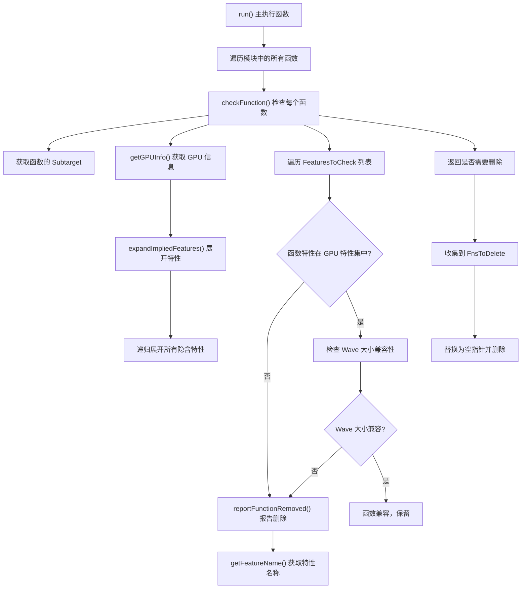

# AMDGPURemoveIncompatibleFunctions.cpp 代码功能分析

## 1. Pass 的主要功能概括

<a name="ref-block_0"></a>这个 Pass 的主要功能是**移除使用了与当前目标 GPU 不兼容的 GPU 特性的函数**。 llvm-project:10-11[<sup>↗</sup>](#block_0) 

**具体作用和效果：**
- 将所有不兼容函数的使用替换为空指针（null）
- 从模块中删除这些不兼容的函数
- 通过优化诊断机制向用户报告被移除的函数及其原因

## 2. 实现主要功能的步骤和子功能

通过遍历代码文件，可以提取出以下核心步骤和子功能：

1. **主执行函数 `run()`** - 模块级遍历和函数删除
2. **函数检查 `checkFunction()`** - 单个函数的兼容性检查
3. **特性扩展 `expandImpliedFeatures()`** - 递归展开隐含特性
4. **GPU 信息获取 `getGPUInfo()`** - 获取目标 GPU 的描述信息
5. **特性名称获取 `getFeatureName()`** - 将特性 ID 转换为名称
6. **移除报告 `reportFunctionRemoved()`** - 生成优化诊断报告

## 3. 各步骤和子功能的具体描述分析

### 3.1 主执行函数 `run()`

该函数是 Pass 的入口点，执行以下操作：
- 遍历模块中的所有函数
- 调用 `checkFunction()` 检查每个函数
- 将需要删除的函数收集到 `FnsToDelete` 向量中
- 将所有标记的函数的使用替换为空指针常量
<a name="ref-block_1"></a>- 从父模块中擦除这些函数 llvm-project:46-60[<sup>↗</sup>](#block_1) 

### 3.2 函数检查 `checkFunction()`

这是核心检查逻辑，判断函数是否应该被删除：

**初步过滤：**
- 如果函数只是声明（没有定义），直接返回 false
- 如果 GPU 名称为空或以 "generic" 开头（测试用），返回 false
<a name="ref-block_7"></a>- 如果无法获取 GPU 信息，返回 false llvm-project:158-174[<sup>↗</sup>](#block_7) 

**特性兼容性检查：**
- 获取当前 GPU 的所有隐含特性（包括递归展开的特性）
- 遍历预定义的特性列表 `FeaturesToCheck`
<a name="ref-block_8"></a>- 如果函数启用了某个特性，但该特性不在 GPU 的特性集中，标记为需要删除 llvm-project:181-194[<sup>↗</sup>](#block_8) 

**Wave 大小特性检查：**
- 对于不支持 Wave32 的 GPU（GFX9 及更早版本），如果函数使用了 `FeatureWavefrontSize32`，则删除
<a name="ref-block_9"></a>- 对于只支持 Wave32 的 GPU（如 gfx125x），如果函数使用了 `FeatureWavefrontSize64`，则删除 llvm-project:196-208[<sup>↗</sup>](#block_9) 

### 3.3 特性扩展 `expandImpliedFeatures()`

该函数递归地展开特性集合：
- 遍历所有 AMDGPU 特性定义
- 如果某个特性存在于输入特性集中，并且该特性隐含了其他特性
<a name="ref-block_5"></a>- 递归地展开这些隐含的特性并合并到结果中 llvm-project:124-131[<sup>↗</sup>](#block_5) 

### 3.4 GPU 信息获取 `getGPUInfo()`

根据 GPU 名称查找对应的处理器描述信息：
- 遍历所有可用的处理器描述
- 通过字符串匹配找到对应的 GPU 信息
<a name="ref-block_3"></a>- 返回包含该 GPU 特性集的描述结构 llvm-project:96-103[<sup>↗</sup>](#block_3) 

### 3.5 特性名称获取 `getFeatureName()`

将特性 ID 转换为可读的字符串名称：
- 遍历 AMDGPU 特性键值对表
- 通过特性值匹配找到对应的键（名称）
<a name="ref-block_2"></a>- 用于生成诊断报告 llvm-project:88-94[<sup>↗</sup>](#block_2) 

### 3.6 移除报告 `reportFunctionRemoved()`

生成优化诊断信息通知用户：
- 创建 `OptimizationRemarkEmitter` 对象
- 生成包含函数名和不兼容特性名称的优化备注
<a name="ref-block_6"></a>- 说明该函数因为使用了当前目标不支持的特性而被移除 llvm-project:133-145[<sup>↗</sup>](#block_6) 

### 3.7 预定义的特性检查列表

定义了需要检查的特性集合，包括：
- 各代 GFX 指令集（GFX11、GFX10、GFX9、GFX8）
- DPP（数据并行处理）指令
- 16 位指令
- Dot 运算指令（Dot1-Dot8）
- 扩展图像指令
- 内存时间戳指令
<a name="ref-block_4"></a>- GWS（全局波存储） llvm-project:105-122[<sup>↗</sup>](#block_4) 

## 4. 步骤和子功能之间的关系

整个 Pass 的执行流程呈现出清晰的层次结构：



**关系说明：**

1. **顺序依赖关系：**
   - `run()` → `checkFunction()` → `getGPUInfo()` → `expandImpliedFeatures()`
   - 必须先获取 GPU 信息，才能展开特性集，最后才能进行兼容性检查

2. **辅助功能关系：**
   - `getFeatureName()` 和 `reportFunctionRemoved()` 是辅助性的报告功能
   - 只有在确定函数需要被删除时才会调用

3. **递归关系：**
   - `expandImpliedFeatures()` 函数自身递归调用，确保所有隐含的特性都被展开

4. **检查-执行分离：**
   - 检查阶段（`checkFunction()`）和执行阶段（替换和删除）是分离的
   - 先收集所有需要删除的函数，然后统一执行删除操作，避免迭代器失效

## Notes

这个 Pass 的设计体现了几个重要的编译器优化原则：

1. **安全性优先**：通过移除不兼容的函数，防止在不支持的硬件上执行错误的代码
2. **用户友好**：通过优化诊断系统清晰地告知用户哪些函数被删除以及原因
3. **灵活性**：只检查预定义的"可疑"特性集，不是所有特性，平衡了检查的全面性和性能
4. **特殊处理**：对 Wave 大小特性进行了特殊处理，因为不同代次的 GPU 对这些特性的支持不同

该 Pass 通常在链接时优化（LTO）或代码生成的早期阶段运行，确保最终生成的代码能够在目标 GPU 上正确执行。


### Citations


<a name="block_0"></a>**File:** llvm/lib/Target/AMDGPU/AMDGPURemoveIncompatibleFunctions.cpp (L10-11) [<sup>↩</sup>](#ref-block_0)

```cpp
/// This pass replaces all uses of functions that use GPU features
/// incompatible with the current GPU with null then deletes the function.
```

<a name="block_1"></a>**File:** llvm/lib/Target/AMDGPU/AMDGPURemoveIncompatibleFunctions.cpp (L46-60) [<sup>↩</sup>](#ref-block_1)

```cpp
  bool run(Module &M) {
    assert(TM->getTargetTriple().isAMDGCN());

    SmallVector<Function *, 4> FnsToDelete;
    for (Function &F : M) {
      if (checkFunction(F))
        FnsToDelete.push_back(&F);
    }

    for (Function *F : FnsToDelete) {
      F->replaceAllUsesWith(ConstantPointerNull::get(F->getType()));
      F->eraseFromParent();
    }
    return !FnsToDelete.empty();
  }
```

<a name="block_2"></a>**File:** llvm/lib/Target/AMDGPU/AMDGPURemoveIncompatibleFunctions.cpp (L88-94) [<sup>↩</sup>](#ref-block_2)

```cpp
StringRef getFeatureName(unsigned Feature) {
  for (const SubtargetFeatureKV &KV : AMDGPUFeatureKV)
    if (Feature == KV.Value)
      return KV.Key;

  llvm_unreachable("Unknown Target feature");
}
```

<a name="block_3"></a>**File:** llvm/lib/Target/AMDGPU/AMDGPURemoveIncompatibleFunctions.cpp (L96-103) [<sup>↩</sup>](#ref-block_3)

```cpp
const SubtargetSubTypeKV *getGPUInfo(const GCNSubtarget &ST,
                                     StringRef GPUName) {
  for (const SubtargetSubTypeKV &KV : ST.getAllProcessorDescriptions())
    if (StringRef(KV.Key) == GPUName)
      return &KV;

  return nullptr;
}
```

<a name="block_4"></a>**File:** llvm/lib/Target/AMDGPU/AMDGPURemoveIncompatibleFunctions.cpp (L105-122) [<sup>↩</sup>](#ref-block_4)

```cpp
constexpr unsigned FeaturesToCheck[] = {AMDGPU::FeatureGFX11Insts,
                                        AMDGPU::FeatureGFX10Insts,
                                        AMDGPU::FeatureGFX9Insts,
                                        AMDGPU::FeatureGFX8Insts,
                                        AMDGPU::FeatureDPP,
                                        AMDGPU::Feature16BitInsts,
                                        AMDGPU::FeatureDot1Insts,
                                        AMDGPU::FeatureDot2Insts,
                                        AMDGPU::FeatureDot3Insts,
                                        AMDGPU::FeatureDot4Insts,
                                        AMDGPU::FeatureDot5Insts,
                                        AMDGPU::FeatureDot6Insts,
                                        AMDGPU::FeatureDot7Insts,
                                        AMDGPU::FeatureDot8Insts,
                                        AMDGPU::FeatureExtendedImageInsts,
                                        AMDGPU::FeatureSMemRealTime,
                                        AMDGPU::FeatureSMemTimeInst,
                                        AMDGPU::FeatureGWS};
```

<a name="block_5"></a>**File:** llvm/lib/Target/AMDGPU/AMDGPURemoveIncompatibleFunctions.cpp (L124-131) [<sup>↩</sup>](#ref-block_5)

```cpp
FeatureBitset expandImpliedFeatures(const FeatureBitset &Features) {
  FeatureBitset Result = Features;
  for (const SubtargetFeatureKV &FE : AMDGPUFeatureKV) {
    if (Features.test(FE.Value) && FE.Implies.any())
      Result |= expandImpliedFeatures(FE.Implies.getAsBitset());
  }
  return Result;
}
```

<a name="block_6"></a>**File:** llvm/lib/Target/AMDGPU/AMDGPURemoveIncompatibleFunctions.cpp (L133-145) [<sup>↩</sup>](#ref-block_6)

```cpp
void reportFunctionRemoved(Function &F, unsigned Feature) {
  OptimizationRemarkEmitter ORE(&F);
  ORE.emit([&]() {
    // Note: we print the function name as part of the diagnostic because if
    // debug info is not present, users get "<unknown>:0:0" as the debug
    // loc. If we didn't print the function name there would be no way to
    // tell which function got removed.
    return OptimizationRemark(DEBUG_TYPE, "AMDGPUIncompatibleFnRemoved", &F)
           << "removing function '" << F.getName() << "': +"
           << getFeatureName(Feature)
           << " is not supported on the current target";
  });
}
```

<a name="block_7"></a>**File:** llvm/lib/Target/AMDGPU/AMDGPURemoveIncompatibleFunctions.cpp (L158-174) [<sup>↩</sup>](#ref-block_7)

```cpp
  if (F.isDeclaration())
    return false;

  const GCNSubtarget *ST =
      static_cast<const GCNSubtarget *>(TM->getSubtargetImpl(F));

  // Check the GPU isn't generic or generic-hsa. Generic is used for testing
  // only and we don't want this pass to interfere with it.
  StringRef GPUName = ST->getCPU();
  if (GPUName.empty() || GPUName.starts_with("generic"))
    return false;

  // Try to fetch the GPU's info. If we can't, it's likely an unknown processor
  // so just bail out.
  const SubtargetSubTypeKV *GPUInfo = getGPUInfo(*ST, GPUName);
  if (!GPUInfo)
    return false;
```

<a name="block_8"></a>**File:** llvm/lib/Target/AMDGPU/AMDGPURemoveIncompatibleFunctions.cpp (L181-194) [<sup>↩</sup>](#ref-block_8)

```cpp
  const FeatureBitset GPUFeatureBits =
      expandImpliedFeatures(GPUInfo->Implies.getAsBitset());

  // Now that the have a FeatureBitset containing all possible features for
  // the chosen GPU, check our list of "suspicious" features.

  // Check that the user didn't enable any features that aren't part of that
  // GPU's feature set. We only check a predetermined set of features.
  for (unsigned Feature : FeaturesToCheck) {
    if (ST->hasFeature(Feature) && !GPUFeatureBits.test(Feature)) {
      reportFunctionRemoved(F, Feature);
      return true;
    }
  }
```

<a name="block_9"></a>**File:** llvm/lib/Target/AMDGPU/AMDGPURemoveIncompatibleFunctions.cpp (L196-208) [<sup>↩</sup>](#ref-block_9)

```cpp
  // Delete FeatureWavefrontSize32 functions for
  // gfx9 and below targets that don't support the mode.
  // gfx10, gfx11, gfx12 are implied to support both wave32 and 64 features.
  // They are not in the feature set. So, we need a separate check
  if (!ST->supportsWave32() && ST->hasFeature(AMDGPU::FeatureWavefrontSize32)) {
    reportFunctionRemoved(F, AMDGPU::FeatureWavefrontSize32);
    return true;
  }
  // gfx125x only support FeatureWavefrontSize32.
  if (!ST->supportsWave64() && ST->hasFeature(AMDGPU::FeatureWavefrontSize64)) {
    reportFunctionRemoved(F, AMDGPU::FeatureWavefrontSize64);
    return true;
  }
```

