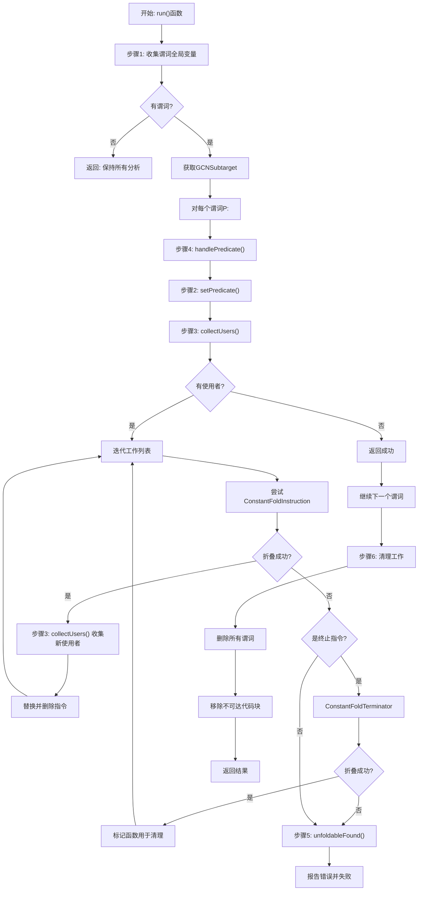

# AMDGPUExpandFeaturePredicates.cpp 代码功能分析

## 1. Pass的主要功能概述

<a name="ref-block_0"></a>该Pass的主要功能是**展开AMDGCN通用特性谓词（Feature Predicates）为具体的目标特定值**。 llvm-project:8-19[<sup>↗</sup>](#block_0) 

**作用与效果：**
- **输入处理**：处理前端（FE）通过 `__builtin_cpu_is` 或 `__builtin_amdgcn_is_invocable` 内置函数在抽象目标（AMDGCNSPIRV）上生成的占位符全局变量
- **值替换**：根据具体的目标架构，将这些占位符替换为布尔常量值
- **常量折叠**：通过常量折叠将这些值传播到终止指令（terminator）或使其成为无用值
- **错误检测**：如果常量折叠失败，会强制报错，避免后端出现模糊的运行时错误
- **执行时机**：应该尽早运行（在Clang CodeGen之后立即运行），以便优化管道和后端使用具体的目标数据

## 2. 主要功能的步骤与子功能提取

该Pass包含以下核心步骤和子功能：

1. **收集谓词全局变量** - 在主入口函数中执行
2. **设置谓词值** - `setPredicate()` 函数
3. **收集使用者** - `collectUsers()` 函数模板
4. **处理谓词并折叠** - `handlePredicate()` 函数
5. **处理折叠失败** - `unfoldableFound()` 函数
6. **清理工作** - 删除谓词和不可达代码块

## 3. 各步骤/子功能的具体描述分析

### 步骤1: 收集谓词全局变量

<a name="ref-block_5"></a>这是Pass的入口点，负责识别和收集所有需要处理的特性谓词。 llvm-project:135-144[<sup>↗</sup>](#block_5) 

**具体实现：**
- 遍历模块中的所有全局变量
- 筛选出声明（非定义）且有名称的全局变量
- 进一步筛选出名称以 `llvm.amdgcn.` 开头的变量，这些是特性谓词占位符

### 步骤2: 设置谓词值（`setPredicate` 函数）

<a name="ref-block_2"></a>这个函数负责根据目标子架构设置谓词的实际布尔值。 llvm-project:50-74[<sup>↗</sup>](#block_2) 

**具体实现：**
- **识别谓词类型**：区分 `llvm.amdgcn.has` (特性检查) 和 `llvm.amdgcn.is` (CPU型号检查)
- **提取谓词名称**：从全局变量名中提取特性或CPU名称
- **特性字符串处理**：对于特性检查，将逗号分隔的特性列表转换为LLVM特性格式（在每个特性前添加'+'）
- **设置链接属性**：将全局变量设为私有链接，取消外部初始化
- **设置初始值**：
  - 特性检查：调用 `ST.checkFeatures(PV)` 检查子目标是否支持该特性
  - CPU检查：比较谓词值与 `ST.getCPU()` 是否匹配

### 步骤3: 收集使用者（`collectUsers` 函数模板）

<a name="ref-block_1"></a>这是一个辅助函数模板，用于收集某个值的所有指令使用者。 llvm-project:42-48[<sup>↗</sup>](#block_1) 

**具体实现：**
- 遍历给定值的所有用户
- 筛选出指令类型的用户
- 将这些指令添加到容器中（支持任何容器类型）

### 步骤4: 处理谓词并折叠（`handlePredicate` 函数）

<a name="ref-block_4"></a>这是核心处理函数，负责常量折叠和传播。 llvm-project:90-127[<sup>↗</sup>](#block_4) 

**具体实现：**
- **初始化**：调用 `setPredicate` 设置谓词值，收集所有使用该谓词的指令
- **迭代折叠**：使用工作列表算法，逐个处理待折叠的指令
- **常量折叠尝试**：
  - 首先尝试 `ConstantFoldInstruction`，如果成功则：
    - 收集被替换指令的使用者，加入工作列表
    - 用常量替换指令的所有使用
    - 删除原指令
  - 如果是终止指令，尝试 `ConstantFoldTerminator`：
    - 成功则将包含函数标记为已处理（用于后续清理不可达块）
    - 使用 `DomTreeUpdater` 维护支配树的一致性
- **失败处理**：如果折叠失败，调用 `unfoldableFound` 报告错误

### 步骤5: 处理折叠失败（`unfoldableFound` 函数）

<a name="ref-block_3"></a>当无法常量折叠某个使用谓词的指令时，该函数会报告诊断错误。 llvm-project:76-88[<sup>↗</sup>](#block_3) 

**具体实现：**
- 构造错误消息，包含谓词和无法折叠的指令信息
- 使用LLVM诊断系统报告不支持的错误（`DiagnosticInfoUnsupported`）
- 返回失败状态

### 步骤6: 清理工作

<a name="ref-block_6"></a>在主函数的最后，执行清理操作。 llvm-project:161-164[<sup>↗</sup>](#block_6) 

**具体实现：**
- **删除谓词**：删除所有处理过的谓词全局变量（已被常量替换）
- **移除不可达块**：对所有包含已折叠终止指令的函数，移除不可达的基本块

## 4. 步骤/子功能之间的关系

这些步骤按照以下流程协同工作：



**关键关系说明：**

1. **顺序依赖**：步骤1必须先执行，收集到谓词后才能进入后续处理
2. **循环处理**：步骤4对每个谓词调用，内部通过工作列表算法迭代处理
3. **辅助关系**：
   - 步骤2由步骤4调用，负责设置谓词的实际值
   - 步骤3被多次调用，既用于初始收集，也用于收集新产生的使用者
4. **错误处理**：步骤5作为步骤4的错误分支，在折叠失败时触发
5. **清理依赖**：步骤6依赖于前面所有步骤的完成，执行最终清理工作

**数据流动：**
- 谓词全局变量 → 设置为常量 → 常量传播到使用者 → 折叠使用者指令 → 递归传播 → 删除不可达代码

## Notes

该Pass的设计核心思想是**编译时特化**：将运行时的特性检查在编译时就确定下来，通过常量折叠消除分支，从而生成针对特定GPU架构优化的代码。这种方法的优势是：
- 避免运行时开销
- 启用更多优化机会（死代码消除、内联等）
- 提前发现无法优化的场景，避免静默失败

该Pass必须在优化管道早期运行，这样后续的优化pass可以基于具体的目标信息进行更有效的转换。


### Citations


<a name="block_0"></a>**File:** llvm/lib/Target/AMDGPU/AMDGPUExpandFeaturePredicates.cpp (L8-19) [<sup>↩</sup>](#ref-block_0) [<sup>↩</sup>](#ref-block_0)

```cpp
// This file implements a pass that deals with expanding AMDGCN generic feature
// predicates into target specific quantities / sequences. In this context, a
// generic feature predicate is an implementation detail global variable that
// is inserted by the FE as a consequence of using either the __builtin_cpu_is
// or the __builtin_amdgcn_is_invocable special builtins on an abstract target
// (AMDGCNSPIRV). These placeholder globals are used to guide target specific
// lowering, once the concrete target is known, by way of constant folding their
// value all the way into a terminator (i.e. a controlled block) or into a no
// live use scenario. We hard fail if the folding fails, to avoid obtuse BE
// errors or opaque run time errors. This pass should run as early as possible /
// immediately after Clang CodeGen, so that the optimisation pipeline and the BE
// operate with concrete target data.
```

<a name="block_1"></a>**File:** llvm/lib/Target/AMDGPU/AMDGPUExpandFeaturePredicates.cpp (L42-48) [<sup>↩</sup>](#ref-block_1)

```cpp
template <typename C> void collectUsers(Value *V, C &Container) {
  assert(V && "Must pass an existing Value!");

  for (auto &&U : V->users())
    if (auto *I = dyn_cast<Instruction>(U))
      Container.insert(Container.end(), I);
}
```

<a name="block_2"></a>**File:** llvm/lib/Target/AMDGPU/AMDGPUExpandFeaturePredicates.cpp (L50-74) [<sup>↩</sup>](#ref-block_2) [<sup>↩</sup>](#ref-block_2)

```cpp
inline void setPredicate(const GCNSubtarget &ST, GlobalVariable *P) {
  const bool IsFeature = P->getName().starts_with("llvm.amdgcn.has");
  const size_t Offset =
      IsFeature ? sizeof("llvm.amdgcn.has") : sizeof("llvm.amdgcn.is");

  std::string PV = P->getName().substr(Offset).str();
  if (IsFeature) {
    size_t Dx = PV.find(',');
    while (Dx != std::string::npos) {
      PV.insert(++Dx, {'+'});

      Dx = PV.find(',', Dx);
    }
    PV.insert(PV.cbegin(), '+');
  }

  Type *PTy = P->getValueType();
  P->setLinkage(GlobalValue::PrivateLinkage);
  P->setExternallyInitialized(false);

  if (IsFeature)
    P->setInitializer(ConstantInt::getBool(PTy, ST.checkFeatures(PV)));
  else
    P->setInitializer(ConstantInt::getBool(PTy, PV == ST.getCPU()));
}
```

<a name="block_3"></a>**File:** llvm/lib/Target/AMDGPU/AMDGPUExpandFeaturePredicates.cpp (L76-88) [<sup>↩</sup>](#ref-block_3) [<sup>↩</sup>](#ref-block_3)

```cpp
std::pair<PreservedAnalyses, bool>
unfoldableFound(Function *Caller, GlobalVariable *P, Instruction *NoFold) {
  std::string W;
  raw_string_ostream OS(W);

  OS << "Impossible to constant fold feature predicate: " << *P << " used by "
     << *NoFold << ", please simplify.\n";

  Caller->getContext().diagnose(
      DiagnosticInfoUnsupported(*Caller, W, NoFold->getDebugLoc(), DS_Error));

  return {PreservedAnalyses::none(), false};
}
```

<a name="block_4"></a>**File:** llvm/lib/Target/AMDGPU/AMDGPUExpandFeaturePredicates.cpp (L90-127) [<sup>↩</sup>](#ref-block_4) [<sup>↩</sup>](#ref-block_4)

```cpp
std::pair<PreservedAnalyses, bool>
handlePredicate(const GCNSubtarget &ST, FunctionAnalysisManager &FAM,
                SmallPtrSet<Function *, 32> &Predicated, GlobalVariable *P) {
  setPredicate(ST, P);

  SmallPtrSet<Instruction *, 32> ToFold;
  collectUsers(P, ToFold);

  if (ToFold.empty())
    return {PreservedAnalyses::all(), true};

  do {
    Instruction *I = *ToFold.begin();
    ToFold.erase(I);

    I->dropDroppableUses();

    Function *F = I->getParent()->getParent();
    auto &DT = FAM.getResult<DominatorTreeAnalysis>(*F);
    DomTreeUpdater DTU(DT, DomTreeUpdater::UpdateStrategy::Lazy);

    if (auto *C = ConstantFoldInstruction(I, P->getDataLayout())) {
      collectUsers(I, ToFold);
      I->replaceAllUsesWith(C);
      I->eraseFromParent();
      continue;
    } else if (I->isTerminator() &&
               ConstantFoldTerminator(I->getParent(), true, nullptr, &DTU)) {
        Predicated.insert(F);

        continue;
    }

    return unfoldableFound(I->getParent()->getParent(), P, I);
  } while (!ToFold.empty());

  return {PreservedAnalyses::none(), true};
}
```

<a name="block_5"></a>**File:** llvm/lib/Target/AMDGPU/AMDGPUExpandFeaturePredicates.cpp (L135-144) [<sup>↩</sup>](#ref-block_5)

```cpp
  SmallVector<GlobalVariable *> Predicates;
  for (auto &&G : M.globals()) {
    if (!G.isDeclaration() || !G.hasName())
      continue;
    if (G.getName().starts_with("llvm.amdgcn."))
      Predicates.push_back(&G);
  }

  if (Predicates.empty())
    return PreservedAnalyses::all();
```

<a name="block_6"></a>**File:** llvm/lib/Target/AMDGPU/AMDGPUExpandFeaturePredicates.cpp (L161-164) [<sup>↩</sup>](#ref-block_6)

```cpp
  for (auto &&P : Predicates)
    P->eraseFromParent();
  for (auto &&F : Predicated)
    removeUnreachableBlocks(*F);
```

## Q2

什么是Predicate，其功能和应用场景是什么？


### Answer

根据对 `llvm/lib/Target/AMDGPU/AMDGPUExpandFeaturePredicates.cpp` 的分析，以下是关于 "Predicate"（谓词）的详细说明：

## 什么是 Predicate

<a name="ref-block_0"></a>在这个上下文中，**Predicate 是一种特殊的全局变量**，用于表示 AMDGPU 目标的特性检查或处理器检查。这些谓词是前端（Clang）通过特殊内置函数 `__builtin_amdgcn_processor_is` 和 `__builtin_amdgcn_is_invocable` 生成的实现细节。 llvm-project:8-19[<sup>↗</sup>](#block_0) 

这些谓词表现为两种命名模式的全局变量：
- `llvm.amdgcn.is.*` - 用于处理器检查
- `llvm.amdgcn.has.*` - 用于特性检查 llvm-project:51-52 

## Predicate 的功能

Predicate 的主要功能包括：

<a name="ref-block_4"></a>1. **目标特定的条件编译**：谓词被常量折叠为布尔值，指导代码在特定目标上的执行路径。 llvm-project:90-127[<sup>↗</sup>](#block_4) 

<a name="ref-block_2"></a>2. **常量传播和折叠**：通过 `setPredicate` 函数，谓词被设置为具体的布尔值（true/false），然后通过常量折叠优化掉所有使用该谓词的指令。 llvm-project:50-74[<sup>↗</sup>](#block_2) 

<a name="ref-block_11"></a>3. **死代码消除**：未执行的分支（由于谓词被折叠为 false）会被移除，实现高效的条件编译。 llvm-project:161-165[<sup>↗</sup>](#block_11) 

## 应用场景

Predicate 主要应用于以下场景：

<a name="ref-block_12"></a>1. **抽象目标（SPIRV）编译**：当编译到 AMDGCNSPIRV 这样的抽象目标时，前端无法在编译时确定具体的处理器或特性，因此生成外部初始化的全局谓词变量。 llvm-project:410-413[<sup>↗</sup>](#block_12) llvm-project:424-427 

<a name="ref-block_13"></a>2. **具体目标的编译时优化**：对于已知的具体目标（如 gfx900、gfx1010），谓词在语义分析阶段就被求值为常量布尔值。 llvm-project:414-416[<sup>↗</sup>](#block_13) 

<a name="ref-block_15"></a>3. **特性可用性检查**：检查特定的 AMDGPU 内置函数是否可以在当前目标上调用。 llvm-project:429-436[<sup>↗</sup>](#block_15) 

<a name="ref-block_16"></a>4. **链接时或运行时解析**：对于 SPIRV 目标，这些谓词全局变量会在后续的链接阶段或运行时被解析为具体的目标特性。 llvm-project:298-308[<sup>↗</sup>](#block_16) 

## Notes

<a name="ref-block_3"></a>该 Pass 应该在 Clang CodeGen 之后尽早运行，以便优化管线和后端能够使用具体的目标数据进行优化。如果常量折叠失败，Pass 会硬性报错，避免后端或运行时出现模糊的错误。 llvm-project:76-88[<sup>↗</sup>](#block_3)


### Citations


<a name="block_7"></a>**File:** llvm/lib/Target/AMDGPU/AMDGPUExpandFeaturePredicates.cpp (L8-19)

```cpp
// This file implements a pass that deals with expanding AMDGCN generic feature
// predicates into target specific quantities / sequences. In this context, a
// generic feature predicate is an implementation detail global variable that
// is inserted by the FE as a consequence of using either the __builtin_cpu_is
// or the __builtin_amdgcn_is_invocable special builtins on an abstract target
// (AMDGCNSPIRV). These placeholder globals are used to guide target specific
// lowering, once the concrete target is known, by way of constant folding their
// value all the way into a terminator (i.e. a controlled block) or into a no
// live use scenario. We hard fail if the folding fails, to avoid obtuse BE
// errors or opaque run time errors. This pass should run as early as possible /
// immediately after Clang CodeGen, so that the optimisation pipeline and the BE
// operate with concrete target data.
```

<a name="block_8"></a>**File:** llvm/lib/Target/AMDGPU/AMDGPUExpandFeaturePredicates.cpp (L50-74)

```cpp
inline void setPredicate(const GCNSubtarget &ST, GlobalVariable *P) {
  const bool IsFeature = P->getName().starts_with("llvm.amdgcn.has");
  const size_t Offset =
      IsFeature ? sizeof("llvm.amdgcn.has") : sizeof("llvm.amdgcn.is");

  std::string PV = P->getName().substr(Offset).str();
  if (IsFeature) {
    size_t Dx = PV.find(',');
    while (Dx != std::string::npos) {
      PV.insert(++Dx, {'+'});

      Dx = PV.find(',', Dx);
    }
    PV.insert(PV.cbegin(), '+');
  }

  Type *PTy = P->getValueType();
  P->setLinkage(GlobalValue::PrivateLinkage);
  P->setExternallyInitialized(false);

  if (IsFeature)
    P->setInitializer(ConstantInt::getBool(PTy, ST.checkFeatures(PV)));
  else
    P->setInitializer(ConstantInt::getBool(PTy, PV == ST.getCPU()));
}
```

<a name="block_9"></a>**File:** llvm/lib/Target/AMDGPU/AMDGPUExpandFeaturePredicates.cpp (L76-88)

```cpp
std::pair<PreservedAnalyses, bool>
unfoldableFound(Function *Caller, GlobalVariable *P, Instruction *NoFold) {
  std::string W;
  raw_string_ostream OS(W);

  OS << "Impossible to constant fold feature predicate: " << *P << " used by "
     << *NoFold << ", please simplify.\n";

  Caller->getContext().diagnose(
      DiagnosticInfoUnsupported(*Caller, W, NoFold->getDebugLoc(), DS_Error));

  return {PreservedAnalyses::none(), false};
}
```

<a name="block_10"></a>**File:** llvm/lib/Target/AMDGPU/AMDGPUExpandFeaturePredicates.cpp (L90-127)

```cpp
std::pair<PreservedAnalyses, bool>
handlePredicate(const GCNSubtarget &ST, FunctionAnalysisManager &FAM,
                SmallPtrSet<Function *, 32> &Predicated, GlobalVariable *P) {
  setPredicate(ST, P);

  SmallPtrSet<Instruction *, 32> ToFold;
  collectUsers(P, ToFold);

  if (ToFold.empty())
    return {PreservedAnalyses::all(), true};

  do {
    Instruction *I = *ToFold.begin();
    ToFold.erase(I);

    I->dropDroppableUses();

    Function *F = I->getParent()->getParent();
    auto &DT = FAM.getResult<DominatorTreeAnalysis>(*F);
    DomTreeUpdater DTU(DT, DomTreeUpdater::UpdateStrategy::Lazy);

    if (auto *C = ConstantFoldInstruction(I, P->getDataLayout())) {
      collectUsers(I, ToFold);
      I->replaceAllUsesWith(C);
      I->eraseFromParent();
      continue;
    } else if (I->isTerminator() &&
               ConstantFoldTerminator(I->getParent(), true, nullptr, &DTU)) {
        Predicated.insert(F);

        continue;
    }

    return unfoldableFound(I->getParent()->getParent(), P, I);
  } while (!ToFold.empty());

  return {PreservedAnalyses::none(), true};
}
```

<a name="block_11"></a>**File:** llvm/lib/Target/AMDGPU/AMDGPUExpandFeaturePredicates.cpp (L161-165) [<sup>↩</sup>](#ref-block_11)

```cpp
  for (auto &&P : Predicates)
    P->eraseFromParent();
  for (auto &&F : Predicated)
    removeUnreachableBlocks(*F);

```

<a name="block_12"></a>**File:** clang/lib/Sema/SemaAMDGPU.cpp (L410-413) [<sup>↩</sup>](#ref-block_12)

```cpp
    if (Ctx.getTargetInfo().getTriple().isSPIRV()) {
      CE->setType(BoolTy);
      return *ExpandedPredicates.insert(CE).first;
    }
```

<a name="block_13"></a>**File:** clang/lib/Sema/SemaAMDGPU.cpp (L414-416) [<sup>↩</sup>](#ref-block_13)

```cpp

    if (auto TID = Ctx.getTargetInfo().getTargetID())
      P = TID->find(N) == 0;
```

<a name="block_14"></a>**File:** clang/lib/Sema/SemaAMDGPU.cpp (L424-427)

```cpp
    if (Ctx.getTargetInfo().getTriple().isSPIRV()) {
      CE->setType(BoolTy);
      return *ExpandedPredicates.insert(CE).first;
    }
```

<a name="block_15"></a>**File:** clang/lib/Sema/SemaAMDGPU.cpp (L429-436) [<sup>↩</sup>](#ref-block_15)

```cpp
    auto *FD = cast<FunctionDecl>(Arg->getReferencedDeclOfCallee());

    StringRef RF = Ctx.BuiltinInfo.getRequiredFeatures(FD->getBuiltinID());
    llvm::StringMap<bool> CF;
    Ctx.getFunctionFeatureMap(CF, FD);

    P = Builtin::evaluateRequiredTargetFeatures(RF, CF);
  }
```

<a name="block_16"></a>**File:** clang/lib/CodeGen/TargetBuiltins/AMDGPU.cpp (L298-308) [<sup>↩</sup>](#ref-block_16)

```cpp
static Value *GetOrInsertAMDGPUPredicate(CodeGenFunction &CGF, Twine Name) {
  auto PTy = IntegerType::getInt1Ty(CGF.getLLVMContext());

  auto *P = cast<GlobalVariable>(
      CGF.CGM.getModule().getOrInsertGlobal(Name.str(), PTy));
  P->setConstant(true);
  P->setExternallyInitialized(true);

  return CGF.Builder.CreateLoad(
      RawAddress(P, PTy, CharUnits::One(), KnownNonNull), true);
}
```

