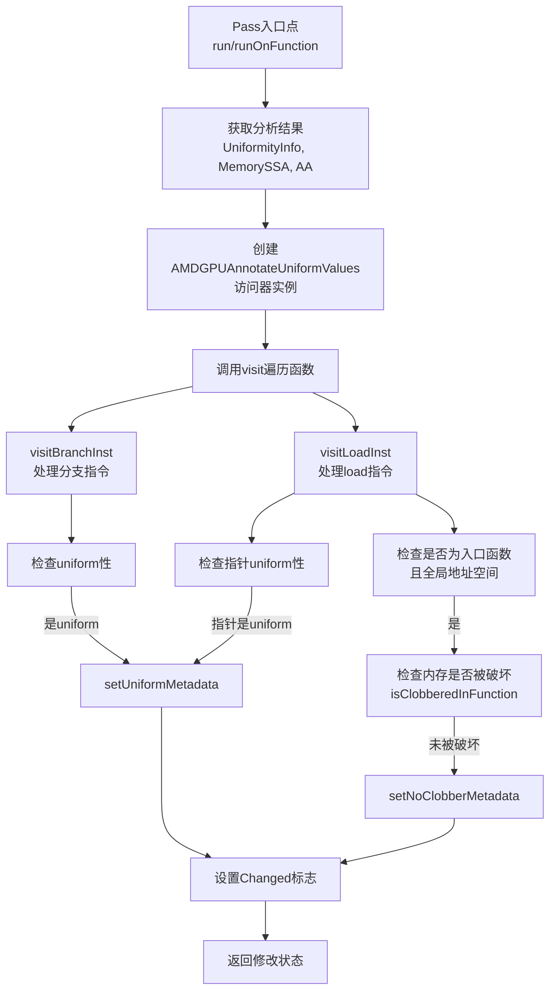

# AMDGPUAnnotateUniformValues.cpp 代码功能分析

## 1. Pass的主要功能概括

<a name="ref-block_0"></a>该Pass的主要功能是**为IR值添加`amdgpu.uniform`元数据，以便在指令选择阶段使用这些信息**。 llvm-project:10-11[<sup>↗</sup>](#block_0) 

具体作用和效果：
- **识别uniform值**：利用UniformityAnalysis分析结果，标注在所有工作项（work-items）中具有相同值的指令
- **优化内存访问**：对于全局地址空间的load指令，如果指针是uniform且内存未被破坏，则添加`amdgpu.noclobber`元数据
- **支持后续优化**：这些元数据信息在指令选择阶段被使用，帮助生成更高效的GPU代码

## 2. 主要功能实现步骤/子功能提取

该Pass包含以下主要步骤和子功能：

<a name="ref-block_1"></a>### A. 核心访问器类 `AMDGPUAnnotateUniformValues` llvm-project:30-36[<sup>↗</sup>](#block_1) 

### B. 元数据设置辅助函数
<a name="ref-block_2"></a>- `setUniformMetadata()` - 设置uniform元数据 llvm-project:38-41[<sup>↗</sup>](#block_2) 
<a name="ref-block_3"></a>- `setNoClobberMetadata()` - 设置noclobber元数据 llvm-project:43-46[<sup>↗</sup>](#block_3) 

### C. 指令访问方法
<a name="ref-block_4"></a>- `visitBranchInst()` - 处理分支指令 llvm-project:62-65[<sup>↗</sup>](#block_4) 
<a name="ref-block_5"></a>- `visitLoadInst()` - 处理load指令 llvm-project:67-83[<sup>↗</sup>](#block_5) 

### D. Pass入口点
<a name="ref-block_6"></a>- 新的Pass Manager接口 `AMDGPUAnnotateUniformValuesPass::run()` llvm-project:85-102[<sup>↗</sup>](#block_6) 
<a name="ref-block_8"></a>- 传统Pass Manager接口 `AMDGPUAnnotateUniformValuesLegacy::runOnFunction()` llvm-project:125-137[<sup>↗</sup>](#block_8) 

## 3. 各步骤/子功能的具体描述分析

### A. 核心访问器类（AMDGPUAnnotateUniformValues）

该类继承自`InstVisitor`，负责遍历函数中的指令并添加相应的元数据。类中维护以下关键状态：
- `UniformityInfo *UA` - uniform性分析结果
- `MemorySSA *MSSA` - 内存SSA分析结果
- `AliasAnalysis *AA` - 别名分析结果
- `bool isEntryFunc` - 标识是否为入口函数
- `bool Changed` - 标识是否进行了修改

### B. 元数据设置辅助函数

**setUniformMetadata()**：为指令添加空的`amdgpu.uniform`元数据节点，表示该指令的值在所有工作项中是uniform的。

**setNoClobberMetadata()**：为load指令添加`amdgpu.noclobber`元数据，表示该内存位置在函数执行过程中不会被破坏，可以安全地进行优化。

### C. 指令访问方法

**visitBranchInst()**：
- 检查分支指令是否为uniform
- 如果是uniform分支（所有工作项执行相同的分支），则添加uniform元数据
- 这有助于后端生成更高效的控制流代码

**visitLoadInst()**：
该方法执行两个主要功能：

1. **指针uniform性标注**：
   - 检查load指令的指针操作数是否为uniform
   - 如果指针是uniform且为指令类型，为该指针指令添加uniform元数据

2. **noclobber元数据添加**（仅限入口函数）：
   - 仅在入口函数中执行此检查（因为FunctionPass的限制） llvm-project:75-79 
   - 检查load是否来自全局地址空间
   - 使用MemorySSA和别名分析判断内存是否被破坏
   - 如果未被破坏，添加noclobber元数据

### D. Pass入口点

**新Pass Manager版本（run方法）**：
1. 获取UniformityInfo、MemorySSA和AliasAnalysis结果
2. 创建AMDGPUAnnotateUniformValues实例
3. 调用`visit(F)`遍历函数中的所有指令
4. 根据是否有修改返回相应的PreservedAnalyses

**传统Pass Manager版本（runOnFunction方法）**：
<a name="ref-block_7"></a>功能与新版本类似，但使用传统的分析依赖获取方式。 llvm-project:117-122[<sup>↗</sup>](#block_7) 

## 4. 步骤/子功能之间的关系

整个Pass的执行流程如下：



**关键关系说明**：

1. **依赖关系**：
   - 所有访问方法都依赖于UniformityAnalysis的结果
   - noclobber标注还需要MemorySSA和AliasAnalysis的支持

2. **顺序关系**：
   - Pass首先获取所有必需的分析结果
   - 然后创建访问器并遍历函数
   - 在遍历过程中按指令类型调用相应的visit方法

3. **条件关系**：
   - 分支指令的标注仅依赖uniform性检查
   - load指令的noclobber标注有额外的限制条件（入口函数、全局地址空间、未被破坏）

4. **协同关系**：
   - 两个元数据设置函数（setUniformMetadata和setNoClobberMetadata）都会修改Changed标志
   - 这个标志最终决定Pass的返回值和分析保留状态

## Notes

- 该Pass是AMDGPU后端优化管线中的重要一环，为后续的指令选择和代码生成提供关键的uniform性信息
- noclobber元数据的添加受到FunctionPass限制，仅能在入口函数中安全地进行跨函数边界的分析
- 代码中引用的`AMDGPU::isClobberedInFunction`函数用于判断内存是否被破坏，但该函数的具体实现在其他文件中
- 该Pass同时提供了新旧两种Pass Manager的接口，以保证兼容性
### Citations
<a name="block_0"></a>**File:** llvm/lib/Target/AMDGPU/AMDGPUAnnotateUniformValues.cpp (L10-11) [<sup>↩</sup>](#ref-block_0)
```cpp
/// This pass adds amdgpu.uniform metadata to IR values so this information
/// can be used during instruction selection.
```
<a name="block_1"></a>**File:** llvm/lib/Target/AMDGPU/AMDGPUAnnotateUniformValues.cpp (L30-36) [<sup>↩</sup>](#ref-block_1)
```cpp
class AMDGPUAnnotateUniformValues
    : public InstVisitor<AMDGPUAnnotateUniformValues> {
  UniformityInfo *UA;
  MemorySSA *MSSA;
  AliasAnalysis *AA;
  bool isEntryFunc;
  bool Changed = false;
```
<a name="block_2"></a>**File:** llvm/lib/Target/AMDGPU/AMDGPUAnnotateUniformValues.cpp (L38-41) [<sup>↩</sup>](#ref-block_2)
```cpp
  void setUniformMetadata(Instruction *I) {
    I->setMetadata("amdgpu.uniform", MDNode::get(I->getContext(), {}));
    Changed = true;
  }
```
<a name="block_3"></a>**File:** llvm/lib/Target/AMDGPU/AMDGPUAnnotateUniformValues.cpp (L43-46) [<sup>↩</sup>](#ref-block_3)
```cpp
  void setNoClobberMetadata(Instruction *I) {
    I->setMetadata("amdgpu.noclobber", MDNode::get(I->getContext(), {}));
    Changed = true;
  }
```
<a name="block_4"></a>**File:** llvm/lib/Target/AMDGPU/AMDGPUAnnotateUniformValues.cpp (L62-65) [<sup>↩</sup>](#ref-block_4)
```cpp
void AMDGPUAnnotateUniformValues::visitBranchInst(BranchInst &I) {
  if (UA->isUniform(&I))
    setUniformMetadata(&I);
}
```
<a name="block_5"></a>**File:** llvm/lib/Target/AMDGPU/AMDGPUAnnotateUniformValues.cpp (L67-83) [<sup>↩</sup>](#ref-block_5)
```cpp
void AMDGPUAnnotateUniformValues::visitLoadInst(LoadInst &I) {
  Value *Ptr = I.getPointerOperand();
  if (!UA->isUniform(Ptr))
    return;
  Instruction *PtrI = dyn_cast<Instruction>(Ptr);
  if (PtrI)
    setUniformMetadata(PtrI);

  // We're tracking up to the Function boundaries, and cannot go beyond because
  // of FunctionPass restrictions. We can ensure that is memory not clobbered
  // for memory operations that are live in to entry points only.
  if (!isEntryFunc)
    return;
  bool GlobalLoad = I.getPointerAddressSpace() == AMDGPUAS::GLOBAL_ADDRESS;
  if (GlobalLoad && !AMDGPU::isClobberedInFunction(&I, MSSA, AA))
    setNoClobberMetadata(&I);
}
```
<a name="block_6"></a>**File:** llvm/lib/Target/AMDGPU/AMDGPUAnnotateUniformValues.cpp (L85-102) [<sup>↩</sup>](#ref-block_6)
```cpp
PreservedAnalyses
AMDGPUAnnotateUniformValuesPass::run(Function &F,
                                     FunctionAnalysisManager &FAM) {
  UniformityInfo &UI = FAM.getResult<UniformityInfoAnalysis>(F);
  MemorySSA &MSSA = FAM.getResult<MemorySSAAnalysis>(F).getMSSA();
  AAResults &AA = FAM.getResult<AAManager>(F);

  AMDGPUAnnotateUniformValues Impl(UI, MSSA, AA, F);
  Impl.visit(F);

  if (!Impl.changed())
    return PreservedAnalyses::all();

  PreservedAnalyses PA = PreservedAnalyses::none();
  // TODO: Should preserve nearly everything
  PA.preserveSet<CFGAnalyses>();
  return PA;
}
```
<a name="block_7"></a>**File:** llvm/lib/Target/AMDGPU/AMDGPUAnnotateUniformValues.cpp (L117-122) [<sup>↩</sup>](#ref-block_7)
```cpp
  void getAnalysisUsage(AnalysisUsage &AU) const override {
    AU.addRequired<UniformityInfoWrapperPass>();
    AU.addRequired<MemorySSAWrapperPass>();
    AU.addRequired<AAResultsWrapperPass>();
    AU.setPreservesAll();
  }
```
<a name="block_8"></a>**File:** llvm/lib/Target/AMDGPU/AMDGPUAnnotateUniformValues.cpp (L125-137) [<sup>↩</sup>](#ref-block_8)
```cpp
bool AMDGPUAnnotateUniformValuesLegacy::runOnFunction(Function &F) {
  if (skipFunction(F))
    return false;

  UniformityInfo &UI =
      getAnalysis<UniformityInfoWrapperPass>().getUniformityInfo();
  MemorySSA &MSSA = getAnalysis<MemorySSAWrapperPass>().getMSSA();
  AliasAnalysis &AA = getAnalysis<AAResultsWrapperPass>().getAAResults();

  AMDGPUAnnotateUniformValues Impl(UI, MSSA, AA, F);
  Impl.visit(F);
  return Impl.changed();
}
```