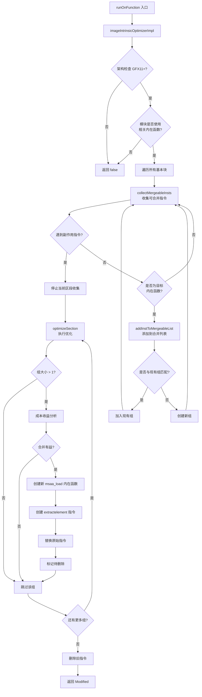

# AMDGPUImageIntrinsicOptimizer.cpp 代码功能详解

## 1. 主要功能概括

<a name="ref-block_0"></a>这是一个针对 AMDGPU 的 LLVM 优化 Pass，其主要功能是**将多个 2D MSAA（多重采样抗锯齿）图像加载内在函数合并为单个 MSAA 加载内在函数**。 llvm-project:9-16[<sup>↗</sup>](#block_0) 

**作用与效果：**
- 减少内在函数调用次数
- 降低 vaddr（虚拟地址）和 vdata（向量数据）的传输量
- 提高着色器性能和寄存器使用效率

<a name="ref-block_4"></a>该优化仅适用于 GFX11+ 架构，因为 GFX10 的 IMAGE_MSAA_LOAD 指令在多通道纹理格式下存在限制。 llvm-project:58-62[<sup>↗</sup>](#block_4) 

**优化示例：**
<a name="ref-block_2"></a>将 4 个单独的 `image.load.2dmsaa` 调用（针对不同的 sample_id）合并为 1 个 `image.msaa.load.2dmsaa` 调用。 llvm-project:41-48[<sup>↗</sup>](#block_2) 

## 2. 实现的主要步骤和子功能

通过分析代码，我提取出以下核心步骤：

1. **架构检查与早期退出** (`imageIntrinsicOptimizerImpl`)
2. **可合并指令收集** (`collectMergeableInsts`)
3. **指令分组与列表管理** (`addInstToMergeableList`)
4. **合并优化执行** (`optimizeSection`)

## 3. 各步骤的具体描述分析

### 3.1 架构检查与早期退出

<a name="ref-block_8"></a>**位置：** `imageIntrinsicOptimizerImpl` 函数 llvm-project:283-300[<sup>↗</sup>](#block_8) 

**功能描述：**
- 验证目标机器架构是否为 GFX11 或更高版本
- 检查是否存在 MSAALoadDstSelBug
- 在模块级别快速判断是否存在相关内在函数（`amdgcn_image_load_2dmsaa` 或 `amdgcn_image_load_2darraymsaa`）
- 如果不满足优化条件，直接返回 false 避免不必要的遍历

### 3.2 可合并指令收集

<a name="ref-block_6"></a>**位置：** `collectMergeableInsts` 函数 llvm-project:142-174[<sup>↗</sup>](#block_6) 

**功能描述：**
此函数在基本块的一个区段内收集所有可以合并的指令，包含以下逻辑：

1. **副作用检查：** 遇到可能产生副作用的指令（如 store 或内存屏障）时停止收集 llvm-project:146-151 

2. **内在函数类型过滤：** 只处理 `amdgcn_image_load_2dmsaa` 和 `amdgcn_image_load_2darraymsaa` 两种内在函数 llvm-project:158-160 

3. **常量 FragId 验证：** 确保 FragId（样本 ID）参数是常量，因为只有常量才能进行静态合并 llvm-project:162-166 

### 3.3 指令分组与列表管理

<a name="ref-block_5"></a>**位置：** `addInstToMergeableList` 函数 llvm-project:98-138[<sup>↗</sup>](#block_5) 

**功能描述：**
此函数负责将具有相似特征的指令分组到同一个列表中，判断标准包括：

1. **内在函数 ID 匹配：** 必须是相同类型的图像加载指令 llvm-project:103-105 

2. **数据类型匹配（D16 检查）：** 返回类型必须相同 llvm-project:107-109 

3. **参数匹配：** 除了 FragId 之外的所有参数（DMask、VAddr、RSrc 等）必须相同 llvm-project:111-126 

4. **FragId 分组：** FragId 必须属于同一组（通过 `FragId / 4` 计算组号） llvm-project:117-121 

如果找到匹配的组，将指令添加到该组；否则创建新组。

### 3.4 合并优化执行

<a name="ref-block_7"></a>**位置：** `optimizeSection` 函数 llvm-project:176-281[<sup>↗</sup>](#block_7) 

**功能描述：**
这是核心优化逻辑，执行实际的指令合并：

#### 3.4.1 成本收益分析
在合并前进行性能权衡，确保合并后的传输量更少： llvm-project:208-219 

计算以下指标：
- `NumLoads`：原始加载指令数量
- `NumMsaas`：合并后 MSAA 加载指令数量
- `NumVAddrLoads/NumVDataLoads`：原始方案的地址和数据传输量
- `NumVAddrMsaas/NumVDataMsaas`：合并方案的地址和数据传输量

只有当合并能减少指令数量或总传输量时才执行。

#### 3.4.2 新内在函数创建
根据原始的 `image_load` 类型，创建对应的 `image_msaa_load` 内在函数： llvm-project:230-248 

关键步骤：
- 设置新的返回类型为 4 元素向量 (`<4 x EltTy>`)
- 调整 DMask 为每次处理一个通道
- 将 FragId 对齐到 4 的倍数（组的起始位置）

#### 3.4.3 提取元素与替换
为每个原始指令创建 `extractelement` 指令，从合并的 4 元素向量中提取对应的样本： llvm-project:250-272 

- 如果原始指令只有一个元素，直接提取
- 如果有多个元素，需要为每个通道创建 `insertelement` 和 `extractelement` 序列
- 使用 `FragId % 4` 作为提取索引

## 4. 步骤间的关系

整体执行流程如下图所示：



**关键关系说明：**

1. **层次关系：** `runOnFunction` → `imageIntrinsicOptimizerImpl` → 循环处理每个基本块 → `collectMergeableInsts` + `optimizeSection`

2. **数据流关系：** 
   - `collectMergeableInsts` 调用 `addInstToMergeableList` 构建分组列表
   - 分组列表传递给 `optimizeSection` 进行实际转换

3. **控制流关系：**
   - 早期退出机制避免不必要的处理
   - 区段划分机制（遇到副作用指令停止）确保优化的正确性
   - 成本收益分析确保优化不会降低性能

4. **依赖关系：**
   - 指令必须满足分组条件才能合并
   - 合并的前提是能减少资源使用
   - 所有原始指令的使用者通过 `extractelement` 获取合并后的结果

## Notes

- 此 Pass 专门针对 GFX11+ 架构设计，因为 GFX10 的硬件限制使其无法正确处理多通道纹理格式 llvm-project:287-290 

<a name="ref-block_1"></a>- 优化基于启发式规则，在某些边界情况下可能不是最优选择，如注释中提到的 "yes?" 案例 llvm-project:34-37[<sup>↗</sup>](#block_1) 

<a name="ref-block_3"></a>- 未来改进方向包括考虑寄存器压力和确保多个 MSAA_LOAD 之间的指令聚类 llvm-project:51-56[<sup>↗</sup>](#block_3)
### Citations
<a name="block_0"></a>**File:** llvm/lib/Target/AMDGPU/AMDGPUImageIntrinsicOptimizer.cpp (L9-16) [<sup>↩</sup>](#ref-block_0)
```cpp
// This pass tries to combine multiple image_load intrinsics with dim=2dmsaa
// or dim=2darraymsaa into a single image_msaa_load intrinsic if:
//
// - they refer to the same vaddr except for sample_id,
// - they use a constant sample_id and they fall into the same group,
// - they have the same dmask and the number of intrinsics and the number of
//   vaddr/vdata dword transfers is reduced by the combine.
//
```
<a name="block_1"></a>**File:** llvm/lib/Target/AMDGPU/AMDGPUImageIntrinsicOptimizer.cpp (L34-37) [<sup>↩</sup>](#ref-block_1)
```cpp
// Some cases are of questionable benefit, like the one marked with "yes?"
// above: fewer intrinsics and fewer vaddr and fewer total transfers between SP
// and TX, but higher vdata. We start by erring on the side of converting these
// to MSAA_LOAD.
```
<a name="block_2"></a>**File:** llvm/lib/Target/AMDGPU/AMDGPUImageIntrinsicOptimizer.cpp (L41-48) [<sup>↩</sup>](#ref-block_2)
```cpp
// This pass will combine intrinsics such as (not neccessarily consecutive):
//  call float @llvm.amdgcn.image.load.2dmsaa.f32.i32(i32 1, i32 %s, i32 %t, i32 0, <8 x i32> %rsrc, i32 0, i32 0)
//  call float @llvm.amdgcn.image.load.2dmsaa.f32.i32(i32 1, i32 %s, i32 %t, i32 1, <8 x i32> %rsrc, i32 0, i32 0)
//  call float @llvm.amdgcn.image.load.2dmsaa.f32.i32(i32 1, i32 %s, i32 %t, i32 2, <8 x i32> %rsrc, i32 0, i32 0)
//  call float @llvm.amdgcn.image.load.2dmsaa.f32.i32(i32 1, i32 %s, i32 %t, i32 3, <8 x i32> %rsrc, i32 0, i32 0)
// ==>
//  call <4 x float> @llvm.amdgcn.image.msaa.load.2dmsaa.v4f32.i32(i32 1, i32 %s, i32 %t, i32 0, <8 x i32> %rsrc, i32 0, i32 0)
//
```
<a name="block_3"></a>**File:** llvm/lib/Target/AMDGPU/AMDGPUImageIntrinsicOptimizer.cpp (L51-56) [<sup>↩</sup>](#ref-block_3)
```cpp
// Future improvements:
//
// - We may occasionally not want to do the combine if it increases the maximum
//   register pressure.
//
// - Ensure clausing when multiple MSAA_LOAD are generated.
```
<a name="block_4"></a>**File:** llvm/lib/Target/AMDGPU/AMDGPUImageIntrinsicOptimizer.cpp (L58-62) [<sup>↩</sup>](#ref-block_4)
```cpp
// Note: Even though the image_msaa_load intrinsic already exists on gfx10, this
// combine only applies to gfx11, due to a limitation in gfx10: the gfx10
// IMAGE_MSAA_LOAD only works correctly with single-channel texture formats, and
// we don't know the format at compile time.
//===----------------------------------------------------------------------===//
```
<a name="block_5"></a>**File:** llvm/lib/Target/AMDGPU/AMDGPUImageIntrinsicOptimizer.cpp (L98-138) [<sup>↩</sup>](#ref-block_5)
```cpp
void addInstToMergeableList(
    IntrinsicInst *II,
    SmallVector<SmallVector<IntrinsicInst *, 4>> &MergeableInsts,
    const AMDGPU::ImageDimIntrinsicInfo *ImageDimIntr) {
  for (SmallVector<IntrinsicInst *, 4> &IIList : MergeableInsts) {
    // Check Dim.
    if (IIList.front()->getIntrinsicID() != II->getIntrinsicID())
      continue;

    // Check D16.
    if (IIList.front()->getType() != II->getType())
      continue;

    // Check all arguments (DMask, VAddr, RSrc etc).
    bool AllEqual = true;
    assert(IIList.front()->arg_size() == II->arg_size());
    for (int I = 1, E = II->arg_size(); AllEqual && I != E; ++I) {
      Value *ArgList = IIList.front()->getArgOperand(I);
      Value *Arg = II->getArgOperand(I);
      if (I == ImageDimIntr->VAddrEnd - 1) {
        // Check FragId group.
        auto *FragIdList = cast<ConstantInt>(IIList.front()->getArgOperand(I));
        auto *FragId = cast<ConstantInt>(II->getArgOperand(I));
        AllEqual = FragIdList->getValue().udiv(4) == FragId->getValue().udiv(4);
      } else {
        // Check all arguments except FragId.
        AllEqual = ArgList == Arg;
      }
    }
    if (!AllEqual)
      continue;

    // Add to the list.
    IIList.emplace_back(II);
    return;
  }

  // Similar instruction not found, so add a new list.
  MergeableInsts.emplace_back(1, II);
  LLVM_DEBUG(dbgs() << "New: " << *II << "\n");
}
```
<a name="block_6"></a>**File:** llvm/lib/Target/AMDGPU/AMDGPUImageIntrinsicOptimizer.cpp (L142-174) [<sup>↩</sup>](#ref-block_6)
```cpp
BasicBlock::iterator collectMergeableInsts(
    BasicBlock::iterator I, BasicBlock::iterator E,
    SmallVector<SmallVector<IntrinsicInst *, 4>> &MergeableInsts) {
  for (; I != E; ++I) {
    // Don't combine if there is a store in the middle or if there is a memory
    // barrier.
    if (I->mayHaveSideEffects()) {
      ++I;
      break;
    }

    // Ignore non-intrinsics.
    if (IntrinsicInst *II = dyn_cast<IntrinsicInst>(I)) {
      Intrinsic::ID IntrinID = II->getIntrinsicID();

      // Ignore other intrinsics.
      if (IntrinID != Intrinsic::amdgcn_image_load_2dmsaa &&
          IntrinID != Intrinsic::amdgcn_image_load_2darraymsaa)
        continue;

      // Check for constant FragId.
      const auto *ImageDimIntr = AMDGPU::getImageDimIntrinsicInfo(IntrinID);
      const uint8_t FragIdIndex = ImageDimIntr->VAddrEnd - 1;
      if (!isa<ConstantInt>(II->getArgOperand(FragIdIndex)))
        continue;

      LLVM_DEBUG(dbgs() << "Merge: " << *II << "\n");
      addInstToMergeableList(II, MergeableInsts, ImageDimIntr);
    }
  }

  return I;
}
```
<a name="block_7"></a>**File:** llvm/lib/Target/AMDGPU/AMDGPUImageIntrinsicOptimizer.cpp (L176-281) [<sup>↩</sup>](#ref-block_7)
```cpp
bool optimizeSection(ArrayRef<SmallVector<IntrinsicInst *, 4>> MergeableInsts) {
  bool Modified = false;

  SmallVector<Instruction *, 4> InstrsToErase;
  for (const auto &IIList : MergeableInsts) {
    if (IIList.size() <= 1)
      continue;

    // Assume the arguments are unchanged and later override them, if needed.
    SmallVector<Value *, 16> Args(IIList.front()->args());

    // Validate function argument and return types, extracting overloaded
    // types along the way.
    SmallVector<Type *, 6> OverloadTys;
    Function *F = IIList.front()->getCalledFunction();
    if (!Intrinsic::getIntrinsicSignature(F, OverloadTys))
      continue;

    Intrinsic::ID IntrinID = IIList.front()->getIntrinsicID();
    const AMDGPU::ImageDimIntrinsicInfo *ImageDimIntr =
        AMDGPU::getImageDimIntrinsicInfo(IntrinID);

    Type *EltTy = IIList.front()->getType()->getScalarType();
    Type *NewTy = FixedVectorType::get(EltTy, 4);
    OverloadTys[0] = NewTy;
    bool isD16 = EltTy->isHalfTy();

    ConstantInt *DMask = cast<ConstantInt>(
        IIList.front()->getArgOperand(ImageDimIntr->DMaskIndex));
    unsigned DMaskVal = DMask->getZExtValue() & 0xf;
    unsigned NumElts = popcount(DMaskVal);

    // Number of instructions and the number of vaddr/vdata dword transfers
    // should be reduced.
    unsigned NumLoads = IIList.size();
    unsigned NumMsaas = NumElts;
    unsigned NumVAddrLoads = 3 * NumLoads;
    unsigned NumVDataLoads = divideCeil(NumElts, isD16 ? 2 : 1) * NumLoads;
    unsigned NumVAddrMsaas = 3 * NumMsaas;
    unsigned NumVDataMsaas = divideCeil(4, isD16 ? 2 : 1) * NumMsaas;

    if (NumLoads < NumMsaas ||
        (NumVAddrLoads + NumVDataLoads < NumVAddrMsaas + NumVDataMsaas))
      continue;

    const uint8_t FragIdIndex = ImageDimIntr->VAddrEnd - 1;
    auto *FragId =
        cast<ConstantInt>(IIList.front()->getArgOperand(FragIdIndex));
    const APInt &NewFragIdVal = FragId->getValue().udiv(4) * 4;

    // Create the new instructions.
    IRBuilder<> B(IIList.front());

    // Create the new image_msaa_load intrinsic.
    SmallVector<Instruction *, 4> NewCalls;
    while (DMaskVal != 0) {
      unsigned NewMaskVal = 1 << countr_zero(DMaskVal);

      Intrinsic::ID NewIntrinID;
      if (IntrinID == Intrinsic::amdgcn_image_load_2dmsaa)
        NewIntrinID = Intrinsic::amdgcn_image_msaa_load_2dmsaa;
      else
        NewIntrinID = Intrinsic::amdgcn_image_msaa_load_2darraymsaa;

      Args[ImageDimIntr->DMaskIndex] =
          ConstantInt::get(DMask->getType(), NewMaskVal);
      Args[FragIdIndex] = ConstantInt::get(FragId->getType(), NewFragIdVal);
      CallInst *NewCall = B.CreateIntrinsic(NewIntrinID, OverloadTys, Args);
      LLVM_DEBUG(dbgs() << "Optimize: " << *NewCall << "\n");

      NewCalls.push_back(NewCall);
      DMaskVal -= NewMaskVal;
    }

    // Create the new extractelement instructions.
    for (auto &II : IIList) {
      Value *VecOp = nullptr;
      auto *Idx = cast<ConstantInt>(II->getArgOperand(FragIdIndex));
      B.SetCurrentDebugLocation(II->getDebugLoc());
      if (NumElts == 1) {
        VecOp = B.CreateExtractElement(NewCalls[0], Idx->getValue().urem(4));
        LLVM_DEBUG(dbgs() << "Add: " << *VecOp << "\n");
      } else {
        VecOp = PoisonValue::get(II->getType());
        for (unsigned I = 0; I < NumElts; ++I) {
          VecOp = B.CreateInsertElement(
              VecOp,
              B.CreateExtractElement(NewCalls[I], Idx->getValue().urem(4)), I);
          LLVM_DEBUG(dbgs() << "Add: " << *VecOp << "\n");
        }
      }

      // Replace the old instruction.
      II->replaceAllUsesWith(VecOp);
      VecOp->takeName(II);
      InstrsToErase.push_back(II);
    }

    Modified = true;
  }

  for (auto *I : InstrsToErase)
    I->eraseFromParent();

  return Modified;
}
```
<a name="block_8"></a>**File:** llvm/lib/Target/AMDGPU/AMDGPUImageIntrinsicOptimizer.cpp (L283-300) [<sup>↩</sup>](#ref-block_8)
```cpp
static bool imageIntrinsicOptimizerImpl(Function &F, const TargetMachine *TM) {
  if (!TM)
    return false;

  // This optimization only applies to GFX11 and beyond.
  const GCNSubtarget &ST = TM->getSubtarget<GCNSubtarget>(F);
  if (!AMDGPU::isGFX11Plus(ST) || ST.hasMSAALoadDstSelBug())
    return false;

  Module *M = F.getParent();

  // Early test to determine if the intrinsics are used.
  if (llvm::none_of(*M, [](Function &F) {
        return !F.users().empty() &&
               (F.getIntrinsicID() == Intrinsic::amdgcn_image_load_2dmsaa ||
                F.getIntrinsicID() == Intrinsic::amdgcn_image_load_2darraymsaa);
      }))
    return false;
```