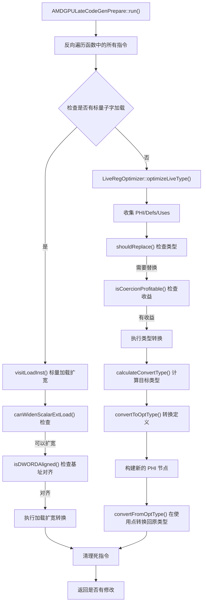

# AMDGPULateCodeGenPrepare.cpp 代码功能分析

## 1. Pass 的主要功能概括

<a name="ref-block_0"></a>该 pass 在**指令选择（instruction selection）之前**对 AMDGPU 的 IR 进行优化，主要包含两个核心功能： llvm-project:10-11[<sup>↗</sup>](#block_0) 

**主要作用和效果：**

1. **跨基本块非法类型向量优化**：解决在构建 SelectionDAG 时，跨基本块的非法类型向量会被标量化和扩宽的问题，通过类型转换将这些向量打包到更少的物理寄存器中
<a name="ref-block_5"></a>2. **标量子字加载扩宽**：将常量地址空间中对齐但小于 DWORD 的加载扩展为 DWORD 对齐的加载，提高内存访问效率 llvm-project:176-183[<sup>↗</sup>](#block_5) llvm-project:32-40 

## 2. 主要功能的步骤和子功能

该 pass 包含以下主要组件和步骤：

### 2.1 核心类和组件
- **AMDGPULateCodeGenPrepare 类**：主控制器，负责遍历指令并调用优化
- **LiveRegOptimizer 类**：负责跨基本块非法类型向量的优化
- **标量加载访问优化方法**：`visitLoadInst` 和 `canWidenScalarExtLoad`

### 2.2 主要执行步骤

<a name="ref-block_6"></a>#### 步骤 1：反向遍历函数和指令 llvm-project:189-193[<sup>↗</sup>](#block_6) 

#### 步骤 2：LiveRegOptimizer 的类型优化流程
- 子步骤 2.1：检测和收集需要优化的指令
- 子步骤 2.2：类型转换计算
- 子步骤 2.3：转换到优化类型
- 子步骤 2.4：处理 PHI 节点
- 子步骤 2.5：转换回原始类型

#### 步骤 3：标量加载扩宽优化

## 3. 各子功能的详细描述分析

### 3.1 LiveRegOptimizer::optimizeLiveType

<a name="ref-block_10"></a>**功能**：这是 LiveRegOptimizer 的核心方法，负责优化非法类型的虚拟寄存器。 llvm-project:285-286[<sup>↗</sup>](#block_10) 

**工作流程：**

<a name="ref-block_11"></a>1. **收集阶段**：通过工作列表算法收集所有需要处理的 PHI 节点、定义（Defs）和使用（Uses） llvm-project:287-344[<sup>↗</sup>](#block_11) 

2. **判断是否需要优化**：
   - 使用 `shouldReplace` 检查类型是否为非法向量类型
<a name="ref-block_3"></a>   - 使用 `isCoercionProfitable` 判断优化是否有利可图 llvm-project:110-128[<sup>↗</sup>](#block_3) llvm-project:132-166 

<a name="ref-block_12"></a>3. **执行转换**：将定义转换为优化的类型（通常是 i32 或 i32 向量） llvm-project:346-354[<sup>↗</sup>](#block_12) 

<a name="ref-block_13"></a>4. **构建新的 PHI 节点**：为跨基本块的值创建新类型的 PHI 节点 llvm-project:356-407[<sup>↗</sup>](#block_13) 

<a name="ref-block_14"></a>5. **在使用点转换回原始类型**：在实际使用前将值转换回原始类型 llvm-project:408-436[<sup>↗</sup>](#block_14) 

### 3.2 LiveRegOptimizer::calculateConvertType

<a name="ref-block_7"></a>**功能**：计算给定非法类型应该转换到的目标类型。 llvm-project:199-215[<sup>↗</sup>](#block_7) 

**策略**：
- 如果原始大小 ≤ 32 位，转换为 i32
- 如果原始大小 > 32 位，转换为 i32 向量，元素数量根据大小计算

### 3.3 LiveRegOptimizer::convertToOptType

<a name="ref-block_8"></a>**功能**：将指令的值转换为优化后的类型。 llvm-project:217-245[<sup>↗</sup>](#block_8) 

**转换策略**：
- 如果位大小匹配，直接进行 bitcast
- 如果需要更大的类型，先用 shufflevector 扩展向量，然后 bitcast

### 3.4 LiveRegOptimizer::convertFromOptType

<a name="ref-block_9"></a>**功能**：将优化类型的值转换回原始类型。 llvm-project:247-283[<sup>↗</sup>](#block_9) 

**转换策略**：
- 如果位大小匹配，直接 bitcast
- 对于标量，使用 trunc 截断
- 对于向量，使用 shufflevector 移除多余的元素

### 3.5 AMDGPULateCodeGenPrepare::canWidenScalarExtLoad

<a name="ref-block_15"></a>**功能**：判断加载指令是否可以扩宽。 llvm-project:441-463[<sup>↗</sup>](#block_15) 

**检查条件**：
- 必须是常量地址空间（CONSTANT_ADDRESS 或 CONSTANT_ADDRESS_32BIT）
- 必须是简单加载（simple load）
- 不是聚合类型
- 大小小于 4 字节（sub-DWORD）
- 至少自然对齐
- 必须是 uniform 的（标量加载）

### 3.6 AMDGPULateCodeGenPrepare::visitLoadInst

<a name="ref-block_16"></a>**功能**：执行标量加载扩宽优化。 llvm-project:465-518[<sup>↗</sup>](#block_16) 

**优化策略**：
1. 检查基址指针是否 DWORD 对齐
2. 计算偏移量调整值
3. 如果调整值为 0，直接提升对齐到 4 字节
4. 否则，创建新的 DWORD 对齐的加载，然后通过移位和截断提取所需的字节

### 3.7 AMDGPULateCodeGenPrepare::isDWORDAligned

<a name="ref-block_2"></a>**功能**：检查值是否至少 DWORD（4 字节）对齐。 llvm-project:63-66[<sup>↗</sup>](#block_2) 

使用 `computeKnownBits` 分析来确定最少的尾部零位数。

## 4. 步骤和子功能之间的关系

### 4.1 整体执行流程关系



### 4.2 LiveRegOptimizer 内部关系

**类型转换链条：**
1. `shouldReplace()` 和 `isCoercionProfitable()` 决定**是否**进行优化
2. `calculateConvertType()` 决定转换的**目标类型**
3. `convertToOptType()` 执行**正向转换**（原始类型 → 优化类型）
4. `convertFromOptType()` 执行**反向转换**（优化类型 → 原始类型）

**数据流关系：**
- **Defs（定义）** → 通过 `convertToOptType()` 转换 → 存入 `ValMap`
- **PHI 节点** → 创建新类型的 PHI → 连接转换后的 incoming values
- **Uses（使用）** → 从 `ValMap` 查找 → 通过 `convertFromOptType()` 转换回原类型

### 4.3 标量加载扩宽的依赖关系

标量加载扩宽功能依赖以下检查链：
1. `WidenLoads` 命令行选项必须启用
2. `canWidenScalarExtLoad()` 验证加载的合法性
3. `isDWORDAligned()` 验证基址对齐
4. 根据偏移量调整，决定是简单提升对齐还是进行复杂的移位转换

### 4.4 两个主要功能的协调

在 `run()` 方法中，这两个优化是**独立且互补**的： llvm-project:191-192 

- 标量加载扩宽只在没有硬件支持标量子字加载时执行
- LiveRegOptimizer 优化则对所有指令执行
- 两者共享同一个 `DeadInsts` 集合来收集需要删除的死指令

## Notes

这个 pass 是一个**late code generation preparation** pass，运行在指令选择之前的最后阶段。它的两个主要功能都是为了提高代码生成质量：

1. **LiveRegOptimizer** 解决的是 SelectionDAG 构建时的一个根本性问题：非法类型的向量在跨基本块时会被过度标量化，导致寄存器压力增加。通过在 IR 层面进行类型转换，可以减少物理寄存器的使用。

2. **标量加载扩宽**需要在 load-store-vectorizer pass 之后运行，因为后者不处理重叠的情况。这个优化特别针对常量内存访问，将小于 DWORD 的加载转换为 DWORD 对齐的加载，可以提高内存访问效率。

两个功能在设计上是解耦的，但共享分析基础设施（如 AssumptionCache 和 UniformityInfo），并且都遵循"先转换、后清理"的模式来保持 IR 的一致性。
### Citations
<a name="block_0"></a>**File:** llvm/lib/Target/AMDGPU/AMDGPULateCodeGenPrepare.cpp (L10-11) [<sup>↩</sup>](#ref-block_0)
```cpp
/// This pass does misc. AMDGPU optimizations on IR *just* before instruction
/// selection.
```
<a name="block_1"></a>**File:** llvm/lib/Target/AMDGPU/AMDGPULateCodeGenPrepare.cpp (L32-40)
```cpp
// Scalar load widening needs running after load-store-vectorizer as that pass
// doesn't handle overlapping cases. In addition, this pass enhances the
// widening to handle cases where scalar sub-dword loads are naturally aligned
// only but not dword aligned.
static cl::opt<bool>
    WidenLoads("amdgpu-late-codegenprepare-widen-constant-loads",
               cl::desc("Widen sub-dword constant address space loads in "
                        "AMDGPULateCodeGenPrepare"),
               cl::ReallyHidden, cl::init(true));
```
<a name="block_2"></a>**File:** llvm/lib/Target/AMDGPU/AMDGPULateCodeGenPrepare.cpp (L63-66) [<sup>↩</sup>](#ref-block_2)
```cpp
  bool isDWORDAligned(const Value *V) const {
    KnownBits Known = computeKnownBits(V, DL, AC);
    return Known.countMinTrailingZeros() >= 2;
  }
```
<a name="block_3"></a>**File:** llvm/lib/Target/AMDGPU/AMDGPULateCodeGenPrepare.cpp (L110-128) [<sup>↩</sup>](#ref-block_3)
```cpp
  bool shouldReplace(Type *ITy) {
    FixedVectorType *VTy = dyn_cast<FixedVectorType>(ITy);
    if (!VTy)
      return false;

    const auto *TLI = ST.getTargetLowering();

    Type *EltTy = VTy->getElementType();
    // If the element size is not less than the convert to scalar size, then we
    // can't do any bit packing
    if (!EltTy->isIntegerTy() ||
        EltTy->getScalarSizeInBits() > ConvertToScalar->getScalarSizeInBits())
      return false;

    // Only coerce illegal types
    TargetLoweringBase::LegalizeKind LK =
        TLI->getTypeConversion(EltTy->getContext(), EVT::getEVT(EltTy, false));
    return LK.first != TargetLoweringBase::TypeLegal;
  }
```
<a name="block_4"></a>**File:** llvm/lib/Target/AMDGPU/AMDGPULateCodeGenPrepare.cpp (L132-166)
```cpp
  bool isCoercionProfitable(Instruction *II) {
    SmallPtrSet<Instruction *, 4> CVisited;
    SmallVector<Instruction *, 4> UserList;

    // Check users for profitable conditions (across block user which can
    // natively handle the illegal vector).
    for (User *V : II->users())
      if (auto *UseInst = dyn_cast<Instruction>(V))
        UserList.push_back(UseInst);

    auto IsLookThru = [](Instruction *II) {
      if (const auto *Intr = dyn_cast<IntrinsicInst>(II))
        return Intr->getIntrinsicID() == Intrinsic::amdgcn_perm;
      return isa<PHINode, ShuffleVectorInst, InsertElementInst,
                 ExtractElementInst, CastInst>(II);
    };

    while (!UserList.empty()) {
      auto CII = UserList.pop_back_val();
      if (!CVisited.insert(CII).second)
        continue;

      if (CII->getParent() == II->getParent() && !IsLookThru(II))
        continue;

      if (isOpLegal(CII))
        return true;

      if (IsLookThru(CII))
        for (User *V : CII->users())
          if (auto *UseInst = dyn_cast<Instruction>(V))
            UserList.push_back(UseInst);
    }
    return false;
  }
```
<a name="block_5"></a>**File:** llvm/lib/Target/AMDGPU/AMDGPULateCodeGenPrepare.cpp (L176-183) [<sup>↩</sup>](#ref-block_5)
```cpp
  // "Optimize" the virtual regs that cross basic block boundaries. When
  // building the SelectionDAG, vectors of illegal types that cross basic blocks
  // will be scalarized and widened, with each scalar living in its
  // own register. To work around this, this optimization converts the
  // vectors to equivalent vectors of legal type (which are converted back
  // before uses in subsequent blocks), to pack the bits into fewer physical
  // registers (used in CopyToReg/CopyFromReg pairs).
  LiveRegOptimizer LRO(*F.getParent(), ST);
```
<a name="block_6"></a>**File:** llvm/lib/Target/AMDGPU/AMDGPULateCodeGenPrepare.cpp (L189-193) [<sup>↩</sup>](#ref-block_6)
```cpp
  for (auto &BB : reverse(F))
    for (Instruction &I : make_early_inc_range(reverse(BB))) {
      Changed |= !HasScalarSubwordLoads && visit(I);
      Changed |= LRO.optimizeLiveType(&I, DeadInsts);
    }
```
<a name="block_7"></a>**File:** llvm/lib/Target/AMDGPU/AMDGPULateCodeGenPrepare.cpp (L199-215) [<sup>↩</sup>](#ref-block_7)
```cpp
Type *LiveRegOptimizer::calculateConvertType(Type *OriginalType) {
  assert(OriginalType->getScalarSizeInBits() <=
         ConvertToScalar->getScalarSizeInBits());

  FixedVectorType *VTy = cast<FixedVectorType>(OriginalType);

  TypeSize OriginalSize = DL.getTypeSizeInBits(VTy);
  TypeSize ConvertScalarSize = DL.getTypeSizeInBits(ConvertToScalar);
  unsigned ConvertEltCount =
      (OriginalSize + ConvertScalarSize - 1) / ConvertScalarSize;

  if (OriginalSize <= ConvertScalarSize)
    return IntegerType::get(Mod.getContext(), ConvertScalarSize);

  return VectorType::get(Type::getIntNTy(Mod.getContext(), ConvertScalarSize),
                         ConvertEltCount, false);
}
```
<a name="block_8"></a>**File:** llvm/lib/Target/AMDGPU/AMDGPULateCodeGenPrepare.cpp (L217-245) [<sup>↩</sup>](#ref-block_8)
```cpp
Value *LiveRegOptimizer::convertToOptType(Instruction *V,
                                          BasicBlock::iterator &InsertPt) {
  FixedVectorType *VTy = cast<FixedVectorType>(V->getType());
  Type *NewTy = calculateConvertType(V->getType());

  TypeSize OriginalSize = DL.getTypeSizeInBits(VTy);
  TypeSize NewSize = DL.getTypeSizeInBits(NewTy);

  IRBuilder<> Builder(V->getParent(), InsertPt);
  // If there is a bitsize match, we can fit the old vector into a new vector of
  // desired type.
  if (OriginalSize == NewSize)
    return Builder.CreateBitCast(V, NewTy, V->getName() + ".bc");

  // If there is a bitsize mismatch, we must use a wider vector.
  assert(NewSize > OriginalSize);
  uint64_t ExpandedVecElementCount = NewSize / VTy->getScalarSizeInBits();

  SmallVector<int, 8> ShuffleMask;
  uint64_t OriginalElementCount = VTy->getElementCount().getFixedValue();
  for (unsigned I = 0; I < OriginalElementCount; I++)
    ShuffleMask.push_back(I);

  for (uint64_t I = OriginalElementCount; I < ExpandedVecElementCount; I++)
    ShuffleMask.push_back(OriginalElementCount);

  Value *ExpandedVec = Builder.CreateShuffleVector(V, ShuffleMask);
  return Builder.CreateBitCast(ExpandedVec, NewTy, V->getName() + ".bc");
}
```
<a name="block_9"></a>**File:** llvm/lib/Target/AMDGPU/AMDGPULateCodeGenPrepare.cpp (L247-283) [<sup>↩</sup>](#ref-block_9)
```cpp
Value *LiveRegOptimizer::convertFromOptType(Type *ConvertType, Instruction *V,
                                            BasicBlock::iterator &InsertPt,
                                            BasicBlock *InsertBB) {
  FixedVectorType *NewVTy = cast<FixedVectorType>(ConvertType);

  TypeSize OriginalSize = DL.getTypeSizeInBits(V->getType());
  TypeSize NewSize = DL.getTypeSizeInBits(NewVTy);

  IRBuilder<> Builder(InsertBB, InsertPt);
  // If there is a bitsize match, we simply convert back to the original type.
  if (OriginalSize == NewSize)
    return Builder.CreateBitCast(V, NewVTy, V->getName() + ".bc");

  // If there is a bitsize mismatch, then we must have used a wider value to
  // hold the bits.
  assert(OriginalSize > NewSize);
  // For wide scalars, we can just truncate the value.
  if (!V->getType()->isVectorTy()) {
    Instruction *Trunc = cast<Instruction>(
        Builder.CreateTrunc(V, IntegerType::get(Mod.getContext(), NewSize)));
    return cast<Instruction>(Builder.CreateBitCast(Trunc, NewVTy));
  }

  // For wider vectors, we must strip the MSBs to convert back to the original
  // type.
  VectorType *ExpandedVT = VectorType::get(
      Type::getIntNTy(Mod.getContext(), NewVTy->getScalarSizeInBits()),
      (OriginalSize / NewVTy->getScalarSizeInBits()), false);
  Instruction *Converted =
      cast<Instruction>(Builder.CreateBitCast(V, ExpandedVT));

  unsigned NarrowElementCount = NewVTy->getElementCount().getFixedValue();
  SmallVector<int, 8> ShuffleMask(NarrowElementCount);
  std::iota(ShuffleMask.begin(), ShuffleMask.end(), 0);

  return Builder.CreateShuffleVector(Converted, ShuffleMask);
}
```
<a name="block_10"></a>**File:** llvm/lib/Target/AMDGPU/AMDGPULateCodeGenPrepare.cpp (L285-286) [<sup>↩</sup>](#ref-block_10)
```cpp
bool LiveRegOptimizer::optimizeLiveType(
    Instruction *I, SmallVectorImpl<WeakTrackingVH> &DeadInsts) {
```
<a name="block_11"></a>**File:** llvm/lib/Target/AMDGPU/AMDGPULateCodeGenPrepare.cpp (L287-344) [<sup>↩</sup>](#ref-block_11)
```cpp
  SmallVector<Instruction *, 4> Worklist;
  SmallPtrSet<PHINode *, 4> PhiNodes;
  SmallPtrSet<Instruction *, 4> Defs;
  SmallPtrSet<Instruction *, 4> Uses;

  Worklist.push_back(cast<Instruction>(I));
  while (!Worklist.empty()) {
    Instruction *II = Worklist.pop_back_val();

    if (!Visited.insert(II).second)
      continue;

    if (!shouldReplace(II->getType()))
      continue;

    if (!isCoercionProfitable(II))
      continue;

    if (PHINode *Phi = dyn_cast<PHINode>(II)) {
      PhiNodes.insert(Phi);
      // Collect all the incoming values of problematic PHI nodes.
      for (Value *V : Phi->incoming_values()) {
        // Repeat the collection process for newly found PHI nodes.
        if (PHINode *OpPhi = dyn_cast<PHINode>(V)) {
          if (!PhiNodes.count(OpPhi) && !Visited.count(OpPhi))
            Worklist.push_back(OpPhi);
          continue;
        }

        Instruction *IncInst = dyn_cast<Instruction>(V);
        // Other incoming value types (e.g. vector literals) are unhandled
        if (!IncInst && !isa<ConstantAggregateZero>(V))
          return false;

        // Collect all other incoming values for coercion.
        if (IncInst)
          Defs.insert(IncInst);
      }
    }

    // Collect all relevant uses.
    for (User *V : II->users()) {
      // Repeat the collection process for problematic PHI nodes.
      if (PHINode *OpPhi = dyn_cast<PHINode>(V)) {
        if (!PhiNodes.count(OpPhi) && !Visited.count(OpPhi))
          Worklist.push_back(OpPhi);
        continue;
      }

      Instruction *UseInst = cast<Instruction>(V);
      // Collect all uses of PHINodes and any use the crosses BB boundaries.
      if (UseInst->getParent() != II->getParent() || isa<PHINode>(II)) {
        Uses.insert(UseInst);
        if (!isa<PHINode>(II))
          Defs.insert(II);
      }
    }
  }
```
<a name="block_12"></a>**File:** llvm/lib/Target/AMDGPU/AMDGPULateCodeGenPrepare.cpp (L346-354) [<sup>↩</sup>](#ref-block_12)
```cpp
  // Coerce and track the defs.
  for (Instruction *D : Defs) {
    if (!ValMap.contains(D)) {
      BasicBlock::iterator InsertPt = std::next(D->getIterator());
      Value *ConvertVal = convertToOptType(D, InsertPt);
      assert(ConvertVal);
      ValMap[D] = ConvertVal;
    }
  }
```
<a name="block_13"></a>**File:** llvm/lib/Target/AMDGPU/AMDGPULateCodeGenPrepare.cpp (L356-407) [<sup>↩</sup>](#ref-block_13)
```cpp
  // Construct new-typed PHI nodes.
  for (PHINode *Phi : PhiNodes) {
    ValMap[Phi] = PHINode::Create(calculateConvertType(Phi->getType()),
                                  Phi->getNumIncomingValues(),
                                  Phi->getName() + ".tc", Phi->getIterator());
  }

  // Connect all the PHI nodes with their new incoming values.
  for (PHINode *Phi : PhiNodes) {
    PHINode *NewPhi = cast<PHINode>(ValMap[Phi]);
    bool MissingIncVal = false;
    for (int I = 0, E = Phi->getNumIncomingValues(); I < E; I++) {
      Value *IncVal = Phi->getIncomingValue(I);
      if (isa<ConstantAggregateZero>(IncVal)) {
        Type *NewType = calculateConvertType(Phi->getType());
        NewPhi->addIncoming(ConstantInt::get(NewType, 0, false),
                            Phi->getIncomingBlock(I));
      } else if (Value *Val = ValMap.lookup(IncVal))
        NewPhi->addIncoming(Val, Phi->getIncomingBlock(I));
      else
        MissingIncVal = true;
    }
    if (MissingIncVal) {
      Value *DeadVal = ValMap[Phi];
      // The coercion chain of the PHI is broken. Delete the Phi
      // from the ValMap and any connected / user Phis.
      SmallVector<Value *, 4> PHIWorklist;
      SmallPtrSet<Value *, 4> VisitedPhis;
      PHIWorklist.push_back(DeadVal);
      while (!PHIWorklist.empty()) {
        Value *NextDeadValue = PHIWorklist.pop_back_val();
        VisitedPhis.insert(NextDeadValue);
        auto OriginalPhi =
            llvm::find_if(PhiNodes, [this, &NextDeadValue](PHINode *CandPhi) {
              return ValMap[CandPhi] == NextDeadValue;
            });
        // This PHI may have already been removed from maps when
        // unwinding a previous Phi
        if (OriginalPhi != PhiNodes.end())
          ValMap.erase(*OriginalPhi);

        DeadInsts.emplace_back(cast<Instruction>(NextDeadValue));

        for (User *U : NextDeadValue->users()) {
          if (!VisitedPhis.contains(cast<PHINode>(U)))
            PHIWorklist.push_back(U);
        }
      }
    } else {
      DeadInsts.emplace_back(cast<Instruction>(Phi));
    }
  }
```
<a name="block_14"></a>**File:** llvm/lib/Target/AMDGPU/AMDGPULateCodeGenPrepare.cpp (L408-436) [<sup>↩</sup>](#ref-block_14)
```cpp
  // Coerce back to the original type and replace the uses.
  for (Instruction *U : Uses) {
    // Replace all converted operands for a use.
    for (auto [OpIdx, Op] : enumerate(U->operands())) {
      if (Value *Val = ValMap.lookup(Op)) {
        Value *NewVal = nullptr;
        if (BBUseValMap.contains(U->getParent()) &&
            BBUseValMap[U->getParent()].contains(Val))
          NewVal = BBUseValMap[U->getParent()][Val];
        else {
          BasicBlock::iterator InsertPt = U->getParent()->getFirstNonPHIIt();
          // We may pick up ops that were previously converted for users in
          // other blocks. If there is an originally typed definition of the Op
          // already in this block, simply reuse it.
          if (isa<Instruction>(Op) && !isa<PHINode>(Op) &&
              U->getParent() == cast<Instruction>(Op)->getParent()) {
            NewVal = Op;
          } else {
            NewVal =
                convertFromOptType(Op->getType(), cast<Instruction>(ValMap[Op]),
                                   InsertPt, U->getParent());
            BBUseValMap[U->getParent()][ValMap[Op]] = NewVal;
          }
        }
        assert(NewVal);
        U->setOperand(OpIdx, NewVal);
      }
    }
  }
```
<a name="block_15"></a>**File:** llvm/lib/Target/AMDGPU/AMDGPULateCodeGenPrepare.cpp (L441-463) [<sup>↩</sup>](#ref-block_15)
```cpp
bool AMDGPULateCodeGenPrepare::canWidenScalarExtLoad(LoadInst &LI) const {
  unsigned AS = LI.getPointerAddressSpace();
  // Skip non-constant address space.
  if (AS != AMDGPUAS::CONSTANT_ADDRESS &&
      AS != AMDGPUAS::CONSTANT_ADDRESS_32BIT)
    return false;
  // Skip non-simple loads.
  if (!LI.isSimple())
    return false;
  Type *Ty = LI.getType();
  // Skip aggregate types.
  if (Ty->isAggregateType())
    return false;
  unsigned TySize = DL.getTypeStoreSize(Ty);
  // Only handle sub-DWORD loads.
  if (TySize >= 4)
    return false;
  // That load must be at least naturally aligned.
  if (LI.getAlign() < DL.getABITypeAlign(Ty))
    return false;
  // It should be uniform, i.e. a scalar load.
  return UA.isUniform(&LI);
}
```
<a name="block_16"></a>**File:** llvm/lib/Target/AMDGPU/AMDGPULateCodeGenPrepare.cpp (L465-518) [<sup>↩</sup>](#ref-block_16)
```cpp
bool AMDGPULateCodeGenPrepare::visitLoadInst(LoadInst &LI) {
  if (!WidenLoads)
    return false;

  // Skip if that load is already aligned on DWORD at least as it's handled in
  // SDAG.
  if (LI.getAlign() >= 4)
    return false;

  if (!canWidenScalarExtLoad(LI))
    return false;

  int64_t Offset = 0;
  auto *Base =
      GetPointerBaseWithConstantOffset(LI.getPointerOperand(), Offset, DL);
  // If that base is not DWORD aligned, it's not safe to perform the following
  // transforms.
  if (!isDWORDAligned(Base))
    return false;

  int64_t Adjust = Offset & 0x3;
  if (Adjust == 0) {
    // With a zero adjust, the original alignment could be promoted with a
    // better one.
    LI.setAlignment(Align(4));
    return true;
  }

  IRBuilder<> IRB(&LI);
  IRB.SetCurrentDebugLocation(LI.getDebugLoc());

  unsigned LdBits = DL.getTypeStoreSizeInBits(LI.getType());
  auto *IntNTy = Type::getIntNTy(LI.getContext(), LdBits);

  auto *NewPtr = IRB.CreateConstGEP1_64(
      IRB.getInt8Ty(),
      IRB.CreateAddrSpaceCast(Base, LI.getPointerOperand()->getType()),
      Offset - Adjust);

  LoadInst *NewLd = IRB.CreateAlignedLoad(IRB.getInt32Ty(), NewPtr, Align(4));
  NewLd->copyMetadata(LI);
  NewLd->setMetadata(LLVMContext::MD_range, nullptr);

  unsigned ShAmt = Adjust * 8;
  Value *NewVal = IRB.CreateBitCast(
      IRB.CreateTrunc(IRB.CreateLShr(NewLd, ShAmt),
                      DL.typeSizeEqualsStoreSize(LI.getType()) ? IntNTy
                                                               : LI.getType()),
      LI.getType());
  LI.replaceAllUsesWith(NewVal);
  DeadInsts.emplace_back(&LI);

  return true;
}
```