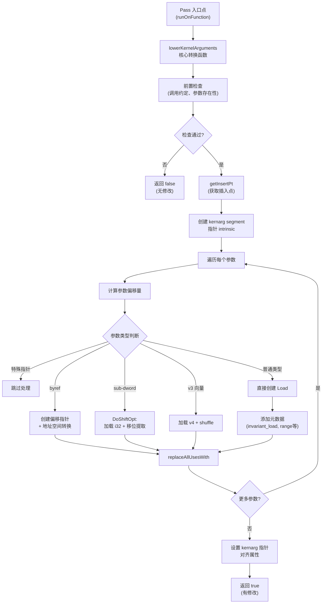

# AMDGPULowerKernelArguments.cpp 代码功能分析

## 1. Pass 主要功能概括

<a name="ref-block_0"></a>该 Pass 的核心功能是**将对内核参数的访问替换为从 kernarg 基指针的偏移量加载数据**。 llvm-project:9-10[<sup>↗</sup>](#block_0) 

**作用与效果：**
<a name="ref-block_3"></a>- 仅处理使用 AMDGPU_KERNEL 调用约定且有参数的函数 llvm-project:62-64[<sup>↗</sup>](#block_3) 
- 将函数参数的直接使用转换为显式的内存加载操作，从 kernarg segment 的特定偏移位置读取
- 保留所有参数属性信息（如 nonnull、dereferenceable、range 等），将其转换为 load 指令的元数据

## 2. 主要实现步骤和子功能提取

该文件包含以下关键组件：

1. **`getInsertPt`** - 确定代码插入点
2. **`lowerKernelArguments`** - 核心转换逻辑（主函数）
3. **`runOnFunction`** - Pass 框架入口点
4. **`AMDGPULowerKernelArgumentsPass::run`** - 新 Pass Manager 入口

## 3. 各步骤/子功能的具体描述分析

### 3.1 `getInsertPt` 函数

**功能：**确定加载指令的正确插入位置

**实现细节：**
<a name="ref-block_1"></a>- 从基本块的第一个插入点开始遍历 llvm-project:48-48[<sup>↗</sup>](#block_1) 
<a name="ref-block_2"></a>- 跳过所有静态 alloca 指令 llvm-project:50-55[<sup>↗</sup>](#block_2) 
- 在遇到动态 alloca 或非 alloca 指令时停止，因为动态 alloca 可能依赖于加载的内核参数

### 3.2 `lowerKernelArguments` 核心转换函数

这是主要的转换逻辑函数，包含多个子步骤：

#### 3.2.1 前置检查和初始化

<a name="ref-block_3"></a>- 检查函数是否为 AMDGPU_KERNEL 调用约定且有参数 llvm-project:62-64[<sup>↗</sup>](#block_3) 
<a name="ref-block_4"></a>- 获取目标子架构信息、数据布局和入口基本块 llvm-project:66-70[<sup>↗</sup>](#block_4) 
<a name="ref-block_5"></a>- 计算基础偏移和内核参数段总大小 llvm-project:72-79[<sup>↗</sup>](#block_5) 

#### 3.2.2 创建 kernarg segment 指针

<a name="ref-block_6"></a>- 使用 intrinsic 创建指向 kernarg segment 的指针 llvm-project:81-83[<sup>↗</sup>](#block_6) 
<a name="ref-block_7"></a>- 添加 NonNull 和 Dereferenceable 属性 llvm-project:84-86[<sup>↗</sup>](#block_7) 

#### 3.2.3 遍历参数并转换

对每个参数进行以下处理：

**a) 计算参数偏移量**
<a name="ref-block_8"></a>- 根据参数类型和对齐要求计算在 kernarg segment 中的偏移 llvm-project:89-99[<sup>↗</sup>](#block_8) 

**b) 跳过特定参数**
<a name="ref-block_9"></a>- 跳过未使用或带有 inreg 属性的参数 llvm-project:102-103[<sup>↗</sup>](#block_9) 

**c) 处理 ByRef 参数**
<a name="ref-block_10"></a>- 对于 byref 参数，创建指向 kernarg 偏移的指针并进行地址空间转换 llvm-project:107-116[<sup>↗</sup>](#block_10) 

**d) 处理特殊指针类型**
<a name="ref-block_11"></a>- 跳过某些 LOCAL_ADDRESS 或 REGION_ADDRESS 的指针（在没有可用 DS offset 的情况下） llvm-project:118-126[<sup>↗</sup>](#block_11) 
<a name="ref-block_12"></a>- 跳过带有 noalias 属性的指针参数 llvm-project:130-131[<sup>↗</sup>](#block_12) 

**e) DoShiftOpt 优化**
<a name="ref-block_13"></a>- 对于小于 32 位的非聚合类型，使用移位优化 llvm-project:136-136[<sup>↗</sup>](#block_13) 
<a name="ref-block_14"></a>- 从 4 字节对齐的地址加载 i32，然后提取相关位 llvm-project:147-158[<sup>↗</sup>](#block_14) 
- 执行右移和截断操作来获取实际值 llvm-project:220-228 

**f) v3 向量处理**
<a name="ref-block_15"></a>- 对于 3 元素向量，加载为 4 元素向量然后进行 shuffle llvm-project:166-170[<sup>↗</sup>](#block_15) 
- 使用 shuffle vector 提取前 3 个元素 llvm-project:229-232 

**g) 创建 Load 指令**
<a name="ref-block_16"></a>- 创建对齐的 load 指令 llvm-project:172-174[<sup>↗</sup>](#block_16) 
- 添加 invariant_load 元数据（因为内核参数在内核执行期间不变） llvm-project:174-174 

**h) 传递参数属性**
<a name="ref-block_17"></a>- 传递 noundef 属性 llvm-project:178-179[<sup>↗</sup>](#block_17) 
<a name="ref-block_18"></a>- 传递 range 元数据 llvm-project:181-186[<sup>↗</sup>](#block_18) 
<a name="ref-block_19"></a>- 对于指针类型，传递 nonnull、dereferenceable、dereferenceable_or_null 和 align 元数据 llvm-project:188-216[<sup>↗</sup>](#block_19) 

**i) 替换参数使用**
- 将原始参数的所有使用替换为新创建的 load 或转换后的值 llvm-project:228-236 

#### 3.2.4 设置最终对齐属性

<a name="ref-block_21"></a>- 为 kernarg segment 指针设置最终的对齐属性 llvm-project:239-240[<sup>↗</sup>](#block_21) 

### 3.3 `runOnFunction` - Pass 入口点

该函数是旧 Pass Manager 的入口：
<a name="ref-block_22"></a>- 获取 TargetMachine 信息 llvm-project:245-248[<sup>↗</sup>](#block_22) 
- 调用核心转换函数 `lowerKernelArguments`

### 3.4 新 Pass Manager 支持

<a name="ref-block_23"></a>新的 Pass Manager 入口 `AMDGPULowerKernelArgumentsPass::run` 直接调用核心转换函数，并根据是否有修改来保留分析结果 llvm-project:262-273[<sup>↗</sup>](#block_23) 

## 4. 步骤/子功能之间的关系

整体流程关系如下：



**关键关系说明：**

1. **串行依赖关系：**
   - `getInsertPt` 必须在创建任何新指令之前调用，确定正确的插入位置
   - kernarg segment 指针必须在处理任何参数之前创建
   - 参数偏移量的计算是顺序依赖的（每个参数的偏移基于前一个参数）

2. **分支决策关系：**
   - 根据参数类型（byref、指针、sub-dword、v3 向量等）选择不同的处理路径
   - 每种路径最终都通过 `replaceAllUsesWith` 完成参数替换

3. **优化策略关系：**
   - DoShiftOpt 和 v3 向量处理都是为了避免 SelectionDAG 阶段的性能问题
   - 元数据传递确保优化信息不会在转换过程中丢失

4. **数据流关系：**
   - kernarg segment 指针 → GEP 计算偏移 → Load 指令 → 可选的转换操作 → 替换原参数使用

## Notes

- 该 Pass 是 AMDGPU 后端特有的优化，利用了 AMD GPU 架构中内核参数存储在专用 kernarg segment 的特性
- 代码中包含多个硬件特定的优化（如 DoShiftOpt 针对缺少 sub-dword 标量加载的问题）
- Pass 设计为保守安全：对于某些特殊情况（如带 noalias 的指针、某些地址空间的指针），选择不进行转换以避免破坏优化假设
- 该 Pass 同时支持旧的和新的 LLVM Pass Manager 框架
### Citations
<a name="block_0"></a>**File:** llvm/lib/Target/AMDGPU/AMDGPULowerKernelArguments.cpp (L9-10) [<sup>↩</sup>](#ref-block_0)
```cpp
/// \file This pass replaces accesses to kernel arguments with loads from
/// offsets from the kernarg base pointer.
```
<a name="block_1"></a>**File:** llvm/lib/Target/AMDGPU/AMDGPULowerKernelArguments.cpp (L48-48) [<sup>↩</sup>](#ref-block_1)
```cpp
  BasicBlock::iterator InsPt = BB.getFirstInsertionPt();
```
<a name="block_2"></a>**File:** llvm/lib/Target/AMDGPU/AMDGPULowerKernelArguments.cpp (L50-55) [<sup>↩</sup>](#ref-block_2)
```cpp
    AllocaInst *AI = dyn_cast<AllocaInst>(&*InsPt);

    // If this is a dynamic alloca, the value may depend on the loaded kernargs,
    // so loads will need to be inserted before it.
    if (!AI || !AI->isStaticAlloca())
      break;
```
<a name="block_3"></a>**File:** llvm/lib/Target/AMDGPU/AMDGPULowerKernelArguments.cpp (L62-64) [<sup>↩</sup>](#ref-block_3) [<sup>↩</sup>](#ref-block_3)
```cpp
  CallingConv::ID CC = F.getCallingConv();
  if (CC != CallingConv::AMDGPU_KERNEL || F.arg_empty())
    return false;
```
<a name="block_4"></a>**File:** llvm/lib/Target/AMDGPU/AMDGPULowerKernelArguments.cpp (L66-70) [<sup>↩</sup>](#ref-block_4)
```cpp
  const GCNSubtarget &ST = TM.getSubtarget<GCNSubtarget>(F);
  LLVMContext &Ctx = F.getParent()->getContext();
  const DataLayout &DL = F.getDataLayout();
  BasicBlock &EntryBlock = *F.begin();
  IRBuilder<> Builder(&EntryBlock, getInsertPt(EntryBlock));
```
<a name="block_5"></a>**File:** llvm/lib/Target/AMDGPU/AMDGPULowerKernelArguments.cpp (L72-79) [<sup>↩</sup>](#ref-block_5)
```cpp
  const Align KernArgBaseAlign(16); // FIXME: Increase if necessary
  const uint64_t BaseOffset = ST.getExplicitKernelArgOffset();

  Align MaxAlign;
  // FIXME: Alignment is broken with explicit arg offset.;
  const uint64_t TotalKernArgSize = ST.getKernArgSegmentSize(F, MaxAlign);
  if (TotalKernArgSize == 0)
    return false;
```
<a name="block_6"></a>**File:** llvm/lib/Target/AMDGPU/AMDGPULowerKernelArguments.cpp (L81-83) [<sup>↩</sup>](#ref-block_6)
```cpp
  CallInst *KernArgSegment =
      Builder.CreateIntrinsic(Intrinsic::amdgcn_kernarg_segment_ptr, {},
                              nullptr, F.getName() + ".kernarg.segment");
```
<a name="block_7"></a>**File:** llvm/lib/Target/AMDGPU/AMDGPULowerKernelArguments.cpp (L84-86) [<sup>↩</sup>](#ref-block_7)
```cpp
  KernArgSegment->addRetAttr(Attribute::NonNull);
  KernArgSegment->addRetAttr(
      Attribute::getWithDereferenceableBytes(Ctx, TotalKernArgSize));
```
<a name="block_8"></a>**File:** llvm/lib/Target/AMDGPU/AMDGPULowerKernelArguments.cpp (L89-99) [<sup>↩</sup>](#ref-block_8)
```cpp
  for (Argument &Arg : F.args()) {
    const bool IsByRef = Arg.hasByRefAttr();
    Type *ArgTy = IsByRef ? Arg.getParamByRefType() : Arg.getType();
    MaybeAlign ParamAlign = IsByRef ? Arg.getParamAlign() : std::nullopt;
    Align ABITypeAlign = DL.getValueOrABITypeAlignment(ParamAlign, ArgTy);

    uint64_t Size = DL.getTypeSizeInBits(ArgTy);
    uint64_t AllocSize = DL.getTypeAllocSize(ArgTy);

    uint64_t EltOffset = alignTo(ExplicitArgOffset, ABITypeAlign) + BaseOffset;
    ExplicitArgOffset = alignTo(ExplicitArgOffset, ABITypeAlign) + AllocSize;
```
<a name="block_9"></a>**File:** llvm/lib/Target/AMDGPU/AMDGPULowerKernelArguments.cpp (L102-103) [<sup>↩</sup>](#ref-block_9)
```cpp
    if (Arg.use_empty() || Arg.hasInRegAttr())
      continue;
```
<a name="block_10"></a>**File:** llvm/lib/Target/AMDGPU/AMDGPULowerKernelArguments.cpp (L107-116) [<sup>↩</sup>](#ref-block_10)
```cpp
    if (IsByRef) {
      Value *ArgOffsetPtr = Builder.CreateConstInBoundsGEP1_64(
          Builder.getInt8Ty(), KernArgSegment, EltOffset,
          Arg.getName() + ".byval.kernarg.offset");

      Value *CastOffsetPtr =
          Builder.CreateAddrSpaceCast(ArgOffsetPtr, Arg.getType());
      Arg.replaceAllUsesWith(CastOffsetPtr);
      continue;
    }
```
<a name="block_11"></a>**File:** llvm/lib/Target/AMDGPU/AMDGPULowerKernelArguments.cpp (L118-126) [<sup>↩</sup>](#ref-block_11)
```cpp
    if (PointerType *PT = dyn_cast<PointerType>(ArgTy)) {
      // FIXME: Hack. We rely on AssertZext to be able to fold DS addressing
      // modes on SI to know the high bits are 0 so pointer adds don't wrap. We
      // can't represent this with range metadata because it's only allowed for
      // integer types.
      if ((PT->getAddressSpace() == AMDGPUAS::LOCAL_ADDRESS ||
           PT->getAddressSpace() == AMDGPUAS::REGION_ADDRESS) &&
          !ST.hasUsableDSOffset())
        continue;
```
<a name="block_12"></a>**File:** llvm/lib/Target/AMDGPU/AMDGPULowerKernelArguments.cpp (L130-131) [<sup>↩</sup>](#ref-block_12)
```cpp
      if (Arg.hasNoAliasAttr())
        continue;
```
<a name="block_13"></a>**File:** llvm/lib/Target/AMDGPU/AMDGPULowerKernelArguments.cpp (L136-136) [<sup>↩</sup>](#ref-block_13)
```cpp
    bool DoShiftOpt = Size < 32 && !ArgTy->isAggregateType();
```
<a name="block_14"></a>**File:** llvm/lib/Target/AMDGPU/AMDGPULowerKernelArguments.cpp (L147-158) [<sup>↩</sup>](#ref-block_14)
```cpp
    if (DoShiftOpt) { // FIXME: Handle aggregate types
      // Since we don't have sub-dword scalar loads, avoid doing an extload by
      // loading earlier than the argument address, and extracting the relevant
      // bits.
      // TODO: Update this for GFX12 which does have scalar sub-dword loads.
      //
      // Additionally widen any sub-dword load to i32 even if suitably aligned,
      // so that CSE between different argument loads works easily.
      ArgPtr = Builder.CreateConstInBoundsGEP1_64(
          Builder.getInt8Ty(), KernArgSegment, AlignDownOffset,
          Arg.getName() + ".kernarg.offset.align.down");
      AdjustedArgTy = Builder.getInt32Ty();
```
<a name="block_15"></a>**File:** llvm/lib/Target/AMDGPU/AMDGPULowerKernelArguments.cpp (L166-170) [<sup>↩</sup>](#ref-block_15)
```cpp
    if (IsV3 && Size >= 32) {
      V4Ty = FixedVectorType::get(VT->getElementType(), 4);
      // Use the hack that clang uses to avoid SelectionDAG ruining v3 loads
      AdjustedArgTy = V4Ty;
    }
```
<a name="block_16"></a>**File:** llvm/lib/Target/AMDGPU/AMDGPULowerKernelArguments.cpp (L172-174) [<sup>↩</sup>](#ref-block_16)
```cpp
    LoadInst *Load =
        Builder.CreateAlignedLoad(AdjustedArgTy, ArgPtr, AdjustedAlign);
    Load->setMetadata(LLVMContext::MD_invariant_load, MDNode::get(Ctx, {}));
```
<a name="block_17"></a>**File:** llvm/lib/Target/AMDGPU/AMDGPULowerKernelArguments.cpp (L178-179) [<sup>↩</sup>](#ref-block_17)
```cpp
    if (Arg.hasAttribute(Attribute::NoUndef))
      Load->setMetadata(LLVMContext::MD_noundef, MDNode::get(Ctx, {}));
```
<a name="block_18"></a>**File:** llvm/lib/Target/AMDGPU/AMDGPULowerKernelArguments.cpp (L181-186) [<sup>↩</sup>](#ref-block_18)
```cpp
    if (Arg.hasAttribute(Attribute::Range)) {
      const ConstantRange &Range =
          Arg.getAttribute(Attribute::Range).getValueAsConstantRange();
      Load->setMetadata(LLVMContext::MD_range,
                        MDB.createRange(Range.getLower(), Range.getUpper()));
    }
```
<a name="block_19"></a>**File:** llvm/lib/Target/AMDGPU/AMDGPULowerKernelArguments.cpp (L188-216) [<sup>↩</sup>](#ref-block_19)
```cpp
    if (isa<PointerType>(ArgTy)) {
      if (Arg.hasNonNullAttr())
        Load->setMetadata(LLVMContext::MD_nonnull, MDNode::get(Ctx, {}));

      uint64_t DerefBytes = Arg.getDereferenceableBytes();
      if (DerefBytes != 0) {
        Load->setMetadata(
          LLVMContext::MD_dereferenceable,
          MDNode::get(Ctx,
                      MDB.createConstant(
                        ConstantInt::get(Builder.getInt64Ty(), DerefBytes))));
      }

      uint64_t DerefOrNullBytes = Arg.getDereferenceableOrNullBytes();
      if (DerefOrNullBytes != 0) {
        Load->setMetadata(
          LLVMContext::MD_dereferenceable_or_null,
          MDNode::get(Ctx,
                      MDB.createConstant(ConstantInt::get(Builder.getInt64Ty(),
                                                          DerefOrNullBytes))));
      }

      if (MaybeAlign ParamAlign = Arg.getParamAlign()) {
        Load->setMetadata(
            LLVMContext::MD_align,
            MDNode::get(Ctx, MDB.createConstant(ConstantInt::get(
                                 Builder.getInt64Ty(), ParamAlign->value()))));
      }
    }
```
<a name="block_20"></a>**File:** llvm/lib/Target/AMDGPU/AMDGPULowerKernelArguments.cpp (L220-236)
```cpp
    if (DoShiftOpt) {
      Value *ExtractBits = OffsetDiff == 0 ?
        Load : Builder.CreateLShr(Load, OffsetDiff * 8);

      IntegerType *ArgIntTy = Builder.getIntNTy(Size);
      Value *Trunc = Builder.CreateTrunc(ExtractBits, ArgIntTy);
      Value *NewVal = Builder.CreateBitCast(Trunc, ArgTy,
                                            Arg.getName() + ".load");
      Arg.replaceAllUsesWith(NewVal);
    } else if (IsV3) {
      Value *Shuf = Builder.CreateShuffleVector(Load, ArrayRef<int>{0, 1, 2},
                                                Arg.getName() + ".load");
      Arg.replaceAllUsesWith(Shuf);
    } else {
      Load->setName(Arg.getName() + ".load");
      Arg.replaceAllUsesWith(Load);
    }
```
<a name="block_21"></a>**File:** llvm/lib/Target/AMDGPU/AMDGPULowerKernelArguments.cpp (L239-240) [<sup>↩</sup>](#ref-block_21)
```cpp
  KernArgSegment->addRetAttr(
      Attribute::getWithAlignment(Ctx, std::max(KernArgBaseAlign, MaxAlign)));
```
<a name="block_22"></a>**File:** llvm/lib/Target/AMDGPU/AMDGPULowerKernelArguments.cpp (L245-248) [<sup>↩</sup>](#ref-block_22)
```cpp
bool AMDGPULowerKernelArguments::runOnFunction(Function &F) {
  auto &TPC = getAnalysis<TargetPassConfig>();
  const TargetMachine &TM = TPC.getTM<TargetMachine>();
  return lowerKernelArguments(F, TM);
```
<a name="block_23"></a>**File:** llvm/lib/Target/AMDGPU/AMDGPULowerKernelArguments.cpp (L262-273) [<sup>↩</sup>](#ref-block_23)
```cpp
PreservedAnalyses
AMDGPULowerKernelArgumentsPass::run(Function &F, FunctionAnalysisManager &AM) {
  bool Changed = lowerKernelArguments(F, TM);
  if (Changed) {
    // TODO: Preserves a lot more.
    PreservedAnalyses PA;
    PA.preserveSet<CFGAnalyses>();
    return PA;
  }

  return PreservedAnalyses::all();
}
```