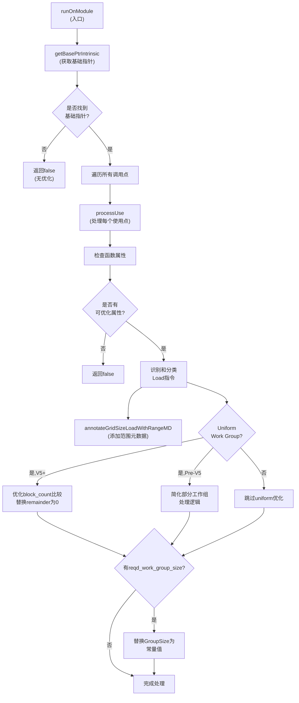

# AMDGPULowerKernelAttributes.cpp 代码功能解析

## 1. Pass 主要功能概述

该Pass的核心目标是**利用kernel的属性元数据来优化GPU kernel的执行效率**。具体来说，它通过使用`reqd_work_group_size`元数据和`uniform-work-group-size`属性来：

- **消除不必要的内存加载**：避免从dispatch packet或implicit argument pointer加载工作组大小信息
- **常量折叠优化**：将OpenCL的`get_local_size`等运行时查询函数替换为编译时常量
<a name="ref-block_0"></a>- **简化条件判断**：利用uniform work group size属性简化部分工作组处理的条件逻辑 llvm-project:9-12[<sup>↗</sup>](#block_0) 

**优化效果**：减少运行时内存访问、提高指令级并行性、启用更多后续优化机会。

## 2. 主要功能步骤提取

该Pass的实现包含以下核心步骤/子功能：

1. **版本检测与基础指针获取** (`getBasePtrIntrinsic`)
2. **Grid Size范围标注** (`annotateGridSizeLoadWithRangeMD`)
3. **使用点处理** (`processUse`)
4. **模块级遍历** (`runOnModule`)

## 3. 各步骤详细分析

<a name="ref-block_2"></a>### 3.1 版本检测与基础指针获取 llvm-project:78-82[<sup>↗</sup>](#block_2) 

**功能**：根据AMDHSA代码对象版本（V5或更高版本 vs 早期版本）选择合适的内建函数：
- **V5及以上**：使用`amdgcn_implicitarg_ptr`（隐式参数指针）
- **V5以下**：使用`amdgcn_dispatch_ptr`（调度包指针）

**原因**：不同版本的ABI使用不同的机制传递kernel参数。

<a name="ref-block_3"></a>### 3.2 Grid Size范围标注 llvm-project:86-98[<sup>↗</sup>](#block_3) 

**功能**：为加载grid size的指令添加范围元数据，标注其有效值范围为`[1, MaxNumGroups + 1)`。

**条件**：
- `MaxNumGroups`有效且不为最大值
- 加载的类型为32位整数

**作用**：帮助后续优化Pass（如范围分析、值传播）进行更精确的优化。

<a name="ref-block_4"></a>### 3.3 使用点处理（核心优化逻辑） llvm-project:100-101[<sup>↗</sup>](#block_4) 

这是最复杂的核心函数，包含多个子步骤：

<a name="ref-block_5"></a>#### 3.3.1 属性检查与前置条件验证 llvm-project:103-115[<sup>↗</sup>](#block_5) 

检查函数是否具有以下属性之一：
- `reqd_work_group_size`元数据：指定固定的工作组大小
- `uniform-work-group-size`属性：保证所有工作组大小一致
- `amdgpu-max-num-workgroups`属性：限制最大工作组数量

如果都不存在，则无法进行优化。

<a name="ref-block_6"></a>#### 3.3.2 Load指令识别与分类 llvm-project:117-229[<sup>↗</sup>](#block_6) 

**处理流程**：
1. 遍历基础指针的所有用户
2. 识别通过GEP（GetElementPtr）+ BitCast + Load的访问模式
3. 根据偏移量和加载大小，将Load指令分类为：
   - **V5+**：BlockCounts（工作组计数）、GroupSizes（工作组大小）、Remainders（余数）
   - **Pre-V5**：GroupSizes、GridSizes（网格大小）

<a name="ref-block_1"></a>**偏移量定义**： llvm-project:36-59[<sup>↗</sup>](#block_1) 

<a name="ref-block_7"></a>#### 3.3.3 Uniform Work Group Size优化（V5+） llvm-project:232-266[<sup>↗</sup>](#block_7) 

**针对代码模式**：
```
workgroup_id < hidden_block_count ? hidden_group_size : hidden_remainder
```

**优化策略**：
1. 对于`uniform-work-group-size`，`workgroup_id < hidden_block_count`总是true
2. 因此将该比较替换为常量`true`
3. 将所有`remainder`值替换为0（因为uniform意味着没有部分工作组）

**模式匹配**：使用PatternMatch库识别`workgroup_id < block_count`的ICmp指令。

<a name="ref-block_8"></a>#### 3.3.4 Uniform Work Group Size优化（Pre-V5） llvm-project:267-323[<sup>↗</sup>](#block_8) 

**针对代码模式**：
```c
uint r = grid_size - group_id * group_size;
get_local_size = (r < group_size) ? r : group_size;
```

**数学推导**：
- 在`uniform-work-group-size`下，grid_size是group_size的倍数
- 因此 `grid_size - (group_id * group_size) < group_size` 为假（除了group_id == 0的情况）
- 可以将整个表达式简化为`group_size`（如果有`reqd_work_group_size`则为常量）

**模式匹配**：识别`umin(sub(grid_size, mul(group_id, group_size)), group_size)`模式。

<a name="ref-block_9"></a>#### 3.3.5 固定工作组大小替换 llvm-project:325-340[<sup>↗</sup>](#block_9) 

**最终优化**：如果存在`reqd_work_group_size`元数据，直接将所有GroupSize的加载替换为元数据中指定的常量值。

这是最直接和最有效的优化，完全消除了运行时加载。

<a name="ref-block_10"></a>### 3.4 模块级遍历 llvm-project:346-365[<sup>↗</sup>](#block_10) 

**流程**：
1. 确定代码对象版本
2. 获取对应的基础指针内建函数
3. 遍历该内建函数的所有调用点
4. 对每个调用应用`processUse`优化
5. 使用`HandledUses`集合避免重复处理

## 4. 步骤间关系



**关系说明**：

1. **层次关系**：`runOnModule` → `processUse` → 具体优化子步骤
2. **版本依赖**：`getBasePtrIntrinsic`的选择影响后续所有处理逻辑
3. **条件分支**：优化策略根据V5版本、uniform属性、reqd_work_group_size的组合选择不同路径
4. **数据流**：Load指令识别 → 模式匹配 → 替换优化，形成流水线处理
5. **互补性**：范围标注、uniform优化、常量替换三种优化可以同时生效，互相增强效果

## Notes

- 该Pass属于**target-specific优化**，专门针对AMDGPU架构
- 优化效果高度依赖于**源代码中的属性标注**（如OpenCL的`reqd_work_group_size`）
- **V5版本的变化**反映了AMDHSA ABI的演进，需要同时支持新旧版本
<a name="ref-block_11"></a>- 该Pass是一个**ModulePass**，但也提供了Function级别的实现（`AMDGPULowerKernelAttributesPass::run`） llvm-project:379-396[<sup>↗</sup>](#block_11) 
- 优化是**保守的**：只有在能够确定安全的情况下才进行替换，保证程序语义不变
### Citations
<a name="block_0"></a>**File:** llvm/lib/Target/AMDGPU/AMDGPULowerKernelAttributes.cpp (L9-12) [<sup>↩</sup>](#ref-block_0)
```cpp
/// \file This pass does attempts to make use of reqd_work_group_size metadata
/// to eliminate loads from the dispatch packet and to constant fold OpenCL
/// get_local_size-like functions.
//
```
<a name="block_1"></a>**File:** llvm/lib/Target/AMDGPU/AMDGPULowerKernelAttributes.cpp (L36-59) [<sup>↩</sup>](#ref-block_1)
```cpp
enum DispatchPackedOffsets {
  WORKGROUP_SIZE_X = 4,
  WORKGROUP_SIZE_Y = 6,
  WORKGROUP_SIZE_Z = 8,

  GRID_SIZE_X = 12,
  GRID_SIZE_Y = 16,
  GRID_SIZE_Z = 20
};

// Field offsets to implicit kernel argument pointer.
enum ImplicitArgOffsets {
  HIDDEN_BLOCK_COUNT_X = 0,
  HIDDEN_BLOCK_COUNT_Y = 4,
  HIDDEN_BLOCK_COUNT_Z = 8,

  HIDDEN_GROUP_SIZE_X = 12,
  HIDDEN_GROUP_SIZE_Y = 14,
  HIDDEN_GROUP_SIZE_Z = 16,

  HIDDEN_REMAINDER_X = 18,
  HIDDEN_REMAINDER_Y = 20,
  HIDDEN_REMAINDER_Z = 22,
};
```
<a name="block_2"></a>**File:** llvm/lib/Target/AMDGPU/AMDGPULowerKernelAttributes.cpp (L78-82) [<sup>↩</sup>](#ref-block_2)
```cpp
Function *getBasePtrIntrinsic(Module &M, bool IsV5OrAbove) {
  auto IntrinsicId = IsV5OrAbove ? Intrinsic::amdgcn_implicitarg_ptr
                                 : Intrinsic::amdgcn_dispatch_ptr;
  return Intrinsic::getDeclarationIfExists(&M, IntrinsicId);
}
```
<a name="block_3"></a>**File:** llvm/lib/Target/AMDGPU/AMDGPULowerKernelAttributes.cpp (L86-98) [<sup>↩</sup>](#ref-block_3)
```cpp
static void annotateGridSizeLoadWithRangeMD(LoadInst *Load,
                                            uint32_t MaxNumGroups) {
  if (MaxNumGroups == 0 || MaxNumGroups == std::numeric_limits<uint32_t>::max())
    return;

  if (!Load->getType()->isIntegerTy(32))
    return;

  // TODO: If there is existing range metadata, preserve it if it is stricter.
  MDBuilder MDB(Load->getContext());
  MDNode *Range = MDB.createRange(APInt(32, 1), APInt(32, MaxNumGroups + 1));
  Load->setMetadata(LLVMContext::MD_range, Range);
}
```
<a name="block_4"></a>**File:** llvm/lib/Target/AMDGPU/AMDGPULowerKernelAttributes.cpp (L100-101) [<sup>↩</sup>](#ref-block_4)
```cpp
static bool processUse(CallInst *CI, bool IsV5OrAbove) {
  Function *F = CI->getParent()->getParent();
```
<a name="block_5"></a>**File:** llvm/lib/Target/AMDGPU/AMDGPULowerKernelAttributes.cpp (L103-115) [<sup>↩</sup>](#ref-block_5)
```cpp
  auto *MD = F->getMetadata("reqd_work_group_size");
  const bool HasReqdWorkGroupSize = MD && MD->getNumOperands() == 3;

  const bool HasUniformWorkGroupSize =
    F->getFnAttribute("uniform-work-group-size").getValueAsBool();

  SmallVector<unsigned> MaxNumWorkgroups =
      AMDGPU::getIntegerVecAttribute(*F, "amdgpu-max-num-workgroups",
                                     /*Size=*/3, /*DefaultVal=*/0);

  if (!HasReqdWorkGroupSize && !HasUniformWorkGroupSize &&
      none_of(MaxNumWorkgroups, [](unsigned X) { return X != 0; }))
    return false;
```
<a name="block_6"></a>**File:** llvm/lib/Target/AMDGPU/AMDGPULowerKernelAttributes.cpp (L117-229) [<sup>↩</sup>](#ref-block_6)
```cpp
  Value *BlockCounts[3] = {nullptr, nullptr, nullptr};
  Value *GroupSizes[3]  = {nullptr, nullptr, nullptr};
  Value *Remainders[3]  = {nullptr, nullptr, nullptr};
  Value *GridSizes[3]   = {nullptr, nullptr, nullptr};

  const DataLayout &DL = F->getDataLayout();

  // We expect to see several GEP users, casted to the appropriate type and
  // loaded.
  for (User *U : CI->users()) {
    if (!U->hasOneUse())
      continue;

    int64_t Offset = 0;
    auto *Load = dyn_cast<LoadInst>(U); // Load from ImplicitArgPtr/DispatchPtr?
    auto *BCI = dyn_cast<BitCastInst>(U);
    if (!Load && !BCI) {
      if (GetPointerBaseWithConstantOffset(U, Offset, DL) != CI)
        continue;
      Load = dyn_cast<LoadInst>(*U->user_begin()); // Load from GEP?
      BCI = dyn_cast<BitCastInst>(*U->user_begin());
    }

    if (BCI) {
      if (!BCI->hasOneUse())
        continue;
      Load = dyn_cast<LoadInst>(*BCI->user_begin()); // Load from BCI?
    }

    if (!Load || !Load->isSimple())
      continue;

    unsigned LoadSize = DL.getTypeStoreSize(Load->getType());

    // TODO: Handle merged loads.
    if (IsV5OrAbove) { // Base is ImplicitArgPtr.
      switch (Offset) {
      case HIDDEN_BLOCK_COUNT_X:
        if (LoadSize == 4) {
          BlockCounts[0] = Load;
          annotateGridSizeLoadWithRangeMD(Load, MaxNumWorkgroups[0]);
        }
        break;
      case HIDDEN_BLOCK_COUNT_Y:
        if (LoadSize == 4) {
          BlockCounts[1] = Load;
          annotateGridSizeLoadWithRangeMD(Load, MaxNumWorkgroups[1]);
        }
        break;
      case HIDDEN_BLOCK_COUNT_Z:
        if (LoadSize == 4) {
          BlockCounts[2] = Load;
          annotateGridSizeLoadWithRangeMD(Load, MaxNumWorkgroups[2]);
        }
        break;
      case HIDDEN_GROUP_SIZE_X:
        if (LoadSize == 2)
          GroupSizes[0] = Load;
        break;
      case HIDDEN_GROUP_SIZE_Y:
        if (LoadSize == 2)
          GroupSizes[1] = Load;
        break;
      case HIDDEN_GROUP_SIZE_Z:
        if (LoadSize == 2)
          GroupSizes[2] = Load;
        break;
      case HIDDEN_REMAINDER_X:
        if (LoadSize == 2)
          Remainders[0] = Load;
        break;
      case HIDDEN_REMAINDER_Y:
        if (LoadSize == 2)
          Remainders[1] = Load;
        break;
      case HIDDEN_REMAINDER_Z:
        if (LoadSize == 2)
          Remainders[2] = Load;
        break;
      default:
        break;
      }
    } else { // Base is DispatchPtr.
      switch (Offset) {
      case WORKGROUP_SIZE_X:
        if (LoadSize == 2)
          GroupSizes[0] = Load;
        break;
      case WORKGROUP_SIZE_Y:
        if (LoadSize == 2)
          GroupSizes[1] = Load;
        break;
      case WORKGROUP_SIZE_Z:
        if (LoadSize == 2)
          GroupSizes[2] = Load;
        break;
      case GRID_SIZE_X:
        if (LoadSize == 4)
          GridSizes[0] = Load;
        break;
      case GRID_SIZE_Y:
        if (LoadSize == 4)
          GridSizes[1] = Load;
        break;
      case GRID_SIZE_Z:
        if (LoadSize == 4)
          GridSizes[2] = Load;
        break;
      default:
        break;
      }
    }
  }
```
<a name="block_7"></a>**File:** llvm/lib/Target/AMDGPU/AMDGPULowerKernelAttributes.cpp (L232-266) [<sup>↩</sup>](#ref-block_7)
```cpp
  if (IsV5OrAbove && HasUniformWorkGroupSize) {
    // Under v5  __ockl_get_local_size returns the value computed by the expression:
    //
    //   workgroup_id < hidden_block_count ? hidden_group_size : hidden_remainder
    //
    // For functions with the attribute uniform-work-group-size=true. we can evaluate
    // workgroup_id < hidden_block_count as true, and thus hidden_group_size is returned
    // for __ockl_get_local_size.
    for (int I = 0; I < 3; ++I) {
      Value *BlockCount = BlockCounts[I];
      if (!BlockCount)
        continue;

      using namespace llvm::PatternMatch;
      auto GroupIDIntrin =
          I == 0 ? m_Intrinsic<Intrinsic::amdgcn_workgroup_id_x>()
                 : (I == 1 ? m_Intrinsic<Intrinsic::amdgcn_workgroup_id_y>()
                           : m_Intrinsic<Intrinsic::amdgcn_workgroup_id_z>());

      for (User *ICmp : BlockCount->users()) {
        if (match(ICmp, m_SpecificICmp(ICmpInst::ICMP_ULT, GroupIDIntrin,
                                       m_Specific(BlockCount)))) {
          ICmp->replaceAllUsesWith(llvm::ConstantInt::getTrue(ICmp->getType()));
          MadeChange = true;
        }
      }
    }

    // All remainders should be 0 with uniform work group size.
    for (Value *Remainder : Remainders) {
      if (!Remainder)
        continue;
      Remainder->replaceAllUsesWith(Constant::getNullValue(Remainder->getType()));
      MadeChange = true;
    }
```
<a name="block_8"></a>**File:** llvm/lib/Target/AMDGPU/AMDGPULowerKernelAttributes.cpp (L267-323) [<sup>↩</sup>](#ref-block_8)
```cpp
  } else if (HasUniformWorkGroupSize) { // Pre-V5.
    // Pattern match the code used to handle partial workgroup dispatches in the
    // library implementation of get_local_size, so the entire function can be
    // constant folded with a known group size.
    //
    // uint r = grid_size - group_id * group_size;
    // get_local_size = (r < group_size) ? r : group_size;
    //
    // If we have uniform-work-group-size (which is the default in OpenCL 1.2),
    // the grid_size is required to be a multiple of group_size). In this case:
    //
    // grid_size - (group_id * group_size) < group_size
    // ->
    // grid_size < group_size + (group_id * group_size)
    //
    // (grid_size / group_size) < 1 + group_id
    //
    // grid_size / group_size is at least 1, so we can conclude the select
    // condition is false (except for group_id == 0, where the select result is
    // the same).
    for (int I = 0; I < 3; ++I) {
      Value *GroupSize = GroupSizes[I];
      Value *GridSize = GridSizes[I];
      if (!GroupSize || !GridSize)
        continue;

      using namespace llvm::PatternMatch;
      auto GroupIDIntrin =
          I == 0 ? m_Intrinsic<Intrinsic::amdgcn_workgroup_id_x>()
                 : (I == 1 ? m_Intrinsic<Intrinsic::amdgcn_workgroup_id_y>()
                           : m_Intrinsic<Intrinsic::amdgcn_workgroup_id_z>());

      for (User *U : GroupSize->users()) {
        auto *ZextGroupSize = dyn_cast<ZExtInst>(U);
        if (!ZextGroupSize)
          continue;

        for (User *UMin : ZextGroupSize->users()) {
          if (match(UMin,
                    m_UMin(m_Sub(m_Specific(GridSize),
                                 m_Mul(GroupIDIntrin, m_Specific(ZextGroupSize))),
                           m_Specific(ZextGroupSize)))) {
            if (HasReqdWorkGroupSize) {
              ConstantInt *KnownSize
                = mdconst::extract<ConstantInt>(MD->getOperand(I));
              UMin->replaceAllUsesWith(ConstantFoldIntegerCast(
                  KnownSize, UMin->getType(), false, DL));
            } else {
              UMin->replaceAllUsesWith(ZextGroupSize);
            }

            MadeChange = true;
          }
        }
      }
    }
  }
```
<a name="block_9"></a>**File:** llvm/lib/Target/AMDGPU/AMDGPULowerKernelAttributes.cpp (L325-340) [<sup>↩</sup>](#ref-block_9)
```cpp
  // If reqd_work_group_size is set, we can replace work group size with it.
  if (!HasReqdWorkGroupSize)
    return MadeChange;

  for (int I = 0; I < 3; I++) {
    Value *GroupSize = GroupSizes[I];
    if (!GroupSize)
      continue;

    ConstantInt *KnownSize = mdconst::extract<ConstantInt>(MD->getOperand(I));
    GroupSize->replaceAllUsesWith(
        ConstantFoldIntegerCast(KnownSize, GroupSize->getType(), false, DL));
    MadeChange = true;
  }

  return MadeChange;
```
<a name="block_10"></a>**File:** llvm/lib/Target/AMDGPU/AMDGPULowerKernelAttributes.cpp (L346-365) [<sup>↩</sup>](#ref-block_10)
```cpp
bool AMDGPULowerKernelAttributes::runOnModule(Module &M) {
  bool MadeChange = false;
  bool IsV5OrAbove =
      AMDGPU::getAMDHSACodeObjectVersion(M) >= AMDGPU::AMDHSA_COV5;
  Function *BasePtr = getBasePtrIntrinsic(M, IsV5OrAbove);

  if (!BasePtr) // ImplicitArgPtr/DispatchPtr not used.
    return false;

  SmallPtrSet<Instruction *, 4> HandledUses;
  for (auto *U : BasePtr->users()) {
    CallInst *CI = cast<CallInst>(U);
    if (HandledUses.insert(CI).second) {
      if (processUse(CI, IsV5OrAbove))
        MadeChange = true;
    }
  }

  return MadeChange;
}
```
<a name="block_11"></a>**File:** llvm/lib/Target/AMDGPU/AMDGPULowerKernelAttributes.cpp (L379-396) [<sup>↩</sup>](#ref-block_11)
```cpp
PreservedAnalyses
AMDGPULowerKernelAttributesPass::run(Function &F, FunctionAnalysisManager &AM) {
  bool IsV5OrAbove =
      AMDGPU::getAMDHSACodeObjectVersion(*F.getParent()) >= AMDGPU::AMDHSA_COV5;
  Function *BasePtr = getBasePtrIntrinsic(*F.getParent(), IsV5OrAbove);

  if (!BasePtr) // ImplicitArgPtr/DispatchPtr not used.
    return PreservedAnalyses::all();

  for (Instruction &I : instructions(F)) {
    if (CallInst *CI = dyn_cast<CallInst>(&I)) {
      if (CI->getCalledFunction() == BasePtr)
        processUse(CI, IsV5OrAbove);
    }
  }

  return PreservedAnalyses::all();
}
```