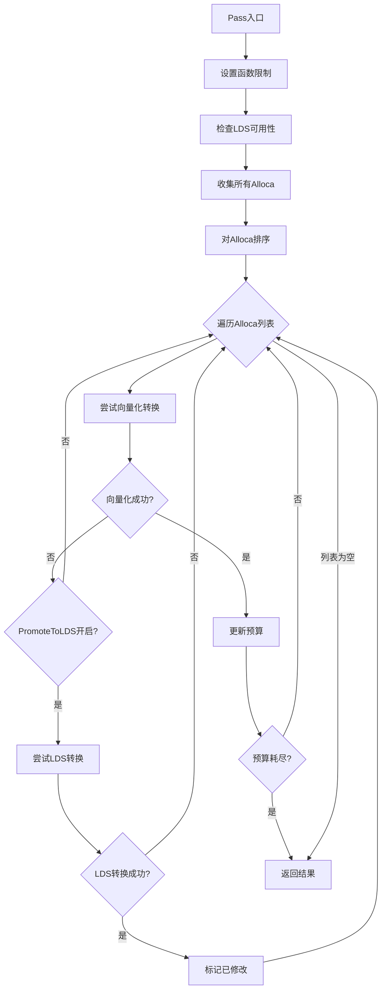
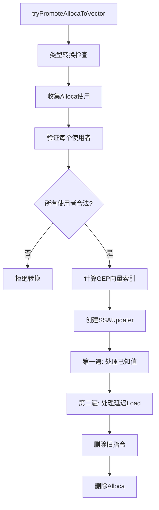
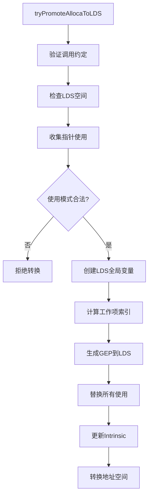

# AMDGPUPromoteAlloca.cpp 中两个Pass的功能分析

## 1. 两个Pass的主要功能概括

该文件实现了两个优化Pass，它们的核心目标都是消除栈上的alloca分配：

<a name="ref-block_0"></a>### Pass 1: AMDGPUPromoteAllocaToVectorPass（仅向量化） llvm-project:13-16[<sup>↗</sup>](#block_0) 

**作用**：在编译早期运行，仅将alloca转换为向量寄存器（VGPR）。

**效果**：几乎总是能提升性能，除非alloca过大导致寄存器压力过高。

<a name="ref-block_1"></a>### Pass 2: AMDGPUPromoteAllocaPass（向量化+LDS） llvm-project:17-21[<sup>↗</sup>](#block_1) 

**作用**：在编译后期运行（SROA之后），既可以转换为向量寄存器，也可以转换为LDS（Local Data Share，本地数据共享内存）。

**效果**：当无法向量化且唯一替代方案是栈降级时，才会将alloca提升到LDS。

## 2. 主要功能步骤和子功能提取

<a name="ref-block_2"></a>### 核心实现类 llvm-project:88-141[<sup>↗</sup>](#block_2) 

### 主要步骤：

<a name="ref-block_6"></a>#### 步骤1: Pass入口和配置 llvm-project:301-317[<sup>↗</sup>](#block_6) 

<a name="ref-block_7"></a>#### 步骤2: Alloca收集和排序 llvm-project:318-329[<sup>↗</sup>](#block_7) 

<a name="ref-block_8"></a>#### 步骤3: 向量化尝试 llvm-project:340-350[<sup>↗</sup>](#block_8) 

#### 步骤4: LDS提升尝试（仅第二个Pass） llvm-project:349-350 

## 3. 各步骤和子功能的详细分析

<a name="ref-block_5"></a>### 3.1 Alloca优先级排序（sortAllocasToPromote） llvm-project:253-286[<sup>↗</sup>](#block_5) 

**功能**：根据使用情况对alloca进行评分和排序。评分规则：
- 每个用户+1分
- 循环内的用户额外加权（默认权重为4）
- 按分数降序排列，优先处理高分alloca

<a name="ref-block_12"></a>### 3.2 向量化转换（tryPromoteAllocaToVector） llvm-project:786-792[<sup>↗</sup>](#block_12) 

**主要子步骤**：

<a name="ref-block_13"></a>#### 3.2.1 类型转换验证 llvm-project:794-830[<sup>↗</sup>](#block_13) 

将数组类型转换为向量类型，处理嵌套数组和内部向量类型。

<a name="ref-block_14"></a>#### 3.2.2 使用分析和验证 llvm-project:857-989[<sup>↗</sup>](#block_14) 

检查所有alloca用户，验证：
- Load/Store操作必须是简单的
- GEP必须可计算向量索引
- 支持memset/memcpy/memmove
- 拒绝volatile操作、聚合类型访问等

<a name="ref-block_9"></a>#### 3.2.3 GEP到向量索引转换 llvm-project:396-474[<sup>↗</sup>](#block_9) 

将GetElementPtr指令转换为向量索引，合并嵌套GEP的常量和变量偏移量。

<a name="ref-block_10"></a>#### 3.2.4 用户指令提升 llvm-project:491-707[<sup>↗</sup>](#block_10) 

使用SSAUpdater将每个Load/Store/MemTransfer操作转换为向量操作：
- Load → ExtractElement
- Store → InsertElement  
- Memset → VectorSplat
- Memcpy/Memmove → ShuffleVector

<a name="ref-block_15"></a>#### 3.2.5 两阶段处理 llvm-project:1022-1046[<sup>↗</sup>](#block_15) 

第一阶段处理已知值的指令，第二阶段处理需要PHI节点的延迟Load。

<a name="ref-block_18"></a>### 3.3 LDS转换（tryPromoteAllocaToLDS） llvm-project:1471-1478[<sup>↗</sup>](#block_18) 

**主要子步骤**：

<a name="ref-block_19"></a>#### 3.3.1 前置条件检查 llvm-project:1483-1525[<sup>↗</sup>](#block_19) 

验证调用约定、LDS可用性和空间限制。

<a name="ref-block_16"></a>#### 3.3.2 使用模式验证 llvm-project:1241-1341[<sup>↗</sup>](#block_16) 

递归收集和验证所有指针类型的使用，确保可以安全地从私有地址空间迁移到本地地址空间。

<a name="ref-block_20"></a>#### 3.3.3 全局变量创建 llvm-project:1540-1546[<sup>↗</sup>](#block_20) 

在LDS地址空间创建全局数组，大小为`WorkGroupSize × AllocaType`。

<a name="ref-block_21"></a>#### 3.3.4 工作项索引计算 llvm-project:1548-1564[<sup>↗</sup>](#block_21) 

计算3D工作项ID，生成线性索引：`TID = (TIdX * TCntY * TCntZ) + (TIdY * TCntZ) + TIdZ`

<a name="ref-block_22"></a>#### 3.3.5 地址空间转换 llvm-project:1573-1696[<sup>↗</sup>](#block_22) 

更新所有用户的指针类型，从私有地址空间转换到本地地址空间，处理特殊的intrinsic。

### 3.4 辅助功能

<a name="ref-block_17"></a>#### LDS可用性检查（hasSufficientLocalMem） llvm-project:1343-1368[<sup>↗</sup>](#block_17) 

分析函数使用的LDS全局变量，计算剩余可用空间。

<a name="ref-block_11"></a>#### 访问类型支持性检查 llvm-project:709-735[<sup>↗</sup>](#block_11) 

验证Load/Store的访问类型是否可以安全地转换为向量操作。

## 4. 步骤和子功能之间的关系

### 整体流程关系图



### 向量化内部关系



### LDS转换内部关系



### 两个Pass的关系

<a name="ref-block_4"></a>**调用时机差异**： llvm-project:224-226[<sup>↗</sup>](#block_4) llvm-project:211-214 

**共享实现**：两个Pass都调用同一个实现类`AMDGPUPromoteAllocaImpl::run()`，通过`PromoteToLDS`布尔参数区分行为。

**互补作用**：
- 第一个Pass（仅向量化）：激进地在早期优化，利用寄存器消除alloca
- 第二个Pass（向量化+LDS）：在SROA之后作为最后手段，当无法消除alloca时提升到LDS而非栈

## Notes

这两个Pass体现了AMDGPU架构的内存层次优化策略：
1. **优先级**：寄存器（向量） > LDS（本地内存） > 栈（全局内存）
2. **资源限制**：考虑VGPR预算和LDS空间限制，避免寄存器溢出
3. **渐进式优化**：第一个Pass处理简单情况，第二个Pass处理复杂情况
4. **上下文感知**：根据循环深度、工作组大小等因素做出优化决策

两个Pass的设计确保了在不同编译阶段都能找到最佳的alloca转换策略，最大化GPU性能。
### Citations
<a name="block_0"></a>**File:** llvm/lib/Target/AMDGPU/AMDGPUPromoteAlloca.cpp (L13-16) [<sup>↩</sup>](#ref-block_0)
```cpp
//    - "promote-alloca-to-vector", which runs early in the pipeline and only
//      promotes to vector. Promotion to vector is almost always profitable
//      except when the alloca is too big and the promotion would result in
//      very high register pressure.
```
<a name="block_1"></a>**File:** llvm/lib/Target/AMDGPU/AMDGPUPromoteAlloca.cpp (L17-21) [<sup>↩</sup>](#ref-block_1)
```cpp
//    - "promote-alloca", which does both promotion to vector and LDS and runs
//      much later in the pipeline. This runs after SROA because promoting to
//      LDS is of course less profitable than getting rid of the alloca or
//      vectorizing it, thus we only want to do it when the only alternative is
//      lowering the alloca to stack.
```
<a name="block_2"></a>**File:** llvm/lib/Target/AMDGPU/AMDGPUPromoteAlloca.cpp (L88-141) [<sup>↩</sup>](#ref-block_2)
```cpp
// Shared implementation which can do both promotion to vector and to LDS.
class AMDGPUPromoteAllocaImpl {
private:
  const TargetMachine &TM;
  LoopInfo &LI;
  Module *Mod = nullptr;
  const DataLayout *DL = nullptr;

  // FIXME: This should be per-kernel.
  uint32_t LocalMemLimit = 0;
  uint32_t CurrentLocalMemUsage = 0;
  unsigned MaxVGPRs;
  unsigned VGPRBudgetRatio;
  unsigned MaxVectorRegs;

  bool IsAMDGCN = false;
  bool IsAMDHSA = false;

  std::pair<Value *, Value *> getLocalSizeYZ(IRBuilder<> &Builder);
  Value *getWorkitemID(IRBuilder<> &Builder, unsigned N);

  /// BaseAlloca is the alloca root the search started from.
  /// Val may be that alloca or a recursive user of it.
  bool collectUsesWithPtrTypes(Value *BaseAlloca, Value *Val,
                               std::vector<Value *> &WorkList) const;

  /// Val is a derived pointer from Alloca. OpIdx0/OpIdx1 are the operand
  /// indices to an instruction with 2 pointer inputs (e.g. select, icmp).
  /// Returns true if both operands are derived from the same alloca. Val should
  /// be the same value as one of the input operands of UseInst.
  bool binaryOpIsDerivedFromSameAlloca(Value *Alloca, Value *Val,
                                       Instruction *UseInst, int OpIdx0,
                                       int OpIdx1) const;

  /// Check whether we have enough local memory for promotion.
  bool hasSufficientLocalMem(const Function &F);

  bool tryPromoteAllocaToVector(AllocaInst &I);
  bool tryPromoteAllocaToLDS(AllocaInst &I, bool SufficientLDS);

  void sortAllocasToPromote(SmallVectorImpl<AllocaInst *> &Allocas);

  void setFunctionLimits(const Function &F);

public:
  AMDGPUPromoteAllocaImpl(TargetMachine &TM, LoopInfo &LI) : TM(TM), LI(LI) {

    const Triple &TT = TM.getTargetTriple();
    IsAMDGCN = TT.isAMDGCN();
    IsAMDHSA = TT.getOS() == Triple::AMDHSA;
  }

  bool run(Function &F, bool PromoteToLDS);
};
```
<a name="block_3"></a>**File:** llvm/lib/Target/AMDGPU/AMDGPUPromoteAlloca.cpp (L211-214)
```cpp
PreservedAnalyses AMDGPUPromoteAllocaPass::run(Function &F,
                                               FunctionAnalysisManager &AM) {
  auto &LI = AM.getResult<LoopAnalysis>(F);
  bool Changed = AMDGPUPromoteAllocaImpl(TM, LI).run(F, /*PromoteToLDS=*/true);
```
<a name="block_4"></a>**File:** llvm/lib/Target/AMDGPU/AMDGPUPromoteAlloca.cpp (L224-226) [<sup>↩</sup>](#ref-block_4)
```cpp
AMDGPUPromoteAllocaToVectorPass::run(Function &F, FunctionAnalysisManager &AM) {
  auto &LI = AM.getResult<LoopAnalysis>(F);
  bool Changed = AMDGPUPromoteAllocaImpl(TM, LI).run(F, /*PromoteToLDS=*/false);
```
<a name="block_5"></a>**File:** llvm/lib/Target/AMDGPU/AMDGPUPromoteAlloca.cpp (L253-286) [<sup>↩</sup>](#ref-block_5)
```cpp
void AMDGPUPromoteAllocaImpl::sortAllocasToPromote(
    SmallVectorImpl<AllocaInst *> &Allocas) {
  DenseMap<AllocaInst *, unsigned> Scores;

  for (auto *Alloca : Allocas) {
    LLVM_DEBUG(dbgs() << "Scoring: " << *Alloca << "\n");
    unsigned &Score = Scores[Alloca];
    // Increment score by one for each user + a bonus for users within loops.
    SmallVector<Use *, 8> Uses;
    collectAllocaUses(*Alloca, Uses);
    for (auto *U : Uses) {
      Instruction *Inst = cast<Instruction>(U->getUser());
      if (isa<GetElementPtrInst>(Inst))
        continue;
      unsigned UserScore =
          1 + (LoopUserWeight * LI.getLoopDepth(Inst->getParent()));
      LLVM_DEBUG(dbgs() << "  [+" << UserScore << "]:\t" << *Inst << "\n");
      Score += UserScore;
    }
    LLVM_DEBUG(dbgs() << "  => Final Score:" << Score << "\n");
  }

  stable_sort(Allocas, [&](AllocaInst *A, AllocaInst *B) {
    return Scores.at(A) > Scores.at(B);
  });

  // clang-format off
  LLVM_DEBUG(
    dbgs() << "Sorted Worklist:\n";
    for (auto *A: Allocas)
      dbgs() << "  " << *A << "\n";
  );
  // clang-format on
}
```
<a name="block_6"></a>**File:** llvm/lib/Target/AMDGPU/AMDGPUPromoteAlloca.cpp (L301-317) [<sup>↩</sup>](#ref-block_6)
```cpp
bool AMDGPUPromoteAllocaImpl::run(Function &F, bool PromoteToLDS) {
  Mod = F.getParent();
  DL = &Mod->getDataLayout();

  const AMDGPUSubtarget &ST = AMDGPUSubtarget::get(TM, F);
  if (!ST.isPromoteAllocaEnabled())
    return false;

  bool SufficientLDS = PromoteToLDS && hasSufficientLocalMem(F);
  MaxVGPRs = getMaxVGPRs(CurrentLocalMemUsage, TM, F);
  setFunctionLimits(F);

  unsigned VectorizationBudget =
      (PromoteAllocaToVectorLimit ? PromoteAllocaToVectorLimit * 8
                                  : (MaxVGPRs * 32)) /
      VGPRBudgetRatio;

```
<a name="block_7"></a>**File:** llvm/lib/Target/AMDGPU/AMDGPUPromoteAlloca.cpp (L318-329) [<sup>↩</sup>](#ref-block_7)
```cpp
  SmallVector<AllocaInst *, 16> Allocas;
  for (Instruction &I : F.getEntryBlock()) {
    if (AllocaInst *AI = dyn_cast<AllocaInst>(&I)) {
      // Array allocations are probably not worth handling, since an allocation
      // of the array type is the canonical form.
      if (!AI->isStaticAlloca() || AI->isArrayAllocation())
        continue;
      Allocas.push_back(AI);
    }
  }

  sortAllocasToPromote(Allocas);
```
<a name="block_8"></a>**File:** llvm/lib/Target/AMDGPU/AMDGPUPromoteAlloca.cpp (L340-350) [<sup>↩</sup>](#ref-block_8)
```cpp
    if (tryPromoteAllocaToVector(*AI)) {
      Changed = true;
      assert((VectorizationBudget - AllocaCost) < VectorizationBudget &&
             "Underflow!");
      VectorizationBudget -= AllocaCost;
      LLVM_DEBUG(dbgs() << "  Remaining vectorization budget:"
                        << VectorizationBudget << "\n");
      if (VectorizationBudget == 0)
        break;
    } else if (PromoteToLDS && tryPromoteAllocaToLDS(*AI, SufficientLDS))
      Changed = true;
```
<a name="block_9"></a>**File:** llvm/lib/Target/AMDGPU/AMDGPUPromoteAlloca.cpp (L396-474) [<sup>↩</sup>](#ref-block_9)
```cpp
static Value *GEPToVectorIndex(GetElementPtrInst *GEP, AllocaInst *Alloca,
                               Type *VecElemTy, const DataLayout &DL,
                               SmallVector<Instruction *> &NewInsts) {
  // TODO: Extracting a "multiple of X" from a GEP might be a useful generic
  // helper.
  unsigned BW = DL.getIndexTypeSizeInBits(GEP->getType());
  SmallMapVector<Value *, APInt, 4> VarOffsets;
  APInt ConstOffset(BW, 0);

  // Walk backwards through nested GEPs to collect both constant and variable
  // offsets, so that nested vector GEP chains can be lowered in one step.
  //
  // Given this IR fragment as input:
  //
  //   %0 = alloca [10 x <2 x i32>], align 8, addrspace(5)
  //   %1 = getelementptr [10 x <2 x i32>], ptr addrspace(5) %0, i32 0, i32 %j
  //   %2 = getelementptr i8, ptr addrspace(5) %1, i32 4
  //   %3 = load i32, ptr addrspace(5) %2, align 4
  //
  // Combine both GEP operations in a single pass, producing:
  //   BasePtr      = %0
  //   ConstOffset  = 4
  //   VarOffsets   = { %j -> element_size(<2 x i32>) }
  //
  // That lets us emit a single buffer_load directly into a VGPR, without ever
  // allocating scratch memory for the intermediate pointer.
  Value *CurPtr = GEP;
  while (auto *CurGEP = dyn_cast<GetElementPtrInst>(CurPtr)) {
    if (!CurGEP->collectOffset(DL, BW, VarOffsets, ConstOffset))
      return nullptr;

    // Move to the next outer pointer.
    CurPtr = CurGEP->getPointerOperand();
  }

  assert(CurPtr == Alloca && "GEP not based on alloca");

  unsigned VecElemSize = DL.getTypeAllocSize(VecElemTy);
  if (VarOffsets.size() > 1)
    return nullptr;

  APInt IndexQuot;
  uint64_t Rem;
  APInt::udivrem(ConstOffset, VecElemSize, IndexQuot, Rem);
  if (Rem != 0)
    return nullptr;
  if (VarOffsets.size() == 0)
    return ConstantInt::get(GEP->getContext(), IndexQuot);

  IRBuilder<> Builder(GEP);

  const auto &VarOffset = VarOffsets.front();
  APInt OffsetQuot;
  APInt::udivrem(VarOffset.second, VecElemSize, OffsetQuot, Rem);
  if (Rem != 0 || OffsetQuot.isZero())
    return nullptr;

  Value *Offset = VarOffset.first;
  auto *OffsetType = dyn_cast<IntegerType>(Offset->getType());
  if (!OffsetType)
    return nullptr;

  if (!OffsetQuot.isOne()) {
    ConstantInt *ConstMul =
        ConstantInt::get(OffsetType, OffsetQuot.getZExtValue());
    Offset = Builder.CreateMul(Offset, ConstMul);
    if (Instruction *NewInst = dyn_cast<Instruction>(Offset))
      NewInsts.push_back(NewInst);
  }
  if (ConstOffset.isZero())
    return Offset;

  ConstantInt *ConstIndex =
      ConstantInt::get(OffsetType, IndexQuot.getZExtValue());
  Value *IndexAdd = Builder.CreateAdd(ConstIndex, Offset);
  if (Instruction *NewInst = dyn_cast<Instruction>(IndexAdd))
    NewInsts.push_back(NewInst);
  return IndexAdd;
}
```
<a name="block_10"></a>**File:** llvm/lib/Target/AMDGPU/AMDGPUPromoteAlloca.cpp (L491-707) [<sup>↩</sup>](#ref-block_10)
```cpp
static Value *promoteAllocaUserToVector(
    Instruction *Inst, const DataLayout &DL, FixedVectorType *VectorTy,
    unsigned VecStoreSize, unsigned ElementSize,
    DenseMap<MemTransferInst *, MemTransferInfo> &TransferInfo,
    std::map<GetElementPtrInst *, WeakTrackingVH> &GEPVectorIdx, Value *CurVal,
    SmallVectorImpl<LoadInst *> &DeferredLoads) {
  // Note: we use InstSimplifyFolder because it can leverage the DataLayout
  // to do more folding, especially in the case of vector splats.
  IRBuilder<InstSimplifyFolder> Builder(Inst->getContext(),
                                        InstSimplifyFolder(DL));
  Builder.SetInsertPoint(Inst);

  const auto GetOrLoadCurrentVectorValue = [&]() -> Value * {
    if (CurVal)
      return CurVal;

    // If the current value is not known, insert a dummy load and lower it on
    // the second pass.
    LoadInst *Dummy =
        Builder.CreateLoad(VectorTy, PoisonValue::get(Builder.getPtrTy()),
                           "promotealloca.dummyload");
    DeferredLoads.push_back(Dummy);
    return Dummy;
  };

  const auto CreateTempPtrIntCast = [&Builder, DL](Value *Val,
                                                   Type *PtrTy) -> Value * {
    assert(DL.getTypeStoreSize(Val->getType()) == DL.getTypeStoreSize(PtrTy));
    const unsigned Size = DL.getTypeStoreSizeInBits(PtrTy);
    if (!PtrTy->isVectorTy())
      return Builder.CreateBitOrPointerCast(Val, Builder.getIntNTy(Size));
    const unsigned NumPtrElts = cast<FixedVectorType>(PtrTy)->getNumElements();
    // If we want to cast to cast, e.g. a <2 x ptr> into a <4 x i32>, we need to
    // first cast the ptr vector to <2 x i64>.
    assert((Size % NumPtrElts == 0) && "Vector size not divisble");
    Type *EltTy = Builder.getIntNTy(Size / NumPtrElts);
    return Builder.CreateBitOrPointerCast(
        Val, FixedVectorType::get(EltTy, NumPtrElts));
  };

  Type *VecEltTy = VectorTy->getElementType();

  switch (Inst->getOpcode()) {
  case Instruction::Load: {
    // Loads can only be lowered if the value is known.
    if (!CurVal) {
      DeferredLoads.push_back(cast<LoadInst>(Inst));
      return nullptr;
    }

    Value *Index = calculateVectorIndex(
        cast<LoadInst>(Inst)->getPointerOperand(), GEPVectorIdx);

    // We're loading the full vector.
    Type *AccessTy = Inst->getType();
    TypeSize AccessSize = DL.getTypeStoreSize(AccessTy);
    if (Constant *CI = dyn_cast<Constant>(Index)) {
      if (CI->isZeroValue() && AccessSize == VecStoreSize) {
        if (AccessTy->isPtrOrPtrVectorTy())
          CurVal = CreateTempPtrIntCast(CurVal, AccessTy);
        else if (CurVal->getType()->isPtrOrPtrVectorTy())
          CurVal = CreateTempPtrIntCast(CurVal, CurVal->getType());
        Value *NewVal = Builder.CreateBitOrPointerCast(CurVal, AccessTy);
        Inst->replaceAllUsesWith(NewVal);
        return nullptr;
      }
    }

    // Loading a subvector.
    if (isa<FixedVectorType>(AccessTy)) {
      assert(AccessSize.isKnownMultipleOf(DL.getTypeStoreSize(VecEltTy)));
      const unsigned NumLoadedElts = AccessSize / DL.getTypeStoreSize(VecEltTy);
      auto *SubVecTy = FixedVectorType::get(VecEltTy, NumLoadedElts);
      assert(DL.getTypeStoreSize(SubVecTy) == DL.getTypeStoreSize(AccessTy));

      Value *SubVec = PoisonValue::get(SubVecTy);
      for (unsigned K = 0; K < NumLoadedElts; ++K) {
        Value *CurIdx =
            Builder.CreateAdd(Index, ConstantInt::get(Index->getType(), K));
        SubVec = Builder.CreateInsertElement(
            SubVec, Builder.CreateExtractElement(CurVal, CurIdx), K);
      }

      if (AccessTy->isPtrOrPtrVectorTy())
        SubVec = CreateTempPtrIntCast(SubVec, AccessTy);
      else if (SubVecTy->isPtrOrPtrVectorTy())
        SubVec = CreateTempPtrIntCast(SubVec, SubVecTy);

      SubVec = Builder.CreateBitOrPointerCast(SubVec, AccessTy);
      Inst->replaceAllUsesWith(SubVec);
      return nullptr;
    }

    // We're loading one element.
    Value *ExtractElement = Builder.CreateExtractElement(CurVal, Index);
    if (AccessTy != VecEltTy)
      ExtractElement = Builder.CreateBitOrPointerCast(ExtractElement, AccessTy);

    Inst->replaceAllUsesWith(ExtractElement);
    return nullptr;
  }
  case Instruction::Store: {
    // For stores, it's a bit trickier and it depends on whether we're storing
    // the full vector or not. If we're storing the full vector, we don't need
    // to know the current value. If this is a store of a single element, we
    // need to know the value.
    StoreInst *SI = cast<StoreInst>(Inst);
    Value *Index = calculateVectorIndex(SI->getPointerOperand(), GEPVectorIdx);
    Value *Val = SI->getValueOperand();

    // We're storing the full vector, we can handle this without knowing CurVal.
    Type *AccessTy = Val->getType();
    TypeSize AccessSize = DL.getTypeStoreSize(AccessTy);
    if (Constant *CI = dyn_cast<Constant>(Index)) {
      if (CI->isZeroValue() && AccessSize == VecStoreSize) {
        if (AccessTy->isPtrOrPtrVectorTy())
          Val = CreateTempPtrIntCast(Val, AccessTy);
        else if (VectorTy->isPtrOrPtrVectorTy())
          Val = CreateTempPtrIntCast(Val, VectorTy);
        return Builder.CreateBitOrPointerCast(Val, VectorTy);
      }
    }

    // Storing a subvector.
    if (isa<FixedVectorType>(AccessTy)) {
      assert(AccessSize.isKnownMultipleOf(DL.getTypeStoreSize(VecEltTy)));
      const unsigned NumWrittenElts =
          AccessSize / DL.getTypeStoreSize(VecEltTy);
      const unsigned NumVecElts = VectorTy->getNumElements();
      auto *SubVecTy = FixedVectorType::get(VecEltTy, NumWrittenElts);
      assert(DL.getTypeStoreSize(SubVecTy) == DL.getTypeStoreSize(AccessTy));

      if (SubVecTy->isPtrOrPtrVectorTy())
        Val = CreateTempPtrIntCast(Val, SubVecTy);
      else if (AccessTy->isPtrOrPtrVectorTy())
        Val = CreateTempPtrIntCast(Val, AccessTy);

      Val = Builder.CreateBitOrPointerCast(Val, SubVecTy);

      Value *CurVec = GetOrLoadCurrentVectorValue();
      for (unsigned K = 0, NumElts = std::min(NumWrittenElts, NumVecElts);
           K < NumElts; ++K) {
        Value *CurIdx =
            Builder.CreateAdd(Index, ConstantInt::get(Index->getType(), K));
        CurVec = Builder.CreateInsertElement(
            CurVec, Builder.CreateExtractElement(Val, K), CurIdx);
      }
      return CurVec;
    }

    if (Val->getType() != VecEltTy)
      Val = Builder.CreateBitOrPointerCast(Val, VecEltTy);
    return Builder.CreateInsertElement(GetOrLoadCurrentVectorValue(), Val,
                                       Index);
  }
  case Instruction::Call: {
    if (auto *MTI = dyn_cast<MemTransferInst>(Inst)) {
      // For memcpy, we need to know curval.
      ConstantInt *Length = cast<ConstantInt>(MTI->getLength());
      unsigned NumCopied = Length->getZExtValue() / ElementSize;
      MemTransferInfo *TI = &TransferInfo[MTI];
      unsigned SrcBegin = TI->SrcIndex->getZExtValue();
      unsigned DestBegin = TI->DestIndex->getZExtValue();

      SmallVector<int> Mask;
      for (unsigned Idx = 0; Idx < VectorTy->getNumElements(); ++Idx) {
        if (Idx >= DestBegin && Idx < DestBegin + NumCopied) {
          Mask.push_back(SrcBegin < VectorTy->getNumElements()
                             ? SrcBegin++
                             : PoisonMaskElem);
        } else {
          Mask.push_back(Idx);
        }
      }

      return Builder.CreateShuffleVector(GetOrLoadCurrentVectorValue(), Mask);
    }

    if (auto *MSI = dyn_cast<MemSetInst>(Inst)) {
      // For memset, we don't need to know the previous value because we
      // currently only allow memsets that cover the whole alloca.
      Value *Elt = MSI->getOperand(1);
      const unsigned BytesPerElt = DL.getTypeStoreSize(VecEltTy);
      if (BytesPerElt > 1) {
        Value *EltBytes = Builder.CreateVectorSplat(BytesPerElt, Elt);

        // If the element type of the vector is a pointer, we need to first cast
        // to an integer, then use a PtrCast.
        if (VecEltTy->isPointerTy()) {
          Type *PtrInt = Builder.getIntNTy(BytesPerElt * 8);
          Elt = Builder.CreateBitCast(EltBytes, PtrInt);
          Elt = Builder.CreateIntToPtr(Elt, VecEltTy);
        } else
          Elt = Builder.CreateBitCast(EltBytes, VecEltTy);
      }

      return Builder.CreateVectorSplat(VectorTy->getElementCount(), Elt);
    }

    if (auto *Intr = dyn_cast<IntrinsicInst>(Inst)) {
      if (Intr->getIntrinsicID() == Intrinsic::objectsize) {
        Intr->replaceAllUsesWith(
            Builder.getIntN(Intr->getType()->getIntegerBitWidth(),
                            DL.getTypeAllocSize(VectorTy)));
        return nullptr;
      }
    }

    llvm_unreachable("Unsupported call when promoting alloca to vector");
  }

  default:
    llvm_unreachable("Inconsistency in instructions promotable to vector");
  }

  llvm_unreachable("Did not return after promoting instruction!");
}
```
<a name="block_11"></a>**File:** llvm/lib/Target/AMDGPU/AMDGPUPromoteAlloca.cpp (L709-735) [<sup>↩</sup>](#ref-block_11)
```cpp
static bool isSupportedAccessType(FixedVectorType *VecTy, Type *AccessTy,
                                  const DataLayout &DL) {
  // Access as a vector type can work if the size of the access vector is a
  // multiple of the size of the alloca's vector element type.
  //
  // Examples:
  //    - VecTy = <8 x float>, AccessTy = <4 x float> -> OK
  //    - VecTy = <4 x double>, AccessTy = <2 x float> -> OK
  //    - VecTy = <4 x double>, AccessTy = <3 x float> -> NOT OK
  //        - 3*32 is not a multiple of 64
  //
  // We could handle more complicated cases, but it'd make things a lot more
  // complicated.
  if (isa<FixedVectorType>(AccessTy)) {
    TypeSize AccTS = DL.getTypeStoreSize(AccessTy);
    // If the type size and the store size don't match, we would need to do more
    // than just bitcast to translate between an extracted/insertable subvectors
    // and the accessed value.
    if (AccTS * 8 != DL.getTypeSizeInBits(AccessTy))
      return false;
    TypeSize VecTS = DL.getTypeStoreSize(VecTy->getElementType());
    return AccTS.isKnownMultipleOf(VecTS);
  }

  return CastInst::isBitOrNoopPointerCastable(VecTy->getElementType(), AccessTy,
                                              DL);
}
```
<a name="block_12"></a>**File:** llvm/lib/Target/AMDGPU/AMDGPUPromoteAlloca.cpp (L786-792) [<sup>↩</sup>](#ref-block_12)
```cpp
bool AMDGPUPromoteAllocaImpl::tryPromoteAllocaToVector(AllocaInst &Alloca) {
  LLVM_DEBUG(dbgs() << "Trying to promote to vector: " << Alloca << '\n');

  if (DisablePromoteAllocaToVector) {
    LLVM_DEBUG(dbgs() << "  Promote alloca to vector is disabled\n");
    return false;
  }
```
<a name="block_13"></a>**File:** llvm/lib/Target/AMDGPU/AMDGPUPromoteAlloca.cpp (L794-830) [<sup>↩</sup>](#ref-block_13)
```cpp
  Type *AllocaTy = Alloca.getAllocatedType();
  auto *VectorTy = dyn_cast<FixedVectorType>(AllocaTy);
  if (auto *ArrayTy = dyn_cast<ArrayType>(AllocaTy)) {
    uint64_t NumElems = 1;
    Type *ElemTy;
    do {
      NumElems *= ArrayTy->getNumElements();
      ElemTy = ArrayTy->getElementType();
    } while ((ArrayTy = dyn_cast<ArrayType>(ElemTy)));

    // Check for array of vectors
    auto *InnerVectorTy = dyn_cast<FixedVectorType>(ElemTy);
    if (InnerVectorTy) {
      NumElems *= InnerVectorTy->getNumElements();
      ElemTy = InnerVectorTy->getElementType();
    }

    if (VectorType::isValidElementType(ElemTy) && NumElems > 0) {
      unsigned ElementSize = DL->getTypeSizeInBits(ElemTy) / 8;
      if (ElementSize > 0) {
        unsigned AllocaSize = DL->getTypeStoreSize(AllocaTy);
        // Expand vector if required to match padding of inner type,
        // i.e. odd size subvectors.
        // Storage size of new vector must match that of alloca for correct
        // behaviour of byte offsets and GEP computation.
        if (NumElems * ElementSize != AllocaSize)
          NumElems = AllocaSize / ElementSize;
        if (NumElems > 0 && (AllocaSize % ElementSize) == 0)
          VectorTy = FixedVectorType::get(ElemTy, NumElems);
      }
    }
  }

  if (!VectorTy) {
    LLVM_DEBUG(dbgs() << "  Cannot convert type to vector\n");
    return false;
  }
```
<a name="block_14"></a>**File:** llvm/lib/Target/AMDGPU/AMDGPUPromoteAlloca.cpp (L857-989) [<sup>↩</sup>](#ref-block_14)
```cpp
  SmallVector<Use *, 8> Uses;
  collectAllocaUses(Alloca, Uses);

  LLVM_DEBUG(dbgs() << "  Attempting promotion to: " << *VectorTy << "\n");

  Type *VecEltTy = VectorTy->getElementType();
  unsigned ElementSizeInBits = DL->getTypeSizeInBits(VecEltTy);
  if (ElementSizeInBits != DL->getTypeAllocSizeInBits(VecEltTy)) {
    LLVM_DEBUG(dbgs() << "  Cannot convert to vector if the allocation size "
                         "does not match the type's size\n");
    return false;
  }
  unsigned ElementSize = ElementSizeInBits / 8;
  assert(ElementSize > 0);
  for (auto *U : Uses) {
    Instruction *Inst = cast<Instruction>(U->getUser());

    if (Value *Ptr = getLoadStorePointerOperand(Inst)) {
      // This is a store of the pointer, not to the pointer.
      if (isa<StoreInst>(Inst) &&
          U->getOperandNo() != StoreInst::getPointerOperandIndex())
        return RejectUser(Inst, "pointer is being stored");

      Type *AccessTy = getLoadStoreType(Inst);
      if (AccessTy->isAggregateType())
        return RejectUser(Inst, "unsupported load/store as aggregate");
      assert(!AccessTy->isAggregateType() || AccessTy->isArrayTy());

      // Check that this is a simple access of a vector element.
      bool IsSimple = isa<LoadInst>(Inst) ? cast<LoadInst>(Inst)->isSimple()
                                          : cast<StoreInst>(Inst)->isSimple();
      if (!IsSimple)
        return RejectUser(Inst, "not a simple load or store");

      Ptr = Ptr->stripPointerCasts();

      // Alloca already accessed as vector.
      if (Ptr == &Alloca && DL->getTypeStoreSize(Alloca.getAllocatedType()) ==
                                DL->getTypeStoreSize(AccessTy)) {
        WorkList.push_back(Inst);
        continue;
      }

      if (!isSupportedAccessType(VectorTy, AccessTy, *DL))
        return RejectUser(Inst, "not a supported access type");

      WorkList.push_back(Inst);
      continue;
    }

    if (auto *GEP = dyn_cast<GetElementPtrInst>(Inst)) {
      // If we can't compute a vector index from this GEP, then we can't
      // promote this alloca to vector.
      Value *Index = GEPToVectorIndex(GEP, &Alloca, VecEltTy, *DL, NewGEPInsts);
      if (!Index)
        return RejectUser(Inst, "cannot compute vector index for GEP");

      GEPVectorIdx[GEP] = Index;
      UsersToRemove.push_back(Inst);
      continue;
    }

    if (MemSetInst *MSI = dyn_cast<MemSetInst>(Inst);
        MSI && isSupportedMemset(MSI, &Alloca, *DL)) {
      WorkList.push_back(Inst);
      continue;
    }

    if (MemTransferInst *TransferInst = dyn_cast<MemTransferInst>(Inst)) {
      if (TransferInst->isVolatile())
        return RejectUser(Inst, "mem transfer inst is volatile");

      ConstantInt *Len = dyn_cast<ConstantInt>(TransferInst->getLength());
      if (!Len || (Len->getZExtValue() % ElementSize))
        return RejectUser(Inst, "mem transfer inst length is non-constant or "
                                "not a multiple of the vector element size");

      if (TransferInfo.try_emplace(TransferInst).second) {
        DeferredInsts.push_back(Inst);
        WorkList.push_back(Inst);
      }

      auto getPointerIndexOfAlloca = [&](Value *Ptr) -> ConstantInt * {
        GetElementPtrInst *GEP = dyn_cast<GetElementPtrInst>(Ptr);
        if (Ptr != &Alloca && !GEPVectorIdx.count(GEP))
          return nullptr;

        return dyn_cast<ConstantInt>(calculateVectorIndex(Ptr, GEPVectorIdx));
      };

      unsigned OpNum = U->getOperandNo();
      MemTransferInfo *TI = &TransferInfo[TransferInst];
      if (OpNum == 0) {
        Value *Dest = TransferInst->getDest();
        ConstantInt *Index = getPointerIndexOfAlloca(Dest);
        if (!Index)
          return RejectUser(Inst, "could not calculate constant dest index");
        TI->DestIndex = Index;
      } else {
        assert(OpNum == 1);
        Value *Src = TransferInst->getSource();
        ConstantInt *Index = getPointerIndexOfAlloca(Src);
        if (!Index)
          return RejectUser(Inst, "could not calculate constant src index");
        TI->SrcIndex = Index;
      }
      continue;
    }

    if (auto *Intr = dyn_cast<IntrinsicInst>(Inst)) {
      if (Intr->getIntrinsicID() == Intrinsic::objectsize) {
        WorkList.push_back(Inst);
        continue;
      }
    }

    // Ignore assume-like intrinsics and comparisons used in assumes.
    if (isAssumeLikeIntrinsic(Inst)) {
      if (!Inst->use_empty())
        return RejectUser(Inst, "assume-like intrinsic cannot have any users");
      UsersToRemove.push_back(Inst);
      continue;
    }

    if (isa<ICmpInst>(Inst) && all_of(Inst->users(), [](User *U) {
          return isAssumeLikeIntrinsic(cast<Instruction>(U));
        })) {
      UsersToRemove.push_back(Inst);
      continue;
    }

    return RejectUser(Inst, "unhandled alloca user");
  }
```
<a name="block_15"></a>**File:** llvm/lib/Target/AMDGPU/AMDGPUPromoteAlloca.cpp (L1022-1046) [<sup>↩</sup>](#ref-block_15)
```cpp
  SmallVector<LoadInst *, 4> DeferredLoads;
  forEachWorkListItem(WorkList, [&](Instruction *I) {
    BasicBlock *BB = I->getParent();
    // On the first pass, we only take values that are trivially known, i.e.
    // where AddAvailableValue was already called in this block.
    Value *Result = promoteAllocaUserToVector(
        I, *DL, VectorTy, VecStoreSize, ElementSize, TransferInfo, GEPVectorIdx,
        Updater.FindValueForBlock(BB), DeferredLoads);
    if (Result)
      Updater.AddAvailableValue(BB, Result);
  });

  // Then handle deferred loads.
  forEachWorkListItem(DeferredLoads, [&](Instruction *I) {
    SmallVector<LoadInst *, 0> NewDLs;
    BasicBlock *BB = I->getParent();
    // On the second pass, we use GetValueInMiddleOfBlock to guarantee we always
    // get a value, inserting PHIs as needed.
    Value *Result = promoteAllocaUserToVector(
        I, *DL, VectorTy, VecStoreSize, ElementSize, TransferInfo, GEPVectorIdx,
        Updater.GetValueInMiddleOfBlock(I->getParent()), NewDLs);
    if (Result)
      Updater.AddAvailableValue(BB, Result);
    assert(NewDLs.empty() && "No more deferred loads should be queued!");
  });
```
<a name="block_16"></a>**File:** llvm/lib/Target/AMDGPU/AMDGPUPromoteAlloca.cpp (L1241-1341) [<sup>↩</sup>](#ref-block_16)
```cpp
bool AMDGPUPromoteAllocaImpl::collectUsesWithPtrTypes(
    Value *BaseAlloca, Value *Val, std::vector<Value *> &WorkList) const {

  for (User *User : Val->users()) {
    if (is_contained(WorkList, User))
      continue;

    if (CallInst *CI = dyn_cast<CallInst>(User)) {
      if (!isCallPromotable(CI))
        return false;

      WorkList.push_back(User);
      continue;
    }

    Instruction *UseInst = cast<Instruction>(User);
    if (UseInst->getOpcode() == Instruction::PtrToInt)
      return false;

    if (LoadInst *LI = dyn_cast<LoadInst>(UseInst)) {
      if (LI->isVolatile())
        return false;
      continue;
    }

    if (StoreInst *SI = dyn_cast<StoreInst>(UseInst)) {
      if (SI->isVolatile())
        return false;

      // Reject if the stored value is not the pointer operand.
      if (SI->getPointerOperand() != Val)
        return false;
      continue;
    }

    if (AtomicRMWInst *RMW = dyn_cast<AtomicRMWInst>(UseInst)) {
      if (RMW->isVolatile())
        return false;
      continue;
    }

    if (AtomicCmpXchgInst *CAS = dyn_cast<AtomicCmpXchgInst>(UseInst)) {
      if (CAS->isVolatile())
        return false;
      continue;
    }

    // Only promote a select if we know that the other select operand
    // is from another pointer that will also be promoted.
    if (ICmpInst *ICmp = dyn_cast<ICmpInst>(UseInst)) {
      if (!binaryOpIsDerivedFromSameAlloca(BaseAlloca, Val, ICmp, 0, 1))
        return false;

      // May need to rewrite constant operands.
      WorkList.push_back(ICmp);
      continue;
    }

    if (GetElementPtrInst *GEP = dyn_cast<GetElementPtrInst>(UseInst)) {
      // Be conservative if an address could be computed outside the bounds of
      // the alloca.
      if (!GEP->isInBounds())
        return false;
    } else if (SelectInst *SI = dyn_cast<SelectInst>(UseInst)) {
      // Only promote a select if we know that the other select operand is from
      // another pointer that will also be promoted.
      if (!binaryOpIsDerivedFromSameAlloca(BaseAlloca, Val, SI, 1, 2))
        return false;
    } else if (PHINode *Phi = dyn_cast<PHINode>(UseInst)) {
      // Repeat for phis.

      // TODO: Handle more complex cases. We should be able to replace loops
      // over arrays.
      switch (Phi->getNumIncomingValues()) {
      case 1:
        break;
      case 2:
        if (!binaryOpIsDerivedFromSameAlloca(BaseAlloca, Val, Phi, 0, 1))
          return false;
        break;
      default:
        return false;
      }
    } else if (!isa<ExtractElementInst>(User)) {
      // Do not promote vector/aggregate type instructions. It is hard to track
      // their users.

      // Do not promote addrspacecast.
      //
      // TODO: If we know the address is only observed through flat pointers, we
      // could still promote.
      return false;
    }

    WorkList.push_back(User);
    if (!collectUsesWithPtrTypes(BaseAlloca, User, WorkList))
      return false;
  }

  return true;
}
```
<a name="block_17"></a>**File:** llvm/lib/Target/AMDGPU/AMDGPUPromoteAlloca.cpp (L1343-1368) [<sup>↩</sup>](#ref-block_17)
```cpp
bool AMDGPUPromoteAllocaImpl::hasSufficientLocalMem(const Function &F) {

  FunctionType *FTy = F.getFunctionType();
  const AMDGPUSubtarget &ST = AMDGPUSubtarget::get(TM, F);

  // If the function has any arguments in the local address space, then it's
  // possible these arguments require the entire local memory space, so
  // we cannot use local memory in the pass.
  for (Type *ParamTy : FTy->params()) {
    PointerType *PtrTy = dyn_cast<PointerType>(ParamTy);
    if (PtrTy && PtrTy->getAddressSpace() == AMDGPUAS::LOCAL_ADDRESS) {
      LocalMemLimit = 0;
      LLVM_DEBUG(dbgs() << "Function has local memory argument. Promoting to "
                           "local memory disabled.\n");
      return false;
    }
  }

  LocalMemLimit = ST.getAddressableLocalMemorySize();
  if (LocalMemLimit == 0)
    return false;

  SmallVector<const Constant *, 16> Stack;
  SmallPtrSet<const Constant *, 8> VisitedConstants;
  SmallPtrSet<const GlobalVariable *, 8> UsedLDS;

```
<a name="block_18"></a>**File:** llvm/lib/Target/AMDGPU/AMDGPUPromoteAlloca.cpp (L1471-1478) [<sup>↩</sup>](#ref-block_18)
```cpp
bool AMDGPUPromoteAllocaImpl::tryPromoteAllocaToLDS(AllocaInst &I,
                                                    bool SufficientLDS) {
  LLVM_DEBUG(dbgs() << "Trying to promote to LDS: " << I << '\n');

  if (DisablePromoteAllocaToLDS) {
    LLVM_DEBUG(dbgs() << "  Promote alloca to LDS is disabled\n");
    return false;
  }
```
<a name="block_19"></a>**File:** llvm/lib/Target/AMDGPU/AMDGPUPromoteAlloca.cpp (L1483-1525) [<sup>↩</sup>](#ref-block_19)
```cpp
  const Function &ContainingFunction = *I.getParent()->getParent();
  CallingConv::ID CC = ContainingFunction.getCallingConv();

  // Don't promote the alloca to LDS for shader calling conventions as the work
  // item ID intrinsics are not supported for these calling conventions.
  // Furthermore not all LDS is available for some of the stages.
  switch (CC) {
  case CallingConv::AMDGPU_KERNEL:
  case CallingConv::SPIR_KERNEL:
    break;
  default:
    LLVM_DEBUG(
        dbgs()
        << " promote alloca to LDS not supported with calling convention.\n");
    return false;
  }

  // Not likely to have sufficient local memory for promotion.
  if (!SufficientLDS)
    return false;

  const AMDGPUSubtarget &ST = AMDGPUSubtarget::get(TM, ContainingFunction);
  unsigned WorkGroupSize = ST.getFlatWorkGroupSizes(ContainingFunction).second;

  Align Alignment =
      DL.getValueOrABITypeAlignment(I.getAlign(), I.getAllocatedType());

  // FIXME: This computed padding is likely wrong since it depends on inverse
  // usage order.
  //
  // FIXME: It is also possible that if we're allowed to use all of the memory
  // could end up using more than the maximum due to alignment padding.

  uint32_t NewSize = alignTo(CurrentLocalMemUsage, Alignment);
  uint32_t AllocSize =
      WorkGroupSize * DL.getTypeAllocSize(I.getAllocatedType());
  NewSize += AllocSize;

  if (NewSize > LocalMemLimit) {
    LLVM_DEBUG(dbgs() << "  " << AllocSize
                      << " bytes of local memory not available to promote\n");
    return false;
  }
```
<a name="block_20"></a>**File:** llvm/lib/Target/AMDGPU/AMDGPUPromoteAlloca.cpp (L1540-1546) [<sup>↩</sup>](#ref-block_20)
```cpp
  Type *GVTy = ArrayType::get(I.getAllocatedType(), WorkGroupSize);
  GlobalVariable *GV = new GlobalVariable(
      *Mod, GVTy, false, GlobalValue::InternalLinkage, PoisonValue::get(GVTy),
      Twine(F->getName()) + Twine('.') + I.getName(), nullptr,
      GlobalVariable::NotThreadLocal, AMDGPUAS::LOCAL_ADDRESS);
  GV->setUnnamedAddr(GlobalValue::UnnamedAddr::Global);
  GV->setAlignment(I.getAlign());
```
<a name="block_21"></a>**File:** llvm/lib/Target/AMDGPU/AMDGPUPromoteAlloca.cpp (L1548-1564) [<sup>↩</sup>](#ref-block_21)
```cpp
  Value *TCntY, *TCntZ;

  std::tie(TCntY, TCntZ) = getLocalSizeYZ(Builder);
  Value *TIdX = getWorkitemID(Builder, 0);
  Value *TIdY = getWorkitemID(Builder, 1);
  Value *TIdZ = getWorkitemID(Builder, 2);

  Value *Tmp0 = Builder.CreateMul(TCntY, TCntZ, "", true, true);
  Tmp0 = Builder.CreateMul(Tmp0, TIdX);
  Value *Tmp1 = Builder.CreateMul(TIdY, TCntZ, "", true, true);
  Value *TID = Builder.CreateAdd(Tmp0, Tmp1);
  TID = Builder.CreateAdd(TID, TIdZ);

  LLVMContext &Context = Mod->getContext();
  Value *Indices[] = {Constant::getNullValue(Type::getInt32Ty(Context)), TID};

  Value *Offset = Builder.CreateInBoundsGEP(GVTy, GV, Indices);
```
<a name="block_22"></a>**File:** llvm/lib/Target/AMDGPU/AMDGPUPromoteAlloca.cpp (L1573-1696) [<sup>↩</sup>](#ref-block_22)
```cpp
  for (Value *V : WorkList) {
    CallInst *Call = dyn_cast<CallInst>(V);
    if (!Call) {
      if (ICmpInst *CI = dyn_cast<ICmpInst>(V)) {
        Value *LHS = CI->getOperand(0);
        Value *RHS = CI->getOperand(1);

        Type *NewTy = LHS->getType()->getWithNewType(NewPtrTy);
        if (isa<ConstantPointerNull, ConstantAggregateZero>(LHS))
          CI->setOperand(0, Constant::getNullValue(NewTy));

        if (isa<ConstantPointerNull, ConstantAggregateZero>(RHS))
          CI->setOperand(1, Constant::getNullValue(NewTy));

        continue;
      }

      // The operand's value should be corrected on its own and we don't want to
      // touch the users.
      if (isa<AddrSpaceCastInst>(V))
        continue;

      assert(V->getType()->isPtrOrPtrVectorTy());

      Type *NewTy = V->getType()->getWithNewType(NewPtrTy);
      V->mutateType(NewTy);

      // Adjust the types of any constant operands.
      if (SelectInst *SI = dyn_cast<SelectInst>(V)) {
        if (isa<ConstantPointerNull, ConstantAggregateZero>(SI->getOperand(1)))
          SI->setOperand(1, Constant::getNullValue(NewTy));

        if (isa<ConstantPointerNull, ConstantAggregateZero>(SI->getOperand(2)))
          SI->setOperand(2, Constant::getNullValue(NewTy));
      } else if (PHINode *Phi = dyn_cast<PHINode>(V)) {
        for (unsigned I = 0, E = Phi->getNumIncomingValues(); I != E; ++I) {
          if (isa<ConstantPointerNull, ConstantAggregateZero>(
                  Phi->getIncomingValue(I)))
            Phi->setIncomingValue(I, Constant::getNullValue(NewTy));
        }
      }

      continue;
    }

    IntrinsicInst *Intr = cast<IntrinsicInst>(Call);
    Builder.SetInsertPoint(Intr);
    switch (Intr->getIntrinsicID()) {
    case Intrinsic::lifetime_start:
    case Intrinsic::lifetime_end:
      // These intrinsics are for address space 0 only
      Intr->eraseFromParent();
      continue;
    case Intrinsic::memcpy:
    case Intrinsic::memmove:
      // These have 2 pointer operands. In case if second pointer also needs
      // to be replaced we defer processing of these intrinsics until all
      // other values are processed.
      DeferredIntrs.push_back(Intr);
      continue;
    case Intrinsic::memset: {
      MemSetInst *MemSet = cast<MemSetInst>(Intr);
      Builder.CreateMemSet(MemSet->getRawDest(), MemSet->getValue(),
                           MemSet->getLength(), MemSet->getDestAlign(),
                           MemSet->isVolatile());
      Intr->eraseFromParent();
      continue;
    }
    case Intrinsic::invariant_start:
    case Intrinsic::invariant_end:
    case Intrinsic::launder_invariant_group:
    case Intrinsic::strip_invariant_group: {
      SmallVector<Value *> Args;
      if (Intr->getIntrinsicID() == Intrinsic::invariant_start) {
        Args.emplace_back(Intr->getArgOperand(0));
      } else if (Intr->getIntrinsicID() == Intrinsic::invariant_end) {
        Args.emplace_back(Intr->getArgOperand(0));
        Args.emplace_back(Intr->getArgOperand(1));
      }
      Args.emplace_back(Offset);
      Function *F = Intrinsic::getOrInsertDeclaration(
          Intr->getModule(), Intr->getIntrinsicID(), Offset->getType());
      CallInst *NewIntr =
          CallInst::Create(F, Args, Intr->getName(), Intr->getIterator());
      Intr->mutateType(NewIntr->getType());
      Intr->replaceAllUsesWith(NewIntr);
      Intr->eraseFromParent();
      continue;
    }
    case Intrinsic::objectsize: {
      Value *Src = Intr->getOperand(0);

      CallInst *NewCall = Builder.CreateIntrinsic(
          Intrinsic::objectsize,
          {Intr->getType(), PointerType::get(Context, AMDGPUAS::LOCAL_ADDRESS)},
          {Src, Intr->getOperand(1), Intr->getOperand(2), Intr->getOperand(3)});
      Intr->replaceAllUsesWith(NewCall);
      Intr->eraseFromParent();
      continue;
    }
    default:
      Intr->print(errs());
      llvm_unreachable("Don't know how to promote alloca intrinsic use.");
    }
  }

  for (IntrinsicInst *Intr : DeferredIntrs) {
    Builder.SetInsertPoint(Intr);
    Intrinsic::ID ID = Intr->getIntrinsicID();
    assert(ID == Intrinsic::memcpy || ID == Intrinsic::memmove);

    MemTransferInst *MI = cast<MemTransferInst>(Intr);
    auto *B = Builder.CreateMemTransferInst(
        ID, MI->getRawDest(), MI->getDestAlign(), MI->getRawSource(),
        MI->getSourceAlign(), MI->getLength(), MI->isVolatile());

    for (unsigned I = 0; I != 2; ++I) {
      if (uint64_t Bytes = Intr->getParamDereferenceableBytes(I)) {
        B->addDereferenceableParamAttr(I, Bytes);
      }
    }

    Intr->eraseFromParent();
  }
```