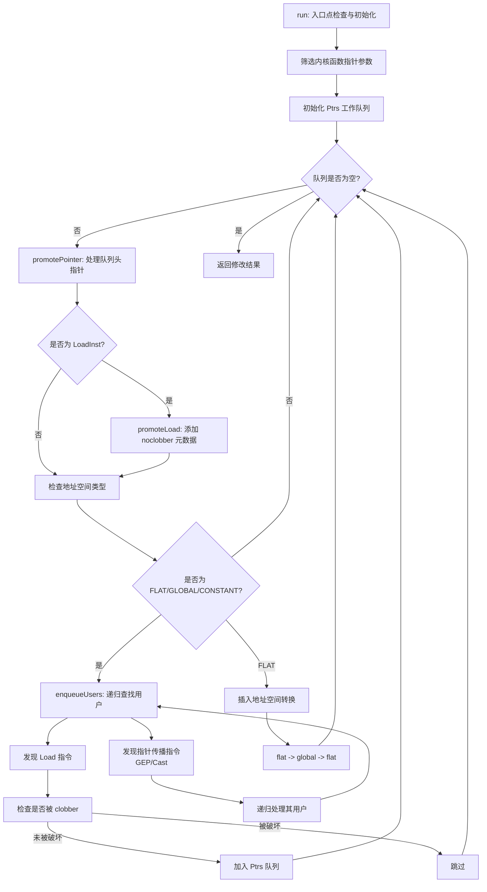

# AMDGPUPromoteKernelArguments Pass 功能详解

## 1. Pass 主要功能概述

<a name="ref-block_0"></a>`AMDGPUPromoteKernelArguments` 是一个针对 AMDGPU 后端的函数级优化 Pass，其核心功能是**递归地将内核函数的通用指针参数提升到全局地址空间**。 llvm-project:9-15[<sup>↗</sup>](#block_0) 

**作用与效果：**
- 该 Pass 遍历内核函数的指针参数，分析从这些参数加载的值
- 如果加载的值也是指针，且该指针在加载前未被修改，则将其提升为全局地址空间指针
- 通过插入地址空间转换（addrspacecast）操作，将 flat 地址空间的指针转换为 global 地址空间，然后再转回 flat 地址空间
- 这种转换为后续的 "Infer Address Spaces" pass 提供优化机会，使其能够进行更精确的地址空间推断和优化

## 2. 主要功能步骤提取

该 Pass 的实现包含以下核心步骤/子功能：

1. **入口点检查与初始化** (`run` 方法)
2. **指针队列处理** (`promotePointer` 方法)
3. **加载指令提升** (`promoteLoad` 方法)
4. **用户指令入队** (`enqueueUsers` 方法)
5. **插入点计算** (`getInsertPt` 函数)

## 3. 各步骤详细描述与分析

<a name="ref-block_6"></a>### 3.1 入口点检查与初始化 llvm-project:153-186[<sup>↗</sup>](#block_6) 

该步骤负责：
- **验证函数类型**：检查是否为 AMDGPU_KERNEL 调用约定，非内核函数直接跳过
- **参数过滤**：遍历所有函数参数，筛选出指针类型且地址空间为 FLAT_ADDRESS、GLOBAL_ADDRESS 或 CONSTANT_ADDRESS 的参数
- **初始化工作队列**：将符合条件的参数加入 `Ptrs` 队列等待处理
- **迭代处理**：通过 while 循环不断从队列中取出指针进行处理，直到队列为空

<a name="ref-block_3"></a>### 3.2 指针队列处理 llvm-project:94-128[<sup>↗</sup>](#block_3) 

该步骤是核心转换逻辑：
- **LoadInst 处理**：如果当前指针是 LoadInst，调用 `promoteLoad` 添加元数据
- **地址空间判断**：检查指针类型的地址空间是否为 FLAT_ADDRESS、GLOBAL_ADDRESS 或 CONSTANT_ADDRESS
- **递归入队**：如果满足条件，调用 `enqueueUsers` 将该指针的用户指令加入队列
- **地址空间转换**：对于 FLAT_ADDRESS 的指针，插入两次 addrspacecast 转换：
  - 先将 flat 指针转换为 global 指针（`.global` 后缀）
  - 再将 global 指针转换回 flat 指针（`.flat` 后缀）
  - 用新的转换结果替换原指针的所有使用（除了转换指令本身）

<a name="ref-block_4"></a>### 3.3 加载指令提升 llvm-project:130-136[<sup>↗</sup>](#block_4) 

该步骤为加载指令添加优化提示：
- **简单性检查**：只处理 simple 类型的 load 指令（非 volatile、atomic 等）
- **添加元数据**：为符合条件的 load 指令添加 `amdgpu.noclobber` 元数据
- 该元数据标记表明该加载不会被 barrier、fence 等指令破坏，为后续优化提供保证

<a name="ref-block_2"></a>### 3.4 用户指令入队 llvm-project:65-92[<sup>↗</sup>](#block_2) 

该步骤递归地发现潜在的指针加载：
- **用户遍历**：获取指针的所有用户指令，通过工作列表进行迭代处理
- **LoadInst 处理**：
  - 检查 load 的指针操作数（去除 inbounds offset）是否等于当前指针
  - 使用 `isClobberedInFunction` 检查该 load 是否在函数中被破坏
  - 如果未被破坏，将该 LoadInst 加入 `Ptrs` 队列等待提升
- **指针传播指令**：对于 GetElementPtr、AddrSpaceCast、BitCast 等指令，将其用户也加入处理列表，实现递归查找

<a name="ref-block_5"></a>### 3.5 插入点计算 llvm-project:138-151[<sup>↗</sup>](#block_5) 

该辅助函数确定转换指令的插入位置：
- **跳过 alloca**：从基本块的第一个插入点开始，跳过所有静态 alloca 指令
- **动态 alloca 考虑**：如果遇到动态 alloca（其大小可能依赖于加载的内核参数），则在其之前插入转换指令
- 这确保转换指令在所有可能依赖内核参数的操作之前执行

## 4. 步骤之间的关系

整个 Pass 的执行流程呈现**工作队列驱动的递归处理模式**：



**关键关系说明：**

1. **初始化 → 迭代处理**：`run` 方法初始化后启动主循环，不断处理队列中的指针
2. **提升 → 递归发现**：`promotePointer` 在处理当前指针的同时，通过 `enqueueUsers` 发现新的候选指针
3. **用户分析 → 安全性检查**：`enqueueUsers` 使用 `isClobberedInFunction` 确保只处理安全的 load 操作
4. **地址空间转换 → 后续优化**：插入的 addrspacecast 指令为 "Infer Address Spaces" pass 提供优化线索
5. **元数据标注 → 优化保证**：`promoteLoad` 添加的 `amdgpu.noclobber` 元数据向后续 pass 保证该 load 的特殊属性

## Notes

<a name="ref-block_1"></a>- 该 Pass 依赖 **MemorySSA** 和 **AliasAnalysis** 进行精确的内存依赖分析 llvm-project:56-60[<sup>↗</sup>](#block_1) 
<a name="ref-block_7"></a>- `isClobberedInFunction` 的实现考虑了 AMDGPU 特有的同步原语（如 barrier、fence），这些指令在 MemorySSA 中被视为 clobber，但实际上不修改内存内容 llvm-project:380-425[<sup>↗</sup>](#block_7) 
- 该 Pass 保留所有分析结果（`setPreservesAll`），因为它只插入新指令而不破坏控制流 llvm-project:59-59 
- 转换后的代码依赖后续的 "Infer Address Spaces" pass 来完成最终的地址空间优化，消除冗余的转换操作
### Citations
<a name="block_0"></a>**File:** llvm/lib/Target/AMDGPU/AMDGPUPromoteKernelArguments.cpp (L9-15) [<sup>↩</sup>](#ref-block_0)
```cpp
/// \file This pass recursively promotes generic pointer arguments of a kernel
/// into the global address space.
///
/// The pass walks kernel's pointer arguments, then loads from them. If a loaded
/// value is a pointer and loaded pointer is unmodified in the kernel before the
/// load, then promote loaded pointer to global. Then recursively continue.
//
```
<a name="block_1"></a>**File:** llvm/lib/Target/AMDGPU/AMDGPUPromoteKernelArguments.cpp (L56-60) [<sup>↩</sup>](#ref-block_1)
```cpp
  void getAnalysisUsage(AnalysisUsage &AU) const override {
    AU.addRequired<AAResultsWrapperPass>();
    AU.addRequired<MemorySSAWrapperPass>();
    AU.setPreservesAll();
  }
```
<a name="block_2"></a>**File:** llvm/lib/Target/AMDGPU/AMDGPUPromoteKernelArguments.cpp (L65-92) [<sup>↩</sup>](#ref-block_2)
```cpp
void AMDGPUPromoteKernelArguments::enqueueUsers(Value *Ptr) {
  SmallVector<User *> PtrUsers(Ptr->users());

  while (!PtrUsers.empty()) {
    Instruction *U = dyn_cast<Instruction>(PtrUsers.pop_back_val());
    if (!U)
      continue;

    switch (U->getOpcode()) {
    default:
      break;
    case Instruction::Load: {
      LoadInst *LD = cast<LoadInst>(U);
      if (LD->getPointerOperand()->stripInBoundsOffsets() == Ptr &&
          !AMDGPU::isClobberedInFunction(LD, MSSA, AA))
        Ptrs.push_back(LD);

      break;
    }
    case Instruction::GetElementPtr:
    case Instruction::AddrSpaceCast:
    case Instruction::BitCast:
      if (U->getOperand(0)->stripInBoundsOffsets() == Ptr)
        PtrUsers.append(U->user_begin(), U->user_end());
      break;
    }
  }
}
```
<a name="block_3"></a>**File:** llvm/lib/Target/AMDGPU/AMDGPUPromoteKernelArguments.cpp (L94-128) [<sup>↩</sup>](#ref-block_3)
```cpp
bool AMDGPUPromoteKernelArguments::promotePointer(Value *Ptr) {
  bool Changed = false;

  LoadInst *LI = dyn_cast<LoadInst>(Ptr);
  if (LI)
    Changed |= promoteLoad(LI);

  PointerType *PT = dyn_cast<PointerType>(Ptr->getType());
  if (!PT)
    return Changed;

  if (PT->getAddressSpace() == AMDGPUAS::FLAT_ADDRESS ||
      PT->getAddressSpace() == AMDGPUAS::GLOBAL_ADDRESS ||
      PT->getAddressSpace() == AMDGPUAS::CONSTANT_ADDRESS)
    enqueueUsers(Ptr);

  if (PT->getAddressSpace() != AMDGPUAS::FLAT_ADDRESS)
    return Changed;

  IRBuilder<> B(LI ? &*std::next(cast<Instruction>(Ptr)->getIterator())
                   : ArgCastInsertPt);

  // Cast pointer to global address space and back to flat and let
  // Infer Address Spaces pass to do all necessary rewriting.
  PointerType *NewPT =
      PointerType::get(PT->getContext(), AMDGPUAS::GLOBAL_ADDRESS);
  Value *Cast =
      B.CreateAddrSpaceCast(Ptr, NewPT, Twine(Ptr->getName(), ".global"));
  Value *CastBack =
      B.CreateAddrSpaceCast(Cast, PT, Twine(Ptr->getName(), ".flat"));
  Ptr->replaceUsesWithIf(CastBack,
                         [Cast](Use &U) { return U.getUser() != Cast; });

  return true;
}
```
<a name="block_4"></a>**File:** llvm/lib/Target/AMDGPU/AMDGPUPromoteKernelArguments.cpp (L130-136) [<sup>↩</sup>](#ref-block_4)
```cpp
bool AMDGPUPromoteKernelArguments::promoteLoad(LoadInst *LI) {
  if (!LI->isSimple())
    return false;

  LI->setMetadata("amdgpu.noclobber", MDNode::get(LI->getContext(), {}));
  return true;
}
```
<a name="block_5"></a>**File:** llvm/lib/Target/AMDGPU/AMDGPUPromoteKernelArguments.cpp (L138-151) [<sup>↩</sup>](#ref-block_5)
```cpp
// skip allocas
static BasicBlock::iterator getInsertPt(BasicBlock &BB) {
  BasicBlock::iterator InsPt = BB.getFirstInsertionPt();
  for (BasicBlock::iterator E = BB.end(); InsPt != E; ++InsPt) {
    AllocaInst *AI = dyn_cast<AllocaInst>(&*InsPt);

    // If this is a dynamic alloca, the value may depend on the loaded kernargs,
    // so loads will need to be inserted before it.
    if (!AI || !AI->isStaticAlloca())
      break;
  }

  return InsPt;
}
```
<a name="block_6"></a>**File:** llvm/lib/Target/AMDGPU/AMDGPUPromoteKernelArguments.cpp (L153-186) [<sup>↩</sup>](#ref-block_6)
```cpp
bool AMDGPUPromoteKernelArguments::run(Function &F, MemorySSA &MSSA,
                                       AliasAnalysis &AA) {
  if (skipFunction(F))
    return false;

  CallingConv::ID CC = F.getCallingConv();
  if (CC != CallingConv::AMDGPU_KERNEL || F.arg_empty())
    return false;

  ArgCastInsertPt = &*getInsertPt(*F.begin());
  this->MSSA = &MSSA;
  this->AA = &AA;

  for (Argument &Arg : F.args()) {
    if (Arg.use_empty())
      continue;

    PointerType *PT = dyn_cast<PointerType>(Arg.getType());
    if (!PT || (PT->getAddressSpace() != AMDGPUAS::FLAT_ADDRESS &&
                PT->getAddressSpace() != AMDGPUAS::GLOBAL_ADDRESS &&
                PT->getAddressSpace() != AMDGPUAS::CONSTANT_ADDRESS))
      continue;

    Ptrs.push_back(&Arg);
  }

  bool Changed = false;
  while (!Ptrs.empty()) {
    Value *Ptr = Ptrs.pop_back_val();
    Changed |= promotePointer(Ptr);
  }

  return Changed;
}
```
<a name="block_7"></a>**File:** llvm/lib/Target/AMDGPU/AMDGPUMemoryUtils.cpp (L380-425) [<sup>↩</sup>](#ref-block_7)
```cpp
bool isClobberedInFunction(const LoadInst *Load, MemorySSA *MSSA,
                           AAResults *AA) {
  MemorySSAWalker *Walker = MSSA->getWalker();
  SmallVector<MemoryAccess *> WorkList{Walker->getClobberingMemoryAccess(Load)};
  SmallSet<MemoryAccess *, 8> Visited;
  MemoryLocation Loc(MemoryLocation::get(Load));

  LLVM_DEBUG(dbgs() << "Checking clobbering of: " << *Load << '\n');

  // Start with a nearest dominating clobbering access, it will be either
  // live on entry (nothing to do, load is not clobbered), MemoryDef, or
  // MemoryPhi if several MemoryDefs can define this memory state. In that
  // case add all Defs to WorkList and continue going up and checking all
  // the definitions of this memory location until the root. When all the
  // defs are exhausted and came to the entry state we have no clobber.
  // Along the scan ignore barriers and fences which are considered clobbers
  // by the MemorySSA, but not really writing anything into the memory.
  while (!WorkList.empty()) {
    MemoryAccess *MA = WorkList.pop_back_val();
    if (!Visited.insert(MA).second)
      continue;

    if (MSSA->isLiveOnEntryDef(MA))
      continue;

    if (MemoryDef *Def = dyn_cast<MemoryDef>(MA)) {
      LLVM_DEBUG(dbgs() << "  Def: " << *Def->getMemoryInst() << '\n');

      if (isReallyAClobber(Load->getPointerOperand(), Def, AA)) {
        LLVM_DEBUG(dbgs() << "      -> load is clobbered\n");
        return true;
      }

      WorkList.push_back(
          Walker->getClobberingMemoryAccess(Def->getDefiningAccess(), Loc));
      continue;
    }

    const MemoryPhi *Phi = cast<MemoryPhi>(MA);
    for (const auto &Use : Phi->incoming_values())
      WorkList.push_back(cast<MemoryAccess>(&Use));
  }

  LLVM_DEBUG(dbgs() << "      -> no clobber\n");
  return false;
}
```