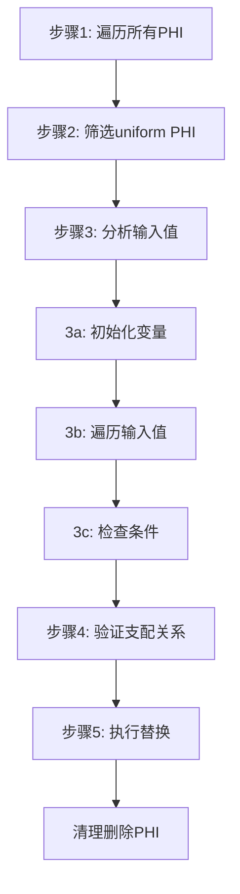

# AMDGPURewriteUndefForPHI Pass 功能详解

## 1. 主要功能概括

<a name="ref-block_0"></a>这个 Pass 的主要功能是**重写结构化控制流中 PHI 节点的未定义（undef）输入操作数**。 llvm-project:8-11[<sup>↗</sup>](#block_0) 

<a name="ref-block_1"></a>**作用**：针对经过结构化 CFG 转换的 IR，当 PHI 节点在发散分支的汇合块中有一个唯一的均匀（uniform）定义值和额外的 undef/poison 输入值时，将这些 undef 值替换为该唯一定义值。 llvm-project:13-17[<sup>↗</sup>](#block_1) 

<a name="ref-block_3"></a>**效果**：这样做可以确保为这类 PHI 节点分配的标量寄存器获得正确的生命周期，防止在 then 块中标量寄存器被错误覆写。 llvm-project:40-43[<sup>↗</sup>](#block_3) 

## 2. 主要实现步骤/子功能

Pass 的核心实现在 `rewritePHIs` 函数中，包含以下主要步骤：

1. **遍历函数中的所有 PHI 节点**
2. **筛选均匀（uniform）PHI 节点**
3. **分析 PHI 的输入值**
4. **验证支配关系**
5. **执行替换和清理**

## 3. 各步骤详细分析

<a name="ref-block_5"></a>### 步骤1：遍历函数中的所有 PHI 节点 llvm-project:103-104[<sup>↗</sup>](#block_5) 

该步骤遍历函数中的每个基本块及其 PHI 节点，为后续分析做准备。

<a name="ref-block_6"></a>### 步骤2：筛选均匀（uniform）PHI 节点 llvm-project:105-106[<sup>↗</sup>](#block_6) 

只处理被 uniformity 分析标记为 uniform（非发散）的 PHI 节点。这是因为只有 uniform PHI 才需要这种优化，发散的 PHI 会被跳过。

### 步骤3：分析 PHI 的输入值
这一步骤包含多个子任务：

<a name="ref-block_7"></a>**3a. 初始化跟踪变量** llvm-project:108-114[<sup>↗</sup>](#block_7) 

初始化三个关键变量：
- `UniqueDefinedIncoming`：唯一的非 undef/poison 输入值
- `DominateBB`：具有定义值且支配所有其他相同值块的基本块
- `Undefs`：具有 undef 输入值的前驱块列表（排除循环回边）

<a name="ref-block_8"></a>**3b. 遍历所有输入值** llvm-project:116-141[<sup>↗</sup>](#block_8) 

对每个输入值进行分类处理：
- 跳过自引用（循环中的 PHI 自身）
- 识别 undef 值，但排除来自循环回边的 undef llvm-project:123-128 
- 跟踪唯一定义值，如果发现多个不同的定义值则终止分析 llvm-project:130-140 
- 更新支配基本块为最接近的共同支配者 llvm-project:134-136 

<a name="ref-block_9"></a>**3c. 检查是否满足重写条件** llvm-project:142-148[<sup>↗</sup>](#block_9) 

验证三个条件：
- 存在唯一定义的输入值
- 存在至少一个 undef 输入
- 支配基本块的终结指令是发散的

<a name="ref-block_10"></a>### 步骤4：验证支配关系 llvm-project:150-156[<sup>↗</sup>](#block_10) 

确保支配基本块确实支配：
- PHI 所在的基本块（确保定义值在 PHI 处可用）
- 所有具有 undef 输入的前驱块（确保可以安全替换）

只有满足这些支配关系时才能进行替换。

<a name="ref-block_11"></a>### 步骤5：执行替换和清理 llvm-project:157-165[<sup>↗</sup>](#block_11) 

将 PHI 节点的所有使用替换为唯一定义值，并标记待删除。最后统一删除所有被替换的 PHI 节点。

## 4. 步骤间关系说明

这些步骤形成了一个**顺序依赖的处理流水线**：



**关键依赖关系**：

1. **步骤2依赖步骤1**：必须先遍历到 PHI 节点才能判断其是否 uniform
2. **步骤3依赖步骤2**：只对 uniform PHI 进行输入值分析，节省计算
3. **步骤4依赖步骤3**：需要步骤3确定的 `DominateBB` 和 `Undefs` 来验证支配关系
4. **步骤5依赖步骤4**：只有通过支配关系验证的 PHI 才会被替换

整个 Pass 采用**保守的安全策略**：只在能够确保正确性的情况下才执行转换。通过多层检查（uniform 检查、唯一值检查、支配关系检查）确保不会引入错误的优化。

## Notes

<a name="ref-block_2"></a>该 Pass 专门针对 **Pattern B** 模式进行优化 llvm-project:28-33[<sup>↗</sup>](#block_2) ，即定义值所在块支配 undef 值所在块的情况。对于 **Pattern A** 模式（undef 值块支配定义值块），则依赖后端处理。

<a name="ref-block_4"></a>当前实现有一个限制：如果发散线程的汇合块是循环头，该 Pass 无法正确处理。 llvm-project:45-49[<sup>↗</sup>](#block_4)  这种情况需要依赖 `SIAnnotateControlFlow` Pass 先将循环头分割，创建独立的汇合块。
### Citations
<a name="block_0"></a>**File:** llvm/lib/Target/AMDGPU/AMDGPURewriteUndefForPHI.cpp (L8-11) [<sup>↩</sup>](#ref-block_0)
```cpp
// This file implements the idea to rewrite undef incoming operand for certain
// PHIs in structurized CFG. This pass only works on IR that has gone through
// StructurizedCFG pass, and this pass has some additional limitation that make
// it can only run after SIAnnotateControlFlow.
```
<a name="block_1"></a>**File:** llvm/lib/Target/AMDGPU/AMDGPURewriteUndefForPHI.cpp (L13-17) [<sup>↩</sup>](#ref-block_1)
```cpp
// To achieve optimal code generation for AMDGPU, we assume that uniformity
// analysis reports the PHI in join block of divergent branch as uniform if
// it has one unique uniform value plus additional undefined/poisoned incoming
// value. That is to say the later compiler pipeline will ensure such PHI always
// return uniform value and ensure it work correctly. Let's take a look at two
```
<a name="block_2"></a>**File:** llvm/lib/Target/AMDGPU/AMDGPURewriteUndefForPHI.cpp (L28-33) [<sup>↩</sup>](#ref-block_2)
```cpp
//  Pattern B: Block with defined incoming value dominates undefined predecessor
//  %if
//  | \
//  | %then
//  | /
//  %endif: %phi = phi [%uniform, %if], [%undef, %then]
```
<a name="block_3"></a>**File:** llvm/lib/Target/AMDGPU/AMDGPURewriteUndefForPHI.cpp (L40-43) [<sup>↩</sup>](#ref-block_3)
```cpp
// For pattern B, we will replace the undef operand with the other defined value
// in this pass. So the scalar register allocated for such PHI will get correct
// liveness. Without this transformation, the scalar register may be overwritten
// in the %then block.
```
<a name="block_4"></a>**File:** llvm/lib/Target/AMDGPU/AMDGPURewriteUndefForPHI.cpp (L45-49) [<sup>↩</sup>](#ref-block_4)
```cpp
// Limitation note:
// If the join block of divergent threads is a loop header, the pass cannot
// handle it correctly right now. For below case, the undef in %phi should also
// be rewritten. Currently we depend on SIAnnotateControlFlow to split %header
// block to get a separate join block, then we can rewrite the undef correctly.
```
<a name="block_5"></a>**File:** llvm/lib/Target/AMDGPU/AMDGPURewriteUndefForPHI.cpp (L103-104) [<sup>↩</sup>](#ref-block_5)
```cpp
  for (auto &BB : F) {
    for (auto &PHI : BB.phis()) {
```
<a name="block_6"></a>**File:** llvm/lib/Target/AMDGPU/AMDGPURewriteUndefForPHI.cpp (L105-106) [<sup>↩</sup>](#ref-block_6)
```cpp
      if (UA.isDivergent(&PHI))
        continue;
```
<a name="block_7"></a>**File:** llvm/lib/Target/AMDGPU/AMDGPURewriteUndefForPHI.cpp (L108-114) [<sup>↩</sup>](#ref-block_7)
```cpp
      // The unique incoming value except undef/poison for the PHI node.
      Value *UniqueDefinedIncoming = nullptr;
      // The divergent block with defined incoming value that dominates all
      // other block with the same incoming value.
      BasicBlock *DominateBB = nullptr;
      // Predecessors with undefined incoming value (excluding loop backedge).
      SmallVector<BasicBlock *> Undefs;
```
<a name="block_8"></a>**File:** llvm/lib/Target/AMDGPU/AMDGPURewriteUndefForPHI.cpp (L116-141) [<sup>↩</sup>](#ref-block_8)
```cpp
      for (unsigned i = 0; i < PHI.getNumIncomingValues(); i++) {
        Value *Incoming = PHI.getIncomingValue(i);
        BasicBlock *IncomingBB = PHI.getIncomingBlock(i);

        if (Incoming == &PHI)
          continue;

        if (isa<UndefValue>(Incoming)) {
          // Undef from loop backedge will not be replaced.
          if (!DT->dominates(&BB, IncomingBB))
            Undefs.push_back(IncomingBB);
          continue;
        }

        if (!UniqueDefinedIncoming) {
          UniqueDefinedIncoming = Incoming;
          DominateBB = IncomingBB;
        } else if (Incoming == UniqueDefinedIncoming) {
          // Update DominateBB if necessary.
          if (DT->dominates(IncomingBB, DominateBB))
            DominateBB = IncomingBB;
        } else {
          UniqueDefinedIncoming = nullptr;
          break;
        }
      }
```
<a name="block_9"></a>**File:** llvm/lib/Target/AMDGPU/AMDGPURewriteUndefForPHI.cpp (L142-148) [<sup>↩</sup>](#ref-block_9)
```cpp
      // We only need to replace the undef for the PHI which is merging
      // defined/undefined values from divergent threads.
      // TODO: We should still be able to replace undef value if the unique
      // value is a Constant.
      if (!UniqueDefinedIncoming || Undefs.empty() ||
          !UA.isDivergent(DominateBB->getTerminator()))
        continue;
```
<a name="block_10"></a>**File:** llvm/lib/Target/AMDGPU/AMDGPURewriteUndefForPHI.cpp (L150-156) [<sup>↩</sup>](#ref-block_10)
```cpp
      // We only replace the undef when DominateBB truly dominates all the
      // other predecessors with undefined incoming value. Make sure DominateBB
      // dominates BB so that UniqueDefinedIncoming is available in BB and
      // afterwards.
      if (DT->dominates(DominateBB, &BB) && all_of(Undefs, [&](BasicBlock *UD) {
            return DT->dominates(DominateBB, UD);
          })) {
```
<a name="block_11"></a>**File:** llvm/lib/Target/AMDGPU/AMDGPURewriteUndefForPHI.cpp (L157-165) [<sup>↩</sup>](#ref-block_11)
```cpp
        PHI.replaceAllUsesWith(UniqueDefinedIncoming);
        ToBeDeleted.push_back(&PHI);
        Changed = true;
      }
    }
  }

  for (auto *PHI : ToBeDeleted)
    PHI->eraseFromParent();
```