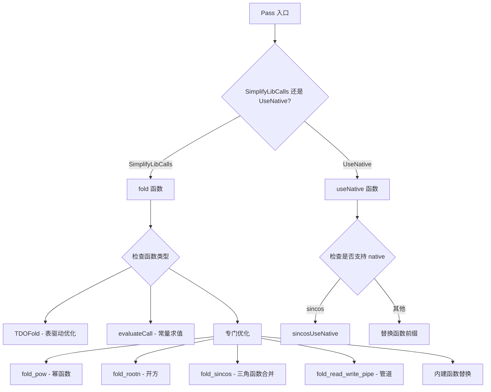

# AMDGPULibCalls.cpp 中两个 Pass 的功能详解

这个文件实现了两个针对 AMDGPU 库函数调用的优化 Pass：

## 1. 两个 Pass 的主要功能概括

<a name="ref-block_18"></a>### Pass 1: AMDGPUSimplifyLibCallsPass llvm-project:1709-1733[<sup>↗</sup>](#block_18) 

**主要功能**：对 AMD GPU 库函数进行简化和优化转换。

**作用**：
- 将库函数调用转换为更高效的形式（如 LLVM 内建函数或简化的数学表达式）
- 对常量参数进行编译期求值
- 合并相关的函数调用（如将 sin/cos 合并为 sincos）
- 简化特定的数学运算模式

**效果**：提高代码执行效率，减少函数调用开销，利用硬件特性进行优化。

<a name="ref-block_19"></a>### Pass 2: AMDGPUUseNativeCallsPass llvm-project:1735-1755[<sup>↗</sup>](#block_19) 

**主要功能**：将标准库函数替换为对应的 native（原生硬件）版本。

**作用**：
- 根据用户配置（`-amdgpu-use-native` 选项）将精度要求较低的库函数替换为硬件原生实现
- 支持选择性替换（可以指定特定函数或全部函数）

**效果**：牺牲一定的精度换取更快的执行速度，利用 GPU 硬件的快速但精度较低的数学函数实现。

## 2. AMDGPUSimplifyLibCallsPass 的主要步骤和子功能

<a name="ref-block_11"></a>### 2.1 表驱动优化 (TDOFold) llvm-project:828-888[<sup>↗</sup>](#block_11) 

**功能**：使用预定义的查找表对常见输入值进行快速常量折叠。

**描述**：
- 维护了一系列函数的输入-输出对照表
- 当函数参数是常量时，直接查表返回结果
- 支持标量和向量类型

<a name="ref-block_17"></a>### 2.2 常量表达式求值 (evaluateCall) llvm-project:1628-1707[<sup>↗</sup>](#block_17) 

**功能**：在编译期对常量参数的数学函数进行求值。

**描述**：
- 支持单参数和双参数函数
- 可处理标量和向量常量
- 使用主机的 double 精度计算 f32 函数，提高精度

<a name="ref-block_12"></a>### 2.3 幂函数优化 (fold_pow) llvm-project:900-1148[<sup>↗</sup>](#block_12) 

**功能**：对 pow/powr/pown 函数进行专门优化。

**描述**：
- 识别特殊指数（0, 1, 2, -1, 0.5, -0.5）并进行简化
- 对小整数指数（≤12）展开为乘法序列
- 将 pow(x,y) 转换为 exp2(y * log2(x))
- 自动选择 pow/powr/pown 之间的最优形式

<a name="ref-block_13"></a>### 2.4 开方函数优化 (fold_rootn) llvm-project:1150-1241[<sup>↗</sup>](#block_13) 

**功能**：优化 rootn(x, n) 函数调用。

**描述**：
- 识别特殊值：rootn(x, 1) = x, rootn(x, 2) = sqrt(x), rootn(x, 3) = cbrt(x)
- rootn(x, -1) = 1/x, rootn(x, -2) = rsqrt(x)
- 转换为相应的内建函数或简单操作

<a name="ref-block_16"></a>### 2.5 三角函数合并 (fold_sincos) llvm-project:1350-1461[<sup>↗</sup>](#block_16) 

**功能**：将独立的 sin 和 cos 调用合并为单个 sincos 调用。

**描述**：
- 扫描函数内所有使用相同参数的 sin/cos 调用
- 创建一个 sincos 调用替代多个独立调用
- 保留所有快速数学标志的交集
- 合并调试位置信息

<a name="ref-block_15"></a>### 2.6 库函数到内建函数转换 llvm-project:1303-1311[<sup>↗</sup>](#block_15) 

**功能**：将库函数调用替换为 LLVM 内建函数。

**描述**：
- 支持的函数包括：exp, exp2, log, log2, log10, fmin, fmax, fma, fabs, sqrt, floor, ceil, trunc 等
- 考虑函数属性（minsize, strictfp）决定是否转换
- 处理向量/标量参数的类型匹配

<a name="ref-block_7"></a>### 2.7 管道读写优化 (fold_read_write_pipe) llvm-project:520-573[<sup>↗</sup>](#block_7) 

**功能**：优化 OpenCL 管道读写函数。

**描述**：
- 当数据大小和对齐匹配且为 2 的幂时，转换为优化版本
- 例如 `__read_pipe_2` → `__read_pipe_2_N`（N 为字节数）

## 3. AMDGPUUseNativeCallsPass 的主要步骤和子功能

<a name="ref-block_6"></a>### 3.1 Native 函数替换 (useNative) llvm-project:486-511[<sup>↗</sup>](#block_6) 

**功能**：将标准库函数替换为 native 版本。

**描述**：
- 检查函数是否在允许替换列表中
- 仅支持 F32 和 F16 类型（F64 不支持）
- 验证函数名并更改前缀为 NATIVE

<a name="ref-block_5"></a>### 3.2 Sincos Native 优化 (sincosUseNative) llvm-project:450-484[<sup>↗</sup>](#block_5) 

**功能**：将 sincos 调用拆分为独立的 native sin 和 native cos。

**描述**：
- 仅当 sin 和 cos 都被配置为使用 native 时才执行
- 创建两个独立的 native 函数调用
- 将 cos 结果存储到原 sincos 的输出指针

<a name="ref-block_0"></a>### 3.3 Native 函数支持检查 (HasNative) llvm-project:328-349[<sup>↗</sup>](#block_0) 

**功能**：判断某个函数是否有 native 版本。

**描述**：
- 支持的 native 函数包括：divide, cos, exp, exp2, exp10, log, log2, log10, powr, recip, rsqrt, sin, sincos, sqrt, tan
- 其他函数不支持 native 替换

## 4. 步骤和子功能之间的关系

### 执行流程关系



### 依赖关系

1. **优先级顺序**：
<a name="ref-block_8"></a>   - TDOFold（表驱动优化）优先执行，因为它最快 llvm-project:661-662[<sup>↗</sup>](#block_8) 
   
<a name="ref-block_9"></a>   - 然后尝试常量求值 llvm-project:672-673[<sup>↗</sup>](#block_9) 
   
<a name="ref-block_10"></a>   - 最后执行特定的函数优化 llvm-project:682-811[<sup>↗</sup>](#block_10) 

2. **数学安全性检查**：
<a name="ref-block_3"></a>   - 许多优化需要 unsafe math 标志 llvm-project:418-420[<sup>↗</sup>](#block_3) 
   
<a name="ref-block_4"></a>   - 或者 unsafe-finite-only-math llvm-project:422-425[<sup>↗</sup>](#block_4) 

3. **函数转换链**：
   - pow → powr（当 x >= 0）
   - pow → pown（当 y 是整数） llvm-project:757-795 
   
   - powr/pown → exp2(y * log2(x))

4. **辅助功能支持**：
<a name="ref-block_1"></a>   - `getFunction`：获取或创建函数声明 llvm-project:405-411[<sup>↗</sup>](#block_1) 
   
<a name="ref-block_2"></a>   - `parseFunctionName`：解析函数名信息 llvm-project:413-416[<sup>↗</sup>](#block_2) 
   
<a name="ref-block_14"></a>   - `shouldReplaceLibcallWithIntrinsic`：判断是否应该替换 llvm-project:1256-1280[<sup>↗</sup>](#block_14) 

## Notes

这两个 Pass 的设计体现了分层优化策略：
- **SimplifyLibCalls** 专注于语义等价的转换和优化，保持数值精度
- **UseNative** 则允许精度损失以换取性能，需要用户显式启用

两者可以独立工作，也可以协同使用。通常先运行 SimplifyLibCalls 进行安全优化，然后根据需要运行 UseNative 进行激进优化。
### Citations
<a name="block_0"></a>**File:** llvm/lib/Target/AMDGPU/AMDGPULibCalls.cpp (L328-349) [<sup>↩</sup>](#ref-block_0)
```cpp
static bool HasNative(AMDGPULibFunc::EFuncId id) {
  switch(id) {
  case AMDGPULibFunc::EI_DIVIDE:
  case AMDGPULibFunc::EI_COS:
  case AMDGPULibFunc::EI_EXP:
  case AMDGPULibFunc::EI_EXP2:
  case AMDGPULibFunc::EI_EXP10:
  case AMDGPULibFunc::EI_LOG:
  case AMDGPULibFunc::EI_LOG2:
  case AMDGPULibFunc::EI_LOG10:
  case AMDGPULibFunc::EI_POWR:
  case AMDGPULibFunc::EI_RECIP:
  case AMDGPULibFunc::EI_RSQRT:
  case AMDGPULibFunc::EI_SIN:
  case AMDGPULibFunc::EI_SINCOS:
  case AMDGPULibFunc::EI_SQRT:
  case AMDGPULibFunc::EI_TAN:
    return true;
  default:;
  }
  return false;
}
```
<a name="block_1"></a>**File:** llvm/lib/Target/AMDGPU/AMDGPULibCalls.cpp (L405-411) [<sup>↩</sup>](#ref-block_1)
```cpp
FunctionCallee AMDGPULibCalls::getFunction(Module *M, const FuncInfo &fInfo) {
  // If we are doing PreLinkOpt, the function is external. So it is safe to
  // use getOrInsertFunction() at this stage.

  return EnablePreLink ? AMDGPULibFunc::getOrInsertFunction(M, fInfo)
                       : AMDGPULibFunc::getFunction(M, fInfo);
}
```
<a name="block_2"></a>**File:** llvm/lib/Target/AMDGPU/AMDGPULibCalls.cpp (L413-416) [<sup>↩</sup>](#ref-block_2)
```cpp
bool AMDGPULibCalls::parseFunctionName(const StringRef &FMangledName,
                                       FuncInfo &FInfo) {
  return AMDGPULibFunc::parse(FMangledName, FInfo);
}
```
<a name="block_3"></a>**File:** llvm/lib/Target/AMDGPU/AMDGPULibCalls.cpp (L418-420) [<sup>↩</sup>](#ref-block_3)
```cpp
bool AMDGPULibCalls::isUnsafeMath(const FPMathOperator *FPOp) const {
  return UnsafeFPMath || FPOp->isFast();
}
```
<a name="block_4"></a>**File:** llvm/lib/Target/AMDGPU/AMDGPULibCalls.cpp (L422-425) [<sup>↩</sup>](#ref-block_4)
```cpp
bool AMDGPULibCalls::isUnsafeFiniteOnlyMath(const FPMathOperator *FPOp) const {
  return UnsafeFPMath ||
         (FPOp->hasApproxFunc() && FPOp->hasNoNaNs() && FPOp->hasNoInfs());
}
```
<a name="block_5"></a>**File:** llvm/lib/Target/AMDGPU/AMDGPULibCalls.cpp (L450-484) [<sup>↩</sup>](#ref-block_5)
```cpp
bool AMDGPULibCalls::sincosUseNative(CallInst *aCI, const FuncInfo &FInfo) {
  bool native_sin = useNativeFunc("sin");
  bool native_cos = useNativeFunc("cos");

  if (native_sin && native_cos) {
    Module *M = aCI->getModule();
    Value *opr0 = aCI->getArgOperand(0);

    AMDGPULibFunc nf;
    nf.getLeads()[0].ArgType = FInfo.getLeads()[0].ArgType;
    nf.getLeads()[0].VectorSize = FInfo.getLeads()[0].VectorSize;

    nf.setPrefix(AMDGPULibFunc::NATIVE);
    nf.setId(AMDGPULibFunc::EI_SIN);
    FunctionCallee sinExpr = getFunction(M, nf);

    nf.setPrefix(AMDGPULibFunc::NATIVE);
    nf.setId(AMDGPULibFunc::EI_COS);
    FunctionCallee cosExpr = getFunction(M, nf);
    if (sinExpr && cosExpr) {
      Value *sinval =
          CallInst::Create(sinExpr, opr0, "splitsin", aCI->getIterator());
      Value *cosval =
          CallInst::Create(cosExpr, opr0, "splitcos", aCI->getIterator());
      new StoreInst(cosval, aCI->getArgOperand(1), aCI->getIterator());

      DEBUG_WITH_TYPE("usenative", dbgs() << "<useNative> replace " << *aCI
                                          << " with native version of sin/cos");

      replaceCall(aCI, sinval);
      return true;
    }
  }
  return false;
}
```
<a name="block_6"></a>**File:** llvm/lib/Target/AMDGPU/AMDGPULibCalls.cpp (L486-511) [<sup>↩</sup>](#ref-block_6)
```cpp
bool AMDGPULibCalls::useNative(CallInst *aCI) {
  Function *Callee = aCI->getCalledFunction();
  if (!Callee || aCI->isNoBuiltin())
    return false;

  FuncInfo FInfo;
  if (!parseFunctionName(Callee->getName(), FInfo) || !FInfo.isMangled() ||
      FInfo.getPrefix() != AMDGPULibFunc::NOPFX ||
      getArgType(FInfo) == AMDGPULibFunc::F64 || !HasNative(FInfo.getId()) ||
      !(AllNative || useNativeFunc(FInfo.getName()))) {
    return false;
  }

  if (FInfo.getId() == AMDGPULibFunc::EI_SINCOS)
    return sincosUseNative(aCI, FInfo);

  FInfo.setPrefix(AMDGPULibFunc::NATIVE);
  FunctionCallee F = getFunction(aCI->getModule(), FInfo);
  if (!F)
    return false;

  aCI->setCalledFunction(F);
  DEBUG_WITH_TYPE("usenative", dbgs() << "<useNative> replace " << *aCI
                                      << " with native version");
  return true;
}
```
<a name="block_7"></a>**File:** llvm/lib/Target/AMDGPU/AMDGPULibCalls.cpp (L520-573) [<sup>↩</sup>](#ref-block_7)
```cpp
bool AMDGPULibCalls::fold_read_write_pipe(CallInst *CI, IRBuilder<> &B,
                                          const FuncInfo &FInfo) {
  auto *Callee = CI->getCalledFunction();
  if (!Callee->isDeclaration())
    return false;

  assert(Callee->hasName() && "Invalid read_pipe/write_pipe function");
  auto *M = Callee->getParent();
  std::string Name = std::string(Callee->getName());
  auto NumArg = CI->arg_size();
  if (NumArg != 4 && NumArg != 6)
    return false;
  ConstantInt *PacketSize =
      dyn_cast<ConstantInt>(CI->getArgOperand(NumArg - 2));
  ConstantInt *PacketAlign =
      dyn_cast<ConstantInt>(CI->getArgOperand(NumArg - 1));
  if (!PacketSize || !PacketAlign)
    return false;

  unsigned Size = PacketSize->getZExtValue();
  Align Alignment = PacketAlign->getAlignValue();
  if (Alignment != Size)
    return false;

  unsigned PtrArgLoc = CI->arg_size() - 3;
  Value *PtrArg = CI->getArgOperand(PtrArgLoc);
  Type *PtrTy = PtrArg->getType();

  SmallVector<llvm::Type *, 6> ArgTys;
  for (unsigned I = 0; I != PtrArgLoc; ++I)
    ArgTys.push_back(CI->getArgOperand(I)->getType());
  ArgTys.push_back(PtrTy);

  Name = Name + "_" + std::to_string(Size);
  auto *FTy = FunctionType::get(Callee->getReturnType(),
                                ArrayRef<Type *>(ArgTys), false);
  AMDGPULibFunc NewLibFunc(Name, FTy);
  FunctionCallee F = AMDGPULibFunc::getOrInsertFunction(M, NewLibFunc);
  if (!F)
    return false;

  SmallVector<Value *, 6> Args;
  for (unsigned I = 0; I != PtrArgLoc; ++I)
    Args.push_back(CI->getArgOperand(I));
  Args.push_back(PtrArg);

  auto *NCI = B.CreateCall(F, Args);
  NCI->setAttributes(CI->getAttributes());
  CI->replaceAllUsesWith(NCI);
  CI->dropAllReferences();
  CI->eraseFromParent();

  return true;
}
```
<a name="block_8"></a>**File:** llvm/lib/Target/AMDGPU/AMDGPULibCalls.cpp (L661-662) [<sup>↩</sup>](#ref-block_8)
```cpp
  if (TDOFold(CI, FInfo))
    return true;
```
<a name="block_9"></a>**File:** llvm/lib/Target/AMDGPU/AMDGPULibCalls.cpp (L672-673) [<sup>↩</sup>](#ref-block_9)
```cpp
    if (canIncreasePrecisionOfConstantFold(FPOp) && evaluateCall(CI, FInfo))
      return true;
```
<a name="block_10"></a>**File:** llvm/lib/Target/AMDGPU/AMDGPULibCalls.cpp (L682-811) [<sup>↩</sup>](#ref-block_10)
```cpp
    switch (FInfo.getId()) {
    case AMDGPULibFunc::EI_EXP:
      if (FMF.none())
        return false;
      return tryReplaceLibcallWithSimpleIntrinsic(B, CI, Intrinsic::exp,
                                                  FMF.approxFunc());
    case AMDGPULibFunc::EI_EXP2:
      if (FMF.none())
        return false;
      return tryReplaceLibcallWithSimpleIntrinsic(B, CI, Intrinsic::exp2,
                                                  FMF.approxFunc());
    case AMDGPULibFunc::EI_LOG:
      if (FMF.none())
        return false;
      return tryReplaceLibcallWithSimpleIntrinsic(B, CI, Intrinsic::log,
                                                  FMF.approxFunc());
    case AMDGPULibFunc::EI_LOG2:
      if (FMF.none())
        return false;
      return tryReplaceLibcallWithSimpleIntrinsic(B, CI, Intrinsic::log2,
                                                  FMF.approxFunc());
    case AMDGPULibFunc::EI_LOG10:
      if (FMF.none())
        return false;
      return tryReplaceLibcallWithSimpleIntrinsic(B, CI, Intrinsic::log10,
                                                  FMF.approxFunc());
    case AMDGPULibFunc::EI_FMIN:
      return tryReplaceLibcallWithSimpleIntrinsic(B, CI, Intrinsic::minnum,
                                                  true, true);
    case AMDGPULibFunc::EI_FMAX:
      return tryReplaceLibcallWithSimpleIntrinsic(B, CI, Intrinsic::maxnum,
                                                  true, true);
    case AMDGPULibFunc::EI_FMA:
      return tryReplaceLibcallWithSimpleIntrinsic(B, CI, Intrinsic::fma, true,
                                                  true);
    case AMDGPULibFunc::EI_MAD:
      return tryReplaceLibcallWithSimpleIntrinsic(B, CI, Intrinsic::fmuladd,
                                                  true, true);
    case AMDGPULibFunc::EI_FABS:
      return tryReplaceLibcallWithSimpleIntrinsic(B, CI, Intrinsic::fabs, true,
                                                  true, true);
    case AMDGPULibFunc::EI_COPYSIGN:
      return tryReplaceLibcallWithSimpleIntrinsic(B, CI, Intrinsic::copysign,
                                                  true, true, true);
    case AMDGPULibFunc::EI_FLOOR:
      return tryReplaceLibcallWithSimpleIntrinsic(B, CI, Intrinsic::floor, true,
                                                  true);
    case AMDGPULibFunc::EI_CEIL:
      return tryReplaceLibcallWithSimpleIntrinsic(B, CI, Intrinsic::ceil, true,
                                                  true);
    case AMDGPULibFunc::EI_TRUNC:
      return tryReplaceLibcallWithSimpleIntrinsic(B, CI, Intrinsic::trunc, true,
                                                  true);
    case AMDGPULibFunc::EI_RINT:
      return tryReplaceLibcallWithSimpleIntrinsic(B, CI, Intrinsic::rint, true,
                                                  true);
    case AMDGPULibFunc::EI_ROUND:
      return tryReplaceLibcallWithSimpleIntrinsic(B, CI, Intrinsic::round, true,
                                                  true);
    case AMDGPULibFunc::EI_LDEXP: {
      if (!shouldReplaceLibcallWithIntrinsic(CI, true, true))
        return false;

      Value *Arg1 = CI->getArgOperand(1);
      if (VectorType *VecTy = dyn_cast<VectorType>(CI->getType());
          VecTy && !isa<VectorType>(Arg1->getType())) {
        Value *SplatArg1 = B.CreateVectorSplat(VecTy->getElementCount(), Arg1);
        CI->setArgOperand(1, SplatArg1);
      }

      CI->setCalledFunction(Intrinsic::getOrInsertDeclaration(
          CI->getModule(), Intrinsic::ldexp,
          {CI->getType(), CI->getArgOperand(1)->getType()}));
      return true;
    }
    case AMDGPULibFunc::EI_POW: {
      Module *M = Callee->getParent();
      AMDGPULibFunc PowrInfo(AMDGPULibFunc::EI_POWR, FInfo);
      FunctionCallee PowrFunc = getFunction(M, PowrInfo);
      CallInst *Call = cast<CallInst>(FPOp);

      // pow(x, y) -> powr(x, y) for x >= -0.0
      // TODO: Account for flags on current call
      if (PowrFunc &&
          cannotBeOrderedLessThanZero(
              FPOp->getOperand(0),
              SimplifyQuery(M->getDataLayout(), TLInfo, DT, AC, Call))) {
        Call->setCalledFunction(PowrFunc);
        return fold_pow(FPOp, B, PowrInfo) || true;
      }

      // pow(x, y) -> pown(x, y) for known integral y
      if (isKnownIntegral(FPOp->getOperand(1), M->getDataLayout(),
                          FPOp->getFastMathFlags())) {
        FunctionType *PownType = getPownType(CI->getFunctionType());
        AMDGPULibFunc PownInfo(AMDGPULibFunc::EI_POWN, PownType, true);
        FunctionCallee PownFunc = getFunction(M, PownInfo);
        if (PownFunc) {
          // TODO: If the incoming integral value is an sitofp/uitofp, it won't
          // fold out without a known range. We can probably take the source
          // value directly.
          Value *CastedArg =
              B.CreateFPToSI(FPOp->getOperand(1), PownType->getParamType(1));
          // Have to drop any nofpclass attributes on the original call site.
          Call->removeParamAttrs(
              1, AttributeFuncs::typeIncompatible(CastedArg->getType(),
                                                  Call->getParamAttributes(1)));
          Call->setCalledFunction(PownFunc);
          Call->setArgOperand(1, CastedArg);
          return fold_pow(FPOp, B, PownInfo) || true;
        }
      }

      return fold_pow(FPOp, B, FInfo);
    }
    case AMDGPULibFunc::EI_POWR:
    case AMDGPULibFunc::EI_POWN:
      return fold_pow(FPOp, B, FInfo);
    case AMDGPULibFunc::EI_ROOTN:
      return fold_rootn(FPOp, B, FInfo);
    case AMDGPULibFunc::EI_SQRT:
      // TODO: Allow with strictfp + constrained intrinsic
      return tryReplaceLibcallWithSimpleIntrinsic(
          B, CI, Intrinsic::sqrt, true, true, /*AllowStrictFP=*/false);
    case AMDGPULibFunc::EI_COS:
    case AMDGPULibFunc::EI_SIN:
      return fold_sincos(FPOp, B, FInfo);
    default:
      break;
    }
```
<a name="block_11"></a>**File:** llvm/lib/Target/AMDGPU/AMDGPULibCalls.cpp (L828-888) [<sup>↩</sup>](#ref-block_11)
```cpp
bool AMDGPULibCalls::TDOFold(CallInst *CI, const FuncInfo &FInfo) {
  // Table-Driven optimization
  const TableRef tr = getOptTable(FInfo.getId());
  if (tr.empty())
    return false;

  int const sz = (int)tr.size();
  Value *opr0 = CI->getArgOperand(0);

  if (getVecSize(FInfo) > 1) {
    if (ConstantDataVector *CV = dyn_cast<ConstantDataVector>(opr0)) {
      SmallVector<double, 0> DVal;
      for (int eltNo = 0; eltNo < getVecSize(FInfo); ++eltNo) {
        ConstantFP *eltval = dyn_cast<ConstantFP>(
                               CV->getElementAsConstant((unsigned)eltNo));
        assert(eltval && "Non-FP arguments in math function!");
        bool found = false;
        for (int i=0; i < sz; ++i) {
          if (eltval->isExactlyValue(tr[i].input)) {
            DVal.push_back(tr[i].result);
            found = true;
            break;
          }
        }
        if (!found) {
          // This vector constants not handled yet.
          return false;
        }
      }
      LLVMContext &context = CI->getParent()->getParent()->getContext();
      Constant *nval;
      if (getArgType(FInfo) == AMDGPULibFunc::F32) {
        SmallVector<float, 0> FVal;
        for (double D : DVal)
          FVal.push_back((float)D);
        ArrayRef<float> tmp(FVal);
        nval = ConstantDataVector::get(context, tmp);
      } else { // F64
        ArrayRef<double> tmp(DVal);
        nval = ConstantDataVector::get(context, tmp);
      }
      LLVM_DEBUG(errs() << "AMDIC: " << *CI << " ---> " << *nval << "\n");
      replaceCall(CI, nval);
      return true;
    }
  } else {
    // Scalar version
    if (ConstantFP *CF = dyn_cast<ConstantFP>(opr0)) {
      for (int i = 0; i < sz; ++i) {
        if (CF->isExactlyValue(tr[i].input)) {
          Value *nval = ConstantFP::get(CF->getType(), tr[i].result);
          LLVM_DEBUG(errs() << "AMDIC: " << *CI << " ---> " << *nval << "\n");
          replaceCall(CI, nval);
          return true;
        }
      }
    }
  }

  return false;
}
```
<a name="block_12"></a>**File:** llvm/lib/Target/AMDGPU/AMDGPULibCalls.cpp (L900-1148) [<sup>↩</sup>](#ref-block_12)
```cpp
bool AMDGPULibCalls::fold_pow(FPMathOperator *FPOp, IRBuilder<> &B,
                              const FuncInfo &FInfo) {
  assert((FInfo.getId() == AMDGPULibFunc::EI_POW ||
          FInfo.getId() == AMDGPULibFunc::EI_POWR ||
          FInfo.getId() == AMDGPULibFunc::EI_POWN) &&
         "fold_pow: encounter a wrong function call");

  Module *M = B.GetInsertBlock()->getModule();
  Type *eltType = FPOp->getType()->getScalarType();
  Value *opr0 = FPOp->getOperand(0);
  Value *opr1 = FPOp->getOperand(1);

  const APFloat *CF = nullptr;
  const APInt *CINT = nullptr;
  if (!match(opr1, m_APFloatAllowPoison(CF)))
    match(opr1, m_APIntAllowPoison(CINT));

  // 0x1111111 means that we don't do anything for this call.
  int ci_opr1 = (CINT ? (int)CINT->getSExtValue() : 0x1111111);

  if ((CF && CF->isZero()) || (CINT && ci_opr1 == 0)) {
    //  pow/powr/pown(x, 0) == 1
    LLVM_DEBUG(errs() << "AMDIC: " << *FPOp << " ---> 1\n");
    Constant *cnval = ConstantFP::get(eltType, 1.0);
    if (getVecSize(FInfo) > 1) {
      cnval = ConstantDataVector::getSplat(getVecSize(FInfo), cnval);
    }
    replaceCall(FPOp, cnval);
    return true;
  }
  if ((CF && CF->isExactlyValue(1.0)) || (CINT && ci_opr1 == 1)) {
    // pow/powr/pown(x, 1.0) = x
    LLVM_DEBUG(errs() << "AMDIC: " << *FPOp << " ---> " << *opr0 << "\n");
    replaceCall(FPOp, opr0);
    return true;
  }
  if ((CF && CF->isExactlyValue(2.0)) || (CINT && ci_opr1 == 2)) {
    // pow/powr/pown(x, 2.0) = x*x
    LLVM_DEBUG(errs() << "AMDIC: " << *FPOp << " ---> " << *opr0 << " * "
                      << *opr0 << "\n");
    Value *nval = B.CreateFMul(opr0, opr0, "__pow2");
    replaceCall(FPOp, nval);
    return true;
  }
  if ((CF && CF->isExactlyValue(-1.0)) || (CINT && ci_opr1 == -1)) {
    // pow/powr/pown(x, -1.0) = 1.0/x
    LLVM_DEBUG(errs() << "AMDIC: " << *FPOp << " ---> 1 / " << *opr0 << "\n");
    Constant *cnval = ConstantFP::get(eltType, 1.0);
    if (getVecSize(FInfo) > 1) {
      cnval = ConstantDataVector::getSplat(getVecSize(FInfo), cnval);
    }
    Value *nval = B.CreateFDiv(cnval, opr0, "__powrecip");
    replaceCall(FPOp, nval);
    return true;
  }

  if (CF && (CF->isExactlyValue(0.5) || CF->isExactlyValue(-0.5))) {
    // pow[r](x, [-]0.5) = sqrt(x)
    bool issqrt = CF->isExactlyValue(0.5);
    if (FunctionCallee FPExpr =
            getFunction(M, AMDGPULibFunc(issqrt ? AMDGPULibFunc::EI_SQRT
                                                : AMDGPULibFunc::EI_RSQRT,
                                         FInfo))) {
      LLVM_DEBUG(errs() << "AMDIC: " << *FPOp << " ---> " << FInfo.getName()
                        << '(' << *opr0 << ")\n");
      Value *nval = CreateCallEx(B,FPExpr, opr0, issqrt ? "__pow2sqrt"
                                                        : "__pow2rsqrt");
      replaceCall(FPOp, nval);
      return true;
    }
  }

  if (!isUnsafeFiniteOnlyMath(FPOp))
    return false;

  // Unsafe Math optimization

  // Remember that ci_opr1 is set if opr1 is integral
  if (CF) {
    double dval = (getArgType(FInfo) == AMDGPULibFunc::F32)
                      ? (double)CF->convertToFloat()
                      : CF->convertToDouble();
    int ival = (int)dval;
    if ((double)ival == dval) {
      ci_opr1 = ival;
    } else
      ci_opr1 = 0x11111111;
  }

  // pow/powr/pown(x, c) = [1/](x*x*..x); where
  //   trunc(c) == c && the number of x == c && |c| <= 12
  unsigned abs_opr1 = (ci_opr1 < 0) ? -ci_opr1 : ci_opr1;
  if (abs_opr1 <= 12) {
    Constant *cnval;
    Value *nval;
    if (abs_opr1 == 0) {
      cnval = ConstantFP::get(eltType, 1.0);
      if (getVecSize(FInfo) > 1) {
        cnval = ConstantDataVector::getSplat(getVecSize(FInfo), cnval);
      }
      nval = cnval;
    } else {
      Value *valx2 = nullptr;
      nval = nullptr;
      while (abs_opr1 > 0) {
        valx2 = valx2 ? B.CreateFMul(valx2, valx2, "__powx2") : opr0;
        if (abs_opr1 & 1) {
          nval = nval ? B.CreateFMul(nval, valx2, "__powprod") : valx2;
        }
        abs_opr1 >>= 1;
      }
    }

    if (ci_opr1 < 0) {
      cnval = ConstantFP::get(eltType, 1.0);
      if (getVecSize(FInfo) > 1) {
        cnval = ConstantDataVector::getSplat(getVecSize(FInfo), cnval);
      }
      nval = B.CreateFDiv(cnval, nval, "__1powprod");
    }
    LLVM_DEBUG(errs() << "AMDIC: " << *FPOp << " ---> "
                      << ((ci_opr1 < 0) ? "1/prod(" : "prod(") << *opr0
                      << ")\n");
    replaceCall(FPOp, nval);
    return true;
  }

  // If we should use the generic intrinsic instead of emitting a libcall
  const bool ShouldUseIntrinsic = eltType->isFloatTy() || eltType->isHalfTy();

  // powr ---> exp2(y * log2(x))
  // pown/pow ---> powr(fabs(x), y) | (x & ((int)y << 31))
  FunctionCallee ExpExpr;
  if (ShouldUseIntrinsic)
    ExpExpr = Intrinsic::getOrInsertDeclaration(M, Intrinsic::exp2,
                                                {FPOp->getType()});
  else {
    ExpExpr = getFunction(M, AMDGPULibFunc(AMDGPULibFunc::EI_EXP2, FInfo));
    if (!ExpExpr)
      return false;
  }

  bool needlog = false;
  bool needabs = false;
  bool needcopysign = false;
  Constant *cnval = nullptr;
  if (getVecSize(FInfo) == 1) {
    CF = nullptr;
    match(opr0, m_APFloatAllowPoison(CF));

    if (CF) {
      double V = (getArgType(FInfo) == AMDGPULibFunc::F32)
                     ? (double)CF->convertToFloat()
                     : CF->convertToDouble();

      V = log2(std::abs(V));
      cnval = ConstantFP::get(eltType, V);
      needcopysign = (FInfo.getId() != AMDGPULibFunc::EI_POWR) &&
                     CF->isNegative();
    } else {
      needlog = true;
      needcopysign = needabs = FInfo.getId() != AMDGPULibFunc::EI_POWR;
    }
  } else {
    ConstantDataVector *CDV = dyn_cast<ConstantDataVector>(opr0);

    if (!CDV) {
      needlog = true;
      needcopysign = needabs = FInfo.getId() != AMDGPULibFunc::EI_POWR;
    } else {
      assert ((int)CDV->getNumElements() == getVecSize(FInfo) &&
              "Wrong vector size detected");

      SmallVector<double, 0> DVal;
      for (int i=0; i < getVecSize(FInfo); ++i) {
        double V = CDV->getElementAsAPFloat(i).convertToDouble();
        if (V < 0.0) needcopysign = true;
        V = log2(std::abs(V));
        DVal.push_back(V);
      }
      if (getArgType(FInfo) == AMDGPULibFunc::F32) {
        SmallVector<float, 0> FVal;
        for (double D : DVal)
          FVal.push_back((float)D);
        ArrayRef<float> tmp(FVal);
        cnval = ConstantDataVector::get(M->getContext(), tmp);
      } else {
        ArrayRef<double> tmp(DVal);
        cnval = ConstantDataVector::get(M->getContext(), tmp);
      }
    }
  }

  if (needcopysign && (FInfo.getId() == AMDGPULibFunc::EI_POW)) {
    // We cannot handle corner cases for a general pow() function, give up
    // unless y is a constant integral value. Then proceed as if it were pown.
    if (!isKnownIntegral(opr1, M->getDataLayout(), FPOp->getFastMathFlags()))
      return false;
  }

  Value *nval;
  if (needabs) {
    nval = B.CreateUnaryIntrinsic(Intrinsic::fabs, opr0, nullptr, "__fabs");
  } else {
    nval = cnval ? cnval : opr0;
  }
  if (needlog) {
    FunctionCallee LogExpr;
    if (ShouldUseIntrinsic) {
      LogExpr = Intrinsic::getOrInsertDeclaration(M, Intrinsic::log2,
                                                  {FPOp->getType()});
    } else {
      LogExpr = getFunction(M, AMDGPULibFunc(AMDGPULibFunc::EI_LOG2, FInfo));
      if (!LogExpr)
        return false;
    }

    nval = CreateCallEx(B,LogExpr, nval, "__log2");
  }

  if (FInfo.getId() == AMDGPULibFunc::EI_POWN) {
    // convert int(32) to fp(f32 or f64)
    opr1 = B.CreateSIToFP(opr1, nval->getType(), "pownI2F");
  }
  nval = B.CreateFMul(opr1, nval, "__ylogx");
  nval = CreateCallEx(B,ExpExpr, nval, "__exp2");

  if (needcopysign) {
    Type* nTyS = B.getIntNTy(eltType->getPrimitiveSizeInBits());
    Type *nTy = FPOp->getType()->getWithNewType(nTyS);
    unsigned size = nTy->getScalarSizeInBits();
    Value *opr_n = FPOp->getOperand(1);
    if (opr_n->getType()->getScalarType()->isIntegerTy())
      opr_n = B.CreateZExtOrTrunc(opr_n, nTy, "__ytou");
    else
      opr_n = B.CreateFPToSI(opr1, nTy, "__ytou");

    Value *sign = B.CreateShl(opr_n, size-1, "__yeven");
    sign = B.CreateAnd(B.CreateBitCast(opr0, nTy), sign, "__pow_sign");
    nval = B.CreateOr(B.CreateBitCast(nval, nTy), sign);
    nval = B.CreateBitCast(nval, opr0->getType());
  }

  LLVM_DEBUG(errs() << "AMDIC: " << *FPOp << " ---> "
                    << "exp2(" << *opr1 << " * log2(" << *opr0 << "))\n");
  replaceCall(FPOp, nval);

  return true;
}
```
<a name="block_13"></a>**File:** llvm/lib/Target/AMDGPU/AMDGPULibCalls.cpp (L1150-1241) [<sup>↩</sup>](#ref-block_13)
```cpp
bool AMDGPULibCalls::fold_rootn(FPMathOperator *FPOp, IRBuilder<> &B,
                                const FuncInfo &FInfo) {
  Value *opr0 = FPOp->getOperand(0);
  Value *opr1 = FPOp->getOperand(1);

  const APInt *CINT = nullptr;
  if (!match(opr1, m_APIntAllowPoison(CINT)))
    return false;

  Function *Parent = B.GetInsertBlock()->getParent();

  int ci_opr1 = (int)CINT->getSExtValue();
  if (ci_opr1 == 1 && !Parent->hasFnAttribute(Attribute::StrictFP)) {
    // rootn(x, 1) = x
    //
    // TODO: Insert constrained canonicalize for strictfp case.
    LLVM_DEBUG(errs() << "AMDIC: " << *FPOp << " ---> " << *opr0 << '\n');
    replaceCall(FPOp, opr0);
    return true;
  }

  Module *M = B.GetInsertBlock()->getModule();

  CallInst *CI = cast<CallInst>(FPOp);
  if (ci_opr1 == 2 &&
      shouldReplaceLibcallWithIntrinsic(CI,
                                        /*AllowMinSizeF32=*/true,
                                        /*AllowF64=*/true)) {
    // rootn(x, 2) = sqrt(x)
    LLVM_DEBUG(errs() << "AMDIC: " << *FPOp << " ---> sqrt(" << *opr0 << ")\n");

    CallInst *NewCall = B.CreateUnaryIntrinsic(Intrinsic::sqrt, opr0, CI);
    NewCall->takeName(CI);

    // OpenCL rootn has a looser ulp of 2 requirement than sqrt, so add some
    // metadata.
    MDBuilder MDHelper(M->getContext());
    MDNode *FPMD = MDHelper.createFPMath(std::max(FPOp->getFPAccuracy(), 2.0f));
    NewCall->setMetadata(LLVMContext::MD_fpmath, FPMD);

    replaceCall(CI, NewCall);
    return true;
  }

  if (ci_opr1 == 3) { // rootn(x, 3) = cbrt(x)
    if (FunctionCallee FPExpr =
            getFunction(M, AMDGPULibFunc(AMDGPULibFunc::EI_CBRT, FInfo))) {
      LLVM_DEBUG(errs() << "AMDIC: " << *FPOp << " ---> cbrt(" << *opr0
                        << ")\n");
      Value *nval = CreateCallEx(B,FPExpr, opr0, "__rootn2cbrt");
      replaceCall(FPOp, nval);
      return true;
    }
  } else if (ci_opr1 == -1) { // rootn(x, -1) = 1.0/x
    LLVM_DEBUG(errs() << "AMDIC: " << *FPOp << " ---> 1.0 / " << *opr0 << "\n");
    Value *nval = B.CreateFDiv(ConstantFP::get(opr0->getType(), 1.0),
                               opr0,
                               "__rootn2div");
    replaceCall(FPOp, nval);
    return true;
  }

  if (ci_opr1 == -2 &&
      shouldReplaceLibcallWithIntrinsic(CI,
                                        /*AllowMinSizeF32=*/true,
                                        /*AllowF64=*/true)) {
    // rootn(x, -2) = rsqrt(x)

    // The original rootn had looser ulp requirements than the resultant sqrt
    // and fdiv.
    MDBuilder MDHelper(M->getContext());
    MDNode *FPMD = MDHelper.createFPMath(std::max(FPOp->getFPAccuracy(), 2.0f));

    // TODO: Could handle strictfp but need to fix strict sqrt emission
    FastMathFlags FMF = FPOp->getFastMathFlags();
    FMF.setAllowContract(true);

    CallInst *Sqrt = B.CreateUnaryIntrinsic(Intrinsic::sqrt, opr0, CI);
    Instruction *RSqrt = cast<Instruction>(
        B.CreateFDiv(ConstantFP::get(opr0->getType(), 1.0), Sqrt));
    Sqrt->setFastMathFlags(FMF);
    RSqrt->setFastMathFlags(FMF);
    RSqrt->setMetadata(LLVMContext::MD_fpmath, FPMD);

    LLVM_DEBUG(errs() << "AMDIC: " << *FPOp << " ---> rsqrt(" << *opr0
                      << ")\n");
    replaceCall(CI, RSqrt);
    return true;
  }

  return false;
}
```
<a name="block_14"></a>**File:** llvm/lib/Target/AMDGPU/AMDGPULibCalls.cpp (L1256-1280) [<sup>↩</sup>](#ref-block_14)
```cpp
bool AMDGPULibCalls::shouldReplaceLibcallWithIntrinsic(const CallInst *CI,
                                                       bool AllowMinSizeF32,
                                                       bool AllowF64,
                                                       bool AllowStrictFP) {
  Type *FltTy = CI->getType()->getScalarType();
  const bool IsF32 = FltTy->isFloatTy();

  // f64 intrinsics aren't implemented for most operations.
  if (!IsF32 && !FltTy->isHalfTy() && (!AllowF64 || !FltTy->isDoubleTy()))
    return false;

  // We're implicitly inlining by replacing the libcall with the intrinsic, so
  // don't do it for noinline call sites.
  if (CI->isNoInline())
    return false;

  const Function *ParentF = CI->getFunction();
  // TODO: Handle strictfp
  if (!AllowStrictFP && ParentF->hasFnAttribute(Attribute::StrictFP))
    return false;

  if (IsF32 && !AllowMinSizeF32 && ParentF->hasMinSize())
    return false;
  return true;
}
```
<a name="block_15"></a>**File:** llvm/lib/Target/AMDGPU/AMDGPULibCalls.cpp (L1303-1311) [<sup>↩</sup>](#ref-block_15)
```cpp
bool AMDGPULibCalls::tryReplaceLibcallWithSimpleIntrinsic(
    IRBuilder<> &B, CallInst *CI, Intrinsic::ID IntrID, bool AllowMinSizeF32,
    bool AllowF64, bool AllowStrictFP) {
  if (!shouldReplaceLibcallWithIntrinsic(CI, AllowMinSizeF32, AllowF64,
                                         AllowStrictFP))
    return false;
  replaceLibCallWithSimpleIntrinsic(B, CI, IntrID);
  return true;
}
```
<a name="block_16"></a>**File:** llvm/lib/Target/AMDGPU/AMDGPULibCalls.cpp (L1350-1461) [<sup>↩</sup>](#ref-block_16)
```cpp
bool AMDGPULibCalls::fold_sincos(FPMathOperator *FPOp, IRBuilder<> &B,
                                 const FuncInfo &fInfo) {
  assert(fInfo.getId() == AMDGPULibFunc::EI_SIN ||
         fInfo.getId() == AMDGPULibFunc::EI_COS);

  if ((getArgType(fInfo) != AMDGPULibFunc::F32 &&
       getArgType(fInfo) != AMDGPULibFunc::F64) ||
      fInfo.getPrefix() != AMDGPULibFunc::NOPFX)
    return false;

  bool const isSin = fInfo.getId() == AMDGPULibFunc::EI_SIN;

  Value *CArgVal = FPOp->getOperand(0);

  // TODO: Constant fold the call
  if (isa<ConstantData>(CArgVal))
    return false;

  CallInst *CI = cast<CallInst>(FPOp);

  Function *F = B.GetInsertBlock()->getParent();
  Module *M = F->getParent();

  // Merge the sin and cos. For OpenCL 2.0, there may only be a generic pointer
  // implementation. Prefer the private form if available.
  AMDGPULibFunc SinCosLibFuncPrivate(AMDGPULibFunc::EI_SINCOS, fInfo);
  SinCosLibFuncPrivate.getLeads()[0].PtrKind =
      AMDGPULibFunc::getEPtrKindFromAddrSpace(AMDGPUAS::PRIVATE_ADDRESS);

  AMDGPULibFunc SinCosLibFuncGeneric(AMDGPULibFunc::EI_SINCOS, fInfo);
  SinCosLibFuncGeneric.getLeads()[0].PtrKind =
      AMDGPULibFunc::getEPtrKindFromAddrSpace(AMDGPUAS::FLAT_ADDRESS);

  FunctionCallee FSinCosPrivate = getFunction(M, SinCosLibFuncPrivate);
  FunctionCallee FSinCosGeneric = getFunction(M, SinCosLibFuncGeneric);
  FunctionCallee FSinCos = FSinCosPrivate ? FSinCosPrivate : FSinCosGeneric;
  if (!FSinCos)
    return false;

  SmallVector<CallInst *> SinCalls;
  SmallVector<CallInst *> CosCalls;
  SmallVector<CallInst *> SinCosCalls;
  FuncInfo PartnerInfo(isSin ? AMDGPULibFunc::EI_COS : AMDGPULibFunc::EI_SIN,
                       fInfo);
  const std::string PairName = PartnerInfo.mangle();

  StringRef SinName = isSin ? CI->getCalledFunction()->getName() : PairName;
  StringRef CosName = isSin ? PairName : CI->getCalledFunction()->getName();
  const std::string SinCosPrivateName = SinCosLibFuncPrivate.mangle();
  const std::string SinCosGenericName = SinCosLibFuncGeneric.mangle();

  // Intersect the two sets of flags.
  FastMathFlags FMF = FPOp->getFastMathFlags();
  MDNode *FPMath = CI->getMetadata(LLVMContext::MD_fpmath);

  SmallVector<DILocation *> MergeDbgLocs = {CI->getDebugLoc()};

  for (User* U : CArgVal->users()) {
    CallInst *XI = dyn_cast<CallInst>(U);
    if (!XI || XI->getFunction() != F || XI->isNoBuiltin())
      continue;

    Function *UCallee = XI->getCalledFunction();
    if (!UCallee)
      continue;

    bool Handled = true;

    if (UCallee->getName() == SinName)
      SinCalls.push_back(XI);
    else if (UCallee->getName() == CosName)
      CosCalls.push_back(XI);
    else if (UCallee->getName() == SinCosPrivateName ||
             UCallee->getName() == SinCosGenericName)
      SinCosCalls.push_back(XI);
    else
      Handled = false;

    if (Handled) {
      MergeDbgLocs.push_back(XI->getDebugLoc());
      auto *OtherOp = cast<FPMathOperator>(XI);
      FMF &= OtherOp->getFastMathFlags();
      FPMath = MDNode::getMostGenericFPMath(
          FPMath, XI->getMetadata(LLVMContext::MD_fpmath));
    }
  }

  if (SinCalls.empty() || CosCalls.empty())
    return false;

  B.setFastMathFlags(FMF);
  B.setDefaultFPMathTag(FPMath);
  DILocation *DbgLoc = DILocation::getMergedLocations(MergeDbgLocs);
  B.SetCurrentDebugLocation(DbgLoc);

  auto [Sin, Cos, SinCos] = insertSinCos(CArgVal, FMF, B, FSinCos);

  auto replaceTrigInsts = [](ArrayRef<CallInst *> Calls, Value *Res) {
    for (CallInst *C : Calls)
      C->replaceAllUsesWith(Res);

    // Leave the other dead instructions to avoid clobbering iterators.
  };

  replaceTrigInsts(SinCalls, Sin);
  replaceTrigInsts(CosCalls, Cos);
  replaceTrigInsts(SinCosCalls, SinCos);

  // It's safe to delete the original now.
  CI->eraseFromParent();
  return true;
}
```
<a name="block_17"></a>**File:** llvm/lib/Target/AMDGPU/AMDGPULibCalls.cpp (L1628-1707) [<sup>↩</sup>](#ref-block_17)
```cpp
bool AMDGPULibCalls::evaluateCall(CallInst *aCI, const FuncInfo &FInfo) {
  int numArgs = (int)aCI->arg_size();
  if (numArgs > 3)
    return false;

  Constant *copr0 = nullptr;
  Constant *copr1 = nullptr;
  if (numArgs > 0) {
    if ((copr0 = dyn_cast<Constant>(aCI->getArgOperand(0))) == nullptr)
      return false;
  }

  if (numArgs > 1) {
    if ((copr1 = dyn_cast<Constant>(aCI->getArgOperand(1))) == nullptr) {
      if (FInfo.getId() != AMDGPULibFunc::EI_SINCOS)
        return false;
    }
  }

  // At this point, all arguments to aCI are constants.

  // max vector size is 16, and sincos will generate two results.
  double DVal0[16], DVal1[16];
  int FuncVecSize = getVecSize(FInfo);
  bool hasTwoResults = (FInfo.getId() == AMDGPULibFunc::EI_SINCOS);
  if (FuncVecSize == 1) {
    if (!evaluateScalarMathFunc(FInfo, DVal0[0], DVal1[0], copr0, copr1)) {
      return false;
    }
  } else {
    ConstantDataVector *CDV0 = dyn_cast_or_null<ConstantDataVector>(copr0);
    ConstantDataVector *CDV1 = dyn_cast_or_null<ConstantDataVector>(copr1);
    for (int i = 0; i < FuncVecSize; ++i) {
      Constant *celt0 = CDV0 ? CDV0->getElementAsConstant(i) : nullptr;
      Constant *celt1 = CDV1 ? CDV1->getElementAsConstant(i) : nullptr;
      if (!evaluateScalarMathFunc(FInfo, DVal0[i], DVal1[i], celt0, celt1)) {
        return false;
      }
    }
  }

  LLVMContext &context = aCI->getContext();
  Constant *nval0, *nval1;
  if (FuncVecSize == 1) {
    nval0 = ConstantFP::get(aCI->getType(), DVal0[0]);
    if (hasTwoResults)
      nval1 = ConstantFP::get(aCI->getType(), DVal1[0]);
  } else {
    if (getArgType(FInfo) == AMDGPULibFunc::F32) {
      SmallVector <float, 0> FVal0, FVal1;
      for (int i = 0; i < FuncVecSize; ++i)
        FVal0.push_back((float)DVal0[i]);
      ArrayRef<float> tmp0(FVal0);
      nval0 = ConstantDataVector::get(context, tmp0);
      if (hasTwoResults) {
        for (int i = 0; i < FuncVecSize; ++i)
          FVal1.push_back((float)DVal1[i]);
        ArrayRef<float> tmp1(FVal1);
        nval1 = ConstantDataVector::get(context, tmp1);
      }
    } else {
      ArrayRef<double> tmp0(DVal0);
      nval0 = ConstantDataVector::get(context, tmp0);
      if (hasTwoResults) {
        ArrayRef<double> tmp1(DVal1);
        nval1 = ConstantDataVector::get(context, tmp1);
      }
    }
  }

  if (hasTwoResults) {
    // sincos
    assert(FInfo.getId() == AMDGPULibFunc::EI_SINCOS &&
           "math function with ptr arg not supported yet");
    new StoreInst(nval1, aCI->getArgOperand(1), aCI->getIterator());
  }

  replaceCall(aCI, nval0);
  return true;
}
```
<a name="block_18"></a>**File:** llvm/lib/Target/AMDGPU/AMDGPULibCalls.cpp (L1709-1733) [<sup>↩</sup>](#ref-block_18)
```cpp
PreservedAnalyses AMDGPUSimplifyLibCallsPass::run(Function &F,
                                                  FunctionAnalysisManager &AM) {
  AMDGPULibCalls Simplifier;
  Simplifier.initNativeFuncs();
  Simplifier.initFunction(F, AM);

  bool Changed = false;

  LLVM_DEBUG(dbgs() << "AMDIC: process function ";
             F.printAsOperand(dbgs(), false, F.getParent()); dbgs() << '\n';);

  for (auto &BB : F) {
    for (BasicBlock::iterator I = BB.begin(), E = BB.end(); I != E;) {
      // Ignore non-calls.
      CallInst *CI = dyn_cast<CallInst>(I);
      ++I;

      if (CI) {
        if (Simplifier.fold(CI))
          Changed = true;
      }
    }
  }
  return Changed ? PreservedAnalyses::none() : PreservedAnalyses::all();
}
```
<a name="block_19"></a>**File:** llvm/lib/Target/AMDGPU/AMDGPULibCalls.cpp (L1735-1755) [<sup>↩</sup>](#ref-block_19)
```cpp
PreservedAnalyses AMDGPUUseNativeCallsPass::run(Function &F,
                                                FunctionAnalysisManager &AM) {
  if (UseNative.empty())
    return PreservedAnalyses::all();

  AMDGPULibCalls Simplifier;
  Simplifier.initNativeFuncs();
  Simplifier.initFunction(F, AM);

  bool Changed = false;
  for (auto &BB : F) {
    for (BasicBlock::iterator I = BB.begin(), E = BB.end(); I != E;) {
      // Ignore non-calls.
      CallInst *CI = dyn_cast<CallInst>(I);
      ++I;
      if (CI && Simplifier.useNative(CI))
        Changed = true;
    }
  }
  return Changed ? PreservedAnalyses::none() : PreservedAnalyses::all();
}
```