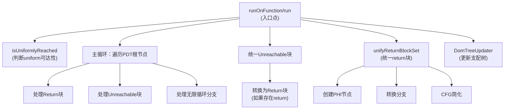

# AMDGPUUnifyDivergentExitNodes.cpp 代码功能详解

## 1. 主要功能概述

<a name="ref-block_0"></a>这个pass是`UnifyFunctionExitNodes` pass的变体，专门为AMDGPU架构设计。其**核心目标是确保函数中最多只有一个发散（divergent）退出块**。 llvm-project:8-11[<sup>↗</sup>](#block_0) 

**主要作用：**
- 解决StructurizeCFG pass无法处理的多退出区域问题
- 避免将uniform分支与divergent分支统一到同一返回块，以保持标量分支的使用
<a name="ref-block_1"></a>- 将unreachable指令替换为return指令，处理一个分支去return而另一个去unreachable的情况 llvm-project:13-18[<sup>↗</sup>](#block_1) 

**效果：**
- 统一所有发散的退出节点到单一退出块
- 保持CFG的非关键边特性
- 为后续的StructurizeCFG转换做准备

## 2. 主要功能步骤和子功能提取

通过遍历代码文件，可以识别出以下关键步骤和子功能：

### 核心子功能：
1. **`isUniformlyReached`** - 判断基本块是否通过uniform分支可达
2. **`run`** - 主执行函数
3. **`unifyReturnBlockSet`** - 统一多个返回块
4. **处理不同类型的退出节点** - 包括return、unreachable和无限循环

### 辅助功能：
- 支配树更新（使用DomTreeUpdater）
- CFG简化处理
- 分析依赖管理（getAnalysisUsage）

## 3. 各步骤/子功能的详细分析

### 3.1 `isUniformlyReached` 函数

<a name="ref-block_3"></a>**功能：** 检查一个基本块是否仅通过uniform分支可达。 llvm-project:116-118[<sup>↗</sup>](#block_3) 

**实现机制：**
- 使用深度优先搜索遍历所有前驱块
- 对每个访问的块检查其终结指令是否是uniform的
- 如果发现任何非uniform的终结指令，立即返回false
<a name="ref-block_4"></a>- 使用SmallPtrSet避免重复访问 llvm-project:119-133[<sup>↗</sup>](#block_4) 

### 3.2 `run` 主执行函数

<a name="ref-block_10"></a>**功能：** 这是pass的核心执行逻辑，处理所有类型的退出节点统一。 llvm-project:184-186[<sup>↗</sup>](#block_10) 

**执行流程分为以下几个阶段：**

#### 阶段1: 初始检查和准备
- 断言确保函数只有简单终结指令
<a name="ref-block_11"></a>- 检查后支配树的根节点数量，如果只有一个根且不是分支指令则直接返回 llvm-project:187-192[<sup>↗</sup>](#block_11) 

#### 阶段2: 收集退出块和判断是否需要统一
- 遍历后支配树的所有根节点
- 将退出块分类为ReturningBlocks（返回块）和UnreachableBlocks（不可达块）
<a name="ref-block_12"></a>- 使用`HasDivergentExitBlock`标志判断是否存在发散退出块 llvm-project:194-213[<sup>↗</sup>](#block_12) 

**关键设计决策：** 如果存在任何发散退出块，即使某些退出块是uniformly reachable的，也会统一所有退出块。这是为了解决structurizer的当前限制。 llvm-project:205-212 

#### 阶段3: 处理不同类型的退出节点

**a) 处理Return指令：**
- 跳过尾调用（musttail call）
<a name="ref-block_13"></a>- 如果存在发散退出块，将返回块添加到ReturningBlocks列表 llvm-project:215-220[<sup>↗</sup>](#block_13) 

**b) 处理Unreachable指令：**
<a name="ref-block_14"></a>- 如果存在发散退出块，将不可达块添加到UnreachableBlocks列表 llvm-project:221-223[<sup>↗</sup>](#block_14) 

**c) 处理无限循环（Branch指令）：**
这是最复杂的情况，用于处理无条件或条件分支形成的无限循环。

- 创建DummyReturnBlock作为虚拟退出
<a name="ref-block_15"></a>- 对于无条件分支：删除原分支，创建新的条件分支，一个分支指向原目标，另一个指向DummyReturnBlock llvm-project:224-241[<sup>↗</sup>](#block_15) 

<a name="ref-block_16"></a>- 对于条件分支：使用splitBasicBlock分割块，创建TransitionBlock，原块通过条件分支连接到TransitionBlock和DummyReturnBlock llvm-project:242-265[<sup>↗</sup>](#block_16) 

#### 阶段4: 统一Unreachable块
<a name="ref-block_17"></a>如果存在多个unreachable块，创建一个统一的UnifiedUnreachableBlock，将所有unreachable块的终结指令替换为到这个统一块的分支。 llvm-project:268-286[<sup>↗</sup>](#block_17) 

**特殊处理：** 如果同时存在return块和unreachable块，将unreachable块转换为return块：
- 插入`amdgcn.unreachable` intrinsic调用来标记这是不可达点
- 将unreachable指令替换为return指令（返回poison值）
<a name="ref-block_18"></a>- 将此块添加到ReturningBlocks列表 llvm-project:288-310[<sup>↗</sup>](#block_18) 

#### 阶段5: 统一Return块
<a name="ref-block_19"></a>如果存在多个返回块，调用`unifyReturnBlockSet`函数统一它们。 llvm-project:319-327[<sup>↗</sup>](#block_19) 

### 3.3 `unifyReturnBlockSet` 函数

<a name="ref-block_5"></a>**功能：** 将多个返回块统一为单一返回块。 llvm-project:136-138[<sup>↗</sup>](#block_5) 

**实现步骤：**

<a name="ref-block_6"></a>1. **创建新的统一返回块** llvm-project:142-143[<sup>↗</sup>](#block_6) 

2. **根据返回类型创建返回指令**
   - 如果是void类型，直接创建RetVoid
<a name="ref-block_7"></a>   - 否则创建PHI节点收集所有返回值，然后创建return指令 llvm-project:145-153[<sup>↗</sup>](#block_7) 

3. **转换所有返回块**
   - 为PHI节点添加incoming值（如果需要）
   - 删除原return指令
   - 创建到新返回块的无条件分支
<a name="ref-block_8"></a>   - 记录支配树更新信息 llvm-project:157-169[<sup>↗</sup>](#block_8) 

<a name="ref-block_9"></a>4. **应用支配树更新和CFG简化** llvm-project:171-179[<sup>↗</sup>](#block_9) 

### 3.4 分析依赖管理

**`getAnalysisUsage`函数** 声明pass所需的分析信息：
- 需要支配树（可选，根据RequireAndPreserveDomTree标志）
- 需要后支配树
- 需要UniformityInfo（用于判断分支是否uniform）
- 需要TargetTransformInfo
<a name="ref-block_2"></a>- 保持非关键边特性 llvm-project:95-114[<sup>↗</sup>](#block_2) 

## 4. 步骤/子功能之间的关系

### 调用关系图



### 数据流关系

1. **输入数据：**
   - Function对象
   - DominatorTree（可选）
   - PostDominatorTree（必需）
   - UniformityInfo（必需）
   - TargetTransformInfo（必需）

2. **中间数据结构：**
   - `ReturningBlocks`: 收集所有返回块
   - `UnreachableBlocks`: 收集所有不可达块
   - `DummyReturnBB`: 为无限循环创建的虚拟返回块
   - `Updates`: 支配树更新操作列表

3. **输出效果：**
   - 修改后的CFG，最多只有一个发散退出块
   - 更新的支配树（如果需要保持）

### 执行顺序依赖

1. **`isUniformlyReached`** 必须在确定是否需要统一退出块之前执行，因为它决定了`HasDivergentExitBlock`标志的值

2. **收集退出块** 必须在统一操作之前完成，因为统一操作需要知道所有需要处理的块

3. **处理Unreachable块** 必须在统一Return块之前进行，因为unreachable块可能被转换为return块并加入ReturningBlocks列表

4. **支配树更新** 在每个主要CFG修改阶段后执行，确保支配树信息的一致性

5. **CFG简化** 作为最后的清理步骤，在`unifyReturnBlockSet`中执行

### 条件依赖关系

- 只有当存在发散退出块时，才会统一所有退出节点
- 只有当同时存在return块和unreachable块时，才会将unreachable转换为return
- 只有当返回块数量大于1时，才会调用`unifyReturnBlockSet`

## Notes

这个pass是AMDGPU特定的优化，主要是为了解决GPU架构中的分支分歧（divergence）问题。在GPU上，同一个warp/wavefront中的线程执行相同的指令，当遇到分支时，如果不同线程走不同路径，就会产生分歧，影响性能。

关键设计要点：
- **Divergent vs Uniform**: Divergent分支指不同线程可能走不同路径，uniform分支指所有线程走相同路径
- **StructurizeCFG限制**: 这个pass为后续的StructurizeCFG pass做准备，后者需要单一退出点的结构化控制流
- **保留标量分支优化**: 通过只在必要时统一退出节点，避免不必要地将uniform分支与divergent分支混合，保持了使用高效标量分支指令的能力
- **无限循环处理**: 通过创建虚拟退出块和条件分支，巧妙地将无限循环转换为有退出点的循环结构
### Citations
<a name="block_0"></a>**File:** llvm/lib/Target/AMDGPU/AMDGPUUnifyDivergentExitNodes.cpp (L8-11) [<sup>↩</sup>](#ref-block_0)
```cpp
//
// This is a variant of the UnifyFunctionExitNodes pass. Rather than ensuring
// there is at most one ret and one unreachable instruction, it ensures there is
// at most one divergent exiting block.
```
<a name="block_1"></a>**File:** llvm/lib/Target/AMDGPU/AMDGPUUnifyDivergentExitNodes.cpp (L13-18) [<sup>↩</sup>](#ref-block_1)
```cpp
// StructurizeCFG can't deal with multi-exit regions formed by branches to
// multiple return nodes. It is not desirable to structurize regions with
// uniform branches, so unifying those to the same return block as divergent
// branches inhibits use of scalar branching. It still can't deal with the case
// where one branch goes to return, and one unreachable. Replace unreachable in
// this case with a return.
```
<a name="block_2"></a>**File:** llvm/lib/Target/AMDGPU/AMDGPUUnifyDivergentExitNodes.cpp (L95-114) [<sup>↩</sup>](#ref-block_2)
```cpp
void AMDGPUUnifyDivergentExitNodes::getAnalysisUsage(AnalysisUsage &AU) const {
  if (RequireAndPreserveDomTree)
    AU.addRequired<DominatorTreeWrapperPass>();

  AU.addRequired<PostDominatorTreeWrapperPass>();

  AU.addRequired<UniformityInfoWrapperPass>();

  if (RequireAndPreserveDomTree) {
    AU.addPreserved<DominatorTreeWrapperPass>();
    // FIXME: preserve PostDominatorTreeWrapperPass
  }

  // We preserve the non-critical-edgeness property
  AU.addPreservedID(BreakCriticalEdgesID);

  FunctionPass::getAnalysisUsage(AU);

  AU.addRequired<TargetTransformInfoWrapperPass>();
}
```
<a name="block_3"></a>**File:** llvm/lib/Target/AMDGPU/AMDGPUUnifyDivergentExitNodes.cpp (L116-118) [<sup>↩</sup>](#ref-block_3)
```cpp
/// \returns true if \p BB is reachable through only uniform branches.
/// XXX - Is there a more efficient way to find this?
static bool isUniformlyReached(const UniformityInfo &UA, BasicBlock &BB) {
```
<a name="block_4"></a>**File:** llvm/lib/Target/AMDGPU/AMDGPUUnifyDivergentExitNodes.cpp (L119-133) [<sup>↩</sup>](#ref-block_4)
```cpp
  SmallVector<BasicBlock *, 8> Stack(predecessors(&BB));
  SmallPtrSet<BasicBlock *, 8> Visited;

  while (!Stack.empty()) {
    BasicBlock *Top = Stack.pop_back_val();
    if (!UA.isUniform(Top->getTerminator()))
      return false;

    for (BasicBlock *Pred : predecessors(Top)) {
      if (Visited.insert(Pred).second)
        Stack.push_back(Pred);
    }
  }

  return true;
```
<a name="block_5"></a>**File:** llvm/lib/Target/AMDGPU/AMDGPUUnifyDivergentExitNodes.cpp (L136-138) [<sup>↩</sup>](#ref-block_5)
```cpp
BasicBlock *AMDGPUUnifyDivergentExitNodesImpl::unifyReturnBlockSet(
    Function &F, DomTreeUpdater &DTU, ArrayRef<BasicBlock *> ReturningBlocks,
    StringRef Name) {
```
<a name="block_6"></a>**File:** llvm/lib/Target/AMDGPU/AMDGPUUnifyDivergentExitNodes.cpp (L142-143) [<sup>↩</sup>](#ref-block_6)
```cpp
  BasicBlock *NewRetBlock = BasicBlock::Create(F.getContext(), Name, &F);
  IRBuilder<> B(NewRetBlock);
```
<a name="block_7"></a>**File:** llvm/lib/Target/AMDGPU/AMDGPUUnifyDivergentExitNodes.cpp (L145-153) [<sup>↩</sup>](#ref-block_7)
```cpp
  PHINode *PN = nullptr;
  if (F.getReturnType()->isVoidTy()) {
    B.CreateRetVoid();
  } else {
    // If the function doesn't return void... add a PHI node to the block...
    PN = B.CreatePHI(F.getReturnType(), ReturningBlocks.size(),
                     "UnifiedRetVal");
    B.CreateRet(PN);
  }
```
<a name="block_8"></a>**File:** llvm/lib/Target/AMDGPU/AMDGPUUnifyDivergentExitNodes.cpp (L157-169) [<sup>↩</sup>](#ref-block_8)
```cpp
  std::vector<DominatorTree::UpdateType> Updates;
  Updates.reserve(ReturningBlocks.size());
  for (BasicBlock *BB : ReturningBlocks) {
    // Add an incoming element to the PHI node for every return instruction that
    // is merging into this new block...
    if (PN)
      PN->addIncoming(BB->getTerminator()->getOperand(0), BB);

    // Remove and delete the return inst.
    BB->getTerminator()->eraseFromParent();
    BranchInst::Create(NewRetBlock, BB);
    Updates.emplace_back(DominatorTree::Insert, BB, NewRetBlock);
  }
```
<a name="block_9"></a>**File:** llvm/lib/Target/AMDGPU/AMDGPUUnifyDivergentExitNodes.cpp (L171-179) [<sup>↩</sup>](#ref-block_9)
```cpp
  if (RequireAndPreserveDomTree)
    DTU.applyUpdates(Updates);
  Updates.clear();

  for (BasicBlock *BB : ReturningBlocks) {
    // Cleanup possible branch to unconditional branch to the return.
    simplifyCFG(BB, *TTI, RequireAndPreserveDomTree ? &DTU : nullptr,
                SimplifyCFGOptions().bonusInstThreshold(2));
  }
```
<a name="block_10"></a>**File:** llvm/lib/Target/AMDGPU/AMDGPUUnifyDivergentExitNodes.cpp (L184-186) [<sup>↩</sup>](#ref-block_10)
```cpp
bool AMDGPUUnifyDivergentExitNodesImpl::run(Function &F, DominatorTree *DT,
                                            const PostDominatorTree &PDT,
                                            const UniformityInfo &UA) {
```
<a name="block_11"></a>**File:** llvm/lib/Target/AMDGPU/AMDGPUUnifyDivergentExitNodes.cpp (L187-192) [<sup>↩</sup>](#ref-block_11)
```cpp
  assert(hasOnlySimpleTerminator(F) && "Unsupported block terminator.");

  if (PDT.root_size() == 0 ||
      (PDT.root_size() == 1 &&
       !isa<BranchInst>(PDT.getRoot()->getTerminator())))
    return false;
```
<a name="block_12"></a>**File:** llvm/lib/Target/AMDGPU/AMDGPUUnifyDivergentExitNodes.cpp (L194-213) [<sup>↩</sup>](#ref-block_12)
```cpp
  // Loop over all of the blocks in a function, tracking all of the blocks that
  // return.
  SmallVector<BasicBlock *, 4> ReturningBlocks;
  SmallVector<BasicBlock *, 4> UnreachableBlocks;

  // Dummy return block for infinite loop.
  BasicBlock *DummyReturnBB = nullptr;

  bool Changed = false;
  std::vector<DominatorTree::UpdateType> Updates;

  // TODO: For now we unify all exit blocks, even though they are uniformly
  // reachable, if there are any exits not uniformly reached. This is to
  // workaround the limitation of structurizer, which can not handle multiple
  // function exits. After structurizer is able to handle multiple function
  // exits, we should only unify UnreachableBlocks that are not uniformly
  // reachable.
  bool HasDivergentExitBlock = llvm::any_of(
      PDT.roots(), [&](auto BB) { return !isUniformlyReached(UA, *BB); });

```
<a name="block_13"></a>**File:** llvm/lib/Target/AMDGPU/AMDGPUUnifyDivergentExitNodes.cpp (L215-220) [<sup>↩</sup>](#ref-block_13)
```cpp
    if (auto *RI = dyn_cast<ReturnInst>(BB->getTerminator())) {
      auto *CI = dyn_cast_or_null<CallInst>(RI->getPrevNode());
      if (CI && CI->isMustTailCall())
        continue;
      if (HasDivergentExitBlock)
        ReturningBlocks.push_back(BB);
```
<a name="block_14"></a>**File:** llvm/lib/Target/AMDGPU/AMDGPUUnifyDivergentExitNodes.cpp (L221-223) [<sup>↩</sup>](#ref-block_14)
```cpp
    } else if (isa<UnreachableInst>(BB->getTerminator())) {
      if (HasDivergentExitBlock)
        UnreachableBlocks.push_back(BB);
```
<a name="block_15"></a>**File:** llvm/lib/Target/AMDGPU/AMDGPUUnifyDivergentExitNodes.cpp (L224-241) [<sup>↩</sup>](#ref-block_15)
```cpp
    } else if (BranchInst *BI = dyn_cast<BranchInst>(BB->getTerminator())) {

      ConstantInt *BoolTrue = ConstantInt::getTrue(F.getContext());
      if (DummyReturnBB == nullptr) {
        DummyReturnBB = BasicBlock::Create(F.getContext(),
                                           "DummyReturnBlock", &F);
        Type *RetTy = F.getReturnType();
        Value *RetVal = RetTy->isVoidTy() ? nullptr : PoisonValue::get(RetTy);
        ReturnInst::Create(F.getContext(), RetVal, DummyReturnBB);
        ReturningBlocks.push_back(DummyReturnBB);
      }

      if (BI->isUnconditional()) {
        BasicBlock *LoopHeaderBB = BI->getSuccessor(0);
        BI->eraseFromParent(); // Delete the unconditional branch.
        // Add a new conditional branch with a dummy edge to the return block.
        BranchInst::Create(LoopHeaderBB, DummyReturnBB, BoolTrue, BB);
        Updates.emplace_back(DominatorTree::Insert, BB, DummyReturnBB);
```
<a name="block_16"></a>**File:** llvm/lib/Target/AMDGPU/AMDGPUUnifyDivergentExitNodes.cpp (L242-265) [<sup>↩</sup>](#ref-block_16)
```cpp
      } else { // Conditional branch.
        SmallVector<BasicBlock *, 2> Successors(successors(BB));

        // Create a new transition block to hold the conditional branch.
        BasicBlock *TransitionBB = BB->splitBasicBlock(BI, "TransitionBlock");

        Updates.reserve(Updates.size() + 2 * Successors.size() + 2);

        // 'Successors' become successors of TransitionBB instead of BB,
        // and TransitionBB becomes a single successor of BB.
        Updates.emplace_back(DominatorTree::Insert, BB, TransitionBB);
        for (BasicBlock *Successor : Successors) {
          Updates.emplace_back(DominatorTree::Insert, TransitionBB, Successor);
          Updates.emplace_back(DominatorTree::Delete, BB, Successor);
        }

        // Create a branch that will always branch to the transition block and
        // references DummyReturnBB.
        BB->getTerminator()->eraseFromParent();
        BranchInst::Create(TransitionBB, DummyReturnBB, BoolTrue, BB);
        Updates.emplace_back(DominatorTree::Insert, BB, DummyReturnBB);
      }
      Changed = true;
    }
```
<a name="block_17"></a>**File:** llvm/lib/Target/AMDGPU/AMDGPUUnifyDivergentExitNodes.cpp (L268-286) [<sup>↩</sup>](#ref-block_17)
```cpp
  if (!UnreachableBlocks.empty()) {
    BasicBlock *UnreachableBlock = nullptr;

    if (UnreachableBlocks.size() == 1) {
      UnreachableBlock = UnreachableBlocks.front();
    } else {
      UnreachableBlock = BasicBlock::Create(F.getContext(),
                                            "UnifiedUnreachableBlock", &F);
      new UnreachableInst(F.getContext(), UnreachableBlock);

      Updates.reserve(Updates.size() + UnreachableBlocks.size());
      for (BasicBlock *BB : UnreachableBlocks) {
        // Remove and delete the unreachable inst.
        BB->getTerminator()->eraseFromParent();
        BranchInst::Create(UnreachableBlock, BB);
        Updates.emplace_back(DominatorTree::Insert, BB, UnreachableBlock);
      }
      Changed = true;
    }
```
<a name="block_18"></a>**File:** llvm/lib/Target/AMDGPU/AMDGPUUnifyDivergentExitNodes.cpp (L288-310) [<sup>↩</sup>](#ref-block_18)
```cpp
    if (!ReturningBlocks.empty()) {
      // Don't create a new unreachable inst if we have a return. The
      // structurizer/annotator can't handle the multiple exits

      Type *RetTy = F.getReturnType();
      Value *RetVal = RetTy->isVoidTy() ? nullptr : PoisonValue::get(RetTy);
      // Remove and delete the unreachable inst.
      UnreachableBlock->getTerminator()->eraseFromParent();

      Function *UnreachableIntrin = Intrinsic::getOrInsertDeclaration(
          F.getParent(), Intrinsic::amdgcn_unreachable);

      // Insert a call to an intrinsic tracking that this is an unreachable
      // point, in case we want to kill the active lanes or something later.
      CallInst::Create(UnreachableIntrin, {}, "", UnreachableBlock);

      // Don't create a scalar trap. We would only want to trap if this code was
      // really reached, but a scalar trap would happen even if no lanes
      // actually reached here.
      ReturnInst::Create(F.getContext(), RetVal, UnreachableBlock);
      ReturningBlocks.push_back(UnreachableBlock);
      Changed = true;
    }
```
<a name="block_19"></a>**File:** llvm/lib/Target/AMDGPU/AMDGPUUnifyDivergentExitNodes.cpp (L319-327) [<sup>↩</sup>](#ref-block_19)
```cpp
  // Now handle return blocks.
  if (ReturningBlocks.empty())
    return Changed; // No blocks return

  if (ReturningBlocks.size() == 1)
    return Changed; // Already has a single return block

  unifyReturnBlockSet(F, DTU, ReturningBlocks, "UnifiedReturnBlock");
  return true;
```