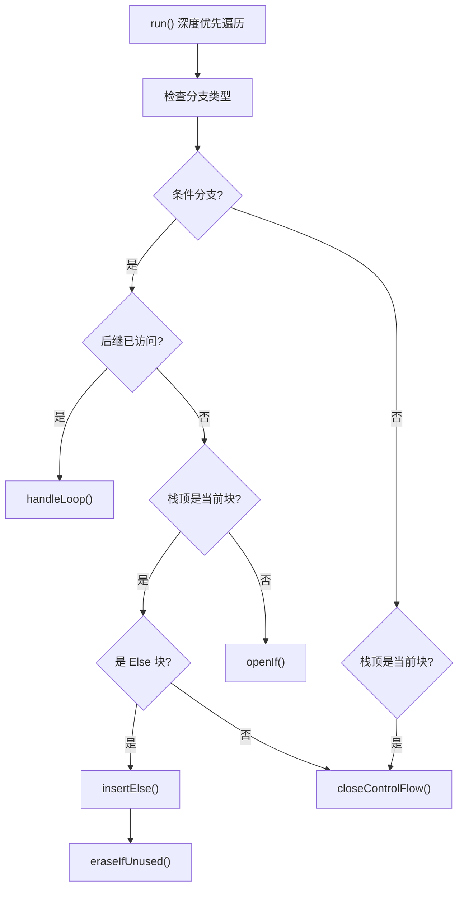

# SIAnnotateControlFlow.cpp 代码功能分析

## 1. Pass 的主要功能概述

<a name="ref-block_0"></a>**SIAnnotateControlFlow** 是一个 LLVM 编译器 pass，专门为 AMD GPU (AMDGPU) 硬件标注控制流。 llvm-project:10-10[<sup>↗</sup>](#block_0) 

该 pass 的主要作用是：
- 在中间表示（IR）中的控制流结构（if/then/else 和循环）上插入硬件特定的内建函数（intrinsics）
- 使后端能够识别和正确处理这些控制流结构
- 针对 AMD GPU 的 SIMT（单指令多线程）执行模型进行优化

其效果是将结构化的控制流转换为包含 AMDGPU 特定内建函数的形式，这些内建函数包括 `amdgcn_if`、`amdgcn_else`、`amdgcn_loop`、`amdgcn_if_break` 和 `amdgcn_end_cf`，以便硬件能够正确管理执行掩码（execution mask）。

## 2. 实现主要功能的步骤和子功能

该 pass 包含以下核心步骤和子功能：

<a name="ref-block_1"></a>### 2.1 初始化（initialize） llvm-project:112-125[<sup>↗</sup>](#block_1) 

<a name="ref-block_2"></a>### 2.2 一致性判断（isUniform） llvm-project:129-131[<sup>↗</sup>](#block_2) 

### 2.3 栈管理操作
<a name="ref-block_3"></a>- **isTopOfStack**: 检查基本块是否在栈顶 llvm-project:134-136[<sup>↗</sup>](#block_3) 
<a name="ref-block_4"></a>- **popSaved**: 从控制流栈弹出值 llvm-project:139-141[<sup>↗</sup>](#block_4) 
<a name="ref-block_5"></a>- **push**: 将基本块和保存的值压入栈 llvm-project:144-146[<sup>↗</sup>](#block_5) 

<a name="ref-block_6"></a>### 2.4 Else 块检测（isElse） llvm-project:150-165[<sup>↗</sup>](#block_6) 

<a name="ref-block_7"></a>### 2.5 Kill 指令检测（hasKill） llvm-project:167-174[<sup>↗</sup>](#block_7) 

<a name="ref-block_8"></a>### 2.6 未使用 PHI 节点清理（eraseIfUnused） llvm-project:177-182[<sup>↗</sup>](#block_8) 

<a name="ref-block_9"></a>### 2.7 打开 If 块（openIf） llvm-project:185-197[<sup>↗</sup>](#block_9) 

<a name="ref-block_10"></a>### 2.8 插入 Else 块（insertElse） llvm-project:200-213[<sup>↗</sup>](#block_10) 

<a name="ref-block_11"></a>### 2.9 循环条件处理（handleLoopCondition） llvm-project:216-255[<sup>↗</sup>](#block_11) 

<a name="ref-block_12"></a>### 2.10 循环处理（handleLoop） llvm-project:258-294[<sup>↗</sup>](#block_12) 

<a name="ref-block_13"></a>### 2.11 关闭控制流（closeControlFlow） llvm-project:297-337[<sup>↗</sup>](#block_13) 

<a name="ref-block_14"></a>### 2.12 主运行函数（run） llvm-project:341-386[<sup>↗</sup>](#block_14) 

## 3. 各步骤的具体描述和分析

### 3.1 初始化（initialize）
该函数初始化 pass 中使用的所有类型和常量：
- 根据 GPU 是 wave32 还是 wave64 模式设置 `IntMask` 类型（32 位或 64 位整数）
- 创建布尔类型、空类型和返回结构类型
- 初始化常量：true、false、poison 值和零掩码

### 3.2 一致性判断（isUniform）
判断分支指令的条件是否一致（uniform）：
- 检查 UniformityAnalysis 的结果
- 或检查是否有 "structurizecfg.uniform" 元数据标记
- 一致的分支意味着所有工作项执行相同路径，不需要插入特殊的控制流内建函数

### 3.3 栈管理操作
使用栈来跟踪嵌套的控制流结构：
- 栈存储基本块和对应的执行掩码值对
- 用于匹配 if 的开始和结束，以及 else 块的处理
- 确保控制流正确嵌套和闭合

### 3.4 Else 块检测（isElse）
检查 PHI 节点是否代表 else 分支的条件：
- 检查来自立即支配者（IDom）的值是否为 true
- 检查其他输入值是否为 false
- 这种模式表明这是一个 else 块的合并点

### 3.5 Kill 指令检测（hasKill）
检查基本块中是否包含 `amdgcn_kill` 内建函数：
- Kill 指令会影响控制流处理
- 存在 kill 指令的块需要特殊处理

### 3.6 未使用 PHI 节点清理（eraseIfUnused）
递归删除无用的 PHI 节点：
- 在插入 else 后，原始条件 PHI 可能变得无用
- 清理这些节点以优化代码

### 3.7 打开 If 块（openIf）
为非一致分支插入 `amdgcn_if` 内建函数：
- 调用 `amdgcn_if` 内建函数，传入原始条件
- 返回值包含新条件和执行掩码
- 提取这两个值，用新条件替换原始条件
- 将掩码值压入栈中，用于后续的 else 或 end_cf

### 3.8 插入 Else 块（insertElse）
关闭当前 if 块并开启新的 else 块：
- 调用 `amdgcn_else` 内建函数，传入从栈中弹出的掩码
- 返回新的条件和掩码
- 更新分支条件并将新掩码压入栈

### 3.9 循环条件处理（handleLoopCondition）
递归处理循环的退出条件：
- 插入 `amdgcn_if_break` 内建函数
- 根据条件定义的位置选择插入点
- 如果条件在循环内定义，插入在循环头
- 处理常量条件和参数条件的特殊情况

### 3.10 循环处理（handleLoop）
处理循环的回边（back edge）：
- 创建 `phi.broken` PHI 节点来跟踪已退出循环的线程
- 调用 `handleLoopCondition` 处理循环条件
- 为所有前驱块设置 PHI 节点的输入值
- 插入 `amdgcn_loop` 内建函数
- 将循环条件设置为 true，用 loop 调用的结果作为实际条件

### 3.11 关闭控制流（closeControlFlow）
关闭打开的控制流结构：
- 从栈中弹出保存的执行掩码
- 对于循环头，需要分割基本块以避免在每次迭代中执行 end_cf
- 确保掩码定义支配使用点，必要时分割边
- 插入 `amdgcn_end_cf` 内建函数来恢复执行掩码

### 3.12 主运行函数（run）
遍历函数的所有基本块进行标注：
- 使用深度优先遍历处理所有基本块
- 对于条件分支：
  - 检查后继是否已访问（回边，可能是循环）
  - 检查是否需要关闭控制流
  - 检查是否是 else 块并插入 else
  - 打开新的 if 块
- 对于非条件分支：检查是否需要关闭控制流
- 最后验证栈为空，确保所有控制流都已正确闭合

## 4. 步骤和子功能之间的关系

### 4.1 执行流程关系

主执行流程由 `run()` 函数驱动，它协调所有子功能的调用：



### 4.2 栈管理关系

栈操作贯穿整个控制流处理：

- `openIf()` 和 `insertElse()` 调用 `push()` 保存执行掩码
- `closeControlFlow()` 和 `insertElse()` 调用 `popSaved()` 获取掩码
- `isTopOfStack()` 用于判断何时关闭控制流

### 4.3 条件判断关系

多个判断函数协同工作：

- `isUniform()`: 决定是否需要插入内建函数
- `isElse()`: 配合 `hasKill()` 决定是否插入 else 块
- 这些判断影响 `openIf()`、`insertElse()` 和 `handleLoop()` 的执行

### 4.4 循环处理关系

循环处理是一个层次化过程：

- `handleLoop()` 是顶层函数，创建 PHI 节点和调用框架
- `handleLoopCondition()` 递归处理具体的条件插入位置
- 两者共同完成循环的标注

### 4.5 清理和优化关系

- `eraseIfUnused()` 在 `insertElse()` 后执行，清理不再需要的 PHI 节点
- `closeControlFlow()` 确保所有打开的控制流都被正确关闭
- 这些操作维护 IR 的正确性和效率

### 4.6 内建函数插入顺序

标注过程按特定顺序插入内建函数：

1. **If 开始**: `openIf()` → `amdgcn_if`
2. **Else 转换**: `insertElse()` → `amdgcn_else`
3. **循环处理**: `handleLoop()` / `handleLoopCondition()` → `amdgcn_if_break` + `amdgcn_loop`
4. **控制流结束**: `closeControlFlow()` → `amdgcn_end_cf`

这个顺序确保执行掩码在 GPU 的 SIMT 执行模型中被正确管理。

## Notes

- 该 pass 依赖于 StructurizeCFG pass 的前置处理，后者将 CFG 转换为结构化形式
- Wave32 和 Wave64 是 AMD GPU 的两种执行模式，影响执行掩码的位宽
- 执行掩码用于跟踪 wavefront 中哪些线程（lanes）处于活跃状态
- 该 pass 同时提供了新版本的 Pass Manager 接口（`SIAnnotateControlFlowPass`）和遗留接口（`SIAnnotateControlFlowLegacy`）
### Citations
<a name="block_0"></a>**File:** llvm/lib/Target/AMDGPU/SIAnnotateControlFlow.cpp (L10-10) [<sup>↩</sup>](#ref-block_0)
```cpp
/// Annotates the control flow with hardware specific intrinsics.
```
<a name="block_1"></a>**File:** llvm/lib/Target/AMDGPU/SIAnnotateControlFlow.cpp (L112-125) [<sup>↩</sup>](#ref-block_1)
```cpp
void SIAnnotateControlFlow::initialize(const GCNSubtarget &ST) {
  LLVMContext &Context = F->getContext();

  Void = Type::getVoidTy(Context);
  Boolean = Type::getInt1Ty(Context);
  IntMask = ST.isWave32() ? Type::getInt32Ty(Context)
                           : Type::getInt64Ty(Context);
  ReturnStruct = StructType::get(Boolean, IntMask);

  BoolTrue = ConstantInt::getTrue(Context);
  BoolFalse = ConstantInt::getFalse(Context);
  BoolPoison = PoisonValue::get(Boolean);
  IntMaskZero = ConstantInt::get(IntMask, 0);
}
```
<a name="block_2"></a>**File:** llvm/lib/Target/AMDGPU/SIAnnotateControlFlow.cpp (L129-131) [<sup>↩</sup>](#ref-block_2)
```cpp
bool SIAnnotateControlFlow::isUniform(BranchInst *T) {
  return UA->isUniform(T) || T->hasMetadata("structurizecfg.uniform");
}
```
<a name="block_3"></a>**File:** llvm/lib/Target/AMDGPU/SIAnnotateControlFlow.cpp (L134-136) [<sup>↩</sup>](#ref-block_3)
```cpp
bool SIAnnotateControlFlow::isTopOfStack(BasicBlock *BB) {
  return !Stack.empty() && Stack.back().first == BB;
}
```
<a name="block_4"></a>**File:** llvm/lib/Target/AMDGPU/SIAnnotateControlFlow.cpp (L139-141) [<sup>↩</sup>](#ref-block_4)
```cpp
Value *SIAnnotateControlFlow::popSaved() {
  return Stack.pop_back_val().second;
}
```
<a name="block_5"></a>**File:** llvm/lib/Target/AMDGPU/SIAnnotateControlFlow.cpp (L144-146) [<sup>↩</sup>](#ref-block_5)
```cpp
void SIAnnotateControlFlow::push(BasicBlock *BB, Value *Saved) {
  Stack.push_back(std::pair(BB, Saved));
}
```
<a name="block_6"></a>**File:** llvm/lib/Target/AMDGPU/SIAnnotateControlFlow.cpp (L150-165) [<sup>↩</sup>](#ref-block_6)
```cpp
bool SIAnnotateControlFlow::isElse(PHINode *Phi) {
  BasicBlock *IDom = DT->getNode(Phi->getParent())->getIDom()->getBlock();
  for (unsigned i = 0, e = Phi->getNumIncomingValues(); i != e; ++i) {
    if (Phi->getIncomingBlock(i) == IDom) {

      if (Phi->getIncomingValue(i) != BoolTrue)
        return false;

    } else {
      if (Phi->getIncomingValue(i) != BoolFalse)
        return false;

    }
  }
  return true;
}
```
<a name="block_7"></a>**File:** llvm/lib/Target/AMDGPU/SIAnnotateControlFlow.cpp (L167-174) [<sup>↩</sup>](#ref-block_7)
```cpp
bool SIAnnotateControlFlow::hasKill(const BasicBlock *BB) {
  for (const Instruction &I : *BB) {
    if (const CallInst *CI = dyn_cast<CallInst>(&I))
      if (CI->getIntrinsicID() == Intrinsic::amdgcn_kill)
        return true;
  }
  return false;
}
```
<a name="block_8"></a>**File:** llvm/lib/Target/AMDGPU/SIAnnotateControlFlow.cpp (L177-182) [<sup>↩</sup>](#ref-block_8)
```cpp
bool SIAnnotateControlFlow::eraseIfUnused(PHINode *Phi) {
  bool Changed = RecursivelyDeleteDeadPHINode(Phi);
  if (Changed)
    LLVM_DEBUG(dbgs() << "Erased unused condition phi\n");
  return Changed;
}
```
<a name="block_9"></a>**File:** llvm/lib/Target/AMDGPU/SIAnnotateControlFlow.cpp (L185-197) [<sup>↩</sup>](#ref-block_9)
```cpp
bool SIAnnotateControlFlow::openIf(BranchInst *Term) {
  if (isUniform(Term))
    return false;

  IRBuilder<> IRB(Term);
  Value *IfCall = IRB.CreateCall(getDecl(If, Intrinsic::amdgcn_if, IntMask),
                                 {Term->getCondition()});
  Value *Cond = IRB.CreateExtractValue(IfCall, {0});
  Value *Mask = IRB.CreateExtractValue(IfCall, {1});
  Term->setCondition(Cond);
  push(Term->getSuccessor(1), Mask);
  return true;
}
```
<a name="block_10"></a>**File:** llvm/lib/Target/AMDGPU/SIAnnotateControlFlow.cpp (L200-213) [<sup>↩</sup>](#ref-block_10)
```cpp
bool SIAnnotateControlFlow::insertElse(BranchInst *Term) {
  if (isUniform(Term)) {
    return false;
  }

  IRBuilder<> IRB(Term);
  Value *ElseCall = IRB.CreateCall(
      getDecl(Else, Intrinsic::amdgcn_else, {IntMask, IntMask}), {popSaved()});
  Value *Cond = IRB.CreateExtractValue(ElseCall, {0});
  Value *Mask = IRB.CreateExtractValue(ElseCall, {1});
  Term->setCondition(Cond);
  push(Term->getSuccessor(1), Mask);
  return true;
}
```
<a name="block_11"></a>**File:** llvm/lib/Target/AMDGPU/SIAnnotateControlFlow.cpp (L216-255) [<sup>↩</sup>](#ref-block_11)
```cpp
Value *SIAnnotateControlFlow::handleLoopCondition(
    Value *Cond, PHINode *Broken, llvm::Loop *L, BranchInst *Term) {

  auto CreateBreak = [this, Cond, Broken](Instruction *I) -> CallInst * {
    return IRBuilder<>(I).CreateCall(
        getDecl(IfBreak, Intrinsic::amdgcn_if_break, IntMask), {Cond, Broken});
  };

  if (Instruction *Inst = dyn_cast<Instruction>(Cond)) {
    BasicBlock *Parent = Inst->getParent();
    Instruction *Insert;
    if (LI->getLoopFor(Parent) == L) {
      // Insert IfBreak in the same BB as Cond, which can help
      // SILowerControlFlow to know that it does not have to insert an
      // AND with EXEC.
      Insert = Parent->getTerminator();
    } else if (L->contains(Inst)) {
      Insert = Term;
    } else {
      Insert = &*L->getHeader()->getFirstNonPHIOrDbgOrLifetime();
    }

    return CreateBreak(Insert);
  }

  // Insert IfBreak in the loop header TERM for constant COND other than true.
  if (isa<Constant>(Cond)) {
    Instruction *Insert = Cond == BoolTrue ?
      Term : L->getHeader()->getTerminator();

    return CreateBreak(Insert);
  }

  if (isa<Argument>(Cond)) {
    Instruction *Insert = &*L->getHeader()->getFirstNonPHIOrDbgOrLifetime();
    return CreateBreak(Insert);
  }

  llvm_unreachable("Unhandled loop condition!");
}
```
<a name="block_12"></a>**File:** llvm/lib/Target/AMDGPU/SIAnnotateControlFlow.cpp (L258-294) [<sup>↩</sup>](#ref-block_12)
```cpp
bool SIAnnotateControlFlow::handleLoop(BranchInst *Term) {
  if (isUniform(Term))
    return false;

  BasicBlock *BB = Term->getParent();
  llvm::Loop *L = LI->getLoopFor(BB);
  if (!L)
    return false;

  BasicBlock *Target = Term->getSuccessor(1);
  PHINode *Broken = PHINode::Create(IntMask, 0, "phi.broken");
  Broken->insertBefore(Target->begin());

  Value *Cond = Term->getCondition();
  Term->setCondition(BoolTrue);
  Value *Arg = handleLoopCondition(Cond, Broken, L, Term);

  for (BasicBlock *Pred : predecessors(Target)) {
    Value *PHIValue = IntMaskZero;
    if (Pred == BB) // Remember the value of the previous iteration.
      PHIValue = Arg;
    // If the backedge from Pred to Target could be executed before the exit
    // of the loop at BB, it should not reset or change "Broken", which keeps
    // track of the number of threads exited the loop at BB.
    else if (L->contains(Pred) && DT->dominates(Pred, BB))
      PHIValue = Broken;
    Broken->addIncoming(PHIValue, Pred);
  }

  CallInst *LoopCall = IRBuilder<>(Term).CreateCall(
      getDecl(Loop, Intrinsic::amdgcn_loop, IntMask), {Arg});
  Term->setCondition(LoopCall);

  push(Term->getSuccessor(0), Arg);

  return true;
}
```
<a name="block_13"></a>**File:** llvm/lib/Target/AMDGPU/SIAnnotateControlFlow.cpp (L297-337) [<sup>↩</sup>](#ref-block_13)
```cpp
bool SIAnnotateControlFlow::closeControlFlow(BasicBlock *BB) {
  llvm::Loop *L = LI->getLoopFor(BB);

  assert(Stack.back().first == BB);

  if (L && L->getHeader() == BB) {
    // We can't insert an EndCF call into a loop header, because it will
    // get executed on every iteration of the loop, when it should be
    // executed only once before the loop.
    SmallVector <BasicBlock *, 8> Latches;
    L->getLoopLatches(Latches);

    SmallVector<BasicBlock *, 2> Preds;
    for (BasicBlock *Pred : predecessors(BB)) {
      if (!is_contained(Latches, Pred))
        Preds.push_back(Pred);
    }

    BB = SplitBlockPredecessors(BB, Preds, "endcf.split", DT, LI, nullptr,
                                false);
  }

  Value *Exec = popSaved();
  BasicBlock::iterator FirstInsertionPt = BB->getFirstInsertionPt();
  if (!isa<UndefValue>(Exec) && !isa<UnreachableInst>(FirstInsertionPt)) {
    Instruction *ExecDef = cast<Instruction>(Exec);
    BasicBlock *DefBB = ExecDef->getParent();
    if (!DT->dominates(DefBB, BB)) {
      // Split edge to make Def dominate Use
      FirstInsertionPt = SplitEdge(DefBB, BB, DT, LI)->getFirstInsertionPt();
    }
    IRBuilder<> IRB(FirstInsertionPt->getParent(), FirstInsertionPt);
    // TODO: StructurizeCFG 'Flow' blocks have debug locations from the
    // condition, for now just avoid copying these DebugLocs so that stepping
    // out of the then/else block in a debugger doesn't step to the condition.
    IRB.SetCurrentDebugLocation(DebugLoc());
    IRB.CreateCall(getDecl(EndCf, Intrinsic::amdgcn_end_cf, IntMask), {Exec});
  }

  return true;
}
```
<a name="block_14"></a>**File:** llvm/lib/Target/AMDGPU/SIAnnotateControlFlow.cpp (L341-386) [<sup>↩</sup>](#ref-block_14)
```cpp
bool SIAnnotateControlFlow::run() {
  bool Changed = false;

  for (df_iterator<BasicBlock *> I = df_begin(&F->getEntryBlock()),
                                 E = df_end(&F->getEntryBlock());
       I != E; ++I) {
    BasicBlock *BB = *I;
    BranchInst *Term = dyn_cast<BranchInst>(BB->getTerminator());

    if (!Term || Term->isUnconditional()) {
      if (isTopOfStack(BB))
        Changed |= closeControlFlow(BB);

      continue;
    }

    if (I.nodeVisited(Term->getSuccessor(1))) {
      if (isTopOfStack(BB))
        Changed |= closeControlFlow(BB);

      if (DT->dominates(Term->getSuccessor(1), BB))
        Changed |= handleLoop(Term);
      continue;
    }

    if (isTopOfStack(BB)) {
      PHINode *Phi = dyn_cast<PHINode>(Term->getCondition());
      if (Phi && Phi->getParent() == BB && isElse(Phi) && !hasKill(BB)) {
        Changed |= insertElse(Term);
        Changed |= eraseIfUnused(Phi);
        continue;
      }

      Changed |= closeControlFlow(BB);
    }

    Changed |= openIf(Term);
  }

  if (!Stack.empty()) {
    // CFG was probably not structured.
    report_fatal_error("failed to annotate CFG");
  }

  return Changed;
}
```