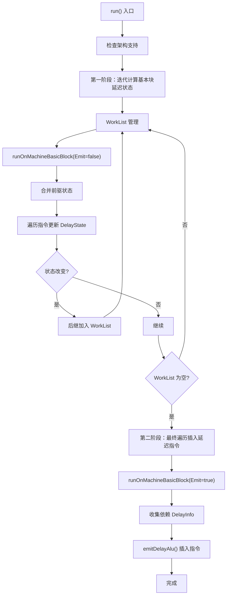

# AMDGPUInsertDelayAlu Pass 代码功能分析

## 1. Pass 主要功能概括

<a name="ref-block_0"></a>该 Pass 的主要功能是**在 GFX11+ 架构的 AMDGPU 上插入 `s_delay_alu` 指令以避免流水线停顿（stall）**。 llvm-project:10-10[<sup>↗</sup>](#block_0) 

**作用与效果：**
- 通过在依赖指令之间插入延迟指令，确保数据依赖的正确性
- 避免硬件流水线因为数据未就绪而产生的性能停顿
- 优化 VALU（向量 ALU）、TRANS（超越函数）和 SALU（标量 ALU）指令之间的调度

## 2. 主要实现步骤与子功能

通过遍历代码，该 Pass 的实现主要包含以下核心步骤和子功能：

### 2.1 延迟信息跟踪（DelayInfo 结构）
### 2.2 延迟状态管理（DelayState 结构）
### 2.3 指令等待判断
### 2.4 基本块延迟状态计算
### 2.5 延迟指令插入

## 3. 各子功能的具体描述分析

### 3.1 延迟信息跟踪（DelayInfo）

<a name="ref-block_3"></a>**DelayInfo 结构**用于记录某个寄存器单元的写入延迟信息： llvm-project:83-217[<sup>↗</sup>](#block_3) 

**核心字段：**
- `VALUCycles` 和 `VALUNum`：跟踪 VALU 指令的完成周期和距离
- `TRANSCycles` 和 `TRANSNum`：跟踪 TRANS 指令的完成周期和距离
- `TRANSNumVALU`：用于判断 TRANS 和 VALU 依赖关系
- `SALUCycles`：跟踪 SALU 指令的完成周期

**关键方法：**
- `merge()`：合并多个路径的延迟信息，取最坏情况 llvm-project:150-157 
- `advance()`：随着指令发射更新延迟信息，如果延迟已失效则返回 true llvm-project:162-199 

### 3.2 延迟状态管理（DelayState）

<a name="ref-block_4"></a>**DelayState** 是从寄存器单元到 DelayInfo 的映射表： llvm-project:220-276[<sup>↗</sup>](#block_4) 

**功能：**
- `merge()`：合并来自多个前驱基本块的延迟状态
- `advance()`：推进所有寄存器单元的延迟状态，移除已失效的条目
- `advanceByVALUNum()`：根据 VALU 指令数量推进状态，用于处理特定的等待场景

### 3.3 指令等待判断

该 Pass 实现了两个关键的等待判断函数：

**（1）instructionWaitsForVALU()**
<a name="ref-block_1"></a>判断指令是否等待所有未完成的 VALU 指令： llvm-project:34-48[<sup>↗</sup>](#block_1) 

会等待 VALU 的指令类型包括：DS、EXP、FLAT、MIMG、MTBUF、MUBUF 以及特定的 SENDMSG 和 WAITCNT 指令。

**（2）instructionWaitsForSGPRWrites()**
<a name="ref-block_2"></a>判断指令是否等待 SGPR（标量寄存器）写入完成： llvm-project:50-63[<sup>↗</sup>](#block_2) 

SMRD 和带寄存器操作数的 SALU 指令会等待 SGPR 写入。

### 3.4 基本块延迟状态计算

<a name="ref-block_6"></a>**runOnMachineBasicBlock() 方法**是处理单个基本块的核心逻辑： llvm-project:346-453[<sup>↗</sup>](#block_6) 

**处理流程：**

1. **合并前驱状态**：从所有前驱基本块合并延迟状态 llvm-project:347-349 

2. **遍历指令**：处理每条非元指令 llvm-project:361-363 

3. **处理 SGPR 等待**：如果指令等待 SGPR，清除相关的 VALU 延迟 llvm-project:373-380 

4. **处理 VALU 等待**：如果指令等待 VALU 完成，清空所有延迟状态 llvm-project:382-385 

5. **收集依赖**：扫描指令的显式使用操作数，收集依赖的延迟信息 llvm-project:389-404 

6. **插入延迟指令**：在 Emit 模式下调用 `emitDelayAlu()` 插入延迟指令 llvm-project:416-420 

7. **更新写入状态**：记录指令写入的寄存器及其延迟信息 llvm-project:424-430 

8. **推进状态**：根据指令发射周期数推进延迟状态 llvm-project:436-440 

### 3.5 延迟指令插入（emitDelayAlu）

<a name="ref-block_5"></a>**emitDelayAlu() 方法**负责生成和插入 `s_delay_alu` 指令： llvm-project:282-344[<sup>↗</sup>](#block_5) 

**编码逻辑：**
1. 编码 TRANS 延迟（如果需要） llvm-project:287-288 
2. 编码 VALU 延迟（如果比 TRANS 更近） llvm-project:292-298 
3. 编码 SALU 延迟（如果有空间） llvm-project:301-311 

**优化：**尝试复用最近的 `s_delay_alu` 指令，在单条指令中编码两个延迟 llvm-project:319-336 

## 4. 步骤与子功能之间的关系

整个 Pass 的执行流程呈现**两阶段数据流分析**模式：



**关键关系：**

1. **DelayInfo ← DelayState**：DelayState 是 DelayInfo 的容器，管理多个寄存器单元的延迟
2. **指令等待判断 → 状态清理**：`instructionWaitsForVALU()` 和 `instructionWaitsForSGPRWrites()` 的结果决定是否清空 DelayState
3. **状态计算 → 指令插入**：第一阶段计算出的 BlockState 确保第二阶段插入指令时有完整的数据流信息
4. **合并操作支持控制流**：通过 `merge()` 操作处理控制流汇聚点，取最坏情况保证正确性
5. **指令编码优化**：`emitDelayAlu()` 尝试复用已有的延迟指令，减少指令开销

**两阶段设计的原因：**
<a name="ref-block_8"></a>第一阶段通过不断迭代直到达到不动点，确保跨基本块的延迟信息传播正确；第二阶段在已知完整信息的情况下插入实际的延迟指令。 llvm-project:467-486[<sup>↗</sup>](#block_8) 

## Notes

<a name="ref-block_7"></a>- 该 Pass 专门针对 GFX11+ 架构，通过 `hasDelayAlu()` 检查确保只在支持的架构上运行 llvm-project:460-461[<sup>↗</sup>](#block_7) 
- 延迟计算使用调度模型（`SchedModel`）来获取指令的操作数延迟 llvm-project:426-429 
- 对于 `V_WRITELANE_B32` 等特殊指令，需要忽略绑定的操作数以避免插入冗余延迟 llvm-project:394-395 
<a name="ref-block_9"></a>- Pass 保持 CFG 不变，只插入新指令不修改控制流 llvm-project:497-498[<sup>↗</sup>](#block_9)
### Citations
<a name="block_0"></a>**File:** llvm/lib/Target/AMDGPU/AMDGPUInsertDelayAlu.cpp (L10-10) [<sup>↩</sup>](#ref-block_0)
```cpp
/// Insert s_delay_alu instructions to avoid stalls on GFX11+.
```
<a name="block_1"></a>**File:** llvm/lib/Target/AMDGPU/AMDGPUInsertDelayAlu.cpp (L34-48) [<sup>↩</sup>](#ref-block_1)
```cpp
  static bool instructionWaitsForVALU(const MachineInstr &MI) {
    // These instruction types wait for VA_VDST==0 before issuing.
    const uint64_t VA_VDST_0 = SIInstrFlags::DS | SIInstrFlags::EXP |
                               SIInstrFlags::FLAT | SIInstrFlags::MIMG |
                               SIInstrFlags::MTBUF | SIInstrFlags::MUBUF;
    if (MI.getDesc().TSFlags & VA_VDST_0)
      return true;
    if (MI.getOpcode() == AMDGPU::S_SENDMSG_RTN_B32 ||
        MI.getOpcode() == AMDGPU::S_SENDMSG_RTN_B64)
      return true;
    if (MI.getOpcode() == AMDGPU::S_WAITCNT_DEPCTR &&
        AMDGPU::DepCtr::decodeFieldVaVdst(MI.getOperand(0).getImm()) == 0)
      return true;
    return false;
  }
```
<a name="block_2"></a>**File:** llvm/lib/Target/AMDGPU/AMDGPUInsertDelayAlu.cpp (L50-63) [<sup>↩</sup>](#ref-block_2)
```cpp
  static bool instructionWaitsForSGPRWrites(const MachineInstr &MI) {
    // These instruction types wait for VA_SDST==0 before issuing.
    uint64_t MIFlags = MI.getDesc().TSFlags;
    if (MIFlags & SIInstrFlags::SMRD)
      return true;

    if (MIFlags & SIInstrFlags::SALU) {
      for (auto &Op : MI.operands()) {
        if (Op.isReg())
          return true;
      }
    }
    return false;
  }
```
<a name="block_3"></a>**File:** llvm/lib/Target/AMDGPU/AMDGPUInsertDelayAlu.cpp (L83-217) [<sup>↩</sup>](#ref-block_3)
```cpp
  struct DelayInfo {
    // One larger than the maximum number of (non-TRANS) VALU instructions we
    // can encode in an s_delay_alu instruction.
    static constexpr unsigned VALU_MAX = 5;

    // One larger than the maximum number of TRANS instructions we can encode in
    // an s_delay_alu instruction.
    static constexpr unsigned TRANS_MAX = 4;

    // One larger than the maximum number of SALU cycles we can encode in an
    // s_delay_alu instruction.
    static constexpr unsigned SALU_CYCLES_MAX = 4;

    // If it was written by a (non-TRANS) VALU, remember how many clock cycles
    // are left until it completes, and how many other (non-TRANS) VALU we have
    // seen since it was issued.
    uint8_t VALUCycles = 0;
    uint8_t VALUNum = VALU_MAX;

    // If it was written by a TRANS, remember how many clock cycles are left
    // until it completes, and how many other TRANS we have seen since it was
    // issued.
    uint8_t TRANSCycles = 0;
    uint8_t TRANSNum = TRANS_MAX;
    // Also remember how many other (non-TRANS) VALU we have seen since it was
    // issued. When an instruction depends on both a prior TRANS and a prior
    // non-TRANS VALU, this is used to decide whether to encode a wait for just
    // one or both of them.
    uint8_t TRANSNumVALU = VALU_MAX;

    // If it was written by an SALU, remember how many clock cycles are left
    // until it completes.
    uint8_t SALUCycles = 0;

    DelayInfo() = default;

    DelayInfo(DelayType Type, unsigned Cycles) {
      switch (Type) {
      default:
        llvm_unreachable("unexpected type");
      case VALU:
        VALUCycles = Cycles;
        VALUNum = 0;
        break;
      case TRANS:
        TRANSCycles = Cycles;
        TRANSNum = 0;
        TRANSNumVALU = 0;
        break;
      case SALU:
        // Guard against pseudo-instructions like SI_CALL which are marked as
        // SALU but with a very high latency.
        SALUCycles = std::min(Cycles, SALU_CYCLES_MAX);
        break;
      }
    }

    bool operator==(const DelayInfo &RHS) const {
      return VALUCycles == RHS.VALUCycles && VALUNum == RHS.VALUNum &&
             TRANSCycles == RHS.TRANSCycles && TRANSNum == RHS.TRANSNum &&
             TRANSNumVALU == RHS.TRANSNumVALU && SALUCycles == RHS.SALUCycles;
    }

    bool operator!=(const DelayInfo &RHS) const { return !(*this == RHS); }

    // Merge another DelayInfo into this one, to represent the union of the
    // worst-case delays of each type.
    void merge(const DelayInfo &RHS) {
      VALUCycles = std::max(VALUCycles, RHS.VALUCycles);
      VALUNum = std::min(VALUNum, RHS.VALUNum);
      TRANSCycles = std::max(TRANSCycles, RHS.TRANSCycles);
      TRANSNum = std::min(TRANSNum, RHS.TRANSNum);
      TRANSNumVALU = std::min(TRANSNumVALU, RHS.TRANSNumVALU);
      SALUCycles = std::max(SALUCycles, RHS.SALUCycles);
    }

    // Update this DelayInfo after issuing an instruction of the specified type.
    // Cycles is the number of cycles it takes to issue the instruction.  Return
    // true if there is no longer any useful delay info.
    bool advance(DelayType Type, unsigned Cycles) {
      bool Erase = true;

      VALUNum += (Type == VALU);
      if (VALUNum >= VALU_MAX || VALUCycles <= Cycles) {
        // Forget about the VALU instruction. It was too far back or has
        // definitely completed by now.
        VALUNum = VALU_MAX;
        VALUCycles = 0;
      } else {
        VALUCycles -= Cycles;
        Erase = false;
      }

      TRANSNum += (Type == TRANS);
      TRANSNumVALU += (Type == VALU);
      if (TRANSNum >= TRANS_MAX || TRANSCycles <= Cycles) {
        // Forget about any TRANS instruction. It was too far back or has
        // definitely completed by now.
        TRANSNum = TRANS_MAX;
        TRANSNumVALU = VALU_MAX;
        TRANSCycles = 0;
      } else {
        TRANSCycles -= Cycles;
        Erase = false;
      }

      if (SALUCycles <= Cycles) {
        // Forget about any SALU instruction. It has definitely completed by
        // now.
        SALUCycles = 0;
      } else {
        SALUCycles -= Cycles;
        Erase = false;
      }

      return Erase;
    }

#if !defined(NDEBUG) || defined(LLVM_ENABLE_DUMP)
    void dump() const {
      if (VALUCycles)
        dbgs() << " VALUCycles=" << (int)VALUCycles;
      if (VALUNum < VALU_MAX)
        dbgs() << " VALUNum=" << (int)VALUNum;
      if (TRANSCycles)
        dbgs() << " TRANSCycles=" << (int)TRANSCycles;
      if (TRANSNum < TRANS_MAX)
        dbgs() << " TRANSNum=" << (int)TRANSNum;
      if (TRANSNumVALU < VALU_MAX)
        dbgs() << " TRANSNumVALU=" << (int)TRANSNumVALU;
      if (SALUCycles)
        dbgs() << " SALUCycles=" << (int)SALUCycles;
    }
#endif
  };
```
<a name="block_4"></a>**File:** llvm/lib/Target/AMDGPU/AMDGPUInsertDelayAlu.cpp (L220-276) [<sup>↩</sup>](#ref-block_4)
```cpp
  struct DelayState : DenseMap<unsigned, DelayInfo> {
    // Merge another DelayState into this one by merging the delay info for each
    // regunit.
    void merge(const DelayState &RHS) {
      for (const auto &KV : RHS) {
        iterator It;
        bool Inserted;
        std::tie(It, Inserted) = insert(KV);
        if (!Inserted)
          It->second.merge(KV.second);
      }
    }

    // Advance the delay info for each regunit, erasing any that are no longer
    // useful.
    void advance(DelayType Type, unsigned Cycles) {
      iterator Next;
      for (auto I = begin(), E = end(); I != E; I = Next) {
        Next = std::next(I);
        if (I->second.advance(Type, Cycles))
          erase(I);
      }
    }

    void advanceByVALUNum(unsigned VALUNum) {
      iterator Next;
      for (auto I = begin(), E = end(); I != E; I = Next) {
        Next = std::next(I);
        if (I->second.VALUNum >= VALUNum && I->second.VALUCycles > 0) {
          erase(I);
        }
      }
    }

#if !defined(NDEBUG) || defined(LLVM_ENABLE_DUMP)
    void dump(const TargetRegisterInfo *TRI) const {
      if (empty()) {
        dbgs() << "    empty\n";
        return;
      }

      // Dump DelayInfo for each RegUnit in numerical order.
      SmallVector<const_iterator, 8> Order;
      Order.reserve(size());
      for (const_iterator I = begin(), E = end(); I != E; ++I)
        Order.push_back(I);
      llvm::sort(Order, [](const const_iterator &A, const const_iterator &B) {
        return A->first < B->first;
      });
      for (const_iterator I : Order) {
        dbgs() << "    " << printRegUnit(I->first, TRI);
        I->second.dump();
        dbgs() << "\n";
      }
    }
#endif
  };
```
<a name="block_5"></a>**File:** llvm/lib/Target/AMDGPU/AMDGPUInsertDelayAlu.cpp (L282-344) [<sup>↩</sup>](#ref-block_5)
```cpp
  MachineInstr *emitDelayAlu(MachineInstr &MI, DelayInfo Delay,
                             MachineInstr *LastDelayAlu) {
    unsigned Imm = 0;

    // Wait for a TRANS instruction.
    if (Delay.TRANSNum < DelayInfo::TRANS_MAX)
      Imm |= 4 + Delay.TRANSNum;

    // Wait for a VALU instruction (if it's more recent than any TRANS
    // instruction that we're also waiting for).
    if (Delay.VALUNum < DelayInfo::VALU_MAX &&
        Delay.VALUNum <= Delay.TRANSNumVALU) {
      if (Imm & 0xf)
        Imm |= Delay.VALUNum << 7;
      else
        Imm |= Delay.VALUNum;
    }

    // Wait for an SALU instruction.
    if (Delay.SALUCycles) {
      assert(Delay.SALUCycles < DelayInfo::SALU_CYCLES_MAX);
      if (Imm & 0x780) {
        // We have already encoded a VALU and a TRANS delay. There's no room in
        // the encoding for an SALU delay as well, so just drop it.
      } else if (Imm & 0xf) {
        Imm |= (Delay.SALUCycles + 8) << 7;
      } else {
        Imm |= Delay.SALUCycles + 8;
      }
    }

    // Don't emit the s_delay_alu instruction if there's nothing to wait for.
    if (!Imm)
      return LastDelayAlu;

    // If we only need to wait for one instruction, try encoding it in the last
    // s_delay_alu that we emitted.
    if (!(Imm & 0x780) && LastDelayAlu) {
      unsigned Skip = 0;
      for (auto I = MachineBasicBlock::instr_iterator(LastDelayAlu),
                E = MachineBasicBlock::instr_iterator(MI);
           ++I != E;) {
        if (!I->isBundle() && !I->isMetaInstruction())
          ++Skip;
      }
      if (Skip < 6) {
        MachineOperand &Op = LastDelayAlu->getOperand(0);
        unsigned LastImm = Op.getImm();
        assert((LastImm & ~0xf) == 0 &&
               "Remembered an s_delay_alu with no room for another delay!");
        LastImm |= Imm << 7 | Skip << 4;
        Op.setImm(LastImm);
        return nullptr;
      }
    }

    auto &MBB = *MI.getParent();
    MachineInstr *DelayAlu =
        BuildMI(MBB, MI, DebugLoc(), SII->get(AMDGPU::S_DELAY_ALU)).addImm(Imm);
    // Remember the s_delay_alu for next time if there is still room in it to
    // encode another delay.
    return (Imm & 0x780) ? nullptr : DelayAlu;
  }
```
<a name="block_6"></a>**File:** llvm/lib/Target/AMDGPU/AMDGPUInsertDelayAlu.cpp (L346-453) [<sup>↩</sup>](#ref-block_6)
```cpp
  bool runOnMachineBasicBlock(MachineBasicBlock &MBB, bool Emit) {
    DelayState State;
    for (auto *Pred : MBB.predecessors())
      State.merge(BlockState[Pred]);

    LLVM_DEBUG(dbgs() << "  State at start of " << printMBBReference(MBB)
                      << "\n";
               State.dump(TRI););

    bool Changed = false;
    MachineInstr *LastDelayAlu = nullptr;

    MCRegUnit LastSGPRFromVALU = 0;
    // Iterate over the contents of bundles, but don't emit any instructions
    // inside a bundle.
    for (auto &MI : MBB.instrs()) {
      if (MI.isBundle() || MI.isMetaInstruction())
        continue;

      // Ignore some more instructions that do not generate any code.
      switch (MI.getOpcode()) {
      case AMDGPU::SI_RETURN_TO_EPILOG:
        continue;
      }

      DelayType Type = getDelayType(MI.getDesc().TSFlags);

      if (instructionWaitsForSGPRWrites(MI)) {
        auto It = State.find(LastSGPRFromVALU);
        if (It != State.end()) {
          DelayInfo Info = It->getSecond();
          State.advanceByVALUNum(Info.VALUNum);
          LastSGPRFromVALU = 0;
        }
      }

      if (instructionWaitsForVALU(MI)) {
        // Forget about all outstanding VALU delays.
        // TODO: This is overkill since it also forgets about SALU delays.
        State = DelayState();
      } else if (Type != OTHER) {
        DelayInfo Delay;
        // TODO: Scan implicit uses too?
        for (const auto &Op : MI.explicit_uses()) {
          if (Op.isReg()) {
            // One of the operands of the writelane is also the output operand.
            // This creates the insertion of redundant delays. Hence, we have to
            // ignore this operand.
            if (MI.getOpcode() == AMDGPU::V_WRITELANE_B32 && Op.isTied())
              continue;
            for (MCRegUnit Unit : TRI->regunits(Op.getReg())) {
              auto It = State.find(Unit);
              if (It != State.end()) {
                Delay.merge(It->second);
                State.erase(Unit);
              }
            }
          }
        }

        if (SII->isVALU(MI.getOpcode())) {
          for (const auto &Op : MI.defs()) {
            Register Reg = Op.getReg();
            if (AMDGPU::isSGPR(Reg, TRI)) {
              LastSGPRFromVALU = *TRI->regunits(Reg).begin();
              break;
            }
          }
        }

        if (Emit && !MI.isBundledWithPred()) {
          // TODO: For VALU->SALU delays should we use s_delay_alu or s_nop or
          // just ignore them?
          LastDelayAlu = emitDelayAlu(MI, Delay, LastDelayAlu);
        }
      }

      if (Type != OTHER) {
        // TODO: Scan implicit defs too?
        for (const auto &Op : MI.defs()) {
          unsigned Latency = SchedModel->computeOperandLatency(
              &MI, Op.getOperandNo(), nullptr, 0);
          for (MCRegUnit Unit : TRI->regunits(Op.getReg()))
            State[Unit] = DelayInfo(Type, Latency);
        }
      }

      // Advance by the number of cycles it takes to issue this instruction.
      // TODO: Use a more advanced model that accounts for instructions that
      // take multiple cycles to issue on a particular pipeline.
      unsigned Cycles = SIInstrInfo::getNumWaitStates(MI);
      // TODO: In wave64 mode, double the number of cycles for VALU and VMEM
      // instructions on the assumption that they will usually have to be issued
      // twice?
      State.advance(Type, Cycles);

      LLVM_DEBUG(dbgs() << "  State after " << MI; State.dump(TRI););
    }

    if (Emit) {
      assert(State == BlockState[&MBB] &&
             "Basic block state should not have changed on final pass!");
    } else if (DelayState &BS = BlockState[&MBB]; State != BS) {
      BS = std::move(State);
      Changed = true;
    }
    return Changed;
  }
```
<a name="block_7"></a>**File:** llvm/lib/Target/AMDGPU/AMDGPUInsertDelayAlu.cpp (L460-461) [<sup>↩</sup>](#ref-block_7)
```cpp
    if (!ST.hasDelayAlu())
      return false;
```
<a name="block_8"></a>**File:** llvm/lib/Target/AMDGPU/AMDGPUInsertDelayAlu.cpp (L467-486) [<sup>↩</sup>](#ref-block_8)
```cpp
    // Calculate the delay state for each basic block, iterating until we reach
    // a fixed point.
    SetVector<MachineBasicBlock *> WorkList;
    for (auto &MBB : reverse(MF))
      WorkList.insert(&MBB);
    while (!WorkList.empty()) {
      auto &MBB = *WorkList.pop_back_val();
      bool Changed = runOnMachineBasicBlock(MBB, false);
      if (Changed)
        WorkList.insert_range(MBB.successors());
    }

    LLVM_DEBUG(dbgs() << "Final pass over all BBs\n");

    // Make one last pass over all basic blocks to emit s_delay_alu
    // instructions.
    bool Changed = false;
    for (auto &MBB : MF)
      Changed |= runOnMachineBasicBlock(MBB, true);
    return Changed;
```
<a name="block_9"></a>**File:** llvm/lib/Target/AMDGPU/AMDGPUInsertDelayAlu.cpp (L497-498) [<sup>↩</sup>](#ref-block_9)
```cpp
    AU.setPreservesCFG();
    MachineFunctionPass::getAnalysisUsage(AU);
```