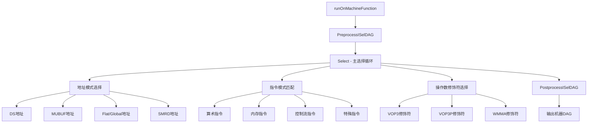

# AMDGPUISelDAGToDAG.cpp 代码功能分析

## 1) 主要功能概括

<a name="ref-block_0"></a>该文件实现了**AMDGPU目标架构的指令选择器（Instruction Selector）**，是LLVM编译流程中的关键组件。 llvm-project:1-12[<sup>↗</sup>](#block_0) 

**作用与效果：**
- 将经过合法化的DAG（有向无环图）转换为AMDGPU特定的机器指令DAG
- 为后续的指令调度阶段准备优化的指令序列
<a name="ref-block_1"></a>- 执行目标特定的模式匹配和指令选择优化 llvm-project:113-118[<sup>↗</sup>](#block_1) 

## 2) 主要功能步骤/子功能提取

该pass的实现包含以下核心功能模块：

### 2.1 初始化与运行框架
- Pass注册与初始化机制
- 函数级别的执行入口

### 2.2 DAG预处理（PreprocessISelDAG）
- D16格式的load指令优化

### 2.3 核心指令选择（Select）
- 主选择调度逻辑
- 特殊节点处理

### 2.4 地址选择模式
- DS（Data Share/LDS）地址模式
- MUBUF（Memory Untyped Buffer）地址模式
- Flat/Global/Scratch内存访问模式
- SMRD（Scalar Memory Read）地址模式

### 2.5 操作数修饰符选择
- VOP3指令修饰符（neg, abs, clamp, omod）
- WMMA（Wave Matrix Multiply Accumulate）修饰符
- 打包指令修饰符

### 2.6 特殊指令选择
- 64位加减法指令
- 位域提取（BFE）指令
- 分支条件指令
- 内建函数（Intrinsics）

### 2.7 后处理（PostprocessISelDAG）
- 指令折叠优化

## 3) 各步骤/子功能详细分析

<a name="ref-block_2"></a>### 3.1 初始化与运行框架 llvm-project:120-129[<sup>↗</sup>](#block_2) 

**功能说明：**
- `AMDGPUDAGToDAGISel`构造函数初始化目标机器配置
- `runOnMachineFunction`是pass的主入口，获取子目标信息和FP模式配置

<a name="ref-block_4"></a>### 3.2 DAG预处理优化 llvm-project:295-322[<sup>↗</sup>](#block_4) 

**功能说明：**
- 识别BUILD_VECTOR节点并优化为D16格式的特殊load指令
- 将高16位和低16位的分离加载合并为单个D16 load操作
<a name="ref-block_3"></a>- 减少内存访问次数，提升性能 llvm-project:215-293[<sup>↗</sup>](#block_3) 

<a name="ref-block_5"></a>### 3.3 核心指令选择逻辑 llvm-project:580-797[<sup>↗</sup>](#block_5) 

**主要处理：**
- **内存操作**：Load/Store/Atomic操作的M0寄存器初始化
- **算术运算**：64位加减法、带进位的加减法
- **向量构建**：BUILD_VECTOR、SCALAR_TO_VECTOR优化
- **常量处理**：64位常量的特殊加载
- **位操作**：BFE（位域提取）指令选择
- **分支指令**：条件分支的优化选择
- **内建函数**：各类intrinsic的特殊处理

### 3.4 地址选择模式详解

<a name="ref-block_7"></a>#### 3.4.1 DS（共享内存）地址模式 llvm-project:1165-1235[<sup>↗</sup>](#block_7) 

**功能：**
- 识别基址+偏移量的地址模式
- 验证偏移量是否在16位范围内
- 处理常量地址的特殊情况
- 为DS_READ/DS_WRITE指令生成合法的地址操作数

<a name="ref-block_8"></a>#### 3.4.2 MUBUF（缓冲区）地址模式 llvm-project:1424-1510[<sup>↗</sup>](#block_8) 

**功能：**
- 处理结构化缓冲区访问
- 分离scalar基址和vector偏移
- 判断是否使用64位地址模式
- 生成SRsrc（资源描述符）和偏移量

<a name="ref-block_9"></a>#### 3.4.3 Flat/Global/Scratch地址模式 llvm-project:1724-1817[<sup>↗</sup>](#block_9) 

**功能：**
- 处理扁平地址空间访问
- 提取立即数偏移量（如果合法）
- 处理跨越指令限制的大偏移量
<a name="ref-block_10"></a>- 支持32位和64位地址计算 llvm-project:1847-1941[<sup>↗</sup>](#block_10) 

**Global SAddr模式：**
- 匹配"SGPR基址 + VGPR偏移 + 立即数"模式
- 优化全局内存访问性能

<a name="ref-block_11"></a>#### 3.4.4 SMRD（标量内存读）地址模式 llvm-project:2113-2175[<sup>↗</sup>](#block_11) 

**功能：**
- 处理标量内存读取指令的地址计算
- 支持立即数偏移和SGPR偏移两种模式
- 根据硬件世代选择合适的编码格式

### 3.5 操作数修饰符选择

<a name="ref-block_16"></a>#### 3.5.1 VOP3修饰符 llvm-project:2985-3011[<sup>↗</sup>](#block_16) 

**支持的修饰符：**
- **NEG**：取反修饰符（识别FNEG节点）
- **ABS**：绝对值修饰符（识别FABS节点）
<a name="ref-block_17"></a>- **Canonicalizing**：规范化零值处理 llvm-project:3013-3056[<sup>↗</sup>](#block_17) 

<a name="ref-block_18"></a>#### 3.5.2 VOP3P打包修饰符 llvm-project:3115-3240[<sup>↗</sup>](#block_18) 

**功能：**
- 处理打包的f16/i16向量操作
- 识别OP_SEL位（选择高/低半部分）
- 优化向量shuffle为打包指令

<a name="ref-block_19"></a>#### 3.5.3 WMMA修饰符 llvm-project:3390-3435[<sup>↗</sup>](#block_19) 

**功能：**
- 支持矩阵乘法累加指令的修饰符
- 处理f16/f32元素的neg/abs修饰
- 优化向量构建为寄存器序列

### 3.6 特殊指令选择

<a name="ref-block_6"></a>#### 3.6.1 64位加减法 llvm-project:930-997[<sup>↗</sup>](#block_6) 

**实现：**
- 将64位操作拆分为两个32位操作
- 低32位使用ADD_U32/SUB_U32
- 高32位使用ADDC_U32/SUBB_U32（带进位）
- 使用REG_SEQUENCE组合结果

<a name="ref-block_12"></a>#### 3.6.2 位域提取（BFE） llvm-project:2390-2462[<sup>↗</sup>](#block_12) 

**优化模式：**
- `(a srl b) & mask` → BFE_U32
- `(a & mask) srl b` → BFE_U32
- `(a << b) sra c` → BFE_I32（有符号）
- 自动计算位宽和偏移量

<a name="ref-block_13"></a>#### 3.6.3 条件分支 llvm-project:2519-2603[<sup>↗</sup>](#block_13) 

**功能：**
- 判断使用SCC还是VCC作为条件寄存器
- 识别uniform分支（使用S_CBRANCH_SCC）
- 识别divergent分支（使用S_CBRANCH_VCC）
- 插入EXEC掩码与操作

<a name="ref-block_14"></a>#### 3.6.4 内建函数处理 llvm-project:2829-2853[<sup>↗</sup>](#block_14) 

**INTRINSIC_W_CHAIN处理：**
- DS append/consume操作
- DS BVH stack操作
<a name="ref-block_15"></a>- 初始化whole wave标志 llvm-project:2855-2926[<sup>↗</sup>](#block_15) 

**INTRINSIC_WO_CHAIN处理：**
- WQM（Whole Quad Mode）
- WWM（Whole Wave Mode）
- Permlane指令

<a name="ref-block_20"></a>### 3.7 后处理优化 llvm-project:3955-3979[<sup>↗</sup>](#block_20) 

**功能：**
- 迭代遍历所有已选择的机器节点
- 调用`PostISelFolding`进行额外的指令折叠
- 删除死节点，清理DAG

## 4) 步骤/子功能之间的关系

### 执行流程关系图：



### 功能依赖关系：

1. **预处理→主选择**：PreprocessISelDAG优化BUILD_VECTOR节点，为主选择阶段提供更优的输入
   
2. **地址选择→指令选择**：地址模式选择为内存指令提供合法的操作数格式

3. **修饰符选择→指令生成**：操作数修饰符选择影响最终生成的指令编码

4. **主选择→后处理**：主选择生成初步的机器指令，后处理进行进一步优化

5. **辅助函数支持**：
   - `isInlineImmediate`判断是否可以使用内联立即数
   - `isUniformBr`判断分支的uniform性
   - `isDSOffsetLegal`等函数验证地址偏移的合法性

### 关键数据流： llvm-project:124-129 

- **输入**：合法化的SelectionDAG + Subtarget信息 + 模式默认值
- **处理**：模式匹配 + 地址选择 + 修饰符识别 + 指令转换
- **输出**：AMDGPU特定的机器指令DAG

整个pass通过模块化的设计，将复杂的指令选择任务分解为可管理的子功能，每个子功能专注于特定类型的指令或地址模式，最终协同工作完成完整的指令选择过程。
### Citations
<a name="block_0"></a>**File:** llvm/lib/Target/AMDGPU/AMDGPUISelDAGToDAG.cpp (L1-12) [<sup>↩</sup>](#ref-block_0)
```cpp
//===-- AMDGPUISelDAGToDAG.cpp - A dag to dag inst selector for AMDGPU ----===//
//
// Part of the LLVM Project, under the Apache License v2.0 with LLVM Exceptions.
// See https://llvm.org/LICENSE.txt for license information.
// SPDX-License-Identifier: Apache-2.0 WITH LLVM-exception
//
//==-----------------------------------------------------------------------===//
//
/// \file
/// Defines an instruction selector for the AMDGPU target.
//
//===----------------------------------------------------------------------===//
```
<a name="block_1"></a>**File:** llvm/lib/Target/AMDGPU/AMDGPUISelDAGToDAG.cpp (L113-118) [<sup>↩</sup>](#ref-block_1)
```cpp
/// This pass converts a legalized DAG into a AMDGPU-specific
// DAG, ready for instruction scheduling.
FunctionPass *llvm::createAMDGPUISelDag(TargetMachine &TM,
                                        CodeGenOptLevel OptLevel) {
  return new AMDGPUDAGToDAGISelLegacy(TM, OptLevel);
}
```
<a name="block_2"></a>**File:** llvm/lib/Target/AMDGPU/AMDGPUISelDAGToDAG.cpp (L120-129) [<sup>↩</sup>](#ref-block_2)
```cpp
AMDGPUDAGToDAGISel::AMDGPUDAGToDAGISel(TargetMachine &TM,
                                       CodeGenOptLevel OptLevel)
    : SelectionDAGISel(TM, OptLevel) {}

bool AMDGPUDAGToDAGISel::runOnMachineFunction(MachineFunction &MF) {
  Subtarget = &MF.getSubtarget<GCNSubtarget>();
  Subtarget->checkSubtargetFeatures(MF.getFunction());
  Mode = SIModeRegisterDefaults(MF.getFunction(), *Subtarget);
  return SelectionDAGISel::runOnMachineFunction(MF);
}
```
<a name="block_3"></a>**File:** llvm/lib/Target/AMDGPU/AMDGPUISelDAGToDAG.cpp (L215-293) [<sup>↩</sup>](#ref-block_3)
```cpp
bool AMDGPUDAGToDAGISel::matchLoadD16FromBuildVector(SDNode *N) const {
  assert(Subtarget->d16PreservesUnusedBits());
  MVT VT = N->getValueType(0).getSimpleVT();
  if (VT != MVT::v2i16 && VT != MVT::v2f16)
    return false;

  SDValue Lo = N->getOperand(0);
  SDValue Hi = N->getOperand(1);

  LoadSDNode *LdHi = dyn_cast<LoadSDNode>(stripBitcast(Hi));

  // build_vector lo, (load ptr) -> load_d16_hi ptr, lo
  // build_vector lo, (zextload ptr from i8) -> load_d16_hi_u8 ptr, lo
  // build_vector lo, (sextload ptr from i8) -> load_d16_hi_i8 ptr, lo

  // Need to check for possible indirect dependencies on the other half of the
  // vector to avoid introducing a cycle.
  if (LdHi && Hi.hasOneUse() && !LdHi->isPredecessorOf(Lo.getNode())) {
    SDVTList VTList = CurDAG->getVTList(VT, MVT::Other);

    SDValue TiedIn = CurDAG->getNode(ISD::SCALAR_TO_VECTOR, SDLoc(N), VT, Lo);
    SDValue Ops[] = {
      LdHi->getChain(), LdHi->getBasePtr(), TiedIn
    };

    unsigned LoadOp = AMDGPUISD::LOAD_D16_HI;
    if (LdHi->getMemoryVT() == MVT::i8) {
      LoadOp = LdHi->getExtensionType() == ISD::SEXTLOAD ?
        AMDGPUISD::LOAD_D16_HI_I8 : AMDGPUISD::LOAD_D16_HI_U8;
    } else {
      assert(LdHi->getMemoryVT() == MVT::i16);
    }

    SDValue NewLoadHi =
      CurDAG->getMemIntrinsicNode(LoadOp, SDLoc(LdHi), VTList,
                                  Ops, LdHi->getMemoryVT(),
                                  LdHi->getMemOperand());

    CurDAG->ReplaceAllUsesOfValueWith(SDValue(N, 0), NewLoadHi);
    CurDAG->ReplaceAllUsesOfValueWith(SDValue(LdHi, 1), NewLoadHi.getValue(1));
    return true;
  }

  // build_vector (load ptr), hi -> load_d16_lo ptr, hi
  // build_vector (zextload ptr from i8), hi -> load_d16_lo_u8 ptr, hi
  // build_vector (sextload ptr from i8), hi -> load_d16_lo_i8 ptr, hi
  LoadSDNode *LdLo = dyn_cast<LoadSDNode>(stripBitcast(Lo));
  if (LdLo && Lo.hasOneUse()) {
    SDValue TiedIn = getHi16Elt(Hi);
    if (!TiedIn || LdLo->isPredecessorOf(TiedIn.getNode()))
      return false;

    SDVTList VTList = CurDAG->getVTList(VT, MVT::Other);
    unsigned LoadOp = AMDGPUISD::LOAD_D16_LO;
    if (LdLo->getMemoryVT() == MVT::i8) {
      LoadOp = LdLo->getExtensionType() == ISD::SEXTLOAD ?
        AMDGPUISD::LOAD_D16_LO_I8 : AMDGPUISD::LOAD_D16_LO_U8;
    } else {
      assert(LdLo->getMemoryVT() == MVT::i16);
    }

    TiedIn = CurDAG->getNode(ISD::BITCAST, SDLoc(N), VT, TiedIn);

    SDValue Ops[] = {
      LdLo->getChain(), LdLo->getBasePtr(), TiedIn
    };

    SDValue NewLoadLo =
      CurDAG->getMemIntrinsicNode(LoadOp, SDLoc(LdLo), VTList,
                                  Ops, LdLo->getMemoryVT(),
                                  LdLo->getMemOperand());

    CurDAG->ReplaceAllUsesOfValueWith(SDValue(N, 0), NewLoadLo);
    CurDAG->ReplaceAllUsesOfValueWith(SDValue(LdLo, 1), NewLoadLo.getValue(1));
    return true;
  }

  return false;
}
```
<a name="block_4"></a>**File:** llvm/lib/Target/AMDGPU/AMDGPUISelDAGToDAG.cpp (L295-322) [<sup>↩</sup>](#ref-block_4)
```cpp
void AMDGPUDAGToDAGISel::PreprocessISelDAG() {
  if (!Subtarget->d16PreservesUnusedBits())
    return;

  SelectionDAG::allnodes_iterator Position = CurDAG->allnodes_end();

  bool MadeChange = false;
  while (Position != CurDAG->allnodes_begin()) {
    SDNode *N = &*--Position;
    if (N->use_empty())
      continue;

    switch (N->getOpcode()) {
    case ISD::BUILD_VECTOR:
      // TODO: Match load d16 from shl (extload:i16), 16
      MadeChange |= matchLoadD16FromBuildVector(N);
      break;
    default:
      break;
    }
  }

  if (MadeChange) {
    CurDAG->RemoveDeadNodes();
    LLVM_DEBUG(dbgs() << "After PreProcess:\n";
               CurDAG->dump(););
  }
}
```
<a name="block_5"></a>**File:** llvm/lib/Target/AMDGPU/AMDGPUISelDAGToDAG.cpp (L580-797) [<sup>↩</sup>](#ref-block_5)
```cpp
void AMDGPUDAGToDAGISel::Select(SDNode *N) {
  unsigned int Opc = N->getOpcode();
  if (N->isMachineOpcode()) {
    N->setNodeId(-1);
    return;   // Already selected.
  }

  // isa<MemSDNode> almost works but is slightly too permissive for some DS
  // intrinsics.
  if (Opc == ISD::LOAD || Opc == ISD::STORE || isa<AtomicSDNode>(N)) {
    N = glueCopyToM0LDSInit(N);
    SelectCode(N);
    return;
  }

  switch (Opc) {
  default:
    break;
  // We are selecting i64 ADD here instead of custom lower it during
  // DAG legalization, so we can fold some i64 ADDs used for address
  // calculation into the LOAD and STORE instructions.
  case ISD::ADDC:
  case ISD::ADDE:
  case ISD::SUBC:
  case ISD::SUBE: {
    if (N->getValueType(0) != MVT::i64)
      break;

    SelectADD_SUB_I64(N);
    return;
  }
  case ISD::UADDO_CARRY:
  case ISD::USUBO_CARRY:
    if (N->getValueType(0) != MVT::i32)
      break;

    SelectAddcSubb(N);
    return;
  case ISD::UADDO:
  case ISD::USUBO: {
    SelectUADDO_USUBO(N);
    return;
  }
  case AMDGPUISD::FMUL_W_CHAIN: {
    SelectFMUL_W_CHAIN(N);
    return;
  }
  case AMDGPUISD::FMA_W_CHAIN: {
    SelectFMA_W_CHAIN(N);
    return;
  }

  case ISD::SCALAR_TO_VECTOR:
  case ISD::BUILD_VECTOR: {
    EVT VT = N->getValueType(0);
    unsigned NumVectorElts = VT.getVectorNumElements();
    if (VT.getScalarSizeInBits() == 16) {
      if (Opc == ISD::BUILD_VECTOR && NumVectorElts == 2) {
        if (SDNode *Packed = packConstantV2I16(N, *CurDAG)) {
          ReplaceNode(N, Packed);
          return;
        }
      }

      break;
    }

    assert(VT.getVectorElementType().bitsEq(MVT::i32));
    unsigned RegClassID =
        SIRegisterInfo::getSGPRClassForBitWidth(NumVectorElts * 32)->getID();
    SelectBuildVector(N, RegClassID);
    return;
  }
  case ISD::VECTOR_SHUFFLE:
    SelectVectorShuffle(N);
    return;
  case ISD::BUILD_PAIR: {
    SDValue RC, SubReg0, SubReg1;
    SDLoc DL(N);
    if (N->getValueType(0) == MVT::i128) {
      RC = CurDAG->getTargetConstant(AMDGPU::SGPR_128RegClassID, DL, MVT::i32);
      SubReg0 = CurDAG->getTargetConstant(AMDGPU::sub0_sub1, DL, MVT::i32);
      SubReg1 = CurDAG->getTargetConstant(AMDGPU::sub2_sub3, DL, MVT::i32);
    } else if (N->getValueType(0) == MVT::i64) {
      RC = CurDAG->getTargetConstant(AMDGPU::SReg_64RegClassID, DL, MVT::i32);
      SubReg0 = CurDAG->getTargetConstant(AMDGPU::sub0, DL, MVT::i32);
      SubReg1 = CurDAG->getTargetConstant(AMDGPU::sub1, DL, MVT::i32);
    } else {
      llvm_unreachable("Unhandled value type for BUILD_PAIR");
    }
    const SDValue Ops[] = { RC, N->getOperand(0), SubReg0,
                            N->getOperand(1), SubReg1 };
    ReplaceNode(N, CurDAG->getMachineNode(TargetOpcode::REG_SEQUENCE, DL,
                                          N->getValueType(0), Ops));
    return;
  }

  case ISD::Constant:
  case ISD::ConstantFP: {
    if (N->getValueType(0).getSizeInBits() != 64 || isInlineImmediate(N))
      break;

    uint64_t Imm;
    if (ConstantFPSDNode *FP = dyn_cast<ConstantFPSDNode>(N)) {
      Imm = FP->getValueAPF().bitcastToAPInt().getZExtValue();
      if (AMDGPU::isValid32BitLiteral(Imm, true))
        break;
    } else {
      ConstantSDNode *C = cast<ConstantSDNode>(N);
      Imm = C->getZExtValue();
      if (AMDGPU::isValid32BitLiteral(Imm, false))
        break;
    }

    SDLoc DL(N);
    ReplaceNode(N, buildSMovImm64(DL, Imm, N->getValueType(0)));
    return;
  }
  case AMDGPUISD::BFE_I32:
  case AMDGPUISD::BFE_U32: {
    // There is a scalar version available, but unlike the vector version which
    // has a separate operand for the offset and width, the scalar version packs
    // the width and offset into a single operand. Try to move to the scalar
    // version if the offsets are constant, so that we can try to keep extended
    // loads of kernel arguments in SGPRs.

    // TODO: Technically we could try to pattern match scalar bitshifts of
    // dynamic values, but it's probably not useful.
    ConstantSDNode *Offset = dyn_cast<ConstantSDNode>(N->getOperand(1));
    if (!Offset)
      break;

    ConstantSDNode *Width = dyn_cast<ConstantSDNode>(N->getOperand(2));
    if (!Width)
      break;

    bool Signed = Opc == AMDGPUISD::BFE_I32;

    uint32_t OffsetVal = Offset->getZExtValue();
    uint32_t WidthVal = Width->getZExtValue();

    ReplaceNode(N, getBFE32(Signed, SDLoc(N), N->getOperand(0), OffsetVal,
                            WidthVal));
    return;
  }
  case AMDGPUISD::DIV_SCALE: {
    SelectDIV_SCALE(N);
    return;
  }
  case AMDGPUISD::MAD_I64_I32:
  case AMDGPUISD::MAD_U64_U32: {
    SelectMAD_64_32(N);
    return;
  }
  case ISD::SMUL_LOHI:
  case ISD::UMUL_LOHI:
    return SelectMUL_LOHI(N);
  case ISD::CopyToReg: {
    const SITargetLowering& Lowering =
      *static_cast<const SITargetLowering*>(getTargetLowering());
    N = Lowering.legalizeTargetIndependentNode(N, *CurDAG);
    break;
  }
  case ISD::AND:
  case ISD::SRL:
  case ISD::SRA:
  case ISD::SIGN_EXTEND_INREG:
    if (N->getValueType(0) != MVT::i32)
      break;

    SelectS_BFE(N);
    return;
  case ISD::BRCOND:
    SelectBRCOND(N);
    return;
  case ISD::FP_EXTEND:
    SelectFP_EXTEND(N);
    return;
  case AMDGPUISD::CVT_PKRTZ_F16_F32:
  case AMDGPUISD::CVT_PKNORM_I16_F32:
  case AMDGPUISD::CVT_PKNORM_U16_F32:
  case AMDGPUISD::CVT_PK_U16_U32:
  case AMDGPUISD::CVT_PK_I16_I32: {
    // Hack around using a legal type if f16 is illegal.
    if (N->getValueType(0) == MVT::i32) {
      MVT NewVT = Opc == AMDGPUISD::CVT_PKRTZ_F16_F32 ? MVT::v2f16 : MVT::v2i16;
      N = CurDAG->MorphNodeTo(N, N->getOpcode(), CurDAG->getVTList(NewVT),
                              { N->getOperand(0), N->getOperand(1) });
      SelectCode(N);
      return;
    }

    break;
  }
  case ISD::INTRINSIC_W_CHAIN: {
    SelectINTRINSIC_W_CHAIN(N);
    return;
  }
  case ISD::INTRINSIC_WO_CHAIN: {
    SelectINTRINSIC_WO_CHAIN(N);
    return;
  }
  case ISD::INTRINSIC_VOID: {
    SelectINTRINSIC_VOID(N);
    return;
  }
  case AMDGPUISD::WAVE_ADDRESS: {
    SelectWAVE_ADDRESS(N);
    return;
  }
  case ISD::STACKRESTORE: {
    SelectSTACKRESTORE(N);
    return;
  }
  }

  SelectCode(N);
}
```
<a name="block_6"></a>**File:** llvm/lib/Target/AMDGPU/AMDGPUISelDAGToDAG.cpp (L930-997) [<sup>↩</sup>](#ref-block_6)
```cpp
void AMDGPUDAGToDAGISel::SelectADD_SUB_I64(SDNode *N) {
  SDLoc DL(N);
  SDValue LHS = N->getOperand(0);
  SDValue RHS = N->getOperand(1);

  unsigned Opcode = N->getOpcode();
  bool ConsumeCarry = (Opcode == ISD::ADDE || Opcode == ISD::SUBE);
  bool ProduceCarry =
      ConsumeCarry || Opcode == ISD::ADDC || Opcode == ISD::SUBC;
  bool IsAdd = Opcode == ISD::ADD || Opcode == ISD::ADDC || Opcode == ISD::ADDE;

  SDValue Sub0 = CurDAG->getTargetConstant(AMDGPU::sub0, DL, MVT::i32);
  SDValue Sub1 = CurDAG->getTargetConstant(AMDGPU::sub1, DL, MVT::i32);

  SDNode *Lo0 = CurDAG->getMachineNode(TargetOpcode::EXTRACT_SUBREG,
                                       DL, MVT::i32, LHS, Sub0);
  SDNode *Hi0 = CurDAG->getMachineNode(TargetOpcode::EXTRACT_SUBREG,
                                       DL, MVT::i32, LHS, Sub1);

  SDNode *Lo1 = CurDAG->getMachineNode(TargetOpcode::EXTRACT_SUBREG,
                                       DL, MVT::i32, RHS, Sub0);
  SDNode *Hi1 = CurDAG->getMachineNode(TargetOpcode::EXTRACT_SUBREG,
                                       DL, MVT::i32, RHS, Sub1);

  SDVTList VTList = CurDAG->getVTList(MVT::i32, MVT::Glue);

  static const unsigned OpcMap[2][2][2] = {
      {{AMDGPU::S_SUB_U32, AMDGPU::S_ADD_U32},
       {AMDGPU::V_SUB_CO_U32_e32, AMDGPU::V_ADD_CO_U32_e32}},
      {{AMDGPU::S_SUBB_U32, AMDGPU::S_ADDC_U32},
       {AMDGPU::V_SUBB_U32_e32, AMDGPU::V_ADDC_U32_e32}}};

  unsigned Opc = OpcMap[0][N->isDivergent()][IsAdd];
  unsigned CarryOpc = OpcMap[1][N->isDivergent()][IsAdd];

  SDNode *AddLo;
  if (!ConsumeCarry) {
    SDValue Args[] = { SDValue(Lo0, 0), SDValue(Lo1, 0) };
    AddLo = CurDAG->getMachineNode(Opc, DL, VTList, Args);
  } else {
    SDValue Args[] = { SDValue(Lo0, 0), SDValue(Lo1, 0), N->getOperand(2) };
    AddLo = CurDAG->getMachineNode(CarryOpc, DL, VTList, Args);
  }
  SDValue AddHiArgs[] = {
    SDValue(Hi0, 0),
    SDValue(Hi1, 0),
    SDValue(AddLo, 1)
  };
  SDNode *AddHi = CurDAG->getMachineNode(CarryOpc, DL, VTList, AddHiArgs);

  SDValue RegSequenceArgs[] = {
    CurDAG->getTargetConstant(AMDGPU::SReg_64RegClassID, DL, MVT::i32),
    SDValue(AddLo,0),
    Sub0,
    SDValue(AddHi,0),
    Sub1,
  };
  SDNode *RegSequence = CurDAG->getMachineNode(AMDGPU::REG_SEQUENCE, DL,
                                               MVT::i64, RegSequenceArgs);

  if (ProduceCarry) {
    // Replace the carry-use
    ReplaceUses(SDValue(N, 1), SDValue(AddHi, 1));
  }

  // Replace the remaining uses.
  ReplaceNode(N, RegSequence);
}
```
<a name="block_7"></a>**File:** llvm/lib/Target/AMDGPU/AMDGPUISelDAGToDAG.cpp (L1165-1235) [<sup>↩</sup>](#ref-block_7)
```cpp
bool AMDGPUDAGToDAGISel::SelectDS1Addr1Offset(SDValue Addr, SDValue &Base,
                                              SDValue &Offset) const {
  SDLoc DL(Addr);
  if (CurDAG->isBaseWithConstantOffset(Addr)) {
    SDValue N0 = Addr.getOperand(0);
    SDValue N1 = Addr.getOperand(1);
    ConstantSDNode *C1 = cast<ConstantSDNode>(N1);
    if (isDSOffsetLegal(N0, C1->getSExtValue())) {
      // (add n0, c0)
      Base = N0;
      Offset = CurDAG->getTargetConstant(C1->getZExtValue(), DL, MVT::i16);
      return true;
    }
  } else if (Addr.getOpcode() == ISD::SUB) {
    // sub C, x -> add (sub 0, x), C
    if (const ConstantSDNode *C = dyn_cast<ConstantSDNode>(Addr.getOperand(0))) {
      int64_t ByteOffset = C->getSExtValue();
      if (isDSOffsetLegal(SDValue(), ByteOffset)) {
        SDValue Zero = CurDAG->getTargetConstant(0, DL, MVT::i32);

        // XXX - This is kind of hacky. Create a dummy sub node so we can check
        // the known bits in isDSOffsetLegal. We need to emit the selected node
        // here, so this is thrown away.
        SDValue Sub = CurDAG->getNode(ISD::SUB, DL, MVT::i32,
                                      Zero, Addr.getOperand(1));

        if (isDSOffsetLegal(Sub, ByteOffset)) {
          SmallVector<SDValue, 3> Opnds;
          Opnds.push_back(Zero);
          Opnds.push_back(Addr.getOperand(1));

          // FIXME: Select to VOP3 version for with-carry.
          unsigned SubOp = AMDGPU::V_SUB_CO_U32_e32;
          if (Subtarget->hasAddNoCarry()) {
            SubOp = AMDGPU::V_SUB_U32_e64;
            Opnds.push_back(
                CurDAG->getTargetConstant(0, {}, MVT::i1)); // clamp bit
          }

          MachineSDNode *MachineSub =
              CurDAG->getMachineNode(SubOp, DL, MVT::i32, Opnds);

          Base = SDValue(MachineSub, 0);
          Offset = CurDAG->getTargetConstant(ByteOffset, DL, MVT::i16);
          return true;
        }
      }
    }
  } else if (const ConstantSDNode *CAddr = dyn_cast<ConstantSDNode>(Addr)) {
    // If we have a constant address, prefer to put the constant into the
    // offset. This can save moves to load the constant address since multiple
    // operations can share the zero base address register, and enables merging
    // into read2 / write2 instructions.

    SDLoc DL(Addr);

    if (isDSOffsetLegal(SDValue(), CAddr->getZExtValue())) {
      SDValue Zero = CurDAG->getTargetConstant(0, DL, MVT::i32);
      MachineSDNode *MovZero = CurDAG->getMachineNode(AMDGPU::V_MOV_B32_e32,
                                 DL, MVT::i32, Zero);
      Base = SDValue(MovZero, 0);
      Offset = CurDAG->getTargetConstant(CAddr->getZExtValue(), DL, MVT::i16);
      return true;
    }
  }

  // default case
  Base = Addr;
  Offset = CurDAG->getTargetConstant(0, SDLoc(Addr), MVT::i16);
  return true;
}
```
<a name="block_8"></a>**File:** llvm/lib/Target/AMDGPU/AMDGPUISelDAGToDAG.cpp (L1424-1510) [<sup>↩</sup>](#ref-block_8)
```cpp
bool AMDGPUDAGToDAGISel::SelectMUBUF(SDValue Addr, SDValue &Ptr, SDValue &VAddr,
                                     SDValue &SOffset, SDValue &Offset,
                                     SDValue &Offen, SDValue &Idxen,
                                     SDValue &Addr64) const {
  // Subtarget prefers to use flat instruction
  // FIXME: This should be a pattern predicate and not reach here
  if (Subtarget->useFlatForGlobal())
    return false;

  SDLoc DL(Addr);

  Idxen = CurDAG->getTargetConstant(0, DL, MVT::i1);
  Offen = CurDAG->getTargetConstant(0, DL, MVT::i1);
  Addr64 = CurDAG->getTargetConstant(0, DL, MVT::i1);
  SOffset = Subtarget->hasRestrictedSOffset()
                ? CurDAG->getRegister(AMDGPU::SGPR_NULL, MVT::i32)
                : CurDAG->getTargetConstant(0, DL, MVT::i32);

  ConstantSDNode *C1 = nullptr;
  SDValue N0 = Addr;
  if (CurDAG->isBaseWithConstantOffset(Addr)) {
    C1 = cast<ConstantSDNode>(Addr.getOperand(1));
    if (isUInt<32>(C1->getZExtValue()))
      N0 = Addr.getOperand(0);
    else
      C1 = nullptr;
  }

  if (N0.getOpcode() == ISD::ADD) {
    // (add N2, N3) -> addr64, or
    // (add (add N2, N3), C1) -> addr64
    SDValue N2 = N0.getOperand(0);
    SDValue N3 = N0.getOperand(1);
    Addr64 = CurDAG->getTargetConstant(1, DL, MVT::i1);

    if (N2->isDivergent()) {
      if (N3->isDivergent()) {
        // Both N2 and N3 are divergent. Use N0 (the result of the add) as the
        // addr64, and construct the resource from a 0 address.
        Ptr = SDValue(buildSMovImm64(DL, 0, MVT::v2i32), 0);
        VAddr = N0;
      } else {
        // N2 is divergent, N3 is not.
        Ptr = N3;
        VAddr = N2;
      }
    } else {
      // N2 is not divergent.
      Ptr = N2;
      VAddr = N3;
    }
    Offset = CurDAG->getTargetConstant(0, DL, MVT::i32);
  } else if (N0->isDivergent()) {
    // N0 is divergent. Use it as the addr64, and construct the resource from a
    // 0 address.
    Ptr = SDValue(buildSMovImm64(DL, 0, MVT::v2i32), 0);
    VAddr = N0;
    Addr64 = CurDAG->getTargetConstant(1, DL, MVT::i1);
  } else {
    // N0 -> offset, or
    // (N0 + C1) -> offset
    VAddr = CurDAG->getTargetConstant(0, DL, MVT::i32);
    Ptr = N0;
  }

  if (!C1) {
    // No offset.
    Offset = CurDAG->getTargetConstant(0, DL, MVT::i32);
    return true;
  }

  const SIInstrInfo *TII = Subtarget->getInstrInfo();
  if (TII->isLegalMUBUFImmOffset(C1->getZExtValue())) {
    // Legal offset for instruction.
    Offset = CurDAG->getTargetConstant(C1->getZExtValue(), DL, MVT::i32);
    return true;
  }

  // Illegal offset, store it in soffset.
  Offset = CurDAG->getTargetConstant(0, DL, MVT::i32);
  SOffset =
      SDValue(CurDAG->getMachineNode(
                  AMDGPU::S_MOV_B32, DL, MVT::i32,
                  CurDAG->getTargetConstant(C1->getZExtValue(), DL, MVT::i32)),
              0);
  return true;
}
```
<a name="block_9"></a>**File:** llvm/lib/Target/AMDGPU/AMDGPUISelDAGToDAG.cpp (L1724-1817) [<sup>↩</sup>](#ref-block_9)
```cpp
bool AMDGPUDAGToDAGISel::SelectFlatOffsetImpl(SDNode *N, SDValue Addr,
                                              SDValue &VAddr, SDValue &Offset,
                                              uint64_t FlatVariant) const {
  int64_t OffsetVal = 0;

  unsigned AS = findMemSDNode(N)->getAddressSpace();

  bool CanHaveFlatSegmentOffsetBug =
      Subtarget->hasFlatSegmentOffsetBug() &&
      FlatVariant == SIInstrFlags::FLAT &&
      (AS == AMDGPUAS::FLAT_ADDRESS || AS == AMDGPUAS::GLOBAL_ADDRESS);

  if (Subtarget->hasFlatInstOffsets() && !CanHaveFlatSegmentOffsetBug) {
    SDValue N0, N1;
    if (isBaseWithConstantOffset64(Addr, N0, N1) &&
        (FlatVariant != SIInstrFlags::FlatScratch ||
         isFlatScratchBaseLegal(Addr))) {
      int64_t COffsetVal = cast<ConstantSDNode>(N1)->getSExtValue();

      const SIInstrInfo *TII = Subtarget->getInstrInfo();
      if (TII->isLegalFLATOffset(COffsetVal, AS, FlatVariant)) {
        Addr = N0;
        OffsetVal = COffsetVal;
      } else {
        // If the offset doesn't fit, put the low bits into the offset field and
        // add the rest.
        //
        // For a FLAT instruction the hardware decides whether to access
        // global/scratch/shared memory based on the high bits of vaddr,
        // ignoring the offset field, so we have to ensure that when we add
        // remainder to vaddr it still points into the same underlying object.
        // The easiest way to do that is to make sure that we split the offset
        // into two pieces that are both >= 0 or both <= 0.

        SDLoc DL(N);
        uint64_t RemainderOffset;

        std::tie(OffsetVal, RemainderOffset) =
            TII->splitFlatOffset(COffsetVal, AS, FlatVariant);

        SDValue AddOffsetLo =
            getMaterializedScalarImm32(Lo_32(RemainderOffset), DL);
        SDValue Clamp = CurDAG->getTargetConstant(0, DL, MVT::i1);

        if (Addr.getValueType().getSizeInBits() == 32) {
          SmallVector<SDValue, 3> Opnds;
          Opnds.push_back(N0);
          Opnds.push_back(AddOffsetLo);
          unsigned AddOp = AMDGPU::V_ADD_CO_U32_e32;
          if (Subtarget->hasAddNoCarry()) {
            AddOp = AMDGPU::V_ADD_U32_e64;
            Opnds.push_back(Clamp);
          }
          Addr = SDValue(CurDAG->getMachineNode(AddOp, DL, MVT::i32, Opnds), 0);
        } else {
          // TODO: Should this try to use a scalar add pseudo if the base address
          // is uniform and saddr is usable?
          SDValue Sub0 = CurDAG->getTargetConstant(AMDGPU::sub0, DL, MVT::i32);
          SDValue Sub1 = CurDAG->getTargetConstant(AMDGPU::sub1, DL, MVT::i32);

          SDNode *N0Lo = CurDAG->getMachineNode(TargetOpcode::EXTRACT_SUBREG,
                                                DL, MVT::i32, N0, Sub0);
          SDNode *N0Hi = CurDAG->getMachineNode(TargetOpcode::EXTRACT_SUBREG,
                                                DL, MVT::i32, N0, Sub1);

          SDValue AddOffsetHi =
              getMaterializedScalarImm32(Hi_32(RemainderOffset), DL);

          SDVTList VTs = CurDAG->getVTList(MVT::i32, MVT::i1);

          SDNode *Add =
              CurDAG->getMachineNode(AMDGPU::V_ADD_CO_U32_e64, DL, VTs,
                                     {AddOffsetLo, SDValue(N0Lo, 0), Clamp});

          SDNode *Addc = CurDAG->getMachineNode(
              AMDGPU::V_ADDC_U32_e64, DL, VTs,
              {AddOffsetHi, SDValue(N0Hi, 0), SDValue(Add, 1), Clamp});

          SDValue RegSequenceArgs[] = {
              CurDAG->getTargetConstant(AMDGPU::VReg_64RegClassID, DL, MVT::i32),
              SDValue(Add, 0), Sub0, SDValue(Addc, 0), Sub1};

          Addr = SDValue(CurDAG->getMachineNode(AMDGPU::REG_SEQUENCE, DL,
                                                MVT::i64, RegSequenceArgs),
                         0);
        }
      }
    }
  }

  VAddr = Addr;
  Offset = CurDAG->getSignedTargetConstant(OffsetVal, SDLoc(), MVT::i32);
  return true;
}
```
<a name="block_10"></a>**File:** llvm/lib/Target/AMDGPU/AMDGPUISelDAGToDAG.cpp (L1847-1941) [<sup>↩</sup>](#ref-block_10)
```cpp
// Match (64-bit SGPR base) + (zext vgpr offset) + sext(imm offset)
bool AMDGPUDAGToDAGISel::SelectGlobalSAddr(SDNode *N,
                                           SDValue Addr,
                                           SDValue &SAddr,
                                           SDValue &VOffset,
                                           SDValue &Offset) const {
  int64_t ImmOffset = 0;

  // Match the immediate offset first, which canonically is moved as low as
  // possible.

  SDValue LHS, RHS;
  if (isBaseWithConstantOffset64(Addr, LHS, RHS)) {
    int64_t COffsetVal = cast<ConstantSDNode>(RHS)->getSExtValue();
    const SIInstrInfo *TII = Subtarget->getInstrInfo();

    if (TII->isLegalFLATOffset(COffsetVal, AMDGPUAS::GLOBAL_ADDRESS,
                               SIInstrFlags::FlatGlobal)) {
      Addr = LHS;
      ImmOffset = COffsetVal;
    } else if (!LHS->isDivergent()) {
      if (COffsetVal > 0) {
        SDLoc SL(N);
        // saddr + large_offset -> saddr +
        //                         (voffset = large_offset & ~MaxOffset) +
        //                         (large_offset & MaxOffset);
        int64_t SplitImmOffset, RemainderOffset;
        std::tie(SplitImmOffset, RemainderOffset) = TII->splitFlatOffset(
            COffsetVal, AMDGPUAS::GLOBAL_ADDRESS, SIInstrFlags::FlatGlobal);

        if (isUInt<32>(RemainderOffset)) {
          SDNode *VMov = CurDAG->getMachineNode(
              AMDGPU::V_MOV_B32_e32, SL, MVT::i32,
              CurDAG->getTargetConstant(RemainderOffset, SDLoc(), MVT::i32));
          VOffset = SDValue(VMov, 0);
          SAddr = LHS;
          Offset = CurDAG->getTargetConstant(SplitImmOffset, SDLoc(), MVT::i32);
          return true;
        }
      }

      // We are adding a 64 bit SGPR and a constant. If constant bus limit
      // is 1 we would need to perform 1 or 2 extra moves for each half of
      // the constant and it is better to do a scalar add and then issue a
      // single VALU instruction to materialize zero. Otherwise it is less
      // instructions to perform VALU adds with immediates or inline literals.
      unsigned NumLiterals =
          !TII->isInlineConstant(APInt(32, Lo_32(COffsetVal))) +
          !TII->isInlineConstant(APInt(32, Hi_32(COffsetVal)));
      if (Subtarget->getConstantBusLimit(AMDGPU::V_ADD_U32_e64) > NumLiterals)
        return false;
    }
  }

  // Match the variable offset.
  if (Addr.getOpcode() == ISD::ADD) {
    LHS = Addr.getOperand(0);
    RHS = Addr.getOperand(1);

    if (!LHS->isDivergent()) {
      // add (i64 sgpr), (zero_extend (i32 vgpr))
      if (SDValue ZextRHS = matchZExtFromI32(RHS)) {
        SAddr = LHS;
        VOffset = ZextRHS;
      }
    }

    if (!SAddr && !RHS->isDivergent()) {
      // add (zero_extend (i32 vgpr)), (i64 sgpr)
      if (SDValue ZextLHS = matchZExtFromI32(LHS)) {
        SAddr = RHS;
        VOffset = ZextLHS;
      }
    }

    if (SAddr) {
      Offset = CurDAG->getSignedTargetConstant(ImmOffset, SDLoc(), MVT::i32);
      return true;
    }
  }

  if (Addr->isDivergent() || Addr.getOpcode() == ISD::UNDEF ||
      isa<ConstantSDNode>(Addr))
    return false;

  // It's cheaper to materialize a single 32-bit zero for vaddr than the two
  // moves required to copy a 64-bit SGPR to VGPR.
  SAddr = Addr;
  SDNode *VMov =
      CurDAG->getMachineNode(AMDGPU::V_MOV_B32_e32, SDLoc(Addr), MVT::i32,
                             CurDAG->getTargetConstant(0, SDLoc(), MVT::i32));
  VOffset = SDValue(VMov, 0);
  Offset = CurDAG->getSignedTargetConstant(ImmOffset, SDLoc(), MVT::i32);
  return true;
}
```
<a name="block_11"></a>**File:** llvm/lib/Target/AMDGPU/AMDGPUISelDAGToDAG.cpp (L2113-2175) [<sup>↩</sup>](#ref-block_11)
```cpp
bool AMDGPUDAGToDAGISel::SelectSMRDOffset(SDValue ByteOffsetNode,
                                          SDValue *SOffset, SDValue *Offset,
                                          bool Imm32Only, bool IsBuffer,
                                          bool HasSOffset,
                                          int64_t ImmOffset) const {
  assert((!SOffset || !Offset) &&
         "Cannot match both soffset and offset at the same time!");

  ConstantSDNode *C = dyn_cast<ConstantSDNode>(ByteOffsetNode);
  if (!C) {
    if (!SOffset)
      return false;

    if (ByteOffsetNode.getValueType().isScalarInteger() &&
        ByteOffsetNode.getValueType().getSizeInBits() == 32) {
      *SOffset = ByteOffsetNode;
      return isSOffsetLegalWithImmOffset(SOffset, Imm32Only, IsBuffer,
                                         ImmOffset);
    }
    if (ByteOffsetNode.getOpcode() == ISD::ZERO_EXTEND) {
      if (ByteOffsetNode.getOperand(0).getValueType().getSizeInBits() == 32) {
        *SOffset = ByteOffsetNode.getOperand(0);
        return isSOffsetLegalWithImmOffset(SOffset, Imm32Only, IsBuffer,
                                           ImmOffset);
      }
    }
    return false;
  }

  SDLoc SL(ByteOffsetNode);

  // GFX9 and GFX10 have signed byte immediate offsets. The immediate
  // offset for S_BUFFER instructions is unsigned.
  int64_t ByteOffset = IsBuffer ? C->getZExtValue() : C->getSExtValue();
  std::optional<int64_t> EncodedOffset = AMDGPU::getSMRDEncodedOffset(
      *Subtarget, ByteOffset, IsBuffer, HasSOffset);
  if (EncodedOffset && Offset && !Imm32Only) {
    *Offset = CurDAG->getSignedTargetConstant(*EncodedOffset, SL, MVT::i32);
    return true;
  }

  // SGPR and literal offsets are unsigned.
  if (ByteOffset < 0)
    return false;

  EncodedOffset = AMDGPU::getSMRDEncodedLiteralOffset32(*Subtarget, ByteOffset);
  if (EncodedOffset && Offset && Imm32Only) {
    *Offset = CurDAG->getTargetConstant(*EncodedOffset, SL, MVT::i32);
    return true;
  }

  if (!isUInt<32>(ByteOffset) && !isInt<32>(ByteOffset))
    return false;

  if (SOffset) {
    SDValue C32Bit = CurDAG->getTargetConstant(ByteOffset, SL, MVT::i32);
    *SOffset = SDValue(
        CurDAG->getMachineNode(AMDGPU::S_MOV_B32, SL, MVT::i32, C32Bit), 0);
    return true;
  }

  return false;
}
```
<a name="block_12"></a>**File:** llvm/lib/Target/AMDGPU/AMDGPUISelDAGToDAG.cpp (L2390-2462) [<sup>↩</sup>](#ref-block_12)
```cpp
void AMDGPUDAGToDAGISel::SelectS_BFE(SDNode *N) {
  switch (N->getOpcode()) {
  case ISD::AND:
    if (N->getOperand(0).getOpcode() == ISD::SRL) {
      // "(a srl b) & mask" ---> "BFE_U32 a, b, popcount(mask)"
      // Predicate: isMask(mask)
      const SDValue &Srl = N->getOperand(0);
      ConstantSDNode *Shift = dyn_cast<ConstantSDNode>(Srl.getOperand(1));
      ConstantSDNode *Mask = dyn_cast<ConstantSDNode>(N->getOperand(1));

      if (Shift && Mask) {
        uint32_t ShiftVal = Shift->getZExtValue();
        uint32_t MaskVal = Mask->getZExtValue();

        if (isMask_32(MaskVal)) {
          uint32_t WidthVal = llvm::popcount(MaskVal);
          ReplaceNode(N, getBFE32(false, SDLoc(N), Srl.getOperand(0), ShiftVal,
                                  WidthVal));
          return;
        }
      }
    }
    break;
  case ISD::SRL:
    if (N->getOperand(0).getOpcode() == ISD::AND) {
      // "(a & mask) srl b)" ---> "BFE_U32 a, b, popcount(mask >> b)"
      // Predicate: isMask(mask >> b)
      const SDValue &And = N->getOperand(0);
      ConstantSDNode *Shift = dyn_cast<ConstantSDNode>(N->getOperand(1));
      ConstantSDNode *Mask = dyn_cast<ConstantSDNode>(And->getOperand(1));

      if (Shift && Mask) {
        uint32_t ShiftVal = Shift->getZExtValue();
        uint32_t MaskVal = Mask->getZExtValue() >> ShiftVal;

        if (isMask_32(MaskVal)) {
          uint32_t WidthVal = llvm::popcount(MaskVal);
          ReplaceNode(N, getBFE32(false, SDLoc(N), And.getOperand(0), ShiftVal,
                      WidthVal));
          return;
        }
      }
    } else if (N->getOperand(0).getOpcode() == ISD::SHL) {
      SelectS_BFEFromShifts(N);
      return;
    }
    break;
  case ISD::SRA:
    if (N->getOperand(0).getOpcode() == ISD::SHL) {
      SelectS_BFEFromShifts(N);
      return;
    }
    break;

  case ISD::SIGN_EXTEND_INREG: {
    // sext_inreg (srl x, 16), i8 -> bfe_i32 x, 16, 8
    SDValue Src = N->getOperand(0);
    if (Src.getOpcode() != ISD::SRL)
      break;

    const ConstantSDNode *Amt = dyn_cast<ConstantSDNode>(Src.getOperand(1));
    if (!Amt)
      break;

    unsigned Width = cast<VTSDNode>(N->getOperand(1))->getVT().getSizeInBits();
    ReplaceNode(N, getBFE32(true, SDLoc(N), Src.getOperand(0),
                            Amt->getZExtValue(), Width));
    return;
  }
  }

  SelectCode(N);
}
```
<a name="block_13"></a>**File:** llvm/lib/Target/AMDGPU/AMDGPUISelDAGToDAG.cpp (L2519-2603) [<sup>↩</sup>](#ref-block_13)
```cpp
void AMDGPUDAGToDAGISel::SelectBRCOND(SDNode *N) {
  SDValue Cond = N->getOperand(1);

  if (Cond.isUndef()) {
    CurDAG->SelectNodeTo(N, AMDGPU::SI_BR_UNDEF, MVT::Other,
                         N->getOperand(2), N->getOperand(0));
    return;
  }

  const SIRegisterInfo *TRI = Subtarget->getRegisterInfo();

  bool UseSCCBr = isCBranchSCC(N) && isUniformBr(N);
  bool AndExec = !UseSCCBr;
  bool Negate = false;

  if (Cond.getOpcode() == ISD::SETCC &&
      Cond->getOperand(0)->getOpcode() == AMDGPUISD::SETCC) {
    SDValue VCMP = Cond->getOperand(0);
    auto CC = cast<CondCodeSDNode>(Cond->getOperand(2))->get();
    if ((CC == ISD::SETEQ || CC == ISD::SETNE) &&
        isNullConstant(Cond->getOperand(1)) &&
        // We may encounter ballot.i64 in wave32 mode on -O0.
        VCMP.getValueType().getSizeInBits() == Subtarget->getWavefrontSize()) {
      // %VCMP = i(WaveSize) AMDGPUISD::SETCC ...
      // %C = i1 ISD::SETCC %VCMP, 0, setne/seteq
      // BRCOND i1 %C, %BB
      // =>
      // %VCMP = i(WaveSize) AMDGPUISD::SETCC ...
      // VCC = COPY i(WaveSize) %VCMP
      // S_CBRANCH_VCCNZ/VCCZ %BB
      Negate = CC == ISD::SETEQ;
      bool NegatedBallot = false;
      if (auto BallotCond = combineBallotPattern(VCMP, NegatedBallot)) {
        Cond = BallotCond;
        UseSCCBr = !BallotCond->isDivergent();
        Negate = Negate ^ NegatedBallot;
      } else {
        // TODO: don't use SCC here assuming that AMDGPUISD::SETCC is always
        // selected as V_CMP, but this may change for uniform condition.
        Cond = VCMP;
        UseSCCBr = false;
      }
    }
    // Cond is either V_CMP resulted from AMDGPUISD::SETCC or a combination of
    // V_CMPs resulted from ballot or ballot has uniform condition and SCC is
    // used.
    AndExec = false;
  }

  unsigned BrOp =
      UseSCCBr ? (Negate ? AMDGPU::S_CBRANCH_SCC0 : AMDGPU::S_CBRANCH_SCC1)
               : (Negate ? AMDGPU::S_CBRANCH_VCCZ : AMDGPU::S_CBRANCH_VCCNZ);
  Register CondReg = UseSCCBr ? AMDGPU::SCC : TRI->getVCC();
  SDLoc SL(N);

  if (AndExec) {
    // This is the case that we are selecting to S_CBRANCH_VCCNZ.  We have not
    // analyzed what generates the vcc value, so we do not know whether vcc
    // bits for disabled lanes are 0.  Thus we need to mask out bits for
    // disabled lanes.
    //
    // For the case that we select S_CBRANCH_SCC1 and it gets
    // changed to S_CBRANCH_VCCNZ in SIFixSGPRCopies, SIFixSGPRCopies calls
    // SIInstrInfo::moveToVALU which inserts the S_AND).
    //
    // We could add an analysis of what generates the vcc value here and omit
    // the S_AND when is unnecessary. But it would be better to add a separate
    // pass after SIFixSGPRCopies to do the unnecessary S_AND removal, so it
    // catches both cases.
    Cond = SDValue(
        CurDAG->getMachineNode(
            Subtarget->isWave32() ? AMDGPU::S_AND_B32 : AMDGPU::S_AND_B64, SL,
            MVT::i1,
            CurDAG->getRegister(Subtarget->isWave32() ? AMDGPU::EXEC_LO
                                                      : AMDGPU::EXEC,
                                MVT::i1),
            Cond),
        0);
  }

  SDValue VCC = CurDAG->getCopyToReg(N->getOperand(0), SL, CondReg, Cond);
  CurDAG->SelectNodeTo(N, BrOp, MVT::Other,
                       N->getOperand(2), // Basic Block
                       VCC.getValue(0));
}
```
<a name="block_14"></a>**File:** llvm/lib/Target/AMDGPU/AMDGPUISelDAGToDAG.cpp (L2829-2853) [<sup>↩</sup>](#ref-block_14)
```cpp
void AMDGPUDAGToDAGISel::SelectINTRINSIC_W_CHAIN(SDNode *N) {
  unsigned IntrID = N->getConstantOperandVal(1);
  switch (IntrID) {
  case Intrinsic::amdgcn_ds_append:
  case Intrinsic::amdgcn_ds_consume: {
    if (N->getValueType(0) != MVT::i32)
      break;
    SelectDSAppendConsume(N, IntrID);
    return;
  }
  case Intrinsic::amdgcn_ds_bvh_stack_rtn:
  case Intrinsic::amdgcn_ds_bvh_stack_push4_pop1_rtn:
  case Intrinsic::amdgcn_ds_bvh_stack_push8_pop1_rtn:
  case Intrinsic::amdgcn_ds_bvh_stack_push8_pop2_rtn:
    SelectDSBvhStackIntrinsic(N, IntrID);
    return;
  case Intrinsic::amdgcn_init_whole_wave:
    CurDAG->getMachineFunction()
        .getInfo<SIMachineFunctionInfo>()
        ->setInitWholeWave();
    break;
  }

  SelectCode(N);
}
```
<a name="block_15"></a>**File:** llvm/lib/Target/AMDGPU/AMDGPUISelDAGToDAG.cpp (L2855-2926) [<sup>↩</sup>](#ref-block_15)
```cpp
void AMDGPUDAGToDAGISel::SelectINTRINSIC_WO_CHAIN(SDNode *N) {
  unsigned IntrID = N->getConstantOperandVal(0);
  unsigned Opcode = AMDGPU::INSTRUCTION_LIST_END;
  SDNode *ConvGlueNode = N->getGluedNode();
  if (ConvGlueNode) {
    // FIXME: Possibly iterate over multiple glue nodes?
    assert(ConvGlueNode->getOpcode() == ISD::CONVERGENCECTRL_GLUE);
    ConvGlueNode = ConvGlueNode->getOperand(0).getNode();
    ConvGlueNode =
        CurDAG->getMachineNode(TargetOpcode::CONVERGENCECTRL_GLUE, {},
                               MVT::Glue, SDValue(ConvGlueNode, 0));
  } else {
    ConvGlueNode = nullptr;
  }
  switch (IntrID) {
  case Intrinsic::amdgcn_wqm:
    Opcode = AMDGPU::WQM;
    break;
  case Intrinsic::amdgcn_softwqm:
    Opcode = AMDGPU::SOFT_WQM;
    break;
  case Intrinsic::amdgcn_wwm:
  case Intrinsic::amdgcn_strict_wwm:
    Opcode = AMDGPU::STRICT_WWM;
    break;
  case Intrinsic::amdgcn_strict_wqm:
    Opcode = AMDGPU::STRICT_WQM;
    break;
  case Intrinsic::amdgcn_interp_p1_f16:
    SelectInterpP1F16(N);
    return;
  case Intrinsic::amdgcn_permlane16_swap:
  case Intrinsic::amdgcn_permlane32_swap: {
    if ((IntrID == Intrinsic::amdgcn_permlane16_swap &&
         !Subtarget->hasPermlane16Swap()) ||
        (IntrID == Intrinsic::amdgcn_permlane32_swap &&
         !Subtarget->hasPermlane32Swap())) {
      SelectCode(N); // Hit the default error
      return;
    }

    Opcode = IntrID == Intrinsic::amdgcn_permlane16_swap
                 ? AMDGPU::V_PERMLANE16_SWAP_B32_e64
                 : AMDGPU::V_PERMLANE32_SWAP_B32_e64;

    SmallVector<SDValue, 4> NewOps(N->op_begin() + 1, N->op_end());
    if (ConvGlueNode)
      NewOps.push_back(SDValue(ConvGlueNode, 0));

    bool FI = N->getConstantOperandVal(3);
    NewOps[2] = CurDAG->getTargetConstant(
        FI ? AMDGPU::DPP::DPP_FI_1 : AMDGPU::DPP::DPP_FI_0, SDLoc(), MVT::i32);

    CurDAG->SelectNodeTo(N, Opcode, N->getVTList(), NewOps);
    return;
  }
  default:
    SelectCode(N);
    break;
  }

  if (Opcode != AMDGPU::INSTRUCTION_LIST_END) {
    SDValue Src = N->getOperand(1);
    CurDAG->SelectNodeTo(N, Opcode, N->getVTList(), {Src});
  }

  if (ConvGlueNode) {
    SmallVector<SDValue, 4> NewOps(N->ops());
    NewOps.push_back(SDValue(ConvGlueNode, 0));
    CurDAG->MorphNodeTo(N, N->getOpcode(), N->getVTList(), NewOps);
  }
}
```
<a name="block_16"></a>**File:** llvm/lib/Target/AMDGPU/AMDGPUISelDAGToDAG.cpp (L2985-3011) [<sup>↩</sup>](#ref-block_16)
```cpp
bool AMDGPUDAGToDAGISel::SelectVOP3ModsImpl(SDValue In, SDValue &Src,
                                            unsigned &Mods,
                                            bool IsCanonicalizing,
                                            bool AllowAbs) const {
  Mods = SISrcMods::NONE;
  Src = In;

  if (Src.getOpcode() == ISD::FNEG) {
    Mods |= SISrcMods::NEG;
    Src = Src.getOperand(0);
  } else if (Src.getOpcode() == ISD::FSUB && IsCanonicalizing) {
    // Fold fsub [+-]0 into fneg. This may not have folded depending on the
    // denormal mode, but we're implicitly canonicalizing in a source operand.
    auto *LHS = dyn_cast<ConstantFPSDNode>(Src.getOperand(0));
    if (LHS && LHS->isZero()) {
      Mods |= SISrcMods::NEG;
      Src = Src.getOperand(1);
    }
  }

  if (AllowAbs && Src.getOpcode() == ISD::FABS) {
    Mods |= SISrcMods::ABS;
    Src = Src.getOperand(0);
  }

  return true;
}
```
<a name="block_17"></a>**File:** llvm/lib/Target/AMDGPU/AMDGPUISelDAGToDAG.cpp (L3013-3056) [<sup>↩</sup>](#ref-block_17)
```cpp
bool AMDGPUDAGToDAGISel::SelectVOP3Mods(SDValue In, SDValue &Src,
                                        SDValue &SrcMods) const {
  unsigned Mods;
  if (SelectVOP3ModsImpl(In, Src, Mods, /*IsCanonicalizing=*/true,
                         /*AllowAbs=*/true)) {
    SrcMods = CurDAG->getTargetConstant(Mods, SDLoc(In), MVT::i32);
    return true;
  }

  return false;
}

bool AMDGPUDAGToDAGISel::SelectVOP3ModsNonCanonicalizing(
    SDValue In, SDValue &Src, SDValue &SrcMods) const {
  unsigned Mods;
  if (SelectVOP3ModsImpl(In, Src, Mods, /*IsCanonicalizing=*/false,
                         /*AllowAbs=*/true)) {
    SrcMods = CurDAG->getTargetConstant(Mods, SDLoc(In), MVT::i32);
    return true;
  }

  return false;
}

bool AMDGPUDAGToDAGISel::SelectVOP3BMods(SDValue In, SDValue &Src,
                                         SDValue &SrcMods) const {
  unsigned Mods;
  if (SelectVOP3ModsImpl(In, Src, Mods,
                         /*IsCanonicalizing=*/true,
                         /*AllowAbs=*/false)) {
    SrcMods = CurDAG->getTargetConstant(Mods, SDLoc(In), MVT::i32);
    return true;
  }

  return false;
}

bool AMDGPUDAGToDAGISel::SelectVOP3NoMods(SDValue In, SDValue &Src) const {
  if (In.getOpcode() == ISD::FABS || In.getOpcode() == ISD::FNEG)
    return false;

  Src = In;
  return true;
}
```
<a name="block_18"></a>**File:** llvm/lib/Target/AMDGPU/AMDGPUISelDAGToDAG.cpp (L3115-3240) [<sup>↩</sup>](#ref-block_18)
```cpp
bool AMDGPUDAGToDAGISel::SelectVOP3PMods(SDValue In, SDValue &Src,
                                         SDValue &SrcMods, bool IsDOT) const {
  unsigned Mods = SISrcMods::NONE;
  Src = In;

  // TODO: Handle G_FSUB 0 as fneg
  if (Src.getOpcode() == ISD::FNEG) {
    Mods ^= (SISrcMods::NEG | SISrcMods::NEG_HI);
    Src = Src.getOperand(0);
  }

  if (Src.getOpcode() == ISD::BUILD_VECTOR && Src.getNumOperands() == 2 &&
      (!IsDOT || !Subtarget->hasDOTOpSelHazard())) {
    unsigned VecMods = Mods;

    SDValue Lo = stripBitcast(Src.getOperand(0));
    SDValue Hi = stripBitcast(Src.getOperand(1));

    if (Lo.getOpcode() == ISD::FNEG) {
      Lo = stripBitcast(Lo.getOperand(0));
      Mods ^= SISrcMods::NEG;
    }

    if (Hi.getOpcode() == ISD::FNEG) {
      Hi = stripBitcast(Hi.getOperand(0));
      Mods ^= SISrcMods::NEG_HI;
    }

    if (isExtractHiElt(Lo, Lo))
      Mods |= SISrcMods::OP_SEL_0;

    if (isExtractHiElt(Hi, Hi))
      Mods |= SISrcMods::OP_SEL_1;

    unsigned VecSize = Src.getValueSizeInBits();
    Lo = stripExtractLoElt(Lo);
    Hi = stripExtractLoElt(Hi);

    if (Lo.getValueSizeInBits() > VecSize) {
      Lo = CurDAG->getTargetExtractSubreg(
        (VecSize > 32) ? AMDGPU::sub0_sub1 : AMDGPU::sub0, SDLoc(In),
        MVT::getIntegerVT(VecSize), Lo);
    }

    if (Hi.getValueSizeInBits() > VecSize) {
      Hi = CurDAG->getTargetExtractSubreg(
        (VecSize > 32) ? AMDGPU::sub0_sub1 : AMDGPU::sub0, SDLoc(In),
        MVT::getIntegerVT(VecSize), Hi);
    }

    assert(Lo.getValueSizeInBits() <= VecSize &&
           Hi.getValueSizeInBits() <= VecSize);

    if (Lo == Hi && !isInlineImmediate(Lo.getNode())) {
      // Really a scalar input. Just select from the low half of the register to
      // avoid packing.

      if (VecSize == 32 || VecSize == Lo.getValueSizeInBits()) {
        Src = Lo;
      } else {
        assert(Lo.getValueSizeInBits() == 32 && VecSize == 64);

        SDLoc SL(In);
        SDValue Undef = SDValue(
          CurDAG->getMachineNode(TargetOpcode::IMPLICIT_DEF, SL,
                                 Lo.getValueType()), 0);
        auto RC = Lo->isDivergent() ? AMDGPU::VReg_64RegClassID
                                    : AMDGPU::SReg_64RegClassID;
        const SDValue Ops[] = {
          CurDAG->getTargetConstant(RC, SL, MVT::i32),
          Lo, CurDAG->getTargetConstant(AMDGPU::sub0, SL, MVT::i32),
          Undef, CurDAG->getTargetConstant(AMDGPU::sub1, SL, MVT::i32) };

        Src = SDValue(CurDAG->getMachineNode(TargetOpcode::REG_SEQUENCE, SL,
                                             Src.getValueType(), Ops), 0);
      }
      SrcMods = CurDAG->getTargetConstant(Mods, SDLoc(In), MVT::i32);
      return true;
    }

    if (VecSize == 64 && Lo == Hi && isa<ConstantFPSDNode>(Lo)) {
      uint64_t Lit = cast<ConstantFPSDNode>(Lo)->getValueAPF()
                      .bitcastToAPInt().getZExtValue();
      if (AMDGPU::isInlinableLiteral32(Lit, Subtarget->hasInv2PiInlineImm())) {
        Src = CurDAG->getTargetConstant(Lit, SDLoc(In), MVT::i64);
        SrcMods = CurDAG->getTargetConstant(Mods, SDLoc(In), MVT::i32);
        return true;
      }
    }

    Mods = VecMods;
  } else if (Src.getOpcode() == ISD::VECTOR_SHUFFLE &&
             Src.getNumOperands() == 2) {

    // TODO: We should repeat the build_vector source check above for the
    // vector_shuffle for negates and casts of individual elements.

    auto *SVN = cast<ShuffleVectorSDNode>(Src);
    ArrayRef<int> Mask = SVN->getMask();

    if (Mask[0] < 2 && Mask[1] < 2) {
      // src1 should be undef.
      SDValue ShuffleSrc = SVN->getOperand(0);

      if (ShuffleSrc.getOpcode() == ISD::FNEG) {
        ShuffleSrc = ShuffleSrc.getOperand(0);
        Mods ^= (SISrcMods::NEG | SISrcMods::NEG_HI);
      }

      if (Mask[0] == 1)
        Mods |= SISrcMods::OP_SEL_0;
      if (Mask[1] == 1)
        Mods |= SISrcMods::OP_SEL_1;

      Src = ShuffleSrc;
      SrcMods = CurDAG->getTargetConstant(Mods, SDLoc(In), MVT::i32);
      return true;
    }
  }

  // Packed instructions do not have abs modifiers.
  Mods |= SISrcMods::OP_SEL_1;

  SrcMods = CurDAG->getTargetConstant(Mods, SDLoc(In), MVT::i32);
  return true;
}
```
<a name="block_19"></a>**File:** llvm/lib/Target/AMDGPU/AMDGPUISelDAGToDAG.cpp (L3390-3435) [<sup>↩</sup>](#ref-block_19)
```cpp
bool AMDGPUDAGToDAGISel::SelectWMMAModsF16Neg(SDValue In, SDValue &Src,
                                              SDValue &SrcMods) const {
  Src = In;
  unsigned Mods = SISrcMods::OP_SEL_1;

  // mods are on f16 elements
  if (auto *BV = dyn_cast<BuildVectorSDNode>(stripBitcast(In))) {
    SmallVector<SDValue, 8> EltsF16;

    checkWMMAElementsModifiersF16(BV, [&](SDValue Element) -> bool {
      if (Element.getOpcode() != ISD::FNEG)
        return false;
      EltsF16.push_back(Element.getOperand(0));
      return true;
    });

    // All elements have neg modifier
    if (BV->getNumOperands() * 2 == EltsF16.size()) {
      Src = SDValue(buildRegSequence16(EltsF16, CurDAG, SDLoc(In)), 0);
      Mods |= SISrcMods::NEG;
      Mods |= SISrcMods::NEG_HI;
    }
  }

  // mods are on v2f16 elements
  if (auto *BV = dyn_cast<BuildVectorSDNode>(stripBitcast(In))) {
    SmallVector<SDValue, 8> EltsV2F16;
    for (unsigned i = 0; i < BV->getNumOperands(); ++i) {
      SDValue ElV2f16 = stripBitcast(BV->getOperand(i));
      // Based on first element decide which mod we match, neg or abs
      if (ElV2f16.getOpcode() != ISD::FNEG)
        break;
      EltsV2F16.push_back(ElV2f16.getOperand(0));
    }

    // All pairs of elements have neg modifier
    if (BV->getNumOperands() == EltsV2F16.size()) {
      Src = SDValue(buildRegSequence32(EltsV2F16, CurDAG, SDLoc(In)), 0);
      Mods |= SISrcMods::NEG;
      Mods |= SISrcMods::NEG_HI;
    }
  }

  SrcMods = CurDAG->getTargetConstant(Mods, SDLoc(In), MVT::i32);
  return true;
}
```
<a name="block_20"></a>**File:** llvm/lib/Target/AMDGPU/AMDGPUISelDAGToDAG.cpp (L3955-3979) [<sup>↩</sup>](#ref-block_20)
```cpp
void AMDGPUDAGToDAGISel::PostprocessISelDAG() {
  const AMDGPUTargetLowering& Lowering =
    *static_cast<const AMDGPUTargetLowering*>(getTargetLowering());
  bool IsModified = false;
  do {
    IsModified = false;

    // Go over all selected nodes and try to fold them a bit more
    SelectionDAG::allnodes_iterator Position = CurDAG->allnodes_begin();
    while (Position != CurDAG->allnodes_end()) {
      SDNode *Node = &*Position++;
      MachineSDNode *MachineNode = dyn_cast<MachineSDNode>(Node);
      if (!MachineNode)
        continue;

      SDNode *ResNode = Lowering.PostISelFolding(MachineNode, *CurDAG);
      if (ResNode != Node) {
        if (ResNode)
          ReplaceUses(Node, ResNode);
        IsModified = true;
      }
    }
    CurDAG->RemoveDeadNodes();
  } while (IsModified);
}
```