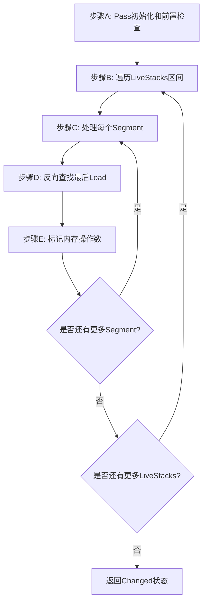

# AMDGPUMarkLastScratchLoad.cpp 代码功能详解

## 1. 主要功能概述

<a name="ref-block_0"></a>`AMDGPUMarkLastScratchLoad.cpp` 实现了一个 LLVM 机器函数优化 Pass，其主要功能是**标记确保为最后一次使用的 scratch load/spill 指令，使得这些 scratch 槽位可以从缓存中被驱逐**。 llvm-project:9-10[<sup>↗</sup>](#block_0) 

**作用和效果：**
<a name="ref-block_3"></a>- **目标架构**：此 Pass 仅在 GFX12 及更高版本的 AMDGPU 架构上运行 llvm-project:89-90[<sup>↗</sup>](#block_3) 
- **优化效果**：通过在最后一次 scratch load 指令上设置 `MOLastUse` 标记，可以提示硬件及时从缓存中清除不再需要的数据，优化缓存使用效率
<a name="ref-block_1"></a>- **当前限制**：目前仅处理 spilling 场景，尚未处理一般的栈访问 llvm-project:12-12[<sup>↗</sup>](#block_1) 

## 2. 主要实现步骤和子功能

该 Pass 的实现包含以下核心步骤：

### 步骤 A：Pass 初始化和前置检查
### 步骤 B：遍历所有 LiveStacks 区间
### 步骤 C：处理每个 LiveRange 段（Segment）
### 步骤 D：在段内反向查找最后一次 Load 指令
### 步骤 E：标记最后一次 Load 的内存操作数

## 3. 各步骤的详细分析

### 步骤 A：Pass 初始化和前置检查

**功能描述：**
此步骤负责验证运行条件并初始化必要的数据结构。

**关键实现：**
<a name="ref-block_3"></a>- 检查目标架构是否为 GFX12 或更高版本，如果不是则直接返回 llvm-project:89-90[<sup>↗</sup>](#block_3) 
<a name="ref-block_4"></a>- 获取 `SIInstrInfo` 指令信息接口 llvm-project:92-92[<sup>↗</sup>](#block_4) 
<a name="ref-block_5"></a>- 检查是否存在 live slots，如果没有则跳过处理 llvm-project:95-99[<sup>↗</sup>](#block_5) 

**依赖的分析：**
Pass 需要三个关键的分析结果：
- `LiveStacks`：栈槽的活跃性信息
- `LiveIntervals`：活跃区间信息
<a name="ref-block_2"></a>- `SlotIndexes`：指令索引信息 llvm-project:49-54[<sup>↗</sup>](#block_2) 

### 步骤 B：遍历所有 LiveStacks 区间

**功能描述：**
遍历所有的栈槽（stack slot）及其对应的活跃区间（LiveInterval）。

**实现细节：**
<a name="ref-block_7"></a>使用范围 for 循环遍历 `LiveStacks` 中的所有栈槽和对应的活跃区间： llvm-project:105-105[<sup>↗</sup>](#block_7) 

### 步骤 C：处理每个 LiveRange 段（Segment）

**功能描述：**
对每个活跃区间中的各个段进行处理，确定段的起始和结束位置。

**核心逻辑：**

<a name="ref-block_8"></a>1. **过滤条件**：忽略运行到基本块末尾的段，因为此时槽位在基本块末尾仍然是活跃的 llvm-project:108-111[<sup>↗</sup>](#block_8) 

2. **获取段信息**：
<a name="ref-block_9"></a>   - 提取帧索引（Frame Index） llvm-project:113-113[<sup>↗</sup>](#block_9) 
<a name="ref-block_10"></a>   - 获取段结束位置的指令，如果该位置指令已被删除，则获取下一个非空位置的指令 llvm-project:116-123[<sup>↗</sup>](#block_10) 
<a name="ref-block_11"></a>   - 获取段起始位置的指令和所在的基本块 llvm-project:125-126[<sup>↗</sup>](#block_11) 

### 步骤 D：在段内反向查找最后一次 Load 指令

**功能描述：**
从段的结束位置向起始位置反向遍历，查找最后一次从该栈槽加载的指令。

**搜索策略：**
<a name="ref-block_12"></a>- 确定反向遍历的终止位置：如果段的起始指令和结束指令在同一个基本块，则遍历到起始指令；否则遍历到基本块开头 llvm-project:128-132[<sup>↗</sup>](#block_12) 

<a name="ref-block_13"></a>- 使用反向迭代器从段结束位置开始查找 llvm-project:134-134[<sup>↗</sup>](#block_13) 

<a name="ref-block_14"></a>- 检查每条指令是否是从目标栈槽的加载指令： llvm-project:135-141[<sup>↗</sup>](#block_14) 

### 步骤 E：标记最后一次 Load 的内存操作数

**功能描述：**
为找到的最后一次 load 指令的内存操作数设置 `MOLastUse` 标记。

**实现细节：**
<a name="ref-block_15"></a>- 验证指令是否有内存操作数 llvm-project:143-143[<sup>↗</sup>](#block_15) 
<a name="ref-block_16"></a>- 获取第一个内存操作数并设置 `MOLastUse` 标记 llvm-project:144-145[<sup>↗</sup>](#block_16) 
<a name="ref-block_17"></a>- 标记 Pass 已做出修改 llvm-project:146-146[<sup>↗</sup>](#block_17) 

## 4. 步骤之间的关系

### 控制流关系图



### 依赖关系

1. **层级结构**：
   - 步骤 A 是所有后续步骤的前提条件
   - 步骤 B-E 形成了三层嵌套循环结构：外层遍历栈槽 → 中层遍历段 → 内层查找指令

2. **数据流依赖**：
   - 步骤 B 依赖步骤 A 提供的 `LiveStacks` 和架构验证
   - 步骤 C 依赖步骤 B 提供的栈槽和活跃区间信息
   - 步骤 D 依赖步骤 C 确定的段边界信息
   - 步骤 E 依赖步骤 D 找到的目标 load 指令

3. **状态维护**：
<a name="ref-block_6"></a>   - `Changed` 变量贯穿整个过程，记录是否有任何修改 llvm-project:103-103[<sup>↗</sup>](#block_6) 
   - 最终返回值决定 LLVM Pass 管理器是否需要更新相关的分析信息

## Notes

此 Pass 的设计体现了 LLVM 后端优化的典型模式：
- **保守性原则**：只处理确定为最后一次使用的情况（不跨基本块边界、忽略段末尾仍活跃的情况）
- **分析驱动**：充分利用 LLVM 的分析基础设施（LiveStacks、LiveIntervals、SlotIndexes）
- **架构特定**：仅针对支持该优化的 GFX12+ 架构启用
<a name="ref-block_1"></a>- **未来扩展**：代码注释表明计划扩展到处理一般栈访问，而不仅限于 spilling llvm-project:12-12[<sup>↗</sup>](#block_1)
### Citations
<a name="block_0"></a>**File:** llvm/lib/Target/AMDGPU/AMDGPUMarkLastScratchLoad.cpp (L9-10) [<sup>↩</sup>](#ref-block_0)
```cpp
// Mark scratch load/spill instructions which are guaranteed to be the last time
// this scratch slot is used so it can be evicted from caches.
```
<a name="block_1"></a>**File:** llvm/lib/Target/AMDGPU/AMDGPUMarkLastScratchLoad.cpp (L12-12) [<sup>↩</sup>](#ref-block_1) [<sup>↩</sup>](#ref-block_1)
```cpp
// TODO: Handle general stack accesses not just spilling.
```
<a name="block_2"></a>**File:** llvm/lib/Target/AMDGPU/AMDGPUMarkLastScratchLoad.cpp (L49-54) [<sup>↩</sup>](#ref-block_2)
```cpp
  void getAnalysisUsage(AnalysisUsage &AU) const override {
    AU.addRequired<SlotIndexesWrapperPass>();
    AU.addRequired<LiveIntervalsWrapperPass>();
    AU.addRequired<LiveStacksWrapperLegacy>();
    AU.setPreservesAll();
    MachineFunctionPass::getAnalysisUsage(AU);
```
<a name="block_3"></a>**File:** llvm/lib/Target/AMDGPU/AMDGPUMarkLastScratchLoad.cpp (L89-90) [<sup>↩</sup>](#ref-block_3) [<sup>↩</sup>](#ref-block_3)
```cpp
  if (ST.getGeneration() < AMDGPUSubtarget::GFX12)
    return false;
```
<a name="block_4"></a>**File:** llvm/lib/Target/AMDGPU/AMDGPUMarkLastScratchLoad.cpp (L92-92) [<sup>↩</sup>](#ref-block_4)
```cpp
  SII = ST.getInstrInfo();
```
<a name="block_5"></a>**File:** llvm/lib/Target/AMDGPU/AMDGPUMarkLastScratchLoad.cpp (L95-99) [<sup>↩</sup>](#ref-block_5)
```cpp
  const unsigned NumSlots = LS->getNumIntervals();
  if (NumSlots == 0) {
    LLVM_DEBUG(dbgs() << "No live slots, skipping\n");
    return false;
  }
```
<a name="block_6"></a>**File:** llvm/lib/Target/AMDGPU/AMDGPUMarkLastScratchLoad.cpp (L103-103) [<sup>↩</sup>](#ref-block_6)
```cpp
  bool Changed = false;
```
<a name="block_7"></a>**File:** llvm/lib/Target/AMDGPU/AMDGPUMarkLastScratchLoad.cpp (L105-105) [<sup>↩</sup>](#ref-block_7)
```cpp
  for (auto &[SS, LI] : *LS) {
```
<a name="block_8"></a>**File:** llvm/lib/Target/AMDGPU/AMDGPUMarkLastScratchLoad.cpp (L108-111) [<sup>↩</sup>](#ref-block_8)
```cpp
      // Ignore segments that run to the end of basic block because in this case
      // slot is still live at the end of it.
      if (Segment.end.isBlock())
        continue;
```
<a name="block_9"></a>**File:** llvm/lib/Target/AMDGPU/AMDGPUMarkLastScratchLoad.cpp (L113-113) [<sup>↩</sup>](#ref-block_9)
```cpp
      const int FrameIndex = LI.reg().stackSlotIndex();
```
<a name="block_10"></a>**File:** llvm/lib/Target/AMDGPU/AMDGPUMarkLastScratchLoad.cpp (L116-123) [<sup>↩</sup>](#ref-block_10)
```cpp
      MachineInstr *MISegmentEnd = SI->getInstructionFromIndex(Segment.end);

      // If there is no instruction at this slot because it was deleted take the
      // instruction from the next slot.
      if (!MISegmentEnd) {
        SlotIndex NextSlot = Slots.getNextNonNullIndex(Segment.end);
        MISegmentEnd = SI->getInstructionFromIndex(NextSlot);
      }
```
<a name="block_11"></a>**File:** llvm/lib/Target/AMDGPU/AMDGPUMarkLastScratchLoad.cpp (L125-126) [<sup>↩</sup>](#ref-block_11)
```cpp
      MachineInstr *MISegmentStart = SI->getInstructionFromIndex(Segment.start);
      MachineBasicBlock *BB = MISegmentEnd->getParent();
```
<a name="block_12"></a>**File:** llvm/lib/Target/AMDGPU/AMDGPUMarkLastScratchLoad.cpp (L128-132) [<sup>↩</sup>](#ref-block_12)
```cpp
      // Start iteration backwards from segment end until the start of basic
      // block or start of segment if it is in the same basic block.
      auto End = BB->rend();
      if (MISegmentStart && MISegmentStart->getParent() == BB)
        End = MISegmentStart->getReverseIterator();
```
<a name="block_13"></a>**File:** llvm/lib/Target/AMDGPU/AMDGPUMarkLastScratchLoad.cpp (L134-134) [<sup>↩</sup>](#ref-block_13)
```cpp
      for (auto MI = MISegmentEnd->getReverseIterator(); MI != End; ++MI) {
```
<a name="block_14"></a>**File:** llvm/lib/Target/AMDGPU/AMDGPUMarkLastScratchLoad.cpp (L135-141) [<sup>↩</sup>](#ref-block_14)
```cpp
        int LoadFI = 0;

        if (SII->isLoadFromStackSlot(*MI, LoadFI) && LoadFI == FrameIndex) {
          LastLoad = &*MI;
          break;
        }
      }
```
<a name="block_15"></a>**File:** llvm/lib/Target/AMDGPU/AMDGPUMarkLastScratchLoad.cpp (L143-143) [<sup>↩</sup>](#ref-block_15)
```cpp
      if (LastLoad && !LastLoad->memoperands_empty()) {
```
<a name="block_16"></a>**File:** llvm/lib/Target/AMDGPU/AMDGPUMarkLastScratchLoad.cpp (L144-145) [<sup>↩</sup>](#ref-block_16)
```cpp
        MachineMemOperand *MMO = *LastLoad->memoperands_begin();
        MMO->setFlags(MOLastUse);
```
<a name="block_17"></a>**File:** llvm/lib/Target/AMDGPU/AMDGPUMarkLastScratchLoad.cpp (L146-146) [<sup>↩</sup>](#ref-block_17)
```cpp
        Changed = true;
```