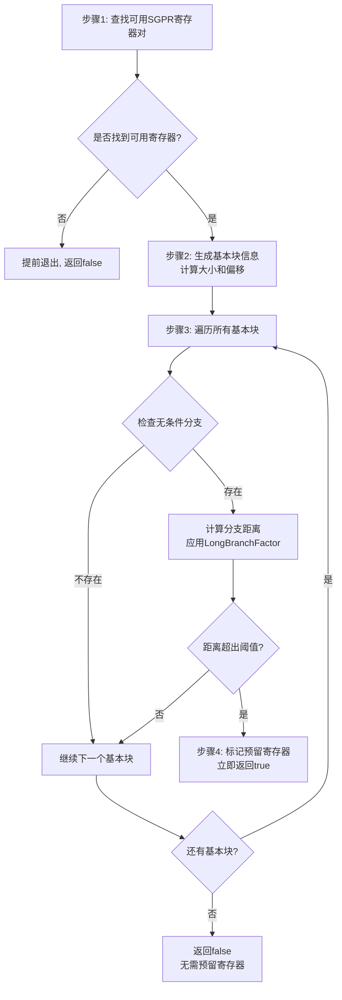

# GCNPreRALongBranchReg.cpp 代码功能详解

## 1. Pass的主要功能概述

这个pass是**AMDGPU Pre-RA Long Branch Reg**，运行在寄存器分配（Register Allocation）之前，其核心功能是：

<a name="ref-block_0"></a>**作用**：在寄存器分配之前估算分支大小，如果检测到可能存在长分支（long branch），则预留一对SGPR寄存器供后续处理长分支使用。 llvm-project:9-15[<sup>↗</sup>](#block_0) 

**效果**：通过提前预留寄存器，确保在后续编译阶段如果需要处理超出直接分支范围的跳转时，有可用的寄存器来实现间接跳转或多步跳转。

## 2. 主要功能实现步骤

该pass包含以下主要步骤和子功能：

<a name="ref-block_5"></a>### 步骤1：查找可用的SGPR寄存器对 llvm-project:123-131[<sup>↗</sup>](#block_5) 

<a name="ref-block_4"></a>### 步骤2：生成基本块信息 llvm-project:85-114[<sup>↗</sup>](#block_4) 

<a name="ref-block_6"></a>### 步骤3：遍历检查无条件分支 llvm-project:137-150[<sup>↗</sup>](#block_6) 

### 步骤4：标记预留寄存器 llvm-project:147-148 

## 3. 各步骤的具体描述分析

### 步骤1：查找可用的SGPR寄存器对

**功能**：在`SGPR_64RegClass`寄存器类中查找一个未使用的寄存器对。

**实现细节**：
- 使用`ReserveHighestRegister = true`参数，优先选择最高编号的可用寄存器
- 如果找不到可用寄存器（返回`AMDGPU::NoRegister`），pass提前返回false
- 这样做的原因是在RA之后可以将预留的寄存器下移到更低编号的未使用寄存器对

### 步骤2：生成基本块信息（`generateBlockInfo`）

**功能**：为每个基本块计算近似的大小和在函数中的偏移位置。

**实现细节**：
- **基本块大小估算**：遍历每个基本块的所有指令，跳过元指令（meta instructions，包括debug指令），对剩余指令统计数量后乘以8字节作为近似大小 llvm-project:92-104 

- **偏移计算**：按顺序累加前面所有基本块的大小来计算每个基本块的起始偏移 llvm-project:105-113 

**近似原因**：在RA之前难以精确跟踪分支大小，因为不知道后续会插入哪些spill指令，所以采用每条指令8字节的固定估算。

### 步骤3：遍历检查无条件分支

**功能**：检查所有无条件分支指令，判断其目标基本块是否距离过远。

**实现细节**：
- 只检查无条件分支指令（`isUnconditionalBranch()`）
- 获取分支的目标基本块
- 计算分支距离：使用`LongBranchFactor`因子乘以目标基本块的偏移量
<a name="ref-block_1"></a>  - `LongBranchFactor`是可配置参数，默认值为1.0，用于调整长分支阈值的敏感度 llvm-project:30-38[<sup>↗</sup>](#block_1) 
- 使用`TII->isBranchOffsetInRange()`检查该分支指令是否能够处理计算出的距离

### 步骤4：标记预留寄存器

**功能**：当检测到长分支时，在`SIMachineFunctionInfo`中标记需要预留的寄存器。

**实现细节**：
- 调用`MFI->setLongBranchReservedReg()`保存预留的寄存器编号
- pass返回true表示进行了修改

## 4. 步骤之间的关系

各步骤之间存在**严格的顺序依赖**关系，构成一个决策流水线：



**关键依赖关系**：

1. **步骤1是前提条件**：如果没有可用寄存器，后续步骤都不会执行
2. **步骤2提供数据基础**：为步骤3提供必需的偏移和大小信息
3. **步骤3是检测逻辑**：利用步骤2的数据进行长分支检测
4. **步骤4是最终动作**：只有当步骤3检测到长分支时才执行，并且一旦执行就提前结束整个pass（早期退出优化）

**设计特点**：
- 采用**贪心策略**：一旦发现一个长分支就立即预留寄存器并退出，不需要检查所有分支
- **保守估计**：使用近似计算和可配置的因子来增加检测到长分支的概率，避免后续RA后出现无寄存器可用的情况

## Notes

- 此pass属于AMDGPU目标的机器函数优化阶段，在寄存器分配之前运行
<a name="ref-block_2"></a>- 使用的BasicBlockInfo结构体是pass内部定义的，包含Offset和Size两个字段 llvm-project:42-48[<sup>↗</sup>](#block_2) 
- 代码中注释提到，预留的寄存器最初选择最高编号的SGPR对，在RA之后会调整到更低编号的未使用寄存器对，以优化寄存器使用 llvm-project:123-126 
- `LongBranchFactor`参数允许用户通过命令行选项`-amdgpu-long-branch-factor`来调整长分支检测的敏感度，值越大越倾向于预留寄存器
<a name="ref-block_3"></a>- Pass同时支持新旧Pass Manager框架（Legacy和New PM） llvm-project:57-76[<sup>↗</sup>](#block_3) llvm-project:154-159
### Citations
<a name="block_0"></a>**File:** llvm/lib/Target/AMDGPU/GCNPreRALongBranchReg.cpp (L9-15) [<sup>↩</sup>](#ref-block_0)
```cpp
// \brief Pass to estimate pre RA branch size and reserve a pair of SGPRs if
// there is a long branch. Branch size at this point is difficult to track since
// we have no idea what spills will be inserted later on. We just assume 8 bytes
// per instruction to compute approximations without computing the actual
// instruction size to see if we're in the neighborhood of the maximum branch
// distrance threshold tuning of what is considered "long" is handled through
// amdgpu-long-branch-factor cl argument which sets LongBranchFactor.
```
<a name="block_1"></a>**File:** llvm/lib/Target/AMDGPU/GCNPreRALongBranchReg.cpp (L30-38) [<sup>↩</sup>](#ref-block_1)
```cpp
static cl::opt<double> LongBranchFactor(
    "amdgpu-long-branch-factor", cl::init(1.0), cl::Hidden,
    cl::desc("Factor to apply to what qualifies as a long branch "
             "to reserve a pair of scalar registers. If this value "
             "is 0 the long branch registers are never reserved. As this "
             "value grows the greater chance the branch distance will fall "
             "within the threshold and the registers will be marked to be "
             "reserved. We lean towards always reserving a register for  "
             "long jumps"));
```
<a name="block_2"></a>**File:** llvm/lib/Target/AMDGPU/GCNPreRALongBranchReg.cpp (L42-48) [<sup>↩</sup>](#ref-block_2)
```cpp
  struct BasicBlockInfo {
    // Offset - Distance from the beginning of the function to the beginning
    // of this basic block.
    uint64_t Offset = 0;
    // Size - Size of the basic block in bytes
    uint64_t Size = 0;
  };
```
<a name="block_3"></a>**File:** llvm/lib/Target/AMDGPU/GCNPreRALongBranchReg.cpp (L57-76) [<sup>↩</sup>](#ref-block_3)
```cpp
class GCNPreRALongBranchRegLegacy : public MachineFunctionPass {
public:
  static char ID;
  GCNPreRALongBranchRegLegacy() : MachineFunctionPass(ID) {
    initializeGCNPreRALongBranchRegLegacyPass(*PassRegistry::getPassRegistry());
  }

  bool runOnMachineFunction(MachineFunction &MF) override {
    return GCNPreRALongBranchReg().run(MF);
  }

  StringRef getPassName() const override {
    return "AMDGPU Pre-RA Long Branch Reg";
  }

  void getAnalysisUsage(AnalysisUsage &AU) const override {
    AU.setPreservesAll();
    MachineFunctionPass::getAnalysisUsage(AU);
  }
};
```
<a name="block_4"></a>**File:** llvm/lib/Target/AMDGPU/GCNPreRALongBranchReg.cpp (L85-114) [<sup>↩</sup>](#ref-block_4)
```cpp
void GCNPreRALongBranchReg::generateBlockInfo(
    MachineFunction &MF, SmallVectorImpl<BasicBlockInfo> &BlockInfo) {

  BlockInfo.resize(MF.getNumBlockIDs());

  // Approximate the size of all basic blocks by just
  // assuming 8 bytes per instruction
  for (const MachineBasicBlock &MBB : MF) {
    uint64_t NumInstr = 0;
    // Loop through the basic block and add up all non-debug
    // non-meta instructions
    for (const MachineInstr &MI : MBB) {
      // isMetaInstruction is a superset of isDebugIstr
      if (MI.isMetaInstruction())
        continue;
      NumInstr += 1;
    }
    // Approximate size as just 8 bytes per instruction
    BlockInfo[MBB.getNumber()].Size = 8 * NumInstr;
  }
  uint64_t PrevNum = (&MF)->begin()->getNumber();
  for (auto &MBB :
       make_range(std::next(MachineFunction::iterator((&MF)->begin())),
                  (&MF)->end())) {
    uint64_t Num = MBB.getNumber();
    // Compute the offset immediately following this block.
    BlockInfo[Num].Offset = BlockInfo[PrevNum].Offset + BlockInfo[PrevNum].Size;
    PrevNum = Num;
  }
}
```
<a name="block_5"></a>**File:** llvm/lib/Target/AMDGPU/GCNPreRALongBranchReg.cpp (L123-131) [<sup>↩</sup>](#ref-block_5)
```cpp
  // For now, reserve highest available SGPR pair. After RA,
  // shift down to a lower unused pair of SGPRs
  // If all registers are used, then findUnusedRegister will return
  // AMDGPU::NoRegister.
  constexpr bool ReserveHighestRegister = true;
  Register LongBranchReservedReg = TRI->findUnusedRegister(
      MRI, &AMDGPU::SGPR_64RegClass, MF, ReserveHighestRegister);
  if (!LongBranchReservedReg)
    return false;
```
<a name="block_6"></a>**File:** llvm/lib/Target/AMDGPU/GCNPreRALongBranchReg.cpp (L137-150) [<sup>↩</sup>](#ref-block_6)
```cpp
  for (const MachineBasicBlock &MBB : MF) {
    MachineBasicBlock::const_iterator Last = MBB.getLastNonDebugInstr();
    if (Last == MBB.end() || !Last->isUnconditionalBranch())
      continue;
    MachineBasicBlock *DestBB = TII->getBranchDestBlock(*Last);
    uint64_t BlockDistance = static_cast<uint64_t>(
        LongBranchFactor * BlockInfo[DestBB->getNumber()].Offset);
    // If the distance falls outside the threshold assume it is a long branch
    // and we need to reserve the registers
    if (!TII->isBranchOffsetInRange(Last->getOpcode(), BlockDistance)) {
      MFI->setLongBranchReservedReg(LongBranchReservedReg);
      return true;
    }
  }
```
<a name="block_7"></a>**File:** llvm/lib/Target/AMDGPU/GCNPreRALongBranchReg.cpp (L154-159)
```cpp
PreservedAnalyses
GCNPreRALongBranchRegPass::run(MachineFunction &MF,
                               MachineFunctionAnalysisManager &MFAM) {
  GCNPreRALongBranchReg().run(MF);
  return PreservedAnalyses::all();
}
```