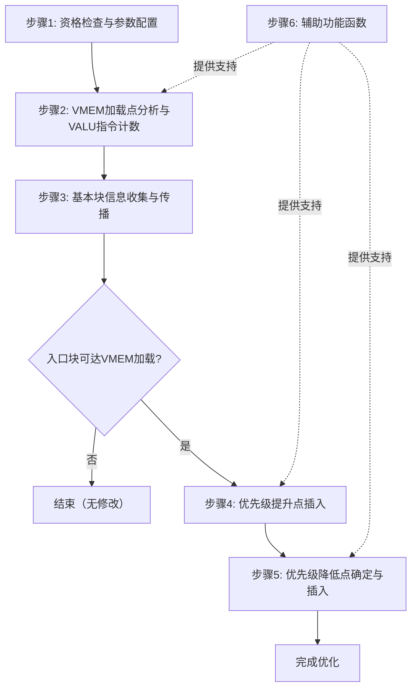

# AMDGPUSetWavePriority.cpp 代码功能分析

## 1. Pass的主要功能概括

<a name="ref-block_0"></a>该Pass的主要功能是**临时提升wave优先级**，从shader函数的开始位置一直持续到最后的VMEM指令，以允许更年轻的wave也能发出它们的VMEM指令。 llvm-project:10-12[<sup>↗</sup>](#block_0) 

**作用与效果：**
<a name="ref-block_6"></a>- 在shader函数入口处提升优先级为高优先级（3） llvm-project:120-120[<sup>↗</sup>](#block_6) 
<a name="ref-block_7"></a>- 在离开可能到达VMEM加载的控制流块的边界上降低优先级为低优先级（0） llvm-project:121-121[<sup>↗</sup>](#block_7) 
- 通过优先级调度优化，改善VMEM指令的并发发射，提高内存访问效率

## 2. 实现主要功能的步骤和子功能

通过遍历代码文件，该Pass包含以下主要步骤和子功能：

1. **资格检查与参数配置**
2. **VMEM加载点分析与VALU指令计数**
3. **基本块信息收集与传播**
4. **优先级提升点插入**
5. **优先级降低点确定与插入**
6. **辅助功能函数**

## 3. 各步骤的具体描述分析

### 步骤1: 资格检查与参数配置

该步骤验证函数是否适合优化，并配置阈值参数：
<a name="ref-block_8"></a>- 仅处理入口函数（entry function），通过调用约定检查 llvm-project:124-125[<sup>↗</sup>](#block_8) 
<a name="ref-block_1"></a>- 从函数属性或命令行选项读取VALU指令阈值，默认值为100条指令 llvm-project:28-31[<sup>↗</sup>](#block_1) 
<a name="ref-block_9"></a>- 支持通过函数属性`amdgpu-wave-priority-threshold`自定义阈值 llvm-project:131-133[<sup>↗</sup>](#block_9) 

### 步骤2: VMEM加载点分析与VALU指令计数

这是核心分析阶段，使用后序遍历分析每个基本块：
<a name="ref-block_10"></a>- 以后序方式遍历所有基本块 llvm-project:142-142[<sup>↗</sup>](#block_10) 
<a name="ref-block_11"></a>- 跟踪每个基本块中的VALU指令数量，区分块开始、中间和结尾的VALU指令 llvm-project:143-164[<sup>↗</sup>](#block_11) 
- 识别VMEM加载指令并记录最后一条VMEM加载指令的位置 llvm-project:147-153 
- DS指令被视为内存屏障，会重置VALU计数 llvm-project:154-158 

### 步骤3: 基本块信息收集与传播

该步骤维护每个基本块的元数据信息：
<a name="ref-block_2"></a>- 使用MBBInfo结构体存储基本块信息，包括VALU指令数量、是否可能到达VMEM加载、最后的VMEM加载指令 llvm-project:35-40[<sup>↗</sup>](#block_2) 
<a name="ref-block_12"></a>- 从后继块传播信息，计算从函数开始到当前块可能执行的最大VALU指令数 llvm-project:166-178[<sup>↗</sup>](#block_12) 
<a name="ref-block_13"></a>- 确定基本块是否可能到达满足阈值条件的VMEM加载 llvm-project:179-184[<sup>↗</sup>](#block_13) 

### 步骤4: 优先级提升点插入

在shader入口处插入高优先级设置：
<a name="ref-block_14"></a>- 检查入口块是否可能到达VMEM加载，如果不能则跳过优化 llvm-project:186-188[<sup>↗</sup>](#block_14) 
<a name="ref-block_15"></a>- 在第一条VALU指令或终止指令之前插入S_SETPRIO指令，设置高优先级（3） llvm-project:191-194[<sup>↗</sup>](#block_15) 

### 步骤5: 优先级降低点确定与插入

智能地选择降低优先级的位置：
<a name="ref-block_16"></a>- 对于没有后继的块（退出块），如果可到达VMEM加载则标记为需要降低优先级 llvm-project:200-203[<sup>↗</sup>](#block_16) 
<a name="ref-block_17"></a>- 尝试在前驱块中直接降低优先级（当满足特定条件时） llvm-project:206-211[<sup>↗</sup>](#block_17) 
<a name="ref-block_18"></a>- 如果无法在前驱块中降低，则在接收控制流的块内部降低（例如循环内部） llvm-project:214-221[<sup>↗</sup>](#block_18) 
<a name="ref-block_19"></a>- 在选定的块中插入S_SETPRIO指令，设置低优先级（0），位置在最后一条VMEM加载之后或块开始处 llvm-project:223-230[<sup>↗</sup>](#block_19) 

### 步骤6: 辅助功能函数

包含几个重要的辅助函数：

<a name="ref-block_3"></a>- **BuildSetprioMI**: 构建S_SETPRIO机器指令 llvm-project:83-89[<sup>↗</sup>](#block_3) 
<a name="ref-block_5"></a>- **isVMEMLoad**: 判断指令是否为VMEM加载指令 llvm-project:106-108[<sup>↗</sup>](#block_5) 
<a name="ref-block_4"></a>- **CanLowerPriorityDirectlyInPredecessors**: 检查是否可以直接在前驱块中降低优先级，确保没有前驱的其他后继块可以到达VMEM加载 llvm-project:92-104[<sup>↗</sup>](#block_4) 

## 4. 步骤之间的关系

各步骤形成一个清晰的流水线处理过程：



**关系描述：**

1. **顺序依赖**：步骤1-3是严格的顺序关系，后一步骤依赖前一步骤的结果
2. **条件分支**：步骤3完成后，根据分析结果决定是否继续优化
3. **并行支持**：步骤6中的辅助函数为其他步骤提供工具支持，贯穿整个处理过程
4. **数据流动**：
   - 步骤2和3构建MBBInfoSet数据结构
   - 步骤4和5使用该数据结构决定插入位置
   - 步骤6提供的函数被步骤2、4、5调用

## Notes

- 该Pass假设可以忽略回边/循环、分支概率等细节，本质上是确定从函数开始沿每条可能路径（不考虑回边）可能执行的最大VALU指令数
- VALU指令阈值是优化的关键参数，决定了哪些VMEM加载需要被优化
- 优先级调整策略考虑了控制流图的复杂性，在无法在前驱块降低优先级时会退而求其次在循环内部降低
- 该Pass仅针对entry函数生效，不处理被调用的子函数
### Citations
<a name="block_0"></a>**File:** llvm/lib/Target/AMDGPU/AMDGPUSetWavePriority.cpp (L10-12) [<sup>↩</sup>](#ref-block_0)
```cpp
/// Pass to temporarily raise the wave priority beginning the start of
/// the shader function until its last VMEM instructions to allow younger
/// waves to issue their VMEM instructions as well.
```
<a name="block_1"></a>**File:** llvm/lib/Target/AMDGPU/AMDGPUSetWavePriority.cpp (L28-31) [<sup>↩</sup>](#ref-block_1)
```cpp
static cl::opt<unsigned> DefaultVALUInstsThreshold(
    "amdgpu-set-wave-priority-valu-insts-threshold",
    cl::desc("VALU instruction count threshold for adjusting wave priority"),
    cl::init(100), cl::Hidden);
```
<a name="block_2"></a>**File:** llvm/lib/Target/AMDGPU/AMDGPUSetWavePriority.cpp (L35-40) [<sup>↩</sup>](#ref-block_2)
```cpp
struct MBBInfo {
  MBBInfo() = default;
  unsigned NumVALUInstsAtStart = 0;
  bool MayReachVMEMLoad = false;
  MachineInstr *LastVMEMLoad = nullptr;
};
```
<a name="block_3"></a>**File:** llvm/lib/Target/AMDGPU/AMDGPUSetWavePriority.cpp (L83-89) [<sup>↩</sup>](#ref-block_3)
```cpp
MachineInstr *
AMDGPUSetWavePriority::BuildSetprioMI(MachineBasicBlock &MBB,
                                      MachineBasicBlock::iterator I,
                                      unsigned priority) const {
  return BuildMI(MBB, I, DebugLoc(), TII->get(AMDGPU::S_SETPRIO))
      .addImm(priority);
}
```
<a name="block_4"></a>**File:** llvm/lib/Target/AMDGPU/AMDGPUSetWavePriority.cpp (L92-104) [<sup>↩</sup>](#ref-block_4)
```cpp
// none of Pred's successors can reach a VMEM load.
static bool CanLowerPriorityDirectlyInPredecessors(const MachineBasicBlock &MBB,
                                                   MBBInfoSet &MBBInfos) {
  for (const MachineBasicBlock *Pred : MBB.predecessors()) {
    if (!MBBInfos[Pred].MayReachVMEMLoad)
      continue;
    for (const MachineBasicBlock *Succ : Pred->successors()) {
      if (MBBInfos[Succ].MayReachVMEMLoad)
        return false;
    }
  }
  return true;
}
```
<a name="block_5"></a>**File:** llvm/lib/Target/AMDGPU/AMDGPUSetWavePriority.cpp (L106-108) [<sup>↩</sup>](#ref-block_5)
```cpp
static bool isVMEMLoad(const MachineInstr &MI) {
  return SIInstrInfo::isVMEM(MI) && MI.mayLoad();
}
```
<a name="block_6"></a>**File:** llvm/lib/Target/AMDGPU/AMDGPUSetWavePriority.cpp (L120-120) [<sup>↩</sup>](#ref-block_6)
```cpp
  const unsigned HighPriority = 3;
```
<a name="block_7"></a>**File:** llvm/lib/Target/AMDGPU/AMDGPUSetWavePriority.cpp (L121-121) [<sup>↩</sup>](#ref-block_7)
```cpp
  const unsigned LowPriority = 0;
```
<a name="block_8"></a>**File:** llvm/lib/Target/AMDGPU/AMDGPUSetWavePriority.cpp (L124-125) [<sup>↩</sup>](#ref-block_8)
```cpp
  if (!AMDGPU::isEntryFunctionCC(F.getCallingConv()))
    return false;
```
<a name="block_9"></a>**File:** llvm/lib/Target/AMDGPU/AMDGPUSetWavePriority.cpp (L131-133) [<sup>↩</sup>](#ref-block_9)
```cpp
  Attribute A = F.getFnAttribute("amdgpu-wave-priority-threshold");
  if (A.isValid())
    A.getValueAsString().getAsInteger(0, VALUInstsThreshold);
```
<a name="block_10"></a>**File:** llvm/lib/Target/AMDGPU/AMDGPUSetWavePriority.cpp (L142-142) [<sup>↩</sup>](#ref-block_10)
```cpp
  for (MachineBasicBlock *MBB : post_order(&MF)) {
```
<a name="block_11"></a>**File:** llvm/lib/Target/AMDGPU/AMDGPUSetWavePriority.cpp (L143-164) [<sup>↩</sup>](#ref-block_11)
```cpp
    bool AtStart = true;
    unsigned MaxNumVALUInstsInMiddle = 0;
    unsigned NumVALUInstsAtEnd = 0;
    for (MachineInstr &MI : *MBB) {
      if (isVMEMLoad(MI)) {
        AtStart = false;
        MBBInfo &Info = MBBInfos[MBB];
        Info.NumVALUInstsAtStart = 0;
        MaxNumVALUInstsInMiddle = 0;
        NumVALUInstsAtEnd = 0;
        Info.LastVMEMLoad = &MI;
      } else if (SIInstrInfo::isDS(MI)) {
        AtStart = false;
        MaxNumVALUInstsInMiddle =
            std::max(MaxNumVALUInstsInMiddle, NumVALUInstsAtEnd);
        NumVALUInstsAtEnd = 0;
      } else if (SIInstrInfo::isVALU(MI)) {
        if (AtStart)
          ++MBBInfos[MBB].NumVALUInstsAtStart;
        ++NumVALUInstsAtEnd;
      }
    }
```
<a name="block_12"></a>**File:** llvm/lib/Target/AMDGPU/AMDGPUSetWavePriority.cpp (L166-178) [<sup>↩</sup>](#ref-block_12)
```cpp
    bool SuccsMayReachVMEMLoad = false;
    unsigned NumFollowingVALUInsts = 0;
    for (const MachineBasicBlock *Succ : MBB->successors()) {
      const MBBInfo &SuccInfo = MBBInfos[Succ];
      SuccsMayReachVMEMLoad |= SuccInfo.MayReachVMEMLoad;
      NumFollowingVALUInsts =
          std::max(NumFollowingVALUInsts, SuccInfo.NumVALUInstsAtStart);
    }
    MBBInfo &Info = MBBInfos[MBB];
    if (AtStart)
      Info.NumVALUInstsAtStart += NumFollowingVALUInsts;
    NumVALUInstsAtEnd += NumFollowingVALUInsts;

```
<a name="block_13"></a>**File:** llvm/lib/Target/AMDGPU/AMDGPUSetWavePriority.cpp (L179-184) [<sup>↩</sup>](#ref-block_13)
```cpp
    unsigned MaxNumVALUInsts =
        std::max(MaxNumVALUInstsInMiddle, NumVALUInstsAtEnd);
    Info.MayReachVMEMLoad =
        SuccsMayReachVMEMLoad ||
        (Info.LastVMEMLoad && MaxNumVALUInsts >= VALUInstsThreshold);
  }
```
<a name="block_14"></a>**File:** llvm/lib/Target/AMDGPU/AMDGPUSetWavePriority.cpp (L186-188) [<sup>↩</sup>](#ref-block_14)
```cpp
  MachineBasicBlock &Entry = MF.front();
  if (!MBBInfos[&Entry].MayReachVMEMLoad)
    return false;
```
<a name="block_15"></a>**File:** llvm/lib/Target/AMDGPU/AMDGPUSetWavePriority.cpp (L191-194) [<sup>↩</sup>](#ref-block_15)
```cpp
  MachineBasicBlock::iterator I = Entry.begin(), E = Entry.end();
  while (I != E && !SIInstrInfo::isVALU(*I) && !I->isTerminator())
    ++I;
  BuildSetprioMI(Entry, I, HighPriority);
```
<a name="block_16"></a>**File:** llvm/lib/Target/AMDGPU/AMDGPUSetWavePriority.cpp (L200-203) [<sup>↩</sup>](#ref-block_16)
```cpp
    if (MBBInfos[&MBB].MayReachVMEMLoad) {
      if (MBB.succ_empty())
        PriorityLoweringBlocks.insert(&MBB);
      continue;
```
<a name="block_17"></a>**File:** llvm/lib/Target/AMDGPU/AMDGPUSetWavePriority.cpp (L206-211) [<sup>↩</sup>](#ref-block_17)
```cpp
    if (CanLowerPriorityDirectlyInPredecessors(MBB, MBBInfos)) {
      for (MachineBasicBlock *Pred : MBB.predecessors()) {
        if (MBBInfos[Pred].MayReachVMEMLoad)
          PriorityLoweringBlocks.insert(Pred);
      }
      continue;
```
<a name="block_18"></a>**File:** llvm/lib/Target/AMDGPU/AMDGPUSetWavePriority.cpp (L214-221) [<sup>↩</sup>](#ref-block_18)
```cpp
    // Where lowering the priority in predecessors is not possible, the
    // block receiving control either was not part of a loop in the first
    // place or the loop simplification/canonicalization pass should have
    // already tried to split the edge and insert a preheader, and if for
    // whatever reason it failed to do so, then this leaves us with the
    // only option of lowering the priority within the loop.
    PriorityLoweringBlocks.insert(&MBB);
  }
```
<a name="block_19"></a>**File:** llvm/lib/Target/AMDGPU/AMDGPUSetWavePriority.cpp (L223-230) [<sup>↩</sup>](#ref-block_19)
```cpp
  for (MachineBasicBlock *MBB : PriorityLoweringBlocks) {
    MachineInstr *LastVMEMLoad = MBBInfos[MBB].LastVMEMLoad;
    BuildSetprioMI(*MBB,
                   LastVMEMLoad
                       ? std::next(MachineBasicBlock::iterator(LastVMEMLoad))
                       : MBB->begin(),
                   LowPriority);
  }
```