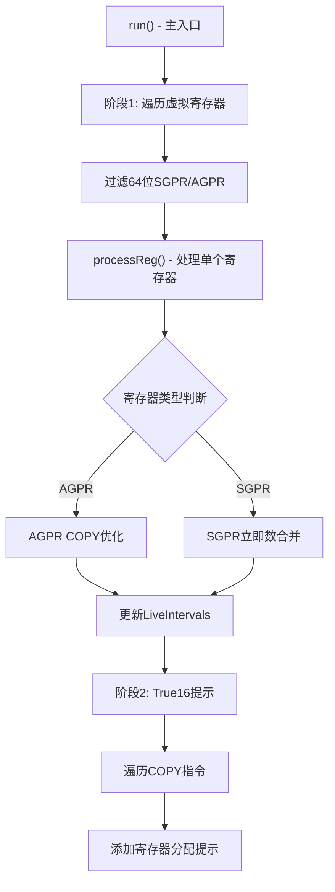

# GCNPreRAOptimizations.cpp 代码功能分析

## 1. Pass 主要功能概述

这个 pass 是一个在寄存器分配前（Pre-RA）执行的优化 pass，主要有两个核心功能：

**功能一：合并分割的寄存器元组初始化**

<a name="ref-block_0"></a>该 pass 将分割的寄存器元组初始化合并为单个伪指令，例如将两个分别初始化 64 位寄存器低 32 位和高 32 位的 `S_MOV_B32` 指令合并成一个 `S_MOV_B64_IMM_PSEUDO` 指令。 llvm-project:10-16[<sup>↗</sup>](#block_0) 

<a name="ref-block_1"></a>这样做的目的是允许值的重新物化（rematerialization）而不是溢出（spilling）到内存，从而提高性能。该优化设计在寄存器合并器（register coalescer）之后、实际寄存器分配之前执行。 llvm-project:17-19[<sup>↗</sup>](#block_1) 

**功能二：添加寄存器分配提示**

<a name="ref-block_2"></a>该 pass 还为 COPY 指令添加寄存器分配提示（register allocation hints），这些提示会被 `SIRegisterInfo::getRegAllocationHints` 后处理。特别是在使用 True16 时，当 COPY 在 VGPR_32 和 VGPR_16 之间移动 16 位值时，如果使用对应于 VGPR_32 低 16 位的 VGPR_16，COPY 可以完全被消除。 llvm-project:25-29[<sup>↗</sup>](#block_2) 

## 2. 主要功能实现步骤

该文件包含以下主要组件和步骤：

1. **GCNPreRAOptimizationsImpl 类** - 核心实现类
2. **processReg() 方法** - 处理单个寄存器的优化
3. **run() 方法** - 遍历所有虚拟寄存器并应用优化
4. **Legacy Pass 封装** - 用于集成到旧版 pass 管理器
5. **AGPR 优化子功能** - 处理累加器 VGPR 的 COPY 优化
6. **SGPR 合并子功能** - 合并 SGPR 的立即数初始化
7. **True16 提示子功能** - 为 True16 COPY 添加分配提示

## 3. 各步骤/子功能的详细分析

### 3.1 GCNPreRAOptimizationsImpl 核心实现类

<a name="ref-block_3"></a>该类封装了优化的主要逻辑，持有必要的上下文信息包括指令信息（TII）、寄存器信息（TRI）、寄存器信息管理器（MRI）和活跃区间（LiveIntervals）。 llvm-project:48-60[<sup>↗</sup>](#block_3) 

### 3.2 processReg() 方法 - 寄存器处理核心

这是最核心的方法，处理单个寄存器的所有定义指令。该方法根据寄存器类型执行不同的优化：

**AGPR 处理分支：**
- 识别 AGPR 到 AGPR 的 COPY 指令
- 查找源寄存器的 `V_ACCVGPR_WRITE_B32_e64` 定义
- 将 COPY 的源操作数直接替换为 accvgpr_write 的源操作数，避免中间临时寄存器
<a name="ref-block_5"></a>- 更新修改过的寄存器的活跃区间 llvm-project:110-161[<sup>↗</sup>](#block_5) llvm-project:188-198 

**SGPR 合并分支：**
- 识别两个分别定义 64 位寄存器的 sub0 和 sub1 的 `S_MOV_B32` 指令
- 提取两个 32 位立即数并合并成一个 64 位值
- 将两条指令替换为单个 `S_MOV_B64_IMM_PSEUDO` 指令
<a name="ref-block_6"></a>- 更新活跃区间信息 llvm-project:163-185[<sup>↗</sup>](#block_6) llvm-project:200-225 

### 3.3 run() 方法 - 主优化循环

该方法是优化的入口点，执行两个主要阶段：

**阶段一：遍历虚拟寄存器**
- 遍历所有虚拟寄存器
- 过滤出 64 位 SGPR 或 AGPR（在 GFX90A 上）
<a name="ref-block_8"></a>- 对每个符合条件的寄存器调用 `processReg()` llvm-project:243-261[<sup>↗</sup>](#block_8) 

**阶段二：True16 寄存器分配提示**
- 如果目标支持真实的 16 位指令，遍历所有 COPY 指令
- 为 VGPR_16 和 VGPR_32 之间的 COPY 添加寄存器分配提示
<a name="ref-block_9"></a>- 处理虚拟-物理和虚拟-虚拟寄存器之间的 COPY llvm-project:263-294[<sup>↗</sup>](#block_9) 

### 3.4 Legacy Pass 封装

<a name="ref-block_4"></a>`GCNPreRAOptimizationsLegacy` 类将核心实现封装成 LLVM 旧版 pass 管理器可以使用的形式。它声明依赖于 `LiveIntervals` 分析，并保持所有分析结果不变。 llvm-project:62-81[<sup>↗</sup>](#block_4) 

### 3.5 True16 COPY 优化的具体逻辑

该功能为不同场景设置分配提示：

1. **虚拟 VGPR_16 → 物理 VGPR_32**：提示虚拟寄存器使用物理寄存器的 lo16 子寄存器
2. **物理 VGPR_32 → 虚拟 VGPR_16**：同样设置 lo16 子寄存器提示
3. **虚拟 VGPR_32 ↔ 虚拟 VGPR_16**：设置互相关联的提示，使用特殊的 Size32/Size16 提示类型 llvm-project:273-292 

## 4. 步骤/子功能之间的关系

### 整体流程关系



### 关键依赖关系

1. **LiveIntervals 依赖**：所有优化都依赖于 `LiveIntervals` 分析来正确处理寄存器的生命周期信息，优化后需要更新活跃区间。

2. **顺序依赖**：
   - SGPR/AGPR 优化必须在实际寄存器分配之前完成，以便允许重新物化
   - True16 提示添加在最后，不影响前面的优化
   - 整个 pass 设计在寄存器合并器之后运行

3. **互斥关系**：在 `processReg()` 中，AGPR 和 SGPR 优化是互斥的 - 一个寄存器要么是 AGPR 要么是 SGPR，根据类型执行相应的优化分支。 llvm-project:188-202 

4. **条件启用**：True16 优化只在目标架构支持真实 16 位指令时启用，而 AGPR 优化只在 GFX90A 或更新的架构上运行。 llvm-project:256-258 llvm-project:263-264 

## Notes

目前该 pass 的限制：
- SGPR 合并优化仅处理 64 位 SGPR 和立即数初始化器
- 理论上可以扩展到其他寄存器类和指令类型，但目前的实现专注于最常见的优化场景
- 该优化对减少寄存器溢出压力和提高代码生成质量有重要作用，特别是在 AMDGPU 架构的寄存器受限场景下
### Citations
<a name="block_0"></a>**File:** llvm/lib/Target/AMDGPU/GCNPreRAOptimizations.cpp (L10-16) [<sup>↩</sup>](#ref-block_0)
```cpp
/// This pass combines split register tuple initialization into a single pseudo:
///
///   undef %0.sub1:sreg_64 = S_MOV_B32 1
///   %0.sub0:sreg_64 = S_MOV_B32 2
/// =>
///   %0:sreg_64 = S_MOV_B64_IMM_PSEUDO 0x200000001
///
```
<a name="block_1"></a>**File:** llvm/lib/Target/AMDGPU/GCNPreRAOptimizations.cpp (L17-19) [<sup>↩</sup>](#ref-block_1)
```cpp
/// This is to allow rematerialization of a value instead of spilling. It is
/// supposed to be done after register coalescer to allow it to do its job and
/// before actual register allocation to allow rematerialization.
```
<a name="block_2"></a>**File:** llvm/lib/Target/AMDGPU/GCNPreRAOptimizations.cpp (L25-29) [<sup>↩</sup>](#ref-block_2)
```cpp
/// This pass also adds register allocation hints to COPY.
/// The hints will be post-processed by SIRegisterInfo::getRegAllocationHints.
/// When using True16, we often see COPY moving a 16-bit value between a VGPR_32
/// and a VGPR_16. If we use the VGPR_16 that corresponds to the lo16 bits of
/// the VGPR_32, the COPY can be completely eliminated.
```
<a name="block_3"></a>**File:** llvm/lib/Target/AMDGPU/GCNPreRAOptimizations.cpp (L48-60) [<sup>↩</sup>](#ref-block_3)
```cpp
class GCNPreRAOptimizationsImpl {
private:
  const SIInstrInfo *TII;
  const SIRegisterInfo *TRI;
  MachineRegisterInfo *MRI;
  LiveIntervals *LIS;

  bool processReg(Register Reg);

public:
  GCNPreRAOptimizationsImpl(LiveIntervals *LS) : LIS(LS) {}
  bool run(MachineFunction &MF);
};
```
<a name="block_4"></a>**File:** llvm/lib/Target/AMDGPU/GCNPreRAOptimizations.cpp (L62-81) [<sup>↩</sup>](#ref-block_4)
```cpp
class GCNPreRAOptimizationsLegacy : public MachineFunctionPass {
public:
  static char ID;

  GCNPreRAOptimizationsLegacy() : MachineFunctionPass(ID) {
    initializeGCNPreRAOptimizationsLegacyPass(*PassRegistry::getPassRegistry());
  }

  bool runOnMachineFunction(MachineFunction &MF) override;

  StringRef getPassName() const override {
    return "AMDGPU Pre-RA optimizations";
  }

  void getAnalysisUsage(AnalysisUsage &AU) const override {
    AU.addRequired<LiveIntervalsWrapperPass>();
    AU.setPreservesAll();
    MachineFunctionPass::getAnalysisUsage(AU);
  }
};
```
<a name="block_5"></a>**File:** llvm/lib/Target/AMDGPU/GCNPreRAOptimizations.cpp (L110-161) [<sup>↩</sup>](#ref-block_5)
```cpp
    case AMDGPU::V_ACCVGPR_WRITE_B32_e64:
      break;
    case AMDGPU::COPY: {
      // Some subtargets cannot do an AGPR to AGPR copy directly, and need an
      // intermdiate temporary VGPR register. Try to find the defining
      // accvgpr_write to avoid temporary registers.

      if (!IsAGPRDst)
        return false;

      Register SrcReg = I.getOperand(1).getReg();

      if (!SrcReg.isVirtual())
        break;

      // Check if source of copy is from another AGPR.
      bool IsAGPRSrc = TRI->isAGPRClass(MRI->getRegClass(SrcReg));
      if (!IsAGPRSrc)
        break;

      // def_instructions() does not look at subregs so it may give us a
      // different instruction that defines the same vreg but different subreg
      // so we have to manually check subreg.
      Register SrcSubReg = I.getOperand(1).getSubReg();
      for (auto &Def : MRI->def_instructions(SrcReg)) {
        if (SrcSubReg != Def.getOperand(0).getSubReg())
          continue;

        if (Def.getOpcode() == AMDGPU::V_ACCVGPR_WRITE_B32_e64) {
          MachineOperand DefSrcMO = Def.getOperand(1);

          // Immediates are not an issue and can be propagated in
          // postrapseudos pass. Only handle cases where defining
          // accvgpr_write source is a vreg.
          if (DefSrcMO.isReg() && DefSrcMO.getReg().isVirtual()) {
            // Propagate source reg of accvgpr write to this copy instruction
            I.getOperand(1).setReg(DefSrcMO.getReg());
            I.getOperand(1).setSubReg(DefSrcMO.getSubReg());

            // Reg uses were changed, collect unique set of registers to update
            // live intervals at the end.
            ModifiedRegs.insert(DefSrcMO.getReg());
            ModifiedRegs.insert(SrcReg);

            Changed = true;
          }

          // Found the defining accvgpr_write, stop looking any further.
          break;
        }
      }
      break;
```
<a name="block_6"></a>**File:** llvm/lib/Target/AMDGPU/GCNPreRAOptimizations.cpp (L163-185) [<sup>↩</sup>](#ref-block_6)
```cpp
    case AMDGPU::S_MOV_B32:
      if (I.getOperand(0).getReg() != Reg || !I.getOperand(1).isImm() ||
          I.getNumOperands() != 2)
        return false;

      switch (I.getOperand(0).getSubReg()) {
      default:
        return false;
      case AMDGPU::sub0:
        if (Def0)
          return false;
        Def0 = &I;
        Init |= Lo_32(I.getOperand(1).getImm());
        break;
      case AMDGPU::sub1:
        if (Def1)
          return false;
        Def1 = &I;
        Init |= static_cast<uint64_t>(I.getOperand(1).getImm()) << 32;
        break;
      }
      break;
    }
```
<a name="block_7"></a>**File:** llvm/lib/Target/AMDGPU/GCNPreRAOptimizations.cpp (L188-225)
```cpp
  // For AGPR reg, check if live intervals need to be updated.
  if (IsAGPRDst) {
    if (Changed) {
      for (Register RegToUpdate : ModifiedRegs) {
        LIS->removeInterval(RegToUpdate);
        LIS->createAndComputeVirtRegInterval(RegToUpdate);
      }
    }

    return Changed;
  }

  // For SGPR reg, check if we can combine instructions.
  if (!Def0 || !Def1 || Def0->getParent() != Def1->getParent())
    return Changed;

  LLVM_DEBUG(dbgs() << "Combining:\n  " << *Def0 << "  " << *Def1
                    << "    =>\n");

  if (SlotIndex::isEarlierInstr(LIS->getInstructionIndex(*Def1),
                                LIS->getInstructionIndex(*Def0)))
    std::swap(Def0, Def1);

  LIS->RemoveMachineInstrFromMaps(*Def0);
  LIS->RemoveMachineInstrFromMaps(*Def1);
  auto NewI = BuildMI(*Def0->getParent(), *Def0, Def0->getDebugLoc(),
                      TII->get(AMDGPU::S_MOV_B64_IMM_PSEUDO), Reg)
                  .addImm(Init);

  Def0->eraseFromParent();
  Def1->eraseFromParent();
  LIS->InsertMachineInstrInMaps(*NewI);
  LIS->removeInterval(Reg);
  LIS->createAndComputeVirtRegInterval(Reg);

  LLVM_DEBUG(dbgs() << "  " << *NewI);

  return true;
```
<a name="block_8"></a>**File:** llvm/lib/Target/AMDGPU/GCNPreRAOptimizations.cpp (L243-261) [<sup>↩</sup>](#ref-block_8)
```cpp
bool GCNPreRAOptimizationsImpl::run(MachineFunction &MF) {
  const GCNSubtarget &ST = MF.getSubtarget<GCNSubtarget>();
  TII = ST.getInstrInfo();
  MRI = &MF.getRegInfo();
  TRI = ST.getRegisterInfo();

  bool Changed = false;

  for (unsigned I = 0, E = MRI->getNumVirtRegs(); I != E; ++I) {
    Register Reg = Register::index2VirtReg(I);
    if (!LIS->hasInterval(Reg))
      continue;
    const TargetRegisterClass *RC = MRI->getRegClass(Reg);
    if ((RC->MC->getSizeInBits() != 64 || !TRI->isSGPRClass(RC)) &&
        (ST.hasGFX90AInsts() || !TRI->isAGPRClass(RC)))
      continue;

    Changed |= processReg(Reg);
  }
```
<a name="block_9"></a>**File:** llvm/lib/Target/AMDGPU/GCNPreRAOptimizations.cpp (L263-294) [<sup>↩</sup>](#ref-block_9)
```cpp
  if (!ST.useRealTrue16Insts())
    return Changed;

  // Add RA hints to improve True16 COPY elimination.
  for (const MachineBasicBlock &MBB : MF) {
    for (const MachineInstr &MI : MBB) {
      if (MI.getOpcode() != AMDGPU::COPY)
        continue;
      Register Dst = MI.getOperand(0).getReg();
      Register Src = MI.getOperand(1).getReg();
      if (Dst.isVirtual() &&
          MRI->getRegClass(Dst) == &AMDGPU::VGPR_16RegClass &&
          Src.isPhysical() &&
          TRI->getRegClassForReg(*MRI, Src) == &AMDGPU::VGPR_32RegClass)
        MRI->setRegAllocationHint(Dst, 0, TRI->getSubReg(Src, AMDGPU::lo16));
      if (Src.isVirtual() &&
          MRI->getRegClass(Src) == &AMDGPU::VGPR_16RegClass &&
          Dst.isPhysical() &&
          TRI->getRegClassForReg(*MRI, Dst) == &AMDGPU::VGPR_32RegClass)
        MRI->setRegAllocationHint(Src, 0, TRI->getSubReg(Dst, AMDGPU::lo16));
      if (!Dst.isVirtual() || !Src.isVirtual())
        continue;
      if (MRI->getRegClass(Dst) == &AMDGPU::VGPR_32RegClass &&
          MRI->getRegClass(Src) == &AMDGPU::VGPR_16RegClass) {
        MRI->setRegAllocationHint(Dst, AMDGPURI::Size32, Src);
        MRI->setRegAllocationHint(Src, AMDGPURI::Size16, Dst);
      }
      if (MRI->getRegClass(Dst) == &AMDGPU::VGPR_16RegClass &&
          MRI->getRegClass(Src) == &AMDGPU::VGPR_32RegClass)
        MRI->setRegAllocationHint(Dst, AMDGPURI::Size16, Src);
    }
  }
```