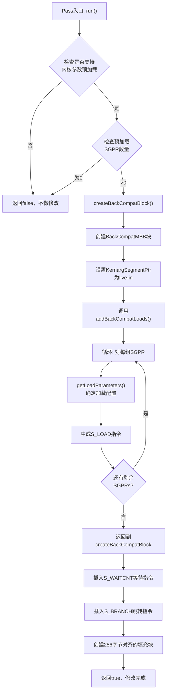

# AMDGPUPreloadKernArgProlog.cpp 代码功能详解

## 1. Pass的主要功能概括

<a name="ref-block_0"></a>这个pass的核心目的是**创建内核参数预加载的向后兼容层**。当代码编译时启用了内核参数预加载功能，但在不支持此功能的硬件/固件上运行时，该pass确保程序仍然能够正常执行。 llvm-project:9-16[<sup>↗</sup>](#block_0) 

**主要效果：**
- 在程序开头插入一个兼容性代码块，使用 `s_load` 指令将内核参数加载到SGPRs中
- 创建两个入口点：支持该特性的固件会自动跳过前256字节，直接执行优化的代码路径；不支持的固件则从兼容性代码块开始执行
<a name="ref-block_1"></a>- 避免了重新编译的需要 llvm-project:18-22[<sup>↗</sup>](#block_1) 

## 2. 主要功能步骤提取

该pass的实现包含以下关键步骤和子功能：

### 核心执行流程：
1. **`run()`** - 主执行函数
2. **`createBackCompatBlock()`** - 创建向后兼容块
3. **`addBackCompatLoads()`** - 添加加载指令
4. **`getLoadParameters()`** - 确定加载参数

### 辅助结构：
5. **`LoadConfig`** - 加载配置结构体
6. **Pass注册机制** - Legacy和新式pass管理器接口

## 3. 各步骤/子功能的具体描述分析

<a name="ref-block_5"></a>### 3.1 主执行函数 `run()` llvm-project:111-121[<sup>↗</sup>](#block_5) 

**功能描述：**
- 检查子目标是否支持内核参数预加载（`hasKernargPreload()`）
- 获取需要预加载的SGPR数量
- 如果条件满足（支持预加载且有需要预加载的SGPR），则调用 `createBackCompatBlock()` 创建兼容性代码

**关键逻辑：** 这是pass的入口点，负责前置条件检查。

<a name="ref-block_6"></a>### 3.2 创建兼容块 `createBackCompatBlock()` llvm-project:123-154[<sup>↗</sup>](#block_6) 

**功能描述：**
此函数执行以下操作：

a) **创建BackCompatMBB块**：在原始内核入口之前插入一个新的机器基本块

b) **设置内核参数段指针**：将 `KernargSegmentPtr` 寄存器标记为活跃（live-in）

c) **调用加载函数**：调用 `addBackCompatLoads()` 生成s_load指令

d) **插入等待指令**：添加 `S_WAITCNT` 指令，等待所有加载完成

e) **添加分支指令**：使用 `S_BRANCH` 跳转到原始内核入口

f) **创建填充块**：创建一个256字节对齐的填充块（PadMBB），使支持该特性的固件能够跳过前256字节

<a name="ref-block_8"></a>### 3.3 添加加载指令 `addBackCompatLoads()` llvm-project:182-202[<sup>↗</sup>](#block_8) 

**功能描述：**
- 循环处理所有需要预加载的SGPRs
- 对于每个加载操作：
  - 调用 `getLoadParameters()` 确定最优的加载大小和指令
  - 生成 `S_LOAD_DWORDX*_IMM` 指令，从内核参数段读取数据到SGPRs
  - 更新偏移量和剩余需要加载的寄存器数量

**关键特点：** 该函数通过贪心算法，每次尝试使用最大的加载大小，提高加载效率。

<a name="ref-block_7"></a>### 3.4 加载参数计算 `getLoadParameters()` llvm-project:156-180[<sup>↗</sup>](#block_7) 

**功能描述：**
- 定义了三种预配置的加载配置：8 DWORD（256位）、4 DWORD（128位）、2 DWORD（64位）
- 根据剩余需要加载的SGPR数量和寄存器对齐要求，选择最大可用的加载大小
- 使用 `getMatchingSuperReg()` 验证是否存在符合要求的超级寄存器
- 如果都不满足，回退到单个DWORD（32位）加载

**设计意图：** 优化内存访问，尽可能使用宽位宽的加载指令减少指令数量。

<a name="ref-block_3"></a>### 3.5 LoadConfig 结构体 llvm-project:42-48[<sup>↗</sup>](#block_3) 

**功能描述：**
封装了s_load指令所需的配置信息：
- `Size`: 加载的DWORD数量
- `RegClass`: 目标寄存器类
- `Opcode`: 使用的s_load指令操作码
- `LoadReg`: 实际使用的目标寄存器

### 3.6 Pass注册机制

<a name="ref-block_4"></a>**Legacy Pass接口：** llvm-project:74-104[<sup>↗</sup>](#block_4) 

<a name="ref-block_9"></a>**新式Pass Manager接口：** llvm-project:204-211[<sup>↗</sup>](#block_9) 

**功能描述：** 提供两种pass管理器接口，确保与LLVM的不同版本和配置兼容。

## 4. 步骤/子功能之间的关系

### 执行流程图：



### 关键依赖关系：

1. **顺序依赖：**
   - `run()` 必须先执行条件检查，再调用 `createBackCompatBlock()`
   - `createBackCompatBlock()` 必须先创建块结构，再调用 `addBackCompatLoads()`
   - 加载指令必须在等待指令（S_WAITCNT）之前完成
   - 等待指令必须在分支指令（S_BRANCH）之前

2. **数据依赖：**
   - `addBackCompatLoads()` 依赖 `getLoadParameters()` 返回的配置信息
   - `getLoadParameters()` 依赖 `LoadConfig` 结构体定义的配置数组
   - 所有函数都依赖 `MFI` 提供的内核参数信息

3. **空间依赖：**
   - BackCompatMBB必须在原始内核入口之前
   - PadMBB必须在BackCompatMBB之后，并256字节对齐
   - 这种布局确保固件能够正确跳过兼容性代码

## Notes

该pass的设计体现了几个重要的工程考虑：

1. **向后兼容性优先**：通过运行时检测而非编译时决策，确保同一份二进制可以在不同固件版本上运行

2. **性能优化**：通过 `getLoadParameters()` 的贪心算法，尽可能使用宽位宽加载指令（最大8 DWORD），减少指令数量和内存访问次数

3. **固件协作**：256字节填充块的设计允许支持该特性的固件直接跳过兼容层，避免不必要的性能开销

<a name="ref-block_2"></a>4. **执行时机**：文档明确指出该pass应尽可能晚运行，以防止优化器将填充代码视为死代码或错误地假设prologue是内核入口块的真实前驱 llvm-project:23-25[<sup>↗</sup>](#block_2)
### Citations
<a name="block_0"></a>**File:** llvm/lib/Target/AMDGPU/AMDGPUPreloadKernArgProlog.cpp (L9-16) [<sup>↩</sup>](#ref-block_0)
```cpp
/// \file This pass creates a backward compatibility layer for kernel argument
/// preloading in situations where code is compiled with kernel argument
/// preloading enabled but executed on hardware without firmware support for it.
///
/// To avoid recompilation, the pass inserts a block at the beginning of the
/// program that loads the kernel arguments into SGPRs using s_load
/// instructions. This sets up the registers exactly as they would be on systems
/// with compatible firmware.
```
<a name="block_1"></a>**File:** llvm/lib/Target/AMDGPU/AMDGPUPreloadKernArgProlog.cpp (L18-22) [<sup>↩</sup>](#ref-block_1)
```cpp
/// This effectively creates two entry points for the kernel. Firmware that
/// supports the feature will automatically jump past the first 256 bytes of the
/// program, skipping the compatibility layer and directly starting execution on
/// the optimized code path.
///
```
<a name="block_2"></a>**File:** llvm/lib/Target/AMDGPU/AMDGPUPreloadKernArgProlog.cpp (L23-25) [<sup>↩</sup>](#ref-block_2)
```cpp
/// This pass should be run as late as possible to prevent any optimizations
/// that might assume the padding is dead code or that the added prologue is a
/// true predecessor of the kernel entry block.
```
<a name="block_3"></a>**File:** llvm/lib/Target/AMDGPU/AMDGPUPreloadKernArgProlog.cpp (L42-48) [<sup>↩</sup>](#ref-block_3)
```cpp
// Used to build s_loads maping user SGPRs to kernel arguments
struct LoadConfig {
  unsigned Size;
  const TargetRegisterClass *RegClass;
  unsigned Opcode;
  Register LoadReg = Register();
};
```
<a name="block_4"></a>**File:** llvm/lib/Target/AMDGPU/AMDGPUPreloadKernArgProlog.cpp (L74-104) [<sup>↩</sup>](#ref-block_4)
```cpp
class AMDGPUPreloadKernArgPrologLegacy : public MachineFunctionPass {
public:
  static char ID;

  AMDGPUPreloadKernArgPrologLegacy() : MachineFunctionPass(ID) {}

  StringRef getPassName() const override {
    return "AMDGPU Preload Kernel Arguments Prolog";
  }

  bool runOnMachineFunction(MachineFunction &MF) override;
};

} // end anonymous namespace

char AMDGPUPreloadKernArgPrologLegacy::ID = 0;

INITIALIZE_PASS(AMDGPUPreloadKernArgPrologLegacy, DEBUG_TYPE,
                "AMDGPU Preload Kernel Arguments Prolog", false, false)

char &llvm::AMDGPUPreloadKernArgPrologLegacyID =
    AMDGPUPreloadKernArgPrologLegacy::ID;

FunctionPass *llvm::createAMDGPUPreloadKernArgPrologLegacyPass() {
  return new AMDGPUPreloadKernArgPrologLegacy();
}

bool AMDGPUPreloadKernArgPrologLegacy::runOnMachineFunction(
    MachineFunction &MF) {
  return AMDGPUPreloadKernArgProlog(MF).run();
}
```
<a name="block_5"></a>**File:** llvm/lib/Target/AMDGPU/AMDGPUPreloadKernArgProlog.cpp (L111-121) [<sup>↩</sup>](#ref-block_5)
```cpp
bool AMDGPUPreloadKernArgProlog::run() {
  if (!ST.hasKernargPreload())
    return false;

  unsigned NumKernArgPreloadSGPRs = MFI.getNumKernargPreloadedSGPRs();
  if (!NumKernArgPreloadSGPRs)
    return false;

  createBackCompatBlock(NumKernArgPreloadSGPRs);
  return true;
}
```
<a name="block_6"></a>**File:** llvm/lib/Target/AMDGPU/AMDGPUPreloadKernArgProlog.cpp (L123-154) [<sup>↩</sup>](#ref-block_6)
```cpp
void AMDGPUPreloadKernArgProlog::createBackCompatBlock(
    unsigned NumKernArgPreloadSGPRs) {
  auto KernelEntryMBB = MF.begin();
  MachineBasicBlock *BackCompatMBB = MF.CreateMachineBasicBlock();
  MF.insert(KernelEntryMBB, BackCompatMBB);

  assert(MFI.getUserSGPRInfo().hasKernargSegmentPtr() &&
         "Kernel argument segment pointer register not set.");
  Register KernArgSegmentPtr = MFI.getArgInfo().KernargSegmentPtr.getRegister();
  BackCompatMBB->addLiveIn(KernArgSegmentPtr);

  // Load kernel arguments to SGPRs
  addBackCompatLoads(BackCompatMBB, KernArgSegmentPtr, NumKernArgPreloadSGPRs);

  // Wait for loads to complete
  AMDGPU::IsaVersion IV = AMDGPU::getIsaVersion(ST.getCPU());
  unsigned Waitcnt =
      AMDGPU::encodeWaitcnt(IV, getVmcntBitMask(IV), getExpcntBitMask(IV), 0);
  BuildMI(BackCompatMBB, DebugLoc(), TII.get(AMDGPU::S_WAITCNT))
      .addImm(Waitcnt);

  // Branch to kernel start
  BuildMI(BackCompatMBB, DebugLoc(), TII.get(AMDGPU::S_BRANCH))
      .addMBB(&*KernelEntryMBB);
  BackCompatMBB->addSuccessor(&*KernelEntryMBB);

  // Create a new basic block for padding to 256 bytes
  MachineBasicBlock *PadMBB = MF.CreateMachineBasicBlock();
  MF.insert(++BackCompatMBB->getIterator(), PadMBB);
  PadMBB->setAlignment(Align(256));
  PadMBB->addSuccessor(&*KernelEntryMBB);
}
```
<a name="block_7"></a>**File:** llvm/lib/Target/AMDGPU/AMDGPUPreloadKernArgProlog.cpp (L156-180) [<sup>↩</sup>](#ref-block_7)
```cpp
/// Find the largest possible load size that fits with SGPR alignment
static LoadConfig getLoadParameters(const TargetRegisterInfo &TRI,
                                    Register KernArgPreloadSGPR,
                                    unsigned NumKernArgPreloadSGPRs) {
  static constexpr LoadConfig Configs[] = {
      {8, &AMDGPU::SReg_256RegClass, AMDGPU::S_LOAD_DWORDX8_IMM},
      {4, &AMDGPU::SReg_128RegClass, AMDGPU::S_LOAD_DWORDX4_IMM},
      {2, &AMDGPU::SReg_64RegClass, AMDGPU::S_LOAD_DWORDX2_IMM}};

  for (const auto &Config : Configs) {
    if (NumKernArgPreloadSGPRs >= Config.Size) {
      Register LoadReg = TRI.getMatchingSuperReg(KernArgPreloadSGPR,
                                                 AMDGPU::sub0, Config.RegClass);
      if (LoadReg) {
        LoadConfig C(Config);
        C.LoadReg = LoadReg;
        return C;
      }
    }
  }

  // Fallback to a single register
  return LoadConfig{1, &AMDGPU::SReg_32RegClass, AMDGPU::S_LOAD_DWORD_IMM,
                    KernArgPreloadSGPR};
}
```
<a name="block_8"></a>**File:** llvm/lib/Target/AMDGPU/AMDGPUPreloadKernArgProlog.cpp (L182-202) [<sup>↩</sup>](#ref-block_8)
```cpp
void AMDGPUPreloadKernArgProlog::addBackCompatLoads(
    MachineBasicBlock *BackCompatMBB, Register KernArgSegmentPtr,
    unsigned NumKernArgPreloadSGPRs) {
  Register KernArgPreloadSGPR = MFI.getArgInfo().FirstKernArgPreloadReg;
  unsigned Offset = 0;
  // Fill all user SGPRs used for kernarg preloading with sequential data from
  // the kernarg segment
  while (NumKernArgPreloadSGPRs > 0) {
    LoadConfig Config =
        getLoadParameters(TRI, KernArgPreloadSGPR, NumKernArgPreloadSGPRs);

    BuildMI(BackCompatMBB, DebugLoc(), TII.get(Config.Opcode), Config.LoadReg)
        .addReg(KernArgSegmentPtr)
        .addImm(Offset)
        .addImm(0);

    Offset += 4 * Config.Size;
    KernArgPreloadSGPR = KernArgPreloadSGPR.asMCReg() + Config.Size;
    NumKernArgPreloadSGPRs -= Config.Size;
  }
}
```
<a name="block_9"></a>**File:** llvm/lib/Target/AMDGPU/AMDGPUPreloadKernArgProlog.cpp (L204-211) [<sup>↩</sup>](#ref-block_9)
```cpp
PreservedAnalyses
AMDGPUPreloadKernArgPrologPass::run(MachineFunction &MF,
                                    MachineFunctionAnalysisManager &) {
  if (!AMDGPUPreloadKernArgProlog(MF).run())
    return PreservedAnalyses::all();

  return getMachineFunctionPassPreservedAnalyses();
}
```