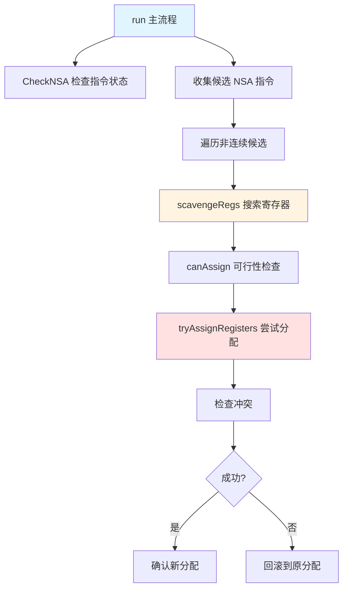
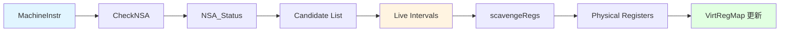

# GCNNSAReassign.cpp 代码功能详解

## 1. Pass的主要功能概括

**GCNNSAReassign** 是一个针对 AMD GPU（GFX10+）的机器码优化 Pass，其核心功能是：

### 作用
<a name="ref-block_0"></a>将 NSA（Non-Sequential Address，非连续地址）图像指令中使用的寄存器从非连续分配重新调整为连续分配。 llvm-project:10-12[<sup>↗</sup>](#block_0) 

### 效果
<a name="ref-block_0"></a>优化完成后，后续的 `SIShrinkInstructions` Pass 可以将 NSA 版本的指令替换为更紧凑的顺序版本（sequential versions），从而减少指令编码大小，提高代码执行效率和占用空间。 llvm-project:10-12[<sup>↗</sup>](#block_0) 

## 2. 主要功能步骤/子功能提取

通过遍历代码文件，该 Pass 包含以下核心步骤和子功能：

1. **CheckNSA** - NSA 指令状态检查函数
2. **canAssign** - 寄存器分配可行性检查函数
3. **tryAssignRegisters** - 寄存器分配尝试函数
4. **scavengeRegs** - 寄存器搜索与分配函数
5. **run** - 主执行流程

## 3. 各步骤/子功能的详细描述分析

### 3.1 CheckNSA - NSA指令状态检查

**功能**：检查一条机器指令是否为 NSA 指令，并判断其地址寄存器的分配状态。

<a name="ref-block_2"></a>**返回状态类型**： llvm-project:46-52[<sup>↗</sup>](#block_2) 
- `NOT_NSA`: 不是 NSA 指令
- `FIXED`: 是 NSA 指令但无法修改
- `NON_CONTIGUOUS`: 非连续地址的 NSA，可以进行优化
- `CONTIGUOUS`: 地址寄存器已经是连续的 NSA

**关键检查逻辑**：

<a name="ref-block_7"></a>1. **指令编码验证**：验证指令是否为 GFX10 或 GFX11 的 NSA 编码格式 llvm-project:173-179[<sup>↗</sup>](#block_7) 

2. **寄存器限制检查**：遍历所有地址操作数，进行以下验证：
<a name="ref-block_8"></a>   - 寄存器必须是虚拟寄存器且已分配 llvm-project:189-190[<sup>↗</sup>](#block_8) 
   - 寄存器必须是 32 位 VGPR，不能使用子寄存器 llvm-project:207-208 
<a name="ref-block_10"></a>   - 排除由 InlineSpiller 分割产生的寄存器（这是对 LLVM bug #48911 的临时解决方案） llvm-project:210-216[<sup>↗</sup>](#block_10) 
<a name="ref-block_11"></a>   - 跳过已经通过 COPY 指令固定的寄存器 llvm-project:218-229[<sup>↗</sup>](#block_11) 

<a name="ref-block_12"></a>3. **连续性判断**：检查所有地址寄存器是否形成连续序列 llvm-project:235-238[<sup>↗</sup>](#block_12) 

### 3.2 canAssign - 寄存器分配可行性检查

<a name="ref-block_5"></a>**功能**：检查从指定起始寄存器开始的一段连续寄存器范围是否可以被分配。 llvm-project:133-146[<sup>↗</sup>](#block_5) 

**检查项**：
1. 验证每个寄存器是否在可分配寄存器集合中 llvm-project:136-137 
2. 检查是否与 callee-saved 寄存器冲突（如果某个 callee-saved 寄存器未被使用，则不能占用其子寄存器） llvm-project:139-142 

### 3.3 tryAssignRegisters - 寄存器分配尝试

<a name="ref-block_4"></a>**功能**：尝试将一组 Live Interval（活跃区间）分配到从指定起始寄存器开始的连续物理寄存器。 llvm-project:115-131[<sup>↗</sup>](#block_4) 

**执行步骤**：

1. **解除旧分配**：遍历所有 Live Interval，如果已有物理寄存器分配，先通过 LiveRegMatrix 解除 llvm-project:119-121 

2. **冲突检查**：检查目标寄存器范围是否与现有的 Live Interval 存在干扰 llvm-project:123-125 

3. **执行分配**：如果没有冲突，将各个 Live Interval 分配到连续的物理寄存器 llvm-project:127-130 

### 3.4 scavengeRegs - 寄存器搜索与分配

<a name="ref-block_6"></a>**功能**：在整个 VGPR 寄存器空间中搜索可用的连续寄存器范围，并尝试分配。 llvm-project:148-165[<sup>↗</sup>](#block_6) 

**执行策略**：

1. **边界检查**：确保请求的寄存器数量不超过最大可用 VGPR 数量 llvm-project:152-154 

2. **暴力搜索**：从 VGPR0 开始，遍历所有可能的起始位置 llvm-project:156-162 

3. **两阶段验证**：对每个候选位置，先用 `canAssign` 快速检查，再用 `tryAssignRegisters` 尝试实际分配

4. **立即返回**：找到第一个成功的位置即返回，采用贪心策略

### 3.5 run - 主执行流程

<a name="ref-block_13"></a>**功能**：Pass 的主入口函数，协调整个优化流程。 llvm-project:244-374[<sup>↗</sup>](#block_13) 

**执行阶段**：

**阶段 1：初始化与候选收集** llvm-project:245-257 
- 检查目标架构是否支持 NSA 和非 NSA 编码
- 初始化寄存器信息、最大 VGPR 数量等上下文信息
- 考虑 occupancy 和动态 VGPR 分配对最大 VGPR 数量的影响

**阶段 2：扫描所有指令** llvm-project:259-275 
- 遍历函数中的所有基本块和指令
- 使用 `CheckNSA` 识别 NSA 指令
- 将连续和非连续的 NSA 指令都记录为候选项（用 pair 的第二个元素标记是否已连续）

**阶段 3：优化非连续的 NSA 指令** llvm-project:277-371 

对每个非连续的候选指令：

1. **快速重检查**：再次检查指令状态，可能在之前的优化中已变为连续 llvm-project:283-288 

2. **提取 Live Interval**：
   - 收集指令所有地址操作数的 Live Interval llvm-project:294-317 
   - 检测重复使用的寄存器（无法优化的情况） llvm-project:301-305 
   - 保存原始分配以便回滚 llvm-project:307-307 
   - 计算所有 Live Interval 的最小和最大索引范围 llvm-project:315-316 

3. **尝试重分配**：调用 `scavengeRegs` 搜索连续寄存器 llvm-project:329-329 

4. **冲突检测**：检查新分配是否破坏了其他已优化的 NSA 指令 llvm-project:335-349 
   - 查找活跃范围重叠的其他候选指令
   - 验证它们是否仍然保持连续状态

5. **回滚或确认**：
   - 如果失败，恢复原始寄存器分配 llvm-project:351-359 
   - 如果成功，标记为已转换并更新统计信息 llvm-project:362-370 

## 4. 步骤/子功能之间的关系



### 调用层次关系

1. **run** 是最顶层函数，负责整体流程控制
   - 调用 **CheckNSA** 扫描和分类所有指令
   - 对每个非连续的 NSA 指令调用 **scavengeRegs**

2. **scavengeRegs** 是寄存器搜索的中间层
   - 调用 **canAssign** 进行快速预检查
   - 调用 **tryAssignRegisters** 执行实际分配

3. **tryAssignRegisters** 是最底层的执行单元
   - 直接操作 LiveRegMatrix 进行寄存器分配和解除

### 功能协作关系

- **CheckNSA** 充当"过滤器"角色，识别可优化的指令
- **canAssign** 充当"守门员"角色，快速排除不可行的方案
- **tryAssignRegisters** 充当"执行者"角色，执行实际的寄存器操作
- **scavengeRegs** 充当"协调者"角色，整合检查和执行逻辑
- **run** 充当"指挥官"角色，管理全局状态和冲突检测

### 数据流关系



- 输入：机器指令（MachineInstr）
- 中间产物：Live Interval 集合、候选指令列表
- 输出：更新的虚拟寄存器到物理寄存器映射（VirtRegMap）

## Notes

<a name="ref-block_3"></a>1. **Pass 的执行时机**：这个 Pass 在寄存器分配之后执行，因为它需要访问已分配的物理寄存器信息。 llvm-project:92-98[<sup>↗</sup>](#block_3) 

2. **优化的保守性**：为避免引入新问题，Pass 采用了多重安全检查机制，例如跳过 InlineSpiller 产生的寄存器、检测与其他指令的冲突等。

<a name="ref-block_1"></a>3. **统计信息**：Pass 维护两个统计指标：发现的非连续 NSA 指令数量和成功转换的数量。 llvm-project:32-35[<sup>↗</sup>](#block_1) 

<a name="ref-block_9"></a>4. **架构限制**：目前的实现只处理 32 位 VGPR，对于 GFX11 的 BVH 指令等使用更宽寄存器的情况，暂不支持优化。 llvm-project:198-208[<sup>↗</sup>](#block_9)
### Citations
<a name="block_0"></a>**File:** llvm/lib/Target/AMDGPU/GCNNSAReassign.cpp (L10-12) [<sup>↩</sup>](#ref-block_0) [<sup>↩</sup>](#ref-block_0)
```cpp
/// \brief Try to reassign registers on GFX10+ from non-sequential to sequential
/// in NSA image instructions. Later SIShrinkInstructions pass will replace NSA
/// with sequential versions where possible.
```
<a name="block_1"></a>**File:** llvm/lib/Target/AMDGPU/GCNNSAReassign.cpp (L32-35) [<sup>↩</sup>](#ref-block_1)
```cpp
STATISTIC(NumNSAInstructions,
          "Number of NSA instructions with non-sequential address found");
STATISTIC(NumNSAConverted,
          "Number of NSA instructions changed to sequential");
```
<a name="block_2"></a>**File:** llvm/lib/Target/AMDGPU/GCNNSAReassign.cpp (L46-52) [<sup>↩</sup>](#ref-block_2)
```cpp
  using NSA_Status = enum {
    NOT_NSA,        // Not an NSA instruction
    FIXED,          // NSA which we cannot modify
    NON_CONTIGUOUS, // NSA with non-sequential address which we can try
                    // to optimize.
    CONTIGUOUS      // NSA with all sequential address registers
  };
```
<a name="block_3"></a>**File:** llvm/lib/Target/AMDGPU/GCNNSAReassign.cpp (L92-98) [<sup>↩</sup>](#ref-block_3)
```cpp
  void getAnalysisUsage(AnalysisUsage &AU) const override {
    AU.addRequired<LiveIntervalsWrapperPass>();
    AU.addRequired<VirtRegMapWrapperLegacy>();
    AU.addRequired<LiveRegMatrixWrapperLegacy>();
    AU.setPreservesAll();
    MachineFunctionPass::getAnalysisUsage(AU);
  }
```
<a name="block_4"></a>**File:** llvm/lib/Target/AMDGPU/GCNNSAReassign.cpp (L115-131) [<sup>↩</sup>](#ref-block_4)
```cpp
bool GCNNSAReassignImpl::tryAssignRegisters(
    SmallVectorImpl<LiveInterval *> &Intervals, unsigned StartReg) const {
  unsigned NumRegs = Intervals.size();

  for (unsigned N = 0; N < NumRegs; ++N)
    if (VRM->hasPhys(Intervals[N]->reg()))
      LRM->unassign(*Intervals[N]);

  for (unsigned N = 0; N < NumRegs; ++N)
    if (LRM->checkInterference(*Intervals[N], MCRegister::from(StartReg + N)))
      return false;

  for (unsigned N = 0; N < NumRegs; ++N)
    LRM->assign(*Intervals[N], MCRegister::from(StartReg + N));

  return true;
}
```
<a name="block_5"></a>**File:** llvm/lib/Target/AMDGPU/GCNNSAReassign.cpp (L133-146) [<sup>↩</sup>](#ref-block_5)
```cpp
bool GCNNSAReassignImpl::canAssign(unsigned StartReg, unsigned NumRegs) const {
  for (unsigned N = 0; N < NumRegs; ++N) {
    unsigned Reg = StartReg + N;
    if (!MRI->isAllocatable(Reg))
      return false;

    for (unsigned I = 0; CSRegs[I]; ++I)
      if (TRI->isSubRegisterEq(Reg, CSRegs[I]) &&
          !LRM->isPhysRegUsed(CSRegs[I]))
      return false;
  }

  return true;
}
```
<a name="block_6"></a>**File:** llvm/lib/Target/AMDGPU/GCNNSAReassign.cpp (L148-165) [<sup>↩</sup>](#ref-block_6)
```cpp
bool GCNNSAReassignImpl::scavengeRegs(
    SmallVectorImpl<LiveInterval *> &Intervals) const {
  unsigned NumRegs = Intervals.size();

  if (NumRegs > MaxNumVGPRs)
    return false;
  unsigned MaxReg = MaxNumVGPRs - NumRegs + AMDGPU::VGPR0;

  for (unsigned Reg = AMDGPU::VGPR0; Reg <= MaxReg; ++Reg) {
    if (!canAssign(Reg, NumRegs))
      continue;

    if (tryAssignRegisters(Intervals, Reg))
      return true;
  }

  return false;
}
```
<a name="block_7"></a>**File:** llvm/lib/Target/AMDGPU/GCNNSAReassign.cpp (L173-179) [<sup>↩</sup>](#ref-block_7)
```cpp
  switch (Info->MIMGEncoding) {
  case AMDGPU::MIMGEncGfx10NSA:
  case AMDGPU::MIMGEncGfx11NSA:
    break;
  default:
    return NSA_Status::NOT_NSA;
  }
```
<a name="block_8"></a>**File:** llvm/lib/Target/AMDGPU/GCNNSAReassign.cpp (L189-190) [<sup>↩</sup>](#ref-block_8)
```cpp
    if (Reg.isPhysical() || !VRM->isAssignedReg(Reg))
      return NSA_Status::FIXED;
```
<a name="block_9"></a>**File:** llvm/lib/Target/AMDGPU/GCNNSAReassign.cpp (L198-208) [<sup>↩</sup>](#ref-block_9)
```cpp
      // TODO: address the below limitation to handle GFX11 BVH instructions
      // Bail if address is not a VGPR32. That should be possible to extend the
      // optimization to work with subregs of a wider register tuples, but the
      // logic to find free registers will be much more complicated with much
      // less chances for success. That seems reasonable to assume that in most
      // cases a tuple is used because a vector variable contains different
      // parts of an address and it is either already consecutive or cannot
      // be reassigned if not. If needed it is better to rely on register
      // coalescer to process such address tuples.
      if (TRI->getRegSizeInBits(*MRI->getRegClass(Reg)) != 32 || Op.getSubReg())
        return NSA_Status::FIXED;
```
<a name="block_10"></a>**File:** llvm/lib/Target/AMDGPU/GCNNSAReassign.cpp (L210-216) [<sup>↩</sup>](#ref-block_10)
```cpp
      // InlineSpiller does not call LRM::assign() after an LI split leaving
      // it in an inconsistent state, so we cannot call LRM::unassign().
      // See llvm bug #48911.
      // Skip reassign if a register has originated from such split.
      // FIXME: Remove the workaround when bug #48911 is fixed.
      if (VRM->getPreSplitReg(Reg))
        return NSA_Status::FIXED;
```
<a name="block_11"></a>**File:** llvm/lib/Target/AMDGPU/GCNNSAReassign.cpp (L218-229) [<sup>↩</sup>](#ref-block_11)
```cpp
      const MachineInstr *Def = MRI->getUniqueVRegDef(Reg);

      if (Def && Def->isCopy() && Def->getOperand(1).getReg() == PhysReg)
        return NSA_Status::FIXED;

      for (auto U : MRI->use_nodbg_operands(Reg)) {
        if (U.isImplicit())
          return NSA_Status::FIXED;
        const MachineInstr *UseInst = U.getParent();
        if (UseInst->isCopy() && UseInst->getOperand(0).getReg() == PhysReg)
          return NSA_Status::FIXED;
      }
```
<a name="block_12"></a>**File:** llvm/lib/Target/AMDGPU/GCNNSAReassign.cpp (L235-238) [<sup>↩</sup>](#ref-block_12)
```cpp
    if (I == 0)
      VgprBase = PhysReg;
    else if (VgprBase + I != PhysReg)
      NSA = true;
```
<a name="block_13"></a>**File:** llvm/lib/Target/AMDGPU/GCNNSAReassign.cpp (L244-374) [<sup>↩</sup>](#ref-block_13)
```cpp
bool GCNNSAReassignImpl::run(MachineFunction &MF) {
  ST = &MF.getSubtarget<GCNSubtarget>();
  if (!ST->hasNSAEncoding() || !ST->hasNonNSAEncoding())
    return false;

  MRI = &MF.getRegInfo();
  TRI = ST->getRegisterInfo();

  const SIMachineFunctionInfo *MFI = MF.getInfo<SIMachineFunctionInfo>();
  MaxNumVGPRs = ST->getMaxNumVGPRs(MF);
  MaxNumVGPRs = std::min(
      ST->getMaxNumVGPRs(MFI->getOccupancy(), MFI->getDynamicVGPRBlockSize()),
      MaxNumVGPRs);
  CSRegs = MRI->getCalleeSavedRegs();

  using Candidate = std::pair<const MachineInstr*, bool>;
  SmallVector<Candidate, 32> Candidates;
  for (const MachineBasicBlock &MBB : MF) {
    for (const MachineInstr &MI : MBB) {
      switch (CheckNSA(MI)) {
      default:
        continue;
      case NSA_Status::CONTIGUOUS:
        Candidates.push_back(std::pair(&MI, true));
        break;
      case NSA_Status::NON_CONTIGUOUS:
        Candidates.push_back(std::pair(&MI, false));
        ++NumNSAInstructions;
        break;
      }
    }
  }

  bool Changed = false;
  for (auto &C : Candidates) {
    if (C.second)
      continue;

    const MachineInstr *MI = C.first;
    if (CheckNSA(*MI, true) == NSA_Status::CONTIGUOUS) {
      // Already happen to be fixed.
      C.second = true;
      ++NumNSAConverted;
      continue;
    }

    const AMDGPU::MIMGInfo *Info = AMDGPU::getMIMGInfo(MI->getOpcode());
    int VAddr0Idx =
      AMDGPU::getNamedOperandIdx(MI->getOpcode(), AMDGPU::OpName::vaddr0);

    SmallVector<LiveInterval *, 16> Intervals;
    SmallVector<MCRegister, 16> OrigRegs;
    SlotIndex MinInd, MaxInd;
    for (unsigned I = 0; I < Info->VAddrOperands; ++I) {
      const MachineOperand &Op = MI->getOperand(VAddr0Idx + I);
      Register Reg = Op.getReg();
      LiveInterval *LI = &LIS->getInterval(Reg);
      if (llvm::is_contained(Intervals, LI)) {
        // Same register used, unable to make sequential
        Intervals.clear();
        break;
      }
      Intervals.push_back(LI);
      OrigRegs.push_back(VRM->getPhys(Reg));
      if (LI->empty()) {
        // The address input is undef, so it doesn't contribute to the relevant
        // range. Seed a reasonable index range if required.
        if (I == 0)
          MinInd = MaxInd = LIS->getInstructionIndex(*MI);
        continue;
      }
      MinInd = I != 0 ? std::min(MinInd, LI->beginIndex()) : LI->beginIndex();
      MaxInd = I != 0 ? std::max(MaxInd, LI->endIndex()) : LI->endIndex();
    }

    if (Intervals.empty())
      continue;

    LLVM_DEBUG(dbgs() << "Attempting to reassign NSA: " << *MI
                      << "\tOriginal allocation:\t";
               for (auto *LI
                    : Intervals) dbgs()
               << " " << llvm::printReg((VRM->getPhys(LI->reg())), TRI);
               dbgs() << '\n');

    bool Success = scavengeRegs(Intervals);
    if (!Success) {
      LLVM_DEBUG(dbgs() << "\tCannot reallocate.\n");
      if (VRM->hasPhys(Intervals.back()->reg())) // Did not change allocation.
        continue;
    } else {
      // Check we did not make it worse for other instructions.
      auto *I =
          std::lower_bound(Candidates.begin(), &C, MinInd,
                           [this](const Candidate &C, SlotIndex I) {
                             return LIS->getInstructionIndex(*C.first) < I;
                           });
      for (auto *E = Candidates.end();
           Success && I != E && LIS->getInstructionIndex(*I->first) < MaxInd;
           ++I) {
        if (I->second && CheckNSA(*I->first, true) < NSA_Status::CONTIGUOUS) {
          Success = false;
          LLVM_DEBUG(dbgs() << "\tNSA conversion conflict with " << *I->first);
        }
      }
    }

    if (!Success) {
      for (unsigned I = 0; I < Info->VAddrOperands; ++I)
        if (VRM->hasPhys(Intervals[I]->reg()))
          LRM->unassign(*Intervals[I]);

      for (unsigned I = 0; I < Info->VAddrOperands; ++I)
        LRM->assign(*Intervals[I], OrigRegs[I]);

      continue;
    }

    C.second = true;
    ++NumNSAConverted;
    LLVM_DEBUG(
        dbgs() << "\tNew allocation:\t\t ["
               << llvm::printReg((VRM->getPhys(Intervals.front()->reg())), TRI)
               << " : "
               << llvm::printReg((VRM->getPhys(Intervals.back()->reg())), TRI)
               << "]\n");
    Changed = true;
  }

  return Changed;
}
```