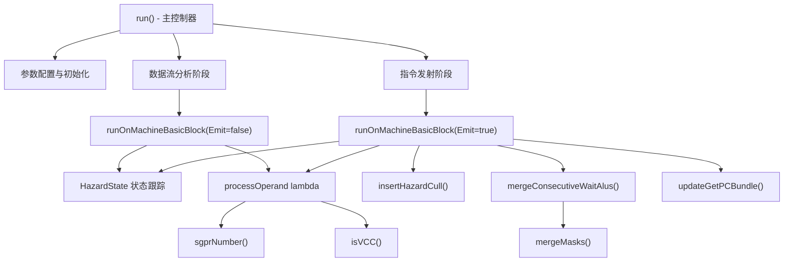

# AMDGPUWaitSGPRHazards.cpp 代码功能详解

## 1. Pass的主要功能概括

### 作用
<a name="ref-block_0"></a>这个pass的主要作用是**在GFX12架构上插入 `s_wait_alu` 指令来缓解SGPR（标量通用寄存器）读取危害**。 llvm-project:10-10[<sup>↗</sup>](#block_0) 

### 效果
- **防止数据竞争**：当SALU（标量ALU）或VALU（向量ALU）写入SGPR后，如果后续指令在写入完成前就读取该寄存器，会产生读写危害。此pass通过插入 `S_WAITCNT_DEPCTR` 等待指令确保数据依赖关系正确。
- **自动危害检测与修复**：只在支持VALU读取SGPR危害检测的硬件上运行，通过数据流分析识别所有潜在危害点并自动插入必要的同步指令。 llvm-project:442-443 

## 2. 主要实现步骤与子功能提取

通过遍历代码，提取出以下核心组件和功能模块：

### 核心数据结构
1. **HazardState 结构** - 危害状态跟踪器
2. **BlockHazardState 结构** - 基本块的输入/输出危害状态

### 辅助工具函数
3. **sgprNumber()** - SGPR寄存器编号转换
4. **isVCC()** - VCC寄存器识别
5. **updateGetPCBundle()** - S_GETPC束的偏移量更新
6. **mergeMasks()** - 等待指令掩码合并
7. **mergeConsecutiveWaitAlus()** - 连续等待指令优化
8. **insertHazardCull()** - DS_NOP危害清除

### 核心算法函数
9. **runOnMachineBasicBlock()** - 基本块级别的危害分析与处理
10. **run()** - 整体流程控制与迭代收敛

## 3. 各步骤/子功能的详细分析

### 3.1 HazardState 结构（危害状态跟踪器）

<a name="ref-block_5"></a>**功能**：跟踪当前的SGPR危害状态，包括哪些寄存器有未完成的写入操作。 llvm-project:115-147[<sup>↗</sup>](#block_5) 

**关键成员变量**：
- `Tracked`：64位位集，标记曾被VALU读取过的SGPR对（按64位对跟踪）
- `SALUHazards`：128位位集，标记有SALU未提交写入的SGPR
- `VALUHazards`：128位位集，标记有VALU未提交写入的SGPR
- `VCCHazard`：标记VCC寄存器的危害来源（SALU或VALU）
- `ActiveFlat`：标记是否有未等待的flat指令

**关键操作**：
- `merge()` 方法：合并两个危害状态，用于控制流汇合点
- 重载的比较运算符和或运算符：支持状态比较和合并操作

### 3.2 sgprNumber() - SGPR编号转换

<a name="ref-block_2"></a>**功能**：将SGPR寄存器转换为0-127的数字标识符。 llvm-project:59-77[<sup>↗</sup>](#block_2) 

**实现细节**：
- 排除特殊寄存器（M0, EXEC, SGPR_NULL等），这些寄存器不参与危害跟踪
- 使用硬件寄存器索引进行编号
- 只处理索引在0-127范围内的寄存器

### 3.3 isVCC() - VCC寄存器识别

<a name="ref-block_3"></a>**功能**：判断寄存器是否为VCC（包括VCC, VCC_LO, VCC_HI）。 llvm-project:79-81[<sup>↗</sup>](#block_3) 

**重要性**：VCC寄存器有特殊的危害处理逻辑，需要单独识别和跟踪。

### 3.4 updateGetPCBundle() - S_GETPC束更新

<a name="ref-block_4"></a>**功能**：在S_GETPC_B64指令束中插入新指令后，调整后续指令的全局偏移量。 llvm-project:85-113[<sup>↗</sup>](#block_4) 

**处理流程**：
1. 检查新指令是否在指令束中
2. 定位到束的起始位置
3. 确认是S_GETPC_B64束
4. 将束中后续指令的全局偏移量增加4字节（新指令大小）

### 3.5 insertHazardCull() - DS_NOP危害清除

<a name="ref-block_6"></a>**功能**：通过插入DS_NOP指令来清除危害跟踪状态。 llvm-project:159-165[<sup>↗</sup>](#block_6) 

**实现方式**：
- Wave32模式：插入4个DS_NOP
- Wave64模式：插入8个DS_NOP
- 这是一种优化策略，避免在内存等待前过度跟踪SGPR

### 3.6 mergeMasks() - 等待掩码合并

<a name="ref-block_7"></a>**功能**：合并两个S_WAITCNT_DEPCTR指令的掩码，对每个字段取最小值。 llvm-project:167-191[<sup>↗</sup>](#block_7) 

**处理字段**：
- SaSdst（SALU到SGPR目标）
- VaVcc（VALU到VCC）
- VmVsrc（VMEM到向量源）
- VaSdst（VALU到SGPR目标）
- VaVdst（VALU到VGPR目标）
- HoldCnt（保持计数）
- VaSsrc（VALU到SGPR源）

### 3.7 mergeConsecutiveWaitAlus() - 连续等待指令优化

<a name="ref-block_8"></a>**功能**：如果当前位置前一条指令已是S_WAITCNT_DEPCTR，则合并掩码而非插入新指令。 llvm-project:193-205[<sup>↗</sup>](#block_8) 

**优化效果**：减少冗余等待指令，提高代码效率。

### 3.8 runOnMachineBasicBlock() - 基本块处理核心

<a name="ref-block_9"></a>**功能**：处理单个基本块，分析危害状态并在必要时插入等待指令。 llvm-project:207-438[<sup>↗</sup>](#block_9) 

**参数说明**：
- `Emit=false`：分析阶段，只计算危害状态不插入指令
- `Emit=true`：发射阶段，实际插入等待指令

**主要处理流程**：

#### a) 初始化（第210-227行）
- 从基本块输入状态初始化当前状态
- 遍历所有指令，跳过元指令
- 处理DS_NOP：连续的DS_NOP可清除跟踪状态

#### b) 特殊指令处理（第229-273行）
- **FLAT指令**：标记ActiveFlat，避免在scratch/lds加载前清除
- **SMEM/VMEM指令**：清除所有危害状态
- **现有S_WAITCNT_DEPCTR**：根据掩码更新危害状态
- **内存等待指令**：在跟踪SGPR数量超过阈值时插入DS_NOP清除

#### c) VALU/SALU核心处理（第275-426行）

定义了 `processOperand` lambda函数处理每个操作数： llvm-project:283-351 

**读取操作数时**（IsUse=true）：
- SALU读取SGPR会清除该寄存器的VALU危害
- 检查寄存器是否有待处理的SALU或VALU危害
- 设置相应的等待标志（WA_SALU, WA_VALU, WA_VCC）

**写入操作数时**（IsUse=false）：
- 标记该寄存器有新的SALU或VALU危害
- VCC寄存器单独处理，记录危害来源

**特殊场景处理**：
- **SetPC指令**（call/return/indirect branch）：刷新所有待处理的SGPR写入 llvm-project:363-376 
- **Call返回后**：标记所有SGPR为跟踪状态（被调用者可能修改任何寄存器） llvm-project:415-417 

#### d) 等待指令插入（第388-413行）
- 根据Wait标志构建掩码
- 在Emit模式下，尝试合并连续等待指令或插入新的S_WAITCNT_DEPCTR
- 更新危害状态，清除已等待的危害

#### e) 状态更新与返回（第429-437行）
- 保存基本块的输出状态
- 返回状态是否变化（用于迭代收敛）或是否发射了指令

### 3.9 run() - 主函数流程控制

<a name="ref-block_10"></a>**功能**：整体流程控制，执行全函数的危害分析与等待指令插入。 llvm-project:440-526[<sup>↗</sup>](#block_10) 

**执行步骤**：

#### 第一步：硬件特性检查（第442-443行）
- 检查目标硬件是否支持VALU读取SGPR危害检测
- 不支持则直接返回

#### 第二步：配置参数解析（第445-468行）
- 解析全局命令行选项
- 优先使用函数级别的属性覆盖全局设置
- 支持禁用该pass

#### 第三步：初始化（第470-482行）
- 获取目标信息（指令信息、寄存器信息）
- 根据wave大小设置DS_NOP计数（wave32需要4个，wave64需要8个）
- 对于被调用函数，初始化入口块的所有SGPR为跟踪状态

#### 第四步：迭代数据流分析（第484-515行）
**算法核心**：使用工作列表算法进行迭代直到不动点 llvm-project:484-515 

- 初始化：将所有基本块按逆序加入工作列表
- 迭代处理：
  - 从工作列表取出基本块
  - 调用 `runOnMachineBasicBlock(MBB, false)` 分析该块
  - 如果输出状态改变，传播到所有后继块
  - 对于有单一前驱的块，直接复制状态
  - 对于有多个前驱的块，合并状态
  - 将受影响的后继块加入工作列表
- 保证收敛：merge操作只增加危害集，所有回边都会触发merge

#### 第五步：发射等待指令（第517-522行）
- 遍历所有基本块
- 调用 `runOnMachineBasicBlock(MBB, true)` 插入实际的等待指令
- 此时危害状态不应再改变（用断言验证）

#### 第六步：清理（第524行）
- 清除所有基本块状态映射

## 4. 步骤/子功能之间的关系

### 4.1 层次结构关系



### 4.2 数据流关系

1. **HazardState** 是核心数据结构，贯穿整个分析过程
   - 在 `run()` 中为每个基本块维护输入/输出状态
   - 在 `runOnMachineBasicBlock()` 中不断更新和传播
   - 通过 `merge()` 操作在控制流汇合点合并状态

2. **两阶段处理模式**：
   - **分析阶段**（Emit=false）：只计算危害状态，不修改代码
   - **发射阶段**（Emit=true）：根据已计算的状态插入等待指令

3. **辅助函数的支持作用**：
   - `sgprNumber()` 和 `isVCC()` 提供寄存器识别
   - `mergeMasks()` 优化等待指令的掩码
   - `mergeConsecutiveWaitAlus()` 减少冗余指令
   - `updateGetPCBundle()` 维护指令束的一致性
   - `insertHazardCull()` 提供替代的危害清除机制

### 4.3 迭代收敛关系

`run()` 函数实现了一个**不动点迭代算法**：
- 通过工作列表驱动，持续处理状态变化的基本块
- 状态只能增长（合并操作只添加危害），保证收敛
- 收敛后的状态用于第二阶段的指令发射

### 4.4 优化策略关系

多个子功能协同实现优化：
- **DS_NOP清除** vs **等待指令**：在内存等待点选择性使用DS_NOP减少跟踪开销
- **连续等待合并**：避免生成连续的S_WAITCNT_DEPCTR指令
- **函数边界处理**：可配置是否在函数边界清除危害状态

## Notes

<a name="ref-block_1"></a>该pass是AMD GPU编译器中处理硬件特定危害的关键组件，专门针对GFX12架构的SGPR读写时序问题。通过两阶段的数据流分析和指令插入，确保生成的机器码在硬件上正确执行。代码支持多种优化选项和配置参数，可以根据具体场景调整危害处理策略。 llvm-project:25-41[<sup>↗</sup>](#block_1)
### Citations
<a name="block_0"></a>**File:** llvm/lib/Target/AMDGPU/AMDGPUWaitSGPRHazards.cpp (L10-10) [<sup>↩</sup>](#ref-block_0)
```cpp
/// Insert s_wait_alu instructions to mitigate SGPR read hazards on GFX12.
```
<a name="block_1"></a>**File:** llvm/lib/Target/AMDGPU/AMDGPUWaitSGPRHazards.cpp (L25-41) [<sup>↩</sup>](#ref-block_1)
```cpp
static cl::opt<bool> GlobalEnableSGPRHazardWaits(
    "amdgpu-sgpr-hazard-wait", cl::init(true), cl::Hidden,
    cl::desc("Enable required s_wait_alu on SGPR hazards"));

static cl::opt<bool> GlobalCullSGPRHazardsOnFunctionBoundary(
    "amdgpu-sgpr-hazard-boundary-cull", cl::init(false), cl::Hidden,
    cl::desc("Cull hazards on function boundaries"));

static cl::opt<bool>
    GlobalCullSGPRHazardsAtMemWait("amdgpu-sgpr-hazard-mem-wait-cull",
                                   cl::init(false), cl::Hidden,
                                   cl::desc("Cull hazards on memory waits"));

static cl::opt<unsigned> GlobalCullSGPRHazardsMemWaitThreshold(
    "amdgpu-sgpr-hazard-mem-wait-cull-threshold", cl::init(8), cl::Hidden,
    cl::desc("Number of tracked SGPRs before initiating hazard cull on memory "
             "wait"));
```
<a name="block_2"></a>**File:** llvm/lib/Target/AMDGPU/AMDGPUWaitSGPRHazards.cpp (L59-77) [<sup>↩</sup>](#ref-block_2)
```cpp
  // Return the numeric ID 0-127 for a given SGPR.
  static std::optional<unsigned> sgprNumber(Register Reg,
                                            const SIRegisterInfo &TRI) {
    switch (Reg) {
    case AMDGPU::M0:
    case AMDGPU::EXEC:
    case AMDGPU::EXEC_LO:
    case AMDGPU::EXEC_HI:
    case AMDGPU::SGPR_NULL:
    case AMDGPU::SGPR_NULL64:
      return {};
    default:
      break;
    }
    unsigned RegN = TRI.getHWRegIndex(Reg);
    if (RegN > 127)
      return {};
    return RegN;
  }
```
<a name="block_3"></a>**File:** llvm/lib/Target/AMDGPU/AMDGPUWaitSGPRHazards.cpp (L79-81) [<sup>↩</sup>](#ref-block_3)
```cpp
  static inline bool isVCC(Register Reg) {
    return Reg == AMDGPU::VCC || Reg == AMDGPU::VCC_LO || Reg == AMDGPU::VCC_HI;
  }
```
<a name="block_4"></a>**File:** llvm/lib/Target/AMDGPU/AMDGPUWaitSGPRHazards.cpp (L85-113) [<sup>↩</sup>](#ref-block_4)
```cpp
  static void updateGetPCBundle(MachineInstr *NewMI) {
    if (!NewMI->isBundled())
      return;

    // Find start of bundle.
    auto I = NewMI->getIterator();
    while (I->isBundledWithPred())
      I--;
    if (I->isBundle())
      I++;

    // Bail if this is not an S_GETPC bundle.
    if (I->getOpcode() != AMDGPU::S_GETPC_B64)
      return;

    // Update offsets of any references in the bundle.
    const unsigned NewBytes = 4;
    assert(NewMI->getOpcode() == AMDGPU::S_WAITCNT_DEPCTR &&
           "Unexpected instruction insertion in bundle");
    auto NextMI = std::next(NewMI->getIterator());
    auto End = NewMI->getParent()->end();
    while (NextMI != End && NextMI->isBundledWithPred()) {
      for (auto &Operand : NextMI->operands()) {
        if (Operand.isGlobal())
          Operand.setOffset(Operand.getOffset() + NewBytes);
      }
      NextMI++;
    }
  }
```
<a name="block_5"></a>**File:** llvm/lib/Target/AMDGPU/AMDGPUWaitSGPRHazards.cpp (L115-147) [<sup>↩</sup>](#ref-block_5)
```cpp
  struct HazardState {
    static constexpr unsigned None = 0;
    static constexpr unsigned SALU = (1 << 0);
    static constexpr unsigned VALU = (1 << 1);

    std::bitset<64> Tracked;      // SGPR banks ever read by VALU
    std::bitset<128> SALUHazards; // SGPRs with uncommitted values from SALU
    std::bitset<128> VALUHazards; // SGPRs with uncommitted values from VALU
    unsigned VCCHazard = None;    // Source of current VCC writes
    bool ActiveFlat = false;      // Has unwaited flat instructions

    bool merge(const HazardState &RHS) {
      HazardState Orig(*this);
      *this |= RHS;
      return (*this != Orig);
    }

    bool operator==(const HazardState &RHS) const {
      return Tracked == RHS.Tracked && SALUHazards == RHS.SALUHazards &&
             VALUHazards == RHS.VALUHazards && VCCHazard == RHS.VCCHazard &&
             ActiveFlat == RHS.ActiveFlat;
    }

    bool operator!=(const HazardState &RHS) const { return !(*this == RHS); }

    void operator|=(const HazardState &RHS) {
      Tracked |= RHS.Tracked;
      SALUHazards |= RHS.SALUHazards;
      VALUHazards |= RHS.VALUHazards;
      VCCHazard |= RHS.VCCHazard;
      ActiveFlat |= RHS.ActiveFlat;
    }
  };
```
<a name="block_6"></a>**File:** llvm/lib/Target/AMDGPU/AMDGPUWaitSGPRHazards.cpp (L159-165) [<sup>↩</sup>](#ref-block_6)
```cpp
  void insertHazardCull(MachineBasicBlock &MBB,
                        MachineBasicBlock::instr_iterator &MI) {
    assert(!MI->isBundled());
    unsigned Count = DsNopCount;
    while (Count--)
      BuildMI(MBB, MI, MI->getDebugLoc(), TII->get(AMDGPU::DS_NOP));
  }
```
<a name="block_7"></a>**File:** llvm/lib/Target/AMDGPU/AMDGPUWaitSGPRHazards.cpp (L167-191) [<sup>↩</sup>](#ref-block_7)
```cpp
  unsigned mergeMasks(unsigned Mask1, unsigned Mask2) {
    unsigned Mask = 0xffff;
    Mask = AMDGPU::DepCtr::encodeFieldSaSdst(
        Mask, std::min(AMDGPU::DepCtr::decodeFieldSaSdst(Mask1),
                       AMDGPU::DepCtr::decodeFieldSaSdst(Mask2)));
    Mask = AMDGPU::DepCtr::encodeFieldVaVcc(
        Mask, std::min(AMDGPU::DepCtr::decodeFieldVaVcc(Mask1),
                       AMDGPU::DepCtr::decodeFieldVaVcc(Mask2)));
    Mask = AMDGPU::DepCtr::encodeFieldVmVsrc(
        Mask, std::min(AMDGPU::DepCtr::decodeFieldVmVsrc(Mask1),
                       AMDGPU::DepCtr::decodeFieldVmVsrc(Mask2)));
    Mask = AMDGPU::DepCtr::encodeFieldVaSdst(
        Mask, std::min(AMDGPU::DepCtr::decodeFieldVaSdst(Mask1),
                       AMDGPU::DepCtr::decodeFieldVaSdst(Mask2)));
    Mask = AMDGPU::DepCtr::encodeFieldVaVdst(
        Mask, std::min(AMDGPU::DepCtr::decodeFieldVaVdst(Mask1),
                       AMDGPU::DepCtr::decodeFieldVaVdst(Mask2)));
    Mask = AMDGPU::DepCtr::encodeFieldHoldCnt(
        Mask, std::min(AMDGPU::DepCtr::decodeFieldHoldCnt(Mask1),
                       AMDGPU::DepCtr::decodeFieldHoldCnt(Mask2)));
    Mask = AMDGPU::DepCtr::encodeFieldVaSsrc(
        Mask, std::min(AMDGPU::DepCtr::decodeFieldVaSsrc(Mask1),
                       AMDGPU::DepCtr::decodeFieldVaSsrc(Mask2)));
    return Mask;
  }
```
<a name="block_8"></a>**File:** llvm/lib/Target/AMDGPU/AMDGPUWaitSGPRHazards.cpp (L193-205) [<sup>↩</sup>](#ref-block_8)
```cpp
  bool mergeConsecutiveWaitAlus(MachineBasicBlock::instr_iterator &MI,
                                unsigned Mask) {
    auto MBB = MI->getParent();
    if (MI == MBB->instr_begin())
      return false;

    auto It = prev_nodbg(MI, MBB->instr_begin());
    if (It->getOpcode() != AMDGPU::S_WAITCNT_DEPCTR)
      return false;

    It->getOperand(0).setImm(mergeMasks(Mask, It->getOperand(0).getImm()));
    return true;
  }
```
<a name="block_9"></a>**File:** llvm/lib/Target/AMDGPU/AMDGPUWaitSGPRHazards.cpp (L207-438) [<sup>↩</sup>](#ref-block_9)
```cpp
  bool runOnMachineBasicBlock(MachineBasicBlock &MBB, bool Emit) {
    enum { WA_VALU = 0x1, WA_SALU = 0x2, WA_VCC = 0x4 };

    HazardState State = BlockState[&MBB].In;
    SmallSet<Register, 8> SeenRegs;
    bool Emitted = false;
    unsigned DsNops = 0;

    for (MachineBasicBlock::instr_iterator MI = MBB.instr_begin(),
                                           E = MBB.instr_end();
         MI != E; ++MI) {
      if (MI->isMetaInstruction())
        continue;

      // Clear tracked SGPRs if sufficient DS_NOPs occur
      if (MI->getOpcode() == AMDGPU::DS_NOP) {
        if (++DsNops >= DsNopCount)
          State.Tracked.reset();
        continue;
      }
      DsNops = 0;

      // Snoop FLAT instructions to avoid adding culls before scratch/lds loads.
      // Culls could be disproportionate in cost to load time.
      if (SIInstrInfo::isFLAT(*MI) && !SIInstrInfo::isFLATGlobal(*MI))
        State.ActiveFlat = true;

      // SMEM or VMEM clears hazards
      // FIXME: adapt to add FLAT without VALU (so !isLDSDMA())?
      if ((SIInstrInfo::isVMEM(*MI) && !SIInstrInfo::isFLAT(*MI)) ||
          SIInstrInfo::isSMRD(*MI)) {
        State.VCCHazard = HazardState::None;
        State.SALUHazards.reset();
        State.VALUHazards.reset();
        continue;
      }

      // Existing S_WAITALU can clear hazards
      if (MI->getOpcode() == AMDGPU::S_WAITCNT_DEPCTR) {
        unsigned int Mask = MI->getOperand(0).getImm();
        if (AMDGPU::DepCtr::decodeFieldVaVcc(Mask) == 0)
          State.VCCHazard &= ~HazardState::VALU;
        if (AMDGPU::DepCtr::decodeFieldSaSdst(Mask) == 0) {
          State.SALUHazards.reset();
          State.VCCHazard &= ~HazardState::SALU;
        }
        if (AMDGPU::DepCtr::decodeFieldVaSdst(Mask) == 0)
          State.VALUHazards.reset();
        continue;
      }

      // Snoop counter waits to insert culls
      if (CullSGPRHazardsAtMemWait &&
          (MI->getOpcode() == AMDGPU::S_WAIT_LOADCNT ||
           MI->getOpcode() == AMDGPU::S_WAIT_SAMPLECNT ||
           MI->getOpcode() == AMDGPU::S_WAIT_BVHCNT) &&
          (MI->getOperand(0).isImm() && MI->getOperand(0).getImm() == 0) &&
          (State.Tracked.count() >= CullSGPRHazardsMemWaitThreshold)) {
        if (MI->getOpcode() == AMDGPU::S_WAIT_LOADCNT && State.ActiveFlat) {
          State.ActiveFlat = false;
        } else {
          State.Tracked.reset();
          if (Emit)
            insertHazardCull(MBB, MI);
          continue;
        }
      }

      // Process only VALUs and SALUs
      bool IsVALU = SIInstrInfo::isVALU(*MI);
      bool IsSALU = SIInstrInfo::isSALU(*MI);
      if (!IsVALU && !IsSALU)
        continue;

      unsigned Wait = 0;

      auto processOperand = [&](const MachineOperand &Op, bool IsUse) {
        if (!Op.isReg())
          return;
        Register Reg = Op.getReg();
        assert(!Op.getSubReg());
        if (!TRI->isSGPRReg(*MRI, Reg))
          return;

        // Only visit each register once
        if (!SeenRegs.insert(Reg).second)
          return;

        auto RegNumber = sgprNumber(Reg, *TRI);
        if (!RegNumber)
          return;

        // Track SGPRs by pair -- numeric ID of an 64b SGPR pair.
        // i.e. SGPR0 = SGPR0_SGPR1 = 0, SGPR3 = SGPR2_SGPR3 = 1, etc
        unsigned RegN = *RegNumber;
        unsigned PairN = (RegN >> 1) & 0x3f;

        // Read/write of untracked register is safe; but must record any new
        // reads.
        if (!State.Tracked[PairN]) {
          if (IsVALU && IsUse)
            State.Tracked.set(PairN);
          return;
        }

        uint8_t SGPRCount =
            AMDGPU::getRegBitWidth(*TRI->getRegClassForReg(*MRI, Reg)) / 32;

        if (IsUse) {
          // SALU reading SGPR clears VALU hazards
          if (IsSALU) {
            if (isVCC(Reg)) {
              if (State.VCCHazard & HazardState::VALU)
                State.VCCHazard = HazardState::None;
            } else {
              State.VALUHazards.reset();
            }
          }
          // Compute required waits
          for (uint8_t RegIdx = 0; RegIdx < SGPRCount; ++RegIdx) {
            Wait |= State.SALUHazards[RegN + RegIdx] ? WA_SALU : 0;
            Wait |= IsVALU && State.VALUHazards[RegN + RegIdx] ? WA_VALU : 0;
          }
          if (isVCC(Reg) && State.VCCHazard) {
            // Note: it's possible for both SALU and VALU to exist if VCC
            // was updated differently by merged predecessors.
            if (State.VCCHazard & HazardState::SALU)
              Wait |= WA_SALU;
            if (State.VCCHazard & HazardState::VALU)
              Wait |= WA_VCC;
          }
        } else {
          // Update hazards
          if (isVCC(Reg)) {
            State.VCCHazard = IsSALU ? HazardState::SALU : HazardState::VALU;
          } else {
            for (uint8_t RegIdx = 0; RegIdx < SGPRCount; ++RegIdx) {
              if (IsSALU)
                State.SALUHazards.set(RegN + RegIdx);
              else
                State.VALUHazards.set(RegN + RegIdx);
            }
          }
        }
      };

      const bool IsSetPC =
          (MI->isCall() || MI->isReturn() || MI->isIndirectBranch()) &&
          MI->getOpcode() != AMDGPU::S_ENDPGM &&
          MI->getOpcode() != AMDGPU::S_ENDPGM_SAVED;

      // Only consider implicit VCC specified by instruction descriptor.
      const bool HasImplicitVCC =
          llvm::any_of(MI->getDesc().implicit_uses(), isVCC) ||
          llvm::any_of(MI->getDesc().implicit_defs(), isVCC);

      if (IsSetPC) {
        // All SGPR writes before a call/return must be flushed as the
        // callee/caller will not will not see the hazard chain.
        if (State.VCCHazard & HazardState::VALU)
          Wait |= WA_VCC;
        if (State.SALUHazards.any() || (State.VCCHazard & HazardState::SALU))
          Wait |= WA_SALU;
        if (State.VALUHazards.any())
          Wait |= WA_VALU;
        if (CullSGPRHazardsOnFunctionBoundary && State.Tracked.any()) {
          State.Tracked.reset();
          if (Emit)
            insertHazardCull(MBB, MI);
        }
      } else {
        // Process uses to determine required wait.
        SeenRegs.clear();
        for (const MachineOperand &Op : MI->all_uses()) {
          if (Op.isImplicit() &&
              (!HasImplicitVCC || !Op.isReg() || !isVCC(Op.getReg())))
            continue;
          processOperand(Op, true);
        }
      }

      // Apply wait
      if (Wait) {
        unsigned Mask = 0xffff;
        if (Wait & WA_VCC) {
          State.VCCHazard &= ~HazardState::VALU;
          Mask = AMDGPU::DepCtr::encodeFieldVaVcc(Mask, 0);
        }
        if (Wait & WA_SALU) {
          State.SALUHazards.reset();
          State.VCCHazard &= ~HazardState::SALU;
          Mask = AMDGPU::DepCtr::encodeFieldSaSdst(Mask, 0);
        }
        if (Wait & WA_VALU) {
          State.VALUHazards.reset();
          Mask = AMDGPU::DepCtr::encodeFieldVaSdst(Mask, 0);
        }
        if (Emit) {
          if (!mergeConsecutiveWaitAlus(MI, Mask)) {
            auto NewMI = BuildMI(MBB, MI, MI->getDebugLoc(),
                                 TII->get(AMDGPU::S_WAITCNT_DEPCTR))
                             .addImm(Mask);
            updateGetPCBundle(NewMI);
          }
          Emitted = true;
        }
      }

      // On return from a call SGPR state is unknown, so all potential hazards.
      if (MI->isCall() && !CullSGPRHazardsOnFunctionBoundary)
        State.Tracked.set();

      // Update hazards based on defs.
      SeenRegs.clear();
      for (const MachineOperand &Op : MI->all_defs()) {
        if (Op.isImplicit() &&
            (!HasImplicitVCC || !Op.isReg() || !isVCC(Op.getReg())))
          continue;
        processOperand(Op, false);
      }
    }

    BlockHazardState &BS = BlockState[&MBB];
    bool Changed = State != BS.Out;
    if (Emit) {
      assert(!Changed && "Hazard state should not change on emit pass");
      return Emitted;
    }
    if (Changed)
      BS.Out = State;
    return Changed;
  }
```
<a name="block_10"></a>**File:** llvm/lib/Target/AMDGPU/AMDGPUWaitSGPRHazards.cpp (L440-526) [<sup>↩</sup>](#ref-block_10)
```cpp
  bool run(MachineFunction &MF) {
    const GCNSubtarget &ST = MF.getSubtarget<GCNSubtarget>();
    if (!ST.hasVALUReadSGPRHazard())
      return false;

    // Parse settings
    EnableSGPRHazardWaits = GlobalEnableSGPRHazardWaits;
    CullSGPRHazardsOnFunctionBoundary = GlobalCullSGPRHazardsOnFunctionBoundary;
    CullSGPRHazardsAtMemWait = GlobalCullSGPRHazardsAtMemWait;
    CullSGPRHazardsMemWaitThreshold = GlobalCullSGPRHazardsMemWaitThreshold;

    if (!GlobalEnableSGPRHazardWaits.getNumOccurrences())
      EnableSGPRHazardWaits = MF.getFunction().getFnAttributeAsParsedInteger(
          "amdgpu-sgpr-hazard-wait", EnableSGPRHazardWaits);
    if (!GlobalCullSGPRHazardsOnFunctionBoundary.getNumOccurrences())
      CullSGPRHazardsOnFunctionBoundary =
          MF.getFunction().hasFnAttribute("amdgpu-sgpr-hazard-boundary-cull");
    if (!GlobalCullSGPRHazardsAtMemWait.getNumOccurrences())
      CullSGPRHazardsAtMemWait =
          MF.getFunction().hasFnAttribute("amdgpu-sgpr-hazard-mem-wait-cull");
    if (!GlobalCullSGPRHazardsMemWaitThreshold.getNumOccurrences())
      CullSGPRHazardsMemWaitThreshold =
          MF.getFunction().getFnAttributeAsParsedInteger(
              "amdgpu-sgpr-hazard-mem-wait-cull-threshold",
              CullSGPRHazardsMemWaitThreshold);

    // Bail if disabled
    if (!EnableSGPRHazardWaits)
      return false;

    TII = ST.getInstrInfo();
    TRI = ST.getRegisterInfo();
    MRI = &MF.getRegInfo();
    DsNopCount = ST.isWave64() ? WAVE64_NOPS : WAVE32_NOPS;

    auto CallingConv = MF.getFunction().getCallingConv();
    if (!AMDGPU::isEntryFunctionCC(CallingConv) &&
        !CullSGPRHazardsOnFunctionBoundary) {
      // Callee must consider all SGPRs as tracked.
      LLVM_DEBUG(dbgs() << "Is called function, track all SGPRs.\n");
      MachineBasicBlock &EntryBlock = MF.front();
      BlockState[&EntryBlock].In.Tracked.set();
    }

    // Calculate the hazard state for each basic block.
    // Iterate until a fixed point is reached.
    // Fixed point is guaranteed as merge function only ever increases
    // the hazard set, and all backedges will cause a merge.
    //
    // Note: we have to take care of the entry block as this technically
    // has an edge from outside the function. Failure to treat this as
    // a merge could prevent fixed point being reached.
    SetVector<MachineBasicBlock *> Worklist;
    for (auto &MBB : reverse(MF))
      Worklist.insert(&MBB);
    while (!Worklist.empty()) {
      auto &MBB = *Worklist.pop_back_val();
      bool Changed = runOnMachineBasicBlock(MBB, false);
      if (Changed) {
        // Note: take a copy of state here in case it is reallocated by map
        HazardState NewState = BlockState[&MBB].Out;
        // Propagate to all successor blocks
        for (auto Succ : MBB.successors()) {
          // We only need to merge hazards at CFG merge points.
          auto &SuccState = BlockState[Succ];
          if (Succ->getSinglePredecessor() && !Succ->isEntryBlock()) {
            if (SuccState.In != NewState) {
              SuccState.In = NewState;
              Worklist.insert(Succ);
            }
          } else if (SuccState.In.merge(NewState)) {
            Worklist.insert(Succ);
          }
        }
      }
    }

    LLVM_DEBUG(dbgs() << "Emit s_wait_alu instructions\n");

    // Final to emit wait instructions.
    bool Changed = false;
    for (auto &MBB : MF)
      Changed |= runOnMachineBasicBlock(MBB, true);

    BlockState.clear();
    return Changed;
  }
```