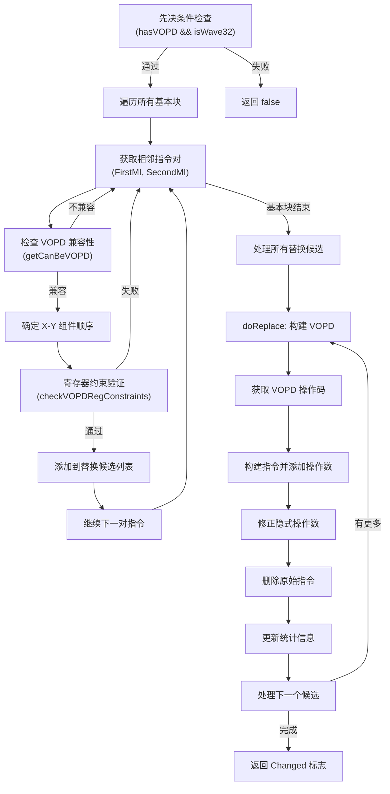

# GCNCreateVOPD.cpp 代码功能分析

## 1. Pass 主要功能概述

<a name="ref-block_0"></a>`GCNCreateVOPD.cpp` 实现了一个 LLVM 机器函数优化 Pass，其主要功能是**将两条相邻的 VALU (Vector ALU) 指令合并成单条 VOPD (Vector Operation Dual-issue) 指令**。 llvm-project:10-11[<sup>↗</sup>](#block_0) 

**作用与效果：**
- 仅在 wave32 模式下工作 llvm-project:11-11 
- 通过将两条 VOP 指令融合为一条 VOPD 指令，提高指令级并行度，从而提升 GPU 执行效率
<a name="ref-block_1"></a>- 需要满足严格的寄存器约束条件 llvm-project:12-13[<sup>↗</sup>](#block_1) 
<a name="ref-block_2"></a>- 与后寄存器分配（postRA）机器调度器中的 `shouldCombineVOPD` 变异器协同工作，该变异器会将候选指令放置为背靠背（back-to-back） llvm-project:14-15[<sup>↗</sup>](#block_2) 

## 2. 主要实现步骤/子功能提取

该 Pass 的实现包含以下主要步骤和子功能：

### 2.1 先决条件检查（`run` 函数前置）
### 2.2 基本块遍历与候选指令识别
### 2.3 VOPD 组件顺序确定（X-Y 分配）
### 2.4 寄存器约束验证
### 2.5 VOPD 指令构建与替换（`doReplace` 函数）
### 2.6 统计信息更新

## 3. 各步骤/子功能详细描述分析

### 3.1 先决条件检查

<a name="ref-block_10"></a>在 `run` 函数开始时，首先检查目标架构是否支持 VOPD 指令以及是否运行在 wave32 模式： llvm-project:106-107[<sup>↗</sup>](#block_10) 

如果不满足条件，Pass 直接返回 false 表示没有进行任何修改。

### 3.2 基本块遍历与候选指令识别

<a name="ref-block_11"></a>遍历函数中的所有基本块，对于每个基本块： llvm-project:115-124[<sup>↗</sup>](#block_11) 

该步骤会：
- 获取当前指令（`FirstMI`）和下一条非调试指令（`SecondMI`）
- 跳过调试指令
- 获取两条指令的操作码

<a name="ref-block_12"></a>然后检查每条指令是否可以作为 VOPD 的组件： llvm-project:127-128[<sup>↗</sup>](#block_12) 

<a name="ref-block_17"></a>`getCanBeVOPD` 函数返回一个结构体，表明指令是否可以作为 VOPD 的 X 组件或 Y 组件。 llvm-project:601-606[<sup>↗</sup>](#block_17) 

### 3.3 VOPD 组件顺序确定（X-Y 分配）

<a name="ref-block_13"></a>根据两条指令的 VOPD 兼容性，确定它们在 VOPD 中的位置（X 或 Y 组件）： llvm-project:131-136[<sup>↗</sup>](#block_13) 

这个逻辑会：
- 如果第一条指令可以是 X 且第二条可以是 Y，按该顺序创建 VOPD
- 如果第一条指令可以是 Y 且第二条可以是 X，交换顺序
- 否则，跳过这对指令

<a name="ref-block_14"></a>**重要说明：** 注释指出 `checkVOPDRegConstraints` 关心的是程序顺序，而 `doReplace` 关心的是 VOPD 中的 X-Y 顺序。 llvm-project:137-138[<sup>↗</sup>](#block_14) 

### 3.4 寄存器约束验证

<a name="ref-block_15"></a>对确定的指令对进行寄存器约束检查： llvm-project:139-142[<sup>↗</sup>](#block_15) 

`checkVOPDRegConstraints` 函数验证寄存器分配是否满足 VOPD 指令的约束要求。如果通过验证，将该候选对加入替换列表，并跳过下一条指令（因为它已被配对）。

### 3.5 VOPD 指令构建与替换

`doReplace` 函数负责实际构建和替换 VOPD 指令：

<a name="ref-block_4"></a>**步骤 A：确定 VOPD 操作码** llvm-project:58-66[<sup>↗</sup>](#block_4) 

<a name="ref-block_18"></a>这里首先将原始操作码转换为 VOPD 组件操作码，然后通过 `getVOPDFull` 获取完整的 VOPD 操作码。 llvm-project:745-749[<sup>↗</sup>](#block_18) 

<a name="ref-block_5"></a>**步骤 B：构建 VOPD 指令并添加目标操作数** llvm-project:68-80[<sup>↗</sup>](#block_5) 

首先创建 VOPD 指令构建器，然后为每个组件（X 和 Y）添加目标操作数。

<a name="ref-block_6"></a>**步骤 C：添加源操作数** llvm-project:82-88[<sup>↗</sup>](#block_6) 

对每个组件，根据其源操作数数量添加相应的源操作数。

<a name="ref-block_7"></a>**步骤 D：修正隐式操作数** llvm-project:90-92[<sup>↗</sup>](#block_7) 

调用 `fixImplicitOperands` 并复制原始指令的隐式操作数到新的 VOPD 指令。

<a name="ref-block_8"></a>**步骤 E：删除原始指令** llvm-project:97-98[<sup>↗</sup>](#block_8) 

### 3.6 统计信息更新

<a name="ref-block_9"></a>每次成功创建 VOPD 指令后，更新统计计数器： llvm-project:100-101[<sup>↗</sup>](#block_9) 

<a name="ref-block_3"></a>该统计信息通过 LLVM 的 STATISTIC 宏定义： llvm-project:34-34[<sup>↗</sup>](#block_3) 

## 4. 步骤/子功能之间的关系

各步骤之间存在严格的依赖和执行顺序关系：



**关键依赖关系说明：**

1. **先决条件 → 处理流程**：只有满足架构和 wave 模式要求时才执行优化
2. **指令识别 → 顺序确定**：必须先确认两条指令都兼容 VOPD，才能确定它们的 X-Y 顺序
3. **顺序确定 → 约束验证**：X-Y 顺序确定后，以程序顺序检查寄存器约束
4. **约束验证 → 候选收集**：只有通过约束验证的指令对才会被添加到替换列表
5. **候选收集 → 批量替换**：先收集所有候选，然后统一执行替换，避免迭代器失效
6. **操作数构建顺序**：必须先添加目标操作数，再添加源操作数，最后处理隐式操作数

## Notes

<a name="ref-block_16"></a>该 Pass 是 AMDGPU 后端优化流水线的重要组成部分，专门针对支持 VOPD 指令的现代 GPU 架构（如 GFX11、GFX12）。其设计充分考虑了硬件约束，通过严格的寄存器分配验证确保生成的指令能正确执行。Pass 提供了两种接口：新式的 `GCNCreateVOPDPass`（基于新 Pass Manager）和传统的 `GCNCreateVOPDLegacy`（基于旧 Pass Manager）。 llvm-project:153-172[<sup>↗</sup>](#block_16)
### Citations
<a name="block_0"></a>**File:** llvm/lib/Target/AMDGPU/GCNCreateVOPD.cpp (L10-11) [<sup>↩</sup>](#ref-block_0)
```cpp
/// Combine VALU pairs into VOPD instructions
/// Only works on wave32
```
<a name="block_1"></a>**File:** llvm/lib/Target/AMDGPU/GCNCreateVOPD.cpp (L12-13) [<sup>↩</sup>](#ref-block_1)
```cpp
/// Has register requirements, we reject creating VOPD if the requirements are
/// not met.
```
<a name="block_2"></a>**File:** llvm/lib/Target/AMDGPU/GCNCreateVOPD.cpp (L14-15) [<sup>↩</sup>](#ref-block_2)
```cpp
/// shouldCombineVOPD mutator in postRA machine scheduler puts candidate
/// instructions for VOPD back-to-back
```
<a name="block_3"></a>**File:** llvm/lib/Target/AMDGPU/GCNCreateVOPD.cpp (L34-34) [<sup>↩</sup>](#ref-block_3)
```cpp
STATISTIC(NumVOPDCreated, "Number of VOPD Insts Created.");
```
<a name="block_4"></a>**File:** llvm/lib/Target/AMDGPU/GCNCreateVOPD.cpp (L58-66) [<sup>↩</sup>](#ref-block_4)
```cpp
    unsigned Opc1 = FirstMI->getOpcode();
    unsigned Opc2 = SecondMI->getOpcode();
    unsigned EncodingFamily =
        AMDGPU::getVOPDEncodingFamily(SII->getSubtarget());
    int NewOpcode =
        AMDGPU::getVOPDFull(AMDGPU::getVOPDOpcode(Opc1),
                            AMDGPU::getVOPDOpcode(Opc2), EncodingFamily);
    assert(NewOpcode != -1 &&
           "Should have previously determined this as a possible VOPD\n");
```
<a name="block_5"></a>**File:** llvm/lib/Target/AMDGPU/GCNCreateVOPD.cpp (L68-80) [<sup>↩</sup>](#ref-block_5)
```cpp
    auto VOPDInst = BuildMI(*FirstMI->getParent(), FirstMI,
                            FirstMI->getDebugLoc(), SII->get(NewOpcode))
                        .setMIFlags(FirstMI->getFlags() | SecondMI->getFlags());

    namespace VOPD = AMDGPU::VOPD;
    MachineInstr *MI[] = {FirstMI, SecondMI};
    auto InstInfo =
        AMDGPU::getVOPDInstInfo(FirstMI->getDesc(), SecondMI->getDesc());

    for (auto CompIdx : VOPD::COMPONENTS) {
      auto MCOprIdx = InstInfo[CompIdx].getIndexOfDstInMCOperands();
      VOPDInst.add(MI[CompIdx]->getOperand(MCOprIdx));
    }
```
<a name="block_6"></a>**File:** llvm/lib/Target/AMDGPU/GCNCreateVOPD.cpp (L82-88) [<sup>↩</sup>](#ref-block_6)
```cpp
    for (auto CompIdx : VOPD::COMPONENTS) {
      auto CompSrcOprNum = InstInfo[CompIdx].getCompSrcOperandsNum();
      for (unsigned CompSrcIdx = 0; CompSrcIdx < CompSrcOprNum; ++CompSrcIdx) {
        auto MCOprIdx = InstInfo[CompIdx].getIndexOfSrcInMCOperands(CompSrcIdx);
        VOPDInst.add(MI[CompIdx]->getOperand(MCOprIdx));
      }
    }
```
<a name="block_7"></a>**File:** llvm/lib/Target/AMDGPU/GCNCreateVOPD.cpp (L90-92) [<sup>↩</sup>](#ref-block_7)
```cpp
    SII->fixImplicitOperands(*VOPDInst);
    for (auto CompIdx : VOPD::COMPONENTS)
      VOPDInst.copyImplicitOps(*MI[CompIdx]);
```
<a name="block_8"></a>**File:** llvm/lib/Target/AMDGPU/GCNCreateVOPD.cpp (L97-98) [<sup>↩</sup>](#ref-block_8)
```cpp
    for (auto CompIdx : VOPD::COMPONENTS)
      MI[CompIdx]->eraseFromParent();
```
<a name="block_9"></a>**File:** llvm/lib/Target/AMDGPU/GCNCreateVOPD.cpp (L100-101) [<sup>↩</sup>](#ref-block_9)
```cpp
    ++NumVOPDCreated;
    return true;
```
<a name="block_10"></a>**File:** llvm/lib/Target/AMDGPU/GCNCreateVOPD.cpp (L106-107) [<sup>↩</sup>](#ref-block_10)
```cpp
    if (!AMDGPU::hasVOPD(*ST) || !ST->isWave32())
      return false;
```
<a name="block_11"></a>**File:** llvm/lib/Target/AMDGPU/GCNCreateVOPD.cpp (L115-124) [<sup>↩</sup>](#ref-block_11)
```cpp
    for (auto &MBB : MF) {
      auto MII = MBB.begin(), E = MBB.end();
      while (MII != E) {
        auto *FirstMI = &*MII;
        MII = next_nodbg(MII, MBB.end());
        if (MII == MBB.end())
          break;
        if (FirstMI->isDebugInstr())
          continue;
        auto *SecondMI = &*MII;
```
<a name="block_12"></a>**File:** llvm/lib/Target/AMDGPU/GCNCreateVOPD.cpp (L127-128) [<sup>↩</sup>](#ref-block_12)
```cpp
        llvm::AMDGPU::CanBeVOPD FirstCanBeVOPD = AMDGPU::getCanBeVOPD(Opc);
        llvm::AMDGPU::CanBeVOPD SecondCanBeVOPD = AMDGPU::getCanBeVOPD(Opc2);
```
<a name="block_13"></a>**File:** llvm/lib/Target/AMDGPU/GCNCreateVOPD.cpp (L131-136) [<sup>↩</sup>](#ref-block_13)
```cpp
        if (FirstCanBeVOPD.X && SecondCanBeVOPD.Y)
          CI = VOPDCombineInfo(FirstMI, SecondMI);
        else if (FirstCanBeVOPD.Y && SecondCanBeVOPD.X)
          CI = VOPDCombineInfo(SecondMI, FirstMI);
        else
          continue;
```
<a name="block_14"></a>**File:** llvm/lib/Target/AMDGPU/GCNCreateVOPD.cpp (L137-138) [<sup>↩</sup>](#ref-block_14)
```cpp
        // checkVOPDRegConstraints cares about program order, but doReplace
        // cares about X-Y order in the constituted VOPD
```
<a name="block_15"></a>**File:** llvm/lib/Target/AMDGPU/GCNCreateVOPD.cpp (L139-142) [<sup>↩</sup>](#ref-block_15)
```cpp
        if (llvm::checkVOPDRegConstraints(*SII, *FirstMI, *SecondMI)) {
          ReplaceCandidates.push_back(CI);
          ++MII;
        }
```
<a name="block_16"></a>**File:** llvm/lib/Target/AMDGPU/GCNCreateVOPD.cpp (L153-172) [<sup>↩</sup>](#ref-block_16)
```cpp
class GCNCreateVOPDLegacy : public MachineFunctionPass {
public:
  static char ID;
  GCNCreateVOPDLegacy() : MachineFunctionPass(ID) {}

  void getAnalysisUsage(AnalysisUsage &AU) const override {
    AU.setPreservesCFG();
    MachineFunctionPass::getAnalysisUsage(AU);
  }

  StringRef getPassName() const override {
    return "GCN Create VOPD Instructions";
  }
  bool runOnMachineFunction(MachineFunction &MF) override {
    if (skipFunction(MF.getFunction()))
      return false;

    return GCNCreateVOPD().run(MF);
  }
};
```
<a name="block_17"></a>**File:** llvm/lib/Target/AMDGPU/Utils/AMDGPUBaseInfo.cpp (L601-606) [<sup>↩</sup>](#ref-block_17)
```cpp
CanBeVOPD getCanBeVOPD(unsigned Opc) {
  const VOPDComponentInfo *Info = getVOPDComponentHelper(Opc);
  if (Info)
    return {Info->CanBeVOPDX, true};
  return {false, false};
}
```
<a name="block_18"></a>**File:** llvm/lib/Target/AMDGPU/Utils/AMDGPUBaseInfo.cpp (L745-749) [<sup>↩</sup>](#ref-block_18)
```cpp
int getVOPDFull(unsigned OpX, unsigned OpY, unsigned EncodingFamily) {
  const VOPDInfo *Info =
      getVOPDInfoFromComponentOpcodes(OpX, OpY, EncodingFamily);
  return Info ? Info->Opcode : -1;
}
```