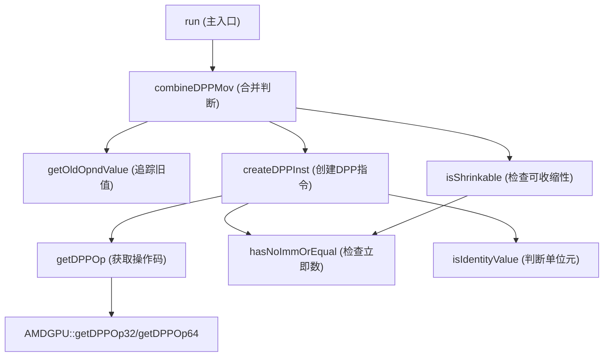

# GCNDPPCombine.cpp 代码功能分析

## 1. Pass 的主要功能概述

<a name="ref-block_0"></a>GCNDPPCombine 是一个针对 AMD GPU 的 LLVM 机器指令优化 pass，其主要功能是将 `V_MOV_B32_dpp` 指令与其后续的 VALU（向量 ALU）使用指令进行合并优化。 llvm-project:8-11[<sup>↗</sup>](#block_0) 

**核心转换模式：**
将如下指令序列：
- `$old = ...`
- `$dpp_value = V_MOV_B32_dpp $old, $vgpr_to_be_read_from_other_lane, dpp_controls..., $row_mask, $bank_mask, $bound_ctrl`
- `$res = VALU $dpp_value [, src1]`

转换为：
<a name="ref-block_1"></a>- `$res = VALU_DPP $combined_old, $vgpr_to_be_read_from_other_lane, [src1,] dpp_controls..., $row_mask, $bank_mask, $combined_bound_ctrl` llvm-project:12-21[<sup>↗</sup>](#block_1) 

**效果：** 通过消除中间的 DPP MOV 指令，减少指令数量，提高执行效率。如果无法合并所有使用该 DPP 值的指令，则整个优化序列会被回滚。 llvm-project:9-10 

## 2. 主要功能步骤/子功能提取

该 pass 的实现包含以下关键步骤和子功能：

1. **主控制流程** (`run` 方法)
2. **DPP MOV 合并判断** (`combineDPPMov` 方法)
3. **DPP 指令创建** (`createDPPInst` 方法)
4. **指令可收缩性检查** (`isShrinkable` 方法)
5. **DPP 操作码获取** (`getDPPOp` 方法)
6. **旧操作数值追踪** (`getOldOpndValue` 方法)
7. **身份值判断** (`isIdentityValue` 函数)
8. **立即数检查** (`hasNoImmOrEqual` 方法)

## 3. 各步骤/子功能的详细描述分析

<a name="ref-block_11"></a>### 3.1 主控制流程 (`run` 方法) llvm-project:762-793[<sup>↗</sup>](#block_11) 

该方法是 pass 的入口点，执行以下操作：
- 检查目标硬件是否支持 DPP 指令
- 以**反向顺序**遍历所有基本块和指令（从后向前）
- 识别 `V_MOV_B32_dpp`、`V_MOV_B64_dpp` 和 `V_MOV_B64_DPP_PSEUDO` 指令
- 对于 64 位 DPP MOV，如果硬件支持 DPALU_DPP，则尝试直接合并；否则先将其展开为两个 32 位操作
- 统计成功合并的 DPP MOV 数量

<a name="ref-block_10"></a>### 3.2 DPP MOV 合并判断 (`combineDPPMov` 方法) llvm-project:528-753[<sup>↗</sup>](#block_10) 

这是核心合并逻辑，执行以下检查和转换：

**初步检查：**
- 验证 DPP MOV 的目标寄存器不是物理寄存器
- 确保 EXEC 掩码在所有使用点保持一致
- 对于 64 位 DPP，检查 DPP 控制值是否合法
- 提取 `row_mask`、`bank_mask` 和 `bound_ctrl` 参数

**合并条件判断：**
<a name="ref-block_2"></a>根据以下规则决定是否可以合并： llvm-project:22-36[<sup>↗</sup>](#block_2) 

1. 如果 `row_mask` 和 `bank_mask` 全部启用（0xF）且 `bound_ctrl==DPP_BOUND_ZERO` 或 `old==0`，则设置 `combined_bound_ctrl = DPP_BOUND_ZERO`
2. 如果 VALU 操作是二元的，`bound_ctrl==DPP_BOUND_OFF`，且 `old` 是该操作的单位元（identity value），则使用 `src1` 作为 `combined_old`

**使用链处理：**
- 遍历所有使用 DPP MOV 结果的指令
- 处理 `REG_SEQUENCE` 指令，递归收集实际使用者
- 对每个使用指令，尝试创建对应的 DPP 版本
- 如果使用指令的操作数是 `src1` 而非 `src0`，尝试交换操作数（如果指令可交换）
- 采用"全部成功或全部回滚"策略：只有所有使用都能成功合并时才提交更改

<a name="ref-block_7"></a>### 3.3 DPP 指令创建 (`createDPPInst` 方法) llvm-project:206-437[<sup>↗</sup>](#block_7) 

该方法负责构建新的 DPP 指令，包括：

**操作码处理：**
- 获取原指令对应的 DPP 版本操作码
- 处理 True16 指令的特殊情况
- 支持 VOP3 DPP（如果硬件支持）

**操作数复制：**
按顺序添加各类操作数：
- 目标操作数（`vdst`，可能还有 `sdst`）
- `old` 操作数（来自合并后的值）
- 源操作数修饰符（`src0_modifiers`、`src1_modifiers`、`src2_modifiers`）
- 源操作数（`src0` 来自 MovMI，`src1`/`src2` 来自原指令）
- DPP 控制参数（`dpp_ctrl`、`row_mask`、`bank_mask`、`bound_ctrl`）
- VOP3 特殊参数（`clamp`、`vdst_in`、`omod`、`op_sel`、`op_sel_hi`、`neg_lo`、`neg_hi`、`byte_sel`）

**合法性检查：**
- 验证每个操作数是否合法
- 检查 `op_sel` 必须全部为 0
- 检查 `op_sel_hi` 必须全部为 1（对于 VOP3P）
- 如果任何检查失败，删除构建的指令并返回 nullptr

<a name="ref-block_4"></a>### 3.4 指令可收缩性检查 (`isShrinkable` 方法) llvm-project:118-150[<sup>↗</sup>](#block_4) 

判断 VOP3 指令是否可以收缩为更紧凑的 e32 编码：

**检查条件：**
- 指令必须是 VOP3 格式
- 必须存在 32 位等价编码
- 不收缩 True16 指令（避免寄存器分配限制）
- `sdst`（carry-out）操作数不能有使用者
- 源操作数修饰符只能是 abs/neg（不能有 opsel 等）
- `clamp`、`omod`、`byte_sel` 必须为默认值 0

<a name="ref-block_5"></a>### 3.5 DPP 操作码获取 (`getDPPOp` 方法) llvm-project:152-167[<sup>↗</sup>](#block_5) 

根据原始操作码和是否可收缩，获取对应的 DPP 版本操作码：
- 首先尝试获取 32 位 DPP 操作码
- 如果指令可收缩，先获取 e32 版本，再获取其 DPP 版本
- 如果硬件支持 VOP3 DPP，尝试获取 64 位 DPP 操作码
- 验证操作码是否有有效的 MC（机器码）映射

<a name="ref-block_6"></a>### 3.6 旧操作数值追踪 (`getOldOpndValue` 方法) llvm-project:169-194[<sup>↗</sup>](#block_6) 

追踪寄存器操作数的定义，返回：
- 如果寄存器是 `IMPLICIT_DEF`（未定义），返回 nullptr
- 如果寄存器由立即数初始化（通过 `COPY` 或 `V_MOV_B*` 指令），返回该立即数操作数
- 否则返回操作数本身

这用于确定 DPP MOV 的 `old` 操作数是否为特殊值（undef 或立即数）。

<a name="ref-block_8"></a>### 3.7 身份值判断 (`isIdentityValue` 函数) llvm-project:439-489[<sup>↗</sup>](#block_8) 

判断立即数是否是特定 VALU 操作的单位元（identity value）：
- 加法/或/异或操作：0 是单位元
- 按位与/最小无符号数操作：0xFFFFFFFF 是单位元
- 最小有符号数操作：INT_MAX 是单位元
- 最大有符号数操作：INT_MIN 是单位元
- 乘法操作：1 是单位元

当 `old` 操作数是单位元时，可以使用第二个源操作数替换它，实现合并。

<a name="ref-block_9"></a>### 3.8 立即数检查 (`hasNoImmOrEqual` 方法) llvm-project:516-526[<sup>↗</sup>](#block_9) 

检查指令是否没有指定名称的立即数操作数，或该操作数的值（经过掩码）等于给定值。用于验证指令的修饰符和控制位是否符合合并要求。

## 4. 步骤/子功能之间的关系

这些子功能形成了一个层次化的调用关系：



**执行流程：**

1. **`run`** 方法作为入口，反向遍历指令流，识别 DPP MOV 指令
2. 对每个 DPP MOV，调用 **`combineDPPMov`** 进行合并尝试
3. **`combineDPPMov`** 首先使用 **`getOldOpndValue`** 追踪 `old` 操作数的实际值
4. 然后遍历所有使用该 DPP MOV 结果的指令，对每个使用：
   - 调用 **`isShrinkable`** 判断是否可收缩（内部使用 **`hasNoImmOrEqual`**）
   - 调用 **`createDPPInst`** 创建新的 DPP 指令，该方法会：
     - 使用 **`getDPPOp`** 获取对应的 DPP 操作码
     - 使用 **`isIdentityValue`** 判断是否可以用 src1 替换 old 操作数
     - 使用 **`hasNoImmOrEqual`** 验证各种修饰符和控制位
5. 采用事务式处理：只有所有使用都成功转换后才提交，否则回滚所有更改

**关键约束：**
<a name="ref-block_3"></a>- DPP MOV 必须与所有使用指令在同一基本块内 llvm-project:37-38[<sup>↗</sup>](#block_3) 
- EXEC 掩码在整个合并序列中必须保持不变
- 所有使用必须是可合并的 VALU 指令类型（VOP1/2/3/3P/C）

## Notes

该 pass 是 AMD GPU 后端的重要优化，充分利用了 DPP（Data-Parallel Primitive）指令的硬件特性。DPP 允许在 wavefront 内的线程之间高效地交换数据，通过将独立的 DPP MOV 和 VALU 操作合并为单个 DPP VALU 指令，可以减少指令延迟和寄存器压力。该优化需要精确处理各种边界情况，包括不同的绑定控制（bound control）模式、操作数修饰符、以及硬件能力差异（如 VOP3 DPP 支持）。
### Citations
<a name="block_0"></a>**File:** llvm/lib/Target/AMDGPU/GCNDPPCombine.cpp (L8-11) [<sup>↩</sup>](#ref-block_0)
```cpp
// The pass combines V_MOV_B32_dpp instruction with its VALU uses as a DPP src0
// operand. If any of the use instruction cannot be combined with the mov the
// whole sequence is reverted.
//
```
<a name="block_1"></a>**File:** llvm/lib/Target/AMDGPU/GCNDPPCombine.cpp (L12-21) [<sup>↩</sup>](#ref-block_1)
```cpp
// $old = ...
// $dpp_value = V_MOV_B32_dpp $old, $vgpr_to_be_read_from_other_lane,
//                            dpp_controls..., $row_mask, $bank_mask, $bound_ctrl
// $res = VALU $dpp_value [, src1]
//
// to
//
// $res = VALU_DPP $combined_old, $vgpr_to_be_read_from_other_lane, [src1,]
//                 dpp_controls..., $row_mask, $bank_mask, $combined_bound_ctrl
//
```
<a name="block_2"></a>**File:** llvm/lib/Target/AMDGPU/GCNDPPCombine.cpp (L22-36) [<sup>↩</sup>](#ref-block_2)
```cpp
// Combining rules :
//
// if $row_mask and $bank_mask are fully enabled (0xF) and
//    $bound_ctrl==DPP_BOUND_ZERO or $old==0
// -> $combined_old = undef,
//    $combined_bound_ctrl = DPP_BOUND_ZERO
//
// if the VALU op is binary and
//    $bound_ctrl==DPP_BOUND_OFF and
//    $old==identity value (immediate) for the VALU op
// -> $combined_old = src1,
//    $combined_bound_ctrl = DPP_BOUND_OFF
//
// Otherwise cancel.
//
```
<a name="block_3"></a>**File:** llvm/lib/Target/AMDGPU/GCNDPPCombine.cpp (L37-38) [<sup>↩</sup>](#ref-block_3)
```cpp
// The mov_dpp instruction should reside in the same BB as all its uses
//===----------------------------------------------------------------------===//
```
<a name="block_4"></a>**File:** llvm/lib/Target/AMDGPU/GCNDPPCombine.cpp (L118-150) [<sup>↩</sup>](#ref-block_4)
```cpp
bool GCNDPPCombine::isShrinkable(MachineInstr &MI) const {
  unsigned Op = MI.getOpcode();
  if (!TII->isVOP3(Op)) {
    return false;
  }
  if (!TII->hasVALU32BitEncoding(Op)) {
    LLVM_DEBUG(dbgs() << "  Inst hasn't e32 equivalent\n");
    return false;
  }
  // Do not shrink True16 instructions pre-RA to avoid the restriction in
  // register allocation from only being able to use 128 VGPRs
  if (AMDGPU::isTrue16Inst(Op))
    return false;
  if (const auto *SDst = TII->getNamedOperand(MI, AMDGPU::OpName::sdst)) {
    // Give up if there are any uses of the sdst in carry-out or VOPC.
    // The shrunken form of the instruction would write it to vcc instead of to
    // a virtual register. If we rewrote the uses the shrinking would be
    // possible.
    if (!MRI->use_nodbg_empty(SDst->getReg()))
      return false;
  }
  // check if other than abs|neg modifiers are set (opsel for example)
  const int64_t Mask = ~(SISrcMods::ABS | SISrcMods::NEG);
  if (!hasNoImmOrEqual(MI, AMDGPU::OpName::src0_modifiers, 0, Mask) ||
      !hasNoImmOrEqual(MI, AMDGPU::OpName::src1_modifiers, 0, Mask) ||
      !hasNoImmOrEqual(MI, AMDGPU::OpName::clamp, 0) ||
      !hasNoImmOrEqual(MI, AMDGPU::OpName::omod, 0) ||
      !hasNoImmOrEqual(MI, AMDGPU::OpName::byte_sel, 0)) {
    LLVM_DEBUG(dbgs() << "  Inst has non-default modifiers\n");
    return false;
  }
  return true;
}
```
<a name="block_5"></a>**File:** llvm/lib/Target/AMDGPU/GCNDPPCombine.cpp (L152-167) [<sup>↩</sup>](#ref-block_5)
```cpp
int GCNDPPCombine::getDPPOp(unsigned Op, bool IsShrinkable) const {
  int DPP32 = AMDGPU::getDPPOp32(Op);
  if (IsShrinkable) {
    assert(DPP32 == -1);
    int E32 = AMDGPU::getVOPe32(Op);
    DPP32 = (E32 == -1) ? -1 : AMDGPU::getDPPOp32(E32);
  }
  if (DPP32 != -1 && TII->pseudoToMCOpcode(DPP32) != -1)
    return DPP32;
  int DPP64 = -1;
  if (ST->hasVOP3DPP())
    DPP64 = AMDGPU::getDPPOp64(Op);
  if (DPP64 != -1 && TII->pseudoToMCOpcode(DPP64) != -1)
    return DPP64;
  return -1;
}
```
<a name="block_6"></a>**File:** llvm/lib/Target/AMDGPU/GCNDPPCombine.cpp (L169-194) [<sup>↩</sup>](#ref-block_6)
```cpp
// tracks the register operand definition and returns:
//   1. immediate operand used to initialize the register if found
//   2. nullptr if the register operand is undef
//   3. the operand itself otherwise
MachineOperand *GCNDPPCombine::getOldOpndValue(MachineOperand &OldOpnd) const {
  auto *Def = getVRegSubRegDef(getRegSubRegPair(OldOpnd), *MRI);
  if (!Def)
    return nullptr;

  switch(Def->getOpcode()) {
  default: break;
  case AMDGPU::IMPLICIT_DEF:
    return nullptr;
  case AMDGPU::COPY:
  case AMDGPU::V_MOV_B32_e32:
  case AMDGPU::V_MOV_B64_PSEUDO:
  case AMDGPU::V_MOV_B64_e32:
  case AMDGPU::V_MOV_B64_e64: {
    auto &Op1 = Def->getOperand(1);
    if (Op1.isImm())
      return &Op1;
    break;
  }
  }
  return &OldOpnd;
}
```
<a name="block_7"></a>**File:** llvm/lib/Target/AMDGPU/GCNDPPCombine.cpp (L206-437) [<sup>↩</sup>](#ref-block_7)
```cpp
MachineInstr *GCNDPPCombine::createDPPInst(MachineInstr &OrigMI,
                                           MachineInstr &MovMI,
                                           RegSubRegPair CombOldVGPR,
                                           bool CombBCZ,
                                           bool IsShrinkable) const {
  assert(MovMI.getOpcode() == AMDGPU::V_MOV_B32_dpp ||
         MovMI.getOpcode() == AMDGPU::V_MOV_B64_dpp ||
         MovMI.getOpcode() == AMDGPU::V_MOV_B64_DPP_PSEUDO);

  bool HasVOP3DPP = ST->hasVOP3DPP();
  auto OrigOp = OrigMI.getOpcode();
  if (ST->useRealTrue16Insts() && AMDGPU::isTrue16Inst(OrigOp)) {
    LLVM_DEBUG(
        dbgs() << "  failed: Did not expect any 16-bit uses of dpp values\n");
    return nullptr;
  }
  auto DPPOp = getDPPOp(OrigOp, IsShrinkable);
  if (DPPOp == -1) {
    LLVM_DEBUG(dbgs() << "  failed: no DPP opcode\n");
    return nullptr;
  }
  int OrigOpE32 = AMDGPU::getVOPe32(OrigOp);
  // Prior checks cover Mask with VOPC condition, but not on purpose
  auto *RowMaskOpnd = TII->getNamedOperand(MovMI, AMDGPU::OpName::row_mask);
  assert(RowMaskOpnd && RowMaskOpnd->isImm());
  auto *BankMaskOpnd = TII->getNamedOperand(MovMI, AMDGPU::OpName::bank_mask);
  assert(BankMaskOpnd && BankMaskOpnd->isImm());
  const bool MaskAllLanes =
      RowMaskOpnd->getImm() == 0xF && BankMaskOpnd->getImm() == 0xF;
  (void)MaskAllLanes;
  assert((MaskAllLanes ||
          !(TII->isVOPC(DPPOp) || (TII->isVOP3(DPPOp) && OrigOpE32 != -1 &&
                                   TII->isVOPC(OrigOpE32)))) &&
         "VOPC cannot form DPP unless mask is full");

  auto DPPInst = BuildMI(*OrigMI.getParent(), OrigMI,
                         OrigMI.getDebugLoc(), TII->get(DPPOp))
    .setMIFlags(OrigMI.getFlags());

  bool Fail = false;
  do {
    int NumOperands = 0;
    if (auto *Dst = TII->getNamedOperand(OrigMI, AMDGPU::OpName::vdst)) {
      DPPInst.add(*Dst);
      ++NumOperands;
    }
    if (auto *SDst = TII->getNamedOperand(OrigMI, AMDGPU::OpName::sdst)) {
      if (TII->isOperandLegal(*DPPInst.getInstr(), NumOperands, SDst)) {
        DPPInst.add(*SDst);
        ++NumOperands;
      }
      // If we shrunk a 64bit vop3b to 32bits, just ignore the sdst
    }

    const int OldIdx = AMDGPU::getNamedOperandIdx(DPPOp, AMDGPU::OpName::old);
    if (OldIdx != -1) {
      assert(OldIdx == NumOperands);
      assert(isOfRegClass(
          CombOldVGPR,
          *MRI->getRegClass(
              TII->getNamedOperand(MovMI, AMDGPU::OpName::vdst)->getReg()),
          *MRI));
      auto *Def = getVRegSubRegDef(CombOldVGPR, *MRI);
      DPPInst.addReg(CombOldVGPR.Reg, Def ? 0 : RegState::Undef,
                     CombOldVGPR.SubReg);
      ++NumOperands;
    } else if (TII->isVOPC(DPPOp) || (TII->isVOP3(DPPOp) && OrigOpE32 != -1 &&
                                      TII->isVOPC(OrigOpE32))) {
      // VOPC DPP and VOPC promoted to VOP3 DPP do not have an old operand
      // because they write to SGPRs not VGPRs
    } else {
      // TODO: this discards MAC/FMA instructions for now, let's add it later
      LLVM_DEBUG(dbgs() << "  failed: no old operand in DPP instruction,"
                           " TBD\n");
      Fail = true;
      break;
    }

    auto *Mod0 = TII->getNamedOperand(OrigMI, AMDGPU::OpName::src0_modifiers);
    if (Mod0) {
      assert(NumOperands == AMDGPU::getNamedOperandIdx(DPPOp,
                                          AMDGPU::OpName::src0_modifiers));
      assert(HasVOP3DPP ||
             (0LL == (Mod0->getImm() & ~(SISrcMods::ABS | SISrcMods::NEG))));
      DPPInst.addImm(Mod0->getImm());
      ++NumOperands;
    } else if (AMDGPU::hasNamedOperand(DPPOp, AMDGPU::OpName::src0_modifiers)) {
      DPPInst.addImm(0);
      ++NumOperands;
    }
    auto *Src0 = TII->getNamedOperand(MovMI, AMDGPU::OpName::src0);
    assert(Src0);
    int Src0Idx = NumOperands;
    if (!TII->isOperandLegal(*DPPInst.getInstr(), NumOperands, Src0)) {
      LLVM_DEBUG(dbgs() << "  failed: src0 is illegal\n");
      Fail = true;
      break;
    }
    DPPInst.add(*Src0);
    DPPInst->getOperand(NumOperands).setIsKill(false);
    ++NumOperands;

    auto *Mod1 = TII->getNamedOperand(OrigMI, AMDGPU::OpName::src1_modifiers);
    if (Mod1) {
      assert(NumOperands == AMDGPU::getNamedOperandIdx(DPPOp,
                                          AMDGPU::OpName::src1_modifiers));
      assert(HasVOP3DPP ||
             (0LL == (Mod1->getImm() & ~(SISrcMods::ABS | SISrcMods::NEG))));
      DPPInst.addImm(Mod1->getImm());
      ++NumOperands;
    } else if (AMDGPU::hasNamedOperand(DPPOp, AMDGPU::OpName::src1_modifiers)) {
      DPPInst.addImm(0);
      ++NumOperands;
    }
    auto *Src1 = TII->getNamedOperand(OrigMI, AMDGPU::OpName::src1);
    if (Src1) {
      int OpNum = NumOperands;
      // If subtarget does not support SGPRs for src1 operand then the
      // requirements are the same as for src0. We check src0 instead because
      // pseudos are shared between subtargets and allow SGPR for src1 on all.
      if (!ST->hasDPPSrc1SGPR()) {
        assert(getOperandSize(*DPPInst, Src0Idx, *MRI) ==
                   getOperandSize(*DPPInst, NumOperands, *MRI) &&
               "Src0 and Src1 operands should have the same size");
        OpNum = Src0Idx;
      }
      if (!TII->isOperandLegal(*DPPInst.getInstr(), OpNum, Src1)) {
        LLVM_DEBUG(dbgs() << "  failed: src1 is illegal\n");
        Fail = true;
        break;
      }
      DPPInst.add(*Src1);
      ++NumOperands;
    }

    auto *Mod2 = TII->getNamedOperand(OrigMI, AMDGPU::OpName::src2_modifiers);
    if (Mod2) {
      assert(NumOperands ==
             AMDGPU::getNamedOperandIdx(DPPOp, AMDGPU::OpName::src2_modifiers));
      assert(HasVOP3DPP ||
             (0LL == (Mod2->getImm() & ~(SISrcMods::ABS | SISrcMods::NEG))));
      DPPInst.addImm(Mod2->getImm());
      ++NumOperands;
    }
    auto *Src2 = TII->getNamedOperand(OrigMI, AMDGPU::OpName::src2);
    if (Src2) {
      if (!TII->getNamedOperand(*DPPInst.getInstr(), AMDGPU::OpName::src2) ||
          !TII->isOperandLegal(*DPPInst.getInstr(), NumOperands, Src2)) {
        LLVM_DEBUG(dbgs() << "  failed: src2 is illegal\n");
        Fail = true;
        break;
      }
      DPPInst.add(*Src2);
      ++NumOperands;
    }

    if (HasVOP3DPP) {
      auto *ClampOpr = TII->getNamedOperand(OrigMI, AMDGPU::OpName::clamp);
      if (ClampOpr && AMDGPU::hasNamedOperand(DPPOp, AMDGPU::OpName::clamp)) {
        DPPInst.addImm(ClampOpr->getImm());
      }
      auto *VdstInOpr = TII->getNamedOperand(OrigMI, AMDGPU::OpName::vdst_in);
      if (VdstInOpr &&
          AMDGPU::hasNamedOperand(DPPOp, AMDGPU::OpName::vdst_in)) {
        DPPInst.add(*VdstInOpr);
      }
      auto *OmodOpr = TII->getNamedOperand(OrigMI, AMDGPU::OpName::omod);
      if (OmodOpr && AMDGPU::hasNamedOperand(DPPOp, AMDGPU::OpName::omod)) {
        DPPInst.addImm(OmodOpr->getImm());
      }
      // Validate OP_SEL has to be set to all 0 and OP_SEL_HI has to be set to
      // all 1.
      if (TII->getNamedOperand(OrigMI, AMDGPU::OpName::op_sel)) {
        int64_t OpSel = 0;
        OpSel |= (Mod0 ? (!!(Mod0->getImm() & SISrcMods::OP_SEL_0) << 0) : 0);
        OpSel |= (Mod1 ? (!!(Mod1->getImm() & SISrcMods::OP_SEL_0) << 1) : 0);
        OpSel |= (Mod2 ? (!!(Mod2->getImm() & SISrcMods::OP_SEL_0) << 2) : 0);
        if (Mod0 && TII->isVOP3(OrigMI) && !TII->isVOP3P(OrigMI))
          OpSel |= !!(Mod0->getImm() & SISrcMods::DST_OP_SEL) << 3;

        if (OpSel != 0) {
          LLVM_DEBUG(dbgs() << "  failed: op_sel must be zero\n");
          Fail = true;
          break;
        }
        if (AMDGPU::hasNamedOperand(DPPOp, AMDGPU::OpName::op_sel))
          DPPInst.addImm(OpSel);
      }
      if (TII->getNamedOperand(OrigMI, AMDGPU::OpName::op_sel_hi)) {
        int64_t OpSelHi = 0;
        OpSelHi |= (Mod0 ? (!!(Mod0->getImm() & SISrcMods::OP_SEL_1) << 0) : 0);
        OpSelHi |= (Mod1 ? (!!(Mod1->getImm() & SISrcMods::OP_SEL_1) << 1) : 0);
        OpSelHi |= (Mod2 ? (!!(Mod2->getImm() & SISrcMods::OP_SEL_1) << 2) : 0);

        // Only vop3p has op_sel_hi, and all vop3p have 3 operands, so check
        // the bitmask for 3 op_sel_hi bits set
        assert(Src2 && "Expected vop3p with 3 operands");
        if (OpSelHi != 7) {
          LLVM_DEBUG(dbgs() << "  failed: op_sel_hi must be all set to one\n");
          Fail = true;
          break;
        }
        if (AMDGPU::hasNamedOperand(DPPOp, AMDGPU::OpName::op_sel_hi))
          DPPInst.addImm(OpSelHi);
      }
      auto *NegOpr = TII->getNamedOperand(OrigMI, AMDGPU::OpName::neg_lo);
      if (NegOpr && AMDGPU::hasNamedOperand(DPPOp, AMDGPU::OpName::neg_lo)) {
        DPPInst.addImm(NegOpr->getImm());
      }
      auto *NegHiOpr = TII->getNamedOperand(OrigMI, AMDGPU::OpName::neg_hi);
      if (NegHiOpr && AMDGPU::hasNamedOperand(DPPOp, AMDGPU::OpName::neg_hi)) {
        DPPInst.addImm(NegHiOpr->getImm());
      }
      auto *ByteSelOpr = TII->getNamedOperand(OrigMI, AMDGPU::OpName::byte_sel);
      if (ByteSelOpr &&
          AMDGPU::hasNamedOperand(DPPOp, AMDGPU::OpName::byte_sel)) {
        DPPInst.addImm(ByteSelOpr->getImm());
      }
    }
    DPPInst.add(*TII->getNamedOperand(MovMI, AMDGPU::OpName::dpp_ctrl));
    DPPInst.add(*TII->getNamedOperand(MovMI, AMDGPU::OpName::row_mask));
    DPPInst.add(*TII->getNamedOperand(MovMI, AMDGPU::OpName::bank_mask));
    DPPInst.addImm(CombBCZ ? 1 : 0);
  } while (false);

  if (Fail) {
    DPPInst.getInstr()->eraseFromParent();
    return nullptr;
  }
  LLVM_DEBUG(dbgs() << "  combined:  " << *DPPInst.getInstr());
  return DPPInst.getInstr();
}
```
<a name="block_8"></a>**File:** llvm/lib/Target/AMDGPU/GCNDPPCombine.cpp (L439-489) [<sup>↩</sup>](#ref-block_8)
```cpp
static bool isIdentityValue(unsigned OrigMIOp, MachineOperand *OldOpnd) {
  assert(OldOpnd->isImm());
  switch (OrigMIOp) {
  default: break;
  case AMDGPU::V_ADD_U32_e32:
  case AMDGPU::V_ADD_U32_e64:
  case AMDGPU::V_ADD_CO_U32_e32:
  case AMDGPU::V_ADD_CO_U32_e64:
  case AMDGPU::V_OR_B32_e32:
  case AMDGPU::V_OR_B32_e64:
  case AMDGPU::V_SUBREV_U32_e32:
  case AMDGPU::V_SUBREV_U32_e64:
  case AMDGPU::V_SUBREV_CO_U32_e32:
  case AMDGPU::V_SUBREV_CO_U32_e64:
  case AMDGPU::V_MAX_U32_e32:
  case AMDGPU::V_MAX_U32_e64:
  case AMDGPU::V_XOR_B32_e32:
  case AMDGPU::V_XOR_B32_e64:
    if (OldOpnd->getImm() == 0)
      return true;
    break;
  case AMDGPU::V_AND_B32_e32:
  case AMDGPU::V_AND_B32_e64:
  case AMDGPU::V_MIN_U32_e32:
  case AMDGPU::V_MIN_U32_e64:
    if (static_cast<uint32_t>(OldOpnd->getImm()) ==
        std::numeric_limits<uint32_t>::max())
      return true;
    break;
  case AMDGPU::V_MIN_I32_e32:
  case AMDGPU::V_MIN_I32_e64:
    if (static_cast<int32_t>(OldOpnd->getImm()) ==
        std::numeric_limits<int32_t>::max())
      return true;
    break;
  case AMDGPU::V_MAX_I32_e32:
  case AMDGPU::V_MAX_I32_e64:
    if (static_cast<int32_t>(OldOpnd->getImm()) ==
        std::numeric_limits<int32_t>::min())
      return true;
    break;
  case AMDGPU::V_MUL_I32_I24_e32:
  case AMDGPU::V_MUL_I32_I24_e64:
  case AMDGPU::V_MUL_U32_U24_e32:
  case AMDGPU::V_MUL_U32_U24_e64:
    if (OldOpnd->getImm() == 1)
      return true;
    break;
  }
  return false;
}
```
<a name="block_9"></a>**File:** llvm/lib/Target/AMDGPU/GCNDPPCombine.cpp (L516-526) [<sup>↩</sup>](#ref-block_9)
```cpp
// returns true if MI doesn't have OpndName immediate operand or the
// operand has Value
bool GCNDPPCombine::hasNoImmOrEqual(MachineInstr &MI, AMDGPU::OpName OpndName,
                                    int64_t Value, int64_t Mask) const {
  auto *Imm = TII->getNamedOperand(MI, OpndName);
  if (!Imm)
    return true;

  assert(Imm->isImm());
  return (Imm->getImm() & Mask) == Value;
}
```
<a name="block_10"></a>**File:** llvm/lib/Target/AMDGPU/GCNDPPCombine.cpp (L528-753) [<sup>↩</sup>](#ref-block_10)
```cpp
bool GCNDPPCombine::combineDPPMov(MachineInstr &MovMI) const {
  assert(MovMI.getOpcode() == AMDGPU::V_MOV_B32_dpp ||
         MovMI.getOpcode() == AMDGPU::V_MOV_B64_dpp ||
         MovMI.getOpcode() == AMDGPU::V_MOV_B64_DPP_PSEUDO);
  LLVM_DEBUG(dbgs() << "\nDPP combine: " << MovMI);

  auto *DstOpnd = TII->getNamedOperand(MovMI, AMDGPU::OpName::vdst);
  assert(DstOpnd && DstOpnd->isReg());
  auto DPPMovReg = DstOpnd->getReg();
  if (DPPMovReg.isPhysical()) {
    LLVM_DEBUG(dbgs() << "  failed: dpp move writes physreg\n");
    return false;
  }
  if (execMayBeModifiedBeforeAnyUse(*MRI, DPPMovReg, MovMI)) {
    LLVM_DEBUG(dbgs() << "  failed: EXEC mask should remain the same"
                         " for all uses\n");
    return false;
  }

  if (MovMI.getOpcode() == AMDGPU::V_MOV_B64_DPP_PSEUDO ||
      MovMI.getOpcode() == AMDGPU::V_MOV_B64_dpp) {
    auto *DppCtrl = TII->getNamedOperand(MovMI, AMDGPU::OpName::dpp_ctrl);
    assert(DppCtrl && DppCtrl->isImm());
    if (!AMDGPU::isLegalDPALU_DPPControl(DppCtrl->getImm())) {
      LLVM_DEBUG(dbgs() << "  failed: 64 bit dpp move uses unsupported"
                           " control value\n");
      // Let it split, then control may become legal.
      return false;
    }
  }

  auto *RowMaskOpnd = TII->getNamedOperand(MovMI, AMDGPU::OpName::row_mask);
  assert(RowMaskOpnd && RowMaskOpnd->isImm());
  auto *BankMaskOpnd = TII->getNamedOperand(MovMI, AMDGPU::OpName::bank_mask);
  assert(BankMaskOpnd && BankMaskOpnd->isImm());
  const bool MaskAllLanes = RowMaskOpnd->getImm() == 0xF &&
                            BankMaskOpnd->getImm() == 0xF;

  auto *BCZOpnd = TII->getNamedOperand(MovMI, AMDGPU::OpName::bound_ctrl);
  assert(BCZOpnd && BCZOpnd->isImm());
  bool BoundCtrlZero = BCZOpnd->getImm();

  auto *OldOpnd = TII->getNamedOperand(MovMI, AMDGPU::OpName::old);
  auto *SrcOpnd = TII->getNamedOperand(MovMI, AMDGPU::OpName::src0);
  assert(OldOpnd && OldOpnd->isReg());
  assert(SrcOpnd && SrcOpnd->isReg());
  if (OldOpnd->getReg().isPhysical() || SrcOpnd->getReg().isPhysical()) {
    LLVM_DEBUG(dbgs() << "  failed: dpp move reads physreg\n");
    return false;
  }

  auto * const OldOpndValue = getOldOpndValue(*OldOpnd);
  // OldOpndValue is either undef (IMPLICIT_DEF) or immediate or something else
  // We could use: assert(!OldOpndValue || OldOpndValue->isImm())
  // but the third option is used to distinguish undef from non-immediate
  // to reuse IMPLICIT_DEF instruction later
  assert(!OldOpndValue || OldOpndValue->isImm() || OldOpndValue == OldOpnd);

  bool CombBCZ = false;

  if (MaskAllLanes && BoundCtrlZero) { // [1]
    CombBCZ = true;
  } else {
    if (!OldOpndValue || !OldOpndValue->isImm()) {
      LLVM_DEBUG(dbgs() << "  failed: the DPP mov isn't combinable\n");
      return false;
    }

    if (OldOpndValue->getImm() == 0) {
      if (MaskAllLanes) {
        assert(!BoundCtrlZero); // by check [1]
        CombBCZ = true;
      }
    } else if (BoundCtrlZero) {
      assert(!MaskAllLanes); // by check [1]
      LLVM_DEBUG(dbgs() <<
        "  failed: old!=0 and bctrl:0 and not all lanes isn't combinable\n");
      return false;
    }
  }

  LLVM_DEBUG(dbgs() << "  old=";
    if (!OldOpndValue)
      dbgs() << "undef";
    else
      dbgs() << *OldOpndValue;
    dbgs() << ", bound_ctrl=" << CombBCZ << '\n');

  SmallVector<MachineInstr*, 4> OrigMIs, DPPMIs;
  DenseMap<MachineInstr*, SmallVector<unsigned, 4>> RegSeqWithOpNos;
  auto CombOldVGPR = getRegSubRegPair(*OldOpnd);
  // try to reuse previous old reg if its undefined (IMPLICIT_DEF)
  if (CombBCZ && OldOpndValue) { // CombOldVGPR should be undef
    const TargetRegisterClass *RC = MRI->getRegClass(DPPMovReg);
    CombOldVGPR = RegSubRegPair(
      MRI->createVirtualRegister(RC));
    auto UndefInst = BuildMI(*MovMI.getParent(), MovMI, MovMI.getDebugLoc(),
                             TII->get(AMDGPU::IMPLICIT_DEF), CombOldVGPR.Reg);
    DPPMIs.push_back(UndefInst.getInstr());
  }

  OrigMIs.push_back(&MovMI);
  bool Rollback = true;
  SmallVector<MachineOperand *, 16> Uses(
      llvm::make_pointer_range(MRI->use_nodbg_operands(DPPMovReg)));

  while (!Uses.empty()) {
    MachineOperand *Use = Uses.pop_back_val();
    Rollback = true;

    auto &OrigMI = *Use->getParent();
    LLVM_DEBUG(dbgs() << "  try: " << OrigMI);

    auto OrigOp = OrigMI.getOpcode();
    assert((TII->get(OrigOp).getSize() != 4 || !AMDGPU::isTrue16Inst(OrigOp)) &&
           "There should not be e32 True16 instructions pre-RA");
    if (OrigOp == AMDGPU::REG_SEQUENCE) {
      Register FwdReg = OrigMI.getOperand(0).getReg();
      unsigned FwdSubReg = 0;

      if (execMayBeModifiedBeforeAnyUse(*MRI, FwdReg, OrigMI)) {
        LLVM_DEBUG(dbgs() << "  failed: EXEC mask should remain the same"
                             " for all uses\n");
        break;
      }

      unsigned OpNo, E = OrigMI.getNumOperands();
      for (OpNo = 1; OpNo < E; OpNo += 2) {
        if (OrigMI.getOperand(OpNo).getReg() == DPPMovReg) {
          FwdSubReg = OrigMI.getOperand(OpNo + 1).getImm();
          break;
        }
      }

      if (!FwdSubReg)
        break;

      for (auto &Op : MRI->use_nodbg_operands(FwdReg)) {
        if (Op.getSubReg() == FwdSubReg)
          Uses.push_back(&Op);
      }
      RegSeqWithOpNos[&OrigMI].push_back(OpNo);
      continue;
    }

    bool IsShrinkable = isShrinkable(OrigMI);
    if (!(IsShrinkable ||
          ((TII->isVOP3P(OrigOp) || TII->isVOPC(OrigOp) ||
            TII->isVOP3(OrigOp)) &&
           ST->hasVOP3DPP()) ||
          TII->isVOP1(OrigOp) || TII->isVOP2(OrigOp))) {
      LLVM_DEBUG(dbgs() << "  failed: not VOP1/2/3/3P/C\n");
      break;
    }
    if (OrigMI.modifiesRegister(AMDGPU::EXEC, ST->getRegisterInfo())) {
      LLVM_DEBUG(dbgs() << "  failed: can't combine v_cmpx\n");
      break;
    }

    auto *Src0 = TII->getNamedOperand(OrigMI, AMDGPU::OpName::src0);
    auto *Src1 = TII->getNamedOperand(OrigMI, AMDGPU::OpName::src1);
    if (Use != Src0 && !(Use == Src1 && OrigMI.isCommutable())) { // [1]
      LLVM_DEBUG(dbgs() << "  failed: no suitable operands\n");
      break;
    }

    auto *Src2 = TII->getNamedOperand(OrigMI, AMDGPU::OpName::src2);
    assert(Src0 && "Src1 without Src0?");
    if ((Use == Src0 && ((Src1 && Src1->isIdenticalTo(*Src0)) ||
                         (Src2 && Src2->isIdenticalTo(*Src0)))) ||
        (Use == Src1 && (Src1->isIdenticalTo(*Src0) ||
                         (Src2 && Src2->isIdenticalTo(*Src1))))) {
      LLVM_DEBUG(
          dbgs()
          << "  " << OrigMI
          << "  failed: DPP register is used more than once per instruction\n");
      break;
    }

    LLVM_DEBUG(dbgs() << "  combining: " << OrigMI);
    if (Use == Src0) {
      if (auto *DPPInst = createDPPInst(OrigMI, MovMI, CombOldVGPR,
                                        OldOpndValue, CombBCZ, IsShrinkable)) {
        DPPMIs.push_back(DPPInst);
        Rollback = false;
      }
    } else {
      assert(Use == Src1 && OrigMI.isCommutable()); // by check [1]
      auto *BB = OrigMI.getParent();
      auto *NewMI = BB->getParent()->CloneMachineInstr(&OrigMI);
      BB->insert(OrigMI, NewMI);
      if (TII->commuteInstruction(*NewMI)) {
        LLVM_DEBUG(dbgs() << "  commuted:  " << *NewMI);
        if (auto *DPPInst =
                createDPPInst(*NewMI, MovMI, CombOldVGPR, OldOpndValue, CombBCZ,
                              IsShrinkable)) {
          DPPMIs.push_back(DPPInst);
          Rollback = false;
        }
      } else
        LLVM_DEBUG(dbgs() << "  failed: cannot be commuted\n");
      NewMI->eraseFromParent();
    }
    if (Rollback)
      break;
    OrigMIs.push_back(&OrigMI);
  }

  Rollback |= !Uses.empty();

  for (auto *MI : *(Rollback? &DPPMIs : &OrigMIs))
    MI->eraseFromParent();

  if (!Rollback) {
    for (auto &S : RegSeqWithOpNos) {
      if (MRI->use_nodbg_empty(S.first->getOperand(0).getReg())) {
        S.first->eraseFromParent();
        continue;
      }
      while (!S.second.empty())
        S.first->getOperand(S.second.pop_back_val()).setIsUndef();
    }
  }

  return !Rollback;
}
```
<a name="block_11"></a>**File:** llvm/lib/Target/AMDGPU/GCNDPPCombine.cpp (L762-793) [<sup>↩</sup>](#ref-block_11)
```cpp
bool GCNDPPCombine::run(MachineFunction &MF) {
  ST = &MF.getSubtarget<GCNSubtarget>();
  if (!ST->hasDPP())
    return false;

  MRI = &MF.getRegInfo();
  TII = ST->getInstrInfo();

  bool Changed = false;
  for (auto &MBB : MF) {
    for (MachineInstr &MI : llvm::make_early_inc_range(llvm::reverse(MBB))) {
      if (MI.getOpcode() == AMDGPU::V_MOV_B32_dpp && combineDPPMov(MI)) {
        Changed = true;
        ++NumDPPMovsCombined;
      } else if (MI.getOpcode() == AMDGPU::V_MOV_B64_DPP_PSEUDO ||
                 MI.getOpcode() == AMDGPU::V_MOV_B64_dpp) {
        if (ST->hasDPALU_DPP() && combineDPPMov(MI)) {
          Changed = true;
          ++NumDPPMovsCombined;
        } else {
          auto Split = TII->expandMovDPP64(MI);
          for (auto *M : {Split.first, Split.second}) {
            if (M && combineDPPMov(*M))
              ++NumDPPMovsCombined;
          }
          Changed = true;
        }
      }
    }
  }
  return Changed;
}
```