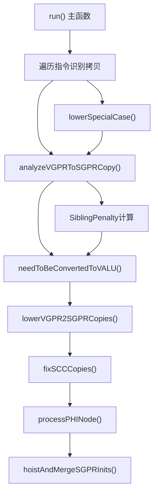
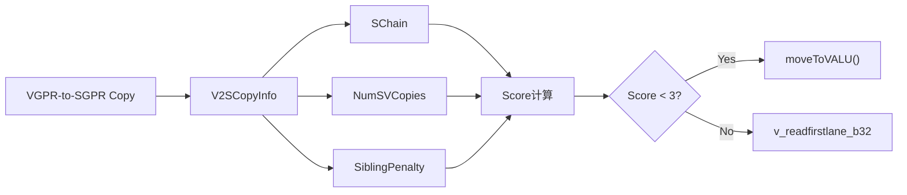

# SIFixSGPRCopies.cpp 代码功能详解

## 1. Pass的主要功能概述

<a name="ref-block_0"></a>该Pass的主要功能是**修复AMDGPU架构中非法的VGPR到SGPR寄存器拷贝**。在AMDGPU架构中，从VGPR（向量寄存器）到SGPR（标量寄存器）的拷贝是非法的，但寄存器合并器（register coalescer）在某些情况下（特别是涉及PHI指令时）会生成这类非法拷贝。 llvm-project:10-64[<sup>↗</sup>](#block_0) 

**主要作用和效果：**
- 检测并分析VGPR到SGPR的拷贝指令
- 通过评分系统决定拷贝的最优处理方式
- 将非法拷贝转换为合法操作（使用`v_readfirstlane_b32`指令或转换为VALU操作）
- 约束PHI指令的寄存器类别以避免非法拷贝的产生
- 优化M0寄存器的初始化（合并和提升）

## 2. 主要实现步骤和子功能

该Pass包含以下关键步骤和子功能：

### 2.1 主函数 `run()`
<a name="ref-block_5"></a>这是Pass的入口函数，负责协调整个修复流程。 llvm-project:619-805[<sup>↗</sup>](#block_5) 

### 2.2 VGPR到SGPR拷贝分析 `analyzeVGPRToSGPRCopy()`
<a name="ref-block_9"></a>分析每个VGPR到SGPR拷贝指令，构建其依赖的SALU指令链（SChain），并记录相关的统计信息。 llvm-project:927-985[<sup>↗</sup>](#block_9) 

### 2.3 评分与决策系统 `needToBeConvertedToVALU()`
<a name="ref-block_10"></a>根据评分算法决定VGPR到SGPR拷贝应该转换为VALU操作还是使用`v_readfirstlane_b32`指令。 llvm-project:989-1025[<sup>↗</sup>](#block_10) 

### 2.4 VGPR到SGPR拷贝降级 `lowerVGPR2SGPRCopies()`
<a name="ref-block_11"></a>执行实际的拷贝降级操作，将需要转换为VALU的拷贝移动到VALU，其他的转换为`v_readfirstlane_b32`指令。 llvm-project:1027-1129[<sup>↗</sup>](#block_11) 

### 2.5 特殊情况处理 `lowerSpecialCase()`
处理特殊的拷贝场景，包括：
- 目标寄存器为物理寄存器
- 源寄存器为物理寄存器或AGPR
<a name="ref-block_8"></a>- 立即数物化的情况 llvm-project:883-925[<sup>↗</sup>](#block_8) 

### 2.6 PHI节点处理 `processPHINode()`
<a name="ref-block_6"></a>处理PHI指令，确保PHI的定义寄存器类别被正确约束，以避免产生非法拷贝。如果PHI的所有使用都是AGPR，则将PHI移动到AGPR寄存器类。 llvm-project:807-856[<sup>↗</sup>](#block_6) 

### 2.7 SCC拷贝修复 `fixSCCCopies()`
<a name="ref-block_12"></a>修复涉及SCC（状态条件码）寄存器的拷贝，使用条件选择指令替换非法的SCC拷贝。 llvm-project:1131-1171[<sup>↗</sup>](#block_12) 

### 2.8 SGPR初始化提升和合并 `hoistAndMergeSGPRInits()`
<a name="ref-block_4"></a>优化SGPR（特别是M0寄存器）的初始化，将相同的初始化提升到公共前驱块，减少冗余初始化。 llvm-project:451-617[<sup>↗</sup>](#block_4) 

### 2.9 尝试改变拷贝中的寄存器类型 `tryChangeVGPRtoSGPRinCopy()`
<a name="ref-block_2"></a>尝试将VGPR目标改为SGPR，如果所有使用该拷贝结果的指令都能接受SGPR操作数。 llvm-project:237-263[<sup>↗</sup>](#block_2) 

### 2.10 折叠VGPR拷贝到REG_SEQUENCE `foldVGPRCopyIntoRegSequence()`
<a name="ref-block_3"></a>将SGPR到VGPR的REG_SEQUENCE拷贝分发为VGPR REG_SEQUENCE，暴露立即数折叠机会。 llvm-project:278-355[<sup>↗</sup>](#block_3) 

### 2.11 VGPR常量移动到SGPR `tryMoveVGPRConstToSGPR()`
<a name="ref-block_7"></a>如果VGPR操作数是物化的立即数，尝试将其移动到SGPR中。 llvm-project:858-881[<sup>↗</sup>](#block_7) 

## 3. 各步骤/子功能的详细分析

### 3.1 `run()` - 主函数
该函数遍历机器函数中的所有指令，识别和分类不同类型的拷贝和指令：
- **COPY指令**：区分SGPR到VGPR和VGPR到SGPR的拷贝
- **PHI、REG_SEQUENCE等指令**：如果定义SGPR且有VGPR操作数，插入拷贝指令
- **V_WRITELANE_B32**：处理常量总线限制

处理流程：先收集所有需要处理的拷贝和指令，然后依次调用降级、修复和优化函数。 llvm-project:629-771 

### 3.2 `analyzeVGPRToSGPRCopy()` - 拷贝分析
使用工作列表算法（worklist algorithm）追踪从VGPR到SGPR拷贝开始的SSA使用-定义链：
- 构建**SChain**：所有可达的SALU指令集合
- 统计**NumSVCopies**：需要插入的SGPR到VGPR拷贝数量
- 记录**SiblingPenalty**：其他拷贝对该拷贝的影响
- 忽略中间的COPY和REG_SEQUENCE指令 llvm-project:936-984 

### 3.3 `needToBeConvertedToVALU()` - 评分决策
评分公式计算：
- **Penalty** = NumSVCopies + SiblingPenalty + NumReadfirstlanes
- **Profit** = SChain.size()（SALU指令数量）
- **Score** = Profit - Penalty

决策规则：Score < 3时转换为VALU操作，否则使用`v_readfirstlane_b32`。 llvm-project:1019-1024 

### 3.4 `lowerVGPR2SGPRCopies()` - 降级实现
分两阶段处理：
1. **转换为VALU**：将评分低的拷贝及其SChain移动到VALU
2. **插入readfirstlane**：为剩余的拷贝插入`v_readfirstlane_b32`指令

支持16位、32位和更大位宽的寄存器，针对不同位宽生成不同的指令序列。 llvm-project:1071-1128 

### 3.5 `processPHINode()` - PHI处理
通过工作列表算法检查PHI的所有使用：
- 如果所有使用都是AGPR，将PHI的寄存器类改为AGPR
- 对向量寄存器或VReg_1的PHI调用`legalizeOperands()`
- 递归处理PHI操作数中的其他PHI节点 llvm-project:816-850 

### 3.6 `fixSCCCopies()` - SCC修复
SCC（Status Condition Code）寄存器的拷贝需要特殊处理：
- **从SCC拷贝**：使用`S_CSELECT_B32/B64`指令（-1或0）
- **到SCC拷贝**：使用`S_AND_B32/B64`指令与EXEC寄存器 llvm-project:1142-1168 

### 3.7 `hoistAndMergeSGPRInits()` - 初始化优化
通过支配树分析查找可以合并的SGPR初始化：
- 构建按立即数分组的初始化列表
- 检查指令间的干扰（clobbers）
- 将初始化提升到最近公共支配块
- 尽早调度初始化指令 llvm-project:483-572 

## 4. 步骤/子功能之间的关系

### 4.1 整体流程关系



### 4.2 关键依赖关系

1. **分析阶段（Analysis Phase）**：
   - `run()` → `analyzeVGPRToSGPRCopy()`：收集所有VGPR到SGPR拷贝的信息
   - `analyzeVGPRToSGPRCopy()` 构建V2SCopyInfo结构，为评分做准备

2. **评分阶段（Scoring Phase）**：
   - `analyzeVGPRToSGPRCopy()` → `needToBeConvertedToVALU()`：使用分析结果计算评分
   - 评分考虑SiblingPenalty（兄弟拷贝的影响）

3. **降级阶段（Lowering Phase）**：
   - `needToBeConvertedToVALU()` → `lowerVGPR2SGPRCopies()`：基于评分决策执行降级
   - 降级会影响兄弟拷贝的评分，触发重新评估

4. **后处理阶段（Post-processing Phase）**：
   - `lowerVGPR2SGPRCopies()` → `fixSCCCopies()`：修复SCC相关拷贝
   - `fixSCCCopies()` → `processPHINode()`：处理PHI节点
   - `processPHINode()` → `hoistAndMergeSGPRInits()`：优化SGPR初始化

### 4.3 辅助函数的支持关系

- `tryChangeVGPRtoSGPRinCopy()`、`tryMoveVGPRConstToSGPR()`、`lowerSpecialCase()` 作为优化手段，在主流程的多个阶段被调用
- `foldVGPRCopyIntoRegSequence()` 专门处理REG_SEQUENCE场景，与主流程并行

### 4.4 数据流关系



## Notes

该Pass是AMDGPU后端中非常重要的合法化步骤，它确保了生成的机器代码符合AMDGPU的硬件约束。Pass采用了启发式评分系统来平衡性能和正确性：
- 保留在标量单元（SALU）执行的指令链可以提高性能
- 但如果代价太高（需要太多额外的拷贝），则将整个链移到向量单元（VALU）

该Pass只在SelectionDAG路径中运行 llvm-project:620-622 ，并依赖于MachineDominatorTree进行支配树分析。 llvm-project:178-180
### Citations
<a name="block_0"></a>**File:** llvm/lib/Target/AMDGPU/SIFixSGPRCopies.cpp (L10-64) [<sup>↩</sup>](#ref-block_0)
```cpp
/// Copies from VGPR to SGPR registers are illegal and the register coalescer
/// will sometimes generate these illegal copies in situations like this:
///
///  Register Class <vsrc> is the union of <vgpr> and <sgpr>
///
/// BB0:
///   %0 <sgpr> = SCALAR_INST
///   %1 <vsrc> = COPY %0 <sgpr>
///    ...
///    BRANCH %cond BB1, BB2
///  BB1:
///    %2 <vgpr> = VECTOR_INST
///    %3 <vsrc> = COPY %2 <vgpr>
///  BB2:
///    %4 <vsrc> = PHI %1 <vsrc>, <%bb.0>, %3 <vrsc>, <%bb.1>
///    %5 <vgpr> = VECTOR_INST %4 <vsrc>
///
///
/// The coalescer will begin at BB0 and eliminate its copy, then the resulting
/// code will look like this:
///
/// BB0:
///   %0 <sgpr> = SCALAR_INST
///    ...
///    BRANCH %cond BB1, BB2
/// BB1:
///   %2 <vgpr> = VECTOR_INST
///   %3 <vsrc> = COPY %2 <vgpr>
/// BB2:
///   %4 <sgpr> = PHI %0 <sgpr>, <%bb.0>, %3 <vsrc>, <%bb.1>
///   %5 <vgpr> = VECTOR_INST %4 <sgpr>
///
/// Now that the result of the PHI instruction is an SGPR, the register
/// allocator is now forced to constrain the register class of %3 to
/// <sgpr> so we end up with final code like this:
///
/// BB0:
///   %0 <sgpr> = SCALAR_INST
///    ...
///    BRANCH %cond BB1, BB2
/// BB1:
///   %2 <vgpr> = VECTOR_INST
///   %3 <sgpr> = COPY %2 <vgpr>
/// BB2:
///   %4 <sgpr> = PHI %0 <sgpr>, <%bb.0>, %3 <sgpr>, <%bb.1>
///   %5 <vgpr> = VECTOR_INST %4 <sgpr>
///
/// Now this code contains an illegal copy from a VGPR to an SGPR.
///
/// In order to avoid this problem, this pass searches for PHI instructions
/// which define a <vsrc> register and constrains its definition class to
/// <vgpr> if the user of the PHI's definition register is a vector instruction.
/// If the PHI's definition class is constrained to <vgpr> then the coalescer
/// will be unable to perform the COPY removal from the above example  which
/// ultimately led to the creation of an illegal COPY.
```
<a name="block_1"></a>**File:** llvm/lib/Target/AMDGPU/SIFixSGPRCopies.cpp (L178-180)
```cpp
  void getAnalysisUsage(AnalysisUsage &AU) const override {
    AU.addRequired<MachineDominatorTreeWrapperPass>();
    AU.addPreserved<MachineDominatorTreeWrapperPass>();
```
<a name="block_2"></a>**File:** llvm/lib/Target/AMDGPU/SIFixSGPRCopies.cpp (L237-263) [<sup>↩</sup>](#ref-block_2)
```cpp
static bool tryChangeVGPRtoSGPRinCopy(MachineInstr &MI,
                                      const SIRegisterInfo *TRI,
                                      const SIInstrInfo *TII) {
  MachineRegisterInfo &MRI = MI.getParent()->getParent()->getRegInfo();
  auto &Src = MI.getOperand(1);
  Register DstReg = MI.getOperand(0).getReg();
  Register SrcReg = Src.getReg();
  if (!SrcReg.isVirtual() || !DstReg.isVirtual())
    return false;

  for (const auto &MO : MRI.reg_nodbg_operands(DstReg)) {
    const auto *UseMI = MO.getParent();
    if (UseMI == &MI)
      continue;
    if (MO.isDef() || UseMI->getParent() != MI.getParent() ||
        UseMI->getOpcode() <= TargetOpcode::GENERIC_OP_END)
      return false;

    unsigned OpIdx = MO.getOperandNo();
    if (OpIdx >= UseMI->getDesc().getNumOperands() ||
        !TII->isOperandLegal(*UseMI, OpIdx, &Src))
      return false;
  }
  // Change VGPR to SGPR destination.
  MRI.setRegClass(DstReg, TRI->getEquivalentSGPRClass(MRI.getRegClass(DstReg)));
  return true;
}
```
<a name="block_3"></a>**File:** llvm/lib/Target/AMDGPU/SIFixSGPRCopies.cpp (L278-355) [<sup>↩</sup>](#ref-block_3)
```cpp
static bool foldVGPRCopyIntoRegSequence(MachineInstr &MI,
                                        const SIRegisterInfo *TRI,
                                        const SIInstrInfo *TII,
                                        MachineRegisterInfo &MRI) {
  assert(MI.isRegSequence());

  Register DstReg = MI.getOperand(0).getReg();
  if (!TRI->isSGPRClass(MRI.getRegClass(DstReg)))
    return false;

  if (!MRI.hasOneUse(DstReg))
    return false;

  MachineInstr &CopyUse = *MRI.use_instr_begin(DstReg);
  if (!CopyUse.isCopy())
    return false;

  // It is illegal to have vreg inputs to a physreg defining reg_sequence.
  if (CopyUse.getOperand(0).getReg().isPhysical())
    return false;

  const TargetRegisterClass *SrcRC, *DstRC;
  std::tie(SrcRC, DstRC) = getCopyRegClasses(CopyUse, *TRI, MRI);

  if (!isSGPRToVGPRCopy(SrcRC, DstRC, *TRI))
    return false;

  if (tryChangeVGPRtoSGPRinCopy(CopyUse, TRI, TII))
    return true;

  // TODO: Could have multiple extracts?
  unsigned SubReg = CopyUse.getOperand(1).getSubReg();
  if (SubReg != AMDGPU::NoSubRegister)
    return false;

  MRI.setRegClass(DstReg, DstRC);

  // SGPRx = ...
  // SGPRy = REG_SEQUENCE SGPRx, sub0 ...
  // VGPRz = COPY SGPRy

  // =>
  // VGPRx = COPY SGPRx
  // VGPRz = REG_SEQUENCE VGPRx, sub0

  MI.getOperand(0).setReg(CopyUse.getOperand(0).getReg());
  bool IsAGPR = TRI->isAGPRClass(DstRC);

  for (unsigned I = 1, N = MI.getNumOperands(); I != N; I += 2) {
    const TargetRegisterClass *SrcRC =
        TRI->getRegClassForOperandReg(MRI, MI.getOperand(I));
    assert(TRI->isSGPRClass(SrcRC) &&
           "Expected SGPR REG_SEQUENCE to only have SGPR inputs");
    const TargetRegisterClass *NewSrcRC = TRI->getEquivalentVGPRClass(SrcRC);

    Register TmpReg = MRI.createVirtualRegister(NewSrcRC);

    BuildMI(*MI.getParent(), &MI, MI.getDebugLoc(), TII->get(AMDGPU::COPY),
            TmpReg)
        .add(MI.getOperand(I));

    if (IsAGPR) {
      const TargetRegisterClass *NewSrcRC = TRI->getEquivalentAGPRClass(SrcRC);
      Register TmpAReg = MRI.createVirtualRegister(NewSrcRC);
      unsigned Opc = NewSrcRC == &AMDGPU::AGPR_32RegClass ?
        AMDGPU::V_ACCVGPR_WRITE_B32_e64 : AMDGPU::COPY;
      BuildMI(*MI.getParent(), &MI, MI.getDebugLoc(), TII->get(Opc),
            TmpAReg)
        .addReg(TmpReg, RegState::Kill);
      TmpReg = TmpAReg;
    }

    MI.getOperand(I).setReg(TmpReg);
  }

  CopyUse.eraseFromParent();
  return true;
}
```
<a name="block_4"></a>**File:** llvm/lib/Target/AMDGPU/SIFixSGPRCopies.cpp (L451-617) [<sup>↩</sup>](#ref-block_4)
```cpp
static bool hoistAndMergeSGPRInits(unsigned Reg,
                                   const MachineRegisterInfo &MRI,
                                   const TargetRegisterInfo *TRI,
                                   MachineDominatorTree &MDT,
                                   const TargetInstrInfo *TII) {
  // List of inits by immediate value.
  using InitListMap = std::map<unsigned, std::list<MachineInstr *>>;
  InitListMap Inits;
  // List of clobbering instructions.
  SmallVector<MachineInstr*, 8> Clobbers;
  // List of instructions marked for deletion.
  SmallSet<MachineInstr*, 8> MergedInstrs;

  bool Changed = false;

  for (auto &MI : MRI.def_instructions(Reg)) {
    MachineOperand *Imm = nullptr;
    for (auto &MO : MI.operands()) {
      if ((MO.isReg() && ((MO.isDef() && MO.getReg() != Reg) || !MO.isDef())) ||
          (!MO.isImm() && !MO.isReg()) || (MO.isImm() && Imm)) {
        Imm = nullptr;
        break;
      }
      if (MO.isImm())
        Imm = &MO;
    }
    if (Imm)
      Inits[Imm->getImm()].push_front(&MI);
    else
      Clobbers.push_back(&MI);
  }

  for (auto &Init : Inits) {
    auto &Defs = Init.second;

    for (auto I1 = Defs.begin(), E = Defs.end(); I1 != E; ) {
      MachineInstr *MI1 = *I1;

      for (auto I2 = std::next(I1); I2 != E; ) {
        MachineInstr *MI2 = *I2;

        // Check any possible interference
        auto interferes = [&](MachineBasicBlock::iterator From,
                              MachineBasicBlock::iterator To) -> bool {

          assert(MDT.dominates(&*To, &*From));

          auto interferes = [&MDT, From, To](MachineInstr* &Clobber) -> bool {
            const MachineBasicBlock *MBBFrom = From->getParent();
            const MachineBasicBlock *MBBTo = To->getParent();
            bool MayClobberFrom = isReachable(Clobber, &*From, MBBTo, MDT);
            bool MayClobberTo = isReachable(Clobber, &*To, MBBTo, MDT);
            if (!MayClobberFrom && !MayClobberTo)
              return false;
            if ((MayClobberFrom && !MayClobberTo) ||
                (!MayClobberFrom && MayClobberTo))
              return true;
            // Both can clobber, this is not an interference only if both are
            // dominated by Clobber and belong to the same block or if Clobber
            // properly dominates To, given that To >> From, so it dominates
            // both and located in a common dominator.
            return !((MBBFrom == MBBTo &&
                      MDT.dominates(Clobber, &*From) &&
                      MDT.dominates(Clobber, &*To)) ||
                     MDT.properlyDominates(Clobber->getParent(), MBBTo));
          };

          return (llvm::any_of(Clobbers, interferes)) ||
                 (llvm::any_of(Inits, [&](InitListMap::value_type &C) {
                    return C.first != Init.first &&
                           llvm::any_of(C.second, interferes);
                  }));
        };

        if (MDT.dominates(MI1, MI2)) {
          if (!interferes(MI2, MI1)) {
            LLVM_DEBUG(dbgs()
                       << "Erasing from "
                       << printMBBReference(*MI2->getParent()) << " " << *MI2);
            MergedInstrs.insert(MI2);
            Changed = true;
            ++I2;
            continue;
          }
        } else if (MDT.dominates(MI2, MI1)) {
          if (!interferes(MI1, MI2)) {
            LLVM_DEBUG(dbgs()
                       << "Erasing from "
                       << printMBBReference(*MI1->getParent()) << " " << *MI1);
            MergedInstrs.insert(MI1);
            Changed = true;
            ++I1;
            break;
          }
        } else {
          auto *MBB = MDT.findNearestCommonDominator(MI1->getParent(),
                                                     MI2->getParent());
          if (!MBB) {
            ++I2;
            continue;
          }

          MachineBasicBlock::iterator I = getFirstNonPrologue(MBB, TII);
          if (!interferes(MI1, I) && !interferes(MI2, I)) {
            LLVM_DEBUG(dbgs()
                       << "Erasing from "
                       << printMBBReference(*MI1->getParent()) << " " << *MI1
                       << "and moving from "
                       << printMBBReference(*MI2->getParent()) << " to "
                       << printMBBReference(*I->getParent()) << " " << *MI2);
            I->getParent()->splice(I, MI2->getParent(), MI2);
            MergedInstrs.insert(MI1);
            Changed = true;
            ++I1;
            break;
          }
        }
        ++I2;
      }
      ++I1;
    }
  }

  // Remove initializations that were merged into another.
  for (auto &Init : Inits) {
    auto &Defs = Init.second;
    auto I = Defs.begin();
    while (I != Defs.end()) {
      if (MergedInstrs.count(*I)) {
        (*I)->eraseFromParent();
        I = Defs.erase(I);
      } else
        ++I;
    }
  }

  // Try to schedule SGPR initializations as early as possible in the MBB.
  for (auto &Init : Inits) {
    auto &Defs = Init.second;
    for (auto *MI : Defs) {
      auto *MBB = MI->getParent();
      MachineInstr &BoundaryMI = *getFirstNonPrologue(MBB, TII);
      MachineBasicBlock::reverse_iterator B(BoundaryMI);
      // Check if B should actually be a boundary. If not set the previous
      // instruction as the boundary instead.
      if (!TII->isBasicBlockPrologue(*B))
        B++;

      auto R = std::next(MI->getReverseIterator());
      const unsigned Threshold = 50;
      // Search until B or Threshold for a place to insert the initialization.
      for (unsigned I = 0; R != B && I < Threshold; ++R, ++I)
        if (R->readsRegister(Reg, TRI) || R->definesRegister(Reg, TRI) ||
            TII->isSchedulingBoundary(*R, MBB, *MBB->getParent()))
          break;

      // Move to directly after R.
      if (&*--R != MI)
        MBB->splice(*R, MBB, MI);
    }
  }

  if (Changed)
    MRI.clearKillFlags(Reg);

  return Changed;
}
```
<a name="block_5"></a>**File:** llvm/lib/Target/AMDGPU/SIFixSGPRCopies.cpp (L619-805) [<sup>↩</sup>](#ref-block_5)
```cpp
bool SIFixSGPRCopies::run(MachineFunction &MF) {
  // Only need to run this in SelectionDAG path.
  if (MF.getProperties().hasSelected())
    return false;

  const GCNSubtarget &ST = MF.getSubtarget<GCNSubtarget>();
  MRI = &MF.getRegInfo();
  TRI = ST.getRegisterInfo();
  TII = ST.getInstrInfo();

  for (MachineBasicBlock &MBB : MF) {
    for (MachineBasicBlock::iterator I = MBB.begin(), E = MBB.end(); I != E;
         ++I) {
      MachineInstr &MI = *I;

      switch (MI.getOpcode()) {
      default:
        continue;
      case AMDGPU::COPY: {
        const TargetRegisterClass *SrcRC, *DstRC;
        std::tie(SrcRC, DstRC) = getCopyRegClasses(MI, *TRI, *MRI);

        if (isSGPRToVGPRCopy(SrcRC, DstRC, *TRI)) {
          // Since VGPR to SGPR copies affect VGPR to SGPR copy
          // score and, hence the lowering decision, let's try to get rid of
          // them as early as possible
          if (tryChangeVGPRtoSGPRinCopy(MI, TRI, TII))
            continue;

          // Collect those not changed to try them after VGPR to SGPR copies
          // lowering as there will be more opportunities.
          S2VCopies.push_back(&MI);
        }
        if (!isVGPRToSGPRCopy(SrcRC, DstRC, *TRI))
          continue;
        if (lowerSpecialCase(MI, I))
          continue;

        analyzeVGPRToSGPRCopy(&MI);

        break;
      }
      case AMDGPU::WQM:
      case AMDGPU::STRICT_WQM:
      case AMDGPU::SOFT_WQM:
      case AMDGPU::STRICT_WWM:
      case AMDGPU::INSERT_SUBREG:
      case AMDGPU::PHI:
      case AMDGPU::REG_SEQUENCE: {
        if (TRI->isSGPRClass(TII->getOpRegClass(MI, 0))) {
          for (MachineOperand &MO : MI.operands()) {
            if (!MO.isReg() || !MO.getReg().isVirtual())
              continue;
            const TargetRegisterClass *SrcRC = MRI->getRegClass(MO.getReg());
            if (SrcRC == &AMDGPU::VReg_1RegClass)
              continue;

            if (TRI->hasVectorRegisters(SrcRC)) {
              const TargetRegisterClass *DestRC =
                  TRI->getEquivalentSGPRClass(SrcRC);
              Register NewDst = MRI->createVirtualRegister(DestRC);
              MachineBasicBlock *BlockToInsertCopy =
                  MI.isPHI() ? MI.getOperand(MO.getOperandNo() + 1).getMBB()
                             : &MBB;
              MachineBasicBlock::iterator PointToInsertCopy =
                  MI.isPHI() ? BlockToInsertCopy->getFirstInstrTerminator() : I;

              const DebugLoc &DL = MI.getDebugLoc();
              if (!tryMoveVGPRConstToSGPR(MO, NewDst, BlockToInsertCopy,
                                          PointToInsertCopy, DL)) {
                MachineInstr *NewCopy =
                    BuildMI(*BlockToInsertCopy, PointToInsertCopy, DL,
                            TII->get(AMDGPU::COPY), NewDst)
                        .addReg(MO.getReg());
                MO.setReg(NewDst);
                analyzeVGPRToSGPRCopy(NewCopy);
                PHISources.insert(NewCopy);
              }
            }
          }
        }

        if (MI.isPHI())
          PHINodes.push_back(&MI);
        else if (MI.isRegSequence())
          RegSequences.push_back(&MI);

        break;
      }
      case AMDGPU::V_WRITELANE_B32: {
        // Some architectures allow more than one constant bus access without
        // SGPR restriction
        if (ST.getConstantBusLimit(MI.getOpcode()) != 1)
          break;

        // Writelane is special in that it can use SGPR and M0 (which would
        // normally count as using the constant bus twice - but in this case it
        // is allowed since the lane selector doesn't count as a use of the
        // constant bus). However, it is still required to abide by the 1 SGPR
        // rule. Apply a fix here as we might have multiple SGPRs after
        // legalizing VGPRs to SGPRs
        int Src0Idx =
            AMDGPU::getNamedOperandIdx(MI.getOpcode(), AMDGPU::OpName::src0);
        int Src1Idx =
            AMDGPU::getNamedOperandIdx(MI.getOpcode(), AMDGPU::OpName::src1);
        MachineOperand &Src0 = MI.getOperand(Src0Idx);
        MachineOperand &Src1 = MI.getOperand(Src1Idx);

        // Check to see if the instruction violates the 1 SGPR rule
        if ((Src0.isReg() && TRI->isSGPRReg(*MRI, Src0.getReg()) &&
             Src0.getReg() != AMDGPU::M0) &&
            (Src1.isReg() && TRI->isSGPRReg(*MRI, Src1.getReg()) &&
             Src1.getReg() != AMDGPU::M0)) {

          // Check for trivially easy constant prop into one of the operands
          // If this is the case then perform the operation now to resolve SGPR
          // issue. If we don't do that here we will always insert a mov to m0
          // that can't be resolved in later operand folding pass
          bool Resolved = false;
          for (MachineOperand *MO : {&Src0, &Src1}) {
            if (MO->getReg().isVirtual()) {
              MachineInstr *DefMI = MRI->getVRegDef(MO->getReg());
              if (DefMI && TII->isFoldableCopy(*DefMI)) {
                const MachineOperand &Def = DefMI->getOperand(0);
                if (Def.isReg() &&
                    MO->getReg() == Def.getReg() &&
                    MO->getSubReg() == Def.getSubReg()) {
                  const MachineOperand &Copied = DefMI->getOperand(1);
                  if (Copied.isImm() &&
                      TII->isInlineConstant(APInt(64, Copied.getImm(), true))) {
                    MO->ChangeToImmediate(Copied.getImm());
                    Resolved = true;
                    break;
                  }
                }
              }
            }
          }

          if (!Resolved) {
            // Haven't managed to resolve by replacing an SGPR with an immediate
            // Move src1 to be in M0
            BuildMI(*MI.getParent(), MI, MI.getDebugLoc(),
                    TII->get(AMDGPU::COPY), AMDGPU::M0)
                .add(Src1);
            Src1.ChangeToRegister(AMDGPU::M0, false);
          }
        }
        break;
      }
      }
    }
  }

  lowerVGPR2SGPRCopies(MF);
  // Postprocessing
  fixSCCCopies(MF);
  for (auto *MI : S2VCopies) {
    // Check if it is still valid
    if (MI->isCopy()) {
      const TargetRegisterClass *SrcRC, *DstRC;
      std::tie(SrcRC, DstRC) = getCopyRegClasses(*MI, *TRI, *MRI);
      if (isSGPRToVGPRCopy(SrcRC, DstRC, *TRI))
        tryChangeVGPRtoSGPRinCopy(*MI, TRI, TII);
    }
  }
  for (auto *MI : RegSequences) {
    // Check if it is still valid
    if (MI->isRegSequence())
      foldVGPRCopyIntoRegSequence(*MI, TRI, TII, *MRI);
  }
  for (auto *MI : PHINodes) {
    processPHINode(*MI);
  }
  if (MF.getTarget().getOptLevel() > CodeGenOptLevel::None && EnableM0Merge)
    hoistAndMergeSGPRInits(AMDGPU::M0, *MRI, TRI, *MDT, TII);

  SiblingPenalty.clear();
  V2SCopies.clear();
  SCCCopies.clear();
  RegSequences.clear();
  PHINodes.clear();
  S2VCopies.clear();
  PHISources.clear();

  return true;
}
```
<a name="block_6"></a>**File:** llvm/lib/Target/AMDGPU/SIFixSGPRCopies.cpp (L807-856) [<sup>↩</sup>](#ref-block_6)
```cpp
void SIFixSGPRCopies::processPHINode(MachineInstr &MI) {
  bool AllAGPRUses = true;
  SetVector<const MachineInstr *> worklist;
  SmallSet<const MachineInstr *, 4> Visited;
  SetVector<MachineInstr *> PHIOperands;
  worklist.insert(&MI);
  Visited.insert(&MI);
  // HACK to make MIR tests with no uses happy
  bool HasUses = false;
  while (!worklist.empty()) {
    const MachineInstr *Instr = worklist.pop_back_val();
    Register Reg = Instr->getOperand(0).getReg();
    for (const auto &Use : MRI->use_operands(Reg)) {
      HasUses = true;
      const MachineInstr *UseMI = Use.getParent();
      AllAGPRUses &= (UseMI->isCopy() &&
                      TRI->isAGPR(*MRI, UseMI->getOperand(0).getReg())) ||
                     TRI->isAGPR(*MRI, Use.getReg());
      if (UseMI->isCopy() || UseMI->isRegSequence()) {
        if (Visited.insert(UseMI).second)
          worklist.insert(UseMI);

        continue;
      }
    }
  }

  Register PHIRes = MI.getOperand(0).getReg();
  const TargetRegisterClass *RC0 = MRI->getRegClass(PHIRes);
  if (HasUses && AllAGPRUses && !TRI->isAGPRClass(RC0)) {
    LLVM_DEBUG(dbgs() << "Moving PHI to AGPR: " << MI);
    MRI->setRegClass(PHIRes, TRI->getEquivalentAGPRClass(RC0));
    for (unsigned I = 1, N = MI.getNumOperands(); I != N; I += 2) {
      MachineInstr *DefMI = MRI->getVRegDef(MI.getOperand(I).getReg());
      if (DefMI && DefMI->isPHI())
        PHIOperands.insert(DefMI);
    }
  }

  if (TRI->isVectorRegister(*MRI, PHIRes) ||
       RC0 == &AMDGPU::VReg_1RegClass) {
    LLVM_DEBUG(dbgs() << "Legalizing PHI: " << MI);
    TII->legalizeOperands(MI, MDT);
  }

  // Propagate register class back to PHI operands which are PHI themselves.
  while (!PHIOperands.empty()) {
    processPHINode(*PHIOperands.pop_back_val());
  }
}
```
<a name="block_7"></a>**File:** llvm/lib/Target/AMDGPU/SIFixSGPRCopies.cpp (L858-881) [<sup>↩</sup>](#ref-block_7)
```cpp
bool SIFixSGPRCopies::tryMoveVGPRConstToSGPR(
    MachineOperand &MaybeVGPRConstMO, Register DstReg,
    MachineBasicBlock *BlockToInsertTo,
    MachineBasicBlock::iterator PointToInsertTo, const DebugLoc &DL) {

  MachineInstr *DefMI = MRI->getVRegDef(MaybeVGPRConstMO.getReg());
  if (!DefMI || !DefMI->isMoveImmediate())
    return false;

  MachineOperand *SrcConst = TII->getNamedOperand(*DefMI, AMDGPU::OpName::src0);
  if (SrcConst->isReg())
    return false;

  const TargetRegisterClass *SrcRC =
      MRI->getRegClass(MaybeVGPRConstMO.getReg());
  unsigned MoveSize = TRI->getRegSizeInBits(*SrcRC);
  unsigned MoveOp = MoveSize == 64 ? AMDGPU::S_MOV_B64 : AMDGPU::S_MOV_B32;
  BuildMI(*BlockToInsertTo, PointToInsertTo, DL, TII->get(MoveOp), DstReg)
      .add(*SrcConst);
  if (MRI->hasOneUse(MaybeVGPRConstMO.getReg()))
    DefMI->eraseFromParent();
  MaybeVGPRConstMO.setReg(DstReg);
  return true;
}
```
<a name="block_8"></a>**File:** llvm/lib/Target/AMDGPU/SIFixSGPRCopies.cpp (L883-925) [<sup>↩</sup>](#ref-block_8)
```cpp
bool SIFixSGPRCopies::lowerSpecialCase(MachineInstr &MI,
                                       MachineBasicBlock::iterator &I) {
  Register DstReg = MI.getOperand(0).getReg();
  Register SrcReg = MI.getOperand(1).getReg();
  if (!DstReg.isVirtual()) {
    // If the destination register is a physical register there isn't
    // really much we can do to fix this.
    // Some special instructions use M0 as an input. Some even only use
    // the first lane. Insert a readfirstlane and hope for the best.
    if (DstReg == AMDGPU::M0 &&
        TRI->hasVectorRegisters(MRI->getRegClass(SrcReg))) {
      Register TmpReg =
          MRI->createVirtualRegister(&AMDGPU::SReg_32_XM0RegClass);
      BuildMI(*MI.getParent(), MI, MI.getDebugLoc(),
              TII->get(AMDGPU::V_READFIRSTLANE_B32), TmpReg)
          .add(MI.getOperand(1));
      MI.getOperand(1).setReg(TmpReg);
    } else if (tryMoveVGPRConstToSGPR(MI.getOperand(1), DstReg, MI.getParent(),
                                      MI, MI.getDebugLoc())) {
      I = std::next(I);
      MI.eraseFromParent();
    }
    return true;
  }
  if (!SrcReg.isVirtual() || TRI->isAGPR(*MRI, SrcReg)) {
    SIInstrWorklist worklist;
    worklist.insert(&MI);
    TII->moveToVALU(worklist, MDT);
    return true;
  }

  unsigned SMovOp;
  int64_t Imm;
  // If we are just copying an immediate, we can replace the copy with
  // s_mov_b32.
  if (isSafeToFoldImmIntoCopy(&MI, MRI->getVRegDef(SrcReg), TII, SMovOp, Imm)) {
    MI.getOperand(1).ChangeToImmediate(Imm);
    MI.addImplicitDefUseOperands(*MI.getParent()->getParent());
    MI.setDesc(TII->get(SMovOp));
    return true;
  }
  return false;
}
```
<a name="block_9"></a>**File:** llvm/lib/Target/AMDGPU/SIFixSGPRCopies.cpp (L927-985) [<sup>↩</sup>](#ref-block_9)
```cpp
void SIFixSGPRCopies::analyzeVGPRToSGPRCopy(MachineInstr* MI) {
  if (PHISources.contains(MI))
    return;
  Register DstReg = MI->getOperand(0).getReg();
  const TargetRegisterClass *DstRC = MRI->getRegClass(DstReg);

  V2SCopyInfo Info(getNextVGPRToSGPRCopyId(), MI,
                   TRI->getRegSizeInBits(*DstRC));
  SmallVector<MachineInstr *, 8> AnalysisWorklist;
  // Needed because the SSA is not a tree but a graph and may have
  // forks and joins. We should not then go same way twice.
  DenseSet<MachineInstr *> Visited;
  AnalysisWorklist.push_back(Info.Copy);
  while (!AnalysisWorklist.empty()) {

    MachineInstr *Inst = AnalysisWorklist.pop_back_val();

    if (!Visited.insert(Inst).second)
      continue;

    // Copies and REG_SEQUENCE do not contribute to the final assembly
    // So, skip them but take care of the SGPR to VGPR copies bookkeeping.
    if (Inst->isCopy() || Inst->isRegSequence()) {
      if (TRI->isVGPR(*MRI, Inst->getOperand(0).getReg())) {
        if (!Inst->isCopy() ||
            !tryChangeVGPRtoSGPRinCopy(*Inst, TRI, TII)) {
          Info.NumSVCopies++;
          continue;
        }
      }
    }

    SiblingPenalty[Inst].insert(Info.ID);

    SmallVector<MachineInstr *, 4> Users;
    if ((TII->isSALU(*Inst) && Inst->isCompare()) ||
        (Inst->isCopy() && Inst->getOperand(0).getReg() == AMDGPU::SCC)) {
      auto I = Inst->getIterator();
      auto E = Inst->getParent()->end();
      while (++I != E &&
             !I->findRegisterDefOperand(AMDGPU::SCC, /*TRI=*/nullptr)) {
        if (I->readsRegister(AMDGPU::SCC, /*TRI=*/nullptr))
          Users.push_back(&*I);
      }
    } else if (Inst->getNumExplicitDefs() != 0) {
      Register Reg = Inst->getOperand(0).getReg();
      if (Reg.isVirtual() && TRI->isSGPRReg(*MRI, Reg) && !TII->isVALU(*Inst)) {
        for (auto &U : MRI->use_instructions(Reg))
          Users.push_back(&U);
      }
    }
    for (auto *U : Users) {
      if (TII->isSALU(*U))
        Info.SChain.insert(U);
      AnalysisWorklist.push_back(U);
    }
  }
  V2SCopies[Info.ID] = Info;
}
```
<a name="block_10"></a>**File:** llvm/lib/Target/AMDGPU/SIFixSGPRCopies.cpp (L989-1025) [<sup>↩</sup>](#ref-block_10)
```cpp
bool SIFixSGPRCopies::needToBeConvertedToVALU(V2SCopyInfo *Info) {
  if (Info->SChain.empty()) {
    Info->Score = 0;
    return true;
  }
  Info->Siblings = SiblingPenalty[*llvm::max_element(
      Info->SChain, [&](MachineInstr *A, MachineInstr *B) -> bool {
        return SiblingPenalty[A].size() < SiblingPenalty[B].size();
      })];
  Info->Siblings.remove_if([&](unsigned ID) { return ID == Info->ID; });
  // The loop below computes the number of another VGPR to SGPR V2SCopies
  // which contribute to the current copy SALU chain. We assume that all the
  // V2SCopies with the same source virtual register will be squashed to one
  // by regalloc. Also we take care of the V2SCopies of the differnt subregs
  // of the same register.
  SmallSet<std::pair<Register, unsigned>, 4> SrcRegs;
  for (auto J : Info->Siblings) {
    auto *InfoIt = V2SCopies.find(J);
    if (InfoIt != V2SCopies.end()) {
      MachineInstr *SiblingCopy = InfoIt->second.Copy;
      if (SiblingCopy->isImplicitDef())
        // the COPY has already been MoveToVALUed
        continue;

      SrcRegs.insert(std::pair(SiblingCopy->getOperand(1).getReg(),
                               SiblingCopy->getOperand(1).getSubReg()));
    }
  }
  Info->SiblingPenalty = SrcRegs.size();

  unsigned Penalty =
      Info->NumSVCopies + Info->SiblingPenalty + Info->NumReadfirstlanes;
  unsigned Profit = Info->SChain.size();
  Info->Score = Penalty > Profit ? 0 : Profit - Penalty;
  Info->NeedToBeConvertedToVALU = Info->Score < 3;
  return Info->NeedToBeConvertedToVALU;
}
```
<a name="block_11"></a>**File:** llvm/lib/Target/AMDGPU/SIFixSGPRCopies.cpp (L1027-1129) [<sup>↩</sup>](#ref-block_11)
```cpp
void SIFixSGPRCopies::lowerVGPR2SGPRCopies(MachineFunction &MF) {

  SmallVector<unsigned, 8> LoweringWorklist;
  for (auto &C : V2SCopies) {
    if (needToBeConvertedToVALU(&C.second))
      LoweringWorklist.push_back(C.second.ID);
  }

  // Store all the V2S copy instructions that need to be moved to VALU
  // in the Copies worklist.
  SIInstrWorklist Copies;

  while (!LoweringWorklist.empty()) {
    unsigned CurID = LoweringWorklist.pop_back_val();
    auto *CurInfoIt = V2SCopies.find(CurID);
    if (CurInfoIt != V2SCopies.end()) {
      V2SCopyInfo C = CurInfoIt->second;
      LLVM_DEBUG(dbgs() << "Processing ...\n"; C.dump());
      for (auto S : C.Siblings) {
        auto *SibInfoIt = V2SCopies.find(S);
        if (SibInfoIt != V2SCopies.end()) {
          V2SCopyInfo &SI = SibInfoIt->second;
          LLVM_DEBUG(dbgs() << "Sibling:\n"; SI.dump());
          if (!SI.NeedToBeConvertedToVALU) {
            SI.SChain.set_subtract(C.SChain);
            if (needToBeConvertedToVALU(&SI))
              LoweringWorklist.push_back(SI.ID);
          }
          SI.Siblings.remove_if([&](unsigned ID) { return ID == C.ID; });
        }
      }
      LLVM_DEBUG(dbgs() << "V2S copy " << *C.Copy
                        << " is being turned to VALU\n");
      // TODO: MapVector::erase is inefficient. Do bulk removal with remove_if
      // instead.
      V2SCopies.erase(C.ID);
      Copies.insert(C.Copy);
    }
  }

  TII->moveToVALU(Copies, MDT);
  Copies.clear();

  // Now do actual lowering
  for (auto C : V2SCopies) {
    MachineInstr *MI = C.second.Copy;
    MachineBasicBlock *MBB = MI->getParent();
    // We decide to turn V2S copy to v_readfirstlane_b32
    // remove it from the V2SCopies and remove it from all its siblings
    LLVM_DEBUG(dbgs() << "V2S copy " << *MI
                      << " is being turned to v_readfirstlane_b32"
                      << " Score: " << C.second.Score << "\n");
    Register DstReg = MI->getOperand(0).getReg();
    MRI->constrainRegClass(DstReg, &AMDGPU::SReg_32_XM0RegClass);

    Register SrcReg = MI->getOperand(1).getReg();
    unsigned SubReg = MI->getOperand(1).getSubReg();
    const TargetRegisterClass *SrcRC =
        TRI->getRegClassForOperandReg(*MRI, MI->getOperand(1));
    size_t SrcSize = TRI->getRegSizeInBits(*SrcRC);
    if (SrcSize == 16) {
      assert(MF.getSubtarget<GCNSubtarget>().useRealTrue16Insts() &&
             "We do not expect to see 16-bit copies from VGPR to SGPR unless "
             "we have 16-bit VGPRs");
      assert(MRI->getRegClass(DstReg) == &AMDGPU::SGPR_LO16RegClass ||
             MRI->getRegClass(DstReg) == &AMDGPU::SReg_32RegClass ||
             MRI->getRegClass(DstReg) == &AMDGPU::SReg_32_XM0RegClass);
      // There is no V_READFIRSTLANE_B16, so legalize the dst/src reg to 32 bits
      MRI->setRegClass(DstReg, &AMDGPU::SReg_32_XM0RegClass);
      Register VReg32 = MRI->createVirtualRegister(&AMDGPU::VGPR_32RegClass);
      const DebugLoc &DL = MI->getDebugLoc();
      Register Undef = MRI->createVirtualRegister(&AMDGPU::VGPR_16RegClass);
      BuildMI(*MBB, MI, DL, TII->get(AMDGPU::IMPLICIT_DEF), Undef);
      BuildMI(*MBB, MI, DL, TII->get(AMDGPU::REG_SEQUENCE), VReg32)
          .addReg(SrcReg, 0, SubReg)
          .addImm(AMDGPU::lo16)
          .addReg(Undef)
          .addImm(AMDGPU::hi16);
      BuildMI(*MBB, MI, DL, TII->get(AMDGPU::V_READFIRSTLANE_B32), DstReg)
          .addReg(VReg32);
    } else if (SrcSize == 32) {
      auto MIB = BuildMI(*MBB, MI, MI->getDebugLoc(),
                         TII->get(AMDGPU::V_READFIRSTLANE_B32), DstReg);
      MIB.addReg(SrcReg, 0, SubReg);
    } else {
      auto Result = BuildMI(*MBB, MI, MI->getDebugLoc(),
                            TII->get(AMDGPU::REG_SEQUENCE), DstReg);
      int N = TRI->getRegSizeInBits(*SrcRC) / 32;
      for (int i = 0; i < N; i++) {
        Register PartialSrc = TII->buildExtractSubReg(
            Result, *MRI, MI->getOperand(1), SrcRC,
            TRI->getSubRegFromChannel(i), &AMDGPU::VGPR_32RegClass);
        Register PartialDst =
            MRI->createVirtualRegister(&AMDGPU::SReg_32_XM0RegClass);
        BuildMI(*MBB, *Result, Result->getDebugLoc(),
                TII->get(AMDGPU::V_READFIRSTLANE_B32), PartialDst)
            .addReg(PartialSrc);
        Result.addReg(PartialDst).addImm(TRI->getSubRegFromChannel(i));
      }
    }
    MI->eraseFromParent();
  }
}
```
<a name="block_12"></a>**File:** llvm/lib/Target/AMDGPU/SIFixSGPRCopies.cpp (L1131-1171) [<sup>↩</sup>](#ref-block_12)
```cpp
void SIFixSGPRCopies::fixSCCCopies(MachineFunction &MF) {
  bool IsWave32 = MF.getSubtarget<GCNSubtarget>().isWave32();
  for (MachineBasicBlock &MBB : MF) {
    for (MachineBasicBlock::iterator I = MBB.begin(), E = MBB.end(); I != E;
         ++I) {
      MachineInstr &MI = *I;
      // May already have been lowered.
      if (!MI.isCopy())
        continue;
      Register SrcReg = MI.getOperand(1).getReg();
      Register DstReg = MI.getOperand(0).getReg();
      if (SrcReg == AMDGPU::SCC) {
        Register SCCCopy =
            MRI->createVirtualRegister(TRI->getWaveMaskRegClass());
        I = BuildMI(*MI.getParent(), std::next(MachineBasicBlock::iterator(MI)),
                    MI.getDebugLoc(),
                    TII->get(IsWave32 ? AMDGPU::S_CSELECT_B32
                                      : AMDGPU::S_CSELECT_B64),
                    SCCCopy)
                .addImm(-1)
                .addImm(0);
        I = BuildMI(*MI.getParent(), std::next(I), I->getDebugLoc(),
                    TII->get(AMDGPU::COPY), DstReg)
                .addReg(SCCCopy);
        MI.eraseFromParent();
        continue;
      }
      if (DstReg == AMDGPU::SCC) {
        unsigned Opcode = IsWave32 ? AMDGPU::S_AND_B32 : AMDGPU::S_AND_B64;
        Register Exec = IsWave32 ? AMDGPU::EXEC_LO : AMDGPU::EXEC;
        Register Tmp = MRI->createVirtualRegister(TRI->getBoolRC());
        I = BuildMI(*MI.getParent(), std::next(MachineBasicBlock::iterator(MI)),
                    MI.getDebugLoc(), TII->get(Opcode))
                .addReg(Tmp, getDefRegState(true))
                .addReg(SrcReg)
                .addReg(Exec);
        MI.eraseFromParent();
      }
    }
  }
}
```