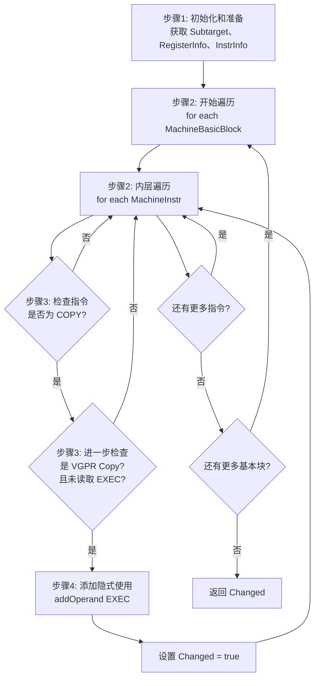

# SIFixVGPRCopies.cpp 代码功能分析

## 1. Pass 的主要功能概述

<a name="ref-block_0"></a>`SIFixVGPRCopies` pass 的主要功能是**为向量寄存器拷贝指令添加隐式的 exec 寄存器使用**。 llvm-project:9-11[<sup>↗</sup>](#block_0) 

**作用和效果：**
- 这个 pass 在寄存器分配之后运行
- 它会扫描所有 VGPR（向量通用寄存器）的拷贝操作
- 为这些拷贝操作添加对 EXEC 寄存器的隐式使用，确保向量操作能够正确地受到 EXEC 掩码的控制

<a name="ref-block_1"></a>这个 pass 保留了所有分析结果，不会破坏之前的优化。 llvm-project:34-37[<sup>↗</sup>](#block_1) 

## 2. 实现的主要步骤和子功能

通过遍历代码文件，我提取出以下主要步骤：

1. **初始化和准备阶段**
2. **遍历机器函数的基本块**
3. **检查和识别 VGPR 拷贝指令**
4. **添加 EXEC 寄存器的隐式使用**

## 3. 各步骤的具体描述和分析

### 步骤 1: 初始化和准备阶段

<a name="ref-block_3"></a>在主运行函数开始时，pass 会获取必要的目标机器信息： llvm-project:68-72[<sup>↗</sup>](#block_3) 

- 获取 `GCNSubtarget`（目标子架构信息）
- 获取 `SIRegisterInfo`（寄存器信息接口）
- 获取 `SIInstrInfo`（指令信息接口）
- 初始化 `Changed` 标志用于追踪是否有修改

这些信息对于后续判断指令类型和操作寄存器至关重要。

### 步骤 2: 遍历机器函数的基本块

<a name="ref-block_4"></a>Pass 采用嵌套循环遍历整个机器函数： llvm-project:74-75[<sup>↗</sup>](#block_4) 

- 外层循环遍历机器函数 `MF` 中的所有基本块 `MBB`
- 内层循环遍历每个基本块中的所有机器指令 `MI`

这种遍历方式确保了 pass 能够检查函数中的每一条指令。

### 步骤 3: 检查和识别 VGPR 拷贝指令

<a name="ref-block_5"></a>对于每条指令，pass 使用 switch 语句检查其操作码： llvm-project:76-78[<sup>↗</sup>](#block_5) 

关键判断条件：
- 指令的操作码必须是 `AMDGPU::COPY`
- 使用 `TII->isVGPRCopy(MI)` 判断是否为 VGPR 拷贝
- 使用 `!MI.readsRegister(AMDGPU::EXEC, TRI)` 检查是否已经读取了 EXEC 寄存器

只有同时满足这三个条件的指令才需要处理。

### 步骤 4: 添加 EXEC 寄存器的隐式使用

<a name="ref-block_6"></a>当识别出需要处理的 VGPR 拷贝指令后，pass 会： llvm-project:79-83[<sup>↗</sup>](#block_6) 

- 调用 `MI.addOperand()` 添加一个新的操作数
- 创建一个表示 EXEC 寄存器的操作数，参数含义：
  - `AMDGPU::EXEC`：EXEC 寄存器
  - `false`：不是定义（def）
  - `true`：是隐式使用（implicit use）
- 打印调试信息（在 DEBUG 模式下）
- 设置 `Changed = true` 标记发生了修改

## 4. 步骤之间的关系

各步骤之间的关系可以用以下流程图表示：



**关系说明：**

1. **顺序依赖关系**：步骤 1 必须在步骤 2-4 之前执行，因为后续步骤需要使用在步骤 1 中获取的目标机器信息。

2. **循环遍历关系**：步骤 2 提供了遍历框架，步骤 3 和 4 在这个框架内对每条指令进行处理。

3. **条件判断关系**：步骤 3 是步骤 4 的前置条件，只有通过步骤 3 的严格筛选，才会执行步骤 4 的修改操作。

4. **数据流关系**：
   - 步骤 1 的输出（TRI、TII）是步骤 3 判断的输入
   - 步骤 3 的判断结果决定是否执行步骤 4
   - 步骤 4 的执行结果影响最终的返回值

## Notes

<a name="ref-block_2"></a>- 该 pass 有两种实现方式：Legacy Pass Manager 版本（`SIFixVGPRCopiesLegacy`）和新的 Pass Manager 版本（`SIFixVGPRCopiesPass`），但它们都调用同一个核心实现类 `SIFixVGPRCopies`。 llvm-project:58-66[<sup>↗</sup>](#block_2) 

- 这个 pass 的设计非常轻量级，只针对特定类型的指令（VGPR COPY）进行修改，对其他指令不做任何处理，因此性能开销很小。

- EXEC 寄存器在 AMDGPU 架构中是执行掩码寄存器，控制哪些 SIMD lane 处于活跃状态。添加隐式使用确保了向量拷贝操作能够正确地遵守当前的执行掩码。
### Citations
<a name="block_0"></a>**File:** llvm/lib/Target/AMDGPU/SIFixVGPRCopies.cpp (L9-11) [<sup>↩</sup>](#ref-block_0)
```cpp
/// \file
/// Add implicit use of exec to vector register copies.
///
```
<a name="block_1"></a>**File:** llvm/lib/Target/AMDGPU/SIFixVGPRCopies.cpp (L34-37) [<sup>↩</sup>](#ref-block_1)
```cpp
  void getAnalysisUsage(AnalysisUsage &AU) const override {
    AU.setPreservesAll();
    MachineFunctionPass::getAnalysisUsage(AU);
  }
```
<a name="block_2"></a>**File:** llvm/lib/Target/AMDGPU/SIFixVGPRCopies.cpp (L58-66) [<sup>↩</sup>](#ref-block_2)
```cpp
PreservedAnalyses SIFixVGPRCopiesPass::run(MachineFunction &MF,
                                           MachineFunctionAnalysisManager &) {
  SIFixVGPRCopies().run(MF);
  return PreservedAnalyses::all();
}

bool SIFixVGPRCopiesLegacy::runOnMachineFunction(MachineFunction &MF) {
  return SIFixVGPRCopies().run(MF);
}
```
<a name="block_3"></a>**File:** llvm/lib/Target/AMDGPU/SIFixVGPRCopies.cpp (L68-72) [<sup>↩</sup>](#ref-block_3)
```cpp
bool SIFixVGPRCopies::run(MachineFunction &MF) {
  const GCNSubtarget &ST = MF.getSubtarget<GCNSubtarget>();
  const SIRegisterInfo *TRI = ST.getRegisterInfo();
  const SIInstrInfo *TII = ST.getInstrInfo();
  bool Changed = false;
```
<a name="block_4"></a>**File:** llvm/lib/Target/AMDGPU/SIFixVGPRCopies.cpp (L74-75) [<sup>↩</sup>](#ref-block_4)
```cpp
  for (MachineBasicBlock &MBB : MF) {
    for (MachineInstr &MI : MBB) {
```
<a name="block_5"></a>**File:** llvm/lib/Target/AMDGPU/SIFixVGPRCopies.cpp (L76-78) [<sup>↩</sup>](#ref-block_5)
```cpp
      switch (MI.getOpcode()) {
      case AMDGPU::COPY:
        if (TII->isVGPRCopy(MI) && !MI.readsRegister(AMDGPU::EXEC, TRI)) {
```
<a name="block_6"></a>**File:** llvm/lib/Target/AMDGPU/SIFixVGPRCopies.cpp (L79-83) [<sup>↩</sup>](#ref-block_6)
```cpp
          MI.addOperand(MF,
                        MachineOperand::CreateReg(AMDGPU::EXEC, false, true));
          LLVM_DEBUG(dbgs() << "Add exec use to " << MI);
          Changed = true;
        }
```