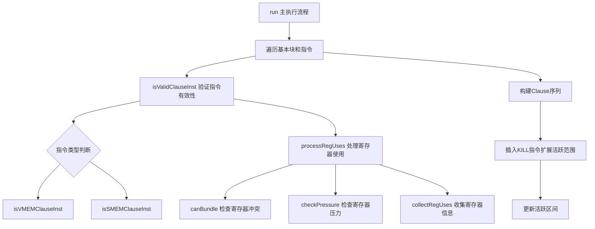

# SIFormMemoryClauses.cpp 代码功能分析

## 1. Pass的主要功能概述

<a name="ref-block_0"></a>**核心作用：** 该Pass用于在启用XNACK时，为AMDGPU目标生成内存子句（memory clauses）。它通过扩展在相邻SMEM和VMEM指令序列中用作指针的寄存器的活跃范围，防止加载指令覆盖指针寄存器，从而避免破坏软子句（soft clause）。 llvm-project:9-13[<sup>↗</sup>](#block_0) 

**主要效果：** 通过在整个软子句中添加隐式定义的early-clobber操作数，人为地延长指针操作数的活跃范围，使得连续的内存访问指令可以被组合成一个clause，提高内存访问效率。 llvm-project:12-13 

**触发条件：** Pass仅在XNACK启用时运行。 llvm-project:264-265 

## 2. 主要功能实现的步骤和子功能

该Pass包含以下核心步骤和子功能：

1. **指令有效性验证** (`isValidClauseInst`)
2. **寄存器冲突检查** (`canBundle`)
3. **寄存器压力检查** (`checkPressure`)
4. **寄存器使用信息收集** (`collectRegUses`)
5. **寄存器使用处理** (`processRegUses`)
6. **主执行流程** (`run`)
7. **辅助判断函数** (`isVMEMClauseInst`, `isSMEMClauseInst`)

## 3. 各步骤和子功能的具体描述分析

### 3.1 指令类型判断函数

<a name="ref-block_2"></a>**`isVMEMClauseInst`：** 判断指令是否为VMEM类型的clause指令。 llvm-project:101-103[<sup>↗</sup>](#block_2) 

<a name="ref-block_3"></a>**`isSMEMClauseInst`：** 判断指令是否为SMEM类型的clause指令。 llvm-project:105-107[<sup>↗</sup>](#block_3) 

### 3.2 指令有效性验证 (`isValidClauseInst`)

该函数验证指令是否可以作为clause的一部分，检查条件包括：
- 指令不能已经被bundled
- 必须是加载指令但不能是存储指令（因为存储指令不定义任何内容，无法设置early-clobber）
- 不能是原子指令
- 必须是相应类型的内存指令（VMEM或SMEM）
<a name="ref-block_4"></a>- 加载结果不能与操作数合并（coalesced） llvm-project:111-133[<sup>↗</sup>](#block_4) 

### 3.3 寄存器冲突检查 (`canBundle`)

该函数检查指令是否可以与已有的clause bundle在一起，主要检查：
- 不能使用帧索引（frame index），因为Prologue/Epilogue插入Pass不处理bundled指令
- 检查指令的操作数与已记录的定义和使用之间是否存在冲突
- 如果操作数是tied的，则不能bundle（因为需要读写同一寄存器）
- 对于物理寄存器，任何冲突都会导致无法bundle
<a name="ref-block_5"></a>- 对于虚拟寄存器，检查lane mask是否有重叠 llvm-project:154-187[<sup>↗</sup>](#block_5) 

### 3.4 寄存器压力检查 (`checkPressure`)

该函数检查将指令bundling到memory clause中是否会导致寄存器压力超限：
- 由于clause中所有定义都会被标记为early-clobber，它们都会保持活跃直到clause结束
- 不调用`advanceBeforeNext()`，因为加载指针即使死亡也不能重用于目标寄存器
<a name="ref-block_6"></a>- 检查是否超过寄存器预算的一半，避免为了形成软clause而引入寄存器溢出 llvm-project:192-220[<sup>↗</sup>](#block_6) 

代码中特别注明了当前压力检查存在的问题：它检查的是全局压力而非特定点的压力，未考虑early-clobber导致的使用操作数活跃性增加，也未考虑SGPR对齐需求和寄存器碎片化。 llvm-project:207-212 

### 3.5 寄存器使用信息收集 (`collectRegUses`)

该函数遍历指令的所有操作数，收集寄存器的定义和使用信息，包括：
- 寄存器编号
- Lane mask（通道掩码）
<a name="ref-block_7"></a>- 操作数状态（implicit、dead、undef、kill、early-clobber等） llvm-project:223-244[<sup>↗</sup>](#block_7) 

### 3.6 寄存器使用处理 (`processRegUses`)

该函数综合前面的检查，判断指令是否可以bundle：
1. 首先调用`canBundle`检查寄存器冲突
2. 然后调用`checkPressure`检查寄存器压力
<a name="ref-block_8"></a>3. 如果两项检查都通过，则调用`collectRegUses`收集该指令的寄存器使用信息 llvm-project:249-260[<sup>↗</sup>](#block_8) 

### 3.7 主执行流程 (`run`)

这是Pass的核心执行逻辑，处理流程如下：

**初始化阶段：**
- 检查XNACK是否启用，未启用则直接返回
- 获取子目标信息、寄存器信息等
- 计算最大可用VGPR和SGPR数量
<a name="ref-block_9"></a>- 获取函数级别的最大clause长度设置 llvm-project:262-277[<sup>↗</sup>](#block_9) 

**遍历基本块：**
- 对每个基本块，初始化寄存器压力追踪器
- 跳过元指令（meta instructions）
<a name="ref-block_10"></a>- 识别有效的clause起始指令（VMEM或SMEM加载指令） llvm-project:279-306[<sup>↗</sup>](#block_10) 

**构建Clause：**
- 从有效的起始指令开始，尝试将后续相同类型的内存指令加入clause
- 受限于最大clause长度（默认15条指令，避免计数器溢出导致停顿）
- 每条指令都需要通过`processRegUses`检查
<a name="ref-block_11"></a>- 如果发现指针在bundle内被加载后使用，会被`processRegUses`拒绝 llvm-project:308-330[<sup>↗</sup>](#block_11) 

<a name="ref-block_1"></a>最大clause长度限制的原因是超过15条指令会导致计数器溢出和停顿。 llvm-project:27-31[<sup>↗</sup>](#block_1) 

**插入KILL指令：**
- 对于clause中使用的寄存器，如果其活跃范围不超过clause末尾，插入KILL指令来扩展活跃范围
- 对于有子寄存器范围的寄存器，只为被杀死的lanes插入KILL操作数
<a name="ref-block_12"></a>- 通过覆盖子寄存器索引来处理复杂的lane mask llvm-project:342-393[<sup>↗</sup>](#block_12) 

**更新活跃区间：**
- 移除并重新计算所有涉及的寄存器的活跃区间
<a name="ref-block_13"></a>- 先处理定义的寄存器，再处理使用的寄存器 llvm-project:401-416[<sup>↗</sup>](#block_13) 

## 4. 步骤和子功能之间的关系

整个Pass的功能层次关系如下：



**调用关系说明：**

1. **`run` 是顶层函数**，负责遍历所有基本块和指令
2. **指令验证层**：`run` 调用 `isValidClauseInst` 验证每条指令，后者依赖 `isVMEMClauseInst` 和 `isSMEMClauseInst` 判断指令类型
3. **寄存器分析层**：对每条候选指令，`run` 调用 `processRegUses`，该函数依次调用：
   - `canBundle`：检查是否存在寄存器冲突
   - `checkPressure`：检查寄存器压力是否可接受
   - `collectRegUses`：收集该指令的寄存器使用信息
4. **Clause构建层**：`run` 循环调用验证和分析函数，逐步扩展clause长度
5. **活跃范围扩展层**：确定clause后，插入KILL指令并更新LiveIntervals

**数据流动关系：**
- `collectRegUses` 收集的 `Defs` 和 `Uses` 映射表在clause构建过程中不断累积
- 这些映射表被 `canBundle` 用于检测冲突
- 寄存器压力追踪器（`GCNDownwardRPTracker`）在整个过程中维护压力状态
- 最终的 `Defs` 和 `Uses` 信息用于插入KILL指令和更新活跃区间

## Notes

该Pass是AMDGPU后端的一个关键优化Pass，专门针对启用了XNACK（页面故障处理）特性的情况。XNACK要求在内存访问期间保护指针寄存器不被覆盖，因此需要特殊处理。

Pass的设计考虑了多个约束：
- **硬件限制**：clause长度不能超过15条指令
- **寄存器压力**：避免因过度延长活跃范围导致寄存器溢出
- **语义正确性**：确保不会在clause内部产生读写冲突

当前实现中的寄存器压力检查被标注为存在根本性问题（fundamentally broken），这可能是未来需要改进的地方。 llvm-project:207-212
### Citations
<a name="block_0"></a>**File:** llvm/lib/Target/AMDGPU/SIFormMemoryClauses.cpp (L9-13) [<sup>↩</sup>](#ref-block_0)
```cpp
/// \file This pass extends the live ranges of registers used as pointers in
/// sequences of adjacent SMEM and VMEM instructions if XNACK is enabled. A
/// load that would overwrite a pointer would require breaking the soft clause.
/// Artificially extend the live ranges of the pointer operands by adding
/// implicit-def early-clobber operands throughout the soft clause.
```
<a name="block_1"></a>**File:** llvm/lib/Target/AMDGPU/SIFormMemoryClauses.cpp (L27-31) [<sup>↩</sup>](#ref-block_1)
```cpp
// Clauses longer then 15 instructions would overflow one of the counters
// and stall. They can stall even earlier if there are outstanding counters.
static cl::opt<unsigned>
MaxClause("amdgpu-max-memory-clause", cl::Hidden, cl::init(15),
          cl::desc("Maximum length of a memory clause, instructions"));
```
<a name="block_2"></a>**File:** llvm/lib/Target/AMDGPU/SIFormMemoryClauses.cpp (L101-103) [<sup>↩</sup>](#ref-block_2)
```cpp
static bool isVMEMClauseInst(const MachineInstr &MI) {
  return SIInstrInfo::isVMEM(MI);
}
```
<a name="block_3"></a>**File:** llvm/lib/Target/AMDGPU/SIFormMemoryClauses.cpp (L105-107) [<sup>↩</sup>](#ref-block_3)
```cpp
static bool isSMEMClauseInst(const MachineInstr &MI) {
  return SIInstrInfo::isSMRD(MI);
}
```
<a name="block_4"></a>**File:** llvm/lib/Target/AMDGPU/SIFormMemoryClauses.cpp (L111-133) [<sup>↩</sup>](#ref-block_4)
```cpp
static bool isValidClauseInst(const MachineInstr &MI, bool IsVMEMClause) {
  assert(!MI.isDebugInstr() && "debug instructions should not reach here");
  if (MI.isBundled())
    return false;
  if (!MI.mayLoad() || MI.mayStore())
    return false;
  if (SIInstrInfo::isAtomic(MI))
    return false;
  if (IsVMEMClause && !isVMEMClauseInst(MI))
    return false;
  if (!IsVMEMClause && !isSMEMClauseInst(MI))
    return false;
  // If this is a load instruction where the result has been coalesced with an operand, then we cannot clause it.
  for (const MachineOperand &ResMO : MI.defs()) {
    Register ResReg = ResMO.getReg();
    for (const MachineOperand &MO : MI.all_uses()) {
      if (MO.getReg() == ResReg)
        return false;
    }
    break; // Only check the first def.
  }
  return true;
}
```
<a name="block_5"></a>**File:** llvm/lib/Target/AMDGPU/SIFormMemoryClauses.cpp (L154-187) [<sup>↩</sup>](#ref-block_5)
```cpp
bool SIFormMemoryClausesImpl::canBundle(const MachineInstr &MI,
                                        const RegUse &Defs,
                                        const RegUse &Uses) const {
  // Check interference with defs.
  for (const MachineOperand &MO : MI.operands()) {
    // TODO: Prologue/Epilogue Insertion pass does not process bundled
    //       instructions.
    if (MO.isFI())
      return false;

    if (!MO.isReg())
      continue;

    Register Reg = MO.getReg();

    // If it is tied we will need to write same register as we read.
    if (MO.isTied())
      return false;

    const RegUse &Map = MO.isDef() ? Uses : Defs;
    auto Conflict = Map.find(Reg);
    if (Conflict == Map.end())
      continue;

    if (Reg.isPhysical())
      return false;

    LaneBitmask Mask = TRI->getSubRegIndexLaneMask(MO.getSubReg());
    if ((Conflict->second.second & Mask).any())
      return false;
  }

  return true;
}
```
<a name="block_6"></a>**File:** llvm/lib/Target/AMDGPU/SIFormMemoryClauses.cpp (L192-220) [<sup>↩</sup>](#ref-block_6)
```cpp
bool SIFormMemoryClausesImpl::checkPressure(const MachineInstr &MI,
                                            GCNDownwardRPTracker &RPT) {
  // NB: skip advanceBeforeNext() call. Since all defs will be marked
  // early-clobber they will all stay alive at least to the end of the
  // clause. Therefor we should not decrease pressure even if load
  // pointer becomes dead and could otherwise be reused for destination.
  RPT.advanceToNext();
  GCNRegPressure MaxPressure = RPT.moveMaxPressure();
  unsigned Occupancy = MaxPressure.getOccupancy(
      *ST,
      MI.getMF()->getInfo<SIMachineFunctionInfo>()->getDynamicVGPRBlockSize());

  // Don't push over half the register budget. We don't want to introduce
  // spilling just to form a soft clause.
  //
  // FIXME: This pressure check is fundamentally broken. First, this is checking
  // the global pressure, not the pressure at this specific point in the
  // program. Second, it's not accounting for the increased liveness of the use
  // operands due to the early clobber we will introduce. Third, the pressure
  // tracking does not account for the alignment requirements for SGPRs, or the
  // fragmentation of registers the allocator will need to satisfy.
  if (Occupancy >= MFI->getMinAllowedOccupancy() &&
      MaxPressure.getVGPRNum(ST->hasGFX90AInsts()) <= MaxVGPRs / 2 &&
      MaxPressure.getSGPRNum() <= MaxSGPRs / 2) {
    LastRecordedOccupancy = Occupancy;
    return true;
  }
  return false;
}
```
<a name="block_7"></a>**File:** llvm/lib/Target/AMDGPU/SIFormMemoryClauses.cpp (L223-244) [<sup>↩</sup>](#ref-block_7)
```cpp
void SIFormMemoryClausesImpl::collectRegUses(const MachineInstr &MI,
                                             RegUse &Defs, RegUse &Uses) const {
  for (const MachineOperand &MO : MI.operands()) {
    if (!MO.isReg())
      continue;
    Register Reg = MO.getReg();
    if (!Reg)
      continue;

    LaneBitmask Mask = Reg.isVirtual()
                           ? TRI->getSubRegIndexLaneMask(MO.getSubReg())
                           : LaneBitmask::getAll();
    RegUse &Map = MO.isDef() ? Defs : Uses;

    unsigned State = getMopState(MO);
    auto [Loc, Inserted] = Map.try_emplace(Reg, State, Mask);
    if (!Inserted) {
      Loc->second.first |= State;
      Loc->second.second |= Mask;
    }
  }
}
```
<a name="block_8"></a>**File:** llvm/lib/Target/AMDGPU/SIFormMemoryClauses.cpp (L249-260) [<sup>↩</sup>](#ref-block_8)
```cpp
bool SIFormMemoryClausesImpl::processRegUses(const MachineInstr &MI,
                                             RegUse &Defs, RegUse &Uses,
                                             GCNDownwardRPTracker &RPT) {
  if (!canBundle(MI, Defs, Uses))
    return false;

  if (!checkPressure(MI, RPT))
    return false;

  collectRegUses(MI, Defs, Uses);
  return true;
}
```
<a name="block_9"></a>**File:** llvm/lib/Target/AMDGPU/SIFormMemoryClauses.cpp (L262-277) [<sup>↩</sup>](#ref-block_9)
```cpp
bool SIFormMemoryClausesImpl::run(MachineFunction &MF) {
  ST = &MF.getSubtarget<GCNSubtarget>();
  if (!ST->isXNACKEnabled())
    return false;

  const SIInstrInfo *TII = ST->getInstrInfo();
  TRI = ST->getRegisterInfo();
  MRI = &MF.getRegInfo();
  MFI = MF.getInfo<SIMachineFunctionInfo>();
  SlotIndexes *Ind = LIS->getSlotIndexes();
  bool Changed = false;

  MaxVGPRs = TRI->getAllocatableSet(MF, &AMDGPU::VGPR_32RegClass).count();
  MaxSGPRs = TRI->getAllocatableSet(MF, &AMDGPU::SGPR_32RegClass).count();
  unsigned FuncMaxClause = MF.getFunction().getFnAttributeAsParsedInteger(
      "amdgpu-max-memory-clause", MaxClause);
```
<a name="block_10"></a>**File:** llvm/lib/Target/AMDGPU/SIFormMemoryClauses.cpp (L279-306) [<sup>↩</sup>](#ref-block_10)
```cpp
  for (MachineBasicBlock &MBB : MF) {
    GCNDownwardRPTracker RPT(*LIS);
    MachineBasicBlock::instr_iterator Next;
    for (auto I = MBB.instr_begin(), E = MBB.instr_end(); I != E; I = Next) {
      MachineInstr &MI = *I;
      Next = std::next(I);

      if (MI.isMetaInstruction())
        continue;

      bool IsVMEM = isVMEMClauseInst(MI);

      if (!isValidClauseInst(MI, IsVMEM))
        continue;

      if (!RPT.getNext().isValid())
        RPT.reset(MI);
      else { // Advance the state to the current MI.
        RPT.advance(MachineBasicBlock::const_iterator(MI));
        RPT.advanceBeforeNext();
      }

      const GCNRPTracker::LiveRegSet LiveRegsCopy(RPT.getLiveRegs());
      RegUse Defs, Uses;
      if (!processRegUses(MI, Defs, Uses, RPT)) {
        RPT.reset(MI, &LiveRegsCopy);
        continue;
      }
```
<a name="block_11"></a>**File:** llvm/lib/Target/AMDGPU/SIFormMemoryClauses.cpp (L308-330) [<sup>↩</sup>](#ref-block_11)
```cpp
      MachineBasicBlock::iterator LastClauseInst = Next;
      unsigned Length = 1;
      for ( ; Next != E && Length < FuncMaxClause; ++Next) {
        // Debug instructions should not change the kill insertion.
        if (Next->isMetaInstruction())
          continue;

        if (!isValidClauseInst(*Next, IsVMEM))
          break;

        // A load from pointer which was loaded inside the same bundle is an
        // impossible clause because we will need to write and read the same
        // register inside. In this case processRegUses will return false.
        if (!processRegUses(*Next, Defs, Uses, RPT))
          break;

        LastClauseInst = Next;
        ++Length;
      }
      if (Length < 2) {
        RPT.reset(MI, &LiveRegsCopy);
        continue;
      }
```
<a name="block_12"></a>**File:** llvm/lib/Target/AMDGPU/SIFormMemoryClauses.cpp (L342-393) [<sup>↩</sup>](#ref-block_12)
```cpp
      MachineInstrBuilder Kill;

      // Insert one kill per register, with operands covering all necessary
      // subregisters.
      for (auto &&R : Uses) {
        Register Reg = R.first;
        if (Reg.isPhysical())
          continue;

        // Collect the register operands we should extend the live ranges of.
        SmallVector<std::tuple<unsigned, unsigned>> KillOps;
        const LiveInterval &LI = LIS->getInterval(R.first);

        if (!LI.hasSubRanges()) {
          if (!LI.liveAt(ClauseLiveOutIdx)) {
            KillOps.emplace_back(R.second.first | RegState::Kill,
                                 AMDGPU::NoSubRegister);
          }
        } else {
          LaneBitmask KilledMask;
          for (const LiveInterval::SubRange &SR : LI.subranges()) {
            if (SR.liveAt(ClauseLiveInIdx) && !SR.liveAt(ClauseLiveOutIdx))
              KilledMask |= SR.LaneMask;
          }

          if (KilledMask.none())
            continue;

          SmallVector<unsigned> KilledIndexes;
          bool Success = TRI->getCoveringSubRegIndexes(
              MRI->getRegClass(Reg), KilledMask, KilledIndexes);
          (void)Success;
          assert(Success && "Failed to find subregister mask to cover lanes");
          for (unsigned SubReg : KilledIndexes) {
            KillOps.emplace_back(R.second.first | RegState::Kill, SubReg);
          }
        }

        if (KillOps.empty())
          continue;

        // We only want to extend the live ranges of used registers. If they
        // already have existing uses beyond the bundle, we don't need the kill.
        //
        // It's possible all of the use registers were already live past the
        // bundle.
        Kill = BuildMI(*MI.getParent(), std::next(LastClauseInst),
                       DebugLoc(), TII->get(AMDGPU::KILL));
        for (auto &Op : KillOps)
          Kill.addUse(Reg, std::get<0>(Op), std::get<1>(Op));
        Ind->insertMachineInstrInMaps(*Kill);
      }
```
<a name="block_13"></a>**File:** llvm/lib/Target/AMDGPU/SIFormMemoryClauses.cpp (L401-416) [<sup>↩</sup>](#ref-block_13)
```cpp
      for (auto &&R : Defs) {
        Register Reg = R.first;
        Uses.erase(Reg);
        if (Reg.isPhysical())
          continue;
        LIS->removeInterval(Reg);
        LIS->createAndComputeVirtRegInterval(Reg);
      }

      for (auto &&R : Uses) {
        Register Reg = R.first;
        if (Reg.isPhysical())
          continue;
        LIS->removeInterval(Reg);
        LIS->createAndComputeVirtRegInterval(Reg);
      }
```