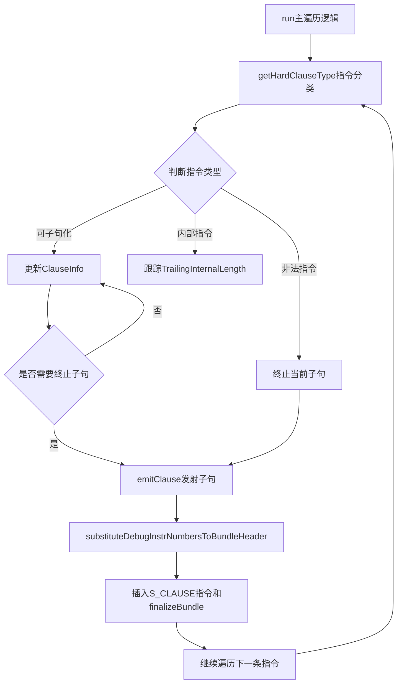

# SIInsertHardClauses.cpp 代码功能详解

## 1. Pass的主要功能概括

<a name="ref-block_0"></a>**SIInsertHardClauses** 是一个针对AMD GPU（AMDGPU）后端的机器函数Pass，其核心作用是**插入 `s_clause` 指令来标记"硬子句"（hard clauses）的起始位置**。 llvm-project:10-11[<sup>↗</sup>](#block_0) 

**作用和效果：**
- 将相似的内存指令聚合成子句，可以带来缓存一致性方面的性能优势 llvm-project:12-13 
- 在GFX10之前，硬件会自动检测"软子句"（soft clauses），但GFX10移除了这个自动检测功能，引入了显式的 `s_clause` 指令来标记"硬子句" llvm-project:13-16 
<a name="ref-block_2"></a>- 该Pass的任务是在调度器已经将相似内存指令放在一起后，插入 `s_clause` 指令标记每个子句的开始 llvm-project:18-20[<sup>↗</sup>](#block_2) 

## 2. 主要功能步骤和子功能提取

通过分析代码，可以提取以下主要步骤和子功能：

### 2.1 **指令类型分类** (`getHardClauseType`)
### 2.2 **子句信息跟踪** (`ClauseInfo` 结构体)
### 2.3 **子句发射** (`emitClause`)
### 2.4 **调试信息处理** (`substituteDebugInstrNumbersToBundleHeader`)
### 2.5 **主遍历逻辑** (`run` 方法)

## 3. 各步骤/子功能的具体描述分析

### 3.1 指令类型分类 (`getHardClauseType`)

<a name="ref-block_7"></a>此函数根据指令的特性将其分类为不同的硬子句类型。 llvm-project:103-157[<sup>↗</sup>](#block_7) 

**功能细节：**
<a name="ref-block_4"></a>- **GFX10架构**：区分 `HARDCLAUSE_VMEM`（纹理、缓冲区、全局或暂存内存指令）和 `HARDCLAUSE_FLAT`（扁平内存指令） llvm-project:54-59[<sup>↗</sup>](#block_4) 
- **GFX11及以上架构**：更细粒度的分类，包括：
  - MIMG类型：`HARDCLAUSE_MIMG_LOAD/STORE/ATOMIC/SAMPLE`
  - VMEM类型：`HARDCLAUSE_VMEM_LOAD/STORE/ATOMIC`
  - FLAT类型：`HARDCLAUSE_FLAT_LOAD/STORE/ATOMIC`
<a name="ref-block_5"></a>  - BVH指令：`HARDCLAUSE_BVH` llvm-project:61-77[<sup>↗</sup>](#block_5) 
- **特殊处理**：
  - `s_nop` 指令被标记为内部指令，可以出现在子句中间 llvm-project:152-153 
  - 元指令被忽略 llvm-project:154-155 
<a name="ref-block_6"></a>  - 其他指令（如SALU、export、分支等）被标记为非法，会中断子句 llvm-project:94-96[<sup>↗</sup>](#block_6) 

### 3.2 子句信息跟踪 (`ClauseInfo`)

<a name="ref-block_8"></a>`ClauseInfo` 结构体用于在遍历指令时跟踪当前正在构建的子句的状态信息。 llvm-project:160-176[<sup>↗</sup>](#block_8) 

**包含的字段：**
- `Type`：子句中所有非内部指令的类型
- `First`：子句中的第一条（非内部）指令
- `Last`：子句中的最后一条非内部指令
- `Length`：子句的长度，包括中间的内部指令
- `TrailingInternalLength`：子句末尾的内部指令数量（在添加新内存指令前不计入长度）
- `BaseOps`：最后一条指令的基址操作数

### 3.3 子句发射 (`emitClause`)

<a name="ref-block_10"></a>当确定一个完整的子句后，此函数负责插入 `s_clause` 指令并创建指令束（bundle）。 llvm-project:207-234[<sup>↗</sup>](#block_10) 

**处理步骤：**
1. 检查子句是否有效（至少包含两条指令） llvm-project:208-209 
2. 将调试指令移到束之前 llvm-project:215-225 
3. 插入 `S_CLAUSE` 指令，立即数为子句长度减1 llvm-project:226-228 
4. 使用 `finalizeBundle` 将子句中的指令组成一个束 llvm-project:229-230 
5. 如果需要，处理调试信息替换 llvm-project:231-232 

### 3.4 调试信息处理 (`substituteDebugInstrNumbersToBundleHeader`)

<a name="ref-block_9"></a>此函数处理束内指令的调试信息，将定义的寄存器的调试指令编号映射到束头。 llvm-project:178-205[<sup>↗</sup>](#block_9) 

**工作原理：**
1. 创建束内定义寄存器到其调试指令编号和操作数的映射 llvm-project:184-189 
2. 遍历束头的定义操作数，为束内定义的寄存器创建调试值替换 llvm-project:191-204 

### 3.5 主遍历逻辑 (`run`)

<a name="ref-block_11"></a>这是Pass的核心执行逻辑，遍历所有基本块和指令，识别并构建硬子句。 llvm-project:236-314[<sup>↗</sup>](#block_11) 

**执行流程：**

1. **初始化和前置检查**：
   - 检查目标架构是否支持硬子句 llvm-project:237-239 
   - 确定最大子句长度限制（从函数属性或命令行选项获取） llvm-project:241-247 

2. **遍历基本块和指令**：
   对每个基本块，维护一个 `ClauseInfo` 对象来跟踪当前子句 llvm-project:253-255 

3. **指令处理逻辑**：
   - 获取指令的硬子句类型 llvm-project:256-256 
   - 提取基址操作数用于后续的聚类判断 llvm-project:258-269 

4. **子句终止判断**：
   当遇到以下情况时终止当前子句：
   - 达到最大子句长度
   - 指令类型不匹配
   - 内存操作不应该被聚类在一起（通过 `shouldClusterMemOps` 判断） llvm-project:271-287 

5. **子句扩展或创建**：
   - 如果当前已有子句，根据指令类型扩展或终止 llvm-project:289-301 
   - 如果是新的可子句化指令，开始新子句 llvm-project:302-305 

6. **基本块结束处理**：
   在基本块末尾发射最后一个子句（如果存在） llvm-project:308-310 

## 4. 步骤/子功能之间的关系



**关系说明：**

1. **`run` 是核心调度者**：协调整个Pass的执行流程，遍历所有指令并管理子句的生命周期

2. **`getHardClauseType` 是决策依据**：为每条指令提供分类信息，是子句构建的基础

3. **`ClauseInfo` 是状态维护者**：在遍历过程中持续跟踪当前子句的状态，包括长度、类型、首尾指令等

4. **`emitClause` 是执行者**：当确定一个完整子句后，负责实际插入 `s_clause` 指令并创建指令束

5. **`substituteDebugInstrNumbersToBundleHeader` 是辅助功能**：确保调试信息在指令束化后仍然正确，支持调试器的正常工作

**数据流向：**
`run` → `getHardClauseType` → `ClauseInfo`（状态更新） → `emitClause` → `substituteDebugInstrNumbersToBundleHeader` → 完成子句插入

## Notes

- 该Pass运行在寄存器分配之后，因此不需要像调度器那样考虑寄存器压力限制 llvm-project:276-280 
<a name="ref-block_3"></a>- 硬子句与XNACK启用时的可重启组在逻辑上是不同的，规则略有差异。例如 `s_nop` 会中断可重启组，但可以出现在硬子句中间 llvm-project:22-27[<sup>↗</sup>](#block_3) 
- GFX10存在一个NSA子句bug，需要特殊处理 llvm-project:108-112 
- 代码中明确指出不形成VALU子句，因为其收益不明确 llvm-project:148-148
### Citations
<a name="block_0"></a>**File:** llvm/lib/Target/AMDGPU/SIInsertHardClauses.cpp (L10-11) [<sup>↩</sup>](#ref-block_0)
```cpp
/// Insert s_clause instructions to form hard clauses.
///
```
<a name="block_1"></a>**File:** llvm/lib/Target/AMDGPU/SIInsertHardClauses.cpp (L12-16)
```cpp
/// Clausing load instructions can give cache coherency benefits. Before gfx10,
/// the hardware automatically detected "soft clauses", which were sequences of
/// memory instructions of the same type. In gfx10 this detection was removed,
/// and the s_clause instruction was introduced to explicitly mark "hard
/// clauses".
```
<a name="block_2"></a>**File:** llvm/lib/Target/AMDGPU/SIInsertHardClauses.cpp (L18-20) [<sup>↩</sup>](#ref-block_2)
```cpp
/// It's the scheduler's job to form the clauses by putting similar memory
/// instructions next to each other. Our job is just to insert an s_clause
/// instruction to mark the start of each clause.
```
<a name="block_3"></a>**File:** llvm/lib/Target/AMDGPU/SIInsertHardClauses.cpp (L22-27) [<sup>↩</sup>](#ref-block_3)
```cpp
/// Note that hard clauses are very similar to, but logically distinct from, the
/// groups of instructions that have to be restartable when XNACK is enabled.
/// The rules are slightly different in each case. For example an s_nop
/// instruction breaks a restartable group, but can appear in the middle of a
/// hard clause. (Before gfx10 there wasn't a distinction, and both were called
/// "soft clauses" or just "clauses".)
```
<a name="block_4"></a>**File:** llvm/lib/Target/AMDGPU/SIInsertHardClauses.cpp (L54-59) [<sup>↩</sup>](#ref-block_4)
```cpp
  // For GFX10:

  // Texture, buffer, global or scratch memory instructions.
  HARDCLAUSE_VMEM,
  // Flat (not global or scratch) memory instructions.
  HARDCLAUSE_FLAT,
```
<a name="block_5"></a>**File:** llvm/lib/Target/AMDGPU/SIInsertHardClauses.cpp (L61-77) [<sup>↩</sup>](#ref-block_5)
```cpp
  // For GFX11:

  // Texture memory instructions.
  HARDCLAUSE_MIMG_LOAD,
  HARDCLAUSE_MIMG_STORE,
  HARDCLAUSE_MIMG_ATOMIC,
  HARDCLAUSE_MIMG_SAMPLE,
  // Buffer, global or scratch memory instructions.
  HARDCLAUSE_VMEM_LOAD,
  HARDCLAUSE_VMEM_STORE,
  HARDCLAUSE_VMEM_ATOMIC,
  // Flat (not global or scratch) memory instructions.
  HARDCLAUSE_FLAT_LOAD,
  HARDCLAUSE_FLAT_STORE,
  HARDCLAUSE_FLAT_ATOMIC,
  // BVH instructions.
  HARDCLAUSE_BVH,
```
<a name="block_6"></a>**File:** llvm/lib/Target/AMDGPU/SIInsertHardClauses.cpp (L94-96) [<sup>↩</sup>](#ref-block_6)
```cpp
  // Instructions that are not allowed in a hard clause: SALU, export, branch,
  // message, GDS, s_waitcnt and anything else not mentioned above.
  HARDCLAUSE_ILLEGAL,
```
<a name="block_7"></a>**File:** llvm/lib/Target/AMDGPU/SIInsertHardClauses.cpp (L103-157) [<sup>↩</sup>](#ref-block_7)
```cpp
  HardClauseType getHardClauseType(const MachineInstr &MI) {
    if (MI.mayLoad() || (MI.mayStore() && ST->shouldClusterStores())) {
      if (ST->getGeneration() == AMDGPUSubtarget::GFX10) {
        if ((SIInstrInfo::isVMEM(MI) && !SIInstrInfo::isFLAT(MI)) ||
            SIInstrInfo::isSegmentSpecificFLAT(MI)) {
          if (ST->hasNSAClauseBug()) {
            const AMDGPU::MIMGInfo *Info = AMDGPU::getMIMGInfo(MI.getOpcode());
            if (Info && Info->MIMGEncoding == AMDGPU::MIMGEncGfx10NSA)
              return HARDCLAUSE_ILLEGAL;
          }
          return HARDCLAUSE_VMEM;
        }
        if (SIInstrInfo::isFLAT(MI))
          return HARDCLAUSE_FLAT;
      } else {
        assert(ST->getGeneration() >= AMDGPUSubtarget::GFX11);
        if (SIInstrInfo::isMIMG(MI)) {
          const AMDGPU::MIMGInfo *Info = AMDGPU::getMIMGInfo(MI.getOpcode());
          const AMDGPU::MIMGBaseOpcodeInfo *BaseInfo =
              AMDGPU::getMIMGBaseOpcodeInfo(Info->BaseOpcode);
          if (BaseInfo->BVH)
            return HARDCLAUSE_BVH;
          if (BaseInfo->Sampler || BaseInfo->MSAA)
            return HARDCLAUSE_MIMG_SAMPLE;
          return MI.mayLoad() ? MI.mayStore() ? HARDCLAUSE_MIMG_ATOMIC
                                              : HARDCLAUSE_MIMG_LOAD
                              : HARDCLAUSE_MIMG_STORE;
        }
        if ((SIInstrInfo::isVMEM(MI) && !SIInstrInfo::isFLAT(MI)) ||
            SIInstrInfo::isSegmentSpecificFLAT(MI)) {
          return MI.mayLoad() ? MI.mayStore() ? HARDCLAUSE_VMEM_ATOMIC
                                              : HARDCLAUSE_VMEM_LOAD
                              : HARDCLAUSE_VMEM_STORE;
        }
        if (SIInstrInfo::isFLAT(MI)) {
          return MI.mayLoad() ? MI.mayStore() ? HARDCLAUSE_FLAT_ATOMIC
                                              : HARDCLAUSE_FLAT_LOAD
                              : HARDCLAUSE_FLAT_STORE;
        }
      }
      // TODO: LDS
      if (SIInstrInfo::isSMRD(MI))
        return HARDCLAUSE_SMEM;
    }

    // Don't form VALU clauses. It's not clear what benefit they give, if any.

    // In practice s_nop is the only internal instruction we're likely to see.
    // It's safe to treat the rest as illegal.
    if (MI.getOpcode() == AMDGPU::S_NOP)
      return HARDCLAUSE_INTERNAL;
    if (MI.isMetaInstruction())
      return HARDCLAUSE_IGNORE;
    return HARDCLAUSE_ILLEGAL;
  }
```
<a name="block_8"></a>**File:** llvm/lib/Target/AMDGPU/SIInsertHardClauses.cpp (L160-176) [<sup>↩</sup>](#ref-block_8)
```cpp
  struct ClauseInfo {
    // The type of all (non-internal) instructions in the clause.
    HardClauseType Type = HARDCLAUSE_ILLEGAL;
    // The first (necessarily non-internal) instruction in the clause.
    MachineInstr *First = nullptr;
    // The last non-internal instruction in the clause.
    MachineInstr *Last = nullptr;
    // The length of the clause including any internal instructions in the
    // middle (but not at the end) of the clause.
    unsigned Length = 0;
    // Internal instructions at the and of a clause should not be included in
    // the clause. Count them in TrailingInternalLength until a new memory
    // instruction is added.
    unsigned TrailingInternalLength = 0;
    // The base operands of *Last.
    SmallVector<const MachineOperand *, 4> BaseOps;
  };
```
<a name="block_9"></a>**File:** llvm/lib/Target/AMDGPU/SIInsertHardClauses.cpp (L178-205) [<sup>↩</sup>](#ref-block_9)
```cpp
  void substituteDebugInstrNumbersToBundleHeader(MachineInstr &FirstInBundle) {
    auto *MBB = FirstInBundle.getParent();
    auto *MF = MBB->getParent();

    // Make a map from registers defined within the bundle to their defining
    // debug instruction number and operand.
    DenseMap<Register, std::pair<unsigned, unsigned>> RegDefs;
    for (const MachineOperand &Op : const_mi_bundle_ops(FirstInBundle)) {
      const MachineInstr &MI = *Op.getParent();
      if (!MI.isBundle() && Op.isReg() && Op.isDef())
        RegDefs[Op.getReg()] = {MI.peekDebugInstrNum(), Op.getOperandNo()};
    }

    MachineInstr &BundleHeader = *std::prev(FirstInBundle.getIterator());
    for (const MachineOperand &HeaderOp : BundleHeader.operands()) {
      if (!HeaderOp.isReg() || !HeaderOp.isDef() || HeaderOp.isDead())
        continue;
      auto It = RegDefs.find(HeaderOp.getReg());
      if (It == RegDefs.end())
        continue;
      auto [DINum, OpNum] = It->second;
      if (DINum == 0)
        continue;
      MF->makeDebugValueSubstitution(
          {DINum, OpNum},
          {BundleHeader.getDebugInstrNum(), HeaderOp.getOperandNo()});
    }
  }
```
<a name="block_10"></a>**File:** llvm/lib/Target/AMDGPU/SIInsertHardClauses.cpp (L207-234) [<sup>↩</sup>](#ref-block_10)
```cpp
  bool emitClause(const ClauseInfo &CI, const SIInstrInfo *SII) {
    if (CI.First == CI.Last)
      return false;
    assert(CI.Length <= ST->maxHardClauseLength() &&
           "Hard clause is too long!");

    auto &MBB = *CI.First->getParent();
    bool NeedDebugSubs = false;
    // Move debug instructions before the bundle and check if debug
    // substitutions need to be added to the bundle header.
    for (auto It = CI.First->getIterator(),
              E = std::next(CI.Last->getIterator());
         It != E;) {
      auto MI = It++;
      if (MI->isDebugInstr())
        MBB.splice(CI.First, &MBB, MI);
      else if (MI->peekDebugInstrNum() != 0)
        NeedDebugSubs = true;
    }
    auto ClauseMI =
        BuildMI(MBB, *CI.First, DebugLoc(), SII->get(AMDGPU::S_CLAUSE))
            .addImm(CI.Length - 1);
    finalizeBundle(MBB, ClauseMI->getIterator(),
                   std::next(CI.Last->getIterator()));
    if (NeedDebugSubs)
      substituteDebugInstrNumbersToBundleHeader(*ClauseMI);
    return true;
  }
```
<a name="block_11"></a>**File:** llvm/lib/Target/AMDGPU/SIInsertHardClauses.cpp (L236-314) [<sup>↩</sup>](#ref-block_11)
```cpp
  bool run(MachineFunction &MF) {
    ST = &MF.getSubtarget<GCNSubtarget>();
    if (!ST->hasHardClauses())
      return false;

    unsigned MaxClauseLength = MF.getFunction().getFnAttributeAsParsedInteger(
        "amdgpu-hard-clause-length-limit", 255);
    if (HardClauseLengthLimit.getNumOccurrences())
      MaxClauseLength = HardClauseLengthLimit;
    MaxClauseLength = std::min(MaxClauseLength, ST->maxHardClauseLength());
    if (MaxClauseLength <= 1)
      return false;

    const SIInstrInfo *SII = ST->getInstrInfo();
    const TargetRegisterInfo *TRI = ST->getRegisterInfo();

    bool Changed = false;
    for (auto &MBB : MF) {
      ClauseInfo CI;
      for (auto &MI : MBB) {
        HardClauseType Type = getHardClauseType(MI);

        int64_t Dummy1;
        bool Dummy2;
        LocationSize Dummy3 = LocationSize::precise(0);
        SmallVector<const MachineOperand *, 4> BaseOps;
        if (Type <= LAST_REAL_HARDCLAUSE_TYPE) {
          if (!SII->getMemOperandsWithOffsetWidth(MI, BaseOps, Dummy1, Dummy2,
                                                  Dummy3, TRI)) {
            // We failed to get the base operands, so we'll never clause this
            // instruction with any other, so pretend it's illegal.
            Type = HARDCLAUSE_ILLEGAL;
          }
        }

        if (CI.Length == MaxClauseLength ||
            (CI.Length && Type != HARDCLAUSE_INTERNAL &&
             Type != HARDCLAUSE_IGNORE &&
             (Type != CI.Type ||
              // Note that we lie to shouldClusterMemOps about the size of the
              // cluster. When shouldClusterMemOps is called from the machine
              // scheduler it limits the size of the cluster to avoid increasing
              // register pressure too much, but this pass runs after register
              // allocation so there is no need for that kind of limit.
              // We also lie about the Offset and OffsetIsScalable parameters,
              // as they aren't used in the SIInstrInfo implementation.
              !SII->shouldClusterMemOps(CI.BaseOps, 0, false, BaseOps, 0, false,
                                        2, 2)))) {
          // Finish the current clause.
          Changed |= emitClause(CI, SII);
          CI = ClauseInfo();
        }

        if (CI.Length) {
          // Extend the current clause.
          if (Type != HARDCLAUSE_IGNORE) {
            if (Type == HARDCLAUSE_INTERNAL) {
              ++CI.TrailingInternalLength;
            } else {
              ++CI.Length;
              CI.Length += CI.TrailingInternalLength;
              CI.TrailingInternalLength = 0;
              CI.Last = &MI;
              CI.BaseOps = std::move(BaseOps);
            }
          }
        } else if (Type <= LAST_REAL_HARDCLAUSE_TYPE) {
          // Start a new clause.
          CI = ClauseInfo{Type, &MI, &MI, 1, 0, std::move(BaseOps)};
        }
      }

      // Finish the last clause in the basic block if any.
      if (CI.Length)
        Changed |= emitClause(CI, SII);
    }

    return Changed;
  }
```