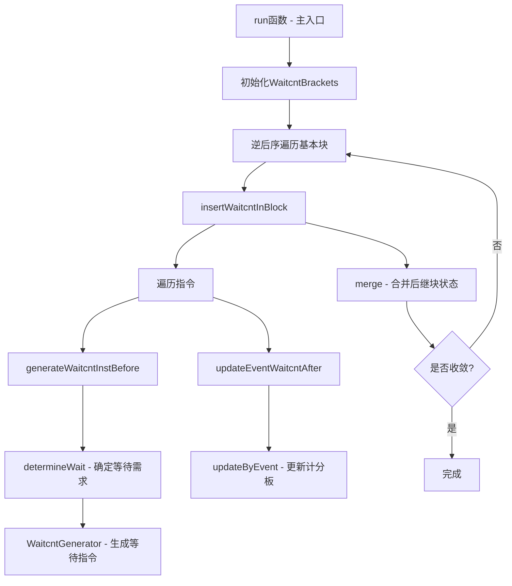

# SIInsertWaitcnts.cpp 代码功能分析

## 1. 主要功能概括

<a name="ref-block_0"></a>`SIInsertWaitcnts.cpp` 实现了一个LLVM机器代码pass，其主要功能是**在AMDGPU代码中插入等待计数指令（wait count instructions）来同步异步内存操作**。 llvm-project:10-24[<sup>↗</sup>](#block_0) 

该pass的作用是：
- **处理异步内存访问**：由于内存读写操作是异步执行的，需要在访问结果或覆写异步使用的寄存器前插入等待指令
- **确保数据依赖正确性**：防止读后写（RAW）、写后读（WAR）和写后写（WAW）冲突
- **优化同步开销**：通过精确追踪待处理操作，只在必要时插入等待指令

## 2. 主要实现步骤和子功能

该pass的实现包含以下核心组件和步骤：

### A. 计数器追踪系统
<a name="ref-block_1"></a>- **InstCounterType枚举**：定义不同类型的硬件计数器（LOAD_CNT、DS_CNT、EXP_CNT、STORE_CNT等） llvm-project:67-79[<sup>↗</sup>](#block_1) 

<a name="ref-block_2"></a>- **WaitEventType枚举**：定义各种需要等待的事件类型（VMEM访问、LDS访问、GDS访问等） llvm-project:109-134[<sup>↗</sup>](#block_2) 

### B. 计分板管理（WaitcntBrackets类）
<a name="ref-block_3"></a>这是核心数据结构，维护每个计数器的当前状态和寄存器依赖关系。 llvm-project:271-278[<sup>↗</sup>](#block_3) 

主要功能包括：
- **分数区间追踪**：维护每个计数器的上下界分数
- **寄存器级评分**：为每个VGPR和SGPR维护计数器分数
- **事件记录**：追踪不同类型的待处理内存操作

### C. 等待指令生成器（WaitcntGenerator）
<a name="ref-block_4"></a>提供抽象接口来生成和管理等待指令，支持不同GPU架构。 llvm-project:498-568[<sup>↗</sup>](#block_4) 

包含两个具体实现：
- **WaitcntGeneratorPreGFX12**：用于GFX12之前的架构
- **WaitcntGeneratorGFX12Plus**：用于GFX12及之后的架构

## 3. 各步骤/子功能的具体描述

### 3.1 计分板更新（updateByEvent）
<a name="ref-block_5"></a>当遇到内存操作指令时，更新计分板状态。 llvm-project:910-924[<sup>↗</sup>](#block_5) 

该函数会：
- 为特定事件类型分配新的分数
- 更新相关寄存器的分数
- 记录待处理事件标志

### 3.2 等待需求确定（determineWait）
<a name="ref-block_7"></a>分析寄存器使用情况，确定是否需要插入等待指令。 llvm-project:1187-1217[<sup>↗</sup>](#block_7) 

判断逻辑：
- 检查源操作数的分数是否在当前区间内
- 如果存在依赖，计算需要等待的计数值
- 处理乱序完成的特殊情况

### 3.3 等待指令生成（generateWaitcntInstBefore）
<a name="ref-block_10"></a>在指令前生成必要的等待指令。 llvm-project:1787-1799[<sup>↗</sup>](#block_10) 

主要处理：
- 函数调用和返回点的完全等待
- 导出指令前的EXP计数器等待
- GDS指令的特殊处理
- 寄存器操作数的RAW/WAW依赖检查

### 3.4 预存在等待指令的合并
<a name="ref-block_8"></a>处理已存在的等待指令，合并或更新它们。 llvm-project:1339-1377[<sup>↗</sup>](#block_8) 

<a name="ref-block_9"></a>对于GFX12之前的架构： llvm-project:1443-1481[<sup>↗</sup>](#block_9) 

### 3.5 计分板合并（merge）
<a name="ref-block_11"></a>在控制流汇聚点合并不同路径的计分板状态。 llvm-project:2383-2412[<sup>↗</sup>](#block_11) 

确保：
- 合并所有路径的待处理事件
- 保守地计算寄存器分数
- 保持同步正确性

### 3.6 主循环处理（insertWaitcntInBlock）
<a name="ref-block_12"></a>遍历基本块中的指令，插入等待指令。 llvm-project:2448-2475[<sup>↗</sup>](#block_12) 

处理流程：
- 追踪已有的等待指令
- 在需要的位置生成新等待指令
- 更新计分板状态
- 处理VCCZ相关的硬件bug

### 3.7 全局迭代算法（run函数）
<a name="ref-block_14"></a>使用不动点迭代算法处理整个函数。 llvm-project:2823-2857[<sup>↗</sup>](#block_14) 

算法特点：
- 以逆后序遍历基本块
- 迭代直到所有块状态收敛
- 处理循环的回边情况

## 4. 步骤/子功能之间的关系

整个pass的工作流程可以用以下关系描述：



**依赖关系说明**：

1. **数据流关系**：`updateByEvent` → `WaitcntBrackets` → `determineWait` → `generateWaitcntInstBefore`
   - 内存操作更新计分板
   - 计分板状态决定等待需求
   - 等待需求驱动指令生成

2. **控制流关系**：`insertWaitcntInBlock` → `merge` → 不动点迭代
   - 单块处理产生输出状态
   - 汇聚点合并多个状态
   - 迭代直到状态稳定

<a name="ref-block_13"></a>3. **架构抽象关系**：`WaitcntGenerator` 抽象层隔离了不同GPU架构的差异 llvm-project:2736-2744[<sup>↗</sup>](#block_13) 

4. **优化关系**：
<a name="ref-block_6"></a>   - `simplifyWaitcnt` 消除冗余等待 llvm-project:1167-1185[<sup>↗</sup>](#block_6) 
   
   - `applyPreexistingWaitcnt` 合并已有等待指令，减少指令数量

## Notes

这个pass是AMDGPU后端中非常关键的一环，确保了异步内存操作的正确性。它的复杂性来源于：
- 多种内存操作类型（VMEM、SMEM、LDS、GDS等）
- 不同GPU架构的计数器差异（GFX12前后）
- 需要精确追踪寄存器级别的依赖关系
- 控制流合并点的保守处理
- 各种硬件bug的workaround（如VCCZ bug）

该实现采用了数据流分析的经典方法，通过维护每个程序点的抽象状态（计分板）并进行不动点迭代来确保全局正确性。
### Citations
<a name="block_0"></a>**File:** llvm/lib/Target/AMDGPU/SIInsertWaitcnts.cpp (L10-24) [<sup>↩</sup>](#ref-block_0)
```cpp
/// Insert wait instructions for memory reads and writes.
///
/// Memory reads and writes are issued asynchronously, so we need to insert
/// S_WAITCNT instructions when we want to access any of their results or
/// overwrite any register that's used asynchronously.
///
/// TODO: This pass currently keeps one timeline per hardware counter. A more
/// finely-grained approach that keeps one timeline per event type could
/// sometimes get away with generating weaker s_waitcnt instructions. For
/// example, when both SMEM and LDS are in flight and we need to wait for
/// the i-th-last LDS instruction, then an lgkmcnt(i) is actually sufficient,
/// but the pass will currently generate a conservative lgkmcnt(0) because
/// multiple event types are in flight.
//
//===----------------------------------------------------------------------===//
```
<a name="block_1"></a>**File:** llvm/lib/Target/AMDGPU/SIInsertWaitcnts.cpp (L67-79) [<sup>↩</sup>](#ref-block_1)
```cpp
enum InstCounterType {
  LOAD_CNT = 0, // VMcnt prior to gfx12.
  DS_CNT,       // LKGMcnt prior to gfx12.
  EXP_CNT,      //
  STORE_CNT,    // VScnt in gfx10/gfx11.
  NUM_NORMAL_INST_CNTS,
  SAMPLE_CNT = NUM_NORMAL_INST_CNTS, // gfx12+ only.
  BVH_CNT,                           // gfx12+ only.
  KM_CNT,                            // gfx12+ only.
  X_CNT,                             // gfx1250.
  NUM_EXTENDED_INST_CNTS,
  NUM_INST_CNTS = NUM_EXTENDED_INST_CNTS
};
```
<a name="block_2"></a>**File:** llvm/lib/Target/AMDGPU/SIInsertWaitcnts.cpp (L109-134) [<sup>↩</sup>](#ref-block_2)
```cpp
#define AMDGPU_DECLARE_WAIT_EVENTS(DECL)                                       \
  DECL(VMEM_ACCESS)              /* vmem read & write */                       \
  DECL(VMEM_READ_ACCESS)         /* vmem read */                               \
  DECL(VMEM_SAMPLER_READ_ACCESS) /* vmem SAMPLER read (gfx12+ only) */         \
  DECL(VMEM_BVH_READ_ACCESS)     /* vmem BVH read (gfx12+ only) */             \
  DECL(VMEM_WRITE_ACCESS)        /* vmem write that is not scratch */          \
  DECL(SCRATCH_WRITE_ACCESS)     /* vmem write that may be scratch */          \
  DECL(VMEM_GROUP)               /* vmem group */                              \
  DECL(LDS_ACCESS)               /* lds read & write */                        \
  DECL(GDS_ACCESS)               /* gds read & write */                        \
  DECL(SQ_MESSAGE)               /* send message */                            \
  DECL(SMEM_ACCESS)              /* scalar-memory read & write */              \
  DECL(SMEM_GROUP)               /* scalar-memory group */                     \
  DECL(EXP_GPR_LOCK)             /* export holding on its data src */          \
  DECL(GDS_GPR_LOCK)             /* GDS holding on its data and addr src */    \
  DECL(EXP_POS_ACCESS)           /* write to export position */                \
  DECL(EXP_PARAM_ACCESS)         /* write to export parameter */               \
  DECL(VMW_GPR_LOCK)             /* vmem write holding on its data src */      \
  DECL(EXP_LDS_ACCESS)           /* read by ldsdir counting as export */

// clang-format off
#define AMDGPU_EVENT_ENUM(Name) Name,
enum WaitEventType {
  AMDGPU_DECLARE_WAIT_EVENTS(AMDGPU_EVENT_ENUM)
  NUM_WAIT_EVENTS
};
```
<a name="block_3"></a>**File:** llvm/lib/Target/AMDGPU/SIInsertWaitcnts.cpp (L271-278) [<sup>↩</sup>](#ref-block_3)
```cpp
class WaitcntBrackets {
public:
  WaitcntBrackets(const GCNSubtarget *SubTarget, InstCounterType MaxCounter,
                  HardwareLimits Limits, const unsigned *WaitEventMaskForInst,
                  InstCounterType SmemAccessCounter)
      : ST(SubTarget), MaxCounter(MaxCounter), Limits(Limits),
        WaitEventMaskForInst(WaitEventMaskForInst),
        SmemAccessCounter(SmemAccessCounter) {}
```
<a name="block_4"></a>**File:** llvm/lib/Target/AMDGPU/SIInsertWaitcnts.cpp (L498-568) [<sup>↩</sup>](#ref-block_4)
```cpp
// This abstracts the logic for generating and updating S_WAIT* instructions
// away from the analysis that determines where they are needed. This was
// done because the set of counters and instructions for waiting on them
// underwent a major shift with gfx12, sufficiently so that having this
// abstraction allows the main analysis logic to be simpler than it would
// otherwise have had to become.
class WaitcntGenerator {
protected:
  const GCNSubtarget *ST = nullptr;
  const SIInstrInfo *TII = nullptr;
  AMDGPU::IsaVersion IV;
  InstCounterType MaxCounter;
  bool OptNone;

public:
  WaitcntGenerator() = default;
  WaitcntGenerator(const MachineFunction &MF, InstCounterType MaxCounter)
      : ST(&MF.getSubtarget<GCNSubtarget>()), TII(ST->getInstrInfo()),
        IV(AMDGPU::getIsaVersion(ST->getCPU())), MaxCounter(MaxCounter),
        OptNone(MF.getFunction().hasOptNone() ||
                MF.getTarget().getOptLevel() == CodeGenOptLevel::None) {}

  // Return true if the current function should be compiled with no
  // optimization.
  bool isOptNone() const { return OptNone; }

  // Edits an existing sequence of wait count instructions according
  // to an incoming Waitcnt value, which is itself updated to reflect
  // any new wait count instructions which may need to be generated by
  // WaitcntGenerator::createNewWaitcnt(). It will return true if any edits
  // were made.
  //
  // This editing will usually be merely updated operands, but it may also
  // delete instructions if the incoming Wait value indicates they are not
  // needed. It may also remove existing instructions for which a wait
  // is needed if it can be determined that it is better to generate new
  // instructions later, as can happen on gfx12.
  virtual bool
  applyPreexistingWaitcnt(WaitcntBrackets &ScoreBrackets,
                          MachineInstr &OldWaitcntInstr, AMDGPU::Waitcnt &Wait,
                          MachineBasicBlock::instr_iterator It) const = 0;

  // Transform a soft waitcnt into a normal one.
  bool promoteSoftWaitCnt(MachineInstr *Waitcnt) const;

  // Generates new wait count instructions according to the  value of
  // Wait, returning true if any new instructions were created.
  virtual bool createNewWaitcnt(MachineBasicBlock &Block,
                                MachineBasicBlock::instr_iterator It,
                                AMDGPU::Waitcnt Wait) = 0;

  // Returns an array of bit masks which can be used to map values in
  // WaitEventType to corresponding counter values in InstCounterType.
  virtual const unsigned *getWaitEventMask() const = 0;

  // Returns a new waitcnt with all counters except VScnt set to 0. If
  // IncludeVSCnt is true, VScnt is set to 0, otherwise it is set to ~0u.
  virtual AMDGPU::Waitcnt getAllZeroWaitcnt(bool IncludeVSCnt) const = 0;

  virtual ~WaitcntGenerator() = default;

  // Create a mask value from the initializer list of wait event types.
  static constexpr unsigned
  eventMask(std::initializer_list<WaitEventType> Events) {
    unsigned Mask = 0;
    for (auto &E : Events)
      Mask |= 1 << E;

    return Mask;
  }
};
```
<a name="block_5"></a>**File:** llvm/lib/Target/AMDGPU/SIInsertWaitcnts.cpp (L910-924) [<sup>↩</sup>](#ref-block_5)
```cpp
void WaitcntBrackets::updateByEvent(const SIInstrInfo *TII,
                                    const SIRegisterInfo *TRI,
                                    const MachineRegisterInfo *MRI,
                                    WaitEventType E, MachineInstr &Inst) {
  InstCounterType T = eventCounter(WaitEventMaskForInst, E);

  unsigned UB = getScoreUB(T);
  unsigned CurrScore = UB + 1;
  if (CurrScore == 0)
    report_fatal_error("InsertWaitcnt score wraparound");
  // PendingEvents and ScoreUB need to be update regardless if this event
  // changes the score of a register or not.
  // Examples including vm_cnt when buffer-store or lgkm_cnt when send-message.
  PendingEvents |= 1 << E;
  setScoreUB(T, CurrScore);
```
<a name="block_6"></a>**File:** llvm/lib/Target/AMDGPU/SIInsertWaitcnts.cpp (L1167-1185) [<sup>↩</sup>](#ref-block_6)
```cpp
void WaitcntBrackets::simplifyWaitcnt(AMDGPU::Waitcnt &Wait) const {
  simplifyWaitcnt(LOAD_CNT, Wait.LoadCnt);
  simplifyWaitcnt(EXP_CNT, Wait.ExpCnt);
  simplifyWaitcnt(DS_CNT, Wait.DsCnt);
  simplifyWaitcnt(STORE_CNT, Wait.StoreCnt);
  simplifyWaitcnt(SAMPLE_CNT, Wait.SampleCnt);
  simplifyWaitcnt(BVH_CNT, Wait.BvhCnt);
  simplifyWaitcnt(KM_CNT, Wait.KmCnt);
  simplifyWaitcnt(X_CNT, Wait.XCnt);
}

void WaitcntBrackets::simplifyWaitcnt(InstCounterType T,
                                      unsigned &Count) const {
  // The number of outstanding events for this type, T, can be calculated
  // as (UB - LB). If the current Count is greater than or equal to the number
  // of outstanding events, then the wait for this counter is redundant.
  if (Count >= getScoreRange(T))
    Count = ~0u;
}
```
<a name="block_7"></a>**File:** llvm/lib/Target/AMDGPU/SIInsertWaitcnts.cpp (L1187-1217) [<sup>↩</sup>](#ref-block_7)
```cpp
void WaitcntBrackets::determineWait(InstCounterType T, RegInterval Interval,
                                    AMDGPU::Waitcnt &Wait) const {
  const unsigned LB = getScoreLB(T);
  const unsigned UB = getScoreUB(T);
  for (int RegNo = Interval.first; RegNo < Interval.second; ++RegNo) {
    unsigned ScoreToWait = getRegScore(RegNo, T);

    // If the score of src_operand falls within the bracket, we need an
    // s_waitcnt instruction.
    if ((UB >= ScoreToWait) && (ScoreToWait > LB)) {
      if ((T == LOAD_CNT || T == DS_CNT) && hasPendingFlat() &&
          !ST->hasFlatLgkmVMemCountInOrder()) {
        // If there is a pending FLAT operation, and this is a VMem or LGKM
        // waitcnt and the target can report early completion, then we need
        // to force a waitcnt 0.
        addWait(Wait, T, 0);
      } else if (counterOutOfOrder(T)) {
        // Counter can get decremented out-of-order when there
        // are multiple types event in the bracket. Also emit an s_wait counter
        // with a conservative value of 0 for the counter.
        addWait(Wait, T, 0);
      } else {
        // If a counter has been maxed out avoid overflow by waiting for
        // MAX(CounterType) - 1 instead.
        unsigned NeededWait =
            std::min(UB - ScoreToWait, getWaitCountMax(T) - 1);
        addWait(Wait, T, NeededWait);
      }
    }
  }
}
```
<a name="block_8"></a>**File:** llvm/lib/Target/AMDGPU/SIInsertWaitcnts.cpp (L1339-1377) [<sup>↩</sup>](#ref-block_8)
```cpp
bool WaitcntGeneratorPreGFX12::applyPreexistingWaitcnt(
    WaitcntBrackets &ScoreBrackets, MachineInstr &OldWaitcntInstr,
    AMDGPU::Waitcnt &Wait, MachineBasicBlock::instr_iterator It) const {
  assert(ST);
  assert(isNormalMode(MaxCounter));

  bool Modified = false;
  MachineInstr *WaitcntInstr = nullptr;
  MachineInstr *WaitcntVsCntInstr = nullptr;

  LLVM_DEBUG({
    dbgs() << "PreGFX12::applyPreexistingWaitcnt at: ";
    if (It == OldWaitcntInstr.getParent()->instr_end())
      dbgs() << "end of block\n";
    else
      dbgs() << *It;
  });

  for (auto &II :
       make_early_inc_range(make_range(OldWaitcntInstr.getIterator(), It))) {
    LLVM_DEBUG(dbgs() << "pre-existing iter: " << II);
    if (II.isMetaInstruction()) {
      LLVM_DEBUG(dbgs() << "skipped meta instruction\n");
      continue;
    }

    unsigned Opcode = SIInstrInfo::getNonSoftWaitcntOpcode(II.getOpcode());
    bool TrySimplify = Opcode != II.getOpcode() && !OptNone;

    // Update required wait count. If this is a soft waitcnt (= it was added
    // by an earlier pass), it may be entirely removed.
    if (Opcode == AMDGPU::S_WAITCNT) {
      unsigned IEnc = II.getOperand(0).getImm();
      AMDGPU::Waitcnt OldWait = AMDGPU::decodeWaitcnt(IV, IEnc);
      if (TrySimplify)
        ScoreBrackets.simplifyWaitcnt(OldWait);
      Wait = Wait.combined(OldWait);

      // Merge consecutive waitcnt of the same type by erasing multiples.
```
<a name="block_9"></a>**File:** llvm/lib/Target/AMDGPU/SIInsertWaitcnts.cpp (L1443-1481) [<sup>↩</sup>](#ref-block_9)
```cpp
/// required counters in \p Wait
bool WaitcntGeneratorPreGFX12::createNewWaitcnt(
    MachineBasicBlock &Block, MachineBasicBlock::instr_iterator It,
    AMDGPU::Waitcnt Wait) {
  assert(ST);
  assert(isNormalMode(MaxCounter));

  bool Modified = false;
  const DebugLoc &DL = Block.findDebugLoc(It);

  // Waits for VMcnt, LKGMcnt and/or EXPcnt are encoded together into a
  // single instruction while VScnt has its own instruction.
  if (Wait.hasWaitExceptStoreCnt()) {
    unsigned Enc = AMDGPU::encodeWaitcnt(IV, Wait);
    [[maybe_unused]] auto SWaitInst =
        BuildMI(Block, It, DL, TII->get(AMDGPU::S_WAITCNT)).addImm(Enc);
    Modified = true;

    LLVM_DEBUG(dbgs() << "generateWaitcnt\n";
               if (It != Block.instr_end()) dbgs() << "Old Instr: " << *It;
               dbgs() << "New Instr: " << *SWaitInst << '\n');
  }

  if (Wait.hasWaitStoreCnt()) {
    assert(ST->hasVscnt());

    [[maybe_unused]] auto SWaitInst =
        BuildMI(Block, It, DL, TII->get(AMDGPU::S_WAITCNT_VSCNT))
            .addReg(AMDGPU::SGPR_NULL, RegState::Undef)
            .addImm(Wait.StoreCnt);
    Modified = true;

    LLVM_DEBUG(dbgs() << "generateWaitcnt\n";
               if (It != Block.instr_end()) dbgs() << "Old Instr: " << *It;
               dbgs() << "New Instr: " << *SWaitInst << '\n');
  }

  return Modified;
}
```
<a name="block_10"></a>**File:** llvm/lib/Target/AMDGPU/SIInsertWaitcnts.cpp (L1787-1799) [<sup>↩</sup>](#ref-block_10)
```cpp
bool SIInsertWaitcnts::generateWaitcntInstBefore(MachineInstr &MI,
                                                 WaitcntBrackets &ScoreBrackets,
                                                 MachineInstr *OldWaitcntInstr,
                                                 bool FlushVmCnt) {
  setForceEmitWaitcnt();

  assert(!MI.isMetaInstruction());

  AMDGPU::Waitcnt Wait;

  // FIXME: This should have already been handled by the memory legalizer.
  // Removing this currently doesn't affect any lit tests, but we need to
  // verify that nothing was relying on this. The number of buffer invalidates
```
<a name="block_11"></a>**File:** llvm/lib/Target/AMDGPU/SIInsertWaitcnts.cpp (L2383-2412) [<sup>↩</sup>](#ref-block_11)
```cpp
bool WaitcntBrackets::merge(const WaitcntBrackets &Other) {
  bool StrictDom = false;

  VgprUB = std::max(VgprUB, Other.VgprUB);
  SgprUB = std::max(SgprUB, Other.SgprUB);

  for (auto T : inst_counter_types(MaxCounter)) {
    // Merge event flags for this counter
    const unsigned OldEvents = PendingEvents & WaitEventMaskForInst[T];
    const unsigned OtherEvents = Other.PendingEvents & WaitEventMaskForInst[T];
    if (OtherEvents & ~OldEvents)
      StrictDom = true;
    PendingEvents |= OtherEvents;

    // Merge scores for this counter
    const unsigned MyPending = ScoreUBs[T] - ScoreLBs[T];
    const unsigned OtherPending = Other.ScoreUBs[T] - Other.ScoreLBs[T];
    const unsigned NewUB = ScoreLBs[T] + std::max(MyPending, OtherPending);
    if (NewUB < ScoreLBs[T])
      report_fatal_error("waitcnt score overflow");

    MergeInfo M;
    M.OldLB = ScoreLBs[T];
    M.OtherLB = Other.ScoreLBs[T];
    M.MyShift = NewUB - ScoreUBs[T];
    M.OtherShift = NewUB - Other.ScoreUBs[T];

    ScoreUBs[T] = NewUB;

    StrictDom |= mergeScore(M, LastFlat[T], Other.LastFlat[T]);
```
<a name="block_12"></a>**File:** llvm/lib/Target/AMDGPU/SIInsertWaitcnts.cpp (L2448-2475) [<sup>↩</sup>](#ref-block_12)
```cpp
bool SIInsertWaitcnts::insertWaitcntInBlock(MachineFunction &MF,
                                            MachineBasicBlock &Block,
                                            WaitcntBrackets &ScoreBrackets) {
  bool Modified = false;

  LLVM_DEBUG({
    dbgs() << "*** Begin Block: ";
    Block.printName(dbgs());
    ScoreBrackets.dump();
  });

  // Track the correctness of vccz through this basic block. There are two
  // reasons why it might be incorrect; see ST->hasReadVCCZBug() and
  // ST->partialVCCWritesUpdateVCCZ().
  bool VCCZCorrect = true;
  if (ST->hasReadVCCZBug()) {
    // vccz could be incorrect at a basic block boundary if a predecessor wrote
    // to vcc and then issued an smem load.
    VCCZCorrect = false;
  } else if (!ST->partialVCCWritesUpdateVCCZ()) {
    // vccz could be incorrect at a basic block boundary if a predecessor wrote
    // to vcc_lo or vcc_hi.
    VCCZCorrect = false;
  }

  // Walk over the instructions.
  MachineInstr *OldWaitcntInstr = nullptr;

```
<a name="block_13"></a>**File:** llvm/lib/Target/AMDGPU/SIInsertWaitcnts.cpp (L2736-2744) [<sup>↩</sup>](#ref-block_13)
```cpp
  if (ST->hasExtendedWaitCounts()) {
    MaxCounter = NUM_EXTENDED_INST_CNTS;
    WCGGFX12Plus = WaitcntGeneratorGFX12Plus(MF, MaxCounter);
    WCG = &WCGGFX12Plus;
  } else {
    MaxCounter = NUM_NORMAL_INST_CNTS;
    WCGPreGFX12 = WaitcntGeneratorPreGFX12(MF);
    WCG = &WCGPreGFX12;
  }
```
<a name="block_14"></a>**File:** llvm/lib/Target/AMDGPU/SIInsertWaitcnts.cpp (L2823-2857) [<sup>↩</sup>](#ref-block_14)
```cpp
  std::unique_ptr<WaitcntBrackets> Brackets;
  bool Repeat;
  do {
    Repeat = false;

    for (auto BII = BlockInfos.begin(), BIE = BlockInfos.end(); BII != BIE;
         ++BII) {
      MachineBasicBlock *MBB = BII->first;
      BlockInfo &BI = BII->second;
      if (!BI.Dirty)
        continue;

      if (BI.Incoming) {
        if (!Brackets)
          Brackets = std::make_unique<WaitcntBrackets>(*BI.Incoming);
        else
          *Brackets = *BI.Incoming;
      } else {
        if (!Brackets) {
          Brackets = std::make_unique<WaitcntBrackets>(
              ST, MaxCounter, Limits, WaitEventMaskForInst, SmemAccessCounter);
        } else {
          // Reinitialize in-place. N.B. do not do this by assigning from a
          // temporary because the WaitcntBrackets class is large and it could
          // cause this function to use an unreasonable amount of stack space.
          Brackets->~WaitcntBrackets();
          new (Brackets.get()) WaitcntBrackets(
              ST, MaxCounter, Limits, WaitEventMaskForInst, SmemAccessCounter);
        }
      }

      Modified |= insertWaitcntInBlock(MF, *MBB, *Brackets);
      BI.Dirty = false;

      if (Brackets->hasPendingEvent()) {
```