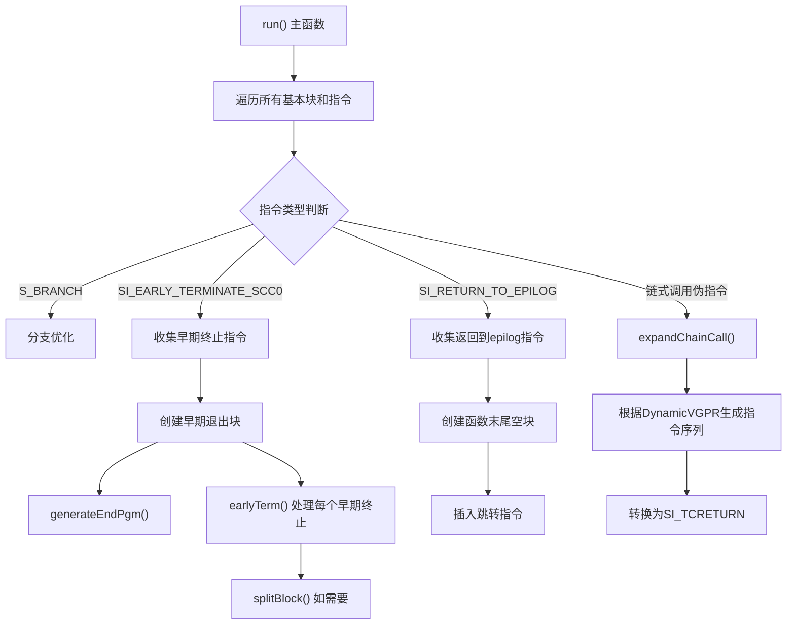

# SILateBranchLowering.cpp 代码功能详解

## 1. Pass 主要功能概述

<a name="ref-block_0"></a>`SILateBranchLowering` 是 AMDGPU 后端的一个机器码级别的优化 pass，其主要功能是**对分支指令进行最终的降低（lowering）处理**。 llvm-project:10-10[<sup>↗</sup>](#block_0) 

**主要作用包括：**
- 降低早期终止（early terminate）伪指令
- 展开链式尾调用（chain tail call）伪指令
- 处理返回到 epilog 的指令
- 优化不必要的分支指令

**效果：**
- 将高级伪指令转换为实际的硬件指令
- 优化控制流，提高代码执行效率
- 确保程序正确终止，特别是对于 Pixel Shader（PS）等特殊调用约定

## 2. 主要功能步骤/子功能提取

通过分析代码，可以提取出以下主要子功能：

1. **主遍历循环** - `run()` 函数
2. **链式调用展开** - `expandChainCall()`
3. **早期终止处理** - `earlyTerm()`
4. **程序结束生成** - `generateEndPgm()`
5. **基本块分割** - `splitBlock()`
6. **分支优化** - S_BRANCH 优化
7. **返回到 epilog 处理**

## 3. 各子功能的具体描述分析

### 3.1 主遍历循环 (`run()` 函数)

<a name="ref-block_12"></a>这是整个 pass 的入口点和核心控制逻辑。 llvm-project:216-223[<sup>↗</sup>](#block_12) 

**功能描述：**
- 初始化目标相关信息（TII, TRI）
- 根据 wave 大小（wave32/wave64）设置正确的 EXEC 寄存器和移动操作码
- 遍历函数中的所有基本块和指令
- 根据指令操作码分发到不同的处理逻辑

<a name="ref-block_13"></a>该函数使用 `make_early_inc_range` 进行迭代，允许在遍历过程中安全地修改或删除指令。 llvm-project:228-264[<sup>↗</sup>](#block_13) 

### 3.2 链式调用展开 (`expandChainCall()`)

**功能描述：**
<a name="ref-block_6"></a>这个函数将链式尾调用伪指令展开为多个实际的硬件指令。 llvm-project:138-141[<sup>↗</sup>](#block_6) 

**处理两种模式：**

**动态 VGPR 模式：** 当 `DynamicVGPR` 为 true 时，需要生成三条额外的指令：
- `S_ALLOC_VGPR` - 尝试重新分配 VGPR
- `S_CSELECT_B64` - 根据分配结果选择被调用者
<a name="ref-block_7"></a>- `S_CSELECT_B32/B64` - 根据分配结果选择 EXEC 掩码 llvm-project:147-176[<sup>↗</sup>](#block_7) 

<a name="ref-block_8"></a>**普通模式：** 仅生成一条 `S_MOV` 指令设置 EXEC 寄存器。 llvm-project:177-181[<sup>↗</sup>](#block_8) 

<a name="ref-block_9"></a>最后，移除伪指令的额外操作数，并将其转换为 `SI_TCRETURN` 指令。 llvm-project:183-187[<sup>↗</sup>](#block_9) 

### 3.3 早期终止处理 (`earlyTerm()`)

**功能描述：**
<a name="ref-block_10"></a>处理早期终止伪指令，创建条件分支到早期退出块。 llvm-project:189-192[<sup>↗</sup>](#block_10) 

**具体操作：**
- 生成 `S_CBRANCH_SCC0` 条件分支指令，基于 SCC（Status Condition Code）跳转到早期退出块
- 如果分支后还有非终止指令，则需要分割基本块
<a name="ref-block_11"></a>- 更新基本块的后继关系和支配树 llvm-project:194-203[<sup>↗</sup>](#block_11) 

### 3.4 程序结束生成 (`generateEndPgm()`)

**功能描述：**
<a name="ref-block_1"></a>为程序生成正确的结束序列，特别是处理 Pixel Shader 的特殊需求。 llvm-project:79-81[<sup>↗</sup>](#block_1) 

**PS（Pixel Shader）特殊处理：**
- 检查是否配置了颜色或深度导出
- 对于 GFX10 之前的硬件，PS 必须至少导出一次
<a name="ref-block_2"></a>- 如果需要导出，生成 "null export" 指令（`EXP_DONE`） llvm-project:93-109[<sup>↗</sup>](#block_2) 

<a name="ref-block_3"></a>**最后生成 `S_ENDPGM` 指令终止程序。** llvm-project:111-113[<sup>↗</sup>](#block_3) 

### 3.5 基本块分割 (`splitBlock()`)

**功能描述：**
<a name="ref-block_4"></a>在指定指令处分割基本块，并更新支配树信息。 llvm-project:115-117[<sup>↗</sup>](#block_4) 

**支配树更新：**
- 为分割后的新块到其后继建立插入边
- 删除原块到这些后继的边
<a name="ref-block_5"></a>- 添加原块到新块的边 llvm-project:119-128[<sup>↗</sup>](#block_5) 

### 3.6 分支优化

**功能描述：**
优化跳转到下一个相邻块的无条件分支，这种情况通常出现在 `-O0` 且未执行分支折叠优化时。 llvm-project:231-239 

### 3.7 返回到 Epilog 处理

**功能描述：**
<a name="ref-block_14"></a>处理 `SI_RETURN_TO_EPILOG` 伪指令，确保所有这类指令最终都跳转到函数末尾。 llvm-project:289-291[<sup>↗</sup>](#block_14) 

**处理策略：**
- 如果只有一个返回指令且已在函数末尾，则不做处理
- 如果有多个返回指令，创建一个新的空基本块放在函数末尾
<a name="ref-block_15"></a>- 将所有非末尾的返回指令替换为跳转到该空块的分支指令 llvm-project:294-321[<sup>↗</sup>](#block_15) 

## 4. 步骤/子功能之间的关系

### 执行流程关系：



### 依赖关系：

1. **`run()` 是控制中枢**：协调所有其他子功能的调用
2. **`earlyTerm()` 依赖 `splitBlock()`**：当早期终止后还有指令时需要分割块
3. **早期终止处理依赖 `generateEndPgm()`**：创建正确的程序退出序列
4. **所有修改基本块结构的操作都需要更新支配树**：`splitBlock()` 和 `earlyTerm()` 都会更新 MDT

### 数据流关系：

- **收集阶段**：第一次遍历收集需要处理的伪指令到向量中（`EarlyTermInstrs`, `EpilogInstrs`）
- **处理阶段**：统一处理收集的指令，创建必要的新基本块
- **清理阶段**：删除原有的伪指令，完成降低过程

## Notes

该 pass 在 LLVM 编译流程中属于非常后期的阶段，运行在寄存器分配之后、汇编发射之前。它的主要目标是：

1. **确保硬件语义正确性**：特别是对于 Pixel Shader 等有特殊硬件要求的情况
2. **最终控制流规范化**：将所有高级伪指令转换为实际的硬件指令
3. **优化控制流**：移除不必要的分支，确保返回逻辑统一

该 pass 名称中的 "Late" 表明它是在很晚的阶段执行，"Branch Lowering" 表明其核心功能是降低分支相关的伪指令。支持两种 pass 管理器：传统的（Legacy）和新的 Pass Manager。
### Citations
<a name="block_0"></a>**File:** llvm/lib/Target/AMDGPU/SILateBranchLowering.cpp (L10-10) [<sup>↩</sup>](#ref-block_0)
```cpp
/// This pass mainly lowers early terminate pseudo instructions.
```
<a name="block_1"></a>**File:** llvm/lib/Target/AMDGPU/SILateBranchLowering.cpp (L79-81) [<sup>↩</sup>](#ref-block_1)
```cpp
static void generateEndPgm(MachineBasicBlock &MBB,
                           MachineBasicBlock::iterator I, DebugLoc DL,
                           const SIInstrInfo *TII, MachineFunction &MF) {
```
<a name="block_2"></a>**File:** llvm/lib/Target/AMDGPU/SILateBranchLowering.cpp (L93-109) [<sup>↩</sup>](#ref-block_2)
```cpp
  if (IsPS && (HasExports || MustExport)) {
    // Generate "null export" if hardware is expecting PS to export.
    const GCNSubtarget &ST = MBB.getParent()->getSubtarget<GCNSubtarget>();
    int Target =
        ST.hasNullExportTarget()
            ? AMDGPU::Exp::ET_NULL
            : (HasColorExports ? AMDGPU::Exp::ET_MRT0 : AMDGPU::Exp::ET_MRTZ);
    BuildMI(MBB, I, DL, TII->get(AMDGPU::EXP_DONE))
        .addImm(Target)
        .addReg(AMDGPU::VGPR0, RegState::Undef)
        .addReg(AMDGPU::VGPR0, RegState::Undef)
        .addReg(AMDGPU::VGPR0, RegState::Undef)
        .addReg(AMDGPU::VGPR0, RegState::Undef)
        .addImm(1)  // vm
        .addImm(0)  // compr
        .addImm(0); // en
  }
```
<a name="block_3"></a>**File:** llvm/lib/Target/AMDGPU/SILateBranchLowering.cpp (L111-113) [<sup>↩</sup>](#ref-block_3)
```cpp
  // s_endpgm
  BuildMI(MBB, I, DL, TII->get(AMDGPU::S_ENDPGM)).addImm(0);
}
```
<a name="block_4"></a>**File:** llvm/lib/Target/AMDGPU/SILateBranchLowering.cpp (L115-117) [<sup>↩</sup>](#ref-block_4)
```cpp
static void splitBlock(MachineBasicBlock &MBB, MachineInstr &MI,
                       MachineDominatorTree *MDT) {
  MachineBasicBlock *SplitBB = MBB.splitAt(MI, /*UpdateLiveIns*/ true);
```
<a name="block_5"></a>**File:** llvm/lib/Target/AMDGPU/SILateBranchLowering.cpp (L119-128) [<sup>↩</sup>](#ref-block_5)
```cpp
  // Update dominator tree
  using DomTreeT = DomTreeBase<MachineBasicBlock>;
  SmallVector<DomTreeT::UpdateType, 16> DTUpdates;
  for (MachineBasicBlock *Succ : SplitBB->successors()) {
    DTUpdates.push_back({DomTreeT::Insert, SplitBB, Succ});
    DTUpdates.push_back({DomTreeT::Delete, &MBB, Succ});
  }
  DTUpdates.push_back({DomTreeT::Insert, &MBB, SplitBB});
  MDT->applyUpdates(DTUpdates);
}
```
<a name="block_6"></a>**File:** llvm/lib/Target/AMDGPU/SILateBranchLowering.cpp (L138-141) [<sup>↩</sup>](#ref-block_6)
```cpp
void SILateBranchLowering::expandChainCall(MachineInstr &MI,
                                           const GCNSubtarget &ST,
                                           bool DynamicVGPR) {
  // This is a tail call that needs to be expanded into at least
```
<a name="block_7"></a>**File:** llvm/lib/Target/AMDGPU/SILateBranchLowering.cpp (L147-176) [<sup>↩</sup>](#ref-block_7)
```cpp
  if (DynamicVGPR) {
    // We have 3 extra operands and we need to:
    // * Try to change the VGPR allocation
    // * Select the callee based on the result of the reallocation attempt
    // * Select the EXEC mask based on the result of the reallocation attempt
    // If any of the register operands of the chain pseudo is used in more than
    // one of these instructions, we need to make sure that the kill flags
    // aren't copied along.
    auto AllocMI =
        BuildMI(*MI.getParent(), MI, DL, TII->get(AMDGPU::S_ALLOC_VGPR));
    copyOpWithoutRegFlags(AllocMI,
                          *TII->getNamedOperand(MI, AMDGPU::OpName::numvgprs));

    auto SelectCallee =
        BuildMI(*MI.getParent(), MI, DL, TII->get(AMDGPU::S_CSELECT_B64))
            .addDef(TII->getNamedOperand(MI, AMDGPU::OpName::src0)->getReg());
    copyOpWithoutRegFlags(SelectCallee,
                          *TII->getNamedOperand(MI, AMDGPU::OpName::src0));
    copyOpWithoutRegFlags(SelectCallee,
                          *TII->getNamedOperand(MI, AMDGPU::OpName::fbcallee));

    auto SelectExec = BuildMI(*MI.getParent(), MI, DL,
                              TII->get(ST.isWave32() ? AMDGPU::S_CSELECT_B32
                                                     : AMDGPU::S_CSELECT_B64))
                          .addDef(ExecReg);

    copyOpWithoutRegFlags(SelectExec,
                          *TII->getNamedOperand(MI, AMDGPU::OpName::exec));
    copyOpWithoutRegFlags(SelectExec,
                          *TII->getNamedOperand(MI, AMDGPU::OpName::fbexec));
```
<a name="block_8"></a>**File:** llvm/lib/Target/AMDGPU/SILateBranchLowering.cpp (L177-181) [<sup>↩</sup>](#ref-block_8)
```cpp
  } else {
    auto SetExec = BuildMI(*MI.getParent(), MI, DL, TII->get(MovOpc), ExecReg);
    copyOpWithoutRegFlags(SetExec,
                          *TII->getNamedOperand(MI, AMDGPU::OpName::exec));
  }
```
<a name="block_9"></a>**File:** llvm/lib/Target/AMDGPU/SILateBranchLowering.cpp (L183-187) [<sup>↩</sup>](#ref-block_9)
```cpp
  for (int OpIdx = MI.getNumExplicitOperands() - 1; OpIdx >= ExecIdx; --OpIdx)
    MI.removeOperand(OpIdx);

  MI.setDesc(TII->get(AMDGPU::SI_TCRETURN));
}
```
<a name="block_10"></a>**File:** llvm/lib/Target/AMDGPU/SILateBranchLowering.cpp (L189-192) [<sup>↩</sup>](#ref-block_10)
```cpp
void SILateBranchLowering::earlyTerm(MachineInstr &MI,
                                     MachineBasicBlock *EarlyExitBlock) {
  MachineBasicBlock &MBB = *MI.getParent();
  const DebugLoc DL = MI.getDebugLoc();
```
<a name="block_11"></a>**File:** llvm/lib/Target/AMDGPU/SILateBranchLowering.cpp (L194-203) [<sup>↩</sup>](#ref-block_11)
```cpp
  auto BranchMI = BuildMI(MBB, MI, DL, TII->get(AMDGPU::S_CBRANCH_SCC0))
                      .addMBB(EarlyExitBlock);
  auto Next = std::next(MI.getIterator());

  if (Next != MBB.end() && !Next->isTerminator())
    splitBlock(MBB, *BranchMI, MDT);

  MBB.addSuccessor(EarlyExitBlock);
  MDT->insertEdge(&MBB, EarlyExitBlock);
}
```
<a name="block_12"></a>**File:** llvm/lib/Target/AMDGPU/SILateBranchLowering.cpp (L216-223) [<sup>↩</sup>](#ref-block_12)
```cpp
bool SILateBranchLowering::run(MachineFunction &MF) {
  const GCNSubtarget &ST = MF.getSubtarget<GCNSubtarget>();
  TII = ST.getInstrInfo();
  TRI = &TII->getRegisterInfo();

  MovOpc = ST.isWave32() ? AMDGPU::S_MOV_B32 : AMDGPU::S_MOV_B64;
  ExecReg = ST.isWave32() ? AMDGPU::EXEC_LO : AMDGPU::EXEC;

```
<a name="block_13"></a>**File:** llvm/lib/Target/AMDGPU/SILateBranchLowering.cpp (L228-264) [<sup>↩</sup>](#ref-block_13)
```cpp
  for (MachineBasicBlock &MBB : MF) {
    for (MachineInstr &MI : llvm::make_early_inc_range(MBB)) {
      switch (MI.getOpcode()) {
      case AMDGPU::S_BRANCH:
        // Optimize out branches to the next block.
        // This only occurs in -O0 when BranchFolding is not executed.
        if (MBB.isLayoutSuccessor(MI.getOperand(0).getMBB())) {
          assert(&MI == &MBB.back());
          MI.eraseFromParent();
          MadeChange = true;
        }
        break;

      case AMDGPU::SI_CS_CHAIN_TC_W32:
      case AMDGPU::SI_CS_CHAIN_TC_W64:
        expandChainCall(MI, ST, /*DynamicVGPR=*/false);
        MadeChange = true;
        break;
      case AMDGPU::SI_CS_CHAIN_TC_W32_DVGPR:
      case AMDGPU::SI_CS_CHAIN_TC_W64_DVGPR:
        expandChainCall(MI, ST, /*DynamicVGPR=*/true);
        MadeChange = true;
        break;

      case AMDGPU::SI_EARLY_TERMINATE_SCC0:
        EarlyTermInstrs.push_back(&MI);
        break;

      case AMDGPU::SI_RETURN_TO_EPILOG:
        EpilogInstrs.push_back(&MI);
        break;

      default:
        break;
      }
    }
  }
```
<a name="block_14"></a>**File:** llvm/lib/Target/AMDGPU/SILateBranchLowering.cpp (L289-291) [<sup>↩</sup>](#ref-block_14)
```cpp
  if (!EpilogInstrs.empty()) {
    MachineBasicBlock *EmptyMBBAtEnd = nullptr;
    assert(!MF.getInfo<SIMachineFunctionInfo>()->returnsVoid());
```
<a name="block_15"></a>**File:** llvm/lib/Target/AMDGPU/SILateBranchLowering.cpp (L294-321) [<sup>↩</sup>](#ref-block_15)
```cpp
    // become jumps to new empty end block.
    if (EpilogInstrs.size() > 1) {
      EmptyMBBAtEnd = MF.CreateMachineBasicBlock();
      MF.insert(MF.end(), EmptyMBBAtEnd);
    }

    for (auto *MI : EpilogInstrs) {
      auto *MBB = MI->getParent();
      if (MBB == &MF.back() && MI == &MBB->back())
        continue;

      // SI_RETURN_TO_EPILOG is not the last instruction.
      // Jump to empty block at function end.
      if (!EmptyMBBAtEnd) {
        EmptyMBBAtEnd = MF.CreateMachineBasicBlock();
        MF.insert(MF.end(), EmptyMBBAtEnd);
      }

      MBB->addSuccessor(EmptyMBBAtEnd);
      MDT->insertEdge(MBB, EmptyMBBAtEnd);
      BuildMI(*MBB, MI, MI->getDebugLoc(), TII->get(AMDGPU::S_BRANCH))
          .addMBB(EmptyMBBAtEnd);
      MI->eraseFromParent();
      MadeChange = true;
    }

    EpilogInstrs.clear();
  }
```