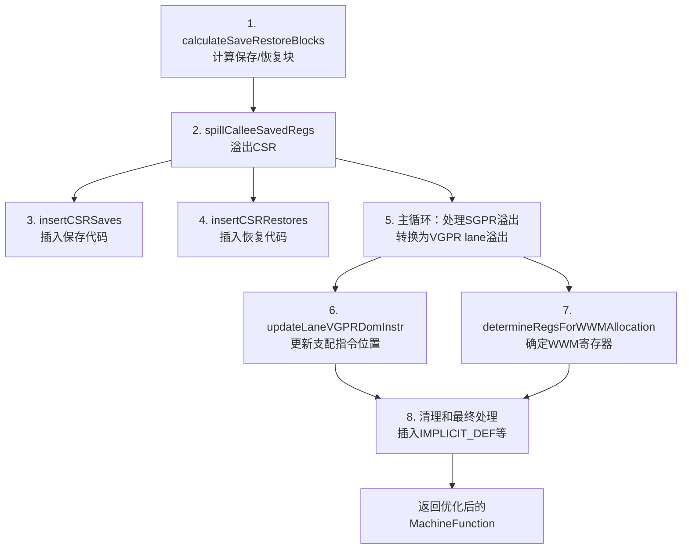

# SILowerSGPRSpills.cpp 代码功能详解

## 1. 主要功能概述

<a name="ref-block_0"></a>`SILowerSGPRSpills` 是一个针对 AMD GPU 架构的机器函数优化 pass，其主要功能是**处理 SGPR（标量通用寄存器）的溢出（spill）操作**。 llvm-project:9-12[<sup>↗</sup>](#block_0) 

**作用与效果：**
- 替代标准的 `PrologEpilogInserter` 来处理所有 SGPR 溢出
- 将 SGPR 溢出到 VGPR（向量寄存器）通道中，从而减少或消除栈内存使用
- 处理被调用者保存寄存器（CSR）的 SGPR 溢出
- **关键约束：此 pass 不能创建新的 SGPR 虚拟寄存器** llvm-project:12-12 

## 2. 主要功能步骤提取

该 pass 的核心实现包含以下关键步骤：

1. **计算保存/恢复块** (`calculateSaveRestoreBlocks`)
2. **溢出被调用者保存的寄存器** (`spillCalleeSavedRegs`)
3. **插入 CSR 保存代码** (`insertCSRSaves`)
4. **插入 CSR 恢复代码** (`insertCSRRestores`)
5. **处理 SGPR 到 VGPR 的溢出** (主循环处理)
6. **更新 Lane VGPR 支配指令** (`updateLaneVGPRDomInstr`)
7. **确定 WWM 分配寄存器** (`determineRegsForWWMAllocation`)
8. **清理死帧索引** (`removeDeadFrameIndices`)

## 3. 各步骤详细描述分析

### 步骤 1: 计算保存/恢复块 (calculateSaveRestoreBlocks)

<a name="ref-block_4"></a>该函数确定在哪些基本块中插入序言（prologue）和尾声（epilogue）代码。 llvm-project:167-195[<sup>↗</sup>](#block_4) 

**功能细节：**
- 如果启用了收缩包装（shrink-wrapping），使用已找到的保存/恢复点
- 否则，默认在函数入口处保存，在所有返回块处恢复
- 处理 EH funclet 入口块的特殊情况

### 步骤 2: 溢出被调用者保存的寄存器 (spillCalleeSavedRegs)

<a name="ref-block_5"></a>此函数负责确定并处理需要保存的 CSR SGPR。 llvm-project:207-278[<sup>↗</sup>](#block_5) 

**功能细节：**
- 调用 `determineCalleeSavesSGPR` 确定哪些寄存器需要保存
- 为每个需要保存的寄存器创建栈对象（帧索引）
- 特殊处理返回地址寄存器（使用寄存器对）
- 在保存块中插入保存指令，在恢复块中插入恢复指令
- 更新活跃性（liveness）信息

### 步骤 3: 插入 CSR 保存代码 (insertCSRSaves)

<a name="ref-block_2"></a>将被调用者保存寄存器的保存指令插入到指定的保存块中。 llvm-project:103-122[<sup>↗</sup>](#block_2) 

**功能细节：**
- 调用目标相关的 `spillCalleeSavedRegisters` 函数
- 更新 SlotIndexes 和 LiveIntervals 分析信息
- 移除物理寄存器单元的所有区间

### 步骤 4: 插入 CSR 恢复代码 (insertCSRRestores)

<a name="ref-block_3"></a>在函数返回前恢复被调用者保存的寄存器。 llvm-project:125-163[<sup>↗</sup>](#block_3) 

**功能细节：**
- 在终止指令之前插入恢复指令
- 以相反顺序恢复寄存器
- 处理 `restoreCalleeSavedRegisters` 返回 false 的情况
- 更新分析信息（Indexes 和 LIS）

### 步骤 5: 处理 SGPR 到 VGPR 的溢出（主处理循环）

<a name="ref-block_8"></a>这是 pass 的核心功能，遍历所有指令寻找 SGPR 溢出，并将其转换为 VGPR lane 溢出。 llvm-project:405-467[<sup>↗</sup>](#block_8) 

**功能细节：**
- 识别 SGPR 溢出指令（通过 `isSGPRSpill`）
- 区分 CSR SGPR 溢出和普通 SGPR 溢出
- **CSR SGPR 溢出**：分配到物理 VGPR lane 以保证 CFI（调用帧信息）的静态性
- **普通 SGPR 溢出**：分配到虚拟 VGPR lane
- 调用 `eliminateSGPRToVGPRSpillFrameIndex` 执行实际转换
- 跟踪溢出的帧索引和 lane VGPR

### 步骤 6: 更新 Lane VGPR 支配指令 (updateLaneVGPRDomInstr)

<a name="ref-block_6"></a>为确保虚拟 lane VGPR 的定义支配所有使用，需要在适当位置插入 `IMPLICIT_DEF`。 llvm-project:280-327[<sup>↗</sup>](#block_6) 

**功能细节：**
- 对于每个帧索引，找到其对应的 VGPR lane 溢出
- 计算所有溢出的公共支配块
- 维护一个映射，记录每个 lane VGPR 的插入点
- 通过支配树分析找到最近公共支配者
- 后续会在这些位置插入 `IMPLICIT_DEF` 指令并标记为 WWM（Whole Wave Mode）

### 步骤 7: 确定 WWM 分配寄存器 (determineRegsForWWMAllocation)

<a name="ref-block_7"></a>为 WWM 分配确定最优的 VGPR 数量，其余 VGPR 可用于其他虚拟寄存器分配。 llvm-project:329-363[<sup>↗</sup>](#block_7) 

**功能细节：**
- 限制 WWM 分配的 VGPR 数量（通过 `MaxNumVGPRsForWwmAllocation`）
- 尝试使用最高可用的寄存器范围
- 选择未被保留且未使用的物理 VGPR
- 计算非 WWM 分配的寄存器掩码
- 如果无法找到足够的 VGPR，报告错误

### 步骤 8: 清理和最终处理

<a name="ref-block_9"></a>在主循环之后进行的清理工作： llvm-project:469-544[<sup>↗</sup>](#block_9) 

**功能细节：**
- 插入所有 lane VGPR 的 `IMPLICIT_DEF` 指令
- 设置 WWM_REG 标志和 SGPR_SPILL 汇编打印标志
- 更新活跃区间（LiveIntervals）
- 确定和设置 WWM/非 WWM 寄存器掩码
- 处理调试值指令中的死帧索引
- 移除死帧索引
- 保留或重置 EXEC 拷贝所用的 SGPR

## 4. 步骤间的关系

各步骤之间存在明确的依赖和协作关系：



**关键依赖关系：**

1. **串行依赖**：步骤 1 必须先于步骤 2，因为需要知道在哪里插入保存/恢复代码
2. **并行关系**：步骤 3 和 4 基于步骤 2 的结果，但彼此独立
3. **核心转换**：步骤 5 是核心，将 SGPR 溢出转换为 VGPR lane 访问
4. **支配关系维护**：步骤 6 确保 SSA 形式的正确性，为步骤 8 准备插入点
5. **寄存器分配准备**：步骤 7 为后续的 VGPR 寄存器分配器划分寄存器空间
6. **最终完善**：步骤 8 综合前面所有信息，完成代码生成和分析更新

**数据流动：**
- 帧索引 (FI) → 被步骤 5 转换 → VGPR lane 映射
- lane VGPR 支配信息 → 由步骤 6 计算 → 步骤 8 使用插入 `IMPLICIT_DEF`
- WWM 寄存器掩码 → 由步骤 7 确定 → 影响后续寄存器分配

## Notes

**重要设计考虑：**

1. **CSR SGPR 特殊处理**：CSR SGPR 必须溢出到物理 VGPR lane 而非虚拟 lane，这是为了保证 CFI（调用帧信息）在调试器中的静态性。 llvm-project:437-444 

2. **WWM (Whole Wave Mode)**：使用 WWM 标志的 VGPR 在整个波前（wavefront）上操作，确保 SGPR 溢出/恢复的正确性。 llvm-project:477-478 

<a name="ref-block_1"></a>3. **SSA 形式破坏**：此 pass 会引入新的虚拟 VGPR 用于溢出 SGPR，因此会清除 SSA 和 NoVRegs 属性。 llvm-project:82-85[<sup>↗</sup>](#block_1) 

4. **性能优化**：通过将 SGPR 溢出到 VGPR 而非内存，可以显著减少内存访问，提高性能。
### Citations
<a name="block_0"></a>**File:** llvm/lib/Target/AMDGPU/SILowerSGPRSpills.cpp (L9-12) [<sup>↩</sup>](#ref-block_0)
```cpp
// Handle SGPR spills. This pass takes the place of PrologEpilogInserter for all
// SGPR spills, so must insert CSR SGPR spills as well as expand them.
//
// This pass must never create new SGPR virtual registers.
```
<a name="block_1"></a>**File:** llvm/lib/Target/AMDGPU/SILowerSGPRSpills.cpp (L82-85) [<sup>↩</sup>](#ref-block_1)
```cpp
  MachineFunctionProperties getClearedProperties() const override {
    // SILowerSGPRSpills introduces new Virtual VGPRs for spilling SGPRs.
    return MachineFunctionProperties().setIsSSA().setNoVRegs();
  }
```
<a name="block_2"></a>**File:** llvm/lib/Target/AMDGPU/SILowerSGPRSpills.cpp (L103-122) [<sup>↩</sup>](#ref-block_2)
```cpp
static void insertCSRSaves(const GCNSubtarget &ST, MachineBasicBlock &SaveBlock,
                           ArrayRef<CalleeSavedInfo> CSI,
                           SlotIndexes *Indexes,
                           LiveIntervals *LIS) {
  const TargetFrameLowering *TFI = ST.getFrameLowering();
  const TargetRegisterInfo *TRI = ST.getRegisterInfo();
  MachineBasicBlock::iterator I = SaveBlock.begin();
  MachineInstrSpan MIS(I, &SaveBlock);
  bool Success = TFI->spillCalleeSavedRegisters(SaveBlock, I, CSI, TRI);
  assert(Success && "spillCalleeSavedRegisters should always succeed");
  (void)Success;

  // TFI doesn't update Indexes and LIS, so we have to do it separately.
  if (Indexes)
    Indexes->repairIndexesInRange(&SaveBlock, SaveBlock.begin(), I);

  if (LIS)
    for (const CalleeSavedInfo &CS : CSI)
      LIS->removeAllRegUnitsForPhysReg(CS.getReg());
}
```
<a name="block_3"></a>**File:** llvm/lib/Target/AMDGPU/SILowerSGPRSpills.cpp (L125-163) [<sup>↩</sup>](#ref-block_3)
```cpp
static void insertCSRRestores(MachineBasicBlock &RestoreBlock,
                              MutableArrayRef<CalleeSavedInfo> CSI,
                              SlotIndexes *Indexes, LiveIntervals *LIS) {
  MachineFunction &MF = *RestoreBlock.getParent();
  const TargetInstrInfo &TII = *MF.getSubtarget().getInstrInfo();
  const TargetFrameLowering *TFI = MF.getSubtarget().getFrameLowering();
  const TargetRegisterInfo *TRI = MF.getSubtarget().getRegisterInfo();
  // Restore all registers immediately before the return and any
  // terminators that precede it.
  MachineBasicBlock::iterator I = RestoreBlock.getFirstTerminator();
  const MachineBasicBlock::iterator BeforeRestoresI =
      I == RestoreBlock.begin() ? I : std::prev(I);

  // FIXME: Just emit the readlane/writelane directly
  if (!TFI->restoreCalleeSavedRegisters(RestoreBlock, I, CSI, TRI)) {
    for (const CalleeSavedInfo &CI : reverse(CSI)) {
      // Insert in reverse order.  loadRegFromStackSlot can insert
      // multiple instructions.
      TFI->restoreCalleeSavedRegister(RestoreBlock, I, CI, &TII, TRI);

      if (Indexes) {
        MachineInstr &Inst = *std::prev(I);
        Indexes->insertMachineInstrInMaps(Inst);
      }

      if (LIS)
        LIS->removeAllRegUnitsForPhysReg(CI.getReg());
    }
  } else {
    // TFI doesn't update Indexes and LIS, so we have to do it separately.
    if (Indexes)
      Indexes->repairIndexesInRange(&RestoreBlock, BeforeRestoresI,
                                    RestoreBlock.getFirstTerminator());

    if (LIS)
      for (const CalleeSavedInfo &CS : CSI)
        LIS->removeAllRegUnitsForPhysReg(CS.getReg());
  }
}
```
<a name="block_4"></a>**File:** llvm/lib/Target/AMDGPU/SILowerSGPRSpills.cpp (L167-195) [<sup>↩</sup>](#ref-block_4)
```cpp
void SILowerSGPRSpills::calculateSaveRestoreBlocks(MachineFunction &MF) {
  const MachineFrameInfo &MFI = MF.getFrameInfo();

  // Even when we do not change any CSR, we still want to insert the
  // prologue and epilogue of the function.
  // So set the save points for those.

  // Use the points found by shrink-wrapping, if any.
  if (MFI.getSavePoint()) {
    SaveBlocks.push_back(MFI.getSavePoint());
    assert(MFI.getRestorePoint() && "Both restore and save must be set");
    MachineBasicBlock *RestoreBlock = MFI.getRestorePoint();
    // If RestoreBlock does not have any successor and is not a return block
    // then the end point is unreachable and we do not need to insert any
    // epilogue.
    if (!RestoreBlock->succ_empty() || RestoreBlock->isReturnBlock())
      RestoreBlocks.push_back(RestoreBlock);
    return;
  }

  // Save refs to entry and return blocks.
  SaveBlocks.push_back(&MF.front());
  for (MachineBasicBlock &MBB : MF) {
    if (MBB.isEHFuncletEntry())
      SaveBlocks.push_back(&MBB);
    if (MBB.isReturnBlock())
      RestoreBlocks.push_back(&MBB);
  }
}
```
<a name="block_5"></a>**File:** llvm/lib/Target/AMDGPU/SILowerSGPRSpills.cpp (L207-278) [<sup>↩</sup>](#ref-block_5)
```cpp
bool SILowerSGPRSpills::spillCalleeSavedRegs(
    MachineFunction &MF, SmallVectorImpl<int> &CalleeSavedFIs) {
  MachineRegisterInfo &MRI = MF.getRegInfo();
  const Function &F = MF.getFunction();
  const GCNSubtarget &ST = MF.getSubtarget<GCNSubtarget>();
  const SIFrameLowering *TFI = ST.getFrameLowering();
  MachineFrameInfo &MFI = MF.getFrameInfo();
  RegScavenger *RS = nullptr;

  // Determine which of the registers in the callee save list should be saved.
  BitVector SavedRegs;
  TFI->determineCalleeSavesSGPR(MF, SavedRegs, RS);

  // Add the code to save and restore the callee saved registers.
  if (!F.hasFnAttribute(Attribute::Naked)) {
    // FIXME: This is a lie. The CalleeSavedInfo is incomplete, but this is
    // necessary for verifier liveness checks.
    MFI.setCalleeSavedInfoValid(true);

    std::vector<CalleeSavedInfo> CSI;
    const MCPhysReg *CSRegs = MRI.getCalleeSavedRegs();
    Register RetAddrReg = TRI->getReturnAddressReg(MF);
    bool SpillRetAddrReg = false;

    for (unsigned I = 0; CSRegs[I]; ++I) {
      MCRegister Reg = CSRegs[I];

      if (SavedRegs.test(Reg)) {
        if (Reg == TRI->getSubReg(RetAddrReg, AMDGPU::sub0) ||
            Reg == TRI->getSubReg(RetAddrReg, AMDGPU::sub1)) {
          SpillRetAddrReg = true;
          continue;
        }

        const TargetRegisterClass *RC =
          TRI->getMinimalPhysRegClass(Reg, MVT::i32);
        int JunkFI = MFI.CreateStackObject(TRI->getSpillSize(*RC),
                                           TRI->getSpillAlign(*RC), true);

        CSI.emplace_back(Reg, JunkFI);
        CalleeSavedFIs.push_back(JunkFI);
      }
    }

    // Return address uses a register pair. Add the super register to the
    // CSI list so that it's easier to identify the entire spill and CFI
    // can be emitted appropriately.
    if (SpillRetAddrReg) {
      const TargetRegisterClass *RC =
          TRI->getMinimalPhysRegClass(RetAddrReg, MVT::i64);
      int JunkFI = MFI.CreateStackObject(TRI->getSpillSize(*RC),
                                         TRI->getSpillAlign(*RC), true);
      CSI.push_back(CalleeSavedInfo(RetAddrReg, JunkFI));
      CalleeSavedFIs.push_back(JunkFI);
    }

    if (!CSI.empty()) {
      for (MachineBasicBlock *SaveBlock : SaveBlocks)
        insertCSRSaves(ST, *SaveBlock, CSI, Indexes, LIS);

      // Add live ins to save blocks.
      assert(SaveBlocks.size() == 1 && "shrink wrapping not fully implemented");
      updateLiveness(MF, CSI);

      for (MachineBasicBlock *RestoreBlock : RestoreBlocks)
        insertCSRRestores(*RestoreBlock, CSI, Indexes, LIS);
      return true;
    }
  }

  return false;
}
```
<a name="block_6"></a>**File:** llvm/lib/Target/AMDGPU/SILowerSGPRSpills.cpp (L280-327) [<sup>↩</sup>](#ref-block_6)
```cpp
void SILowerSGPRSpills::updateLaneVGPRDomInstr(
    int FI, MachineBasicBlock *MBB, MachineBasicBlock::iterator InsertPt,
    DenseMap<Register, MachineBasicBlock::iterator> &LaneVGPRDomInstr) {
  // For the Def of a virtual LaneVPGR to dominate all its uses, we should
  // insert an IMPLICIT_DEF before the dominating spill. Switching to a
  // depth first order doesn't really help since the machine function can be in
  // the unstructured control flow post-SSA. For each virtual register, hence
  // finding the common dominator to get either the dominating spill or a block
  // dominating all spills. Is there a better way to handle it?
  SIMachineFunctionInfo *FuncInfo =
      MBB->getParent()->getInfo<SIMachineFunctionInfo>();
  ArrayRef<SIRegisterInfo::SpilledReg> VGPRSpills =
      FuncInfo->getSGPRSpillToVirtualVGPRLanes(FI);
  Register PrevLaneVGPR;
  for (auto &Spill : VGPRSpills) {
    if (PrevLaneVGPR == Spill.VGPR)
      continue;

    PrevLaneVGPR = Spill.VGPR;
    auto I = LaneVGPRDomInstr.find(Spill.VGPR);
    if (Spill.Lane == 0 && I == LaneVGPRDomInstr.end()) {
      // Initially add the spill instruction itself for Insertion point.
      LaneVGPRDomInstr[Spill.VGPR] = InsertPt;
    } else {
      assert(I != LaneVGPRDomInstr.end());
      auto PrevInsertPt = I->second;
      MachineBasicBlock *DomMBB = PrevInsertPt->getParent();
      if (DomMBB == MBB) {
        // The insertion point earlier selected in a predecessor block whose
        // spills are currently being lowered. The earlier InsertPt would be
        // the one just before the block terminator and it should be changed
        // if we insert any new spill in it.
        if (MDT->dominates(&*InsertPt, &*PrevInsertPt))
          I->second = InsertPt;

        continue;
      }

      // Find the common dominator block between PrevInsertPt and the
      // current spill.
      DomMBB = MDT->findNearestCommonDominator(DomMBB, MBB);
      if (DomMBB == MBB)
        I->second = InsertPt;
      else if (DomMBB != PrevInsertPt->getParent())
        I->second = &(*DomMBB->getFirstTerminator());
    }
  }
}
```
<a name="block_7"></a>**File:** llvm/lib/Target/AMDGPU/SILowerSGPRSpills.cpp (L329-363) [<sup>↩</sup>](#ref-block_7)
```cpp
void SILowerSGPRSpills::determineRegsForWWMAllocation(MachineFunction &MF,
                                                      BitVector &RegMask) {
  // Determine an optimal number of VGPRs for WWM allocation. The complement
  // list will be available for allocating other VGPR virtual registers.
  SIMachineFunctionInfo *MFI = MF.getInfo<SIMachineFunctionInfo>();
  MachineRegisterInfo &MRI = MF.getRegInfo();
  BitVector ReservedRegs = TRI->getReservedRegs(MF);
  BitVector NonWwmAllocMask(TRI->getNumRegs());

  // FIXME: MaxNumVGPRsForWwmAllocation should be tuned in to have a balanced
  // allocation between WWM values and other vector register operands.
  unsigned NumRegs = MaxNumVGPRsForWwmAllocation;
  NumRegs =
      std::min(static_cast<unsigned>(MFI->getSGPRSpillVGPRs().size()), NumRegs);

  auto [MaxNumVGPRs, MaxNumAGPRs] = TRI->getMaxNumVectorRegs(MF);
  // Try to use the highest available registers for now. Later after
  // vgpr-regalloc, they can be shifted to the lowest range.
  unsigned I = 0;
  for (unsigned Reg = AMDGPU::VGPR0 + MaxNumVGPRs - 1;
       (I < NumRegs) && (Reg >= AMDGPU::VGPR0); --Reg) {
    if (!ReservedRegs.test(Reg) &&
        !MRI.isPhysRegUsed(Reg, /*SkipRegMaskTest=*/true)) {
      TRI->markSuperRegs(RegMask, Reg);
      ++I;
    }
  }

  if (I != NumRegs) {
    // Reserve an arbitrary register and report the error.
    TRI->markSuperRegs(RegMask, AMDGPU::VGPR0);
    MF.getFunction().getContext().emitError(
        "can't find enough VGPRs for wwm-regalloc");
  }
}
```
<a name="block_8"></a>**File:** llvm/lib/Target/AMDGPU/SILowerSGPRSpills.cpp (L405-467) [<sup>↩</sup>](#ref-block_8)
```cpp
  if (HasSGPRSpillToVGPR) {
    // Process all SGPR spills before frame offsets are finalized. Ideally SGPRs
    // are spilled to VGPRs, in which case we can eliminate the stack usage.
    //
    // This operates under the assumption that only other SGPR spills are users
    // of the frame index.

    // To track the spill frame indices handled in this pass.
    BitVector SpillFIs(MFI.getObjectIndexEnd(), false);

    // To track the IMPLICIT_DEF insertion point for the lane vgprs.
    DenseMap<Register, MachineBasicBlock::iterator> LaneVGPRDomInstr;

    for (MachineBasicBlock &MBB : MF) {
      for (MachineInstr &MI : llvm::make_early_inc_range(MBB)) {
        if (!TII->isSGPRSpill(MI))
          continue;

        if (MI.getOperand(0).isUndef()) {
          if (Indexes)
            Indexes->removeMachineInstrFromMaps(MI);
          MI.eraseFromParent();
          continue;
        }

        int FI = TII->getNamedOperand(MI, AMDGPU::OpName::addr)->getIndex();
        assert(MFI.getStackID(FI) == TargetStackID::SGPRSpill);

        bool IsCalleeSaveSGPRSpill = llvm::is_contained(CalleeSavedFIs, FI);
        if (IsCalleeSaveSGPRSpill) {
          // Spill callee-saved SGPRs into physical VGPR lanes.

          // TODO: This is to ensure the CFIs are static for efficient frame
          // unwinding in the debugger. Spilling them into virtual VGPR lanes
          // involve regalloc to allocate the physical VGPRs and that might
          // cause intermediate spill/split of such liveranges for successful
          // allocation. This would result in broken CFI encoding unless the
          // regalloc aware CFI generation to insert new CFIs along with the
          // intermediate spills is implemented. There is no such support
          // currently exist in the LLVM compiler.
          if (FuncInfo->allocateSGPRSpillToVGPRLane(
                  MF, FI, /*SpillToPhysVGPRLane=*/true)) {
            bool Spilled = TRI->eliminateSGPRToVGPRSpillFrameIndex(
                MI, FI, nullptr, Indexes, LIS, true);
            if (!Spilled)
              llvm_unreachable(
                  "failed to spill SGPR to physical VGPR lane when allocated");
          }
        } else {
          MachineInstrSpan MIS(&MI, &MBB);
          if (FuncInfo->allocateSGPRSpillToVGPRLane(MF, FI)) {
            bool Spilled = TRI->eliminateSGPRToVGPRSpillFrameIndex(
                MI, FI, nullptr, Indexes, LIS);
            if (!Spilled)
              llvm_unreachable(
                  "failed to spill SGPR to virtual VGPR lane when allocated");
            SpillFIs.set(FI);
            updateLaneVGPRDomInstr(FI, &MBB, MIS.begin(), LaneVGPRDomInstr);
            SpilledToVirtVGPRLanes = true;
          }
        }
      }
    }
```
<a name="block_9"></a>**File:** llvm/lib/Target/AMDGPU/SILowerSGPRSpills.cpp (L469-544) [<sup>↩</sup>](#ref-block_9)
```cpp
    for (auto Reg : FuncInfo->getSGPRSpillVGPRs()) {
      auto InsertPt = LaneVGPRDomInstr[Reg];
      // Insert the IMPLICIT_DEF at the identified points.
      MachineBasicBlock &Block = *InsertPt->getParent();
      DebugLoc DL = Block.findDebugLoc(InsertPt);
      auto MIB =
          BuildMI(Block, *InsertPt, DL, TII->get(AMDGPU::IMPLICIT_DEF), Reg);

      // Add WWM flag to the virtual register.
      FuncInfo->setFlag(Reg, AMDGPU::VirtRegFlag::WWM_REG);

      // Set SGPR_SPILL asm printer flag
      MIB->setAsmPrinterFlag(AMDGPU::SGPR_SPILL);
      if (LIS) {
        LIS->InsertMachineInstrInMaps(*MIB);
        LIS->createAndComputeVirtRegInterval(Reg);
      }
    }

    // Determine the registers for WWM allocation and also compute the register
    // mask for non-wwm VGPR allocation.
    if (FuncInfo->getSGPRSpillVGPRs().size()) {
      BitVector WwmRegMask(TRI->getNumRegs());

      determineRegsForWWMAllocation(MF, WwmRegMask);

      BitVector NonWwmRegMask(WwmRegMask);
      NonWwmRegMask.flip().clearBitsNotInMask(TRI->getAllVGPRRegMask());

      // The complement set will be the registers for non-wwm vgpr allocation.
      FuncInfo->updateNonWWMRegMask(NonWwmRegMask);
    }

    for (MachineBasicBlock &MBB : MF) {
      // FIXME: The dead frame indices are replaced with a null register from
      // the debug value instructions. We should instead, update it with the
      // correct register value. But not sure the register value alone is
      // adequate to lower the DIExpression. It should be worked out later.
      for (MachineInstr &MI : MBB) {
        if (MI.isDebugValue()) {
          uint32_t StackOperandIdx = MI.isDebugValueList() ? 2 : 0;
          if (MI.getOperand(StackOperandIdx).isFI() &&
              !MFI.isFixedObjectIndex(
                  MI.getOperand(StackOperandIdx).getIndex()) &&
              SpillFIs[MI.getOperand(StackOperandIdx).getIndex()]) {
            MI.getOperand(StackOperandIdx)
                .ChangeToRegister(Register(), false /*isDef*/);
          }
        }
      }
    }

    // All those frame indices which are dead by now should be removed from the
    // function frame. Otherwise, there is a side effect such as re-mapping of
    // free frame index ids by the later pass(es) like "stack slot coloring"
    // which in turn could mess-up with the book keeping of "frame index to VGPR
    // lane".
    FuncInfo->removeDeadFrameIndices(MF, /*ResetSGPRSpillStackIDs*/ false);

    MadeChange = true;
  }

  if (SpilledToVirtVGPRLanes) {
    const TargetRegisterClass *RC = TRI->getWaveMaskRegClass();
    // Shift back the reserved SGPR for EXEC copy into the lowest range.
    // This SGPR is reserved to handle the whole-wave spill/copy operations
    // that might get inserted during vgpr regalloc.
    Register UnusedLowSGPR = TRI->findUnusedRegister(MRI, RC, MF);
    if (UnusedLowSGPR && TRI->getHWRegIndex(UnusedLowSGPR) <
                             TRI->getHWRegIndex(FuncInfo->getSGPRForEXECCopy()))
      FuncInfo->setSGPRForEXECCopy(UnusedLowSGPR);
  } else {
    // No SGPR spills to virtual VGPR lanes and hence there won't be any WWM
    // spills/copies. Reset the SGPR reserved for EXEC copy.
    FuncInfo->setSGPRForEXECCopy(AMDGPU::NoRegister);
  }
```