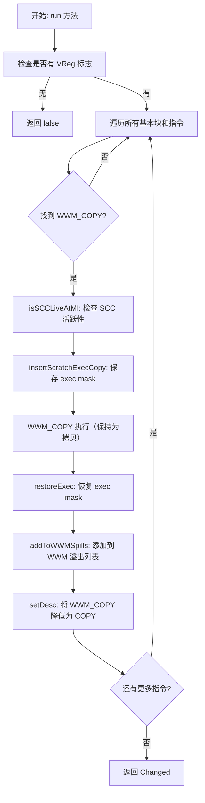

# SILowerWWMCopies.cpp 代码功能分析

## 1. Pass 主要功能概述

<a name="ref-block_0"></a>这个 Pass 的主要功能是**降低（Lower）WWM_COPY 指令**，即在寄存器分配后将 WWM_COPY 指令转换回普通的 COPY 指令，并在其周围插入必要的 exec mask 操作指令来实现"全波模式"（Whole Wave Mode，WWM）的语义。 llvm-project:10-14[<sup>↗</sup>](#block_0) 

**作用与效果：**
- AMDGPU 目标生成 WWM_COPY 指令来区分 WWM 拷贝和普通 COPY
- 该 Pass 生成必要的 exec mask 操作指令来复制"全波模式"的行为
- 最终将 WWM_COPY 降低回普通的 COPY 指令

## 2. 主要功能的实现步骤与子功能

通过遍历代码，我提取了以下关键步骤和子功能：

### 2.1 主循环处理 (`run` 方法)
### 2.2 SCC 活跃性检查 (`isSCCLiveAtMI`)
### 2.3 WWM 溢出管理 (`addToWWMSpills`)
### 2.4 Exec Mask 操作插入
### 2.5 WWM_COPY 降低为 COPY

## 3. 各步骤/子功能的具体描述分析

### 3.1 主循环处理 (`run` 方法)

**功能描述：**
<a name="ref-block_3"></a>这是整个 Pass 的核心执行逻辑。 llvm-project:137-146[<sup>↗</sup>](#block_3) 

<a name="ref-block_4"></a>该方法首先检查函数是否有虚拟寄存器标志，如果没有则提前返回。然后遍历所有基本块和指令，查找 WWM_COPY 指令进行处理。 llvm-project:149-152[<sup>↗</sup>](#block_4) 

**关键操作：**
- 确保处理的是 VGPR 拷贝指令
- 对每个 WWM_COPY 指令执行 exec mask 操作和降低处理

### 3.2 SCC 活跃性检查 (`isSCCLiveAtMI`)

**功能描述：**
<a name="ref-block_1"></a>该函数检查在特定机器指令位置，状态条件码（SCC，Status Condition Code）寄存器是否活跃。 llvm-project:86-96[<sup>↗</sup>](#block_1) 

**实现细节：**
- 如果 LiveIntervals 信息不可用，则保守地假设 SCC 总是活跃的（返回 true）
- 使用 LiveIntervals 分析来获取 SCC 寄存器单元的活跃范围
- 检查指令索引位置的活跃性

**重要性：**
这个信息对于决定如何安全地操作 exec mask 非常关键，因为某些 exec mask 操作会影响 SCC。

### 3.3 WWM 溢出管理 (`addToWWMSpills`)

**功能描述：**
<a name="ref-block_2"></a>如果寄存器被分配了物理 VGPR，将其添加到 WWM 溢出列表中，以便在函数序言/尾声保留其所有通道（lanes）。 llvm-project:98-109[<sup>↗</sup>](#block_2) 

**实现逻辑：**
- 仅处理虚拟寄存器（物理寄存器直接返回）
- 通过 VirtRegMap 获取分配的物理寄存器
- 调用 `allocateWWMSpill` 来分配 WWM 溢出槽

**作用：**
确保 WWM 操作涉及的寄存器在整个函数执行期间保持其完整的波前数据。

### 3.4 Exec Mask 操作插入

**功能描述：**
<a name="ref-block_6"></a>在 WWM_COPY 指令周围插入 exec mask 的保存和恢复操作。 llvm-project:158-164[<sup>↗</sup>](#block_6) 

**具体操作：**
1. **保存 Exec Mask：** 使用 `insertScratchExecCopy` 将当前的 exec mask 保存到临时 SGPR，并根据 SCC 活跃性决定如何保存
2. **恢复 Exec Mask：** 在拷贝指令之后，使用 `restoreExec` 恢复原始的 exec mask

**为什么需要：**
WWM 模式要求操作影响波前中的所有通道，不受当前 exec mask 的限制。因此需要临时修改 exec mask，操作完成后再恢复。

### 3.5 WWM_COPY 降低为 COPY

**功能描述：**
<a name="ref-block_7"></a>在完成所有 exec mask 操作插入后，将 WWM_COPY 指令转换回标准的 COPY 指令。 llvm-project:168-170[<sup>↗</sup>](#block_7) 

**实现：**
简单地修改指令描述符，从 `AMDGPU::WWM_COPY` 改为 `AMDGPU::COPY`，因为此时 WWM 语义已经通过周围的 exec mask 操作实现。

## 4. 步骤/子功能之间的关系

各步骤之间的关系可以用以下流程图表示：



**关系说明：**

1. **顺序依赖关系：**
   - `isSCCLiveAtMI` 必须在 `insertScratchExecCopy` 之前调用，因为保存 exec mask 的方式取决于 SCC 是否活跃
   - exec mask 的保存必须在实际拷贝之前，恢复必须在拷贝之后
   - `addToWWMSpills` 在 exec mask 操作之后调用，确保目标寄存器被正确追踪

2. **数据流关系：**
   - `isSCCLiveAtMI` 的结果直接影响 `insertScratchExecCopy` 的行为
   - WWM_COPY 的目标寄存器信息传递给 `addToWWMSpills`

3. **语义保证关系：**
   - Exec mask 的保存/恢复操作保证了 WWM 语义：操作影响整个波前
   - WWM 溢出管理保证了寄存器数据在函数调用期间的完整性
   - 最终降低为 COPY 确保了后续 Pass 可以正常处理这些指令

## Notes

- 该 Pass 在寄存器分配之后运行，因此处理的是已经分配了物理寄存器的代码
- WWM（Whole Wave Mode）是 AMD GPU 的一个特性，允许操作影响波前中的所有通道，而不仅仅是 exec mask 激活的通道
<a name="ref-block_5"></a>- 代码中有 TODO 注释提到可以优化相邻的 WWM 操作，共享同一个 exec 保存/恢复对 llvm-project:154-154[<sup>↗</sup>](#block_5) 
- 该 Pass 支持新旧两种 Pass 管理器接口（Legacy 和 New Pass Manager）
### Citations
<a name="block_0"></a>**File:** llvm/lib/Target/AMDGPU/SILowerWWMCopies.cpp (L10-14) [<sup>↩</sup>](#ref-block_0)
```cpp
/// Lowering the WWM_COPY instructions for various register classes.
/// AMDGPU target generates WWM_COPY instruction to differentiate WWM
/// copy from COPY. This pass generates the necessary exec mask manipulation
/// instructions to replicate 'Whole Wave Mode' and lowers WWM_COPY back to
/// COPY.
```
<a name="block_1"></a>**File:** llvm/lib/Target/AMDGPU/SILowerWWMCopies.cpp (L86-96) [<sup>↩</sup>](#ref-block_1)
```cpp
bool SILowerWWMCopies::isSCCLiveAtMI(const MachineInstr &MI) {
  // We can't determine the liveness info if LIS isn't available. Early return
  // in that case and always assume SCC is live.
  if (!LIS)
    return true;

  LiveRange &LR =
      LIS->getRegUnit(*MCRegUnitIterator(MCRegister::from(AMDGPU::SCC), TRI));
  SlotIndex Idx = LIS->getInstructionIndex(MI);
  return LR.liveAt(Idx);
}
```
<a name="block_2"></a>**File:** llvm/lib/Target/AMDGPU/SILowerWWMCopies.cpp (L98-109) [<sup>↩</sup>](#ref-block_2)
```cpp
// If \p Reg is assigned with a physical VGPR, add the latter into wwm-spills
// for preserving its entire lanes at function prolog/epilog.
void SILowerWWMCopies::addToWWMSpills(MachineFunction &MF, Register Reg) {
  if (Reg.isPhysical())
    return;

  // FIXME: VRM may be null here.
  MCRegister PhysReg = VRM->getPhys(Reg);
  assert(PhysReg && "should have allocated a physical register");

  MFI->allocateWWMSpill(MF, PhysReg);
}
```
<a name="block_3"></a>**File:** llvm/lib/Target/AMDGPU/SILowerWWMCopies.cpp (L137-146) [<sup>↩</sup>](#ref-block_3)
```cpp
bool SILowerWWMCopies::run(MachineFunction &MF) {
  const GCNSubtarget &ST = MF.getSubtarget<GCNSubtarget>();
  const SIInstrInfo *TII = ST.getInstrInfo();

  MFI = MF.getInfo<SIMachineFunctionInfo>();
  TRI = ST.getRegisterInfo();
  MRI = &MF.getRegInfo();

  if (!MFI->hasVRegFlags())
    return false;
```
<a name="block_4"></a>**File:** llvm/lib/Target/AMDGPU/SILowerWWMCopies.cpp (L149-152) [<sup>↩</sup>](#ref-block_4)
```cpp
  for (MachineBasicBlock &MBB : MF) {
    for (MachineInstr &MI : MBB) {
      if (MI.getOpcode() != AMDGPU::WWM_COPY)
        continue;
```
<a name="block_5"></a>**File:** llvm/lib/Target/AMDGPU/SILowerWWMCopies.cpp (L154-154) [<sup>↩</sup>](#ref-block_5)
```cpp
      // TODO: Club adjacent WWM ops between same exec save/restore
```
<a name="block_6"></a>**File:** llvm/lib/Target/AMDGPU/SILowerWWMCopies.cpp (L158-164) [<sup>↩</sup>](#ref-block_6)
```cpp
      // instruction.
      const DebugLoc &DL = MI.getDebugLoc();
      MachineBasicBlock::iterator InsertPt = MI.getIterator();
      Register RegForExecCopy = MFI->getSGPRForEXECCopy();
      TII->insertScratchExecCopy(MF, MBB, InsertPt, DL, RegForExecCopy,
                                 isSCCLiveAtMI(MI), Indexes);
      TII->restoreExec(MF, MBB, ++InsertPt, DL, RegForExecCopy, Indexes);
```
<a name="block_7"></a>**File:** llvm/lib/Target/AMDGPU/SILowerWWMCopies.cpp (L168-170) [<sup>↩</sup>](#ref-block_7)
```cpp
      // Lower WWM_COPY back to COPY
      MI.setDesc(TII->get(AMDGPU::COPY));
      Changed |= true;
```