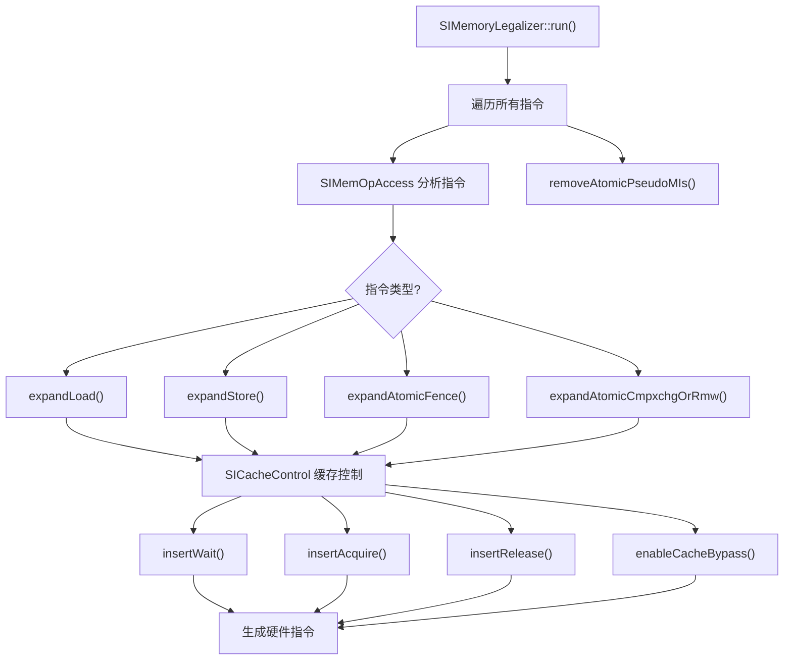

# SIMemoryLegalizer.cpp 代码功能详解

## 1. 主要功能概括

<a name="ref-block_0"></a>`SIMemoryLegalizer.cpp` 实现了 AMDGPU 目标架构的**内存合法化（Memory Legalizer）pass**。 llvm-project:8-13[<sup>↗</sup>](#block_0) 

**主要作用：**
- 实现 AMDGPU 内存模型，确保内存操作遵循正确的内存顺序语义
- 根据原子操作的同步作用域（scope）和内存顺序（ordering）插入必要的同步指令
- 控制缓存行为，包括缓存旁路、缓存失效和写回操作
- 处理 volatile 和 non-temporal 内存访问的特殊语义

**效果：**
将高级的内存顺序语义（如 acquire、release、sequentially consistent）转换为硬件层面的缓存控制指令和等待指令，确保多线程环境下内存操作的正确可见性和顺序性。

## 2. 主要功能步骤和子功能

该 pass 的实现包含以下核心组件和步骤：

### 核心类结构
1. **SIMemOpInfo** - 内存操作信息封装
2. **SIMemOpAccess** - 内存操作分析器
3. **SICacheControl** - 缓存控制抽象基类及其架构特定子类
4. **SIMemoryLegalizer** - 主 pass 实现类

### 主要处理流程
1. 内存操作识别与分析
2. 加载操作扩展
3. 存储操作扩展
4. 原子栅栏扩展
5. 原子 cmpxchg/RMW 扩展
6. 伪指令清理

## 3. 各步骤/子功能的具体描述分析

### 3.1 SIMemOpInfo - 内存操作信息类

<a name="ref-block_1"></a>这个类封装了内存操作的所有相关属性： llvm-project:92-218[<sup>↗</sup>](#block_1) 

**功能：**
- 存储原子顺序（Ordering）、同步作用域（Scope）
- 记录地址空间信息（OrderingAddrSpace、InstrAddrSpace）
- 标识是否为跨地址空间顺序、volatile、non-temporal 或 last-use
- 提供查询接口判断内存操作的各种属性

### 3.2 SIMemOpAccess - 内存操作分析器

<a name="ref-block_2"></a>负责从机器指令中提取内存操作的语义信息： llvm-project:220-266[<sup>↗</sup>](#block_2) 

**关键方法：**

<a name="ref-block_5"></a>**getLoadInfo()** - 提取加载操作信息： llvm-project:855-867[<sup>↗</sup>](#block_5) 

<a name="ref-block_6"></a>**getStoreInfo()** - 提取存储操作信息： llvm-project:869-881[<sup>↗</sup>](#block_6) 

<a name="ref-block_7"></a>**getAtomicFenceInfo()** - 提取原子栅栏信息： llvm-project:883-914[<sup>↗</sup>](#block_7) 

<a name="ref-block_8"></a>**getAtomicCmpxchgOrRmwInfo()** - 提取原子 cmpxchg/RMW 信息： llvm-project:916-928[<sup>↗</sup>](#block_8) 

<a name="ref-block_4"></a>**toSIAtomicScope()** - 将同步作用域 ID 转换为 AMDGPU 特定的作用域： llvm-project:741-773[<sup>↗</sup>](#block_4) 

### 3.3 SICacheControl - 缓存控制层次结构

<a name="ref-block_3"></a>这是一个抽象基类，为不同 GPU 架构提供缓存控制策略： llvm-project:268-364[<sup>↗</sup>](#block_3) 

**架构特定子类：**
- **SIGfx6CacheControl** - GFX6 代缓存控制
- **SIGfx7CacheControl** - GFX7 代缓存控制
- **SIGfx90ACacheControl** - GFX90A 缓存控制
- **SIGfx940CacheControl** - GFX940 缓存控制
- **SIGfx10CacheControl** - GFX10 代缓存控制
- **SIGfx11CacheControl** - GFX11 代缓存控制
- **SIGfx12CacheControl** - GFX12 代缓存控制

<a name="ref-block_9"></a>**工厂方法创建合适的缓存控制器：** llvm-project:946-962[<sup>↗</sup>](#block_9) 

**核心虚函数接口：**

**enableLoadCacheBypass()** - 启用加载缓存旁路
**enableStoreCacheBypass()** - 启用存储缓存旁路
**enableRMWCacheBypass()** - 启用 RMW 缓存旁路
**enableVolatileAndOrNonTemporal()** - 处理 volatile/non-temporal 标记

**insertWait()** - 插入等待指令，确保之前的内存操作完成： llvm-project:332-338 

**insertAcquire()** - 插入 acquire 语义所需的缓存失效指令： llvm-project:345-348 

**insertRelease()** - 插入 release 语义所需的等待和缓存写回指令： llvm-project:356-360 

### 3.4 架构特定实现示例

<a name="ref-block_10"></a>**GFX6 的 insertWait 实现：** llvm-project:1072-1167[<sup>↗</sup>](#block_10) 
- 根据地址空间和同步作用域决定是否需要 VMCnt 或 LGKMCnt
- 生成 S_WAITCNT 指令

<a name="ref-block_11"></a>**GFX10 的 insertAcquire 实现：** llvm-project:2084-2140[<sup>↗</sup>](#block_11) 
- 按照"从外到内"的顺序失效缓存（L1 → L0）
- 使用 BUFFER_GL1_INV 和 BUFFER_GL0_INV 指令

<a name="ref-block_12"></a>**GFX12 的特殊处理：** llvm-project:2553-2589[<sup>↗</sup>](#block_12) 
- 使用 SCOPE 字段直接在指令中编码一致性域
- 支持细粒度的 TH（temporal hint）策略

### 3.5 SIMemoryLegalizer - 主 Pass 类

<a name="ref-block_18"></a>**主入口函数 run()：** llvm-project:2798-2838[<sup>↗</sup>](#block_18) 

遍历所有基本块和指令，根据指令类型调用相应的扩展函数。

<a name="ref-block_14"></a>**expandLoad() - 扩展加载操作：** llvm-project:2602-2644[<sup>↗</sup>](#block_14) 
- 对于 Monotonic/Acquire/SeqCst 原子加载，启用缓存旁路
- 对于 SeqCst，在加载前插入等待
- 对于 Acquire/SeqCst，在加载后插入等待和 acquire 操作
- 处理 volatile 和 non-temporal 属性

<a name="ref-block_15"></a>**expandStore() - 扩展存储操作：** llvm-project:2646-2681[<sup>↗</sup>](#block_15) 
- 对于 Monotonic/Release/SeqCst 原子存储，启用缓存旁路
- 对于 Release/SeqCst，在存储前插入 release 操作
- 处理 volatile 和 non-temporal 属性
- GFX12 特殊处理：扩展系统作用域存储

<a name="ref-block_16"></a>**expandAtomicFence() - 扩展原子栅栏：** llvm-project:2683-2733[<sup>↗</sup>](#block_16) 
- 根据 MMRA（Memory Model Relaxation Annotations）细化栅栏作用的地址空间
- 对于 Acquire，插入等待指令
- 对于 Release/AcquireRelease/SeqCst，插入 release 操作
- 对于 Acquire/AcquireRelease/SeqCst，插入 acquire 操作
- 将 ATOMIC_FENCE 伪指令加入待删除列表

<a name="ref-block_17"></a>**expandAtomicCmpxchgOrRmw() - 扩展原子 cmpxchg/RMW：** llvm-project:2735-2778[<sup>↗</sup>](#block_17) 
- 启用 RMW 缓存旁路
- 根据 ordering 和 failure ordering 插入 release 和 acquire 操作
- 区分有返回值和无返回值的原子操作

<a name="ref-block_13"></a>**removeAtomicPseudoMIs() - 清理伪指令：** llvm-project:2591-2600[<sup>↗</sup>](#block_13) 

## 4. 步骤/子功能之间的关系

### 整体架构关系



### 数据流关系

1. **分析阶段：** `SIMemOpAccess` 从机器指令的内存操作数（MMO）中提取语义信息，构造 `SIMemOpInfo` 对象

2. **决策阶段：** 四个 expand 函数根据 `SIMemOpInfo` 中的 ordering、scope、地址空间等信息，决定需要执行哪些缓存控制操作

3. **执行阶段：** `SICacheControl` 的架构特定子类根据目标 GPU 的特性，生成相应的硬件指令序列

### 功能协作关系

**内存顺序实现：**
- **Acquire 语义** = insertWait（确保加载完成） + insertAcquire（失效缓存）
- **Release 语义** = insertRelease（等待并写回缓存）
- **SeqCst 语义** = Release + Acquire 的组合，可能需要额外的全局同步

**缓存一致性策略：**
- 不同作用域需要不同的缓存控制粒度
  - **SYSTEM/AGENT 作用域** - 需要旁路/失效所有缓存层级
  - **WORKGROUP 作用域** - 只需处理 CU 间的缓存一致性
  - **WAVEFRONT 作用域** - 硬件保证一致性，无需额外操作

**架构演进适配：**
- 每个 GPU 架构有不同的缓存层次和指令集
- 通过继承层次适配不同架构的特性
- 新架构（如 GFX12）引入了指令级 SCOPE 字段，简化了控制逻辑

## Notes

这个 pass 是 AMDGPU 后端实现 C++/OpenCL/HIP 等语言内存模型的关键组件。它将抽象的内存顺序语义映射到具体的硬件操作，确保在 GPU 的复杂缓存层次结构中实现正确的内存可见性和顺序性。不同 GPU 架构之间的差异通过继承体系优雅地处理，每个子类只需覆盖其架构特定的行为。
### Citations
<a name="block_0"></a>**File:** llvm/lib/Target/AMDGPU/SIMemoryLegalizer.cpp (L8-13) [<sup>↩</sup>](#ref-block_0)
```cpp
//
/// \file
/// Memory legalizer - implements memory model. More information can be
/// found here:
///   http://llvm.org/docs/AMDGPUUsage.html#memory-model
//
```
<a name="block_1"></a>**File:** llvm/lib/Target/AMDGPU/SIMemoryLegalizer.cpp (L92-218) [<sup>↩</sup>](#ref-block_1)
```cpp
class SIMemOpInfo final {
private:

  friend class SIMemOpAccess;

  AtomicOrdering Ordering = AtomicOrdering::NotAtomic;
  AtomicOrdering FailureOrdering = AtomicOrdering::NotAtomic;
  SIAtomicScope Scope = SIAtomicScope::SYSTEM;
  SIAtomicAddrSpace OrderingAddrSpace = SIAtomicAddrSpace::NONE;
  SIAtomicAddrSpace InstrAddrSpace = SIAtomicAddrSpace::NONE;
  bool IsCrossAddressSpaceOrdering = false;
  bool IsVolatile = false;
  bool IsNonTemporal = false;
  bool IsLastUse = false;

  SIMemOpInfo(
      AtomicOrdering Ordering = AtomicOrdering::SequentiallyConsistent,
      SIAtomicScope Scope = SIAtomicScope::SYSTEM,
      SIAtomicAddrSpace OrderingAddrSpace = SIAtomicAddrSpace::ATOMIC,
      SIAtomicAddrSpace InstrAddrSpace = SIAtomicAddrSpace::ALL,
      bool IsCrossAddressSpaceOrdering = true,
      AtomicOrdering FailureOrdering = AtomicOrdering::SequentiallyConsistent,
      bool IsVolatile = false, bool IsNonTemporal = false,
      bool IsLastUse = false)
      : Ordering(Ordering), FailureOrdering(FailureOrdering), Scope(Scope),
        OrderingAddrSpace(OrderingAddrSpace), InstrAddrSpace(InstrAddrSpace),
        IsCrossAddressSpaceOrdering(IsCrossAddressSpaceOrdering),
        IsVolatile(IsVolatile), IsNonTemporal(IsNonTemporal),
        IsLastUse(IsLastUse) {

    if (Ordering == AtomicOrdering::NotAtomic) {
      assert(Scope == SIAtomicScope::NONE &&
             OrderingAddrSpace == SIAtomicAddrSpace::NONE &&
             !IsCrossAddressSpaceOrdering &&
             FailureOrdering == AtomicOrdering::NotAtomic);
      return;
    }

    assert(Scope != SIAtomicScope::NONE &&
           (OrderingAddrSpace & SIAtomicAddrSpace::ATOMIC) !=
               SIAtomicAddrSpace::NONE &&
           (InstrAddrSpace & SIAtomicAddrSpace::ATOMIC) !=
               SIAtomicAddrSpace::NONE);

    // There is also no cross address space ordering if the ordering
    // address space is the same as the instruction address space and
    // only contains a single address space.
    if ((OrderingAddrSpace == InstrAddrSpace) &&
        isPowerOf2_32(uint32_t(InstrAddrSpace)))
      this->IsCrossAddressSpaceOrdering = false;

    // Limit the scope to the maximum supported by the instruction's address
    // spaces.
    if ((InstrAddrSpace & ~SIAtomicAddrSpace::SCRATCH) ==
        SIAtomicAddrSpace::NONE) {
      this->Scope = std::min(Scope, SIAtomicScope::SINGLETHREAD);
    } else if ((InstrAddrSpace &
                ~(SIAtomicAddrSpace::SCRATCH | SIAtomicAddrSpace::LDS)) ==
               SIAtomicAddrSpace::NONE) {
      this->Scope = std::min(Scope, SIAtomicScope::WORKGROUP);
    } else if ((InstrAddrSpace &
                ~(SIAtomicAddrSpace::SCRATCH | SIAtomicAddrSpace::LDS |
                  SIAtomicAddrSpace::GDS)) == SIAtomicAddrSpace::NONE) {
      this->Scope = std::min(Scope, SIAtomicScope::AGENT);
    }
  }

public:
  /// \returns Atomic synchronization scope of the machine instruction used to
  /// create this SIMemOpInfo.
  SIAtomicScope getScope() const {
    return Scope;
  }

  /// \returns Ordering constraint of the machine instruction used to
  /// create this SIMemOpInfo.
  AtomicOrdering getOrdering() const {
    return Ordering;
  }

  /// \returns Failure ordering constraint of the machine instruction used to
  /// create this SIMemOpInfo.
  AtomicOrdering getFailureOrdering() const {
    return FailureOrdering;
  }

  /// \returns The address spaces be accessed by the machine
  /// instruction used to create this SIMemOpInfo.
  SIAtomicAddrSpace getInstrAddrSpace() const {
    return InstrAddrSpace;
  }

  /// \returns The address spaces that must be ordered by the machine
  /// instruction used to create this SIMemOpInfo.
  SIAtomicAddrSpace getOrderingAddrSpace() const {
    return OrderingAddrSpace;
  }

  /// \returns Return true iff memory ordering of operations on
  /// different address spaces is required.
  bool getIsCrossAddressSpaceOrdering() const {
    return IsCrossAddressSpaceOrdering;
  }

  /// \returns True if memory access of the machine instruction used to
  /// create this SIMemOpInfo is volatile, false otherwise.
  bool isVolatile() const {
    return IsVolatile;
  }

  /// \returns True if memory access of the machine instruction used to
  /// create this SIMemOpInfo is nontemporal, false otherwise.
  bool isNonTemporal() const {
    return IsNonTemporal;
  }

  /// \returns True if memory access of the machine instruction used to
  /// create this SIMemOpInfo is last use, false otherwise.
  bool isLastUse() const { return IsLastUse; }

  /// \returns True if ordering constraint of the machine instruction used to
  /// create this SIMemOpInfo is unordered or higher, false otherwise.
  bool isAtomic() const {
    return Ordering != AtomicOrdering::NotAtomic;
  }

};
```
<a name="block_2"></a>**File:** llvm/lib/Target/AMDGPU/SIMemoryLegalizer.cpp (L220-266) [<sup>↩</sup>](#ref-block_2)
```cpp
class SIMemOpAccess final {
private:
  const AMDGPUMachineModuleInfo *MMI = nullptr;

  /// Reports unsupported message \p Msg for \p MI to LLVM context.
  void reportUnsupported(const MachineBasicBlock::iterator &MI,
                         const char *Msg) const;

  /// Inspects the target synchronization scope \p SSID and determines
  /// the SI atomic scope it corresponds to, the address spaces it
  /// covers, and whether the memory ordering applies between address
  /// spaces.
  std::optional<std::tuple<SIAtomicScope, SIAtomicAddrSpace, bool>>
  toSIAtomicScope(SyncScope::ID SSID, SIAtomicAddrSpace InstrAddrSpace) const;

  /// \return Return a bit set of the address spaces accessed by \p AS.
  SIAtomicAddrSpace toSIAtomicAddrSpace(unsigned AS) const;

  /// \returns Info constructed from \p MI, which has at least machine memory
  /// operand.
  std::optional<SIMemOpInfo>
  constructFromMIWithMMO(const MachineBasicBlock::iterator &MI) const;

public:
  /// Construct class to support accessing the machine memory operands
  /// of instructions in the machine function \p MF.
  SIMemOpAccess(const AMDGPUMachineModuleInfo &MMI);

  /// \returns Load info if \p MI is a load operation, "std::nullopt" otherwise.
  std::optional<SIMemOpInfo>
  getLoadInfo(const MachineBasicBlock::iterator &MI) const;

  /// \returns Store info if \p MI is a store operation, "std::nullopt"
  /// otherwise.
  std::optional<SIMemOpInfo>
  getStoreInfo(const MachineBasicBlock::iterator &MI) const;

  /// \returns Atomic fence info if \p MI is an atomic fence operation,
  /// "std::nullopt" otherwise.
  std::optional<SIMemOpInfo>
  getAtomicFenceInfo(const MachineBasicBlock::iterator &MI) const;

  /// \returns Atomic cmpxchg/rmw info if \p MI is an atomic cmpxchg or
  /// rmw operation, "std::nullopt" otherwise.
  std::optional<SIMemOpInfo>
  getAtomicCmpxchgOrRmwInfo(const MachineBasicBlock::iterator &MI) const;
};
```
<a name="block_3"></a>**File:** llvm/lib/Target/AMDGPU/SIMemoryLegalizer.cpp (L268-364) [<sup>↩</sup>](#ref-block_3)
```cpp
class SICacheControl {
protected:

  /// AMDGPU subtarget info.
  const GCNSubtarget &ST;

  /// Instruction info.
  const SIInstrInfo *TII = nullptr;

  IsaVersion IV;

  /// Whether to insert cache invalidating instructions.
  bool InsertCacheInv;

  SICacheControl(const GCNSubtarget &ST);

  /// Sets named bit \p BitName to "true" if present in instruction \p MI.
  /// \returns Returns true if \p MI is modified, false otherwise.
  bool enableNamedBit(const MachineBasicBlock::iterator MI,
                      AMDGPU::CPol::CPol Bit) const;

public:

  /// Create a cache control for the subtarget \p ST.
  static std::unique_ptr<SICacheControl> create(const GCNSubtarget &ST);

  /// Update \p MI memory load instruction to bypass any caches up to
  /// the \p Scope memory scope for address spaces \p
  /// AddrSpace. Return true iff the instruction was modified.
  virtual bool enableLoadCacheBypass(const MachineBasicBlock::iterator &MI,
                                     SIAtomicScope Scope,
                                     SIAtomicAddrSpace AddrSpace) const = 0;

  /// Update \p MI memory store instruction to bypass any caches up to
  /// the \p Scope memory scope for address spaces \p
  /// AddrSpace. Return true iff the instruction was modified.
  virtual bool enableStoreCacheBypass(const MachineBasicBlock::iterator &MI,
                                      SIAtomicScope Scope,
                                      SIAtomicAddrSpace AddrSpace) const = 0;

  /// Update \p MI memory read-modify-write instruction to bypass any caches up
  /// to the \p Scope memory scope for address spaces \p AddrSpace. Return true
  /// iff the instruction was modified.
  virtual bool enableRMWCacheBypass(const MachineBasicBlock::iterator &MI,
                                    SIAtomicScope Scope,
                                    SIAtomicAddrSpace AddrSpace) const = 0;

  /// Update \p MI memory instruction of kind \p Op associated with address
  /// spaces \p AddrSpace to indicate it is volatile and/or
  /// nontemporal/last-use. Return true iff the instruction was modified.
  virtual bool enableVolatileAndOrNonTemporal(MachineBasicBlock::iterator &MI,
                                              SIAtomicAddrSpace AddrSpace,
                                              SIMemOp Op, bool IsVolatile,
                                              bool IsNonTemporal,
                                              bool IsLastUse = false) const = 0;

  virtual bool expandSystemScopeStore(MachineBasicBlock::iterator &MI) const {
    return false;
  };

  /// Inserts any necessary instructions at position \p Pos relative
  /// to instruction \p MI to ensure memory instructions before \p Pos of kind
  /// \p Op associated with address spaces \p AddrSpace have completed. Used
  /// between memory instructions to enforce the order they become visible as
  /// observed by other memory instructions executing in memory scope \p Scope.
  /// \p IsCrossAddrSpaceOrdering indicates if the memory ordering is between
  /// address spaces. Returns true iff any instructions inserted.
  virtual bool insertWait(MachineBasicBlock::iterator &MI, SIAtomicScope Scope,
                          SIAtomicAddrSpace AddrSpace, SIMemOp Op,
                          bool IsCrossAddrSpaceOrdering, Position Pos,
                          AtomicOrdering Order) const = 0;

  /// Inserts any necessary instructions at position \p Pos relative to
  /// instruction \p MI to ensure any subsequent memory instructions of this
  /// thread with address spaces \p AddrSpace will observe the previous memory
  /// operations by any thread for memory scopes up to memory scope \p Scope .
  /// Returns true iff any instructions inserted.
  virtual bool insertAcquire(MachineBasicBlock::iterator &MI,
                             SIAtomicScope Scope,
                             SIAtomicAddrSpace AddrSpace,
                             Position Pos) const = 0;

  /// Inserts any necessary instructions at position \p Pos relative to
  /// instruction \p MI to ensure previous memory instructions by this thread
  /// with address spaces \p AddrSpace have completed and can be observed by
  /// subsequent memory instructions by any thread executing in memory scope \p
  /// Scope. \p IsCrossAddrSpaceOrdering indicates if the memory ordering is
  /// between address spaces. Returns true iff any instructions inserted.
  virtual bool insertRelease(MachineBasicBlock::iterator &MI,
                             SIAtomicScope Scope,
                             SIAtomicAddrSpace AddrSpace,
                             bool IsCrossAddrSpaceOrdering,
                             Position Pos) const = 0;

  /// Virtual destructor to allow derivations to be deleted.
  virtual ~SICacheControl() = default;
};
```
<a name="block_4"></a>**File:** llvm/lib/Target/AMDGPU/SIMemoryLegalizer.cpp (L741-773) [<sup>↩</sup>](#ref-block_4)
```cpp
std::optional<std::tuple<SIAtomicScope, SIAtomicAddrSpace, bool>>
SIMemOpAccess::toSIAtomicScope(SyncScope::ID SSID,
                               SIAtomicAddrSpace InstrAddrSpace) const {
  if (SSID == SyncScope::System)
    return std::tuple(SIAtomicScope::SYSTEM, SIAtomicAddrSpace::ATOMIC, true);
  if (SSID == MMI->getAgentSSID())
    return std::tuple(SIAtomicScope::AGENT, SIAtomicAddrSpace::ATOMIC, true);
  if (SSID == MMI->getWorkgroupSSID())
    return std::tuple(SIAtomicScope::WORKGROUP, SIAtomicAddrSpace::ATOMIC,
                      true);
  if (SSID == MMI->getWavefrontSSID())
    return std::tuple(SIAtomicScope::WAVEFRONT, SIAtomicAddrSpace::ATOMIC,
                      true);
  if (SSID == SyncScope::SingleThread)
    return std::tuple(SIAtomicScope::SINGLETHREAD, SIAtomicAddrSpace::ATOMIC,
                      true);
  if (SSID == MMI->getSystemOneAddressSpaceSSID())
    return std::tuple(SIAtomicScope::SYSTEM,
                      SIAtomicAddrSpace::ATOMIC & InstrAddrSpace, false);
  if (SSID == MMI->getAgentOneAddressSpaceSSID())
    return std::tuple(SIAtomicScope::AGENT,
                      SIAtomicAddrSpace::ATOMIC & InstrAddrSpace, false);
  if (SSID == MMI->getWorkgroupOneAddressSpaceSSID())
    return std::tuple(SIAtomicScope::WORKGROUP,
                      SIAtomicAddrSpace::ATOMIC & InstrAddrSpace, false);
  if (SSID == MMI->getWavefrontOneAddressSpaceSSID())
    return std::tuple(SIAtomicScope::WAVEFRONT,
                      SIAtomicAddrSpace::ATOMIC & InstrAddrSpace, false);
  if (SSID == MMI->getSingleThreadOneAddressSpaceSSID())
    return std::tuple(SIAtomicScope::SINGLETHREAD,
                      SIAtomicAddrSpace::ATOMIC & InstrAddrSpace, false);
  return std::nullopt;
}
```
<a name="block_5"></a>**File:** llvm/lib/Target/AMDGPU/SIMemoryLegalizer.cpp (L855-867) [<sup>↩</sup>](#ref-block_5)
```cpp
std::optional<SIMemOpInfo>
SIMemOpAccess::getLoadInfo(const MachineBasicBlock::iterator &MI) const {
  assert(MI->getDesc().TSFlags & SIInstrFlags::maybeAtomic);

  if (!(MI->mayLoad() && !MI->mayStore()))
    return std::nullopt;

  // Be conservative if there are no memory operands.
  if (MI->getNumMemOperands() == 0)
    return SIMemOpInfo();

  return constructFromMIWithMMO(MI);
}
```
<a name="block_6"></a>**File:** llvm/lib/Target/AMDGPU/SIMemoryLegalizer.cpp (L869-881) [<sup>↩</sup>](#ref-block_6)
```cpp
std::optional<SIMemOpInfo>
SIMemOpAccess::getStoreInfo(const MachineBasicBlock::iterator &MI) const {
  assert(MI->getDesc().TSFlags & SIInstrFlags::maybeAtomic);

  if (!(!MI->mayLoad() && MI->mayStore()))
    return std::nullopt;

  // Be conservative if there are no memory operands.
  if (MI->getNumMemOperands() == 0)
    return SIMemOpInfo();

  return constructFromMIWithMMO(MI);
}
```
<a name="block_7"></a>**File:** llvm/lib/Target/AMDGPU/SIMemoryLegalizer.cpp (L883-914) [<sup>↩</sup>](#ref-block_7)
```cpp
std::optional<SIMemOpInfo>
SIMemOpAccess::getAtomicFenceInfo(const MachineBasicBlock::iterator &MI) const {
  assert(MI->getDesc().TSFlags & SIInstrFlags::maybeAtomic);

  if (MI->getOpcode() != AMDGPU::ATOMIC_FENCE)
    return std::nullopt;

  AtomicOrdering Ordering =
    static_cast<AtomicOrdering>(MI->getOperand(0).getImm());

  SyncScope::ID SSID = static_cast<SyncScope::ID>(MI->getOperand(1).getImm());
  auto ScopeOrNone = toSIAtomicScope(SSID, SIAtomicAddrSpace::ATOMIC);
  if (!ScopeOrNone) {
    reportUnsupported(MI, "Unsupported atomic synchronization scope");
    return std::nullopt;
  }

  SIAtomicScope Scope = SIAtomicScope::NONE;
  SIAtomicAddrSpace OrderingAddrSpace = SIAtomicAddrSpace::NONE;
  bool IsCrossAddressSpaceOrdering = false;
  std::tie(Scope, OrderingAddrSpace, IsCrossAddressSpaceOrdering) =
      *ScopeOrNone;

  if ((OrderingAddrSpace == SIAtomicAddrSpace::NONE) ||
      ((OrderingAddrSpace & SIAtomicAddrSpace::ATOMIC) != OrderingAddrSpace)) {
    reportUnsupported(MI, "Unsupported atomic address space");
    return std::nullopt;
  }

  return SIMemOpInfo(Ordering, Scope, OrderingAddrSpace, SIAtomicAddrSpace::ATOMIC,
                     IsCrossAddressSpaceOrdering, AtomicOrdering::NotAtomic);
}
```
<a name="block_8"></a>**File:** llvm/lib/Target/AMDGPU/SIMemoryLegalizer.cpp (L916-928) [<sup>↩</sup>](#ref-block_8)
```cpp
std::optional<SIMemOpInfo> SIMemOpAccess::getAtomicCmpxchgOrRmwInfo(
    const MachineBasicBlock::iterator &MI) const {
  assert(MI->getDesc().TSFlags & SIInstrFlags::maybeAtomic);

  if (!(MI->mayLoad() && MI->mayStore()))
    return std::nullopt;

  // Be conservative if there are no memory operands.
  if (MI->getNumMemOperands() == 0)
    return SIMemOpInfo();

  return constructFromMIWithMMO(MI);
}
```
<a name="block_9"></a>**File:** llvm/lib/Target/AMDGPU/SIMemoryLegalizer.cpp (L946-962) [<sup>↩</sup>](#ref-block_9)
```cpp
/* static */
std::unique_ptr<SICacheControl> SICacheControl::create(const GCNSubtarget &ST) {
  GCNSubtarget::Generation Generation = ST.getGeneration();
  if (ST.hasGFX940Insts())
    return std::make_unique<SIGfx940CacheControl>(ST);
  if (ST.hasGFX90AInsts())
    return std::make_unique<SIGfx90ACacheControl>(ST);
  if (Generation <= AMDGPUSubtarget::SOUTHERN_ISLANDS)
    return std::make_unique<SIGfx6CacheControl>(ST);
  if (Generation < AMDGPUSubtarget::GFX10)
    return std::make_unique<SIGfx7CacheControl>(ST);
  if (Generation < AMDGPUSubtarget::GFX11)
    return std::make_unique<SIGfx10CacheControl>(ST);
  if (Generation < AMDGPUSubtarget::GFX12)
    return std::make_unique<SIGfx11CacheControl>(ST);
  return std::make_unique<SIGfx12CacheControl>(ST);
}
```
<a name="block_10"></a>**File:** llvm/lib/Target/AMDGPU/SIMemoryLegalizer.cpp (L1072-1167) [<sup>↩</sup>](#ref-block_10)
```cpp
bool SIGfx6CacheControl::insertWait(MachineBasicBlock::iterator &MI,
                                    SIAtomicScope Scope,
                                    SIAtomicAddrSpace AddrSpace, SIMemOp Op,
                                    bool IsCrossAddrSpaceOrdering, Position Pos,
                                    AtomicOrdering Order) const {
  bool Changed = false;

  MachineBasicBlock &MBB = *MI->getParent();
  DebugLoc DL = MI->getDebugLoc();

  if (Pos == Position::AFTER)
    ++MI;

  bool VMCnt = false;
  bool LGKMCnt = false;

  if ((AddrSpace & (SIAtomicAddrSpace::GLOBAL | SIAtomicAddrSpace::SCRATCH)) !=
      SIAtomicAddrSpace::NONE) {
    switch (Scope) {
    case SIAtomicScope::SYSTEM:
    case SIAtomicScope::AGENT:
      VMCnt |= true;
      break;
    case SIAtomicScope::WORKGROUP:
    case SIAtomicScope::WAVEFRONT:
    case SIAtomicScope::SINGLETHREAD:
      // The L1 cache keeps all memory operations in order for
      // wavefronts in the same work-group.
      break;
    default:
      llvm_unreachable("Unsupported synchronization scope");
    }
  }

  if ((AddrSpace & SIAtomicAddrSpace::LDS) != SIAtomicAddrSpace::NONE) {
    switch (Scope) {
    case SIAtomicScope::SYSTEM:
    case SIAtomicScope::AGENT:
    case SIAtomicScope::WORKGROUP:
      // If no cross address space ordering then an "S_WAITCNT lgkmcnt(0)" is
      // not needed as LDS operations for all waves are executed in a total
      // global ordering as observed by all waves. Required if also
      // synchronizing with global/GDS memory as LDS operations could be
      // reordered with respect to later global/GDS memory operations of the
      // same wave.
      LGKMCnt |= IsCrossAddrSpaceOrdering;
      break;
    case SIAtomicScope::WAVEFRONT:
    case SIAtomicScope::SINGLETHREAD:
      // The LDS keeps all memory operations in order for
      // the same wavefront.
      break;
    default:
      llvm_unreachable("Unsupported synchronization scope");
    }
  }

  if ((AddrSpace & SIAtomicAddrSpace::GDS) != SIAtomicAddrSpace::NONE) {
    switch (Scope) {
    case SIAtomicScope::SYSTEM:
    case SIAtomicScope::AGENT:
      // If no cross address space ordering then an GDS "S_WAITCNT lgkmcnt(0)"
      // is not needed as GDS operations for all waves are executed in a total
      // global ordering as observed by all waves. Required if also
      // synchronizing with global/LDS memory as GDS operations could be
      // reordered with respect to later global/LDS memory operations of the
      // same wave.
      LGKMCnt |= IsCrossAddrSpaceOrdering;
      break;
    case SIAtomicScope::WORKGROUP:
    case SIAtomicScope::WAVEFRONT:
    case SIAtomicScope::SINGLETHREAD:
      // The GDS keeps all memory operations in order for
      // the same work-group.
      break;
    default:
      llvm_unreachable("Unsupported synchronization scope");
    }
  }

  if (VMCnt || LGKMCnt) {
    unsigned WaitCntImmediate =
      AMDGPU::encodeWaitcnt(IV,
                            VMCnt ? 0 : getVmcntBitMask(IV),
                            getExpcntBitMask(IV),
                            LGKMCnt ? 0 : getLgkmcntBitMask(IV));
    BuildMI(MBB, MI, DL, TII->get(AMDGPU::S_WAITCNT_soft))
        .addImm(WaitCntImmediate);
    Changed = true;
  }

  if (Pos == Position::AFTER)
    --MI;

  return Changed;
}
```
<a name="block_11"></a>**File:** llvm/lib/Target/AMDGPU/SIMemoryLegalizer.cpp (L2084-2140) [<sup>↩</sup>](#ref-block_11)
```cpp
bool SIGfx10CacheControl::insertAcquire(MachineBasicBlock::iterator &MI,
                                        SIAtomicScope Scope,
                                        SIAtomicAddrSpace AddrSpace,
                                        Position Pos) const {
  if (!InsertCacheInv)
    return false;

  bool Changed = false;

  MachineBasicBlock &MBB = *MI->getParent();
  DebugLoc DL = MI->getDebugLoc();

  if (Pos == Position::AFTER)
    ++MI;

  if ((AddrSpace & SIAtomicAddrSpace::GLOBAL) != SIAtomicAddrSpace::NONE) {
    switch (Scope) {
    case SIAtomicScope::SYSTEM:
    case SIAtomicScope::AGENT:
      // The order of invalidates matter here. We must invalidate "outer in"
      // so L1 -> L0 to avoid L0 pulling in stale data from L1 when it is
      // invalidated.
      BuildMI(MBB, MI, DL, TII->get(AMDGPU::BUFFER_GL1_INV));
      BuildMI(MBB, MI, DL, TII->get(AMDGPU::BUFFER_GL0_INV));
      Changed = true;
      break;
    case SIAtomicScope::WORKGROUP:
      // In WGP mode the waves of a work-group can be executing on either CU of
      // the WGP. Therefore need to invalidate the L0 which is per CU. Otherwise
      // in CU mode and all waves of a work-group are on the same CU, and so the
      // L0 does not need to be invalidated.
      if (!ST.isCuModeEnabled()) {
        BuildMI(MBB, MI, DL, TII->get(AMDGPU::BUFFER_GL0_INV));
        Changed = true;
      }
      break;
    case SIAtomicScope::WAVEFRONT:
    case SIAtomicScope::SINGLETHREAD:
      // No cache to invalidate.
      break;
    default:
      llvm_unreachable("Unsupported synchronization scope");
    }
  }

  /// The scratch address space does not need the global memory cache
  /// to be flushed as all memory operations by the same thread are
  /// sequentially consistent, and no other thread can access scratch
  /// memory.

  /// Other address spaces do not have a cache.

  if (Pos == Position::AFTER)
    --MI;

  return Changed;
}
```
<a name="block_12"></a>**File:** llvm/lib/Target/AMDGPU/SIMemoryLegalizer.cpp (L2553-2589) [<sup>↩</sup>](#ref-block_12)
```cpp
bool SIGfx12CacheControl::setAtomicScope(const MachineBasicBlock::iterator &MI,
                                         SIAtomicScope Scope,
                                         SIAtomicAddrSpace AddrSpace) const {
  bool Changed = false;

  if ((AddrSpace & SIAtomicAddrSpace::GLOBAL) != SIAtomicAddrSpace::NONE) {
    switch (Scope) {
    case SIAtomicScope::SYSTEM:
      Changed |= setScope(MI, AMDGPU::CPol::SCOPE_SYS);
      break;
    case SIAtomicScope::AGENT:
      Changed |= setScope(MI, AMDGPU::CPol::SCOPE_DEV);
      break;
    case SIAtomicScope::WORKGROUP:
      // In workgroup mode, SCOPE_SE is needed as waves can executes on
      // different CUs that access different L0s.
      if (!ST.isCuModeEnabled())
        Changed |= setScope(MI, AMDGPU::CPol::SCOPE_SE);
      break;
    case SIAtomicScope::WAVEFRONT:
    case SIAtomicScope::SINGLETHREAD:
      // No cache to bypass.
      break;
    default:
      llvm_unreachable("Unsupported synchronization scope");
    }
  }

  // The scratch address space does not need the global memory caches
  // to be bypassed as all memory operations by the same thread are
  // sequentially consistent, and no other thread can access scratch
  // memory.

  // Other address spaces do not have a cache.

  return Changed;
}
```
<a name="block_13"></a>**File:** llvm/lib/Target/AMDGPU/SIMemoryLegalizer.cpp (L2591-2600) [<sup>↩</sup>](#ref-block_13)
```cpp
bool SIMemoryLegalizer::removeAtomicPseudoMIs() {
  if (AtomicPseudoMIs.empty())
    return false;

  for (auto &MI : AtomicPseudoMIs)
    MI->eraseFromParent();

  AtomicPseudoMIs.clear();
  return true;
}
```
<a name="block_14"></a>**File:** llvm/lib/Target/AMDGPU/SIMemoryLegalizer.cpp (L2602-2644) [<sup>↩</sup>](#ref-block_14)
```cpp
bool SIMemoryLegalizer::expandLoad(const SIMemOpInfo &MOI,
                                   MachineBasicBlock::iterator &MI) {
  assert(MI->mayLoad() && !MI->mayStore());

  bool Changed = false;

  if (MOI.isAtomic()) {
    const AtomicOrdering Order = MOI.getOrdering();
    if (Order == AtomicOrdering::Monotonic ||
        Order == AtomicOrdering::Acquire ||
        Order == AtomicOrdering::SequentiallyConsistent) {
      Changed |= CC->enableLoadCacheBypass(MI, MOI.getScope(),
                                           MOI.getOrderingAddrSpace());
    }

    if (Order == AtomicOrdering::SequentiallyConsistent)
      Changed |= CC->insertWait(MI, MOI.getScope(), MOI.getOrderingAddrSpace(),
                                SIMemOp::LOAD | SIMemOp::STORE,
                                MOI.getIsCrossAddressSpaceOrdering(),
                                Position::BEFORE, Order);

    if (Order == AtomicOrdering::Acquire ||
        Order == AtomicOrdering::SequentiallyConsistent) {
      Changed |= CC->insertWait(
          MI, MOI.getScope(), MOI.getInstrAddrSpace(), SIMemOp::LOAD,
          MOI.getIsCrossAddressSpaceOrdering(), Position::AFTER, Order);
      Changed |= CC->insertAcquire(MI, MOI.getScope(),
                                   MOI.getOrderingAddrSpace(),
                                   Position::AFTER);
    }

    return Changed;
  }

  // Atomic instructions already bypass caches to the scope specified by the
  // SyncScope operand. Only non-atomic volatile and nontemporal/last-use
  // instructions need additional treatment.
  Changed |= CC->enableVolatileAndOrNonTemporal(
      MI, MOI.getInstrAddrSpace(), SIMemOp::LOAD, MOI.isVolatile(),
      MOI.isNonTemporal(), MOI.isLastUse());

  return Changed;
}
```
<a name="block_15"></a>**File:** llvm/lib/Target/AMDGPU/SIMemoryLegalizer.cpp (L2646-2681) [<sup>↩</sup>](#ref-block_15)
```cpp
bool SIMemoryLegalizer::expandStore(const SIMemOpInfo &MOI,
                                    MachineBasicBlock::iterator &MI) {
  assert(!MI->mayLoad() && MI->mayStore());

  bool Changed = false;

  if (MOI.isAtomic()) {
    if (MOI.getOrdering() == AtomicOrdering::Monotonic ||
        MOI.getOrdering() == AtomicOrdering::Release ||
        MOI.getOrdering() == AtomicOrdering::SequentiallyConsistent) {
      Changed |= CC->enableStoreCacheBypass(MI, MOI.getScope(),
                                            MOI.getOrderingAddrSpace());
    }

    if (MOI.getOrdering() == AtomicOrdering::Release ||
        MOI.getOrdering() == AtomicOrdering::SequentiallyConsistent)
      Changed |= CC->insertRelease(MI, MOI.getScope(),
                                   MOI.getOrderingAddrSpace(),
                                   MOI.getIsCrossAddressSpaceOrdering(),
                                   Position::BEFORE);

    return Changed;
  }

  // Atomic instructions already bypass caches to the scope specified by the
  // SyncScope operand. Only non-atomic volatile and nontemporal instructions
  // need additional treatment.
  Changed |= CC->enableVolatileAndOrNonTemporal(
      MI, MOI.getInstrAddrSpace(), SIMemOp::STORE, MOI.isVolatile(),
      MOI.isNonTemporal());

  // GFX12 specific, scope(desired coherence domain in cache hierarchy) is
  // instruction field, do not confuse it with atomic scope.
  Changed |= CC->expandSystemScopeStore(MI);
  return Changed;
}
```
<a name="block_16"></a>**File:** llvm/lib/Target/AMDGPU/SIMemoryLegalizer.cpp (L2683-2733) [<sup>↩</sup>](#ref-block_16)
```cpp
bool SIMemoryLegalizer::expandAtomicFence(const SIMemOpInfo &MOI,
                                          MachineBasicBlock::iterator &MI) {
  assert(MI->getOpcode() == AMDGPU::ATOMIC_FENCE);

  AtomicPseudoMIs.push_back(MI);
  bool Changed = false;

  // Refine fenced address space based on MMRAs.
  //
  // TODO: Should we support this MMRA on other atomic operations?
  auto OrderingAddrSpace =
      getFenceAddrSpaceMMRA(*MI, MOI.getOrderingAddrSpace());

  if (MOI.isAtomic()) {
    const AtomicOrdering Order = MOI.getOrdering();
    if (Order == AtomicOrdering::Acquire) {
      Changed |= CC->insertWait(
          MI, MOI.getScope(), OrderingAddrSpace, SIMemOp::LOAD | SIMemOp::STORE,
          MOI.getIsCrossAddressSpaceOrdering(), Position::BEFORE, Order);
    }

    if (Order == AtomicOrdering::Release ||
        Order == AtomicOrdering::AcquireRelease ||
        Order == AtomicOrdering::SequentiallyConsistent)
      /// TODO: This relies on a barrier always generating a waitcnt
      /// for LDS to ensure it is not reordered with the completion of
      /// the proceeding LDS operations. If barrier had a memory
      /// ordering and memory scope, then library does not need to
      /// generate a fence. Could add support in this file for
      /// barrier. SIInsertWaitcnt.cpp could then stop unconditionally
      /// adding S_WAITCNT before a S_BARRIER.
      Changed |= CC->insertRelease(MI, MOI.getScope(), OrderingAddrSpace,
                                   MOI.getIsCrossAddressSpaceOrdering(),
                                   Position::BEFORE);

    // TODO: If both release and invalidate are happening they could be combined
    // to use the single "BUFFER_WBINV*" instruction. This could be done by
    // reorganizing this code or as part of optimizing SIInsertWaitcnt pass to
    // track cache invalidate and write back instructions.

    if (Order == AtomicOrdering::Acquire ||
        Order == AtomicOrdering::AcquireRelease ||
        Order == AtomicOrdering::SequentiallyConsistent)
      Changed |= CC->insertAcquire(MI, MOI.getScope(), OrderingAddrSpace,
                                   Position::BEFORE);

    return Changed;
  }

  return Changed;
}
```
<a name="block_17"></a>**File:** llvm/lib/Target/AMDGPU/SIMemoryLegalizer.cpp (L2735-2778) [<sup>↩</sup>](#ref-block_17)
```cpp
bool SIMemoryLegalizer::expandAtomicCmpxchgOrRmw(const SIMemOpInfo &MOI,
  MachineBasicBlock::iterator &MI) {
  assert(MI->mayLoad() && MI->mayStore());

  bool Changed = false;

  if (MOI.isAtomic()) {
    const AtomicOrdering Order = MOI.getOrdering();
    if (Order == AtomicOrdering::Monotonic ||
        Order == AtomicOrdering::Acquire || Order == AtomicOrdering::Release ||
        Order == AtomicOrdering::AcquireRelease ||
        Order == AtomicOrdering::SequentiallyConsistent) {
      Changed |= CC->enableRMWCacheBypass(MI, MOI.getScope(),
                                          MOI.getInstrAddrSpace());
    }

    if (Order == AtomicOrdering::Release ||
        Order == AtomicOrdering::AcquireRelease ||
        Order == AtomicOrdering::SequentiallyConsistent ||
        MOI.getFailureOrdering() == AtomicOrdering::SequentiallyConsistent)
      Changed |= CC->insertRelease(MI, MOI.getScope(),
                                   MOI.getOrderingAddrSpace(),
                                   MOI.getIsCrossAddressSpaceOrdering(),
                                   Position::BEFORE);

    if (Order == AtomicOrdering::Acquire ||
        Order == AtomicOrdering::AcquireRelease ||
        Order == AtomicOrdering::SequentiallyConsistent ||
        MOI.getFailureOrdering() == AtomicOrdering::Acquire ||
        MOI.getFailureOrdering() == AtomicOrdering::SequentiallyConsistent) {
      Changed |= CC->insertWait(
          MI, MOI.getScope(), MOI.getInstrAddrSpace(),
          isAtomicRet(*MI) ? SIMemOp::LOAD : SIMemOp::STORE,
          MOI.getIsCrossAddressSpaceOrdering(), Position::AFTER, Order);
      Changed |= CC->insertAcquire(MI, MOI.getScope(),
                                   MOI.getOrderingAddrSpace(),
                                   Position::AFTER);
    }

    return Changed;
  }

  return Changed;
}
```
<a name="block_18"></a>**File:** llvm/lib/Target/AMDGPU/SIMemoryLegalizer.cpp (L2798-2838) [<sup>↩</sup>](#ref-block_18)
```cpp
bool SIMemoryLegalizer::run(MachineFunction &MF) {
  bool Changed = false;

  SIMemOpAccess MOA(MMI.getObjFileInfo<AMDGPUMachineModuleInfo>());
  CC = SICacheControl::create(MF.getSubtarget<GCNSubtarget>());

  for (auto &MBB : MF) {
    for (auto MI = MBB.begin(); MI != MBB.end(); ++MI) {

      // Unbundle instructions after the post-RA scheduler.
      if (MI->isBundle() && MI->mayLoadOrStore()) {
        MachineBasicBlock::instr_iterator II(MI->getIterator());
        for (MachineBasicBlock::instr_iterator I = ++II, E = MBB.instr_end();
             I != E && I->isBundledWithPred(); ++I) {
          I->unbundleFromPred();
          for (MachineOperand &MO : I->operands())
            if (MO.isReg())
              MO.setIsInternalRead(false);
        }

        MI->eraseFromParent();
        MI = II->getIterator();
      }

      if (!(MI->getDesc().TSFlags & SIInstrFlags::maybeAtomic))
        continue;

      if (const auto &MOI = MOA.getLoadInfo(MI))
        Changed |= expandLoad(*MOI, MI);
      else if (const auto &MOI = MOA.getStoreInfo(MI)) {
        Changed |= expandStore(*MOI, MI);
      } else if (const auto &MOI = MOA.getAtomicFenceInfo(MI))
        Changed |= expandAtomicFence(*MOI, MI);
      else if (const auto &MOI = MOA.getAtomicCmpxchgOrRmwInfo(MI))
        Changed |= expandAtomicCmpxchgOrRmw(*MOI, MI);
    }
  }

  Changed |= removeAtomicPseudoMIs();
  return Changed;
}
```