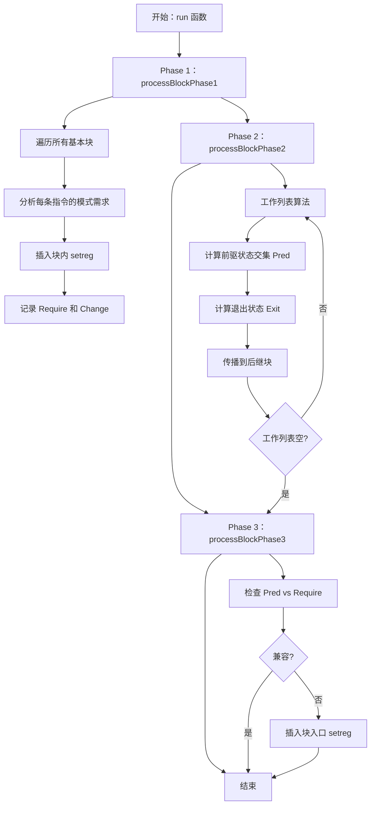

# SIModeRegister.cpp 代码功能详解

## 1. Pass 的主要功能概括

<a name="ref-block_0"></a>这是一个 LLVM 的机器函数 Pass，用于管理 AMDGPU 目标架构的 Mode 寄存器设置。 llvm-project:8-13[<sup>↗</sup>](#block_0) 

**主要作用**：
- 自动插入 `setreg` 指令来更新 Mode 寄存器的设置
- 当前主要处理双精度浮点数（Double Precision Floating Point）的舍入模式
- 确保每条指令执行时 Mode 寄存器具有正确的配置

**效果**：
- 在需要特定舍入模式的指令前插入 Mode 寄存器配置指令
- 优化跨基本块的 Mode 寄存器状态传播，减少不必要的 `setreg` 指令
<a name="ref-block_1"></a>- 保证函数的正确语义，特别是浮点运算的舍入行为 llvm-project:25-25[<sup>↗</sup>](#block_1) 

## 2. 主要功能步骤提取

该 Pass 采用**三阶段处理算法**：

1. **Phase 1（阶段1）**：确定每个基本块的初始模式需求，插入块内 `setreg` 指令
2. **Phase 2（阶段2）**：计算每个基本块的退出模式状态
3. **Phase 3（阶段3）**：在块入口插入必要的 `setreg` 指令

**辅助功能**：
- **Status 数据结构**：表示 Mode 寄存器的状态
- **BlockData 数据结构**：存储每个基本块的模式信息
- **getInstructionMode**：获取指令的模式需求
- **insertSetreg**：插入 `setreg` 指令

## 3. 各步骤/子功能的具体描述

### 3.1 Status 数据结构

<a name="ref-block_2"></a>**功能**：表示 Mode 寄存器的状态，使用掩码（Mask）和模式值（Mode）。 llvm-project:29-39[<sup>↗</sup>](#block_2) 

**关键操作**：
<a name="ref-block_3"></a>- `merge`：合并两个状态，只保留不冲突的值 llvm-project:43-45[<sup>↗</sup>](#block_3) 
<a name="ref-block_4"></a>- `mergeUnknown`：处理未知值的合并 llvm-project:49-51[<sup>↗</sup>](#block_4) 
<a name="ref-block_5"></a>- `intersect`：计算两个状态的交集 llvm-project:55-59[<sup>↗</sup>](#block_5) 
<a name="ref-block_6"></a>- `delta`：计算从当前状态到目标状态需要的变化 llvm-project:62-64[<sup>↗</sup>](#block_6) 
<a name="ref-block_7"></a>- `isCompatible`：检查两个状态是否兼容 llvm-project:72-74[<sup>↗</sup>](#block_7) 

### 3.2 BlockData 数据结构

<a name="ref-block_8"></a>**功能**：存储每个基本块的模式寄存器信息。 llvm-project:79-106[<sup>↗</sup>](#block_8) 

**关键字段**：
- `Require`：块的入口需求（Phase 1 计算）
- `Change`：块内对 Mode 寄存器的净变化（Phase 1 计算）
- `Exit`：块退出时的模式状态（Phase 2 计算）
- `Pred`：所有前驱块退出状态的交集（Phase 2 计算，Phase 3 使用）
- `FirstInsertionPoint`：第一个需要模式设置的指令位置

### 3.3 getInstructionMode 函数

<a name="ref-block_10"></a>**功能**：确定指令所需的 Mode 寄存器设置。 llvm-project:166-171[<sup>↗</sup>](#block_10) 

**处理的指令类型**：
<a name="ref-block_11"></a>- 使用双精度浮点舍入的指令 llvm-project:173-177[<sup>↗</sup>](#block_11) 
<a name="ref-block_12"></a>- F16 插值指令（需要 round-to-zero 模式） llvm-project:179-184[<sup>↗</sup>](#block_12) 
<a name="ref-block_13"></a>- 各种 FPTRUNC_ROUND 伪指令，将其转换为实际指令并提取舍入模式 llvm-project:185-208[<sup>↗</sup>](#block_13) 
<a name="ref-block_14"></a>- 默认情况使用 Round to Nearest 模式 llvm-project:209-211[<sup>↗</sup>](#block_14) 

### 3.4 insertSetreg 函数

<a name="ref-block_15"></a>**功能**：插入 `setreg` 指令来更新 Mode 寄存器。 llvm-project:216-222[<sup>↗</sup>](#block_15) 

**实现逻辑**：
- 处理不连续的位字段修改，可能需要多条 `setreg` 指令
- 计算每个连续位段的偏移量（Offset）、宽度（Width）和值（Value）
<a name="ref-block_16"></a>- 使用 `S_SETREG_IMM32_B32` 指令来设置 Mode 寄存器 llvm-project:223-234[<sup>↗</sup>](#block_16) 

### 3.5 Phase 1：processBlockPhase1

<a name="ref-block_17"></a>**功能**：遍历块内指令，确定初始需求和块内变化。 llvm-project:237-256[<sup>↗</sup>](#block_17) 

**详细流程**：

<a name="ref-block_18"></a>1. **遍历块内所有指令**，获取每条指令的模式需求 llvm-project:267-268[<sup>↗</sup>](#block_18) 

2. **处理显式 `setreg` 指令**：
   - 保留已有的 `setreg` 指令（假设由更高权限插入）
   - 如果是立即数形式，记录其设置的值
<a name="ref-block_19"></a>   - 如果是寄存器形式，将对应位标记为未知 llvm-project:269-303[<sup>↗</sup>](#block_19) 

3. **处理模式不兼容的指令**：
   - 如果指令需求与当前模式不兼容，设置插入点
   - 如果已有插入点且新需求无法合并，则插入 `setreg`
<a name="ref-block_20"></a>   - 第一个插入点被延迟到 Phase 3 处理（可能由前驱块提供正确模式） llvm-project:304-335[<sup>↗</sup>](#block_20) 

<a name="ref-block_21"></a>4. **设置块的初始需求**（Require）和变化（Change） llvm-project:337-347[<sup>↗</sup>](#block_21) 

### 3.6 Phase 2：processBlockPhase2

<a name="ref-block_22"></a>**功能**：计算每个块的退出模式状态，通过数据流分析传播状态。 llvm-project:350-355[<sup>↗</sup>](#block_22) 

**详细流程**：

<a name="ref-block_23"></a>1. **处理无前驱的块**（如入口块）：使用默认状态 llvm-project:359-362[<sup>↗</sup>](#block_23) 

2. **计算前驱状态交集**：
   - 遍历所有前驱块，计算其退出状态的交集
   - 只有已知值的位才能保留（Mask 位可能被移除）
<a name="ref-block_24"></a>   - 如果前驱尚未计算完成，标记需要重新访问 llvm-project:363-400[<sup>↗</sup>](#block_24) 

3. **计算块的退出状态**：
   - Exit = Pred.merge(Change)
<a name="ref-block_25"></a>   - 如果退出状态改变，将后继块加入工作列表 llvm-project:401-412[<sup>↗</sup>](#block_25) 

4. **使用工作列表算法**确保所有块都被正确处理 llvm-project:467-472 

### 3.7 Phase 3：processBlockPhase3

<a name="ref-block_26"></a>**功能**：在块入口插入必要的 `setreg` 指令。 llvm-project:415-418[<sup>↗</sup>](#block_26) 

**详细流程**：
- 检查前驱退出状态（Pred）是否满足块的入口需求（Require）
- 如果不兼容，计算需要的变化（Delta）
<a name="ref-block_27"></a>- 在第一个插入点或块开头插入 `setreg` 指令 llvm-project:419-429[<sup>↗</sup>](#block_27) 

### 3.8 主运行函数

**功能**：协调三个阶段的执行。 llvm-project:444-445 

**特殊处理**：
- 跳过带有 `strictfp` 属性的函数（这些函数使用受约束的 FP 内部函数） llvm-project:445-452 
<a name="ref-block_29"></a>- 按顺序执行三个阶段 llvm-project:457-477[<sup>↗</sup>](#block_29) 

## 4. 步骤/子功能之间的关系

### 4.1 整体流程关系



### 4.2 数据依赖关系

**Phase 1 → Phase 2**：
- Phase 1 计算每个块的 `Require` 和 `Change`
- Phase 2 使用 `Change` 来计算 `Exit` 状态

**Phase 2 → Phase 3**：
- Phase 2 计算每个块的 `Pred`（前驱交集）
- Phase 3 使用 `Pred` 和 `Require` 决定是否插入 `setreg`

**Status 操作的使用**：
- Phase 1 使用：`merge`、`mergeUnknown`、`isCompatible`、`delta`、`isCombinable`
- Phase 2 使用：`intersect`、`merge`
- Phase 3 使用：`isCompatible`、`delta`

### 4.3 优化策略

该 Pass 采用**延迟插入策略**：
- Phase 1 中，第一个插入点被延迟到 Phase 3
- 这样可以利用前驱块的退出状态，可能避免不必要的 `setreg` 指令

**数据流分析**确保正确性：
- Phase 2 使用工作列表算法进行不动点迭代
- 保证所有块的退出状态都被正确计算
- 处理循环和复杂控制流

## Notes

1. **当前限制**：Pass 目前主要处理双精度浮点舍入模式，但设计上可扩展到其他 Mode 寄存器位 llvm-project:10-12 

<a name="ref-block_9"></a>2. **默认舍入模式**：假设为 Round to Nearest，将来应该从函数级别的设置中获取 llvm-project:115-122[<sup>↗</sup>](#block_9) 

3. **StrictFP 处理**：对于带有 `strictfp` 属性的函数，Pass 不做任何修改，因为这些函数使用受约束的 FP 内部函数来支持非默认舍入模式 llvm-project:445-452 

4. **保留显式 setreg**：Pass 保留代码中已有的显式 `setreg` 指令，假设它们由更高权限插入 llvm-project:273-275 

<a name="ref-block_1"></a>5. **性能统计**：Pass 记录插入的 `setreg` 指令数量用于性能分析 llvm-project:25-25[<sup>↗</sup>](#block_1)
### Citations
<a name="block_0"></a>**File:** llvm/lib/Target/AMDGPU/SIModeRegister.cpp (L8-13) [<sup>↩</sup>](#ref-block_0)
```cpp
/// \file
/// This pass inserts changes to the Mode register settings as required.
/// Note that currently it only deals with the Double Precision Floating Point
/// rounding mode setting, but is intended to be generic enough to be easily
/// expanded.
///
```
<a name="block_1"></a>**File:** llvm/lib/Target/AMDGPU/SIModeRegister.cpp (L25-25) [<sup>↩</sup>](#ref-block_1) [<sup>↩</sup>](#ref-block_1)
```cpp
STATISTIC(NumSetregInserted, "Number of setreg of mode register inserted.");
```
<a name="block_2"></a>**File:** llvm/lib/Target/AMDGPU/SIModeRegister.cpp (L29-39) [<sup>↩</sup>](#ref-block_2)
```cpp
struct Status {
  // Mask is a bitmask where a '1' indicates the corresponding Mode bit has a
  // known value
  unsigned Mask = 0;
  unsigned Mode = 0;

  Status() = default;

  Status(unsigned NewMask, unsigned NewMode) : Mask(NewMask), Mode(NewMode) {
    Mode &= Mask;
  };
```
<a name="block_3"></a>**File:** llvm/lib/Target/AMDGPU/SIModeRegister.cpp (L43-45) [<sup>↩</sup>](#ref-block_3)
```cpp
  Status merge(const Status &S) const {
    return Status((Mask | S.Mask), ((Mode & ~S.Mask) | (S.Mode & S.Mask)));
  }
```
<a name="block_4"></a>**File:** llvm/lib/Target/AMDGPU/SIModeRegister.cpp (L49-51) [<sup>↩</sup>](#ref-block_4)
```cpp
  Status mergeUnknown(unsigned newMask) {
    return Status(Mask & ~newMask, Mode & ~newMask);
  }
```
<a name="block_5"></a>**File:** llvm/lib/Target/AMDGPU/SIModeRegister.cpp (L55-59) [<sup>↩</sup>](#ref-block_5)
```cpp
  Status intersect(const Status &S) const {
    unsigned NewMask = (Mask & S.Mask) & (Mode ^ ~S.Mode);
    unsigned NewMode = (Mode & NewMask);
    return Status(NewMask, NewMode);
  }
```
<a name="block_6"></a>**File:** llvm/lib/Target/AMDGPU/SIModeRegister.cpp (L62-64) [<sup>↩</sup>](#ref-block_6)
```cpp
  Status delta(const Status &S) const {
    return Status((S.Mask & (Mode ^ S.Mode)) | (~Mask & S.Mask), S.Mode);
  }
```
<a name="block_7"></a>**File:** llvm/lib/Target/AMDGPU/SIModeRegister.cpp (L72-74) [<sup>↩</sup>](#ref-block_7)
```cpp
  bool isCompatible(Status &S) {
    return ((Mask & S.Mask) == S.Mask) && ((Mode & S.Mask) == S.Mode);
  }
```
<a name="block_8"></a>**File:** llvm/lib/Target/AMDGPU/SIModeRegister.cpp (L79-106) [<sup>↩</sup>](#ref-block_8)
```cpp
class BlockData {
public:
  // The Status that represents the mode register settings required by the
  // FirstInsertionPoint (if any) in this block. Calculated in Phase 1.
  Status Require;

  // The Status that represents the net changes to the Mode register made by
  // this block, Calculated in Phase 1.
  Status Change;

  // The Status that represents the mode register settings on exit from this
  // block. Calculated in Phase 2.
  Status Exit;

  // The Status that represents the intersection of exit Mode register settings
  // from all predecessor blocks. Calculated in Phase 2, and used by Phase 3.
  Status Pred;

  // In Phase 1 we record the first instruction that has a mode requirement,
  // which is used in Phase 3 if we need to insert a mode change.
  MachineInstr *FirstInsertionPoint = nullptr;

  // A flag to indicate whether an Exit value has been set (we can't tell by
  // examining the Exit value itself as all values may be valid results).
  bool ExitSet = false;

  BlockData() = default;
};
```
<a name="block_9"></a>**File:** llvm/lib/Target/AMDGPU/SIModeRegister.cpp (L115-122) [<sup>↩</sup>](#ref-block_9)
```cpp
  // The default mode register setting currently only caters for the floating
  // point double precision rounding mode.
  // We currently assume the default rounding mode is Round to Nearest
  // NOTE: this should come from a per function rounding mode setting once such
  // a setting exists.
  unsigned DefaultMode = FP_ROUND_ROUND_TO_NEAREST;
  Status DefaultStatus =
      Status(FP_ROUND_MODE_DP(0x3), FP_ROUND_MODE_DP(DefaultMode));
```
<a name="block_10"></a>**File:** llvm/lib/Target/AMDGPU/SIModeRegister.cpp (L166-171) [<sup>↩</sup>](#ref-block_10)
```cpp
// Determine the Mode register setting required for this instruction.
// Instructions which don't use the Mode register return a null Status.
// Note this currently only deals with instructions that use the floating point
// double precision setting.
Status SIModeRegister::getInstructionMode(MachineInstr &MI,
                                          const SIInstrInfo *TII) {
```
<a name="block_11"></a>**File:** llvm/lib/Target/AMDGPU/SIModeRegister.cpp (L173-177) [<sup>↩</sup>](#ref-block_11)
```cpp
  if (TII->usesFPDPRounding(MI) ||
      Opcode == AMDGPU::FPTRUNC_ROUND_F16_F32_PSEUDO ||
      Opcode == AMDGPU::FPTRUNC_ROUND_F16_F32_PSEUDO_fake16_e32 ||
      Opcode == AMDGPU::FPTRUNC_ROUND_F16_F32_PSEUDO_t16_e64 ||
      Opcode == AMDGPU::FPTRUNC_ROUND_F32_F64_PSEUDO) {
```
<a name="block_12"></a>**File:** llvm/lib/Target/AMDGPU/SIModeRegister.cpp (L179-184) [<sup>↩</sup>](#ref-block_12)
```cpp
    case AMDGPU::V_INTERP_P1LL_F16:
    case AMDGPU::V_INTERP_P1LV_F16:
    case AMDGPU::V_INTERP_P2_F16:
      // f16 interpolation instructions need double precision round to zero
      return Status(FP_ROUND_MODE_DP(3),
                    FP_ROUND_MODE_DP(FP_ROUND_ROUND_TO_ZERO));
```
<a name="block_13"></a>**File:** llvm/lib/Target/AMDGPU/SIModeRegister.cpp (L185-208) [<sup>↩</sup>](#ref-block_13)
```cpp
    case AMDGPU::FPTRUNC_ROUND_F16_F32_PSEUDO: {
      unsigned Mode = MI.getOperand(2).getImm();
      MI.removeOperand(2);
      MI.setDesc(TII->get(AMDGPU::V_CVT_F16_F32_e32));
      return Status(FP_ROUND_MODE_DP(3), FP_ROUND_MODE_DP(Mode));
    }
    case AMDGPU::FPTRUNC_ROUND_F16_F32_PSEUDO_fake16_e32: {
      unsigned Mode = MI.getOperand(2).getImm();
      MI.removeOperand(2);
      MI.setDesc(TII->get(AMDGPU::V_CVT_F16_F32_fake16_e32));
      return Status(FP_ROUND_MODE_DP(3), FP_ROUND_MODE_DP(Mode));
    }
    case AMDGPU::FPTRUNC_ROUND_F16_F32_PSEUDO_t16_e64: {
      unsigned Mode = MI.getOperand(6).getImm();
      MI.removeOperand(6);
      MI.setDesc(TII->get(AMDGPU::V_CVT_F16_F32_t16_e64));
      return Status(FP_ROUND_MODE_DP(3), FP_ROUND_MODE_DP(Mode));
    }
    case AMDGPU::FPTRUNC_ROUND_F32_F64_PSEUDO: {
      unsigned Mode = MI.getOperand(2).getImm();
      MI.removeOperand(2);
      MI.setDesc(TII->get(AMDGPU::V_CVT_F32_F64_e32));
      return Status(FP_ROUND_MODE_DP(3), FP_ROUND_MODE_DP(Mode));
    }
```
<a name="block_14"></a>**File:** llvm/lib/Target/AMDGPU/SIModeRegister.cpp (L209-211) [<sup>↩</sup>](#ref-block_14)
```cpp
    default:
      return DefaultStatus;
    }
```
<a name="block_15"></a>**File:** llvm/lib/Target/AMDGPU/SIModeRegister.cpp (L216-222) [<sup>↩</sup>](#ref-block_15)
```cpp
// Insert a setreg instruction to update the Mode register.
// It is possible (though unlikely) for an instruction to require a change to
// the value of disjoint parts of the Mode register when we don't know the
// value of the intervening bits. In that case we need to use more than one
// setreg instruction.
void SIModeRegister::insertSetreg(MachineBasicBlock &MBB, MachineInstr *MI,
                                  const SIInstrInfo *TII, Status InstrMode) {
```
<a name="block_16"></a>**File:** llvm/lib/Target/AMDGPU/SIModeRegister.cpp (L223-234) [<sup>↩</sup>](#ref-block_16)
```cpp
  while (InstrMode.Mask) {
    unsigned Offset = llvm::countr_zero<unsigned>(InstrMode.Mask);
    unsigned Width = llvm::countr_one<unsigned>(InstrMode.Mask >> Offset);
    unsigned Value = (InstrMode.Mode >> Offset) & ((1 << Width) - 1);
    using namespace AMDGPU::Hwreg;
    BuildMI(MBB, MI, nullptr, TII->get(AMDGPU::S_SETREG_IMM32_B32))
        .addImm(Value)
        .addImm(HwregEncoding::encode(ID_MODE, Offset, Width));
    ++NumSetregInserted;
    Changed = true;
    InstrMode.Mask &= ~(((1 << Width) - 1) << Offset);
  }
```
<a name="block_17"></a>**File:** llvm/lib/Target/AMDGPU/SIModeRegister.cpp (L237-256) [<sup>↩</sup>](#ref-block_17)
```cpp
// In Phase 1 we iterate through the instructions of the block and for each
// instruction we get its mode usage. If the instruction uses the Mode register
// we:
// - update the Change status, which tracks the changes to the Mode register
//   made by this block
// - if this instruction's requirements are compatible with the current setting
//   of the Mode register we merge the modes
// - if it isn't compatible and an InsertionPoint isn't set, then we set the
//   InsertionPoint to the current instruction, and we remember the current
//   mode
// - if it isn't compatible and InsertionPoint is set we insert a seteg before
//   that instruction (unless this instruction forms part of the block's
//   entry requirements in which case the insertion is deferred until Phase 3
//   when predecessor exit values are known), and move the insertion point to
//   this instruction
// - if this is a setreg instruction we treat it as an incompatible instruction.
//   This is sub-optimal but avoids some nasty corner cases, and is expected to
//   occur very rarely.
// - on exit we have set the Require, Change, and initial Exit modes.
void SIModeRegister::processBlockPhase1(MachineBasicBlock &MBB,
```
<a name="block_18"></a>**File:** llvm/lib/Target/AMDGPU/SIModeRegister.cpp (L267-268) [<sup>↩</sup>](#ref-block_18)
```cpp
  for (MachineInstr &MI : MBB) {
    Status InstrMode = getInstructionMode(MI, TII);
```
<a name="block_19"></a>**File:** llvm/lib/Target/AMDGPU/SIModeRegister.cpp (L269-303) [<sup>↩</sup>](#ref-block_19)
```cpp
    if (MI.getOpcode() == AMDGPU::S_SETREG_B32 ||
        MI.getOpcode() == AMDGPU::S_SETREG_B32_mode ||
        MI.getOpcode() == AMDGPU::S_SETREG_IMM32_B32 ||
        MI.getOpcode() == AMDGPU::S_SETREG_IMM32_B32_mode) {
      // We preserve any explicit mode register setreg instruction we encounter,
      // as we assume it has been inserted by a higher authority (this is
      // likely to be a very rare occurrence).
      unsigned Dst = TII->getNamedOperand(MI, AMDGPU::OpName::simm16)->getImm();
      using namespace AMDGPU::Hwreg;
      auto [Id, Offset, Width] = HwregEncoding::decode(Dst);
      if (Id != ID_MODE)
        continue;

      unsigned Mask = maskTrailingOnes<unsigned>(Width) << Offset;

      // If an InsertionPoint is set we will insert a setreg there.
      if (InsertionPoint) {
        insertSetreg(MBB, InsertionPoint, TII, IPChange.delta(NewInfo->Change));
        InsertionPoint = nullptr;
      }
      // If this is an immediate then we know the value being set, but if it is
      // not an immediate then we treat the modified bits of the mode register
      // as unknown.
      if (MI.getOpcode() == AMDGPU::S_SETREG_IMM32_B32 ||
          MI.getOpcode() == AMDGPU::S_SETREG_IMM32_B32_mode) {
        unsigned Val = TII->getNamedOperand(MI, AMDGPU::OpName::imm)->getImm();
        unsigned Mode = (Val << Offset) & Mask;
        Status Setreg = Status(Mask, Mode);
        // If we haven't already set the initial requirements for the block we
        // don't need to as the requirements start from this explicit setreg.
        RequirePending = false;
        NewInfo->Change = NewInfo->Change.merge(Setreg);
      } else {
        NewInfo->Change = NewInfo->Change.mergeUnknown(Mask);
      }
```
<a name="block_20"></a>**File:** llvm/lib/Target/AMDGPU/SIModeRegister.cpp (L304-335) [<sup>↩</sup>](#ref-block_20)
```cpp
    } else if (!NewInfo->Change.isCompatible(InstrMode)) {
      // This instruction uses the Mode register and its requirements aren't
      // compatible with the current mode.
      if (InsertionPoint) {
        // If the required mode change cannot be included in the current
        // InsertionPoint changes, we need a setreg and start a new
        // InsertionPoint.
        if (!IPChange.delta(NewInfo->Change).isCombinable(InstrMode)) {
          if (RequirePending) {
            // This is the first insertionPoint in the block so we will defer
            // the insertion of the setreg to Phase 3 where we know whether or
            // not it is actually needed.
            NewInfo->FirstInsertionPoint = InsertionPoint;
            NewInfo->Require = NewInfo->Change;
            RequirePending = false;
          } else {
            insertSetreg(MBB, InsertionPoint, TII,
                         IPChange.delta(NewInfo->Change));
            IPChange = NewInfo->Change;
          }
          // Set the new InsertionPoint
          InsertionPoint = &MI;
        }
        NewInfo->Change = NewInfo->Change.merge(InstrMode);
      } else {
        // No InsertionPoint is currently set - this is either the first in
        // the block or we have previously seen an explicit setreg.
        InsertionPoint = &MI;
        IPChange = NewInfo->Change;
        NewInfo->Change = NewInfo->Change.merge(InstrMode);
      }
    }
```
<a name="block_21"></a>**File:** llvm/lib/Target/AMDGPU/SIModeRegister.cpp (L337-347) [<sup>↩</sup>](#ref-block_21)
```cpp
  if (RequirePending) {
    // If we haven't yet set the initial requirements for the block we set them
    // now.
    NewInfo->FirstInsertionPoint = InsertionPoint;
    NewInfo->Require = NewInfo->Change;
  } else if (InsertionPoint) {
    // We need to insert a setreg at the InsertionPoint
    insertSetreg(MBB, InsertionPoint, TII, IPChange.delta(NewInfo->Change));
  }
  NewInfo->Exit = NewInfo->Change;
  BlockInfo[MBB.getNumber()] = std::move(NewInfo);
```
<a name="block_22"></a>**File:** llvm/lib/Target/AMDGPU/SIModeRegister.cpp (L350-355) [<sup>↩</sup>](#ref-block_22)
```cpp
// In Phase 2 we revisit each block and calculate the common Mode register
// value provided by all predecessor blocks. If the Exit value for the block
// is changed, then we add the successor blocks to the worklist so that the
// exit value is propagated.
void SIModeRegister::processBlockPhase2(MachineBasicBlock &MBB,
                                        const SIInstrInfo *TII) {
```
<a name="block_23"></a>**File:** llvm/lib/Target/AMDGPU/SIModeRegister.cpp (L359-362) [<sup>↩</sup>](#ref-block_23)
```cpp
  if (MBB.pred_empty()) {
    // There are no predecessors, so use the default starting status.
    BlockInfo[ThisBlock]->Pred = DefaultStatus;
    ExitSet = true;
```
<a name="block_24"></a>**File:** llvm/lib/Target/AMDGPU/SIModeRegister.cpp (L363-400) [<sup>↩</sup>](#ref-block_24)
```cpp
  } else {
    // Build a status that is common to all the predecessors by intersecting
    // all the predecessor exit status values.
    // Mask bits (which represent the Mode bits with a known value) can only be
    // added by explicit SETREG instructions or the initial default value -
    // the intersection process may remove Mask bits.
    // If we find a predecessor that has not yet had an exit value determined
    // (this can happen for example if a block is its own predecessor) we defer
    // use of that value as the Mask will be all zero, and we will revisit this
    // block again later (unless the only predecessor without an exit value is
    // this block).
    MachineBasicBlock::pred_iterator P = MBB.pred_begin(), E = MBB.pred_end();
    MachineBasicBlock &PB = *(*P);
    unsigned PredBlock = PB.getNumber();
    if ((ThisBlock == PredBlock) && (std::next(P) == E)) {
      BlockInfo[ThisBlock]->Pred = DefaultStatus;
      ExitSet = true;
    } else if (BlockInfo[PredBlock]->ExitSet) {
      BlockInfo[ThisBlock]->Pred = BlockInfo[PredBlock]->Exit;
      ExitSet = true;
    } else if (PredBlock != ThisBlock)
      RevisitRequired = true;

    for (P = std::next(P); P != E; P = std::next(P)) {
      MachineBasicBlock *Pred = *P;
      unsigned PredBlock = Pred->getNumber();
      if (BlockInfo[PredBlock]->ExitSet) {
        if (BlockInfo[ThisBlock]->ExitSet) {
          BlockInfo[ThisBlock]->Pred =
              BlockInfo[ThisBlock]->Pred.intersect(BlockInfo[PredBlock]->Exit);
        } else {
          BlockInfo[ThisBlock]->Pred = BlockInfo[PredBlock]->Exit;
        }
        ExitSet = true;
      } else if (PredBlock != ThisBlock)
        RevisitRequired = true;
    }
  }
```
<a name="block_25"></a>**File:** llvm/lib/Target/AMDGPU/SIModeRegister.cpp (L401-412) [<sup>↩</sup>](#ref-block_25)
```cpp
  Status TmpStatus =
      BlockInfo[ThisBlock]->Pred.merge(BlockInfo[ThisBlock]->Change);
  if (BlockInfo[ThisBlock]->Exit != TmpStatus) {
    BlockInfo[ThisBlock]->Exit = TmpStatus;
    // Add the successors to the work list so we can propagate the changed exit
    // status.
    for (MachineBasicBlock *Succ : MBB.successors())
      Phase2List.push(Succ);
  }
  BlockInfo[ThisBlock]->ExitSet = ExitSet;
  if (RevisitRequired)
    Phase2List.push(&MBB);
```
<a name="block_26"></a>**File:** llvm/lib/Target/AMDGPU/SIModeRegister.cpp (L415-418) [<sup>↩</sup>](#ref-block_26)
```cpp
// In Phase 3 we revisit each block and if it has an insertion point defined we
// check whether the predecessor mode meets the block's entry requirements. If
// not we insert an appropriate setreg instruction to modify the Mode register.
void SIModeRegister::processBlockPhase3(MachineBasicBlock &MBB,
```
<a name="block_27"></a>**File:** llvm/lib/Target/AMDGPU/SIModeRegister.cpp (L419-429) [<sup>↩</sup>](#ref-block_27)
```cpp
                                        const SIInstrInfo *TII) {
  unsigned ThisBlock = MBB.getNumber();
  if (!BlockInfo[ThisBlock]->Pred.isCompatible(BlockInfo[ThisBlock]->Require)) {
    Status Delta =
        BlockInfo[ThisBlock]->Pred.delta(BlockInfo[ThisBlock]->Require);
    if (BlockInfo[ThisBlock]->FirstInsertionPoint)
      insertSetreg(MBB, BlockInfo[ThisBlock]->FirstInsertionPoint, TII, Delta);
    else
      insertSetreg(MBB, &MBB.instr_front(), TII, Delta);
  }
}
```
<a name="block_28"></a>**File:** llvm/lib/Target/AMDGPU/SIModeRegister.cpp (L444-452)
```cpp
bool SIModeRegister::run(MachineFunction &MF) {
  // Constrained FP intrinsics are used to support non-default rounding modes.
  // strictfp attribute is required to mark functions with strict FP semantics
  // having constrained FP intrinsics. This pass fixes up operations that uses
  // a non-default rounding mode for non-strictfp functions. But it should not
  // assume or modify any default rounding modes in case of strictfp functions.
  const Function &F = MF.getFunction();
  if (F.hasFnAttribute(llvm::Attribute::StrictFP))
    return Changed;
```
<a name="block_29"></a>**File:** llvm/lib/Target/AMDGPU/SIModeRegister.cpp (L457-477) [<sup>↩</sup>](#ref-block_29)
```cpp
  // Processing is performed in a number of phases

  // Phase 1 - determine the initial mode required by each block, and add setreg
  // instructions for intra block requirements.
  for (MachineBasicBlock &BB : MF)
    processBlockPhase1(BB, TII);

  // Phase 2 - determine the exit mode from each block. We add all blocks to the
  // list here, but will also add any that need to be revisited during Phase 2
  // processing.
  for (MachineBasicBlock &BB : MF)
    Phase2List.push(&BB);
  while (!Phase2List.empty()) {
    processBlockPhase2(*Phase2List.front(), TII);
    Phase2List.pop();
  }

  // Phase 3 - add an initial setreg to each block where the required entry mode
  // is not satisfied by the exit mode of all its predecessors.
  for (MachineBasicBlock &BB : MF)
    processBlockPhase3(BB, TII);
```