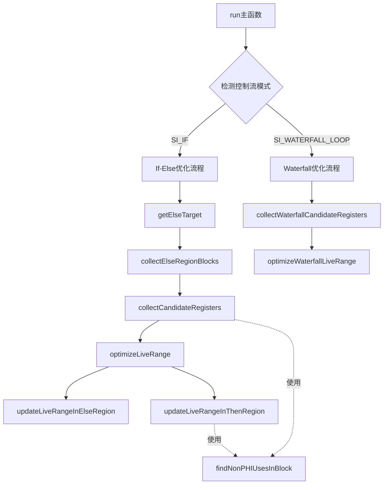

# SIOptimizeVGPRLiveRange.cpp 代码功能详解

## 1. Pass 的主要功能概述

### 作用
<a name="ref-block_0"></a>该 pass 旨在**优化 VGPR（向量通用寄存器）的生命周期**，通过消除发散控制流结构中不必要的 VGPR 活跃范围。 llvm-project:10-11[<sup>↗</sup>](#block_0) 

### 处理场景
主要针对两种代码模式：

**场景1：发散的 if-else 结构**
- 在结构化后，if-else 被转换为两个连续的 if-then 块（带有 flow 块用于谓词反转）
- 由于寄存器分配器不了解线程级控制流，它会假设寄存器在整个 THEN 块中都是活跃的
- 但在 AMDGPU 架构中，VGPR 访问基于 exec mask，THEN 块中活跃的线程在 ELSE 块中是不活跃的
- 因此寄存器在 THEN 块最后使用后到块结束前实际上是死的 llvm-project:13-37 

**场景2：Waterfall 循环**
- 这些循环用于处理使用发散值但只能以统一值执行的指令（如间接调用）
- 虽然循环块会多次执行，但每个活跃线程只执行一次
<a name="ref-block_3"></a>- 寄存器分配器假设寄存器在整个循环中活跃，但实际上在循环块最后使用后就不需要保持活跃 llvm-project:50-69[<sup>↗</sup>](#block_3) 

### 优化方法
通过在适当位置**插入 PHI 节点**，将来自特定路径的值标记为 `undef`，从而告知寄存器分配器该寄存器实际上已死亡。 llvm-project:39-42 

### 效果
减少寄存器压力，提高寄存器利用效率，避免不必要的寄存器保留。

## 2. 主要功能的实现步骤

代码实现包含以下关键步骤和子功能：

### 核心执行流程
1. **`run()`** - 主执行函数
2. **`getElseTarget()`** - 检测并获取 else 目标块
3. **`collectElseRegionBlocks()`** - 收集 else 区域的所有基本块
4. **`collectCandidateRegisters()`** - 收集 if-else 场景的候选寄存器
5. **`collectWaterfallCandidateRegisters()`** - 收集 waterfall 循环的候选寄存器

### 辅助分析函数
6. **`findNonPHIUsesInBlock()`** - 查找块中的非 PHI 使用

### 优化执行函数
7. **`optimizeLiveRange()`** - 执行 if-else 场景的优化
8. **`optimizeWaterfallLiveRange()`** - 执行 waterfall 循环的优化

### 生命周期更新函数
9. **`updateLiveRangeInThenRegion()`** - 更新 THEN 区域的生命周期
10. **`updateLiveRangeInElseRegion()`** - 更新 ELSE 区域的生命周期

## 3. 各步骤的具体描述分析

### 3.1 `run()` - 主执行函数
这是 pass 的入口点，遍历函数中的所有基本块，检测特定的控制流模式。

**功能**：
- 初始化目标特定的指令和寄存器信息
- 遍历所有基本块的终止指令
- 检测 `SI_IF` 指令（if-else 结构）
- 检测 `SI_WATERFALL_LOOP` 指令（waterfall 循环）
<a name="ref-block_14"></a>- 对检测到的模式调用相应的优化流程 llvm-project:669-732[<sup>↗</sup>](#block_14) 

### 3.2 `getElseTarget()` - 获取 Else 目标块
**功能**：判断一个基本块是否为 else flow 块，并获取其分支到的 endif 块。

**实现逻辑**：
- 遍历块的终止指令
- 查找 `SI_ELSE` 指令
<a name="ref-block_5"></a>- 返回该指令的第三个操作数指向的基本块（即 endif 块） llvm-project:181-188[<sup>↗</sup>](#block_5) 

### 3.3 `collectElseRegionBlocks()` - 收集 Else 区域块
**功能**：收集从 Flow 块到 Endif 块之间的所有 else 区域基本块。

**实现算法**：
- 从 Endif 块开始反向遍历
- 对每个块，将其前驱块加入集合（除了 Flow 块）
- 使用工作列表算法，持续处理新发现的块
<a name="ref-block_6"></a>- 直到所有可达块都被收集 llvm-project:190-215[<sup>↗</sup>](#block_6) 

### 3.4 `collectCandidateRegisters()` - 收集 If-Else 候选寄存器
**功能**：识别在 else 区域被杀死且不在整个 then 区域活跃的寄存器。

**关键条件**：
1. 寄存器必须是 VGPR 或 AGPR 虚拟寄存器
2. 值必须在 IF 块之前或之中定义
3. 定义点必须与 if-else-endif 在同一循环层级
4. 寄存器不能在 Endif 块中活跃
5. 寄存器不能在整个 THEN 区域活跃

**实现步骤**：
- 遍历 else 区域的所有指令，收集在 else 中被杀死的寄存器
- 检查 Endif 块中的 PHI 节点，收集来自 else 区域的寄存器
<a name="ref-block_8"></a>- 过滤掉在 THEN 区域活跃的寄存器 llvm-project:229-333[<sup>↗</sup>](#block_8) 

### 3.5 `collectWaterfallCandidateRegisters()` - 收集 Waterfall 候选寄存器
**功能**：收集在 waterfall 循环块中使用但在循环前定义的寄存器。

**筛选条件**：
1. 寄存器必须是 VGPR/AGPR 虚拟寄存器
2. 定义必须在循环块之外
3. 循环后必须没有使用（不能在循环后继块中活跃）

**实现流程**：
- 收集循环中的所有指令和基本块
- 遍历所有使用操作数
- 识别循环前定义的寄存器
<a name="ref-block_9"></a>- 验证循环后没有使用 llvm-project:337-404[<sup>↗</sup>](#block_9) 

### 3.6 `findNonPHIUsesInBlock()` - 查找非 PHI 使用
**功能**：在指定基本块中查找寄存器的所有非 PHI、非调试使用。

<a name="ref-block_7"></a>**用途**：用于精确计算寄存器的生命周期信息。 llvm-project:218-225[<sup>↗</sup>](#block_7) 

### 3.7 `optimizeLiveRange()` - 优化 If-Else 生命周期
**功能**：执行 if-else 场景的核心优化，通过插入 PHI 节点来缩短生命周期。

**优化步骤**：
1. 在 Flow 块的开始处创建新的虚拟寄存器
2. 插入 PHI 节点，将来自 THEN 路径的值设为原寄存器，来自 ELSE 路径的值设为 `undef`
3. 替换 ELSE 区域和 Endif 块中的所有使用为新寄存器
4. 更新 Flow 块的活跃信息
<a name="ref-block_12"></a>5. 调用 `updateLiveRangeInElseRegion()` 和 `updateLiveRangeInThenRegion()` 更新生命周期信息 llvm-project:504-555[<sup>↗</sup>](#block_12) 

### 3.8 `optimizeWaterfallLiveRange()` - 优化 Waterfall 生命周期
**功能**：执行 waterfall 循环场景的优化。

**优化步骤**：
1. 创建新的虚拟寄存器和 undef 寄存器
2. 替换循环块中的所有使用为新寄存器
3. 在循环头部插入 PHI 节点：来自循环外的用原寄存器，来自循环内的用 `undef`
4. 查找新寄存器的最后使用并标记为 kill
<a name="ref-block_13"></a>5. 更新新旧寄存器的活跃块信息 llvm-project:557-620[<sup>↗</sup>](#block_13) 

### 3.9 `updateLiveRangeInThenRegion()` - 更新 THEN 区域生命周期
**功能**：重新计算寄存器在 THEN 区域的精确生命周期信息。

**更新过程**：
1. 收集从 IF 到 Flow 的所有中间块
2. 清除这些块的活跃位
3. 识别 PHI 节点的传入块
4. 重新处理每个块中的使用，调用 `LiveVariables::HandleVirtRegUse()`
5. 标记 PHI 传入块的活跃范围
<a name="ref-block_10"></a>6. 为新的 kill 点设置 kill 标志 llvm-project:407-472[<sup>↗</sup>](#block_10) 

### 3.10 `updateLiveRangeInElseRegion()` - 更新 ELSE 区域生命周期
**功能**：将 ELSE 区域的生命周期信息从旧寄存器转移到新寄存器。

**转移内容**：
1. 将 ELSE 块的活跃位从旧寄存器转移到新寄存器
<a name="ref-block_11"></a>2. 将 ELSE 块中的 kill 点从旧寄存器转移到新寄存器 llvm-project:474-502[<sup>↗</sup>](#block_11) 

## 4. 步骤/子功能之间的关系

### 整体架构关系


### If-Else 优化流程依赖关系

1. **检测阶段**：`run()` → `getElseTarget()` 
   - 首先检测 IF 指令并获取 Endif 块

2. **分析阶段**：`collectElseRegionBlocks()` → `collectCandidateRegisters()`
   - 先收集 else 区域的所有块
   - 然后分析哪些寄存器可以优化
   - `collectCandidateRegisters()` 使用 `findNonPHIUsesInBlock()` 辅助分析

3. **优化阶段**：`optimizeLiveRange()` → `updateLiveRangeInElseRegion()` + `updateLiveRangeInThenRegion()`
   - 插入 PHI 节点并替换使用
   - 分别更新 ELSE 和 THEN 区域的生命周期信息
   - `updateLiveRangeInThenRegion()` 内部使用 `findNonPHIUsesInBlock()` 重新计算使用

### Waterfall 优化流程依赖关系

1. **检测与收集**：`run()` → `collectWaterfallCandidateRegisters()`
   - 检测 waterfall 循环指令
   - 收集候选寄存器、循环块和指令

2. **优化**：`optimizeWaterfallLiveRange()`
   - 独立完成所有优化步骤
   - 不需要额外的辅助函数

### 共享组件
- `findNonPHIUsesInBlock()` 被多个函数共享使用
- `LiveVariables` 分析结果被所有更新函数使用
- `MachineRegisterInfo` 用于查询定义-使用链

## Notes

**关键设计要点**：

1. **正确性保证条件**：
   - 定义点必须在与 if-else-endif 相同的循环层级，确保第二次循环迭代获得正确数据
<a name="ref-block_2"></a>   - IF-ELSE 区域后不能有进一步使用 llvm-project:44-47[<sup>↗</sup>](#block_2) 

2. **Pass 特性**：
   - 保持 CFG 结构不变
   - 要求输入处于 SSA 形式
<a name="ref-block_4"></a>   - 会清除 NoPHIs 属性（因为会插入新的 PHI 节点） llvm-project:157-174[<sup>↗</sup>](#block_4) 

3. **依赖分析**：需要 `LiveVariables`、`MachineDominatorTree` 和 `MachineLoopInfo` 分析结果 llvm-project:157-166 

4. **适用范围**：只优化 VGPR 和 AGPR 虚拟寄存器，物理寄存器和标量寄存器不处理 llvm-project:246-248
### Citations
<a name="block_0"></a>**File:** llvm/lib/Target/AMDGPU/SIOptimizeVGPRLiveRange.cpp (L10-11) [<sup>↩</sup>](#ref-block_0)
```cpp
/// This pass tries to remove unnecessary VGPR live ranges in divergent if-else
/// structures and waterfall loops.
```
<a name="block_1"></a>**File:** llvm/lib/Target/AMDGPU/SIOptimizeVGPRLiveRange.cpp (L13-42)
```cpp
/// When we do structurization, we usually transform an if-else into two
/// successive if-then (with a flow block to do predicate inversion). Consider a
/// simple case after structurization: A divergent value %a was defined before
/// if-else and used in both THEN (use in THEN is optional) and ELSE part:
///    bb.if:
///      %a = ...
///      ...
///    bb.then:
///      ... = op %a
///      ... // %a can be dead here
///    bb.flow:
///      ...
///    bb.else:
///      ... = %a
///      ...
///    bb.endif
///
///  As register allocator has no idea of the thread-control-flow, it will just
///  assume %a would be alive in the whole range of bb.then because of a later
///  use in bb.else. On AMDGPU architecture, the VGPR is accessed with respect
///  to exec mask. For this if-else case, the lanes active in bb.then will be
///  inactive in bb.else, and vice-versa. So we are safe to say that %a was dead
///  after the last use in bb.then until the end of the block. The reason is
///  the instructions in bb.then will only overwrite lanes that will never be
///  accessed in bb.else.
///
///  This pass aims to tell register allocator that %a is in-fact dead,
///  through inserting a phi-node in bb.flow saying that %a is undef when coming
///  from bb.then, and then replace the uses in the bb.else with the result of
///  newly inserted phi.
```
<a name="block_2"></a>**File:** llvm/lib/Target/AMDGPU/SIOptimizeVGPRLiveRange.cpp (L44-47) [<sup>↩</sup>](#ref-block_2)
```cpp
///  Two key conditions must be met to ensure correctness:
///  1.) The def-point should be in the same loop-level as if-else-endif to make
///      sure the second loop iteration still get correct data.
///  2.) There should be no further uses after the IF-ELSE region.
```
<a name="block_3"></a>**File:** llvm/lib/Target/AMDGPU/SIOptimizeVGPRLiveRange.cpp (L50-69) [<sup>↩</sup>](#ref-block_3)
```cpp
/// Waterfall loops get inserted around instructions that use divergent values
/// but can only be executed with a uniform value. For example an indirect call
/// to a divergent address:
///    bb.start:
///      %a = ...
///      %fun = ...
///      ...
///    bb.loop:
///      call %fun (%a)
///      ... // %a can be dead here
///      loop %bb.loop
///
///  The loop block is executed multiple times, but it is run exactly once for
///  each active lane. Similar to the if-else case, the register allocator
///  assumes that %a is live throughout the loop as it is used again in the next
///  iteration. If %a is a VGPR that is unused after the loop, it does not need
///  to be live after its last use in the loop block. By inserting a phi-node at
///  the start of bb.loop that is undef when coming from bb.loop, the register
///  allocation knows that the value of %a does not need to be preserved through
///  iterations of the loop.
```
<a name="block_4"></a>**File:** llvm/lib/Target/AMDGPU/SIOptimizeVGPRLiveRange.cpp (L157-174) [<sup>↩</sup>](#ref-block_4)
```cpp
  void getAnalysisUsage(AnalysisUsage &AU) const override {
    AU.setPreservesCFG();
    AU.addRequired<LiveVariablesWrapperPass>();
    AU.addRequired<MachineDominatorTreeWrapperPass>();
    AU.addRequired<MachineLoopInfoWrapperPass>();
    AU.addPreserved<LiveVariablesWrapperPass>();
    AU.addPreserved<MachineDominatorTreeWrapperPass>();
    AU.addPreserved<MachineLoopInfoWrapperPass>();
    MachineFunctionPass::getAnalysisUsage(AU);
  }

  MachineFunctionProperties getRequiredProperties() const override {
    return MachineFunctionProperties().setIsSSA();
  }

  MachineFunctionProperties getClearedProperties() const override {
    return MachineFunctionProperties().setNoPHIs();
  }
```
<a name="block_5"></a>**File:** llvm/lib/Target/AMDGPU/SIOptimizeVGPRLiveRange.cpp (L181-188) [<sup>↩</sup>](#ref-block_5)
```cpp
MachineBasicBlock *
SIOptimizeVGPRLiveRange::getElseTarget(MachineBasicBlock *MBB) const {
  for (auto &BR : MBB->terminators()) {
    if (BR.getOpcode() == AMDGPU::SI_ELSE)
      return BR.getOperand(2).getMBB();
  }
  return nullptr;
}
```
<a name="block_6"></a>**File:** llvm/lib/Target/AMDGPU/SIOptimizeVGPRLiveRange.cpp (L190-215) [<sup>↩</sup>](#ref-block_6)
```cpp
void SIOptimizeVGPRLiveRange::collectElseRegionBlocks(
    MachineBasicBlock *Flow, MachineBasicBlock *Endif,
    SmallSetVector<MachineBasicBlock *, 16> &Blocks) const {
  assert(Flow != Endif);

  MachineBasicBlock *MBB = Endif;
  unsigned Cur = 0;
  while (MBB) {
    for (auto *Pred : MBB->predecessors()) {
      if (Pred != Flow)
        Blocks.insert(Pred);
    }

    if (Cur < Blocks.size())
      MBB = Blocks[Cur++];
    else
      MBB = nullptr;
  }

  LLVM_DEBUG({
    dbgs() << "Found Else blocks: ";
    for (auto *MBB : Blocks)
      dbgs() << printMBBReference(*MBB) << ' ';
    dbgs() << '\n';
  });
}
```
<a name="block_7"></a>**File:** llvm/lib/Target/AMDGPU/SIOptimizeVGPRLiveRange.cpp (L218-225) [<sup>↩</sup>](#ref-block_7)
```cpp
void SIOptimizeVGPRLiveRange::findNonPHIUsesInBlock(
    Register Reg, MachineBasicBlock *MBB,
    SmallVectorImpl<MachineInstr *> &Uses) const {
  for (auto &UseMI : MRI->use_nodbg_instructions(Reg)) {
    if (UseMI.getParent() == MBB && !UseMI.isPHI())
      Uses.push_back(&UseMI);
  }
}
```
<a name="block_8"></a>**File:** llvm/lib/Target/AMDGPU/SIOptimizeVGPRLiveRange.cpp (L229-333) [<sup>↩</sup>](#ref-block_8)
```cpp
void SIOptimizeVGPRLiveRange::collectCandidateRegisters(
    MachineBasicBlock *If, MachineBasicBlock *Flow, MachineBasicBlock *Endif,
    SmallSetVector<MachineBasicBlock *, 16> &ElseBlocks,
    SmallVectorImpl<Register> &CandidateRegs) const {

  SmallSet<Register, 8> KillsInElse;

  for (auto *Else : ElseBlocks) {
    for (auto &MI : Else->instrs()) {
      if (MI.isDebugInstr())
        continue;

      for (auto &MO : MI.operands()) {
        if (!MO.isReg() || !MO.getReg() || MO.isDef())
          continue;

        Register MOReg = MO.getReg();
        // We can only optimize AGPR/VGPR virtual register
        if (MOReg.isPhysical() || !TRI->isVectorRegister(*MRI, MOReg))
          continue;

        if (MO.readsReg()) {
          LiveVariables::VarInfo &VI = LV->getVarInfo(MOReg);
          const MachineBasicBlock *DefMBB = MRI->getVRegDef(MOReg)->getParent();
          // Make sure two conditions are met:
          // a.) the value is defined before/in the IF block
          // b.) should be defined in the same loop-level.
          if ((VI.AliveBlocks.test(If->getNumber()) || DefMBB == If) &&
              Loops->getLoopFor(DefMBB) == Loops->getLoopFor(If)) {
            // Check if the register is live into the endif block. If not,
            // consider it killed in the else region.
            LiveVariables::VarInfo &VI = LV->getVarInfo(MOReg);
            if (!VI.isLiveIn(*Endif, MOReg, *MRI)) {
              KillsInElse.insert(MOReg);
            } else {
              LLVM_DEBUG(dbgs() << "Excluding " << printReg(MOReg, TRI)
                                << " as Live in Endif\n");
            }
          }
        }
      }
    }
  }

  // Check the phis in the Endif, looking for value coming from the ELSE
  // region. Make sure the phi-use is the last use.
  for (auto &MI : Endif->phis()) {
    for (unsigned Idx = 1; Idx < MI.getNumOperands(); Idx += 2) {
      auto &MO = MI.getOperand(Idx);
      auto *Pred = MI.getOperand(Idx + 1).getMBB();
      if (Pred == Flow)
        continue;
      assert(ElseBlocks.contains(Pred) && "Should be from Else region\n");

      if (!MO.isReg() || !MO.getReg() || MO.isUndef())
        continue;

      Register Reg = MO.getReg();
      if (Reg.isPhysical() || !TRI->isVectorRegister(*MRI, Reg))
        continue;

      LiveVariables::VarInfo &VI = LV->getVarInfo(Reg);

      if (VI.isLiveIn(*Endif, Reg, *MRI)) {
        LLVM_DEBUG(dbgs() << "Excluding " << printReg(Reg, TRI)
                          << " as Live in Endif\n");
        continue;
      }
      // Make sure two conditions are met:
      // a.) the value is defined before/in the IF block
      // b.) should be defined in the same loop-level.
      const MachineBasicBlock *DefMBB = MRI->getVRegDef(Reg)->getParent();
      if ((VI.AliveBlocks.test(If->getNumber()) || DefMBB == If) &&
          Loops->getLoopFor(DefMBB) == Loops->getLoopFor(If))
        KillsInElse.insert(Reg);
    }
  }

  auto IsLiveThroughThen = [&](Register Reg) {
    for (auto I = MRI->use_nodbg_begin(Reg), E = MRI->use_nodbg_end(); I != E;
         ++I) {
      if (!I->readsReg())
        continue;
      auto *UseMI = I->getParent();
      auto *UseMBB = UseMI->getParent();
      if (UseMBB == Flow || UseMBB == Endif) {
        if (!UseMI->isPHI())
          return true;

        auto *IncomingMBB = UseMI->getOperand(I.getOperandNo() + 1).getMBB();
        // The register is live through the path If->Flow or Flow->Endif.
        // we should not optimize for such cases.
        if ((UseMBB == Flow && IncomingMBB != If) ||
            (UseMBB == Endif && IncomingMBB == Flow))
          return true;
      }
    }
    return false;
  };

  for (auto Reg : KillsInElse) {
    if (!IsLiveThroughThen(Reg))
      CandidateRegs.push_back(Reg);
  }
}
```
<a name="block_9"></a>**File:** llvm/lib/Target/AMDGPU/SIOptimizeVGPRLiveRange.cpp (L337-404) [<sup>↩</sup>](#ref-block_9)
```cpp
void SIOptimizeVGPRLiveRange::collectWaterfallCandidateRegisters(
    MachineBasicBlock *LoopHeader, MachineBasicBlock *LoopEnd,
    SmallSetVector<Register, 16> &CandidateRegs,
    SmallSetVector<MachineBasicBlock *, 2> &Blocks,
    SmallVectorImpl<MachineInstr *> &Instructions) const {

  // Collect loop instructions, potentially spanning multiple blocks
  auto *MBB = LoopHeader;
  for (;;) {
    Blocks.insert(MBB);
    for (auto &MI : *MBB) {
      if (MI.isDebugInstr())
        continue;
      Instructions.push_back(&MI);
    }
    if (MBB == LoopEnd)
      break;

    if ((MBB != LoopHeader && MBB->pred_size() != 1) ||
        (MBB == LoopHeader && MBB->pred_size() != 2) || MBB->succ_size() != 1) {
      LLVM_DEBUG(dbgs() << "Unexpected edges in CFG, ignoring loop\n");
      return;
    }

    MBB = *MBB->succ_begin();
  }

  for (auto *I : Instructions) {
    auto &MI = *I;

    for (auto &MO : MI.all_uses()) {
      if (!MO.getReg())
        continue;

      Register MOReg = MO.getReg();
      // We can only optimize AGPR/VGPR virtual register
      if (MOReg.isPhysical() || !TRI->isVectorRegister(*MRI, MOReg))
        continue;

      if (MO.readsReg()) {
        MachineBasicBlock *DefMBB = MRI->getVRegDef(MOReg)->getParent();
        // Make sure the value is defined before the LOOP block
        if (!Blocks.contains(DefMBB) && !CandidateRegs.contains(MOReg)) {
          // If the variable is used after the loop, the register coalescer will
          // merge the newly created register and remove the phi node again.
          // Just do nothing in that case.
          LiveVariables::VarInfo &OldVarInfo = LV->getVarInfo(MOReg);
          bool IsUsed = false;
          for (auto *Succ : LoopEnd->successors()) {
            if (!Blocks.contains(Succ) &&
                OldVarInfo.isLiveIn(*Succ, MOReg, *MRI)) {
              IsUsed = true;
              break;
            }
          }
          if (!IsUsed) {
            LLVM_DEBUG(dbgs() << "Found candidate reg: "
                              << printReg(MOReg, TRI, 0, MRI) << '\n');
            CandidateRegs.insert(MOReg);
          } else {
            LLVM_DEBUG(dbgs() << "Reg is used after loop, ignoring: "
                              << printReg(MOReg, TRI, 0, MRI) << '\n');
          }
        }
      }
    }
  }
}
```
<a name="block_10"></a>**File:** llvm/lib/Target/AMDGPU/SIOptimizeVGPRLiveRange.cpp (L407-472) [<sup>↩</sup>](#ref-block_10)
```cpp
void SIOptimizeVGPRLiveRange::updateLiveRangeInThenRegion(
    Register Reg, MachineBasicBlock *If, MachineBasicBlock *Flow) const {
  SetVector<MachineBasicBlock *> Blocks;
  SmallVector<MachineBasicBlock *> WorkList({If});

  // Collect all successors until we see the flow block, where we should
  // reconverge.
  while (!WorkList.empty()) {
    auto *MBB = WorkList.pop_back_val();
    for (auto *Succ : MBB->successors()) {
      if (Succ != Flow && Blocks.insert(Succ))
        WorkList.push_back(Succ);
    }
  }

  LiveVariables::VarInfo &OldVarInfo = LV->getVarInfo(Reg);
  for (MachineBasicBlock *MBB : Blocks) {
    // Clear Live bit, as we will recalculate afterwards
    LLVM_DEBUG(dbgs() << "Clear AliveBlock " << printMBBReference(*MBB)
                      << '\n');
    OldVarInfo.AliveBlocks.reset(MBB->getNumber());
  }

  SmallPtrSet<MachineBasicBlock *, 4> PHIIncoming;

  // Get the blocks the Reg should be alive through
  for (auto I = MRI->use_nodbg_begin(Reg), E = MRI->use_nodbg_end(); I != E;
       ++I) {
    auto *UseMI = I->getParent();
    if (UseMI->isPHI() && I->readsReg()) {
      if (Blocks.contains(UseMI->getParent()))
        PHIIncoming.insert(UseMI->getOperand(I.getOperandNo() + 1).getMBB());
    }
  }

  for (MachineBasicBlock *MBB : Blocks) {
    SmallVector<MachineInstr *> Uses;
    // PHI instructions has been processed before.
    findNonPHIUsesInBlock(Reg, MBB, Uses);

    if (Uses.size() == 1) {
      LLVM_DEBUG(dbgs() << "Found one Non-PHI use in "
                        << printMBBReference(*MBB) << '\n');
      LV->HandleVirtRegUse(Reg, MBB, *(*Uses.begin()));
    } else if (Uses.size() > 1) {
      // Process the instructions in-order
      LLVM_DEBUG(dbgs() << "Found " << Uses.size() << " Non-PHI uses in "
                        << printMBBReference(*MBB) << '\n');
      for (MachineInstr &MI : *MBB) {
        if (llvm::is_contained(Uses, &MI))
          LV->HandleVirtRegUse(Reg, MBB, MI);
      }
    }

    // Mark Reg alive through the block if this is a PHI incoming block
    if (PHIIncoming.contains(MBB))
      LV->MarkVirtRegAliveInBlock(OldVarInfo, MRI->getVRegDef(Reg)->getParent(),
                                  MBB);
  }

  // Set the isKilled flag if we get new Kills in the THEN region.
  for (auto *MI : OldVarInfo.Kills) {
    if (Blocks.contains(MI->getParent()))
      MI->addRegisterKilled(Reg, TRI);
  }
}
```
<a name="block_11"></a>**File:** llvm/lib/Target/AMDGPU/SIOptimizeVGPRLiveRange.cpp (L474-502) [<sup>↩</sup>](#ref-block_11)
```cpp
void SIOptimizeVGPRLiveRange::updateLiveRangeInElseRegion(
    Register Reg, Register NewReg, MachineBasicBlock *Flow,
    MachineBasicBlock *Endif,
    SmallSetVector<MachineBasicBlock *, 16> &ElseBlocks) const {
  LiveVariables::VarInfo &NewVarInfo = LV->getVarInfo(NewReg);
  LiveVariables::VarInfo &OldVarInfo = LV->getVarInfo(Reg);

  // Transfer aliveBlocks from Reg to NewReg
  for (auto *MBB : ElseBlocks) {
    unsigned BBNum = MBB->getNumber();
    if (OldVarInfo.AliveBlocks.test(BBNum)) {
      NewVarInfo.AliveBlocks.set(BBNum);
      LLVM_DEBUG(dbgs() << "Removing AliveBlock " << printMBBReference(*MBB)
                        << '\n');
      OldVarInfo.AliveBlocks.reset(BBNum);
    }
  }

  // Transfer the possible Kills in ElseBlocks from Reg to NewReg
  auto I = OldVarInfo.Kills.begin();
  while (I != OldVarInfo.Kills.end()) {
    if (ElseBlocks.contains((*I)->getParent())) {
      NewVarInfo.Kills.push_back(*I);
      I = OldVarInfo.Kills.erase(I);
    } else {
      ++I;
    }
  }
}
```
<a name="block_12"></a>**File:** llvm/lib/Target/AMDGPU/SIOptimizeVGPRLiveRange.cpp (L504-555) [<sup>↩</sup>](#ref-block_12)
```cpp
void SIOptimizeVGPRLiveRange::optimizeLiveRange(
    Register Reg, MachineBasicBlock *If, MachineBasicBlock *Flow,
    MachineBasicBlock *Endif,
    SmallSetVector<MachineBasicBlock *, 16> &ElseBlocks) const {
  // Insert a new PHI, marking the value from the THEN region being
  // undef.
  LLVM_DEBUG(dbgs() << "Optimizing " << printReg(Reg, TRI) << '\n');
  const auto *RC = MRI->getRegClass(Reg);
  Register NewReg = MRI->createVirtualRegister(RC);
  Register UndefReg = MRI->createVirtualRegister(RC);
  MachineInstrBuilder PHI = BuildMI(*Flow, Flow->getFirstNonPHI(), DebugLoc(),
                                    TII->get(TargetOpcode::PHI), NewReg);
  for (auto *Pred : Flow->predecessors()) {
    if (Pred == If)
      PHI.addReg(Reg).addMBB(Pred);
    else
      PHI.addReg(UndefReg, RegState::Undef).addMBB(Pred);
  }

  // Replace all uses in the ELSE region or the PHIs in ENDIF block
  // Use early increment range because setReg() will update the linked list.
  for (auto &O : make_early_inc_range(MRI->use_operands(Reg))) {
    auto *UseMI = O.getParent();
    auto *UseBlock = UseMI->getParent();
    // Replace uses in Endif block
    if (UseBlock == Endif) {
      if (UseMI->isPHI())
        O.setReg(NewReg);
      else if (UseMI->isDebugInstr())
        continue;
      else {
        // DetectDeadLanes may mark register uses as undef without removing
        // them, in which case a non-phi instruction using the original register
        // may exist in the Endif block even though the register is not live
        // into it.
        assert(!O.readsReg());
      }
      continue;
    }

    // Replace uses in Else region
    if (ElseBlocks.contains(UseBlock))
      O.setReg(NewReg);
  }

  // The optimized Reg is not alive through Flow blocks anymore.
  LiveVariables::VarInfo &OldVarInfo = LV->getVarInfo(Reg);
  OldVarInfo.AliveBlocks.reset(Flow->getNumber());

  updateLiveRangeInElseRegion(Reg, NewReg, Flow, Endif, ElseBlocks);
  updateLiveRangeInThenRegion(Reg, If, Flow);
}
```
<a name="block_13"></a>**File:** llvm/lib/Target/AMDGPU/SIOptimizeVGPRLiveRange.cpp (L557-620) [<sup>↩</sup>](#ref-block_13)
```cpp
void SIOptimizeVGPRLiveRange::optimizeWaterfallLiveRange(
    Register Reg, MachineBasicBlock *LoopHeader,
    SmallSetVector<MachineBasicBlock *, 2> &Blocks,
    SmallVectorImpl<MachineInstr *> &Instructions) const {
  // Insert a new PHI, marking the value from the last loop iteration undef.
  LLVM_DEBUG(dbgs() << "Optimizing " << printReg(Reg, TRI) << '\n');
  const auto *RC = MRI->getRegClass(Reg);
  Register NewReg = MRI->createVirtualRegister(RC);
  Register UndefReg = MRI->createVirtualRegister(RC);

  // Replace all uses in the LOOP region
  // Use early increment range because setReg() will update the linked list.
  for (auto &O : make_early_inc_range(MRI->use_operands(Reg))) {
    auto *UseMI = O.getParent();
    auto *UseBlock = UseMI->getParent();
    // Replace uses in Loop blocks
    if (Blocks.contains(UseBlock))
      O.setReg(NewReg);
  }

  MachineInstrBuilder PHI =
      BuildMI(*LoopHeader, LoopHeader->getFirstNonPHI(), DebugLoc(),
              TII->get(TargetOpcode::PHI), NewReg);
  for (auto *Pred : LoopHeader->predecessors()) {
    if (Blocks.contains(Pred))
      PHI.addReg(UndefReg, RegState::Undef).addMBB(Pred);
    else
      PHI.addReg(Reg).addMBB(Pred);
  }

  LiveVariables::VarInfo &NewVarInfo = LV->getVarInfo(NewReg);
  LiveVariables::VarInfo &OldVarInfo = LV->getVarInfo(Reg);

  // Find last use and mark as kill
  MachineInstr *Kill = nullptr;
  for (auto *MI : reverse(Instructions)) {
    if (MI->readsRegister(NewReg, TRI)) {
      MI->addRegisterKilled(NewReg, TRI);
      NewVarInfo.Kills.push_back(MI);
      Kill = MI;
      break;
    }
  }
  assert(Kill && "Failed to find last usage of register in loop");

  MachineBasicBlock *KillBlock = Kill->getParent();
  bool PostKillBlock = false;
  for (auto *Block : Blocks) {
    auto BBNum = Block->getNumber();

    // collectWaterfallCandidateRegisters only collects registers that are dead
    // after the loop. So we know that the old reg is no longer live throughout
    // the waterfall loop.
    OldVarInfo.AliveBlocks.reset(BBNum);

    // The new register is live up to (and including) the block that kills it.
    PostKillBlock |= (Block == KillBlock);
    if (PostKillBlock) {
      NewVarInfo.AliveBlocks.reset(BBNum);
    } else if (Block != LoopHeader) {
      NewVarInfo.AliveBlocks.set(BBNum);
    }
  }
}
```
<a name="block_14"></a>**File:** llvm/lib/Target/AMDGPU/SIOptimizeVGPRLiveRange.cpp (L669-732) [<sup>↩</sup>](#ref-block_14)
```cpp
bool SIOptimizeVGPRLiveRange::run(MachineFunction &MF) {
  const GCNSubtarget &ST = MF.getSubtarget<GCNSubtarget>();
  TII = ST.getInstrInfo();
  TRI = &TII->getRegisterInfo();
  MRI = &MF.getRegInfo();

  bool MadeChange = false;

  // TODO: we need to think about the order of visiting the blocks to get
  // optimal result for nesting if-else cases.
  for (MachineBasicBlock &MBB : MF) {
    for (auto &MI : MBB.terminators()) {
      // Detect the if-else blocks
      if (MI.getOpcode() == AMDGPU::SI_IF) {
        MachineBasicBlock *IfTarget = MI.getOperand(2).getMBB();
        auto *Endif = getElseTarget(IfTarget);
        if (!Endif)
          continue;

        // Skip unexpected control flow.
        if (!MDT->dominates(&MBB, IfTarget) || !MDT->dominates(IfTarget, Endif))
          continue;

        SmallSetVector<MachineBasicBlock *, 16> ElseBlocks;
        SmallVector<Register> CandidateRegs;

        LLVM_DEBUG(dbgs() << "Checking IF-ELSE-ENDIF: "
                          << printMBBReference(MBB) << ' '
                          << printMBBReference(*IfTarget) << ' '
                          << printMBBReference(*Endif) << '\n');

        // Collect all the blocks in the ELSE region
        collectElseRegionBlocks(IfTarget, Endif, ElseBlocks);

        // Collect the registers can be optimized
        collectCandidateRegisters(&MBB, IfTarget, Endif, ElseBlocks,
                                  CandidateRegs);
        MadeChange |= !CandidateRegs.empty();
        // Now we are safe to optimize.
        for (auto Reg : CandidateRegs)
          optimizeLiveRange(Reg, &MBB, IfTarget, Endif, ElseBlocks);
      } else if (MI.getOpcode() == AMDGPU::SI_WATERFALL_LOOP) {
        auto *LoopHeader = MI.getOperand(0).getMBB();
        auto *LoopEnd = &MBB;

        LLVM_DEBUG(dbgs() << "Checking Waterfall loop: "
                          << printMBBReference(*LoopHeader) << '\n');

        SmallSetVector<Register, 16> CandidateRegs;
        SmallVector<MachineInstr *, 16> Instructions;
        SmallSetVector<MachineBasicBlock *, 2> Blocks;

        collectWaterfallCandidateRegisters(LoopHeader, LoopEnd, CandidateRegs,
                                           Blocks, Instructions);
        MadeChange |= !CandidateRegs.empty();
        // Now we are safe to optimize.
        for (auto Reg : CandidateRegs)
          optimizeWaterfallLiveRange(Reg, LoopHeader, Blocks, Instructions);
      }
    }
  }

  return MadeChange;
}
```