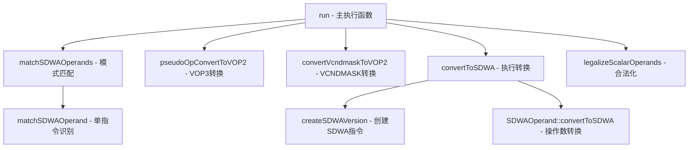

## SIPeepholeSDWA.cpp 代码功能详解

## 1. Pass 的主要功能概述

<a name="ref-block_0"></a>SIPeepholeSDWA 是一个针对 AMD GPU 的机器指令级窥孔优化 Pass，主要功能是将普通的 VOP 指令转换为 SDWA（Sub-Dword Addressing）格式的指令，以提高代码效率。 llvm-project:9-19[<sup>↗</sup>](#block_0) 

**作用与效果：**
- 识别可以合并的移位、位域提取等操作模式
- 将多条指令序列优化为单条 SDWA 指令
- 减少指令数量，提高执行效率
<a name="ref-block_1"></a>- 支持子字（sub-word）级别的数据选择和操作 llvm-project:35-37[<sup>↗</sup>](#block_1) 

## 2. 实现主要功能的步骤与子功能

该 Pass 的核心实现包含以下关键步骤和子功能：

### 主要步骤：

1. **matchSDWAOperands** - SDWA 操作数模式匹配
2. **matchSDWAOperand** - 单个指令的 SDWA 模式识别
3. **pseudoOpConvertToVOP2** - VOP3 到 VOP2 的预转换
4. **convertVcndmaskToVOP2** - VCNDMASK 指令的 VOP2 转换
5. **createSDWAVersion** - 创建 SDWA 版本的指令
6. **convertToSDWA** - 执行 SDWA 转换
7. **legalizeScalarOperands** - 标量操作数合法化
8. **run** - 主执行函数

## 3. 各步骤/子功能的具体描述

### 3.1 matchSDWAOperands - 操作数模式匹配

<a name="ref-block_8"></a>此函数遍历基本块中的所有指令，识别可以转换为 SDWA 操作数的模式。 llvm-project:1002-1010[<sup>↗</sup>](#block_8) 

**功能：** 对基本块中的每条指令调用 `matchSDWAOperand`，将识别出的 SDWA 操作数存储到映射表中，并增加统计计数。

### 3.2 matchSDWAOperand - 单指令模式识别

<a name="ref-block_2"></a>这是最核心的模式识别函数，识别多种可转换为 SDWA 的指令模式。 llvm-project:690-693[<sup>↗</sup>](#block_2) 

**支持的模式包括：**

#### a) 移位指令模式 (V_LSHRREV, V_ASHRREV, V_LSHLREV)
- 识别 16/24 位的右移和左移操作
<a name="ref-block_3"></a>- 转换为 WORD_1/BYTE_3 选择器 llvm-project:694-732[<sup>↗</sup>](#block_3) 

#### b) 16 位移位指令模式
- 识别 8 位移位操作
<a name="ref-block_4"></a>- 转换为 BYTE_1 选择器 llvm-project:734-772[<sup>↗</sup>](#block_4) 

#### c) 位域提取指令 (V_BFE_I32, V_BFE_U32)
- 根据偏移量和宽度参数识别位域提取
<a name="ref-block_5"></a>- 映射到相应的 BYTE/WORD 选择器 llvm-project:774-828[<sup>↗</sup>](#block_5) 

#### d) 位与操作 (V_AND_B32)
- 识别与 0xFFFF 或 0xFF 的掩码操作
<a name="ref-block_6"></a>- 转换为 WORD_0 或 BYTE_0 选择器 llvm-project:830-857[<sup>↗</sup>](#block_6) 

#### e) 位或操作 (V_OR_B32) - UNUSED_PRESERVE 模式
- 识别可以使用 UNUSED_PRESERVE 的模式
<a name="ref-block_7"></a>- 允许保留目标寄存器的部分位 llvm-project:859-989[<sup>↗</sup>](#block_7) 

### 3.3 pseudoOpConvertToVOP2 - VOP3 到 VOP2 预转换

<a name="ref-block_9"></a>将 V_ADD_CO_U32_e64 和 V_SUB_CO_U32_e64 指令转换为 e32 格式，为后续 SDWA 转换做准备。 llvm-project:1030-1083[<sup>↗</sup>](#block_9) 

**功能：**
- 检查指令是否可以缩减
- 验证进位输入/输出是否未使用
- 确保 VCC 寄存器在转换前是死的
- 将指令从 VOP3 格式转换为 VOP2 格式

### 3.4 convertVcndmaskToVOP2 - VCNDMASK 转换

<a name="ref-block_10"></a>将 V_CNDMASK_B32_e64 转换为 VOP2 格式。 llvm-project:1090-1131[<sup>↗</sup>](#block_10) 

**功能：**
- 检查指令是否可缩减
- 验证 VCC 寄存器的活跃性
- 插入 COPY 指令将进位输入复制到 VCC
- 转换为 VOP2 格式

### 3.5 createSDWAVersion - 创建 SDWA 指令

<a name="ref-block_11"></a>为给定的普通指令创建对应的 SDWA 版本。 llvm-project:1199-1299[<sup>↗</sup>](#block_11) 

**功能：**
- 获取 SDWA 操作码
- 复制目标操作数
- 复制并初始化源操作数及修饰符
- 初始化 SDWA 特定操作数（dst_sel, dst_unused, src_sel）
- 处理特殊指令（如 v_mac/v_fmac）

### 3.6 convertToSDWA - 执行 SDWA 转换

<a name="ref-block_12"></a>应用所有 SDWA 操作数模式，完成最终的转换。 llvm-project:1301-1351[<sup>↗</sup>](#block_12) 

**功能：**
- 如果指令已是 SDWA 格式，克隆它；否则创建新的 SDWA 版本
- 对每个 SDWA 操作数调用其 convertToSDWA 方法
- 清除所有使用操作数的 kill 标志
- 删除原始指令

### 3.7 legalizeScalarOperands - 标量操作数合法化

<a name="ref-block_13"></a>将 SDWA 指令中的立即数和标量寄存器操作数转换为向量寄存器。 llvm-project:1355-1384[<sup>↗</sup>](#block_13) 

**功能：**
- 检查每个显式使用的操作数
- 识别需要向量化的立即数或 SGPR 操作数
- 在某些架构上允许一个 SGPR（常量总线限制）
- 插入 V_MOV_B32 指令进行转换

### 3.8 run - 主执行函数

<a name="ref-block_14"></a>Pass 的主入口点，协调整个优化流程。 llvm-project:1393-1461[<sup>↗</sup>](#block_14) 

**执行流程：**
1. 检查目标架构是否支持 SDWA
2. 对每个基本块执行循环优化直到收敛
3. 首次扫描：识别 SDWA 操作数并进行预转换（VOP3→VOP2）
4. 第二次扫描：生成潜在匹配列表
5. 执行 SDWA 转换
6. 合法化转换后指令的标量操作数
7. 重复直到没有更多转换

## 4. 步骤/子功能之间的关系

### 层次关系图：



### 数据流关系：

1. **识别阶段**：
   - `run` 调用 `matchSDWAOperands`
   - `matchSDWAOperands` 调用 `matchSDWAOperand` 识别每条指令
   - 识别结果存储在 `SDWAOperands` 映射表中

2. **预处理阶段**：
   - 对识别出的操作数，调用 `potentialToConvert` 找到可转换的指令
   - 根据指令类型调用 `pseudoOpConvertToVOP2` 或 `convertVcndmaskToVOP2`

3. **匹配构建阶段**：
   - 再次调用 `matchSDWAOperands` 和 `potentialToConvert`
   - 构建 `PotentialMatches` 映射，将指令与其可应用的 SDWA 操作数关联

4. **转换阶段**：
   - 对每个潜在匹配调用 `convertToSDWA`
   - `convertToSDWA` 内部调用 `createSDWAVersion` 创建新指令
   - 调用各个 `SDWAOperand::convertToSDWA` 应用具体的 SDWA 模式

5. **后处理阶段**：
   - 对所有转换后的指令调用 `legalizeScalarOperands`
   - 确保指令满足硬件约束

### 迭代关系：

整个流程在 `run` 函数中以循环方式执行，直到没有更多可转换的模式为止。这种迭代设计允许 Pass 发现由前一轮转换产生的新优化机会。 llvm-project:1407-1458 

## Notes

这个 Pass 是 AMDGPU 后端优化的重要组成部分，它通过识别和转换特定的指令模式来充分利用 GPU 硬件的 SDWA 功能。SDWA 允许在单条指令中进行子字级别的数据选择和操作，减少了指令数量并提高了性能。该 Pass 的设计考虑了多种架构特性（通过 GCNSubtarget 检查），确保生成的代码在不同 GPU 型号上都能正确执行。
### Citations
<a name="block_0"></a>**File:** llvm/lib/Target/AMDGPU/SIPeepholeSDWA.cpp (L9-19) [<sup>↩</sup>](#ref-block_0)
```cpp
/// \file This pass tries to apply several peephole SDWA patterns.
///
/// E.g. original:
///   V_LSHRREV_B32_e32 %0, 16, %1
///   V_ADD_CO_U32_e32 %2, %0, %3
///   V_LSHLREV_B32_e32 %4, 16, %2
///
/// Replace:
///   V_ADD_CO_U32_sdwa %4, %1, %3
///       dst_sel:WORD_1 dst_unused:UNUSED_PAD src0_sel:WORD_1 src1_sel:DWORD
///
```
<a name="block_1"></a>**File:** llvm/lib/Target/AMDGPU/SIPeepholeSDWA.cpp (L35-37) [<sup>↩</sup>](#ref-block_1)
```cpp
STATISTIC(NumSDWAPatternsFound, "Number of SDWA patterns found.");
STATISTIC(NumSDWAInstructionsPeepholed,
          "Number of instruction converted to SDWA.");
```
<a name="block_2"></a>**File:** llvm/lib/Target/AMDGPU/SIPeepholeSDWA.cpp (L690-693) [<sup>↩</sup>](#ref-block_2)
```cpp
std::unique_ptr<SDWAOperand>
SIPeepholeSDWA::matchSDWAOperand(MachineInstr &MI) {
  unsigned Opcode = MI.getOpcode();
  switch (Opcode) {
```
<a name="block_3"></a>**File:** llvm/lib/Target/AMDGPU/SIPeepholeSDWA.cpp (L694-732) [<sup>↩</sup>](#ref-block_3)
```cpp
  case AMDGPU::V_LSHRREV_B32_e32:
  case AMDGPU::V_ASHRREV_I32_e32:
  case AMDGPU::V_LSHLREV_B32_e32:
  case AMDGPU::V_LSHRREV_B32_e64:
  case AMDGPU::V_ASHRREV_I32_e64:
  case AMDGPU::V_LSHLREV_B32_e64: {
    // from: v_lshrrev_b32_e32 v1, 16/24, v0
    // to SDWA src:v0 src_sel:WORD_1/BYTE_3

    // from: v_ashrrev_i32_e32 v1, 16/24, v0
    // to SDWA src:v0 src_sel:WORD_1/BYTE_3 sext:1

    // from: v_lshlrev_b32_e32 v1, 16/24, v0
    // to SDWA dst:v1 dst_sel:WORD_1/BYTE_3 dst_unused:UNUSED_PAD
    MachineOperand *Src0 = TII->getNamedOperand(MI, AMDGPU::OpName::src0);
    auto Imm = foldToImm(*Src0);
    if (!Imm)
      break;

    if (*Imm != 16 && *Imm != 24)
      break;

    MachineOperand *Src1 = TII->getNamedOperand(MI, AMDGPU::OpName::src1);
    MachineOperand *Dst = TII->getNamedOperand(MI, AMDGPU::OpName::vdst);
    if (!Src1->isReg() || Src1->getReg().isPhysical() ||
        Dst->getReg().isPhysical())
      break;

    if (Opcode == AMDGPU::V_LSHLREV_B32_e32 ||
        Opcode == AMDGPU::V_LSHLREV_B32_e64) {
      return std::make_unique<SDWADstOperand>(
          Dst, Src1, *Imm == 16 ? WORD_1 : BYTE_3, UNUSED_PAD);
    }
    return std::make_unique<SDWASrcOperand>(
        Src1, Dst, *Imm == 16 ? WORD_1 : BYTE_3, false, false,
        Opcode != AMDGPU::V_LSHRREV_B32_e32 &&
            Opcode != AMDGPU::V_LSHRREV_B32_e64);
    break;
  }
```
<a name="block_4"></a>**File:** llvm/lib/Target/AMDGPU/SIPeepholeSDWA.cpp (L734-772) [<sup>↩</sup>](#ref-block_4)
```cpp
  case AMDGPU::V_LSHRREV_B16_e32:
  case AMDGPU::V_ASHRREV_I16_e32:
  case AMDGPU::V_LSHLREV_B16_e32:
  case AMDGPU::V_LSHRREV_B16_e64:
  case AMDGPU::V_LSHRREV_B16_opsel_e64:
  case AMDGPU::V_ASHRREV_I16_e64:
  case AMDGPU::V_LSHLREV_B16_opsel_e64:
  case AMDGPU::V_LSHLREV_B16_e64: {
    // from: v_lshrrev_b16_e32 v1, 8, v0
    // to SDWA src:v0 src_sel:BYTE_1

    // from: v_ashrrev_i16_e32 v1, 8, v0
    // to SDWA src:v0 src_sel:BYTE_1 sext:1

    // from: v_lshlrev_b16_e32 v1, 8, v0
    // to SDWA dst:v1 dst_sel:BYTE_1 dst_unused:UNUSED_PAD
    MachineOperand *Src0 = TII->getNamedOperand(MI, AMDGPU::OpName::src0);
    auto Imm = foldToImm(*Src0);
    if (!Imm || *Imm != 8)
      break;

    MachineOperand *Src1 = TII->getNamedOperand(MI, AMDGPU::OpName::src1);
    MachineOperand *Dst = TII->getNamedOperand(MI, AMDGPU::OpName::vdst);

    if (!Src1->isReg() || Src1->getReg().isPhysical() ||
        Dst->getReg().isPhysical())
      break;

    if (Opcode == AMDGPU::V_LSHLREV_B16_e32 ||
        Opcode == AMDGPU::V_LSHLREV_B16_opsel_e64 ||
        Opcode == AMDGPU::V_LSHLREV_B16_e64)
      return std::make_unique<SDWADstOperand>(Dst, Src1, BYTE_1, UNUSED_PAD);
    return std::make_unique<SDWASrcOperand>(
        Src1, Dst, BYTE_1, false, false,
        Opcode != AMDGPU::V_LSHRREV_B16_e32 &&
            Opcode != AMDGPU::V_LSHRREV_B16_opsel_e64 &&
            Opcode != AMDGPU::V_LSHRREV_B16_e64);
    break;
  }
```
<a name="block_5"></a>**File:** llvm/lib/Target/AMDGPU/SIPeepholeSDWA.cpp (L774-828) [<sup>↩</sup>](#ref-block_5)
```cpp
  case AMDGPU::V_BFE_I32_e64:
  case AMDGPU::V_BFE_U32_e64: {
    // e.g.:
    // from: v_bfe_u32 v1, v0, 8, 8
    // to SDWA src:v0 src_sel:BYTE_1

    // offset | width | src_sel
    // ------------------------
    // 0      | 8     | BYTE_0
    // 0      | 16    | WORD_0
    // 0      | 32    | DWORD ?
    // 8      | 8     | BYTE_1
    // 16     | 8     | BYTE_2
    // 16     | 16    | WORD_1
    // 24     | 8     | BYTE_3

    MachineOperand *Src1 = TII->getNamedOperand(MI, AMDGPU::OpName::src1);
    auto Offset = foldToImm(*Src1);
    if (!Offset)
      break;

    MachineOperand *Src2 = TII->getNamedOperand(MI, AMDGPU::OpName::src2);
    auto Width = foldToImm(*Src2);
    if (!Width)
      break;

    SdwaSel SrcSel = DWORD;

    if (*Offset == 0 && *Width == 8)
      SrcSel = BYTE_0;
    else if (*Offset == 0 && *Width == 16)
      SrcSel = WORD_0;
    else if (*Offset == 0 && *Width == 32)
      SrcSel = DWORD;
    else if (*Offset == 8 && *Width == 8)
      SrcSel = BYTE_1;
    else if (*Offset == 16 && *Width == 8)
      SrcSel = BYTE_2;
    else if (*Offset == 16 && *Width == 16)
      SrcSel = WORD_1;
    else if (*Offset == 24 && *Width == 8)
      SrcSel = BYTE_3;
    else
      break;

    MachineOperand *Src0 = TII->getNamedOperand(MI, AMDGPU::OpName::src0);
    MachineOperand *Dst = TII->getNamedOperand(MI, AMDGPU::OpName::vdst);

    if (!Src0->isReg() || Src0->getReg().isPhysical() ||
        Dst->getReg().isPhysical())
      break;

    return std::make_unique<SDWASrcOperand>(
          Src0, Dst, SrcSel, false, false, Opcode != AMDGPU::V_BFE_U32_e64);
  }
```
<a name="block_6"></a>**File:** llvm/lib/Target/AMDGPU/SIPeepholeSDWA.cpp (L830-857) [<sup>↩</sup>](#ref-block_6)
```cpp
  case AMDGPU::V_AND_B32_e32:
  case AMDGPU::V_AND_B32_e64: {
    // e.g.:
    // from: v_and_b32_e32 v1, 0x0000ffff/0x000000ff, v0
    // to SDWA src:v0 src_sel:WORD_0/BYTE_0

    MachineOperand *Src0 = TII->getNamedOperand(MI, AMDGPU::OpName::src0);
    MachineOperand *Src1 = TII->getNamedOperand(MI, AMDGPU::OpName::src1);
    auto *ValSrc = Src1;
    auto Imm = foldToImm(*Src0);

    if (!Imm) {
      Imm = foldToImm(*Src1);
      ValSrc = Src0;
    }

    if (!Imm || (*Imm != 0x0000ffff && *Imm != 0x000000ff))
      break;

    MachineOperand *Dst = TII->getNamedOperand(MI, AMDGPU::OpName::vdst);

    if (!ValSrc->isReg() || ValSrc->getReg().isPhysical() ||
        Dst->getReg().isPhysical())
      break;

    return std::make_unique<SDWASrcOperand>(
        ValSrc, Dst, *Imm == 0x0000ffff ? WORD_0 : BYTE_0);
  }
```
<a name="block_7"></a>**File:** llvm/lib/Target/AMDGPU/SIPeepholeSDWA.cpp (L859-989) [<sup>↩</sup>](#ref-block_7)
```cpp
  case AMDGPU::V_OR_B32_e32:
  case AMDGPU::V_OR_B32_e64: {
    // Patterns for dst_unused:UNUSED_PRESERVE.
    // e.g., from:
    // v_add_f16_sdwa v0, v1, v2 dst_sel:WORD_1 dst_unused:UNUSED_PAD
    //                           src1_sel:WORD_1 src2_sel:WORD1
    // v_add_f16_e32 v3, v1, v2
    // v_or_b32_e32 v4, v0, v3
    // to SDWA preserve dst:v4 dst_sel:WORD_1 dst_unused:UNUSED_PRESERVE preserve:v3

    // Check if one of operands of v_or_b32 is SDWA instruction
    using CheckRetType =
        std::optional<std::pair<MachineOperand *, MachineOperand *>>;
    auto CheckOROperandsForSDWA =
      [&](const MachineOperand *Op1, const MachineOperand *Op2) -> CheckRetType {
        if (!Op1 || !Op1->isReg() || !Op2 || !Op2->isReg())
          return CheckRetType(std::nullopt);

        MachineOperand *Op1Def = findSingleRegDef(Op1, MRI);
        if (!Op1Def)
          return CheckRetType(std::nullopt);

        MachineInstr *Op1Inst = Op1Def->getParent();
        if (!TII->isSDWA(*Op1Inst))
          return CheckRetType(std::nullopt);

        MachineOperand *Op2Def = findSingleRegDef(Op2, MRI);
        if (!Op2Def)
          return CheckRetType(std::nullopt);

        return CheckRetType(std::pair(Op1Def, Op2Def));
      };

    MachineOperand *OrSDWA = TII->getNamedOperand(MI, AMDGPU::OpName::src0);
    MachineOperand *OrOther = TII->getNamedOperand(MI, AMDGPU::OpName::src1);
    assert(OrSDWA && OrOther);
    auto Res = CheckOROperandsForSDWA(OrSDWA, OrOther);
    if (!Res) {
      OrSDWA = TII->getNamedOperand(MI, AMDGPU::OpName::src1);
      OrOther = TII->getNamedOperand(MI, AMDGPU::OpName::src0);
      assert(OrSDWA && OrOther);
      Res = CheckOROperandsForSDWA(OrSDWA, OrOther);
      if (!Res)
        break;
    }

    MachineOperand *OrSDWADef = Res->first;
    MachineOperand *OrOtherDef = Res->second;
    assert(OrSDWADef && OrOtherDef);

    MachineInstr *SDWAInst = OrSDWADef->getParent();
    MachineInstr *OtherInst = OrOtherDef->getParent();

    // Check that OtherInstr is actually bitwise compatible with SDWAInst = their
    // destination patterns don't overlap. Compatible instruction can be either
    // regular instruction with compatible bitness or SDWA instruction with
    // correct dst_sel
    // SDWAInst | OtherInst bitness / OtherInst dst_sel
    // -----------------------------------------------------
    // DWORD    | no                    / no
    // WORD_0   | no                    / BYTE_2/3, WORD_1
    // WORD_1   | 8/16-bit instructions / BYTE_0/1, WORD_0
    // BYTE_0   | no                    / BYTE_1/2/3, WORD_1
    // BYTE_1   | 8-bit                 / BYTE_0/2/3, WORD_1
    // BYTE_2   | 8/16-bit              / BYTE_0/1/3. WORD_0
    // BYTE_3   | 8/16/24-bit           / BYTE_0/1/2, WORD_0
    // E.g. if SDWAInst is v_add_f16_sdwa dst_sel:WORD_1 then v_add_f16 is OK
    // but v_add_f32 is not.

    // TODO: add support for non-SDWA instructions as OtherInst.
    // For now this only works with SDWA instructions. For regular instructions
    // there is no way to determine if the instruction writes only 8/16/24-bit
    // out of full register size and all registers are at min 32-bit wide.
    if (!TII->isSDWA(*OtherInst))
      break;

    SdwaSel DstSel = static_cast<SdwaSel>(
        TII->getNamedImmOperand(*SDWAInst, AMDGPU::OpName::dst_sel));
    SdwaSel OtherDstSel = static_cast<SdwaSel>(
      TII->getNamedImmOperand(*OtherInst, AMDGPU::OpName::dst_sel));

    bool DstSelAgree = false;
    switch (DstSel) {
    case WORD_0: DstSelAgree = ((OtherDstSel == BYTE_2) ||
                                (OtherDstSel == BYTE_3) ||
                                (OtherDstSel == WORD_1));
      break;
    case WORD_1: DstSelAgree = ((OtherDstSel == BYTE_0) ||
                                (OtherDstSel == BYTE_1) ||
                                (OtherDstSel == WORD_0));
      break;
    case BYTE_0: DstSelAgree = ((OtherDstSel == BYTE_1) ||
                                (OtherDstSel == BYTE_2) ||
                                (OtherDstSel == BYTE_3) ||
                                (OtherDstSel == WORD_1));
      break;
    case BYTE_1: DstSelAgree = ((OtherDstSel == BYTE_0) ||
                                (OtherDstSel == BYTE_2) ||
                                (OtherDstSel == BYTE_3) ||
                                (OtherDstSel == WORD_1));
      break;
    case BYTE_2: DstSelAgree = ((OtherDstSel == BYTE_0) ||
                                (OtherDstSel == BYTE_1) ||
                                (OtherDstSel == BYTE_3) ||
                                (OtherDstSel == WORD_0));
      break;
    case BYTE_3: DstSelAgree = ((OtherDstSel == BYTE_0) ||
                                (OtherDstSel == BYTE_1) ||
                                (OtherDstSel == BYTE_2) ||
                                (OtherDstSel == WORD_0));
      break;
    default: DstSelAgree = false;
    }

    if (!DstSelAgree)
      break;

    // Also OtherInst dst_unused should be UNUSED_PAD
    DstUnused OtherDstUnused = static_cast<DstUnused>(
      TII->getNamedImmOperand(*OtherInst, AMDGPU::OpName::dst_unused));
    if (OtherDstUnused != DstUnused::UNUSED_PAD)
      break;

    // Create DstPreserveOperand
    MachineOperand *OrDst = TII->getNamedOperand(MI, AMDGPU::OpName::vdst);
    assert(OrDst && OrDst->isReg());

    return std::make_unique<SDWADstPreserveOperand>(
      OrDst, OrSDWADef, OrOtherDef, DstSel);

  }
```
<a name="block_8"></a>**File:** llvm/lib/Target/AMDGPU/SIPeepholeSDWA.cpp (L1002-1010) [<sup>↩</sup>](#ref-block_8)
```cpp
void SIPeepholeSDWA::matchSDWAOperands(MachineBasicBlock &MBB) {
  for (MachineInstr &MI : MBB) {
    if (auto Operand = matchSDWAOperand(MI)) {
      LLVM_DEBUG(dbgs() << "Match: " << MI << "To: " << *Operand << '\n');
      SDWAOperands[&MI] = std::move(Operand);
      ++NumSDWAPatternsFound;
    }
  }
}
```
<a name="block_9"></a>**File:** llvm/lib/Target/AMDGPU/SIPeepholeSDWA.cpp (L1030-1083) [<sup>↩</sup>](#ref-block_9)
```cpp
void SIPeepholeSDWA::pseudoOpConvertToVOP2(MachineInstr &MI,
                                           const GCNSubtarget &ST) const {
  int Opc = MI.getOpcode();
  assert((Opc == AMDGPU::V_ADD_CO_U32_e64 || Opc == AMDGPU::V_SUB_CO_U32_e64) &&
         "Currently only handles V_ADD_CO_U32_e64 or V_SUB_CO_U32_e64");

  // Can the candidate MI be shrunk?
  if (!TII->canShrink(MI, *MRI))
    return;
  Opc = AMDGPU::getVOPe32(Opc);
  // Find the related ADD instruction.
  const MachineOperand *Sdst = TII->getNamedOperand(MI, AMDGPU::OpName::sdst);
  if (!Sdst)
    return;
  MachineOperand *NextOp = findSingleRegUse(Sdst, MRI);
  if (!NextOp)
    return;
  MachineInstr &MISucc = *NextOp->getParent();

  // Make sure the carry in/out are subsequently unused.
  MachineOperand *CarryIn = TII->getNamedOperand(MISucc, AMDGPU::OpName::src2);
  if (!CarryIn)
    return;
  MachineOperand *CarryOut = TII->getNamedOperand(MISucc, AMDGPU::OpName::sdst);
  if (!CarryOut)
    return;
  if (!MRI->hasOneUse(CarryIn->getReg()) || !MRI->use_empty(CarryOut->getReg()))
    return;
  // Make sure VCC or its subregs are dead before MI.
  MachineBasicBlock &MBB = *MI.getParent();
  MachineBasicBlock::LivenessQueryResult Liveness =
      MBB.computeRegisterLiveness(TRI, AMDGPU::VCC, MI, 25);
  if (Liveness != MachineBasicBlock::LQR_Dead)
    return;
  // Check if VCC is referenced in range of (MI,MISucc].
  for (auto I = std::next(MI.getIterator()), E = MISucc.getIterator();
       I != E; ++I) {
    if (I->modifiesRegister(AMDGPU::VCC, TRI))
      return;
  }

  // Replace MI with V_{SUB|ADD}_I32_e32
  BuildMI(MBB, MI, MI.getDebugLoc(), TII->get(Opc))
    .add(*TII->getNamedOperand(MI, AMDGPU::OpName::vdst))
    .add(*TII->getNamedOperand(MI, AMDGPU::OpName::src0))
    .add(*TII->getNamedOperand(MI, AMDGPU::OpName::src1))
    .setMIFlags(MI.getFlags());

  MI.eraseFromParent();

  // Since the carry output of MI is now VCC, update its use in MISucc.

  MISucc.substituteRegister(CarryIn->getReg(), TRI->getVCC(), 0, *TRI);
}
```
<a name="block_10"></a>**File:** llvm/lib/Target/AMDGPU/SIPeepholeSDWA.cpp (L1090-1131) [<sup>↩</sup>](#ref-block_10)
```cpp
void SIPeepholeSDWA::convertVcndmaskToVOP2(MachineInstr &MI,
                                           const GCNSubtarget &ST) const {
  assert(MI.getOpcode() == AMDGPU::V_CNDMASK_B32_e64);

  LLVM_DEBUG(dbgs() << "Attempting VOP2 conversion: " << MI);
  if (!TII->canShrink(MI, *MRI)) {
    LLVM_DEBUG(dbgs() << "Cannot shrink instruction\n");
    return;
  }

  const MachineOperand &CarryIn =
      *TII->getNamedOperand(MI, AMDGPU::OpName::src2);
  Register CarryReg = CarryIn.getReg();
  MachineInstr *CarryDef = MRI->getVRegDef(CarryReg);
  if (!CarryDef) {
    LLVM_DEBUG(dbgs() << "Missing carry-in operand definition\n");
    return;
  }

  // Make sure VCC or its subregs are dead before MI.
  MCRegister Vcc = TRI->getVCC();
  MachineBasicBlock &MBB = *MI.getParent();
  MachineBasicBlock::LivenessQueryResult Liveness =
      MBB.computeRegisterLiveness(TRI, Vcc, MI);
  if (Liveness != MachineBasicBlock::LQR_Dead) {
    LLVM_DEBUG(dbgs() << "VCC not known to be dead before instruction\n");
    return;
  }

  BuildMI(MBB, MI, MI.getDebugLoc(), TII->get(AMDGPU::COPY), Vcc).add(CarryIn);

  auto Converted = BuildMI(MBB, MI, MI.getDebugLoc(),
                           TII->get(AMDGPU::getVOPe32(MI.getOpcode())))
                       .add(*TII->getNamedOperand(MI, AMDGPU::OpName::vdst))
                       .add(*TII->getNamedOperand(MI, AMDGPU::OpName::src0))
                       .add(*TII->getNamedOperand(MI, AMDGPU::OpName::src1))
                       .setMIFlags(MI.getFlags());
  TII->fixImplicitOperands(*Converted);
  LLVM_DEBUG(dbgs() << "Converted to VOP2: " << *Converted);
  (void)Converted;
  MI.eraseFromParent();
}
```
<a name="block_11"></a>**File:** llvm/lib/Target/AMDGPU/SIPeepholeSDWA.cpp (L1199-1299) [<sup>↩</sup>](#ref-block_11)
```cpp
MachineInstr *SIPeepholeSDWA::createSDWAVersion(MachineInstr &MI) {
  unsigned Opcode = MI.getOpcode();
  assert(!TII->isSDWA(Opcode));

  int SDWAOpcode = AMDGPU::getSDWAOp(Opcode);
  if (SDWAOpcode == -1)
    SDWAOpcode = AMDGPU::getSDWAOp(AMDGPU::getVOPe32(Opcode));
  assert(SDWAOpcode != -1);

  const MCInstrDesc &SDWADesc = TII->get(SDWAOpcode);

  // Create SDWA version of instruction MI and initialize its operands
  MachineInstrBuilder SDWAInst =
    BuildMI(*MI.getParent(), MI, MI.getDebugLoc(), SDWADesc)
    .setMIFlags(MI.getFlags());

  // Copy dst, if it is present in original then should also be present in SDWA
  MachineOperand *Dst = TII->getNamedOperand(MI, AMDGPU::OpName::vdst);
  if (Dst) {
    assert(AMDGPU::hasNamedOperand(SDWAOpcode, AMDGPU::OpName::vdst));
    SDWAInst.add(*Dst);
  } else if ((Dst = TII->getNamedOperand(MI, AMDGPU::OpName::sdst))) {
    assert(Dst && AMDGPU::hasNamedOperand(SDWAOpcode, AMDGPU::OpName::sdst));
    SDWAInst.add(*Dst);
  } else {
    assert(AMDGPU::hasNamedOperand(SDWAOpcode, AMDGPU::OpName::sdst));
    SDWAInst.addReg(TRI->getVCC(), RegState::Define);
  }

  // Copy src0, initialize src0_modifiers. All sdwa instructions has src0 and
  // src0_modifiers (except for v_nop_sdwa, but it can't get here)
  MachineOperand *Src0 = TII->getNamedOperand(MI, AMDGPU::OpName::src0);
  assert(Src0 && AMDGPU::hasNamedOperand(SDWAOpcode, AMDGPU::OpName::src0) &&
         AMDGPU::hasNamedOperand(SDWAOpcode, AMDGPU::OpName::src0_modifiers));
  if (auto *Mod = TII->getNamedOperand(MI, AMDGPU::OpName::src0_modifiers))
    SDWAInst.addImm(Mod->getImm());
  else
    SDWAInst.addImm(0);
  SDWAInst.add(*Src0);

  // Copy src1 if present, initialize src1_modifiers.
  MachineOperand *Src1 = TII->getNamedOperand(MI, AMDGPU::OpName::src1);
  if (Src1) {
    assert(AMDGPU::hasNamedOperand(SDWAOpcode, AMDGPU::OpName::src1) &&
           AMDGPU::hasNamedOperand(SDWAOpcode, AMDGPU::OpName::src1_modifiers));
    if (auto *Mod = TII->getNamedOperand(MI, AMDGPU::OpName::src1_modifiers))
      SDWAInst.addImm(Mod->getImm());
    else
      SDWAInst.addImm(0);
    SDWAInst.add(*Src1);
  }

  if (SDWAOpcode == AMDGPU::V_FMAC_F16_sdwa ||
      SDWAOpcode == AMDGPU::V_FMAC_F32_sdwa ||
      SDWAOpcode == AMDGPU::V_MAC_F16_sdwa ||
      SDWAOpcode == AMDGPU::V_MAC_F32_sdwa) {
    // v_mac_f16/32 has additional src2 operand tied to vdst
    MachineOperand *Src2 = TII->getNamedOperand(MI, AMDGPU::OpName::src2);
    assert(Src2);
    SDWAInst.add(*Src2);
  }

  // Copy clamp if present, initialize otherwise
  assert(AMDGPU::hasNamedOperand(SDWAOpcode, AMDGPU::OpName::clamp));
  MachineOperand *Clamp = TII->getNamedOperand(MI, AMDGPU::OpName::clamp);
  if (Clamp) {
    SDWAInst.add(*Clamp);
  } else {
    SDWAInst.addImm(0);
  }

  // Copy omod if present, initialize otherwise if needed
  if (AMDGPU::hasNamedOperand(SDWAOpcode, AMDGPU::OpName::omod)) {
    MachineOperand *OMod = TII->getNamedOperand(MI, AMDGPU::OpName::omod);
    if (OMod) {
      SDWAInst.add(*OMod);
    } else {
      SDWAInst.addImm(0);
    }
  }

  // Initialize SDWA specific operands
  if (AMDGPU::hasNamedOperand(SDWAOpcode, AMDGPU::OpName::dst_sel))
    SDWAInst.addImm(AMDGPU::SDWA::SdwaSel::DWORD);

  if (AMDGPU::hasNamedOperand(SDWAOpcode, AMDGPU::OpName::dst_unused))
    SDWAInst.addImm(AMDGPU::SDWA::DstUnused::UNUSED_PAD);

  assert(AMDGPU::hasNamedOperand(SDWAOpcode, AMDGPU::OpName::src0_sel));
  SDWAInst.addImm(AMDGPU::SDWA::SdwaSel::DWORD);

  if (Src1) {
    assert(AMDGPU::hasNamedOperand(SDWAOpcode, AMDGPU::OpName::src1_sel));
    SDWAInst.addImm(AMDGPU::SDWA::SdwaSel::DWORD);
  }

  // Check for a preserved register that needs to be copied.
  MachineInstr *Ret = SDWAInst.getInstr();
  TII->fixImplicitOperands(*Ret);
  return Ret;
}
```
<a name="block_12"></a>**File:** llvm/lib/Target/AMDGPU/SIPeepholeSDWA.cpp (L1301-1351) [<sup>↩</sup>](#ref-block_12)
```cpp
bool SIPeepholeSDWA::convertToSDWA(MachineInstr &MI,
                                   const SDWAOperandsVector &SDWAOperands) {
  LLVM_DEBUG(dbgs() << "Convert instruction:" << MI);

  MachineInstr *SDWAInst;
  if (TII->isSDWA(MI.getOpcode())) {
    // Clone the instruction to allow revoking changes
    // made to MI during the processing of the operands
    // if the conversion fails.
    SDWAInst = MI.getParent()->getParent()->CloneMachineInstr(&MI);
    MI.getParent()->insert(MI.getIterator(), SDWAInst);
  } else {
    SDWAInst = createSDWAVersion(MI);
  }

  // Apply all sdwa operand patterns.
  bool Converted = false;
  for (auto &Operand : SDWAOperands) {
    LLVM_DEBUG(dbgs() << *SDWAInst << "\nOperand: " << *Operand);
    // There should be no intersection between SDWA operands and potential MIs
    // e.g.:
    // v_and_b32 v0, 0xff, v1 -> src:v1 sel:BYTE_0
    // v_and_b32 v2, 0xff, v0 -> src:v0 sel:BYTE_0
    // v_add_u32 v3, v4, v2
    //
    // In that example it is possible that we would fold 2nd instruction into
    // 3rd (v_add_u32_sdwa) and then try to fold 1st instruction into 2nd (that
    // was already destroyed). So if SDWAOperand is also a potential MI then do
    // not apply it.
    if (PotentialMatches.count(Operand->getParentInst()) == 0)
      Converted |= Operand->convertToSDWA(*SDWAInst, TII);
  }

  if (!Converted) {
    SDWAInst->eraseFromParent();
    return false;
  }

  ConvertedInstructions.push_back(SDWAInst);
  for (MachineOperand &MO : SDWAInst->uses()) {
    if (!MO.isReg())
      continue;

    MRI->clearKillFlags(MO.getReg());
  }
  LLVM_DEBUG(dbgs() << "\nInto:" << *SDWAInst << '\n');
  ++NumSDWAInstructionsPeepholed;

  MI.eraseFromParent();
  return true;
}
```
<a name="block_13"></a>**File:** llvm/lib/Target/AMDGPU/SIPeepholeSDWA.cpp (L1355-1384) [<sup>↩</sup>](#ref-block_13)
```cpp
void SIPeepholeSDWA::legalizeScalarOperands(MachineInstr &MI,
                                            const GCNSubtarget &ST) const {
  const MCInstrDesc &Desc = TII->get(MI.getOpcode());
  unsigned ConstantBusCount = 0;
  for (MachineOperand &Op : MI.explicit_uses()) {
    if (!Op.isImm() && !(Op.isReg() && !TRI->isVGPR(*MRI, Op.getReg())))
      continue;

    unsigned I = Op.getOperandNo();
    if (Desc.operands()[I].RegClass == -1 ||
        !TRI->isVSSuperClass(TRI->getRegClass(Desc.operands()[I].RegClass)))
      continue;

    if (ST.hasSDWAScalar() && ConstantBusCount == 0 && Op.isReg() &&
        TRI->isSGPRReg(*MRI, Op.getReg())) {
      ++ConstantBusCount;
      continue;
    }

    Register VGPR = MRI->createVirtualRegister(&AMDGPU::VGPR_32RegClass);
    auto Copy = BuildMI(*MI.getParent(), MI.getIterator(), MI.getDebugLoc(),
                        TII->get(AMDGPU::V_MOV_B32_e32), VGPR);
    if (Op.isImm())
      Copy.addImm(Op.getImm());
    else if (Op.isReg())
      Copy.addReg(Op.getReg(), Op.isKill() ? RegState::Kill : 0,
                  Op.getSubReg());
    Op.ChangeToRegister(VGPR, false);
  }
}
```
<a name="block_14"></a>**File:** llvm/lib/Target/AMDGPU/SIPeepholeSDWA.cpp (L1393-1461) [<sup>↩</sup>](#ref-block_14)
```cpp
bool SIPeepholeSDWA::run(MachineFunction &MF) {
  const GCNSubtarget &ST = MF.getSubtarget<GCNSubtarget>();

  if (!ST.hasSDWA())
    return false;

  MRI = &MF.getRegInfo();
  TRI = ST.getRegisterInfo();
  TII = ST.getInstrInfo();

  // Find all SDWA operands in MF.
  bool Ret = false;
  for (MachineBasicBlock &MBB : MF) {
    bool Changed = false;
    do {
      // Preprocess the ADD/SUB pairs so they could be SDWA'ed.
      // Look for a possible ADD or SUB that resulted from a previously lowered
      // V_{ADD|SUB}_U64_PSEUDO. The function pseudoOpConvertToVOP2
      // lowers the pair of instructions into e32 form.
      matchSDWAOperands(MBB);
      for (const auto &OperandPair : SDWAOperands) {
        const auto &Operand = OperandPair.second;
        MachineInstr *PotentialMI = Operand->potentialToConvert(TII, ST);
        if (!PotentialMI)
          continue;

        switch (PotentialMI->getOpcode()) {
        case AMDGPU::V_ADD_CO_U32_e64:
        case AMDGPU::V_SUB_CO_U32_e64:
          pseudoOpConvertToVOP2(*PotentialMI, ST);
          break;
        case AMDGPU::V_CNDMASK_B32_e64:
          convertVcndmaskToVOP2(*PotentialMI, ST);
          break;
        };
      }
      SDWAOperands.clear();

      // Generate potential match list.
      matchSDWAOperands(MBB);

      for (const auto &OperandPair : SDWAOperands) {
        const auto &Operand = OperandPair.second;
        MachineInstr *PotentialMI =
            Operand->potentialToConvert(TII, ST, &PotentialMatches);

        if (PotentialMI && isConvertibleToSDWA(*PotentialMI, ST, TII))
          PotentialMatches[PotentialMI].push_back(Operand.get());
      }

      for (auto &PotentialPair : PotentialMatches) {
        MachineInstr &PotentialMI = *PotentialPair.first;
        convertToSDWA(PotentialMI, PotentialPair.second);
      }

      PotentialMatches.clear();
      SDWAOperands.clear();

      Changed = !ConvertedInstructions.empty();

      if (Changed)
        Ret = true;
      while (!ConvertedInstructions.empty())
        legalizeScalarOperands(*ConvertedInstructions.pop_back_val(), ST);
    } while (Changed);
  }

  return Ret;
}
```