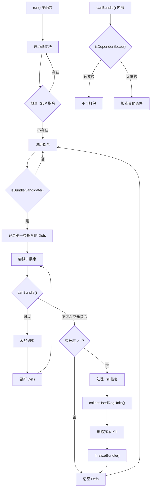

# SIPostRABundler.cpp 代码功能详解

## 1. Pass 的主要功能概述

<a name="ref-block_0"></a>**SIPostRABundler** 是一个后寄存器分配（post-RA）阶段的 LLVM 机器码优化 Pass，其核心作用是**创建内存指令束（bundles），以防止相邻的加载和存储指令在寄存器分配后被调度器重新排序分离**。 llvm-project:10-12[<sup>↗</sup>](#block_0) 

这个 Pass 的主要效果是：
- 保护相邻的内存访问指令的顺序关系
- 通过将多条内存指令组合成一个原子束，使调度器将它们作为整体处理
<a name="ref-block_1"></a>- 专门针对 AMDGPU 架构的内存指令（MTBUF、MUBUF、SMRD、DS、FLAT、MIMG、VIMAGE、VSAMPLE） llvm-project:65-68[<sup>↗</sup>](#block_1) 

## 2. 主要功能的步骤和子功能

该 Pass 的实现包含以下关键步骤和子功能：

### 主要子功能模块：
1. **`isBundleCandidate()`** - 判断指令是否为束候选
2. **`canBundle()`** - 判断两条指令是否可以打包在一起
3. **`isDependentLoad()`** - 检测依赖加载
4. **`collectUsedRegUnits()`** - 收集使用的寄存器单元
5. **`run()`** - 主执行逻辑

## 3. 各步骤的具体描述分析

### 3.1 `isBundleCandidate()` - 束候选判断

<a name="ref-block_4"></a>此函数判断一条机器指令是否有资格成为束的候选指令。 llvm-project:117-120[<sup>↗</sup>](#block_4) 

**判断标准：**
- 指令必须具有内存操作标志（MemFlags）
- 指令必须执行加载或存储操作
- 指令当前尚未被打包

### 3.2 `canBundle()` - 束兼容性检查

<a name="ref-block_5"></a>此函数判断两条连续的指令是否可以打包成同一个束。 llvm-project:122-130[<sup>↗</sup>](#block_5) 

**兼容性条件：**
- 两条指令必须具有相同的内存操作类型（同为加载或同为存储）
- 必须具有相同的内存标志（同类型的内存指令）
- 下一条指令尚未被打包
- 下一条指令不是依赖于前面定义的加载指令

### 3.3 `isDependentLoad()` - 依赖加载检测

<a name="ref-block_2"></a>此函数检测一条加载指令是否依赖于之前束中指令定义的寄存器。 llvm-project:83-97[<sup>↗</sup>](#block_2) 

**检测逻辑：**
- 如果指令不是加载操作，返回 false
- 遍历指令的所有显式操作数
- 检查是否有任何操作数寄存器与已记录的定义寄存器（Defs）重叠
- 如果存在重叠，说明存在数据依赖，不能打包在一起

### 3.4 `collectUsedRegUnits()` - 寄存器单元收集

<a name="ref-block_3"></a>此函数收集一条指令读取的所有寄存器单元，用于后续的 kill 指令处理。 llvm-project:99-115[<sup>↗</sup>](#block_3) 

**收集逻辑：**
- 跳过调试指令
- 遍历指令的所有操作数
- 对于读取的寄存器操作数，标记其所有寄存器单元
- 确保寄存器分配后不存在子寄存器索引

### 3.5 `run()` - 主执行逻辑

<a name="ref-block_6"></a>这是 Pass 的核心执行函数，实现完整的束创建算法。 llvm-project:144-243[<sup>↗</sup>](#block_6) 

**主要执行步骤：**

**步骤 A：基本块筛选**
- 检查基本块是否包含 IGLP（Instruction Group Level Parallelism）相关指令
- 如果存在 SCHED_GROUP_BARRIER 或 IGLP_OPT 指令，则跳过该基本块 llvm-project:152-159 

**步骤 B：寻找束的起始候选**
- 遍历基本块中的所有指令
- 使用 `isBundleCandidate()` 找到可以作为束起始的指令
- 记录该指令定义的寄存器到 Defs 集合 llvm-project:165-173 

**步骤 C：扩展束**
- 从起始指令开始，尝试向后查找更多可打包的指令
- 使用 `canBundle()` 检查后续指令的兼容性
- 允许元指令（meta instructions）出现在束中间，但不能作为束的起始或结束
- 累积束的长度和定义的寄存器 llvm-project:178-196 

**步骤 D：处理 Kill 指令**
- 如果束长度大于 1，检查束后是否有 kill 指令
- Kill 指令是寄存器分配前插入的提示指令
- 收集束中使用的寄存器单元
- 删除那些只 kill 束中已使用寄存器的 kill 指令 llvm-project:199-233 

**步骤 E：最终化束**
- 调用 `finalizeBundle()` 将指令序列标记为一个束
- 清空 Defs 集合以准备下一次迭代 llvm-project:235-238 

## 4. 步骤和子功能之间的关系

各个组件之间的关系可以用以下流程图表示：



**关键依赖关系：**

1. **`run()` → `isBundleCandidate()`**: 主函数使用此函数识别潜在的束起始点

2. **`run()` → `canBundle()` → `isDependentLoad()`**: 束扩展过程通过 `canBundle()` 检查兼容性，后者依赖 `isDependentLoad()` 检测数据依赖

3. **`run()` → `collectUsedRegUnits()`**: Kill 指令处理阶段使用此函数分析寄存器使用情况

4. **`Defs` 集合的作用**: 贯穿整个束构建过程，记录束中所有定义的寄存器，供 `isDependentLoad()` 使用以避免数据冒险

5. **束的生命周期**: 识别候选 → 扩展束 → 处理 Kill → 最终化 → 清理状态

## Notes

这个 Pass 是 AMDGPU 后端特有的优化，主要针对 GPU 的内存访问模式。它在寄存器分配之后运行，这意味着寄存器已经确定，Pass 需要小心处理数据依赖关系以避免破坏程序语义。

代码中特别注意了 IGLP（Instruction Group Level Parallelism）优化的兼容性，当存在 IGLP 相关指令时会跳过束化，以避免与其他调度优化产生冲突。 llvm-project:157-159 

Kill 指令的处理逻辑较为复杂，代码中也提到可能需要将 kill 标志反向传播到束中，或者考虑在 RA 后完全移除所有 kill 指令。 llvm-project:207-222
### Citations
<a name="block_0"></a>**File:** llvm/lib/Target/AMDGPU/SIPostRABundler.cpp (L10-12) [<sup>↩</sup>](#ref-block_0)
```cpp
/// This pass creates bundles of memory instructions to protect adjacent loads
/// and stores from being rescheduled apart from each other post-RA.
///
```
<a name="block_1"></a>**File:** llvm/lib/Target/AMDGPU/SIPostRABundler.cpp (L65-68) [<sup>↩</sup>](#ref-block_1)
```cpp
constexpr uint64_t MemFlags = SIInstrFlags::MTBUF | SIInstrFlags::MUBUF |
                              SIInstrFlags::SMRD | SIInstrFlags::DS |
                              SIInstrFlags::FLAT | SIInstrFlags::MIMG |
                              SIInstrFlags::VIMAGE | SIInstrFlags::VSAMPLE;
```
<a name="block_2"></a>**File:** llvm/lib/Target/AMDGPU/SIPostRABundler.cpp (L83-97) [<sup>↩</sup>](#ref-block_2)
```cpp
bool SIPostRABundler::isDependentLoad(const MachineInstr &MI) const {
  if (!MI.mayLoad())
    return false;

  for (const MachineOperand &Op : MI.explicit_operands()) {
    if (!Op.isReg())
      continue;
    Register Reg = Op.getReg();
    for (Register Def : Defs)
      if (TRI->regsOverlap(Reg, Def))
        return true;
  }

  return false;
}
```
<a name="block_3"></a>**File:** llvm/lib/Target/AMDGPU/SIPostRABundler.cpp (L99-115) [<sup>↩</sup>](#ref-block_3)
```cpp
void SIPostRABundler::collectUsedRegUnits(const MachineInstr &MI,
                                          BitVector &UsedRegUnits) const {
  if (MI.isDebugInstr())
    return;

  for (const MachineOperand &Op : MI.operands()) {
    if (!Op.isReg() || !Op.readsReg())
      continue;

    Register Reg = Op.getReg();
    assert(!Op.getSubReg() &&
           "subregister indexes should not be present after RA");

    for (MCRegUnit Unit : TRI->regunits(Reg))
      UsedRegUnits.set(Unit);
  }
}
```
<a name="block_4"></a>**File:** llvm/lib/Target/AMDGPU/SIPostRABundler.cpp (L117-120) [<sup>↩</sup>](#ref-block_4)
```cpp
bool SIPostRABundler::isBundleCandidate(const MachineInstr &MI) const {
  const uint64_t IMemFlags = MI.getDesc().TSFlags & MemFlags;
  return IMemFlags != 0 && MI.mayLoadOrStore() && !MI.isBundled();
}
```
<a name="block_5"></a>**File:** llvm/lib/Target/AMDGPU/SIPostRABundler.cpp (L122-130) [<sup>↩</sup>](#ref-block_5)
```cpp
bool SIPostRABundler::canBundle(const MachineInstr &MI,
                                const MachineInstr &NextMI) const {
  const uint64_t IMemFlags = MI.getDesc().TSFlags & MemFlags;

  return (IMemFlags != 0 && MI.mayLoadOrStore() && !NextMI.isBundled() &&
          NextMI.mayLoad() == MI.mayLoad() && NextMI.mayStore() == MI.mayStore() &&
          ((NextMI.getDesc().TSFlags & MemFlags) == IMemFlags) &&
          !isDependentLoad(NextMI));
}
```
<a name="block_6"></a>**File:** llvm/lib/Target/AMDGPU/SIPostRABundler.cpp (L144-243) [<sup>↩</sup>](#ref-block_6)
```cpp
bool SIPostRABundler::run(MachineFunction &MF) {

  TRI = MF.getSubtarget<GCNSubtarget>().getRegisterInfo();
  BitVector BundleUsedRegUnits(TRI->getNumRegUnits());
  BitVector KillUsedRegUnits(TRI->getNumRegUnits());

  bool Changed = false;
  for (MachineBasicBlock &MBB : MF) {
    bool HasIGLPInstrs = llvm::any_of(MBB.instrs(), [](MachineInstr &MI) {
      unsigned Opc = MI.getOpcode();
      return Opc == AMDGPU::SCHED_GROUP_BARRIER || Opc == AMDGPU::IGLP_OPT;
    });

    // Don't cluster with IGLP instructions.
    if (HasIGLPInstrs)
      continue;

    MachineBasicBlock::instr_iterator Next;
    MachineBasicBlock::instr_iterator B = MBB.instr_begin();
    MachineBasicBlock::instr_iterator E = MBB.instr_end();

    for (auto I = B; I != E; I = Next) {
      Next = std::next(I);
      if (!isBundleCandidate(*I))
        continue;

      assert(Defs.empty());

      if (I->getNumExplicitDefs() != 0)
        Defs.insert(I->defs().begin()->getReg());

      MachineBasicBlock::instr_iterator BundleStart = I;
      MachineBasicBlock::instr_iterator BundleEnd = I;
      unsigned ClauseLength = 1;
      for (I = Next; I != E; I = Next) {
        Next = std::next(I);

        assert(BundleEnd != I);
        if (canBundle(*BundleEnd, *I)) {
          BundleEnd = I;
          if (I->getNumExplicitDefs() != 0)
            Defs.insert(I->defs().begin()->getReg());
          ++ClauseLength;
        } else if (!I->isMetaInstruction()) {
          // Allow meta instructions in between bundle candidates, but do not
          // start or end a bundle on one.
          //
          // TODO: It may be better to move meta instructions like dbg_value
          // after the bundle. We're relying on the memory legalizer to unbundle
          // these.
          break;
        }
      }

      Next = std::next(BundleEnd);
      if (ClauseLength > 1) {
        Changed = true;

        // Before register allocation, kills are inserted after potential soft
        // clauses to hint register allocation. Look for kills that look like
        // this, and erase them.
        if (Next != E && Next->isKill()) {

          // TODO: Should maybe back-propagate kill flags to the bundle.
          for (const MachineInstr &BundleMI : make_range(BundleStart, Next))
            collectUsedRegUnits(BundleMI, BundleUsedRegUnits);

          BundleUsedRegUnits.flip();

          while (Next != E && Next->isKill()) {
            MachineInstr &Kill = *Next;
            collectUsedRegUnits(Kill, KillUsedRegUnits);

            KillUsedRegUnits &= BundleUsedRegUnits;

            // Erase the kill if it's a subset of the used registers.
            //
            // TODO: Should we just remove all kills? Is there any real reason to
            // keep them after RA?
            if (KillUsedRegUnits.none()) {
              ++Next;
              Kill.eraseFromParent();
            } else
              break;

            KillUsedRegUnits.reset();
          }

          BundleUsedRegUnits.reset();
        }

        finalizeBundle(MBB, BundleStart, Next);
      }

      Defs.clear();
    }
  }

  return Changed;
}
```