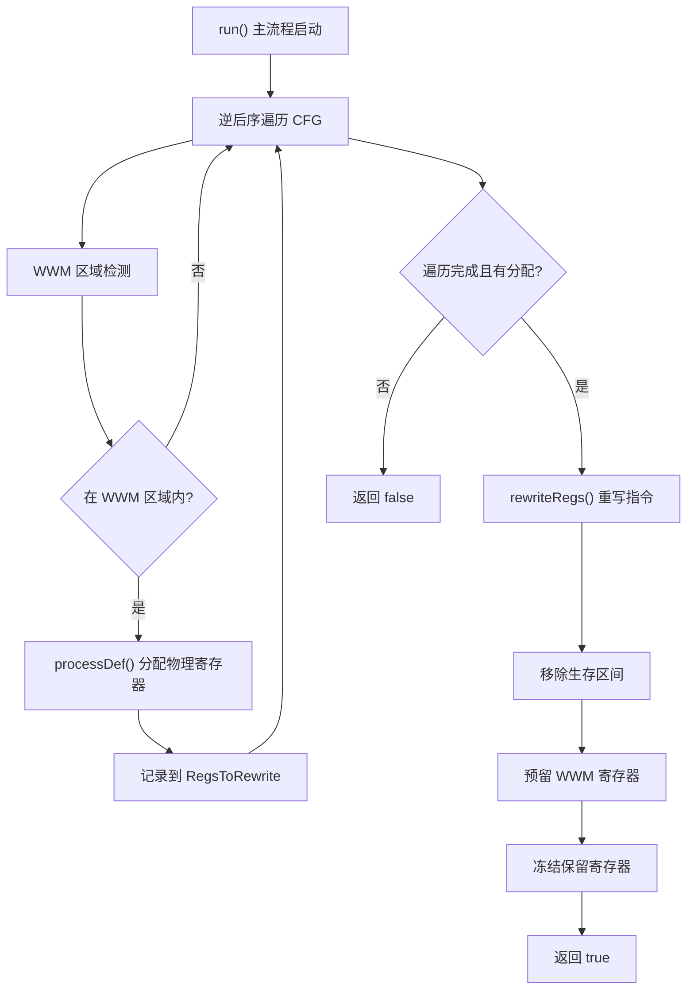

# SIPreAllocateWWMRegs.cpp 代码功能分析

## 1. Pass 主要功能概述

<a name="ref-block_0"></a>`SIPreAllocateWWMRegs` 是一个**WWM（Whole Wave Mode）寄存器预分配 Pass**。 llvm-project:10-10[<sup>↗</sup>](#block_0) 

**主要作用**：
- 在正式的寄存器分配阶段之前，为 WWM 严格模式区域中定义的虚拟寄存器提前分配物理寄存器
<a name="ref-block_1"></a>- 为 SGPR 溢出到 VGPR 的操作预分配寄存器（可选功能） llvm-project:31-33[<sup>↗</sup>](#block_1) 

**产生效果**：
- 确保 WWM 区域内的寄存器不会与后续寄存器分配产生冲突
- 通过预留物理寄存器并冻结为保留寄存器，保证 WWM 模式下的正确执行
- 移除已分配虚拟寄存器的生存区间，避免干扰后续分配过程

## 2. 主要功能实现步骤提取

通过遍历代码文件，提取到以下核心步骤/子功能：

1. **`run()` 函数** - 主执行流程控制
2. **`processDef()` 函数** - 单个定义的寄存器分配处理
3. **`rewriteRegs()` 函数** - 寄存器重写与最终化处理
4. **WWM 区域检测机制** - 识别和跟踪 WWM 区域边界
5. **逆后序遍历（RPOT）** - 控制流图遍历策略

## 3. 各步骤的具体描述分析

### 步骤1：`run()` - 主执行流程

**功能描述**：
<a name="ref-block_7"></a>这是整个 Pass 的主入口函数，负责协调所有子功能的执行。 llvm-project:198-260[<sup>↗</sup>](#block_7) 

**具体实现**：
- **初始化阶段**：获取目标子类型信息（GCNSubtarget），设置指令信息（TII）、寄存器信息（TRI）和机器寄存器信息（MRI）
- **配置检查**：检查是否启用 SGPR 溢出 VGPR 预分配功能，可通过命令行选项或函数属性控制 llvm-project:209-211 
- **遍历策略**：使用逆后序遍历（Reverse Post-Order Traversal）遍历控制流图，确保按支配关系顺序访问定义 llvm-project:215-220 
- **指令处理**：
  - 检测 `SI_SPILL_S32_TO_VGPR` 指令并为其预分配寄存器 llvm-project:225-228 
  - 通过 `ENTER_STRICT_WWM`/`ENTER_STRICT_WQM` 标记进入 WWM 区域 llvm-project:231-235 
  - 通过 `EXIT_STRICT_WWM`/`EXIT_STRICT_WQM` 标记退出 WWM 区域 llvm-project:238-242 
  - 对 WWM 区域内所有定义操作数调用 `processDef()` llvm-project:249-251 
- **最终化**：如果有寄存器被分配，调用 `rewriteRegs()` 应用分配结果 llvm-project:255-259 

### 步骤2：`processDef()` - 寄存器分配处理

**功能描述**：
<a name="ref-block_4"></a>为单个虚拟寄存器定义找到合适的物理寄存器并进行分配。 llvm-project:96-120[<sup>↗</sup>](#block_4) 

**具体实现**：
- **过滤条件**：
  - 跳过已经是物理寄存器的操作数 llvm-project:97-99 
  - 只处理 VGPR 类型的寄存器 llvm-project:101-102 
  - 跳过已经分配过物理寄存器的虚拟寄存器 llvm-project:104-105 
- **分配策略**：
  - 获取虚拟寄存器的生存区间（LiveInterval） llvm-project:107-107 
  - 按照寄存器类的分配顺序遍历物理寄存器 llvm-project:109-109 
  - 选择未被使用且无生存区间冲突的物理寄存器 llvm-project:110-111 
  - 通过 LiveRegMatrix 进行分配并记录待重写的寄存器 llvm-project:112-114 
- **错误处理**：如果找不到可用的物理寄存器，触发 unreachable 错误 llvm-project:119-119 

### 步骤3：`rewriteRegs()` - 寄存器重写

**功能描述**：
<a name="ref-block_5"></a>将所有已分配的虚拟寄存器替换为对应的物理寄存器，并完成最终的清理工作。 llvm-project:122-164[<sup>↗</sup>](#block_5) 

**具体实现**：
- **指令重写阶段**：
  - 遍历所有机器基本块和指令 llvm-project:123-124 
  - 对每个寄存器操作数，检查是否已分配物理寄存器 llvm-project:125-136 
  - 处理子寄存器（SubReg）：如果存在子寄存器，将物理寄存器映射到对应的子寄存器并清除子寄存器字段 llvm-project:137-141 
  - 替换为物理寄存器并标记为不可重命名 llvm-project:143-144 

- **清理阶段**：
  - 从 LiveIntervals 中移除已分配虚拟寄存器的生存区间 llvm-project:151-152 
  - 在 SIMachineFunctionInfo 中预留对应的 WWM 寄存器 llvm-project:154-157 
  - 清空待重写寄存器列表 llvm-project:160-160 
  - 冻结保留寄存器集合，确保预分配的寄存器不会被后续分配器使用 llvm-project:162-163 

### 步骤4：WWM 区域检测机制

**功能描述**：
通过特殊指令标记 WWM/WQM 严格模式区域的边界。

**实现方式**：
- 使用 `ENTER_STRICT_WWM` 和 `ENTER_STRICT_WQM` 指令标记进入严格模式 llvm-project:231-235 
- 使用 `EXIT_STRICT_WWM` 和 `EXIT_STRICT_WQM` 指令标记退出严格模式 llvm-project:238-242 
- 通过布尔标志 `InWWM` 追踪当前是否在 WWM 区域内 llvm-project:223-223 
- 只对 WWM 区域内的指令进行寄存器预分配 llvm-project:244-245 

### 步骤5：逆后序遍历策略

**功能描述**：
采用逆后序遍历控制流图，保证按照支配关系顺序访问定义。

**设计理由**：
根据代码注释，由于 WWM 表达式保证不涉及 phi 节点，且只能通过特殊的 WWM 指令退出 WWM 模式，因此逆后序遍历提供了完美的消除顺序（perfect elimination order），无法做得更好。 llvm-project:215-220 

## 4. 步骤间的关系描述

整个 Pass 的执行流程呈现**线性管道结构**，各步骤之间存在明确的依赖关系：



**具体关系**：

1. **`run()` 是控制中心**：协调所有其他步骤的执行，维护全局状态（如 `InWWM` 标志、`RegsAssigned` 标志）

2. **逆后序遍历是基础**：为 `processDef()` 提供正确的访问顺序，确保定义在使用之前被处理

3. **WWM 区域检测是过滤器**：决定哪些指令需要调用 `processDef()` 进行处理，起到门控作用

4. **`processDef()` 是核心操作**：
   - 被 `run()` 调用多次（每个 WWM 区域内的定义一次）
   - 将分配结果记录到 `RegsToRewrite` 列表供后续使用
   - 通过返回值通知 `run()` 是否成功分配

5. **`rewriteRegs()` 是最终化步骤**：
   - 仅在至少有一个寄存器被分配时才执行（由 `RegsAssigned` 标志控制） llvm-project:255-256 
   - 依赖于 `processDef()` 建立的 VirtRegMap 映射关系
   - 完成物理替换、清理生存区间、预留寄存器三个子任务

6. **数据流向**：虚拟寄存器 → `processDef()` 分配 → VirtRegMap 记录 → `rewriteRegs()` 应用 → 物理寄存器

## Notes

- 该 Pass 支持两种模式：**WWM（Whole Wave Mode）**和 **WQM（Whole Quad Mode）**，都通过相同的机制处理 llvm-project:231-242 
<a name="ref-block_2"></a>- Pass 使用了多个 LLVM 分析结果：LiveIntervals（生存区间分析）、LiveRegMatrix（寄存器冲突矩阵）、VirtRegMap（虚拟到物理寄存器映射） llvm-project:42-45[<sup>↗</sup>](#block_2) 
<a name="ref-block_3"></a>- 该 Pass 标记为保留所有分析结果（`setPreservesAll()`），这意味着它不会使现有分析失效 llvm-project:73-73[<sup>↗</sup>](#block_3) 
<a name="ref-block_6"></a>- 代码中有调试支持函数 `printWWMInfo()`，用于在调试模式下输出 WWM 区域信息 llvm-project:167-188[<sup>↗</sup>](#block_6)
### Citations
<a name="block_0"></a>**File:** llvm/lib/Target/AMDGPU/SIPreAllocateWWMRegs.cpp (L10-10) [<sup>↩</sup>](#ref-block_0)
```cpp
/// Pass to pre-allocated WWM registers
```
<a name="block_1"></a>**File:** llvm/lib/Target/AMDGPU/SIPreAllocateWWMRegs.cpp (L31-33) [<sup>↩</sup>](#ref-block_1)
```cpp
static cl::opt<bool>
    EnablePreallocateSGPRSpillVGPRs("amdgpu-prealloc-sgpr-spill-vgprs",
                                    cl::init(false), cl::Hidden);
```
<a name="block_2"></a>**File:** llvm/lib/Target/AMDGPU/SIPreAllocateWWMRegs.cpp (L42-45) [<sup>↩</sup>](#ref-block_2)
```cpp
  LiveIntervals *LIS;
  LiveRegMatrix *Matrix;
  VirtRegMap *VRM;
  RegisterClassInfo RegClassInfo;
```
<a name="block_3"></a>**File:** llvm/lib/Target/AMDGPU/SIPreAllocateWWMRegs.cpp (L73-73) [<sup>↩</sup>](#ref-block_3)
```cpp
    AU.setPreservesAll();
```
<a name="block_4"></a>**File:** llvm/lib/Target/AMDGPU/SIPreAllocateWWMRegs.cpp (L96-120) [<sup>↩</sup>](#ref-block_4)
```cpp
bool SIPreAllocateWWMRegs::processDef(MachineOperand &MO) {
  Register Reg = MO.getReg();
  if (Reg.isPhysical())
    return false;

  if (!TRI->isVGPR(*MRI, Reg))
    return false;

  if (VRM->hasPhys(Reg))
    return false;

  LiveInterval &LI = LIS->getInterval(Reg);

  for (MCRegister PhysReg : RegClassInfo.getOrder(MRI->getRegClass(Reg))) {
    if (!MRI->isPhysRegUsed(PhysReg, /*SkipRegMaskTest=*/true) &&
        Matrix->checkInterference(LI, PhysReg) == LiveRegMatrix::IK_Free) {
      Matrix->assign(LI, PhysReg);
      assert(PhysReg != 0);
      RegsToRewrite.push_back(Reg);
      return true;
    }
  }

  llvm_unreachable("physreg not found for WWM expression");
}
```
<a name="block_5"></a>**File:** llvm/lib/Target/AMDGPU/SIPreAllocateWWMRegs.cpp (L122-164) [<sup>↩</sup>](#ref-block_5)
```cpp
void SIPreAllocateWWMRegs::rewriteRegs(MachineFunction &MF) {
  for (MachineBasicBlock &MBB : MF) {
    for (MachineInstr &MI : MBB) {
      for (MachineOperand &MO : MI.operands()) {
        if (!MO.isReg())
          continue;

        const Register VirtReg = MO.getReg();
        if (VirtReg.isPhysical())
          continue;

        if (!VRM->hasPhys(VirtReg))
          continue;

        Register PhysReg = VRM->getPhys(VirtReg);
        const unsigned SubReg = MO.getSubReg();
        if (SubReg != 0) {
          PhysReg = TRI->getSubReg(PhysReg, SubReg);
          MO.setSubReg(0);
        }

        MO.setReg(PhysReg);
        MO.setIsRenamable(false);
      }
    }
  }

  SIMachineFunctionInfo *MFI = MF.getInfo<SIMachineFunctionInfo>();

  for (unsigned Reg : RegsToRewrite) {
    LIS->removeInterval(Reg);

    const Register PhysReg = VRM->getPhys(Reg);
    assert(PhysReg != 0);

    MFI->reserveWWMRegister(PhysReg);
  }

  RegsToRewrite.clear();

  // Update the set of reserved registers to include WWM ones.
  MRI->freezeReservedRegs();
}
```
<a name="block_6"></a>**File:** llvm/lib/Target/AMDGPU/SIPreAllocateWWMRegs.cpp (L167-188) [<sup>↩</sup>](#ref-block_6)
```cpp
LLVM_DUMP_METHOD void
SIPreAllocateWWMRegs::printWWMInfo(const MachineInstr &MI) {

  unsigned Opc = MI.getOpcode();

  if (Opc == AMDGPU::ENTER_STRICT_WWM || Opc == AMDGPU::ENTER_STRICT_WQM) {
    dbgs() << "Entering ";
  } else {
    assert(Opc == AMDGPU::EXIT_STRICT_WWM || Opc == AMDGPU::EXIT_STRICT_WQM);
    dbgs() << "Exiting ";
  }

  if (Opc == AMDGPU::ENTER_STRICT_WWM || Opc == AMDGPU::EXIT_STRICT_WWM) {
    dbgs() << "Strict WWM ";
  } else {
    assert(Opc == AMDGPU::ENTER_STRICT_WQM || Opc == AMDGPU::EXIT_STRICT_WQM);
    dbgs() << "Strict WQM ";
  }

  dbgs() << "region: " << MI;
}

```
<a name="block_7"></a>**File:** llvm/lib/Target/AMDGPU/SIPreAllocateWWMRegs.cpp (L198-260) [<sup>↩</sup>](#ref-block_7)
```cpp
bool SIPreAllocateWWMRegs::run(MachineFunction &MF) {
  LLVM_DEBUG(dbgs() << "SIPreAllocateWWMRegs: function " << MF.getName() << "\n");

  const GCNSubtarget &ST = MF.getSubtarget<GCNSubtarget>();

  TII = ST.getInstrInfo();
  TRI = &TII->getRegisterInfo();
  MRI = &MF.getRegInfo();

  RegClassInfo.runOnMachineFunction(MF);

  bool PreallocateSGPRSpillVGPRs =
      EnablePreallocateSGPRSpillVGPRs ||
      MF.getFunction().hasFnAttribute("amdgpu-prealloc-sgpr-spill-vgprs");

  bool RegsAssigned = false;

  // We use a reverse post-order traversal of the control-flow graph to
  // guarantee that we visit definitions in dominance order. Since WWM
  // expressions are guaranteed to never involve phi nodes, and we can only
  // escape WWM through the special WWM instruction, this means that this is a
  // perfect elimination order, so we can never do any better.
  ReversePostOrderTraversal<MachineFunction*> RPOT(&MF);

  for (MachineBasicBlock *MBB : RPOT) {
    bool InWWM = false;
    for (MachineInstr &MI : *MBB) {
      if (MI.getOpcode() == AMDGPU::SI_SPILL_S32_TO_VGPR) {
        if (PreallocateSGPRSpillVGPRs)
          RegsAssigned |= processDef(MI.getOperand(0));
        continue;
      }

      if (MI.getOpcode() == AMDGPU::ENTER_STRICT_WWM ||
          MI.getOpcode() == AMDGPU::ENTER_STRICT_WQM) {
        LLVM_DEBUG(printWWMInfo(MI));
        InWWM = true;
        continue;
      }

      if (MI.getOpcode() == AMDGPU::EXIT_STRICT_WWM ||
          MI.getOpcode() == AMDGPU::EXIT_STRICT_WQM) {
        LLVM_DEBUG(printWWMInfo(MI));
        InWWM = false;
      }

      if (!InWWM)
        continue;

      LLVM_DEBUG(dbgs() << "Processing " << MI);

      for (MachineOperand &DefOpnd : MI.defs()) {
        RegsAssigned |= processDef(DefOpnd);
      }
    }
  }

  if (!RegsAssigned)
    return false;

  rewriteRegs(MF);
  return true;
}
```