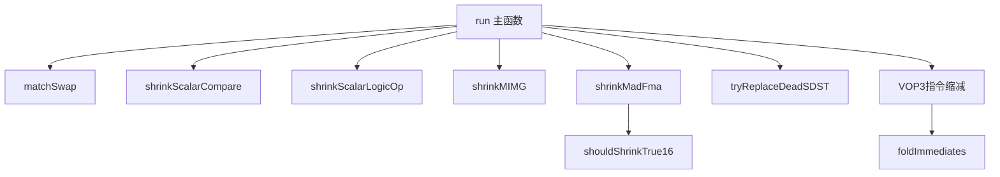

# SIShrinkInstructions.cpp 代码功能详解

## 1. Pass的主要功能概述

<a name="ref-block_0"></a>**SIShrinkInstructions** 是一个针对AMDGPU目标的机器函数优化pass，其核心目标是**尽可能将64位编码的指令转换为32位编码的指令，以减少代码大小和提高性能**。 llvm-project:7-7[<sup>↗</sup>](#block_0) 

该pass的主要效果包括：
- 减少指令编码大小（从64位减少到32位）
- 将字面常量折叠到指令中
- 优化特定的指令模式（如swap操作）
<a name="ref-block_1"></a>- 为寄存器分配器提供提示以便后续优化 llvm-project:21-24[<sup>↗</sup>](#block_1) 

## 2. 主要功能步骤/子功能提取

该pass包含以下主要子功能：

1. **foldImmediates** - 立即数折叠优化
2. **shouldShrinkTrue16** - True16指令缩减判断
3. **shrinkScalarCompare** - 标量比较指令缩减
4. **shrinkMIMG** - MIMG指令缩减
5. **shrinkMadFma** - MAD/FMA指令缩减
6. **shrinkScalarLogicOp** - 标量逻辑运算缩减
7. **tryReplaceDeadSDST** - 死SDST寄存器替换
8. **matchSwap** - swap模式匹配与优化
<a name="ref-block_2"></a>9. **run** - 主执行函数 llvm-project:38-62[<sup>↗</sup>](#block_2) 

## 3. 各子功能的具体描述分析

### 3.1 foldImmediates - 立即数折叠

**功能**：检查指令的操作数是否由立即数move指令定义，如果是，则将字面常量直接折叠到指令中。该函数假设处理的是VOP1、VOP2或VOPC指令。

**实现逻辑**：
- 首先尝试折叠src0操作数
- 如果src0是寄存器且由move immediate指令定义，检查该立即数是否可以作为合法操作数
- 如果可以，将操作数从寄存器改为立即数
- 如果src0折叠失败，尝试交换指令操作数后再次尝试
<a name="ref-block_3"></a>- 折叠成功后删除原始move指令（如果没有其他使用） llvm-project:93-148[<sup>↗</sup>](#block_3) 

### 3.2 shouldShrinkTrue16 - True16指令缩减判断

**功能**：判断True16指令是否应该被缩减。检查指令的寄存器是否在缩减编码中可表达。

**实现逻辑**：
- 遍历所有显式操作数
- 如果寄存器属于VGPR_32或VGPR_16类但不在Lo128子类中，则不应缩减
<a name="ref-block_4"></a>- 这确保缩减后的指令仍然可以正确访问寄存器 llvm-project:150-169[<sup>↗</sup>](#block_4) 

### 3.3 shrinkScalarCompare - 标量比较指令缩减

**功能**：将标量比较指令转换为更紧凑的SOPK格式（cmpk指令）。

**实现逻辑**：
- 首先交换操作数，确保常量在右侧
- 验证src0是寄存器，src1是立即数
- 获取对应的SOPK操作码
- 对于相等/不等比较，根据立即数是否为16位有符号/无符号选择合适的指令变体
<a name="ref-block_5"></a>- 对于其他比较，根据操作是否为零扩展选择相应的指令 llvm-project:244-291[<sup>↗</sup>](#block_5) 

### 3.4 shrinkMIMG - MIMG指令缩减

**功能**：将使用NSA（Non-Sequential Address）编码且地址寄存器连续的MIMG指令缩减为非NSA编码。

**实现逻辑**：
- 检查指令是否使用NSA编码（GFX10或GFX11）
- 验证所有地址寄存器（vaddr）是否连续
- 如果连续，选择合适的寄存器类（VReg_64到VReg_512）
- 创建新的非NSA编码指令，使用单个寄存器替代多个地址寄存器
<a name="ref-block_6"></a>- 处理TFE/LWE相关的隐式绑定操作数 llvm-project:293-411[<sup>↗</sup>](#block_6) 

### 3.5 shrinkMadFma - MAD/FMA指令缩减

**功能**：将MAD/FMA的VOP3编码转换为MADAK/MADMK或FMAAK/FMAMK格式，允许在指令中嵌入字面常量。

**实现逻辑**：
- 仅在GFX10+（支持VOP3 literal）且后寄存器分配阶段执行
- 检测两种模式：
  - "Dst = VSrc * VGPR + Imm" → 转换为AK形式（立即数在src2）
  - "Dst = VSrc * Imm + VGPR" → 转换为MK形式（立即数在src1）
- 根据检测到的模式选择相应的新操作码
<a name="ref-block_7"></a>- 如果需要交换操作数，重建指令；否则直接修改操作码 llvm-project:413-522[<sup>↗</sup>](#block_7) 

### 3.6 shrinkScalarLogicOp - 标量逻辑运算缩减

**功能**：缩减需要非内联字面常量的标量AND/OR/XOR操作。

**实现逻辑**：
- 对于S_AND_B32：
  - 如果~Imm是2的幂，使用S_BITSET0_B32（清除位）
  - 如果~Imm是内联常量，使用S_ANDN2_B32
- 对于S_OR_B32：
  - 如果Imm是2的幂，使用S_BITSET1_B32（设置位）
  - 如果~Imm是内联常量，使用S_ORN2_B32
- 对于S_XOR_B32：
  - 如果~Imm是内联常量，使用S_XNOR_B32
<a name="ref-block_8"></a>- 在寄存器分配前，设置寄存器分配提示 llvm-project:524-595[<sup>↗</sup>](#block_8) 

### 3.7 tryReplaceDeadSDST - 死SDST寄存器替换

**功能**：在GFX10.3+架构上，如果指令的sdst操作数是死的（未被使用），将其替换为NULL寄存器。

**实现逻辑**：
- 检查是否为GFX10.3+架构
- 查找sdst操作数
- 如果该寄存器是虚拟寄存器且没有任何使用
<a name="ref-block_10"></a>- 将其替换为SGPR_NULL（wave32）或SGPR_NULL64（wave64） llvm-project:818-832[<sup>↗</sup>](#block_10) 

### 3.8 matchSwap - swap模式匹配与优化

**功能**：识别并优化swap模式，将三条move指令转换为v_swap指令。

**匹配模式**：
```
mov t, x
mov x, y  
mov y, t
```
转换为：
```
mov t, x (可能被消除)
v_swap_b32 x, y
```

**实现逻辑**：
- 从第一条mov t, x开始
- 在有限范围内（16条指令）搜索mov x, y和mov y, t
- 验证中间指令不会破坏数据依赖
- 根据操作数大小生成V_SWAP_B16或V_SWAP_B32指令
- 对于多寄存器操作，生成多条swap指令
<a name="ref-block_9"></a>- 清理原始move指令 llvm-project:659-816[<sup>↗</sup>](#block_9) 

### 3.9 run - 主执行函数

**功能**：遍历机器函数中的所有指令，应用各种缩减优化。

**执行流程**：
1. 初始化寄存器信息、目标信息等
2. 遍历所有基本块和指令
3. 对特定指令模式应用优化：
   - V_MOV_B32的字面常量优化
   - swap模式匹配
   - S_ADD_I32/S_MUL_I32转换为ADDK/MULK
   - 标量比较指令缩减
   - S_MOV_B32转换为MOVK
   - 标量逻辑运算缩减
   - MIMG指令缩减
   - MAD/FMA指令缩减
4. 对VOP3指令：
   - 尝试替换死SDST
   - 检查是否可以缩减为32位编码
   - 处理VOPC和V_CNDMASK的特殊情况
   - 为寄存器分配器设置VCC提示
   - 执行实际的缩减操作
<a name="ref-block_11"></a>   - 折叠立即数 llvm-project:834-1088[<sup>↗</sup>](#block_11) 

## 4. 步骤/子功能之间的关系

### 4.1 层次关系



### 4.2 执行顺序

1. **run函数**是入口点，按顺序处理每条指令 llvm-project:834-842 

2. **早期优化**（指令特定优化）：
   - V_MOV_B32的立即数转换
   - swap模式匹配
   - S_ADD/S_MUL转换为K形式
   - 标量比较和逻辑运算缩减
   - MIMG指令缩减
   - MAD/FMA指令缩减

3. **VOP3指令缩减**（通用缩减）：
   - 首先尝试替换死SDST
   - 检查指令是否可缩减
   - 如果不能缩减，尝试交换操作数
   - 为VOPC指令设置VCC寄存器提示
   - 执行实际缩减操作
   - 最后调用foldImmediates进行立即数折叠 llvm-project:956-1085 

### 4.3 功能依赖关系

- **foldImmediates**在指令缩减后被调用，用于进一步优化新生成的32位指令 llvm-project:1082-1082 

- **shouldShrinkTrue16**被shrinkMadFma调用，作为缩减前的验证条件 llvm-project:506-507 

- **tryReplaceDeadSDST**在VOP3指令无法缩减时作为备选优化 llvm-project:972-972 

### 4.4 RA前后的行为差异

该pass在寄存器分配（RA）前后有不同的行为：

- **RA前**：主要设置寄存器分配提示，为后续分配器提供优化建议 llvm-project:1006-1006 

- **RA后**：执行实际的指令缩减和优化，因为此时寄存器已经确定 llvm-project:860-860 

## Notes

此pass是AMDGPU后端优化流水线中的关键组件，通常在寄存器分配前后各运行一次，以最大化优化效果。第一次运行设置寄存器提示，第二次运行执行实际的缩减操作。这种两阶段策略确保了既能影响寄存器分配决策，又能在寄存器确定后进行最终优化。
### Citations
<a name="block_0"></a>**File:** llvm/lib/Target/AMDGPU/SIShrinkInstructions.cpp (L7-7) [<sup>↩</sup>](#ref-block_0)
```cpp
/// The pass tries to use the 32-bit encoding for instructions when possible.
```
<a name="block_1"></a>**File:** llvm/lib/Target/AMDGPU/SIShrinkInstructions.cpp (L21-24) [<sup>↩</sup>](#ref-block_1)
```cpp
STATISTIC(NumInstructionsShrunk,
          "Number of 64-bit instruction reduced to 32-bit.");
STATISTIC(NumLiteralConstantsFolded,
          "Number of literal constants folded into 32-bit instructions.");
```
<a name="block_2"></a>**File:** llvm/lib/Target/AMDGPU/SIShrinkInstructions.cpp (L38-62) [<sup>↩</sup>](#ref-block_2)
```cpp
  bool foldImmediates(MachineInstr &MI, bool TryToCommute = true) const;
  bool shouldShrinkTrue16(MachineInstr &MI) const;
  bool isKImmOperand(const MachineOperand &Src) const;
  bool isKUImmOperand(const MachineOperand &Src) const;
  bool isKImmOrKUImmOperand(const MachineOperand &Src, bool &IsUnsigned) const;
  void copyExtraImplicitOps(MachineInstr &NewMI, MachineInstr &MI) const;
  void shrinkScalarCompare(MachineInstr &MI) const;
  void shrinkMIMG(MachineInstr &MI) const;
  void shrinkMadFma(MachineInstr &MI) const;
  bool shrinkScalarLogicOp(MachineInstr &MI) const;
  bool tryReplaceDeadSDST(MachineInstr &MI) const;
  bool instAccessReg(iterator_range<MachineInstr::const_mop_iterator> &&R,
                     Register Reg, unsigned SubReg) const;
  bool instReadsReg(const MachineInstr *MI, unsigned Reg,
                    unsigned SubReg) const;
  bool instModifiesReg(const MachineInstr *MI, unsigned Reg,
                       unsigned SubReg) const;
  TargetInstrInfo::RegSubRegPair getSubRegForIndex(Register Reg, unsigned Sub,
                                                   unsigned I) const;
  void dropInstructionKeepingImpDefs(MachineInstr &MI) const;
  MachineInstr *matchSwap(MachineInstr &MovT) const;

public:
  SIShrinkInstructions() = default;
  bool run(MachineFunction &MF);
```
<a name="block_3"></a>**File:** llvm/lib/Target/AMDGPU/SIShrinkInstructions.cpp (L93-148) [<sup>↩</sup>](#ref-block_3)
```cpp
/// This function checks \p MI for operands defined by a move immediate
/// instruction and then folds the literal constant into the instruction if it
/// can. This function assumes that \p MI is a VOP1, VOP2, or VOPC instructions.
bool SIShrinkInstructions::foldImmediates(MachineInstr &MI,
                                          bool TryToCommute) const {
  assert(TII->isVOP1(MI) || TII->isVOP2(MI) || TII->isVOPC(MI));

  int Src0Idx = AMDGPU::getNamedOperandIdx(MI.getOpcode(), AMDGPU::OpName::src0);

  // Try to fold Src0
  MachineOperand &Src0 = MI.getOperand(Src0Idx);
  if (Src0.isReg()) {
    Register Reg = Src0.getReg();
    if (Reg.isVirtual()) {
      MachineInstr *Def = MRI->getUniqueVRegDef(Reg);
      if (Def && Def->isMoveImmediate()) {
        MachineOperand &MovSrc = Def->getOperand(1);
        bool ConstantFolded = false;

        if (TII->isOperandLegal(MI, Src0Idx, &MovSrc)) {
          if (MovSrc.isImm()) {
            Src0.ChangeToImmediate(MovSrc.getImm());
            ConstantFolded = true;
          } else if (MovSrc.isFI()) {
            Src0.ChangeToFrameIndex(MovSrc.getIndex());
            ConstantFolded = true;
          } else if (MovSrc.isGlobal()) {
            Src0.ChangeToGA(MovSrc.getGlobal(), MovSrc.getOffset(),
                            MovSrc.getTargetFlags());
            ConstantFolded = true;
          }
        }

        if (ConstantFolded) {
          if (MRI->use_nodbg_empty(Reg))
            Def->eraseFromParent();
          ++NumLiteralConstantsFolded;
          return true;
        }
      }
    }
  }

  // We have failed to fold src0, so commute the instruction and try again.
  if (TryToCommute && MI.isCommutable()) {
    if (TII->commuteInstruction(MI)) {
      if (foldImmediates(MI, false))
        return true;

      // Commute back.
      TII->commuteInstruction(MI);
    }
  }

  return false;
}
```
<a name="block_4"></a>**File:** llvm/lib/Target/AMDGPU/SIShrinkInstructions.cpp (L150-169) [<sup>↩</sup>](#ref-block_4)
```cpp
/// Do not shrink the instruction if its registers are not expressible in the
/// shrunk encoding.
bool SIShrinkInstructions::shouldShrinkTrue16(MachineInstr &MI) const {
  for (unsigned I = 0, E = MI.getNumExplicitOperands(); I != E; ++I) {
    const MachineOperand &MO = MI.getOperand(I);
    if (MO.isReg()) {
      Register Reg = MO.getReg();
      assert(!Reg.isVirtual() && "Prior checks should ensure we only shrink "
                                 "True16 Instructions post-RA");
      if (AMDGPU::VGPR_32RegClass.contains(Reg) &&
          !AMDGPU::VGPR_32_Lo128RegClass.contains(Reg))
        return false;

      if (AMDGPU::VGPR_16RegClass.contains(Reg) &&
          !AMDGPU::VGPR_16_Lo128RegClass.contains(Reg))
        return false;
    }
  }
  return true;
}
```
<a name="block_5"></a>**File:** llvm/lib/Target/AMDGPU/SIShrinkInstructions.cpp (L244-291) [<sup>↩</sup>](#ref-block_5)
```cpp
void SIShrinkInstructions::shrinkScalarCompare(MachineInstr &MI) const {
  if (!ST->hasSCmpK())
    return;

  // cmpk instructions do scc = dst <cc op> imm16, so commute the instruction to
  // get constants on the RHS.
  if (!MI.getOperand(0).isReg())
    TII->commuteInstruction(MI, false, 0, 1);

  // cmpk requires src0 to be a register
  const MachineOperand &Src0 = MI.getOperand(0);
  if (!Src0.isReg())
    return;

  MachineOperand &Src1 = MI.getOperand(1);
  if (!Src1.isImm())
    return;

  int SOPKOpc = AMDGPU::getSOPKOp(MI.getOpcode());
  if (SOPKOpc == -1)
    return;

  // eq/ne is special because the imm16 can be treated as signed or unsigned,
  // and initially selected to the unsigned versions.
  if (SOPKOpc == AMDGPU::S_CMPK_EQ_U32 || SOPKOpc == AMDGPU::S_CMPK_LG_U32) {
    bool HasUImm;
    if (isKImmOrKUImmOperand(Src1, HasUImm)) {
      if (!HasUImm) {
        SOPKOpc = (SOPKOpc == AMDGPU::S_CMPK_EQ_U32) ?
          AMDGPU::S_CMPK_EQ_I32 : AMDGPU::S_CMPK_LG_I32;
        Src1.setImm(SignExtend32(Src1.getImm(), 32));
      }

      MI.setDesc(TII->get(SOPKOpc));
    }

    return;
  }

  const MCInstrDesc &NewDesc = TII->get(SOPKOpc);

  if ((SIInstrInfo::sopkIsZext(SOPKOpc) && isKUImmOperand(Src1)) ||
      (!SIInstrInfo::sopkIsZext(SOPKOpc) && isKImmOperand(Src1))) {
    if (!SIInstrInfo::sopkIsZext(SOPKOpc))
      Src1.setImm(SignExtend64(Src1.getImm(), 32));
    MI.setDesc(NewDesc);
  }
}
```
<a name="block_6"></a>**File:** llvm/lib/Target/AMDGPU/SIShrinkInstructions.cpp (L293-411) [<sup>↩</sup>](#ref-block_6)
```cpp
// Shrink NSA encoded instructions with contiguous VGPRs to non-NSA encoding.
void SIShrinkInstructions::shrinkMIMG(MachineInstr &MI) const {
  const AMDGPU::MIMGInfo *Info = AMDGPU::getMIMGInfo(MI.getOpcode());
  if (!Info)
    return;

  uint8_t NewEncoding;
  switch (Info->MIMGEncoding) {
  case AMDGPU::MIMGEncGfx10NSA:
    NewEncoding = AMDGPU::MIMGEncGfx10Default;
    break;
  case AMDGPU::MIMGEncGfx11NSA:
    NewEncoding = AMDGPU::MIMGEncGfx11Default;
    break;
  default:
    return;
  }

  int VAddr0Idx =
      AMDGPU::getNamedOperandIdx(MI.getOpcode(), AMDGPU::OpName::vaddr0);
  unsigned NewAddrDwords = Info->VAddrDwords;
  const TargetRegisterClass *RC;

  if (Info->VAddrDwords == 2) {
    RC = &AMDGPU::VReg_64RegClass;
  } else if (Info->VAddrDwords == 3) {
    RC = &AMDGPU::VReg_96RegClass;
  } else if (Info->VAddrDwords == 4) {
    RC = &AMDGPU::VReg_128RegClass;
  } else if (Info->VAddrDwords == 5) {
    RC = &AMDGPU::VReg_160RegClass;
  } else if (Info->VAddrDwords == 6) {
    RC = &AMDGPU::VReg_192RegClass;
  } else if (Info->VAddrDwords == 7) {
    RC = &AMDGPU::VReg_224RegClass;
  } else if (Info->VAddrDwords == 8) {
    RC = &AMDGPU::VReg_256RegClass;
  } else if (Info->VAddrDwords == 9) {
    RC = &AMDGPU::VReg_288RegClass;
  } else if (Info->VAddrDwords == 10) {
    RC = &AMDGPU::VReg_320RegClass;
  } else if (Info->VAddrDwords == 11) {
    RC = &AMDGPU::VReg_352RegClass;
  } else if (Info->VAddrDwords == 12) {
    RC = &AMDGPU::VReg_384RegClass;
  } else {
    RC = &AMDGPU::VReg_512RegClass;
    NewAddrDwords = 16;
  }

  unsigned VgprBase = 0;
  unsigned NextVgpr = 0;
  bool IsUndef = true;
  bool IsKill = NewAddrDwords == Info->VAddrDwords;
  const unsigned NSAMaxSize = ST->getNSAMaxSize();
  const bool IsPartialNSA = NewAddrDwords > NSAMaxSize;
  const unsigned EndVAddr = IsPartialNSA ? NSAMaxSize : Info->VAddrOperands;
  for (unsigned Idx = 0; Idx < EndVAddr; ++Idx) {
    const MachineOperand &Op = MI.getOperand(VAddr0Idx + Idx);
    unsigned Vgpr = TRI->getHWRegIndex(Op.getReg());
    unsigned Dwords = TRI->getRegSizeInBits(Op.getReg(), *MRI) / 32;
    assert(Dwords > 0 && "Un-implemented for less than 32 bit regs");

    if (Idx == 0) {
      VgprBase = Vgpr;
      NextVgpr = Vgpr + Dwords;
    } else if (Vgpr == NextVgpr) {
      NextVgpr = Vgpr + Dwords;
    } else {
      return;
    }

    if (!Op.isUndef())
      IsUndef = false;
    if (!Op.isKill())
      IsKill = false;
  }

  if (VgprBase + NewAddrDwords > 256)
    return;

  // Further check for implicit tied operands - this may be present if TFE is
  // enabled
  int TFEIdx = AMDGPU::getNamedOperandIdx(MI.getOpcode(), AMDGPU::OpName::tfe);
  int LWEIdx = AMDGPU::getNamedOperandIdx(MI.getOpcode(), AMDGPU::OpName::lwe);
  unsigned TFEVal = (TFEIdx == -1) ? 0 : MI.getOperand(TFEIdx).getImm();
  unsigned LWEVal = (LWEIdx == -1) ? 0 : MI.getOperand(LWEIdx).getImm();
  int ToUntie = -1;
  if (TFEVal || LWEVal) {
    // TFE/LWE is enabled so we need to deal with an implicit tied operand
    for (unsigned i = LWEIdx + 1, e = MI.getNumOperands(); i != e; ++i) {
      if (MI.getOperand(i).isReg() && MI.getOperand(i).isTied() &&
          MI.getOperand(i).isImplicit()) {
        // This is the tied operand
        assert(
            ToUntie == -1 &&
            "found more than one tied implicit operand when expecting only 1");
        ToUntie = i;
        MI.untieRegOperand(ToUntie);
      }
    }
  }

  unsigned NewOpcode = AMDGPU::getMIMGOpcode(Info->BaseOpcode, NewEncoding,
                                             Info->VDataDwords, NewAddrDwords);
  MI.setDesc(TII->get(NewOpcode));
  MI.getOperand(VAddr0Idx).setReg(RC->getRegister(VgprBase));
  MI.getOperand(VAddr0Idx).setIsUndef(IsUndef);
  MI.getOperand(VAddr0Idx).setIsKill(IsKill);

  for (unsigned i = 1; i < EndVAddr; ++i)
    MI.removeOperand(VAddr0Idx + 1);

  if (ToUntie >= 0) {
    MI.tieOperands(
        AMDGPU::getNamedOperandIdx(MI.getOpcode(), AMDGPU::OpName::vdata),
        ToUntie - (EndVAddr - 1));
  }
}
```
<a name="block_7"></a>**File:** llvm/lib/Target/AMDGPU/SIShrinkInstructions.cpp (L413-522) [<sup>↩</sup>](#ref-block_7)
```cpp
// Shrink MAD to MADAK/MADMK and FMA to FMAAK/FMAMK.
void SIShrinkInstructions::shrinkMadFma(MachineInstr &MI) const {
  // Pre-GFX10 VOP3 instructions like MAD/FMA cannot take a literal operand so
  // there is no reason to try to shrink them.
  if (!ST->hasVOP3Literal())
    return;

  // There is no advantage to doing this pre-RA.
  if (!IsPostRA)
    return;

  if (TII->hasAnyModifiersSet(MI))
    return;

  const unsigned Opcode = MI.getOpcode();
  MachineOperand &Src0 = *TII->getNamedOperand(MI, AMDGPU::OpName::src0);
  MachineOperand &Src1 = *TII->getNamedOperand(MI, AMDGPU::OpName::src1);
  MachineOperand &Src2 = *TII->getNamedOperand(MI, AMDGPU::OpName::src2);
  unsigned NewOpcode = AMDGPU::INSTRUCTION_LIST_END;

  bool Swap;

  // Detect "Dst = VSrc * VGPR + Imm" and convert to AK form.
  if (Src2.isImm() && !TII->isInlineConstant(Src2)) {
    if (Src1.isReg() && TRI->isVGPR(*MRI, Src1.getReg()))
      Swap = false;
    else if (Src0.isReg() && TRI->isVGPR(*MRI, Src0.getReg()))
      Swap = true;
    else
      return;

    switch (Opcode) {
    default:
      llvm_unreachable("Unexpected mad/fma opcode!");
    case AMDGPU::V_MAD_F32_e64:
      NewOpcode = AMDGPU::V_MADAK_F32;
      break;
    case AMDGPU::V_FMA_F32_e64:
      NewOpcode = AMDGPU::V_FMAAK_F32;
      break;
    case AMDGPU::V_MAD_F16_e64:
      NewOpcode = AMDGPU::V_MADAK_F16;
      break;
    case AMDGPU::V_FMA_F16_e64:
    case AMDGPU::V_FMA_F16_gfx9_e64:
      NewOpcode = AMDGPU::V_FMAAK_F16;
      break;
    case AMDGPU::V_FMA_F16_gfx9_t16_e64:
      NewOpcode = AMDGPU::V_FMAAK_F16_t16;
      break;
    case AMDGPU::V_FMA_F16_gfx9_fake16_e64:
      NewOpcode = AMDGPU::V_FMAAK_F16_fake16;
      break;
    }
  }

  // Detect "Dst = VSrc * Imm + VGPR" and convert to MK form.
  if (Src2.isReg() && TRI->isVGPR(*MRI, Src2.getReg())) {
    if (Src1.isImm() && !TII->isInlineConstant(Src1))
      Swap = false;
    else if (Src0.isImm() && !TII->isInlineConstant(Src0))
      Swap = true;
    else
      return;

    switch (Opcode) {
    default:
      llvm_unreachable("Unexpected mad/fma opcode!");
    case AMDGPU::V_MAD_F32_e64:
      NewOpcode = AMDGPU::V_MADMK_F32;
      break;
    case AMDGPU::V_FMA_F32_e64:
      NewOpcode = AMDGPU::V_FMAMK_F32;
      break;
    case AMDGPU::V_MAD_F16_e64:
      NewOpcode = AMDGPU::V_MADMK_F16;
      break;
    case AMDGPU::V_FMA_F16_e64:
    case AMDGPU::V_FMA_F16_gfx9_e64:
      NewOpcode = AMDGPU::V_FMAMK_F16;
      break;
    case AMDGPU::V_FMA_F16_gfx9_t16_e64:
      NewOpcode = AMDGPU::V_FMAMK_F16_t16;
      break;
    case AMDGPU::V_FMA_F16_gfx9_fake16_e64:
      NewOpcode = AMDGPU::V_FMAMK_F16_fake16;
      break;
    }
  }

  if (NewOpcode == AMDGPU::INSTRUCTION_LIST_END)
    return;

  if (AMDGPU::isTrue16Inst(NewOpcode) && !shouldShrinkTrue16(MI))
    return;

  if (Swap) {
    // Swap Src0 and Src1 by building a new instruction.
    BuildMI(*MI.getParent(), MI, MI.getDebugLoc(), TII->get(NewOpcode),
            MI.getOperand(0).getReg())
        .add(Src1)
        .add(Src0)
        .add(Src2)
        .setMIFlags(MI.getFlags());
    MI.eraseFromParent();
  } else {
    TII->removeModOperands(MI);
    MI.setDesc(TII->get(NewOpcode));
  }
}
```
<a name="block_8"></a>**File:** llvm/lib/Target/AMDGPU/SIShrinkInstructions.cpp (L524-595) [<sup>↩</sup>](#ref-block_8)
```cpp
/// Attempt to shrink AND/OR/XOR operations requiring non-inlineable literals.
/// For AND or OR, try using S_BITSET{0,1} to clear or set bits.
/// If the inverse of the immediate is legal, use ANDN2, ORN2 or
/// XNOR (as a ^ b == ~(a ^ ~b)).
/// \returns true if the caller should continue the machine function iterator
bool SIShrinkInstructions::shrinkScalarLogicOp(MachineInstr &MI) const {
  unsigned Opc = MI.getOpcode();
  const MachineOperand *Dest = &MI.getOperand(0);
  MachineOperand *Src0 = &MI.getOperand(1);
  MachineOperand *Src1 = &MI.getOperand(2);
  MachineOperand *SrcReg = Src0;
  MachineOperand *SrcImm = Src1;

  if (!SrcImm->isImm() ||
      AMDGPU::isInlinableLiteral32(SrcImm->getImm(), ST->hasInv2PiInlineImm()))
    return false;

  uint32_t Imm = static_cast<uint32_t>(SrcImm->getImm());
  uint32_t NewImm = 0;

  if (Opc == AMDGPU::S_AND_B32) {
    if (isPowerOf2_32(~Imm)) {
      NewImm = llvm::countr_one(Imm);
      Opc = AMDGPU::S_BITSET0_B32;
    } else if (AMDGPU::isInlinableLiteral32(~Imm, ST->hasInv2PiInlineImm())) {
      NewImm = ~Imm;
      Opc = AMDGPU::S_ANDN2_B32;
    }
  } else if (Opc == AMDGPU::S_OR_B32) {
    if (isPowerOf2_32(Imm)) {
      NewImm = llvm::countr_zero(Imm);
      Opc = AMDGPU::S_BITSET1_B32;
    } else if (AMDGPU::isInlinableLiteral32(~Imm, ST->hasInv2PiInlineImm())) {
      NewImm = ~Imm;
      Opc = AMDGPU::S_ORN2_B32;
    }
  } else if (Opc == AMDGPU::S_XOR_B32) {
    if (AMDGPU::isInlinableLiteral32(~Imm, ST->hasInv2PiInlineImm())) {
      NewImm = ~Imm;
      Opc = AMDGPU::S_XNOR_B32;
    }
  } else {
    llvm_unreachable("unexpected opcode");
  }

  if (NewImm != 0) {
    if (Dest->getReg().isVirtual() && SrcReg->isReg()) {
      MRI->setRegAllocationHint(Dest->getReg(), 0, SrcReg->getReg());
      MRI->setRegAllocationHint(SrcReg->getReg(), 0, Dest->getReg());
      return true;
    }

    if (SrcReg->isReg() && SrcReg->getReg() == Dest->getReg()) {
      const bool IsUndef = SrcReg->isUndef();
      const bool IsKill = SrcReg->isKill();
      MI.setDesc(TII->get(Opc));
      if (Opc == AMDGPU::S_BITSET0_B32 ||
          Opc == AMDGPU::S_BITSET1_B32) {
        Src0->ChangeToImmediate(NewImm);
        // Remove the immediate and add the tied input.
        MI.getOperand(2).ChangeToRegister(Dest->getReg(), /*IsDef*/ false,
                                          /*isImp*/ false, IsKill,
                                          /*isDead*/ false, IsUndef);
        MI.tieOperands(0, 2);
      } else {
        SrcImm->setImm(NewImm);
      }
    }
  }

  return false;
}
```
<a name="block_9"></a>**File:** llvm/lib/Target/AMDGPU/SIShrinkInstructions.cpp (L659-816) [<sup>↩</sup>](#ref-block_9)
```cpp
// Match:
// mov t, x
// mov x, y
// mov y, t
//
// =>
//
// mov t, x (t is potentially dead and move eliminated)
// v_swap_b32 x, y
//
// Returns next valid instruction pointer if was able to create v_swap_b32.
//
// This shall not be done too early not to prevent possible folding which may
// remove matched moves, and this should preferably be done before RA to
// release saved registers and also possibly after RA which can insert copies
// too.
//
// This is really just a generic peephole that is not a canonical shrinking,
// although requirements match the pass placement and it reduces code size too.
MachineInstr *SIShrinkInstructions::matchSwap(MachineInstr &MovT) const {
  assert(MovT.getOpcode() == AMDGPU::V_MOV_B32_e32 ||
         MovT.getOpcode() == AMDGPU::V_MOV_B16_t16_e32 ||
         MovT.getOpcode() == AMDGPU::COPY);

  Register T = MovT.getOperand(0).getReg();
  unsigned Tsub = MovT.getOperand(0).getSubReg();
  MachineOperand &Xop = MovT.getOperand(1);

  if (!Xop.isReg())
    return nullptr;
  Register X = Xop.getReg();
  unsigned Xsub = Xop.getSubReg();

  unsigned Size = TII->getOpSize(MovT, 0);

  // We can't match v_swap_b16 pre-RA, because VGPR_16_Lo128 registers
  // are not allocatble.
  if (Size == 2 && X.isVirtual())
    return nullptr;

  if (!TRI->isVGPR(*MRI, X))
    return nullptr;

  const unsigned SearchLimit = 16;
  unsigned Count = 0;
  bool KilledT = false;
  for (auto Iter = std::next(MovT.getIterator()),
            E = MovT.getParent()->instr_end();
       Iter != E && Count < SearchLimit && !KilledT; ++Iter, ++Count) {

    MachineInstr *MovY = &*Iter;
    KilledT = MovY->killsRegister(T, TRI);

    if ((MovY->getOpcode() != AMDGPU::V_MOV_B32_e32 &&
         MovY->getOpcode() != AMDGPU::V_MOV_B16_t16_e32 &&
         MovY->getOpcode() != AMDGPU::COPY) ||
        !MovY->getOperand(1).isReg() || MovY->getOperand(1).getReg() != T ||
        MovY->getOperand(1).getSubReg() != Tsub)
      continue;

    Register Y = MovY->getOperand(0).getReg();
    unsigned Ysub = MovY->getOperand(0).getSubReg();

    if (!TRI->isVGPR(*MRI, Y))
      continue;

    MachineInstr *MovX = nullptr;
    for (auto IY = MovY->getIterator(), I = std::next(MovT.getIterator());
         I != IY; ++I) {
      if (instReadsReg(&*I, X, Xsub) || instModifiesReg(&*I, Y, Ysub) ||
          instModifiesReg(&*I, T, Tsub) ||
          (MovX && instModifiesReg(&*I, X, Xsub))) {
        MovX = nullptr;
        break;
      }
      if (!instReadsReg(&*I, Y, Ysub)) {
        if (!MovX && instModifiesReg(&*I, X, Xsub)) {
          MovX = nullptr;
          break;
        }
        continue;
      }
      if (MovX ||
          (I->getOpcode() != AMDGPU::V_MOV_B32_e32 &&
           I->getOpcode() != AMDGPU::V_MOV_B16_t16_e32 &&
           I->getOpcode() != AMDGPU::COPY) ||
          I->getOperand(0).getReg() != X ||
          I->getOperand(0).getSubReg() != Xsub) {
        MovX = nullptr;
        break;
      }

      if (Size > 4 && (I->getNumImplicitOperands() > (I->isCopy() ? 0U : 1U)))
        continue;

      MovX = &*I;
    }

    if (!MovX)
      continue;

    LLVM_DEBUG(dbgs() << "Matched v_swap:\n" << MovT << *MovX << *MovY);

    MachineBasicBlock &MBB = *MovT.getParent();
    SmallVector<MachineInstr *, 4> Swaps;
    if (Size == 2) {
      auto *MIB = BuildMI(MBB, MovX->getIterator(), MovT.getDebugLoc(),
                          TII->get(AMDGPU::V_SWAP_B16))
                      .addDef(X)
                      .addDef(Y)
                      .addReg(Y)
                      .addReg(X)
                      .getInstr();
      Swaps.push_back(MIB);
    } else {
      assert(Size > 0 && Size % 4 == 0);
      for (unsigned I = 0; I < Size / 4; ++I) {
        TargetInstrInfo::RegSubRegPair X1, Y1;
        X1 = getSubRegForIndex(X, Xsub, I);
        Y1 = getSubRegForIndex(Y, Ysub, I);
        auto *MIB = BuildMI(MBB, MovX->getIterator(), MovT.getDebugLoc(),
                            TII->get(AMDGPU::V_SWAP_B32))
                        .addDef(X1.Reg, 0, X1.SubReg)
                        .addDef(Y1.Reg, 0, Y1.SubReg)
                        .addReg(Y1.Reg, 0, Y1.SubReg)
                        .addReg(X1.Reg, 0, X1.SubReg)
                        .getInstr();
        Swaps.push_back(MIB);
      }
    }
    // Drop implicit EXEC.
    if (MovX->hasRegisterImplicitUseOperand(AMDGPU::EXEC)) {
      for (MachineInstr *Swap : Swaps) {
        Swap->removeOperand(Swap->getNumExplicitOperands());
        Swap->copyImplicitOps(*MBB.getParent(), *MovX);
      }
    }
    MovX->eraseFromParent();
    dropInstructionKeepingImpDefs(*MovY);
    MachineInstr *Next = &*std::next(MovT.getIterator());

    if (T.isVirtual() && MRI->use_nodbg_empty(T)) {
      dropInstructionKeepingImpDefs(MovT);
    } else {
      Xop.setIsKill(false);
      for (int I = MovT.getNumImplicitOperands() - 1; I >= 0; --I ) {
        unsigned OpNo = MovT.getNumExplicitOperands() + I;
        const MachineOperand &Op = MovT.getOperand(OpNo);
        if (Op.isKill() && TRI->regsOverlap(X, Op.getReg()))
          MovT.removeOperand(OpNo);
      }
    }

    return Next;
  }

  return nullptr;
}
```
<a name="block_10"></a>**File:** llvm/lib/Target/AMDGPU/SIShrinkInstructions.cpp (L818-832) [<sup>↩</sup>](#ref-block_10)
```cpp
// If an instruction has dead sdst replace it with NULL register on gfx1030+
bool SIShrinkInstructions::tryReplaceDeadSDST(MachineInstr &MI) const {
  if (!ST->hasGFX10_3Insts())
    return false;

  MachineOperand *Op = TII->getNamedOperand(MI, AMDGPU::OpName::sdst);
  if (!Op)
    return false;
  Register SDstReg = Op->getReg();
  if (SDstReg.isPhysical() || !MRI->use_nodbg_empty(SDstReg))
    return false;

  Op->setReg(ST->isWave32() ? AMDGPU::SGPR_NULL : AMDGPU::SGPR_NULL64);
  return true;
}
```
<a name="block_11"></a>**File:** llvm/lib/Target/AMDGPU/SIShrinkInstructions.cpp (L834-1088) [<sup>↩</sup>](#ref-block_11)
```cpp
bool SIShrinkInstructions::run(MachineFunction &MF) {

  this->MF = &MF;
  MRI = &MF.getRegInfo();
  ST = &MF.getSubtarget<GCNSubtarget>();
  TII = ST->getInstrInfo();
  TRI = &TII->getRegisterInfo();
  IsPostRA = MF.getProperties().hasNoVRegs();

  unsigned VCCReg = ST->isWave32() ? AMDGPU::VCC_LO : AMDGPU::VCC;

  for (MachineBasicBlock &MBB : MF) {
    MachineBasicBlock::iterator I, Next;
    for (I = MBB.begin(); I != MBB.end(); I = Next) {
      Next = std::next(I);
      MachineInstr &MI = *I;

      if (MI.getOpcode() == AMDGPU::V_MOV_B32_e32) {
        // If this has a literal constant source that is the same as the
        // reversed bits of an inline immediate, replace with a bitreverse of
        // that constant. This saves 4 bytes in the common case of materializing
        // sign bits.

        // Test if we are after regalloc. We only want to do this after any
        // optimizations happen because this will confuse them.
        MachineOperand &Src = MI.getOperand(1);
        if (Src.isImm() && IsPostRA) {
          int32_t ModImm;
          unsigned ModOpcode =
              canModifyToInlineImmOp32(TII, Src, ModImm, /*Scalar=*/false);
          if (ModOpcode != 0) {
            MI.setDesc(TII->get(ModOpcode));
            Src.setImm(static_cast<int64_t>(ModImm));
            continue;
          }
        }
      }

      if (ST->hasSwap() && (MI.getOpcode() == AMDGPU::V_MOV_B32_e32 ||
                            MI.getOpcode() == AMDGPU::V_MOV_B16_t16_e32 ||
                            MI.getOpcode() == AMDGPU::COPY)) {
        if (auto *NextMI = matchSwap(MI)) {
          Next = NextMI->getIterator();
          continue;
        }
      }

      // Try to use S_ADDK_I32 and S_MULK_I32.
      if (MI.getOpcode() == AMDGPU::S_ADD_I32 ||
          MI.getOpcode() == AMDGPU::S_MUL_I32) {
        const MachineOperand *Dest = &MI.getOperand(0);
        MachineOperand *Src0 = &MI.getOperand(1);
        MachineOperand *Src1 = &MI.getOperand(2);

        if (!Src0->isReg() && Src1->isReg()) {
          if (TII->commuteInstruction(MI, false, 1, 2))
            std::swap(Src0, Src1);
        }

        // FIXME: This could work better if hints worked with subregisters. If
        // we have a vector add of a constant, we usually don't get the correct
        // allocation due to the subregister usage.
        if (Dest->getReg().isVirtual() && Src0->isReg()) {
          MRI->setRegAllocationHint(Dest->getReg(), 0, Src0->getReg());
          MRI->setRegAllocationHint(Src0->getReg(), 0, Dest->getReg());
          continue;
        }

        if (Src0->isReg() && Src0->getReg() == Dest->getReg()) {
          if (Src1->isImm() && isKImmOperand(*Src1)) {
            unsigned Opc = (MI.getOpcode() == AMDGPU::S_ADD_I32) ?
              AMDGPU::S_ADDK_I32 : AMDGPU::S_MULK_I32;

            Src1->setImm(SignExtend64(Src1->getImm(), 32));
            MI.setDesc(TII->get(Opc));
            MI.tieOperands(0, 1);
          }
        }
      }

      // Try to use s_cmpk_*
      if (MI.isCompare() && TII->isSOPC(MI)) {
        shrinkScalarCompare(MI);
        continue;
      }

      // Try to use S_MOVK_I32, which will save 4 bytes for small immediates.
      if (MI.getOpcode() == AMDGPU::S_MOV_B32) {
        const MachineOperand &Dst = MI.getOperand(0);
        MachineOperand &Src = MI.getOperand(1);

        if (Src.isImm() && Dst.getReg().isPhysical()) {
          unsigned ModOpc;
          int32_t ModImm;
          if (isKImmOperand(Src)) {
            MI.setDesc(TII->get(AMDGPU::S_MOVK_I32));
            Src.setImm(SignExtend64(Src.getImm(), 32));
          } else if ((ModOpc = canModifyToInlineImmOp32(TII, Src, ModImm,
                                                        /*Scalar=*/true))) {
            MI.setDesc(TII->get(ModOpc));
            Src.setImm(static_cast<int64_t>(ModImm));
          }
        }

        continue;
      }

      // Shrink scalar logic operations.
      if (MI.getOpcode() == AMDGPU::S_AND_B32 ||
          MI.getOpcode() == AMDGPU::S_OR_B32 ||
          MI.getOpcode() == AMDGPU::S_XOR_B32) {
        if (shrinkScalarLogicOp(MI))
          continue;
      }

      if (IsPostRA && TII->isMIMG(MI.getOpcode()) &&
          ST->getGeneration() >= AMDGPUSubtarget::GFX10) {
        shrinkMIMG(MI);
        continue;
      }

      if (!TII->isVOP3(MI))
        continue;

      if (MI.getOpcode() == AMDGPU::V_MAD_F32_e64 ||
          MI.getOpcode() == AMDGPU::V_FMA_F32_e64 ||
          MI.getOpcode() == AMDGPU::V_MAD_F16_e64 ||
          MI.getOpcode() == AMDGPU::V_FMA_F16_e64 ||
          MI.getOpcode() == AMDGPU::V_FMA_F16_gfx9_e64 ||
          MI.getOpcode() == AMDGPU::V_FMA_F16_gfx9_t16_e64 ||
          MI.getOpcode() == AMDGPU::V_FMA_F16_gfx9_fake16_e64) {
        shrinkMadFma(MI);
        continue;
      }

      // If there is no chance we will shrink it and use VCC as sdst to get
      // a 32 bit form try to replace dead sdst with NULL.
      if (TII->isVOP3(MI.getOpcode())) {
        tryReplaceDeadSDST(MI);
        if (!TII->hasVALU32BitEncoding(MI.getOpcode())) {
          continue;
        }
      }

      if (!TII->canShrink(MI, *MRI)) {
        // Try commuting the instruction and see if that enables us to shrink
        // it.
        if (!MI.isCommutable() || !TII->commuteInstruction(MI) ||
            !TII->canShrink(MI, *MRI)) {
          tryReplaceDeadSDST(MI);
          continue;
        }
      }

      int Op32 = AMDGPU::getVOPe32(MI.getOpcode());

      if (TII->isVOPC(Op32)) {
        MachineOperand &Op0 = MI.getOperand(0);
        if (Op0.isReg()) {
          // Exclude VOPCX instructions as these don't explicitly write a
          // dst.
          Register DstReg = Op0.getReg();
          if (DstReg.isVirtual()) {
            // VOPC instructions can only write to the VCC register. We can't
            // force them to use VCC here, because this is only one register and
            // cannot deal with sequences which would require multiple copies of
            // VCC, e.g. S_AND_B64 (vcc = V_CMP_...), (vcc = V_CMP_...)
            //
            // So, instead of forcing the instruction to write to VCC, we
            // provide a hint to the register allocator to use VCC and then we
            // will run this pass again after RA and shrink it if it outputs to
            // VCC.
            MRI->setRegAllocationHint(DstReg, 0, VCCReg);
            continue;
          }
          if (DstReg != VCCReg)
            continue;
        }
      }

      if (Op32 == AMDGPU::V_CNDMASK_B32_e32) {
        // We shrink V_CNDMASK_B32_e64 using regalloc hints like we do for VOPC
        // instructions.
        const MachineOperand *Src2 =
            TII->getNamedOperand(MI, AMDGPU::OpName::src2);
        if (!Src2->isReg())
          continue;
        Register SReg = Src2->getReg();
        if (SReg.isVirtual()) {
          MRI->setRegAllocationHint(SReg, 0, VCCReg);
          continue;
        }
        if (SReg != VCCReg)
          continue;
      }

      // Check for the bool flag output for instructions like V_ADD_I32_e64.
      const MachineOperand *SDst = TII->getNamedOperand(MI,
                                                        AMDGPU::OpName::sdst);

      if (SDst) {
        bool Next = false;

        if (SDst->getReg() != VCCReg) {
          if (SDst->getReg().isVirtual())
            MRI->setRegAllocationHint(SDst->getReg(), 0, VCCReg);
          Next = true;
        }

        // All of the instructions with carry outs also have an SGPR input in
        // src2.
        const MachineOperand *Src2 = TII->getNamedOperand(MI,
                                                          AMDGPU::OpName::src2);
        if (Src2 && Src2->getReg() != VCCReg) {
          if (Src2->getReg().isVirtual())
            MRI->setRegAllocationHint(Src2->getReg(), 0, VCCReg);
          Next = true;
        }

        if (Next)
          continue;
      }

      // Pre-GFX10, shrinking VOP3 instructions pre-RA gave us the chance to
      // fold an immediate into the shrunk instruction as a literal operand. In
      // GFX10 VOP3 instructions can take a literal operand anyway, so there is
      // no advantage to doing this.
      if (ST->hasVOP3Literal() && !IsPostRA)
        continue;

      if (ST->hasTrue16BitInsts() && AMDGPU::isTrue16Inst(MI.getOpcode()) &&
          !shouldShrinkTrue16(MI))
        continue;

      // We can shrink this instruction
      LLVM_DEBUG(dbgs() << "Shrinking " << MI);

      MachineInstr *Inst32 = TII->buildShrunkInst(MI, Op32);
      ++NumInstructionsShrunk;

      // Copy extra operands not present in the instruction definition.
      copyExtraImplicitOps(*Inst32, MI);

      // Copy deadness from the old explicit vcc def to the new implicit def.
      if (SDst && SDst->isDead())
        Inst32->findRegisterDefOperand(VCCReg, /*TRI=*/nullptr)->setIsDead();

      MI.eraseFromParent();
      foldImmediates(*Inst32);

      LLVM_DEBUG(dbgs() << "e32 MI = " << *Inst32 << '\n');
    }
  }
  return false;
}
```