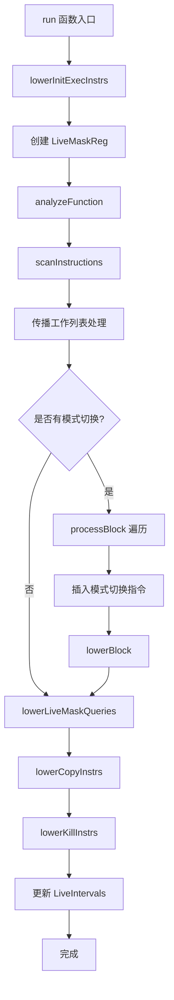

# SIWholeQuadMode.cpp 代码功能详细分析

## 1. Pass 的主要功能概括

<a name="ref-block_0"></a>**SIWholeQuadMode** 是 LLVM AMDGPU 后端的一个机器函数 pass，主要负责管理像素着色器和其他程序中的执行掩码（EXEC）模式。 llvm-project:10-21[<sup>↗</sup>](#block_0) 

该 pass 的**核心作用**是：
- 为需要导数计算的指令启用 Whole Quad Mode (WQM)，确保 2x2 像素块的所有四个线程都处于活动状态
- 在执行存储操作和原子操作时禁用 WQM，切换到 Exact 模式以避免副作用
- 支持 Strict Whole Wavefront Mode (StrictWWM) 和 Strict Whole Quad Mode (StrictWQM) 用于特殊操作
- 通过插入适当的 EXEC 掩码操作指令来管理模式切换

**实现效果**：
- 确保图像采样等需要导数的操作能正确执行
- 防止非活动线程执行存储和原子操作造成的错误副作用
<a name="ref-block_1"></a>- 优化执行掩码的切换，减少不必要的状态转换 llvm-project:22-49[<sup>↗</sup>](#block_1) 

## 2. 主要功能的实现步骤与子功能

### 2.1 扫描与标记阶段（Scanning and Marking Phase）

<a name="ref-block_5"></a>**scanInstructions()** - 扫描所有指令并识别执行模式需求 llvm-project:488-632[<sup>↗</sup>](#block_5) 

该函数遍历所有基本块和指令，识别：
- 需要 WQM 的指令（如图像采样指令）
- 需要 Exact 模式的指令（如存储、原子操作）
- 需要 StrictWWM/StrictWQM 的特殊指令
- 处理 `WQM`、`STRICT_WWM`、`STRICT_WQM` 等内联汇编标记

<a name="ref-block_2"></a>**markInstruction()** - 标记单个指令的模式需求 llvm-project:300-323[<sup>↗</sup>](#block_2) 

为指令标记所需的执行模式标志，并将其加入工作列表进行传播。

<a name="ref-block_3"></a>**markDefs()** - 标记寄存器定义指令 llvm-project:326-441[<sup>↗</sup>](#block_3) 

使用 LiveIntervals 分析来追踪寄存器的定义点，对虚拟寄存器进行深度优先遍历，标记所有相关的定义指令。

<a name="ref-block_4"></a>**markInstructionUses()** - 标记指令的使用操作数 llvm-project:477-484[<sup>↗</sup>](#block_4) 

遍历指令的所有使用操作数，标记它们的定义指令。

### 2.2 传播阶段（Propagation Phase）

<a name="ref-block_8"></a>**analyzeFunction()** - 分析函数并传播执行模式需求 llvm-project:719-734[<sup>↗</sup>](#block_8) 

该函数首先调用 `scanInstructions()` 进行初始扫描，然后使用工作列表算法传播模式需求。

<a name="ref-block_6"></a>**propagateInstruction()** - 在指令级别传播模式需求 llvm-project:634-681[<sup>↗</sup>](#block_6) 

该函数：
- 将指令的输出需求传播到指令本身
- 将需求向后传播到同一基本块的前驱指令
- 将 WQM 需求传播到指令的输入操作数
- 更新基本块级别的需求信息

<a name="ref-block_7"></a>**propagateBlock()** - 在基本块级别传播模式需求 llvm-project:683-717[<sup>↗</sup>](#block_7) 

该函数：
- 将基本块的输出需求传播到块内最后一条指令
- 将块的输入需求传播到所有前驱基本块
- 将块的输出需求传播到所有后继基本块

### 2.3 代码生成与转换阶段（Code Generation Phase）

<a name="ref-block_19"></a>**processBlock()** - 处理基本块并插入模式切换指令 llvm-project:1260-1465[<sup>↗</sup>](#block_19) 

这是核心的代码生成函数，负责：
- 遍历基本块中的每条指令
- 检测何时需要在不同执行模式之间切换
- 在适当的位置插入模式切换指令
- 管理保存和恢复 EXEC 掩码的临时寄存器

<a name="ref-block_15"></a>**toExact()** - 从 WQM 切换到 Exact 模式 llvm-project:1168-1198[<sup>↗</sup>](#block_15) 

插入指令将 EXEC 恢复为 LiveMask（只包含真正活动的线程）。

<a name="ref-block_16"></a>**toWQM()** - 切换到 WQM 模式 llvm-project:1200-1214[<sup>↗</sup>](#block_16) 

插入 S_WQM 指令扩展 EXEC 掩码以包含整个 quad 的所有线程。

<a name="ref-block_17"></a>**toStrictMode()** - 进入严格模式（StrictWWM 或 StrictWQM） llvm-project:1216-1235[<sup>↗</sup>](#block_17) 

保存当前 EXEC 值并设置新的执行模式。

<a name="ref-block_18"></a>**fromStrictMode()** - 退出严格模式 llvm-project:1237-1258[<sup>↗</sup>](#block_18) 

恢复之前保存的 EXEC 值。

### 2.4 特殊指令处理（Special Instruction Handling）

<a name="ref-block_12"></a>**lowerKillI1()** - 处理 kill 指令（I1 版本） llvm-project:926-1038[<sup>↗</sup>](#block_12) 

将 kill 指令转换为更新 LiveMask 和 EXEC 的指令序列，处理动态和静态 kill 情况。

<a name="ref-block_11"></a>**lowerKillF32()** - 处理 kill 指令（F32 版本） llvm-project:809-924[<sup>↗</sup>](#block_11) 

将浮点比较 kill 指令转换为 VCMP 指令加上 EXEC 更新序列。

<a name="ref-block_22"></a>**lowerInitExec()** - 降低初始化 EXEC 的指令 llvm-project:1566-1677[<sup>↗</sup>](#block_22) 

处理三种类型的 EXEC 初始化：
- SI_INIT_WHOLE_WAVE：初始化整个波前
- SI_INIT_EXEC：用立即数初始化 EXEC
- SI_INIT_EXEC_FROM_INPUT：从 SGPR 输入计算并设置 EXEC

<a name="ref-block_13"></a>**lowerBlock()** - 降低基本块中的特殊指令 llvm-project:1043-1094[<sup>↗</sup>](#block_13) 

处理块内需要特殊处理的指令，如 kill 指令和 V_SET_INACTIVE_B32。

### 2.5 辅助功能

<a name="ref-block_9"></a>**saveSCC()** - 保存和恢复 SCC 标志 llvm-project:736-753[<sup>↗</sup>](#block_9) 

在需要保护 SCC 状态的位置插入保存和恢复指令。

<a name="ref-block_14"></a>**prepareInsertion()** - 准备插入点 llvm-project:1099-1166[<sup>↗</sup>](#block_14) 

找到安全的指令插入位置，考虑 SCC 的活跃性和 EXEC 的修改。

<a name="ref-block_10"></a>**splitBlock()** - 分割基本块 llvm-project:755-807[<sup>↗</sup>](#block_10) 

在终止指令处分割基本块，并将某些指令转换为终止指令版本。

<a name="ref-block_20"></a>**lowerLiveMaskQueries()** - 降低 LiveMask 查询指令 llvm-project:1467-1480[<sup>↗</sup>](#block_20) 

将 SI_PS_LIVE 和 SI_LIVE_MASK 指令替换为对 LiveMaskReg 的拷贝。

<a name="ref-block_21"></a>**lowerCopyInstrs()** - 降低拷贝指令 llvm-project:1482-1546[<sup>↗</sup>](#block_21) 

简化 WQM、STRICT_WWM、STRICT_WQM 等内联汇编标记为简单的拷贝或移动指令。

## 3. 步骤之间的关系

整个 pass 的执行流程可以用以下方式描述：



**关键关系说明：**

1. **扫描→标记→传播** 的数据流分析模式：
   - `scanInstructions()` 识别初始需求
   - `markInstruction()`、`markDefs()`、`markInstructionUses()` 标记需求
   - `propagateInstruction()` 和 `propagateBlock()` 传播需求到整个函数

2. **分析→转换** 的两阶段设计：
   - 分析阶段（`analyzeFunction()`）确定所有指令和基本块的执行模式需求
   - 转换阶段（`processBlock()` 和 `lowerBlock()`）根据分析结果插入实际的指令

3. **依赖关系**：
   - 所有的 lower 函数（如 `lowerKillInstrs()`、`lowerCopyInstrs()`）依赖于之前分析阶段设置的状态信息
   - `processBlock()` 必须在 `lowerBlock()` 之前执行，因为前者插入模式切换指令，后者处理特殊指令的降低

4. **LiveIntervals 更新**：
   - 所有插入和删除指令的操作都会同步更新 LiveIntervals 分析结果
<a name="ref-block_23"></a>   - 这确保了后续 pass 能获得正确的活跃性信息 llvm-project:1699-1814[<sup>↗</sup>](#block_23) 

## 4. 总结

SIWholeQuadMode pass 实现了一个完整的执行掩码管理系统，通过精确的数据流分析和代码转换，确保 AMDGPU 着色器在不同执行模式间正确切换，既满足导数计算的需求，又避免了副作用操作的错误执行。其设计体现了编译器 pass 的经典模式：分析→传播→转换，各个子功能模块化清晰，通过工作列表算法实现高效的需求传播。
### Citations
<a name="block_0"></a>**File:** llvm/lib/Target/AMDGPU/SIWholeQuadMode.cpp (L10-21) [<sup>↩</sup>](#ref-block_0)
```cpp
/// This pass adds instructions to enable whole quad mode (strict or non-strict)
/// for pixel shaders, and strict whole wavefront mode for all programs.
///
/// The "strict" prefix indicates that inactive lanes do not take part in
/// control flow, specifically an inactive lane enabled by a strict WQM/WWM will
/// always be enabled irrespective of control flow decisions. Conversely in
/// non-strict WQM inactive lanes may control flow decisions.
///
/// Whole quad mode is required for derivative computations, but it interferes
/// with shader side effects (stores and atomics). It ensures that WQM is
/// enabled when necessary, but disabled around stores and atomics.
///
```
<a name="block_1"></a>**File:** llvm/lib/Target/AMDGPU/SIWholeQuadMode.cpp (L22-49) [<sup>↩</sup>](#ref-block_1)
```cpp
/// When necessary, this pass creates a function prolog
///
///   S_MOV_B64 LiveMask, EXEC
///   S_WQM_B64 EXEC, EXEC
///
/// to enter WQM at the top of the function and surrounds blocks of Exact
/// instructions by
///
///   S_AND_SAVEEXEC_B64 Tmp, LiveMask
///   ...
///   S_MOV_B64 EXEC, Tmp
///
/// We also compute when a sequence of instructions requires strict whole
/// wavefront mode (StrictWWM) and insert instructions to save and restore it:
///
///   S_OR_SAVEEXEC_B64 Tmp, -1
///   ...
///   S_MOV_B64 EXEC, Tmp
///
/// When a sequence of instructions requires strict whole quad mode (StrictWQM)
/// we use a similar save and restore mechanism and force whole quad mode for
/// those instructions:
///
///  S_MOV_B64 Tmp, EXEC
///  S_WQM_B64 EXEC, EXEC
///  ...
///  S_MOV_B64 EXEC, Tmp
///
```
<a name="block_2"></a>**File:** llvm/lib/Target/AMDGPU/SIWholeQuadMode.cpp (L300-323) [<sup>↩</sup>](#ref-block_2)
```cpp
void SIWholeQuadMode::markInstruction(MachineInstr &MI, char Flag,
                                      std::vector<WorkItem> &Worklist) {
  InstrInfo &II = Instructions[&MI];

  assert(!(Flag & StateExact) && Flag != 0);

  // Capture all states requested in marking including disabled ones.
  II.MarkedStates |= Flag;

  // Remove any disabled states from the flag. The user that required it gets
  // an undefined value in the helper lanes. For example, this can happen if
  // the result of an atomic is used by instruction that requires WQM, where
  // ignoring the request for WQM is correct as per the relevant specs.
  Flag &= ~II.Disabled;

  // Ignore if the flag is already encompassed by the existing needs, or we
  // just disabled everything.
  if ((II.Needs & Flag) == Flag)
    return;

  LLVM_DEBUG(dbgs() << "markInstruction " << PrintState(Flag) << ": " << MI);
  II.Needs |= Flag;
  Worklist.emplace_back(&MI);
}
```
<a name="block_3"></a>**File:** llvm/lib/Target/AMDGPU/SIWholeQuadMode.cpp (L326-441) [<sup>↩</sup>](#ref-block_3)
```cpp
void SIWholeQuadMode::markDefs(const MachineInstr &UseMI, LiveRange &LR,
                               Register Reg, unsigned SubReg, char Flag,
                               std::vector<WorkItem> &Worklist) {
  LLVM_DEBUG(dbgs() << "markDefs " << PrintState(Flag) << ": " << UseMI);

  LiveQueryResult UseLRQ = LR.Query(LIS->getInstructionIndex(UseMI));
  const VNInfo *Value = UseLRQ.valueIn();
  if (!Value)
    return;

  // Note: this code assumes that lane masks on AMDGPU completely
  // cover registers.
  const LaneBitmask UseLanes =
      SubReg ? TRI->getSubRegIndexLaneMask(SubReg)
             : (Reg.isVirtual() ? MRI->getMaxLaneMaskForVReg(Reg)
                                : LaneBitmask::getNone());

  // Perform a depth-first iteration of the LiveRange graph marking defs.
  // Stop processing of a given branch when all use lanes have been defined.
  // The first definition stops processing for a physical register.
  struct PhiEntry {
    const VNInfo *Phi;
    unsigned PredIdx;
    LaneBitmask DefinedLanes;

    PhiEntry(const VNInfo *Phi, unsigned PredIdx, LaneBitmask DefinedLanes)
        : Phi(Phi), PredIdx(PredIdx), DefinedLanes(DefinedLanes) {}
  };
  using VisitKey = std::pair<const VNInfo *, LaneBitmask>;
  SmallVector<PhiEntry, 2> PhiStack;
  SmallSet<VisitKey, 4> Visited;
  LaneBitmask DefinedLanes;
  unsigned NextPredIdx = 0; // Only used for processing phi nodes
  do {
    const VNInfo *NextValue = nullptr;
    const VisitKey Key(Value, DefinedLanes);

    if (Visited.insert(Key).second) {
      // On first visit to a phi then start processing first predecessor
      NextPredIdx = 0;
    }

    if (Value->isPHIDef()) {
      // Each predecessor node in the phi must be processed as a subgraph
      const MachineBasicBlock *MBB = LIS->getMBBFromIndex(Value->def);
      assert(MBB && "Phi-def has no defining MBB");

      // Find next predecessor to process
      unsigned Idx = NextPredIdx;
      const auto *PI = MBB->pred_begin() + Idx;
      const auto *PE = MBB->pred_end();
      for (; PI != PE && !NextValue; ++PI, ++Idx) {
        if (const VNInfo *VN = LR.getVNInfoBefore(LIS->getMBBEndIdx(*PI))) {
          if (!Visited.count(VisitKey(VN, DefinedLanes)))
            NextValue = VN;
        }
      }

      // If there are more predecessors to process; add phi to stack
      if (PI != PE)
        PhiStack.emplace_back(Value, Idx, DefinedLanes);
    } else {
      MachineInstr *MI = LIS->getInstructionFromIndex(Value->def);
      assert(MI && "Def has no defining instruction");

      if (Reg.isVirtual()) {
        // Iterate over all operands to find relevant definitions
        bool HasDef = false;
        for (const MachineOperand &Op : MI->all_defs()) {
          if (Op.getReg() != Reg)
            continue;

          // Compute lanes defined and overlap with use
          LaneBitmask OpLanes =
              Op.isUndef() ? LaneBitmask::getAll()
                           : TRI->getSubRegIndexLaneMask(Op.getSubReg());
          LaneBitmask Overlap = (UseLanes & OpLanes);

          // Record if this instruction defined any of use
          HasDef |= Overlap.any();

          // Mark any lanes defined
          DefinedLanes |= OpLanes;
        }

        // Check if all lanes of use have been defined
        if ((DefinedLanes & UseLanes) != UseLanes) {
          // Definition not complete; need to process input value
          LiveQueryResult LRQ = LR.Query(LIS->getInstructionIndex(*MI));
          if (const VNInfo *VN = LRQ.valueIn()) {
            if (!Visited.count(VisitKey(VN, DefinedLanes)))
              NextValue = VN;
          }
        }

        // Only mark the instruction if it defines some part of the use
        if (HasDef)
          markInstruction(*MI, Flag, Worklist);
      } else {
        // For physical registers simply mark the defining instruction
        markInstruction(*MI, Flag, Worklist);
      }
    }

    if (!NextValue && !PhiStack.empty()) {
      // Reach end of chain; revert to processing last phi
      PhiEntry &Entry = PhiStack.back();
      NextValue = Entry.Phi;
      NextPredIdx = Entry.PredIdx;
      DefinedLanes = Entry.DefinedLanes;
      PhiStack.pop_back();
    }

    Value = NextValue;
  } while (Value);
}
```
<a name="block_4"></a>**File:** llvm/lib/Target/AMDGPU/SIWholeQuadMode.cpp (L477-484) [<sup>↩</sup>](#ref-block_4)
```cpp
void SIWholeQuadMode::markInstructionUses(const MachineInstr &MI, char Flag,
                                          std::vector<WorkItem> &Worklist) {
  LLVM_DEBUG(dbgs() << "markInstructionUses " << PrintState(Flag) << ": "
                    << MI);

  for (const MachineOperand &Use : MI.all_uses())
    markOperand(MI, Use, Flag, Worklist);
}
```
<a name="block_5"></a>**File:** llvm/lib/Target/AMDGPU/SIWholeQuadMode.cpp (L488-632) [<sup>↩</sup>](#ref-block_5)
```cpp
char SIWholeQuadMode::scanInstructions(MachineFunction &MF,
                                       std::vector<WorkItem> &Worklist) {
  char GlobalFlags = 0;
  bool WQMOutputs = MF.getFunction().hasFnAttribute("amdgpu-ps-wqm-outputs");
  SmallVector<MachineInstr *, 4> SoftWQMInstrs;
  bool HasImplicitDerivatives =
      MF.getFunction().getCallingConv() == CallingConv::AMDGPU_PS;

  // We need to visit the basic blocks in reverse post-order so that we visit
  // defs before uses, in particular so that we don't accidentally mark an
  // instruction as needing e.g. WQM before visiting it and realizing it needs
  // WQM disabled.
  ReversePostOrderTraversal<MachineFunction *> RPOT(&MF);
  for (MachineBasicBlock *MBB : RPOT) {
    BlockInfo &BBI = Blocks[MBB];

    for (MachineInstr &MI : *MBB) {
      InstrInfo &III = Instructions[&MI];
      unsigned Opcode = MI.getOpcode();
      char Flags = 0;

      if (TII->isWQM(Opcode)) {
        // If LOD is not supported WQM is not needed.
        // Only generate implicit WQM if implicit derivatives are required.
        // This avoids inserting unintended WQM if a shader type without
        // implicit derivatives uses an image sampling instruction.
        if (ST->hasExtendedImageInsts() && HasImplicitDerivatives) {
          // Sampling instructions don't need to produce results for all pixels
          // in a quad, they just require all inputs of a quad to have been
          // computed for derivatives.
          markInstructionUses(MI, StateWQM, Worklist);
          GlobalFlags |= StateWQM;
        }
      } else if (Opcode == AMDGPU::WQM) {
        // The WQM intrinsic requires its output to have all the helper lanes
        // correct, so we need it to be in WQM.
        Flags = StateWQM;
        LowerToCopyInstrs.insert(&MI);
      } else if (Opcode == AMDGPU::SOFT_WQM) {
        LowerToCopyInstrs.insert(&MI);
        SoftWQMInstrs.push_back(&MI);
      } else if (Opcode == AMDGPU::STRICT_WWM) {
        // The STRICT_WWM intrinsic doesn't make the same guarantee, and plus
        // it needs to be executed in WQM or Exact so that its copy doesn't
        // clobber inactive lanes.
        markInstructionUses(MI, StateStrictWWM, Worklist);
        GlobalFlags |= StateStrictWWM;
        LowerToMovInstrs.push_back(&MI);
      } else if (Opcode == AMDGPU::STRICT_WQM ||
                 TII->isDualSourceBlendEXP(MI)) {
        // STRICT_WQM is similar to STRICTWWM, but instead of enabling all
        // threads of the wave like STRICTWWM, STRICT_WQM enables all threads in
        // quads that have at least one active thread.
        markInstructionUses(MI, StateStrictWQM, Worklist);
        GlobalFlags |= StateStrictWQM;

        if (Opcode == AMDGPU::STRICT_WQM) {
          LowerToMovInstrs.push_back(&MI);
        } else {
          // Dual source blend export acts as implicit strict-wqm, its sources
          // need to be shuffled in strict wqm, but the export itself needs to
          // run in exact mode.
          BBI.Needs |= StateExact;
          if (!(BBI.InNeeds & StateExact)) {
            BBI.InNeeds |= StateExact;
            Worklist.emplace_back(MBB);
          }
          GlobalFlags |= StateExact;
          III.Disabled = StateWQM | StateStrict;
        }
      } else if (Opcode == AMDGPU::LDS_PARAM_LOAD ||
                 Opcode == AMDGPU::DS_PARAM_LOAD ||
                 Opcode == AMDGPU::LDS_DIRECT_LOAD ||
                 Opcode == AMDGPU::DS_DIRECT_LOAD) {
        // Mark these STRICTWQM, but only for the instruction, not its operands.
        // This avoid unnecessarily marking M0 as requiring WQM.
        III.Needs |= StateStrictWQM;
        GlobalFlags |= StateStrictWQM;
      } else if (Opcode == AMDGPU::V_SET_INACTIVE_B32) {
        // Disable strict states; StrictWQM will be added as required later.
        III.Disabled = StateStrict;
        MachineOperand &Inactive = MI.getOperand(4);
        if (Inactive.isReg()) {
          if (Inactive.isUndef() && MI.getOperand(3).getImm() == 0)
            LowerToCopyInstrs.insert(&MI);
          else
            markOperand(MI, Inactive, StateStrictWWM, Worklist);
        }
        SetInactiveInstrs.push_back(&MI);
        BBI.NeedsLowering = true;
      } else if (TII->isDisableWQM(MI)) {
        BBI.Needs |= StateExact;
        if (!(BBI.InNeeds & StateExact)) {
          BBI.InNeeds |= StateExact;
          Worklist.emplace_back(MBB);
        }
        GlobalFlags |= StateExact;
        III.Disabled = StateWQM | StateStrict;
      } else if (Opcode == AMDGPU::SI_PS_LIVE ||
                 Opcode == AMDGPU::SI_LIVE_MASK) {
        LiveMaskQueries.push_back(&MI);
      } else if (Opcode == AMDGPU::SI_KILL_I1_TERMINATOR ||
                 Opcode == AMDGPU::SI_KILL_F32_COND_IMM_TERMINATOR ||
                 Opcode == AMDGPU::SI_DEMOTE_I1) {
        KillInstrs.push_back(&MI);
        BBI.NeedsLowering = true;
      } else if (Opcode == AMDGPU::SI_INIT_EXEC ||
                 Opcode == AMDGPU::SI_INIT_EXEC_FROM_INPUT ||
                 Opcode == AMDGPU::SI_INIT_WHOLE_WAVE) {
        InitExecInstrs.push_back(&MI);
      } else if (WQMOutputs) {
        // The function is in machine SSA form, which means that physical
        // VGPRs correspond to shader inputs and outputs. Inputs are
        // only used, outputs are only defined.
        // FIXME: is this still valid?
        for (const MachineOperand &MO : MI.defs()) {
          Register Reg = MO.getReg();
          if (Reg.isPhysical() &&
              TRI->hasVectorRegisters(TRI->getPhysRegBaseClass(Reg))) {
            Flags = StateWQM;
            break;
          }
        }
      }

      if (Flags) {
        markInstruction(MI, Flags, Worklist);
        GlobalFlags |= Flags;
      }
    }
  }

  // Mark sure that any SET_INACTIVE instructions are computed in WQM if WQM is
  // ever used anywhere in the function. This implements the corresponding
  // semantics of @llvm.amdgcn.set.inactive.
  // Similarly for SOFT_WQM instructions, implementing @llvm.amdgcn.softwqm.
  if (GlobalFlags & StateWQM) {
    for (MachineInstr *MI : SetInactiveInstrs)
      markInstruction(*MI, StateWQM, Worklist);
    for (MachineInstr *MI : SoftWQMInstrs)
      markInstruction(*MI, StateWQM, Worklist);
  }

  return GlobalFlags;
}
```
<a name="block_6"></a>**File:** llvm/lib/Target/AMDGPU/SIWholeQuadMode.cpp (L634-681) [<sup>↩</sup>](#ref-block_6)
```cpp
void SIWholeQuadMode::propagateInstruction(MachineInstr &MI,
                                           std::vector<WorkItem>& Worklist) {
  MachineBasicBlock *MBB = MI.getParent();
  InstrInfo II = Instructions[&MI]; // take a copy to prevent dangling references
  BlockInfo &BI = Blocks[MBB];

  // Control flow-type instructions and stores to temporary memory that are
  // followed by WQM computations must themselves be in WQM.
  if ((II.OutNeeds & StateWQM) && !(II.Disabled & StateWQM) &&
      (MI.isTerminator() || (TII->usesVM_CNT(MI) && MI.mayStore()))) {
    Instructions[&MI].Needs = StateWQM;
    II.Needs = StateWQM;
  }

  // Propagate to block level
  if (II.Needs & StateWQM) {
    BI.Needs |= StateWQM;
    if (!(BI.InNeeds & StateWQM)) {
      BI.InNeeds |= StateWQM;
      Worklist.emplace_back(MBB);
    }
  }

  // Propagate backwards within block
  if (MachineInstr *PrevMI = MI.getPrevNode()) {
    char InNeeds = (II.Needs & ~StateStrict) | II.OutNeeds;
    if (!PrevMI->isPHI()) {
      InstrInfo &PrevII = Instructions[PrevMI];
      if ((PrevII.OutNeeds | InNeeds) != PrevII.OutNeeds) {
        PrevII.OutNeeds |= InNeeds;
        Worklist.emplace_back(PrevMI);
      }
    }
  }

  // Propagate WQM flag to instruction inputs
  assert(!(II.Needs & StateExact));

  if (II.Needs != 0)
    markInstructionUses(MI, II.Needs, Worklist);

  // Ensure we process a block containing StrictWWM/StrictWQM, even if it does
  // not require any WQM transitions.
  if (II.Needs & StateStrictWWM)
    BI.Needs |= StateStrictWWM;
  if (II.Needs & StateStrictWQM)
    BI.Needs |= StateStrictWQM;
}
```
<a name="block_7"></a>**File:** llvm/lib/Target/AMDGPU/SIWholeQuadMode.cpp (L683-717) [<sup>↩</sup>](#ref-block_7)
```cpp
void SIWholeQuadMode::propagateBlock(MachineBasicBlock &MBB,
                                     std::vector<WorkItem>& Worklist) {
  BlockInfo BI = Blocks[&MBB]; // Make a copy to prevent dangling references.

  // Propagate through instructions
  if (!MBB.empty()) {
    MachineInstr *LastMI = &*MBB.rbegin();
    InstrInfo &LastII = Instructions[LastMI];
    if ((LastII.OutNeeds | BI.OutNeeds) != LastII.OutNeeds) {
      LastII.OutNeeds |= BI.OutNeeds;
      Worklist.emplace_back(LastMI);
    }
  }

  // Predecessor blocks must provide for our WQM/Exact needs.
  for (MachineBasicBlock *Pred : MBB.predecessors()) {
    BlockInfo &PredBI = Blocks[Pred];
    if ((PredBI.OutNeeds | BI.InNeeds) == PredBI.OutNeeds)
      continue;

    PredBI.OutNeeds |= BI.InNeeds;
    PredBI.InNeeds |= BI.InNeeds;
    Worklist.emplace_back(Pred);
  }

  // All successors must be prepared to accept the same set of WQM/Exact data.
  for (MachineBasicBlock *Succ : MBB.successors()) {
    BlockInfo &SuccBI = Blocks[Succ];
    if ((SuccBI.InNeeds | BI.OutNeeds) == SuccBI.InNeeds)
      continue;

    SuccBI.InNeeds |= BI.OutNeeds;
    Worklist.emplace_back(Succ);
  }
}
```
<a name="block_8"></a>**File:** llvm/lib/Target/AMDGPU/SIWholeQuadMode.cpp (L719-734) [<sup>↩</sup>](#ref-block_8)
```cpp
char SIWholeQuadMode::analyzeFunction(MachineFunction &MF) {
  std::vector<WorkItem> Worklist;
  char GlobalFlags = scanInstructions(MF, Worklist);

  while (!Worklist.empty()) {
    WorkItem WI = Worklist.back();
    Worklist.pop_back();

    if (WI.MI)
      propagateInstruction(*WI.MI, Worklist);
    else
      propagateBlock(*WI.MBB, Worklist);
  }

  return GlobalFlags;
}
```
<a name="block_9"></a>**File:** llvm/lib/Target/AMDGPU/SIWholeQuadMode.cpp (L736-753) [<sup>↩</sup>](#ref-block_9)
```cpp
MachineBasicBlock::iterator
SIWholeQuadMode::saveSCC(MachineBasicBlock &MBB,
                         MachineBasicBlock::iterator Before) {
  Register SaveReg = MRI->createVirtualRegister(&AMDGPU::SReg_32_XM0RegClass);

  MachineInstr *Save =
      BuildMI(MBB, Before, DebugLoc(), TII->get(AMDGPU::COPY), SaveReg)
          .addReg(AMDGPU::SCC);
  MachineInstr *Restore =
      BuildMI(MBB, Before, DebugLoc(), TII->get(AMDGPU::COPY), AMDGPU::SCC)
          .addReg(SaveReg);

  LIS->InsertMachineInstrInMaps(*Save);
  LIS->InsertMachineInstrInMaps(*Restore);
  LIS->createAndComputeVirtRegInterval(SaveReg);

  return Restore;
}
```
<a name="block_10"></a>**File:** llvm/lib/Target/AMDGPU/SIWholeQuadMode.cpp (L755-807) [<sup>↩</sup>](#ref-block_10)
```cpp
void SIWholeQuadMode::splitBlock(MachineInstr *TermMI) {
  MachineBasicBlock *BB = TermMI->getParent();
  LLVM_DEBUG(dbgs() << "Split block " << printMBBReference(*BB) << " @ "
                    << *TermMI << "\n");

  MachineBasicBlock *SplitBB =
      BB->splitAt(*TermMI, /*UpdateLiveIns*/ true, LIS);

  // Convert last instruction in block to a terminator.
  // Note: this only covers the expected patterns
  unsigned NewOpcode = 0;
  switch (TermMI->getOpcode()) {
  case AMDGPU::S_AND_B32:
    NewOpcode = AMDGPU::S_AND_B32_term;
    break;
  case AMDGPU::S_AND_B64:
    NewOpcode = AMDGPU::S_AND_B64_term;
    break;
  case AMDGPU::S_MOV_B32:
    NewOpcode = AMDGPU::S_MOV_B32_term;
    break;
  case AMDGPU::S_MOV_B64:
    NewOpcode = AMDGPU::S_MOV_B64_term;
    break;
  case AMDGPU::S_ANDN2_B32:
    NewOpcode = AMDGPU::S_ANDN2_B32_term;
    break;
  case AMDGPU::S_ANDN2_B64:
    NewOpcode = AMDGPU::S_ANDN2_B64_term;
    break;
  default:
    llvm_unreachable("Unexpected instruction");
  }

  // These terminators fallthrough to the next block, no need to add an
  // unconditional branch to the next block (SplitBB).
  TermMI->setDesc(TII->get(NewOpcode));

  if (SplitBB != BB) {
    // Update dominator trees
    using DomTreeT = DomTreeBase<MachineBasicBlock>;
    SmallVector<DomTreeT::UpdateType, 16> DTUpdates;
    for (MachineBasicBlock *Succ : SplitBB->successors()) {
      DTUpdates.push_back({DomTreeT::Insert, SplitBB, Succ});
      DTUpdates.push_back({DomTreeT::Delete, BB, Succ});
    }
    DTUpdates.push_back({DomTreeT::Insert, BB, SplitBB});
    if (MDT)
      MDT->applyUpdates(DTUpdates);
    if (PDT)
      PDT->applyUpdates(DTUpdates);
  }
}
```
<a name="block_11"></a>**File:** llvm/lib/Target/AMDGPU/SIWholeQuadMode.cpp (L809-924) [<sup>↩</sup>](#ref-block_11)
```cpp
MachineInstr *SIWholeQuadMode::lowerKillF32(MachineInstr &MI) {
  assert(LiveMaskReg.isVirtual());

  const DebugLoc &DL = MI.getDebugLoc();
  unsigned Opcode = 0;

  assert(MI.getOperand(0).isReg());

  // Comparison is for live lanes; however here we compute the inverse
  // (killed lanes).  This is because VCMP will always generate 0 bits
  // for inactive lanes so a mask of live lanes would not be correct
  // inside control flow.
  // Invert the comparison by swapping the operands and adjusting
  // the comparison codes.

  switch (MI.getOperand(2).getImm()) {
  case ISD::SETUEQ:
    Opcode = AMDGPU::V_CMP_LG_F32_e64;
    break;
  case ISD::SETUGT:
    Opcode = AMDGPU::V_CMP_GE_F32_e64;
    break;
  case ISD::SETUGE:
    Opcode = AMDGPU::V_CMP_GT_F32_e64;
    break;
  case ISD::SETULT:
    Opcode = AMDGPU::V_CMP_LE_F32_e64;
    break;
  case ISD::SETULE:
    Opcode = AMDGPU::V_CMP_LT_F32_e64;
    break;
  case ISD::SETUNE:
    Opcode = AMDGPU::V_CMP_EQ_F32_e64;
    break;
  case ISD::SETO:
    Opcode = AMDGPU::V_CMP_O_F32_e64;
    break;
  case ISD::SETUO:
    Opcode = AMDGPU::V_CMP_U_F32_e64;
    break;
  case ISD::SETOEQ:
  case ISD::SETEQ:
    Opcode = AMDGPU::V_CMP_NEQ_F32_e64;
    break;
  case ISD::SETOGT:
  case ISD::SETGT:
    Opcode = AMDGPU::V_CMP_NLT_F32_e64;
    break;
  case ISD::SETOGE:
  case ISD::SETGE:
    Opcode = AMDGPU::V_CMP_NLE_F32_e64;
    break;
  case ISD::SETOLT:
  case ISD::SETLT:
    Opcode = AMDGPU::V_CMP_NGT_F32_e64;
    break;
  case ISD::SETOLE:
  case ISD::SETLE:
    Opcode = AMDGPU::V_CMP_NGE_F32_e64;
    break;
  case ISD::SETONE:
  case ISD::SETNE:
    Opcode = AMDGPU::V_CMP_NLG_F32_e64;
    break;
  default:
    llvm_unreachable("invalid ISD:SET cond code");
  }

  MachineBasicBlock &MBB = *MI.getParent();

  // Pick opcode based on comparison type.
  MachineInstr *VcmpMI;
  const MachineOperand &Op0 = MI.getOperand(0);
  const MachineOperand &Op1 = MI.getOperand(1);

  // VCC represents lanes killed.
  Register VCC = ST->isWave32() ? AMDGPU::VCC_LO : AMDGPU::VCC;

  if (TRI->isVGPR(*MRI, Op0.getReg())) {
    Opcode = AMDGPU::getVOPe32(Opcode);
    VcmpMI = BuildMI(MBB, &MI, DL, TII->get(Opcode)).add(Op1).add(Op0);
  } else {
    VcmpMI = BuildMI(MBB, &MI, DL, TII->get(Opcode))
                 .addReg(VCC, RegState::Define)
                 .addImm(0) // src0 modifiers
                 .add(Op1)
                 .addImm(0) // src1 modifiers
                 .add(Op0)
                 .addImm(0); // omod
  }

  MachineInstr *MaskUpdateMI =
      BuildMI(MBB, MI, DL, TII->get(AndN2Opc), LiveMaskReg)
          .addReg(LiveMaskReg)
          .addReg(VCC);

  // State of SCC represents whether any lanes are live in mask,
  // if SCC is 0 then no lanes will be alive anymore.
  MachineInstr *EarlyTermMI =
      BuildMI(MBB, MI, DL, TII->get(AMDGPU::SI_EARLY_TERMINATE_SCC0));

  MachineInstr *ExecMaskMI =
      BuildMI(MBB, MI, DL, TII->get(AndN2Opc), Exec).addReg(Exec).addReg(VCC);

  assert(MBB.succ_size() == 1);

  // Update live intervals
  LIS->ReplaceMachineInstrInMaps(MI, *VcmpMI);
  MBB.remove(&MI);

  LIS->InsertMachineInstrInMaps(*MaskUpdateMI);
  LIS->InsertMachineInstrInMaps(*EarlyTermMI);
  LIS->InsertMachineInstrInMaps(*ExecMaskMI);

  return ExecMaskMI;
}
```
<a name="block_12"></a>**File:** llvm/lib/Target/AMDGPU/SIWholeQuadMode.cpp (L926-1038) [<sup>↩</sup>](#ref-block_12)
```cpp
MachineInstr *SIWholeQuadMode::lowerKillI1(MachineInstr &MI, bool IsWQM) {
  assert(LiveMaskReg.isVirtual());

  MachineBasicBlock &MBB = *MI.getParent();

  const DebugLoc &DL = MI.getDebugLoc();
  MachineInstr *MaskUpdateMI = nullptr;

  const bool IsDemote = IsWQM && (MI.getOpcode() == AMDGPU::SI_DEMOTE_I1);
  const MachineOperand &Op = MI.getOperand(0);
  int64_t KillVal = MI.getOperand(1).getImm();
  MachineInstr *ComputeKilledMaskMI = nullptr;
  Register CndReg = !Op.isImm() ? Op.getReg() : Register();
  Register TmpReg;

  // Is this a static or dynamic kill?
  if (Op.isImm()) {
    if (Op.getImm() == KillVal) {
      // Static: all active lanes are killed
      MaskUpdateMI = BuildMI(MBB, MI, DL, TII->get(AndN2Opc), LiveMaskReg)
                         .addReg(LiveMaskReg)
                         .addReg(Exec);
    } else {
      // Static: kill does nothing
      bool IsLastTerminator = std::next(MI.getIterator()) == MBB.end();
      if (!IsLastTerminator) {
        LIS->RemoveMachineInstrFromMaps(MI);
      } else {
        assert(MBB.succ_size() == 1 && MI.getOpcode() != AMDGPU::SI_DEMOTE_I1);
        MachineInstr *NewTerm = BuildMI(MBB, MI, DL, TII->get(AMDGPU::S_BRANCH))
                                    .addMBB(*MBB.succ_begin());
        LIS->ReplaceMachineInstrInMaps(MI, *NewTerm);
      }
      MBB.remove(&MI);
      return nullptr;
    }
  } else {
    if (!KillVal) {
      // Op represents live lanes after kill,
      // so exec mask needs to be factored in.
      TmpReg = MRI->createVirtualRegister(TRI->getBoolRC());
      ComputeKilledMaskMI =
          BuildMI(MBB, MI, DL, TII->get(AndN2Opc), TmpReg).addReg(Exec).add(Op);
      MaskUpdateMI = BuildMI(MBB, MI, DL, TII->get(AndN2Opc), LiveMaskReg)
                         .addReg(LiveMaskReg)
                         .addReg(TmpReg);
    } else {
      // Op represents lanes to kill
      MaskUpdateMI = BuildMI(MBB, MI, DL, TII->get(AndN2Opc), LiveMaskReg)
                         .addReg(LiveMaskReg)
                         .add(Op);
    }
  }

  // State of SCC represents whether any lanes are live in mask,
  // if SCC is 0 then no lanes will be alive anymore.
  MachineInstr *EarlyTermMI =
      BuildMI(MBB, MI, DL, TII->get(AMDGPU::SI_EARLY_TERMINATE_SCC0));

  // In the case we got this far some lanes are still live,
  // update EXEC to deactivate lanes as appropriate.
  MachineInstr *NewTerm;
  MachineInstr *WQMMaskMI = nullptr;
  Register LiveMaskWQM;
  if (IsDemote) {
    // Demote - deactivate quads with only helper lanes
    LiveMaskWQM = MRI->createVirtualRegister(TRI->getBoolRC());
    WQMMaskMI =
        BuildMI(MBB, MI, DL, TII->get(WQMOpc), LiveMaskWQM).addReg(LiveMaskReg);
    NewTerm = BuildMI(MBB, MI, DL, TII->get(AndOpc), Exec)
                  .addReg(Exec)
                  .addReg(LiveMaskWQM);
  } else {
    // Kill - deactivate lanes no longer in live mask
    if (Op.isImm()) {
      unsigned MovOpc = ST->isWave32() ? AMDGPU::S_MOV_B32 : AMDGPU::S_MOV_B64;
      NewTerm = BuildMI(MBB, &MI, DL, TII->get(MovOpc), Exec).addImm(0);
    } else if (!IsWQM) {
      NewTerm = BuildMI(MBB, &MI, DL, TII->get(AndOpc), Exec)
                    .addReg(Exec)
                    .addReg(LiveMaskReg);
    } else {
      unsigned Opcode = KillVal ? AndN2Opc : AndOpc;
      NewTerm =
          BuildMI(MBB, &MI, DL, TII->get(Opcode), Exec).addReg(Exec).add(Op);
    }
  }

  // Update live intervals
  LIS->RemoveMachineInstrFromMaps(MI);
  MBB.remove(&MI);
  assert(EarlyTermMI);
  assert(MaskUpdateMI);
  assert(NewTerm);
  if (ComputeKilledMaskMI)
    LIS->InsertMachineInstrInMaps(*ComputeKilledMaskMI);
  LIS->InsertMachineInstrInMaps(*MaskUpdateMI);
  LIS->InsertMachineInstrInMaps(*EarlyTermMI);
  if (WQMMaskMI)
    LIS->InsertMachineInstrInMaps(*WQMMaskMI);
  LIS->InsertMachineInstrInMaps(*NewTerm);

  if (CndReg) {
    LIS->removeInterval(CndReg);
    LIS->createAndComputeVirtRegInterval(CndReg);
  }
  if (TmpReg)
    LIS->createAndComputeVirtRegInterval(TmpReg);
  if (LiveMaskWQM)
    LIS->createAndComputeVirtRegInterval(LiveMaskWQM);

  return NewTerm;
}
```
<a name="block_13"></a>**File:** llvm/lib/Target/AMDGPU/SIWholeQuadMode.cpp (L1043-1094) [<sup>↩</sup>](#ref-block_13)
```cpp
void SIWholeQuadMode::lowerBlock(MachineBasicBlock &MBB, BlockInfo &BI) {
  if (!BI.NeedsLowering)
    return;

  LLVM_DEBUG(dbgs() << "\nLowering block " << printMBBReference(MBB) << ":\n");

  SmallVector<MachineInstr *, 4> SplitPoints;
  Register ActiveLanesReg = 0;
  char State = BI.InitialState;

  for (MachineInstr &MI : llvm::make_early_inc_range(
           llvm::make_range(MBB.getFirstNonPHI(), MBB.end()))) {
    auto MIState = StateTransition.find(&MI);
    if (MIState != StateTransition.end())
      State = MIState->second;

    MachineInstr *SplitPoint = nullptr;
    switch (MI.getOpcode()) {
    case AMDGPU::SI_DEMOTE_I1:
    case AMDGPU::SI_KILL_I1_TERMINATOR:
      SplitPoint = lowerKillI1(MI, State == StateWQM);
      break;
    case AMDGPU::SI_KILL_F32_COND_IMM_TERMINATOR:
      SplitPoint = lowerKillF32(MI);
      break;
    case AMDGPU::ENTER_STRICT_WWM:
      ActiveLanesReg = MI.getOperand(0).getReg();
      break;
    case AMDGPU::EXIT_STRICT_WWM:
      ActiveLanesReg = 0;
      break;
    case AMDGPU::V_SET_INACTIVE_B32:
      if (ActiveLanesReg) {
        LiveInterval &LI = LIS->getInterval(MI.getOperand(5).getReg());
        MRI->constrainRegClass(ActiveLanesReg, TRI->getWaveMaskRegClass());
        MI.getOperand(5).setReg(ActiveLanesReg);
        LIS->shrinkToUses(&LI);
      } else {
        assert(State == StateExact || State == StateWQM);
      }
      break;
    default:
      break;
    }
    if (SplitPoint)
      SplitPoints.push_back(SplitPoint);
  }

  // Perform splitting after instruction scan to simplify iteration.
  for (MachineInstr *MI : SplitPoints)
    splitBlock(MI);
}
```
<a name="block_14"></a>**File:** llvm/lib/Target/AMDGPU/SIWholeQuadMode.cpp (L1099-1166) [<sup>↩</sup>](#ref-block_14)
```cpp
MachineBasicBlock::iterator SIWholeQuadMode::prepareInsertion(
    MachineBasicBlock &MBB, MachineBasicBlock::iterator First,
    MachineBasicBlock::iterator Last, bool PreferLast, bool SaveSCC) {
  if (!SaveSCC)
    return PreferLast ? Last : First;

  LiveRange &LR =
      LIS->getRegUnit(*TRI->regunits(MCRegister::from(AMDGPU::SCC)).begin());
  auto MBBE = MBB.end();
  SlotIndex FirstIdx = First != MBBE ? LIS->getInstructionIndex(*First)
                                     : LIS->getMBBEndIdx(&MBB);
  SlotIndex LastIdx =
      Last != MBBE ? LIS->getInstructionIndex(*Last) : LIS->getMBBEndIdx(&MBB);
  SlotIndex Idx = PreferLast ? LastIdx : FirstIdx;
  const LiveRange::Segment *S;

  for (;;) {
    S = LR.getSegmentContaining(Idx);
    if (!S)
      break;

    if (PreferLast) {
      SlotIndex Next = S->start.getBaseIndex();
      if (Next < FirstIdx)
        break;
      Idx = Next;
    } else {
      MachineInstr *EndMI = LIS->getInstructionFromIndex(S->end.getBaseIndex());
      assert(EndMI && "Segment does not end on valid instruction");
      auto NextI = std::next(EndMI->getIterator());
      if (NextI == MBB.end())
        break;
      SlotIndex Next = LIS->getInstructionIndex(*NextI);
      if (Next > LastIdx)
        break;
      Idx = Next;
    }
  }

  MachineBasicBlock::iterator MBBI;

  if (MachineInstr *MI = LIS->getInstructionFromIndex(Idx))
    MBBI = MI;
  else {
    assert(Idx == LIS->getMBBEndIdx(&MBB));
    MBBI = MBB.end();
  }

  // Move insertion point past any operations modifying EXEC.
  // This assumes that the value of SCC defined by any of these operations
  // does not need to be preserved.
  while (MBBI != Last) {
    bool IsExecDef = false;
    for (const MachineOperand &MO : MBBI->all_defs()) {
      IsExecDef |=
          MO.getReg() == AMDGPU::EXEC_LO || MO.getReg() == AMDGPU::EXEC;
    }
    if (!IsExecDef)
      break;
    MBBI++;
    S = nullptr;
  }

  if (S)
    MBBI = saveSCC(MBB, MBBI);

  return MBBI;
}
```
<a name="block_15"></a>**File:** llvm/lib/Target/AMDGPU/SIWholeQuadMode.cpp (L1168-1198) [<sup>↩</sup>](#ref-block_15)
```cpp
void SIWholeQuadMode::toExact(MachineBasicBlock &MBB,
                              MachineBasicBlock::iterator Before,
                              Register SaveWQM) {
  assert(LiveMaskReg.isVirtual());

  bool IsTerminator = Before == MBB.end();
  if (!IsTerminator) {
    auto FirstTerm = MBB.getFirstTerminator();
    if (FirstTerm != MBB.end()) {
      SlotIndex FirstTermIdx = LIS->getInstructionIndex(*FirstTerm);
      SlotIndex BeforeIdx = LIS->getInstructionIndex(*Before);
      IsTerminator = BeforeIdx > FirstTermIdx;
    }
  }

  MachineInstr *MI;

  if (SaveWQM) {
    unsigned Opcode = IsTerminator ? AndSaveExecTermOpc : AndSaveExecOpc;
    MI = BuildMI(MBB, Before, DebugLoc(), TII->get(Opcode), SaveWQM)
             .addReg(LiveMaskReg);
  } else {
    unsigned Opcode = IsTerminator ? AndTermOpc : AndOpc;
    MI = BuildMI(MBB, Before, DebugLoc(), TII->get(Opcode), Exec)
             .addReg(Exec)
             .addReg(LiveMaskReg);
  }

  LIS->InsertMachineInstrInMaps(*MI);
  StateTransition[MI] = StateExact;
}
```
<a name="block_16"></a>**File:** llvm/lib/Target/AMDGPU/SIWholeQuadMode.cpp (L1200-1214) [<sup>↩</sup>](#ref-block_16)
```cpp
void SIWholeQuadMode::toWQM(MachineBasicBlock &MBB,
                            MachineBasicBlock::iterator Before,
                            Register SavedWQM) {
  MachineInstr *MI;

  if (SavedWQM) {
    MI = BuildMI(MBB, Before, DebugLoc(), TII->get(AMDGPU::COPY), Exec)
             .addReg(SavedWQM);
  } else {
    MI = BuildMI(MBB, Before, DebugLoc(), TII->get(WQMOpc), Exec).addReg(Exec);
  }

  LIS->InsertMachineInstrInMaps(*MI);
  StateTransition[MI] = StateWQM;
}
```
<a name="block_17"></a>**File:** llvm/lib/Target/AMDGPU/SIWholeQuadMode.cpp (L1216-1235) [<sup>↩</sup>](#ref-block_17)
```cpp
void SIWholeQuadMode::toStrictMode(MachineBasicBlock &MBB,
                                   MachineBasicBlock::iterator Before,
                                   Register SaveOrig, char StrictStateNeeded) {
  MachineInstr *MI;
  assert(SaveOrig);
  assert(StrictStateNeeded == StateStrictWWM ||
         StrictStateNeeded == StateStrictWQM);

  if (StrictStateNeeded == StateStrictWWM) {
    MI = BuildMI(MBB, Before, DebugLoc(), TII->get(AMDGPU::ENTER_STRICT_WWM),
                 SaveOrig)
             .addImm(-1);
  } else {
    MI = BuildMI(MBB, Before, DebugLoc(), TII->get(AMDGPU::ENTER_STRICT_WQM),
                 SaveOrig)
             .addImm(-1);
  }
  LIS->InsertMachineInstrInMaps(*MI);
  StateTransition[MI] = StrictStateNeeded;
}
```
<a name="block_18"></a>**File:** llvm/lib/Target/AMDGPU/SIWholeQuadMode.cpp (L1237-1258) [<sup>↩</sup>](#ref-block_18)
```cpp
void SIWholeQuadMode::fromStrictMode(MachineBasicBlock &MBB,
                                     MachineBasicBlock::iterator Before,
                                     Register SavedOrig, char NonStrictState,
                                     char CurrentStrictState) {
  MachineInstr *MI;

  assert(SavedOrig);
  assert(CurrentStrictState == StateStrictWWM ||
         CurrentStrictState == StateStrictWQM);

  if (CurrentStrictState == StateStrictWWM) {
    MI = BuildMI(MBB, Before, DebugLoc(), TII->get(AMDGPU::EXIT_STRICT_WWM),
                 Exec)
             .addReg(SavedOrig);
  } else {
    MI = BuildMI(MBB, Before, DebugLoc(), TII->get(AMDGPU::EXIT_STRICT_WQM),
                 Exec)
             .addReg(SavedOrig);
  }
  LIS->InsertMachineInstrInMaps(*MI);
  StateTransition[MI] = NonStrictState;
}
```
<a name="block_19"></a>**File:** llvm/lib/Target/AMDGPU/SIWholeQuadMode.cpp (L1260-1465) [<sup>↩</sup>](#ref-block_19)
```cpp
void SIWholeQuadMode::processBlock(MachineBasicBlock &MBB, BlockInfo &BI,
                                   bool IsEntry) {
  // This is a non-entry block that is WQM throughout, so no need to do
  // anything.
  if (!IsEntry && BI.Needs == StateWQM && BI.OutNeeds != StateExact) {
    BI.InitialState = StateWQM;
    return;
  }

  LLVM_DEBUG(dbgs() << "\nProcessing block " << printMBBReference(MBB)
                    << ":\n");

  Register SavedWQMReg;
  Register SavedNonStrictReg;
  bool WQMFromExec = IsEntry;
  char State = (IsEntry || !(BI.InNeeds & StateWQM)) ? StateExact : StateWQM;
  char NonStrictState = 0;
  const TargetRegisterClass *BoolRC = TRI->getBoolRC();

  auto II = MBB.getFirstNonPHI(), IE = MBB.end();
  if (IsEntry) {
    // Skip the instruction that saves LiveMask
    if (II != IE && II->getOpcode() == AMDGPU::COPY &&
        II->getOperand(1).getReg() == TRI->getExec())
      ++II;
  }

  // This stores the first instruction where it's safe to switch from WQM to
  // Exact or vice versa.
  MachineBasicBlock::iterator FirstWQM = IE;

  // This stores the first instruction where it's safe to switch from Strict
  // mode to Exact/WQM or to switch to Strict mode. It must always be the same
  // as, or after, FirstWQM since if it's safe to switch to/from Strict, it must
  // be safe to switch to/from WQM as well.
  MachineBasicBlock::iterator FirstStrict = IE;

  // Record initial state is block information.
  BI.InitialState = State;

  for (unsigned Idx = 0;; ++Idx) {
    MachineBasicBlock::iterator Next = II;
    char Needs = StateExact | StateWQM; // Strict mode is disabled by default.
    char OutNeeds = 0;

    if (FirstWQM == IE)
      FirstWQM = II;

    if (FirstStrict == IE)
      FirstStrict = II;

    // Adjust needs if this is first instruction of WQM requiring shader.
    if (IsEntry && Idx == 0 && (BI.InNeeds & StateWQM))
      Needs = StateWQM;

    // First, figure out the allowed states (Needs) based on the propagated
    // flags.
    if (II != IE) {
      MachineInstr &MI = *II;

      if (MI.isTerminator() || TII->mayReadEXEC(*MRI, MI)) {
        auto III = Instructions.find(&MI);
        if (III != Instructions.end()) {
          if (III->second.Needs & StateStrictWWM)
            Needs = StateStrictWWM;
          else if (III->second.Needs & StateStrictWQM)
            Needs = StateStrictWQM;
          else if (III->second.Needs & StateWQM)
            Needs = StateWQM;
          else
            Needs &= ~III->second.Disabled;
          OutNeeds = III->second.OutNeeds;
        }
      } else {
        // If the instruction doesn't actually need a correct EXEC, then we can
        // safely leave Strict mode enabled.
        Needs = StateExact | StateWQM | StateStrict;
      }

      // Exact mode exit can occur in terminators, but must be before branches.
      if (MI.isBranch() && OutNeeds == StateExact)
        Needs = StateExact;

      ++Next;
    } else {
      // End of basic block
      if (BI.OutNeeds & StateWQM)
        Needs = StateWQM;
      else if (BI.OutNeeds == StateExact)
        Needs = StateExact;
      else
        Needs = StateWQM | StateExact;
    }

    // Now, transition if necessary.
    if (!(Needs & State)) {
      MachineBasicBlock::iterator First;
      if (State == StateStrictWWM || Needs == StateStrictWWM ||
          State == StateStrictWQM || Needs == StateStrictWQM) {
        // We must switch to or from Strict mode.
        First = FirstStrict;
      } else {
        // We only need to switch to/from WQM, so we can use FirstWQM.
        First = FirstWQM;
      }

      // Whether we need to save SCC depends on start and end states.
      bool SaveSCC = false;
      switch (State) {
      case StateExact:
      case StateStrictWWM:
      case StateStrictWQM:
        // Exact/Strict -> Strict: save SCC
        // Exact/Strict -> WQM: save SCC if WQM mask is generated from exec
        // Exact/Strict -> Exact: no save
        SaveSCC = (Needs & StateStrict) || ((Needs & StateWQM) && WQMFromExec);
        break;
      case StateWQM:
        // WQM -> Exact/Strict: save SCC
        SaveSCC = !(Needs & StateWQM);
        break;
      default:
        llvm_unreachable("Unknown state");
        break;
      }
      char StartState = State & StateStrict ? NonStrictState : State;
      bool WQMToExact =
          StartState == StateWQM && (Needs & StateExact) && !(Needs & StateWQM);
      bool ExactToWQM = StartState == StateExact && (Needs & StateWQM) &&
                        !(Needs & StateExact);
      bool PreferLast = Needs == StateWQM;
      // Exact regions in divergent control flow may run at EXEC=0, so try to
      // exclude instructions with unexpected effects from them.
      // FIXME: ideally we would branch over these when EXEC=0,
      // but this requires updating implicit values, live intervals and CFG.
      if ((WQMToExact && (OutNeeds & StateWQM)) || ExactToWQM) {
        for (MachineBasicBlock::iterator I = First; I != II; ++I) {
          if (TII->hasUnwantedEffectsWhenEXECEmpty(*I)) {
            PreferLast = WQMToExact;
            break;
          }
        }
      }
      MachineBasicBlock::iterator Before =
          prepareInsertion(MBB, First, II, PreferLast, SaveSCC);

      if (State & StateStrict) {
        assert(State == StateStrictWWM || State == StateStrictWQM);
        assert(SavedNonStrictReg);
        fromStrictMode(MBB, Before, SavedNonStrictReg, NonStrictState, State);

        LIS->createAndComputeVirtRegInterval(SavedNonStrictReg);
        SavedNonStrictReg = 0;
        State = NonStrictState;
      }

      if (Needs & StateStrict) {
        NonStrictState = State;
        assert(Needs == StateStrictWWM || Needs == StateStrictWQM);
        assert(!SavedNonStrictReg);
        SavedNonStrictReg = MRI->createVirtualRegister(BoolRC);

        toStrictMode(MBB, Before, SavedNonStrictReg, Needs);
        State = Needs;
      } else {
        if (WQMToExact) {
          if (!WQMFromExec && (OutNeeds & StateWQM)) {
            assert(!SavedWQMReg);
            SavedWQMReg = MRI->createVirtualRegister(BoolRC);
          }

          toExact(MBB, Before, SavedWQMReg);
          State = StateExact;
        } else if (ExactToWQM) {
          assert(WQMFromExec == (SavedWQMReg == 0));

          toWQM(MBB, Before, SavedWQMReg);

          if (SavedWQMReg) {
            LIS->createAndComputeVirtRegInterval(SavedWQMReg);
            SavedWQMReg = 0;
          }
          State = StateWQM;
        } else {
          // We can get here if we transitioned from StrictWWM to a
          // non-StrictWWM state that already matches our needs, but we
          // shouldn't need to do anything.
          assert(Needs & State);
        }
      }
    }

    if (Needs != (StateExact | StateWQM | StateStrict)) {
      if (Needs != (StateExact | StateWQM))
        FirstWQM = IE;
      FirstStrict = IE;
    }

    if (II == IE)
      break;

    II = Next;
  }
  assert(!SavedWQMReg);
  assert(!SavedNonStrictReg);
}
```
<a name="block_20"></a>**File:** llvm/lib/Target/AMDGPU/SIWholeQuadMode.cpp (L1467-1480) [<sup>↩</sup>](#ref-block_20)
```cpp
bool SIWholeQuadMode::lowerLiveMaskQueries() {
  for (MachineInstr *MI : LiveMaskQueries) {
    const DebugLoc &DL = MI->getDebugLoc();
    Register Dest = MI->getOperand(0).getReg();

    MachineInstr *Copy =
        BuildMI(*MI->getParent(), MI, DL, TII->get(AMDGPU::COPY), Dest)
            .addReg(LiveMaskReg);

    LIS->ReplaceMachineInstrInMaps(*MI, *Copy);
    MI->eraseFromParent();
  }
  return !LiveMaskQueries.empty();
}
```
<a name="block_21"></a>**File:** llvm/lib/Target/AMDGPU/SIWholeQuadMode.cpp (L1482-1546) [<sup>↩</sup>](#ref-block_21)
```cpp
bool SIWholeQuadMode::lowerCopyInstrs() {
  for (MachineInstr *MI : LowerToMovInstrs) {
    assert(MI->getNumExplicitOperands() == 2);

    const Register Reg = MI->getOperand(0).getReg();

    const TargetRegisterClass *regClass =
        TRI->getRegClassForOperandReg(*MRI, MI->getOperand(0));
    if (TRI->isVGPRClass(regClass)) {
      const unsigned MovOp = TII->getMovOpcode(regClass);
      MI->setDesc(TII->get(MovOp));

      // Check that it already implicitly depends on exec (like all VALU movs
      // should do).
      assert(any_of(MI->implicit_operands(), [](const MachineOperand &MO) {
        return MO.isUse() && MO.getReg() == AMDGPU::EXEC;
      }));
    } else {
      // Remove early-clobber and exec dependency from simple SGPR copies.
      // This allows some to be eliminated during/post RA.
      LLVM_DEBUG(dbgs() << "simplify SGPR copy: " << *MI);
      if (MI->getOperand(0).isEarlyClobber()) {
        LIS->removeInterval(Reg);
        MI->getOperand(0).setIsEarlyClobber(false);
        LIS->createAndComputeVirtRegInterval(Reg);
      }
      int Index = MI->findRegisterUseOperandIdx(AMDGPU::EXEC, /*TRI=*/nullptr);
      while (Index >= 0) {
        MI->removeOperand(Index);
        Index = MI->findRegisterUseOperandIdx(AMDGPU::EXEC, /*TRI=*/nullptr);
      }
      MI->setDesc(TII->get(AMDGPU::COPY));
      LLVM_DEBUG(dbgs() << "  -> " << *MI);
    }
  }
  for (MachineInstr *MI : LowerToCopyInstrs) {
    LLVM_DEBUG(dbgs() << "simplify: " << *MI);

    if (MI->getOpcode() == AMDGPU::V_SET_INACTIVE_B32) {
      assert(MI->getNumExplicitOperands() == 6);

      LiveInterval *RecomputeLI = nullptr;
      if (MI->getOperand(4).isReg())
        RecomputeLI = &LIS->getInterval(MI->getOperand(4).getReg());

      MI->removeOperand(5);
      MI->removeOperand(4);
      MI->removeOperand(3);
      MI->removeOperand(1);

      if (RecomputeLI)
        LIS->shrinkToUses(RecomputeLI);
    } else {
      assert(MI->getNumExplicitOperands() == 2);
    }

    unsigned CopyOp = MI->getOperand(1).isReg()
                          ? (unsigned)AMDGPU::COPY
                          : TII->getMovOpcode(TRI->getRegClassForOperandReg(
                                *MRI, MI->getOperand(0)));
    MI->setDesc(TII->get(CopyOp));
    LLVM_DEBUG(dbgs() << " -> " << *MI);
  }
  return !LowerToCopyInstrs.empty() || !LowerToMovInstrs.empty();
}
```
<a name="block_22"></a>**File:** llvm/lib/Target/AMDGPU/SIWholeQuadMode.cpp (L1566-1677) [<sup>↩</sup>](#ref-block_22)
```cpp
void SIWholeQuadMode::lowerInitExec(MachineInstr &MI) {
  MachineBasicBlock *MBB = MI.getParent();
  bool IsWave32 = ST->isWave32();

  if (MI.getOpcode() == AMDGPU::SI_INIT_WHOLE_WAVE) {
    assert(MBB == &MBB->getParent()->front() &&
           "init whole wave not in entry block");
    Register EntryExec = MRI->createVirtualRegister(TRI->getBoolRC());
    MachineInstr *SaveExec =
        BuildMI(*MBB, MBB->begin(), MI.getDebugLoc(),
                TII->get(IsWave32 ? AMDGPU::S_OR_SAVEEXEC_B32
                                  : AMDGPU::S_OR_SAVEEXEC_B64),
                EntryExec)
            .addImm(-1);

    // Replace all uses of MI's destination reg with EntryExec.
    MRI->replaceRegWith(MI.getOperand(0).getReg(), EntryExec);

    if (LIS) {
      LIS->RemoveMachineInstrFromMaps(MI);
    }

    MI.eraseFromParent();

    if (LIS) {
      LIS->InsertMachineInstrInMaps(*SaveExec);
      LIS->createAndComputeVirtRegInterval(EntryExec);
    }
    return;
  }

  if (MI.getOpcode() == AMDGPU::SI_INIT_EXEC) {
    // This should be before all vector instructions.
    MachineInstr *InitMI =
        BuildMI(*MBB, MBB->begin(), MI.getDebugLoc(),
                TII->get(IsWave32 ? AMDGPU::S_MOV_B32 : AMDGPU::S_MOV_B64),
                Exec)
            .addImm(MI.getOperand(0).getImm());
    if (LIS) {
      LIS->RemoveMachineInstrFromMaps(MI);
      LIS->InsertMachineInstrInMaps(*InitMI);
    }
    MI.eraseFromParent();
    return;
  }

  // Extract the thread count from an SGPR input and set EXEC accordingly.
  // Since BFM can't shift by 64, handle that case with CMP + CMOV.
  //
  // S_BFE_U32 count, input, {shift, 7}
  // S_BFM_B64 exec, count, 0
  // S_CMP_EQ_U32 count, 64
  // S_CMOV_B64 exec, -1
  Register InputReg = MI.getOperand(0).getReg();
  MachineInstr *FirstMI = &*MBB->begin();
  if (InputReg.isVirtual()) {
    MachineInstr *DefInstr = MRI->getVRegDef(InputReg);
    assert(DefInstr && DefInstr->isCopy());
    if (DefInstr->getParent() == MBB) {
      if (DefInstr != FirstMI) {
        // If the `InputReg` is defined in current block, we also need to
        // move that instruction to the beginning of the block.
        DefInstr->removeFromParent();
        MBB->insert(FirstMI, DefInstr);
        if (LIS)
          LIS->handleMove(*DefInstr);
      } else {
        // If first instruction is definition then move pointer after it.
        FirstMI = &*std::next(FirstMI->getIterator());
      }
    }
  }

  // Insert instruction sequence at block beginning (before vector operations).
  const DebugLoc DL = MI.getDebugLoc();
  const unsigned WavefrontSize = ST->getWavefrontSize();
  const unsigned Mask = (WavefrontSize << 1) - 1;
  Register CountReg = MRI->createVirtualRegister(&AMDGPU::SGPR_32RegClass);
  auto BfeMI = BuildMI(*MBB, FirstMI, DL, TII->get(AMDGPU::S_BFE_U32), CountReg)
                   .addReg(InputReg)
                   .addImm((MI.getOperand(1).getImm() & Mask) | 0x70000);
  auto BfmMI =
      BuildMI(*MBB, FirstMI, DL,
              TII->get(IsWave32 ? AMDGPU::S_BFM_B32 : AMDGPU::S_BFM_B64), Exec)
          .addReg(CountReg)
          .addImm(0);
  auto CmpMI = BuildMI(*MBB, FirstMI, DL, TII->get(AMDGPU::S_CMP_EQ_U32))
                   .addReg(CountReg, RegState::Kill)
                   .addImm(WavefrontSize);
  auto CmovMI =
      BuildMI(*MBB, FirstMI, DL,
              TII->get(IsWave32 ? AMDGPU::S_CMOV_B32 : AMDGPU::S_CMOV_B64),
              Exec)
          .addImm(-1);

  if (!LIS) {
    MI.eraseFromParent();
    return;
  }

  LIS->RemoveMachineInstrFromMaps(MI);
  MI.eraseFromParent();

  LIS->InsertMachineInstrInMaps(*BfeMI);
  LIS->InsertMachineInstrInMaps(*BfmMI);
  LIS->InsertMachineInstrInMaps(*CmpMI);
  LIS->InsertMachineInstrInMaps(*CmovMI);

  LIS->removeInterval(InputReg);
  LIS->createAndComputeVirtRegInterval(InputReg);
  LIS->createAndComputeVirtRegInterval(CountReg);
}
```
<a name="block_23"></a>**File:** llvm/lib/Target/AMDGPU/SIWholeQuadMode.cpp (L1699-1814) [<sup>↩</sup>](#ref-block_23)
```cpp
bool SIWholeQuadMode::run(MachineFunction &MF) {
  LLVM_DEBUG(dbgs() << "SI Whole Quad Mode on " << MF.getName()
                    << " ------------- \n");
  LLVM_DEBUG(MF.dump(););

  Instructions.clear();
  Blocks.clear();
  LiveMaskQueries.clear();
  LowerToCopyInstrs.clear();
  LowerToMovInstrs.clear();
  KillInstrs.clear();
  InitExecInstrs.clear();
  SetInactiveInstrs.clear();
  StateTransition.clear();

  if (ST->isWave32()) {
    AndOpc = AMDGPU::S_AND_B32;
    AndTermOpc = AMDGPU::S_AND_B32_term;
    AndN2Opc = AMDGPU::S_ANDN2_B32;
    XorOpc = AMDGPU::S_XOR_B32;
    AndSaveExecOpc = AMDGPU::S_AND_SAVEEXEC_B32;
    AndSaveExecTermOpc = AMDGPU::S_AND_SAVEEXEC_B32_term;
    WQMOpc = AMDGPU::S_WQM_B32;
    Exec = AMDGPU::EXEC_LO;
  } else {
    AndOpc = AMDGPU::S_AND_B64;
    AndTermOpc = AMDGPU::S_AND_B64_term;
    AndN2Opc = AMDGPU::S_ANDN2_B64;
    XorOpc = AMDGPU::S_XOR_B64;
    AndSaveExecOpc = AMDGPU::S_AND_SAVEEXEC_B64;
    AndSaveExecTermOpc = AMDGPU::S_AND_SAVEEXEC_B64_term;
    WQMOpc = AMDGPU::S_WQM_B64;
    Exec = AMDGPU::EXEC;
  }

  const char GlobalFlags = analyzeFunction(MF);
  bool Changed = false;

  LiveMaskReg = Exec;

  MachineBasicBlock &Entry = MF.front();
  MachineBasicBlock::iterator EntryMI = lowerInitExecInstrs(Entry, Changed);

  // Store a copy of the original live mask when required
  const bool HasLiveMaskQueries = !LiveMaskQueries.empty();
  const bool HasWaveModes = GlobalFlags & ~StateExact;
  const bool HasKills = !KillInstrs.empty();
  const bool UsesWQM = GlobalFlags & StateWQM;
  if (HasKills || UsesWQM || (HasWaveModes && HasLiveMaskQueries)) {
    LiveMaskReg = MRI->createVirtualRegister(TRI->getBoolRC());
    MachineInstr *MI =
        BuildMI(Entry, EntryMI, DebugLoc(), TII->get(AMDGPU::COPY), LiveMaskReg)
            .addReg(Exec);
    LIS->InsertMachineInstrInMaps(*MI);
    Changed = true;
  }

  // Check if V_SET_INACTIVE was touched by a strict state mode.
  // If so, promote to WWM; otherwise lower to COPY.
  for (MachineInstr *MI : SetInactiveInstrs) {
    if (LowerToCopyInstrs.contains(MI))
      continue;
    auto &Info = Instructions[MI];
    if (Info.MarkedStates & StateStrict) {
      Info.Needs |= StateStrictWWM;
      Info.Disabled &= ~StateStrictWWM;
      Blocks[MI->getParent()].Needs |= StateStrictWWM;
    } else {
      LLVM_DEBUG(dbgs() << "Has no WWM marking: " << *MI);
      LowerToCopyInstrs.insert(MI);
    }
  }

  LLVM_DEBUG(printInfo());

  Changed |= lowerLiveMaskQueries();
  Changed |= lowerCopyInstrs();

  if (!HasWaveModes) {
    // No wave mode execution
    Changed |= lowerKillInstrs(false);
  } else if (GlobalFlags == StateWQM) {
    // Shader only needs WQM
    auto MI = BuildMI(Entry, EntryMI, DebugLoc(), TII->get(WQMOpc), Exec)
                  .addReg(Exec);
    LIS->InsertMachineInstrInMaps(*MI);
    lowerKillInstrs(true);
    Changed = true;
  } else {
    // Mark entry for WQM if required.
    if (GlobalFlags & StateWQM)
      Blocks[&Entry].InNeeds |= StateWQM;
    // Wave mode switching requires full lowering pass.
    for (auto &BII : Blocks)
      processBlock(*BII.first, BII.second, BII.first == &Entry);
    // Lowering blocks causes block splitting so perform as a second pass.
    for (auto &BII : Blocks)
      lowerBlock(*BII.first, BII.second);
    Changed = true;
  }

  // Compute live range for live mask
  if (LiveMaskReg != Exec)
    LIS->createAndComputeVirtRegInterval(LiveMaskReg);

  // Physical registers like SCC aren't tracked by default anyway, so just
  // removing the ranges we computed is the simplest option for maintaining
  // the analysis results.
  LIS->removeAllRegUnitsForPhysReg(AMDGPU::SCC);

  // If we performed any kills then recompute EXEC
  if (!KillInstrs.empty() || !InitExecInstrs.empty())
    LIS->removeAllRegUnitsForPhysReg(AMDGPU::EXEC);

  return Changed;
}
```